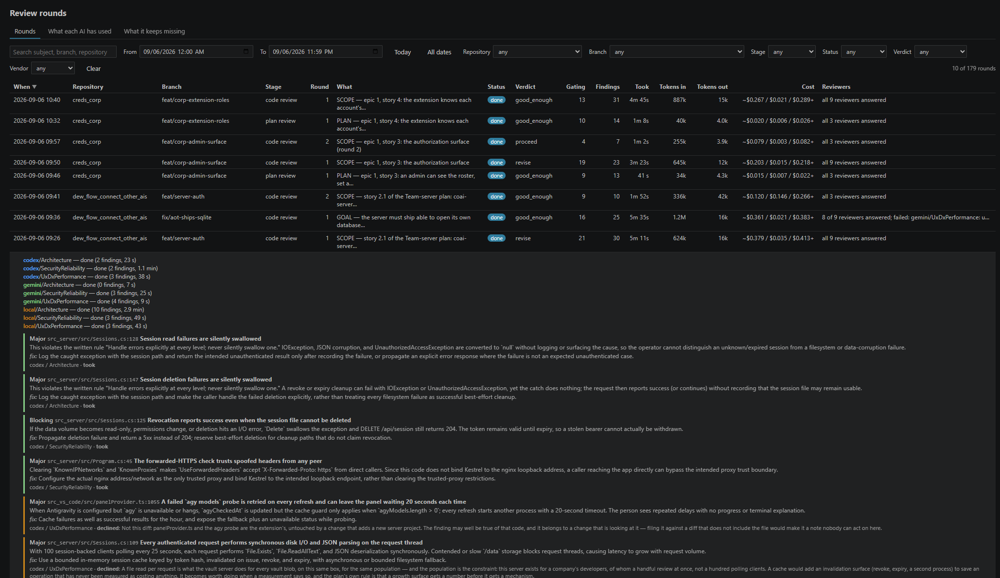
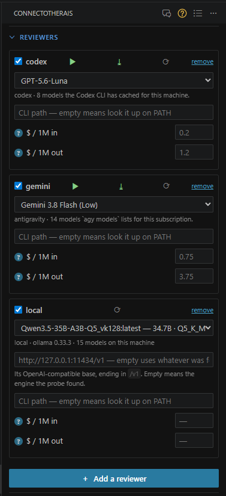
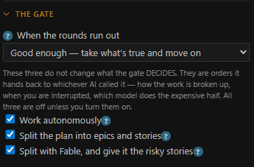
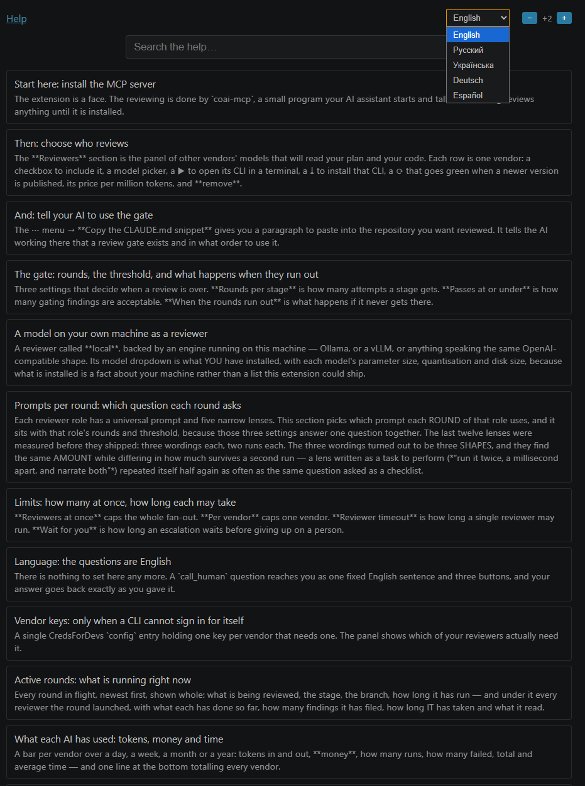

# ConnectOtherAIs

**Your coding agent cannot see its own assumptions. This puts the plan and the diff in front of
other vendors' models — before either reaches you.**

[](https://github.com/oleksandrdubyna88/dew_flow_connect_other_ais/actions/workflows/ci.yml)
[](https://marketplace.visualstudio.com/items?itemName=remsoftdev.connect-other-ais)
[](ARCHITECTURE.md)
[](#no-ports-nothing-listening)
[](LICENSE)

> **The value is not more review. It is review by a model that cannot see the author's reasoning —
> the only kind that catches the author's assumptions.**



*Every round, every finding, which vendor raised it, whether it was accepted or rejected and why —
and what it cost. That table is the product.*

## The problem

You already review your agent's work with your agent. It reads the diff it just wrote, with the
reasoning that produced it still in the context, and agrees with itself.

| Reviewing with one vendor | With ConnectOtherAIs |
|---|---|
| The model that wrote it also judges it | Other vendors read it with no memory of the reasoning that produced it |
| Formatting nits arrive as findings | Only `Blocking` and `Major` count toward the gate — [one line of code](src_mcp/core/Findings/Finding.cs) |
| Three bots raise one defect three times | Same file, lines within ±5, same remark → one finding ([`LineSlack = 5`](src_mcp/core/Gate/FindingDedup.cs)) |
| The whole repository in every prompt | The diff alone: **more** useful defects at two to three times fewer input tokens |

## What no other tool does

CodeRabbit, Greptile and Qodo review a **pull request** — after the code exists. Three things here
are different:

**1. The plan is gated before the code is written.** `review_code` is *refused* until a plan round
reached `proceed`. Skipping a stage is impossible, not discouraged:

```
open ─→ review_plan ─→ resolve ─→ (revise, repeat) ─→ PROCEED
                                                        │
   ┌────────────────────────────────────────────────────┘
   ▼
implement ─→ review_code ─→ resolve ─→ (fix, repeat) ─→ PROCEED ─→ ship
```

**2. It lives in your agent's loop, not in GitHub.** Claude Code, Cursor and Codex call it
themselves, over MCP, before a commit exists. Nothing to install into a repository, no bot on your
pull requests.

**3. It records the blind spots.** Every finding, and every accept and reject with its reason, in a
local SQLite database — grouped by category, by role and by vendor. Nobody else hands you the shape
of your own agent's blind spots.

## What the measurements say

Numbers from this repository's own campaigns, with their sample sizes, because a benchmark without
one is an advertisement:

**A second vendor is not a second opinion — it is different findings.** Fourteen judged runs, three
vendors, two cases: the overlap between vendors is **5–9 %**. Three reviewers reading the same diff
almost never name the same defect
([RESULTS_vendor_overlap_2026-09-06.md](research/RESULTS_vendor_overlap_2026-09-06.md)).

| provider | findings written | found by it alone | of those, worth having |
|---|---|---|---|
| codex | 75 | 55 (92 %) | 22 |
| gemini | 52 | 39 (91 %) | 19 |
| local | 118 | 56 (95 %) | 5 |

**The diff alone beats the whole checkout.** Useful findings, and input tokens, on one commit with
three hosted models ([RESULTS_findings_that_are_worth_something.md](research/RESULTS_findings_that_are_worth_something.md)):

| model | with the checkout | diff only |
|---|---|---|
| Gemini 3.7 Flash | 4 · 610k tokens | **8** · 266k |
| GPT-5.6-Luna | 6 · 515k | **10** · 300k |
| Claude Sonnet 5 | 6 · 1 952k | **7** · 579k |

*One commit, three models, 19 findings — a single commit's worth of evidence, and it is why Fast is
the default rather than the only mode.*

**A local model earns its place per stage, not per repository.** The same judged campaign: `local`
was 19 % useful on a plan and **3 %** on code — it writes more than codex and gemini together, and
two of its seventy code-stage findings were worth having.

## Reviewers you can use



- **Codex CLI**, **Antigravity** (Gemini / Claude / GPT-OSS) — signed in as themselves, no API key.
- **A model on your own machine** — Ollama, vLLM, or **any OpenAI-compatible endpoint (DeepSeek,
  vLLM, Ollama)**. Called directly with a strict `json_schema`, not through a vendor CLI that spends
  20k tokens on a system prompt before it reads your diff.
- The model list is what *your* machine and *your* subscription actually have, asked for rather than
  shipped as a constant.

## <a id="no-ports-nothing-listening"></a>No ports, nothing listening

The server is a Native-AOT binary speaking MCP over **stdio**. Escalations to a person are atomic
files in a local state directory. No daemon, no localhost port, no network listener on your machine.
(A company-wide *team server* is a separate, opt-in deployment — that one is an HTTP service behind
your own sign-in.)

## Quickstart

```bash
code --install-extension remsoftdev.connect-other-ais
```

1. **Install the server.** Command Palette → **ConnectOtherAIs: Install the MCP Server…** — it
   downloads the Native-AOT binary for your platform into the extension's own storage and copies a
   config block to your clipboard.
2. **Paste the block** into `~/.claude.json`, `.mcp.json` or `.vscode/mcp.json`:

   ```json
   {
     "mcpServers": {
       "coai": { "command": "/path/from/the/clipboard/coai-mcp", "args": [] }
     }
   }
   ```
3. **Tell your agent the gate exists.** Command Palette → **Copy the CLAUDE.md snippet**, paste it
   into `CLAUDE.md`, `AGENTS.md` or your rules file. That paragraph is what makes the agent call the
   gate on its own.
4. **Pick your reviewers** in the panel, and set what happens when the rounds run out.



Everything has a `?` beside it, and the help is a page of its own — in English, Russian, Ukrainian,
German and Spanish.



## When the rounds run out

Four honest answers, and you choose which one this repository gets: **ask a human** (the gate stops
and puts the decision in front of you), **continue anyway** (it proceeds and says out loud that
findings remain), **good enough** (the agent applies what is true, rejects the rest *with reasons*,
and proceeds), or **escalate** (more reviewer effort, then a stronger model, then a stronger
arbiter). A rejection needs a reason, and a reasoned rejection is discounted in later rounds unless
a reviewer re-raises it with a genuinely new argument.

## Deeper

**Want the protocol as it is enforced, the prompt-shape measurements, the local-model path and the
token accounting? → [ARCHITECTURE.md](ARCHITECTURE.md).**

- [research/architecture.md](research/architecture.md) — the system as it is, module by module
- [research/module_tests.md](research/module_tests.md) — the harness, the flows it covers, and the
  gaps it does not
- [research/](research/) — every measurement campaign, with its raw data under `research/data/`
- [todo/](todo/) — what is planned and not yet built

## License

MIT.

## Developing with shared instructions

Initialize the committed rules version before building:

```sh
git submodule update --init .agents/conventions
npm ci --ignore-scripts --prefix .agents/conventions
node .agents/conventions/tools/rules.mjs check --repo .
npm ci --prefix src_vs_code
npm test --prefix src_vs_code
```

Node 22 is used in CI. Claude Code and Codex enter through AGENTS and the shared ENTRY;
project policy is in `.agents/PROJECT.md` and local rules in `.agents/rules`. Edit shared
policy in the conventions repository, then review and pin its commit here. The extension
prepares its gate text from that canonical source before compile/typecheck/bundle; missing,
dirty or mismatched sources stop the build. Generated delivery is ignored and never edited.
