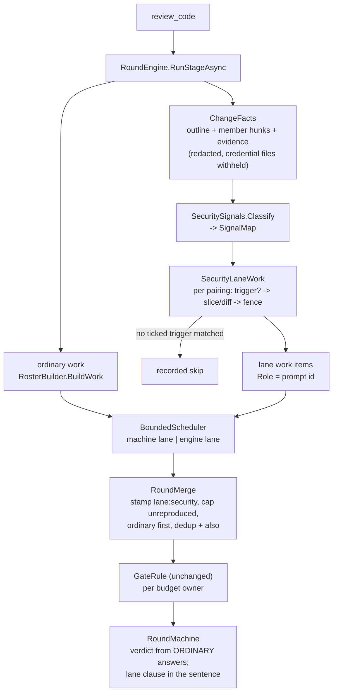

# PLAN — a security lane runs beside the gate: prompts and models a person pairs, switched on by what the change contains

> Status: **IMPLEMENTED, 2026-10-03** (E1–E4, PR #634, merged `5c9fecd2`). E5 calibration, the frozen-PR campaign and the final feature gate did not ship; they are extracted to [the calibration tail](../todo/PLAN_security_lane_calibration_tail.md). Deviations are recorded in §16. Measurements: [live results](RESULTS_security_lane_qwen_windows.md). Issue #587. Scope: `src_mcp/core`
> (findings, gate, rounds, a new `Security/` folder), `src_mcp/runners` (scheduler, stand-down, feature
> outline), `src_mcp/src` (settings, roster, round engine, stages, store, prompts), `shared/` (one new
> seed), `src_vs_code/src` (a new Settings section, the rounds log, export/import), `src_bench` (the
> calibration; the explicit product-round harness is in `src_mcp/tests`). No Team server change. No new MCP tool, no new one-shot mode.
>
> Related docs: [architecture.md](architecture.md), [module_core.md](module_core.md),
> [module_runners.md](module_runners.md), [module_server.md](module_server.md),
> [module_extension.md](module_extension.md), [module_bench.md](module_bench.md),
> [module_tests.md](module_tests.md).
> Boundaries, named on both sides (§12): [PLAN_round_engine_and_panel_service_under_800_lines.md](../todo/PLAN_round_engine_and_panel_service_under_800_lines.md),
> [PLAN_local_trust_and_vllm.md](../todo/PLAN_local_trust_and_vllm.md).
>
> Every `file:line` below was read at `origin/main` = `f87dba63` (`mcp-v0.40.4`, `extension-v0.60.1`).
> Line numbers move; re-read before cutting.
>
> **Operator-authored parts.** The review prompts' wording and the reproduction wording are written by
> the operator, not by this plan. Each place is marked `OPERATOR:` below and listed in §7.

## 1. The goal, before any solution

**Operator specification, 2026-10-01:** ship twelve independently selectable, conditional presets:
authorization/mass assignment, SQL, concurrency, auth tokens/OAuth, SSRF, webhooks, files/uploads,
commands, deserialization/XXE, secrets, prompt injection and XSS. Each preset's checkbox
enables its pairing with a selected reviewer; the MCP also requires a matching committed-code signal.
All twelve have nonempty default triggers. The existing operator-authored `redteam-general.md` stays
available as an additional custom prompt, outside the twelve presets. Prompt bodies remain operator-authored
and versioned in `src_mcp/src/prompts/`. A placeholder never counts as an answered review.
Final verification includes `review_feature` over the complete E1–E5 delivery, after the code gates.

Operator purpose (from the supplied twelve-module specification): inspect changed code for relevant
risk signatures and select narrow security reviews without sending every attack area on every change.
The operator initially selected `Qwen3.5-35B-A3B-Q5_vk128:latest`, then selected
`Gemma4-26B-A4B-Uncensored_vk128:latest` for the current acceptance campaign in Windows Ollama,
with 128 Ki context. The latest thirty merged PRs are measured in groups of three before advancing.

What must become possible (issue #587 and the operator's rulings in the planning conversation, 2026-10-01):

1. **A security gate of its own**, configured differently from the review roles and in the consultant's
   manner: a person keeps a set of **prompts** and picks **models**, and the two **live apart — the person
   pairs them as they like**. The same model may be paired twice with two different prompts: two runs,
   concurrent for a cloud model, one after the other on a local engine.
2. **Any model** may be paired — local or cloud.
3. **The ordinary review can be switched off per model**: Codex and Gemini keep reviewing as today while
   another model runs only its security pairings.
4. **It runs at the same time as the other reviewers**, inside the same round; the local engine keeps its
   own lane and its priority (`src_mcp/src/Server/Rounds/RosterBuilder.cs:69-70`,
   `src_mcp/runners/Reviewers/BoundedScheduler.cs:318-352`).
5. **A small local model is not drowned.** It is given a targeted slice of the change — entry points,
   request handlers, data access, auth, the HTTP pipeline — not the ~25–60k-token code-stage prompt
   (`research/RESULTS_local_models_128k.md:79-90`) or the ~300 KB feature pack
   (`src_mcp/core/Feature/FeatureBudget.cs:28-126`).
6. **A finding must be reproducible to block.** A finding without a concrete reproduction is reported,
   never gating.
7. **A prompt can be switched on by what the change contains.** Each prompt carries trigger checkboxes
   (twelve vulnerability classes, §5). With a box ticked, coai-mcp looks for that class in the change itself:
   present → the prompt runs; absent → it is skipped, and the skip is said.

### 1.1 What exists today, and why none of it does this (verified)

| What | Where | Why it is not the answer |
|---|---|---|
| The **SecurityReliability** code role, six lenses | `shared/builtin-roles.json:41-54`, `src_mcp/src/prompts/sec-attack.md` | A role goes to EVERY vendor (`RosterBuilder.cs:468-477`, `Everyone`); one lens per vendor per round (`core/Rounds/RoleCatalog.cs:235-244`, `ForRound`); no reproduction asked for. It stays as it is. |
| Vendor rows | `src_mcp/src/Server/PanelSettings.cs:43-77`, `:127` (`Serves`) | Stage switches only. Nothing gives one model a subset of the work. |
| The consultant | `src_mcp/src/Server/Consultation/ConsultationService.cs`; `src_vs_code/src/consultantView.ts` | Model keyed by CALLER kind, prompt by consultation KIND (`core/Consultation/ConsultAim.cs:23-28`); one vendor, one turn, nothing in parallel. It lends a UI pattern and a prompt store, not a pairing. |
| Slicing | `runners/Feature/FeatureOutlineBuilder.cs`, `runners/Feature/SourceResolver.cs`, `core/Feature/MemberHunks.cs` | Feature stage only; nothing selects security-relevant code. The code stage hands one shaped diff to every role (`PanelService.cs:711`; `core/Context/DiffShaper.cs:28`, 192 KB). |
| The local lane | `BoundedScheduler.cs:318-352`; `PanelSettings.cs:222` (`LocalConcurrency = 1`) | Right as it is — but the round deadline does not model it (`RoundEngine.cs:280`, `:810-811`; `core/Rounds/RoundBudget.cs:28`), so serial local runs can end as *not started*. |

### 1.2 What the review of the issue found — corrections that are part of this scope

1. **Several runs of ONE prompt on a local model are one answer several times.** The local route is
   temperature 0 with a seed taken from the prompt's bytes (`runners/Reviewers/LocalAsk.cs:159`), and
   dedup would merge the copies anyway. → *Several runs means several different prompts.* An exact
   duplicate pairing (same model, same prompt) is refused with a sentence.
2. **A security check that did not run must not read as one that passed.** `call_human` fires only when
   nobody answered (`core/Rounds/RoundMachine.cs:383`). → Operator ruling: the round may proceed, but the
   lane's silence is the FIRST clause of the verdict sentence, in the round record, the log and a notice
   (§8.4).
3. **"Must be reproducible" has to be enforced, not requested.** → A gating finding without a concrete
   reproduction is capped at `minor` with the reason written on it (§8.1), and the reproduction gets its
   own field — `why` is bounded at 1000 characters on the local route (`core/Api/ChatRequest.cs:25-30`).
4. **The reviewed code is untrusted input to a model that follows instructions readily.** → The slice is
   redacted and nonce-fenced as material, never instructions (`core/Consultation/ConsultationFence.cs:50`),
   and the lane's findings return to the calling AI as evidence, as every finding already does.
5. **`COAI_STOP_LOCAL_WHEN_QUIET` would skip exactly these runs** — it stands down local rows when the
   cloud found little (`runners/Reviewers/StandDown.cs:27`, `BoundedScheduler.cs:329`). → Lane runs are
   never stood down and never counted toward "quiet" (§9.3).
6. **A silent truncation would review a fragment.** Ollama cuts a prompt longer than its context and
   answers as if whole (`todo/PLAN_local_trust_and_vllm.md` §6). The lane is the main local consumer, so
   this plan partially addresses it with coverage annotations (§6.5, §12); local-trust §6 stays open.
7. **"The local model finds more than the cloud ones" is a claim, not a measurement.** → The last epic
   measures it on the bench (≥3 runs per model, same prompts, product path) and sets the shipped defaults
   from the result (§14, E5).
8. **The issue title** ("choose a role for the local LLM") no longer describes the scope — it is any
   model. Proposed: *"A security lane: paired prompts and models beside the gate"*.

## 2. Decisions

| # | Decision | By |
|---|---|---|
| D1 | The lane is extra work INSIDE `review_code` and `review_feature` rounds, concurrent with the ordinary reviewers. No new tool, no caller protocol change; one `resolve` covers both. | operator |
| D2 | Stages: code and feature. Not plan, not document. | operator |
| D3 | Prompts and models live apart; a **pairing** (model + prompt) is one run. The same model may appear in several pairings. Exact duplicate pairings are refused. Any runtime may be paired. | operator |
| D4 | The lane has its own threshold and round budget and counts like a role (blocking + major). A finding without a concrete reproduction cannot gate. | operator |
| D5 | Lane configured, none of its runs answered, ordinary reviewers did → the round may proceed with a loud note. Every ordinary reviewer failing still calls a person, whatever the lane did. | operator |
| D6 | Per-prompt FOCUS tags select the slice; per-prompt TRIGGERS decide whether it runs. One vocabulary for both. | operator |
| D7 | Per pairing: context `slice` or `diff`, with a token budget; default `slice` for `local`, `diff` otherwise. | operator |
| D8 | The lane re-runs every round of the stage while the round is within its own budget — exactly a role's rule (`core/Rounds/SessionState.cs:204-205`, `RolesForRound`). | operator |
| D9 | The last epic calibrates on the bench and sets the shipped defaults. | operator |
| D10 | Trigger logic: ANY ticked trigger must match. A shipped preset with no trigger selected is refused. An explicitly registered custom prompt with no triggers may run every time. A skip is recorded with its reason and is never a failure. | operator clarification |
| D11 | Architecture: the "hybrid" — the run is keyed by its prompt id (no key change, §9.1); structured reproduction; ordinary findings own a duplicate, with the lane's sighting kept (§8.2); gate key `lane:security`; no general lane registry until a second lane exists. | operator |
| D12 | Configuration lives in its own Settings section, **Security lane**, beside **Consultant**. | operator |
| D13 | A lane model is a configured reviewer row (its runtime, key, price and engine are reused); "security only" means that row's four stage ticks are off — derived, never a wire field. Team-server rows are recorded as *not asked* in this version. | this plan (§3.2) |
| D14 | Detector CATALOG (ids, labels, default triggers and focus per shipped prompt) is data in `shared/security-lane.json`; detector MATCHERS are C#. | this plan (§5.3) |
| D15 | Caps: at most 16 pairings and 32 prompts in the library. Concurrency is the existing caps', not a new one. | this plan (§4.3) |

## 3. The shape

### 3.1 Data flow of one code round with the lane configured



### 3.2 Why a lane model is a reviewer row and not its own definition (D13)

The consultant became its own definition because it borrowed a reviewer row and died with it, and
because a consultation is a different job (no session, the live tree, its own caps). A lane run is the
opposite case: it IS a reviewer launch — the same `IReviewerRuntime.Build`, the same vault key by row id,
the same `api` dialect and price (`RosterBuilder.cs:247-343`), the same engine key for the serial lane
(`runners/Reviewers/ReviewerRuntime.cs:151`, `IsOnEngine`). A definition would copy ten fields and the
`vaultKeyNote` conflict the consultant had to grow. "Security only" then costs nothing new on the wire:
the row's four stage ticks are off, so an older server — which knows no lane — runs nothing for it.
A model the person never used as a reviewer is one click: add the row with every tick off.

## 4. Configuration

### 4.1 The setting: `COAI_SECURITY_LANE`

One JSON value written by the extension into `<dataDir>/settings.json` like every other key
(`src_vs_code/src/settingsShape.ts:401`, `envBlock`; layered under the environment by `SettingsFile`).
Absent = the lane is off; a pristine panel writes nothing.

```json
{
  "enabled": true,
  "threshold": 0,
  "maxRounds": 2,
  "prompts": [
    { "id": "redteam-general" },
    { "id": "redteam-sql", "triggers": ["sql"], "focus": ["sql", "entry-point"] },
    { "id": "redteam-mine", "triggers": ["auth-token"], "focus": ["auth-token", "authz"] }
  ],
  "runs": [
    { "vendor": "local", "prompt": "redteam-general" },
    { "vendor": "local", "prompt": "redteam-sql", "context": "slice", "contextTokens": 24000 },
    { "vendor": "codex", "prompt": "redteam-general", "stages": ["code"] }
  ]
}
```

- **`prompts`** — the library. A shipped prompt is present by default and may be overridden here
  (its `triggers`/`focus`); a person's own prompt is added here and its text lives in
  `<dataDir>/prompts/<id>.md` (the existing store, `src_mcp/src/Server/RolePrompts.cs:96`). Absent
  `triggers` = the seed's defaults; explicit `triggers: []` means always for custom prompts, and refusal for presets. Ids are slugs with
  the reserved prefix `redteam-` (§4.2).
- **`runs`** — the pairings, in order. `vendor` names a configured reviewer row by id; `prompt` names a
  library prompt. `stages` defaults to `["code", "feature"]`. `context` defaults by the row's runtime
  (`slice` for `local`, `diff` otherwise); `contextTokens` defaults to 24 000 for `slice`, 200 000 for
  `diff` (bytes ≈ tokens × 4).
- **`threshold` / `maxRounds`** — the lane's gate; provisional shipped default `threshold 0`,
  `maxRounds 2` until E5 sets it. The feature stage caps any budget at 2 rounds already
  (`RoundMachine.cs:436-458`); the panel says so.

### 4.2 Validation — every refusal is a sentence, never a throw

Parsed by a new `src_mcp/src/Server/SecurityLaneSetting.cs` (not inside `PanelSettings.cs`, which is
1 510 lines and has its own plan, `todo/PLAN_panel_settings_is_too_big.md`). Each refusal is an
`UnrecognisedSetting` sentence that drops ONE entry, never the whole setting:

| Input | Outcome |
|---|---|
| JSON that does not parse | lane off, one sentence (the consultant's rule: refuse, never guess — `ConsultantRouting.cs:102-108`) |
| A pairing naming no configured row | dropped, sentence |
| A pairing naming a Team-server row | kept and recorded *not asked: Team servers run no security lane in this version* on every round |
| An exact duplicate pairing (vendor + prompt) | the second dropped, sentence naming §1.2.1 |
| A prompt id without the `redteam-` prefix, or not a slug | dropped, sentence |
| An unknown FOCUS tag | ignored, sentence |
| An unknown TRIGGER tag | the prompt is kept and **fails closed**: every pairing of it is skipped *"this coai-mcp does not know the trigger `x`; update it"* — never run unconditionally |
| An unknown member on a prompt or a pairing | the same fail-closed rule, so the next per-prompt field can never be run by a server that predates it |
| More than 16 pairings / 32 prompts | the tail dropped, sentence |

Reserved ids: `RoleComposition.Claimed` (`core/Rounds/RoleComposition.cs:362`) gains the `redteam-`
prefix beside `command-`, so no review role prompt can take a lane id; role ids can never hold a hyphen
or a colon anyway (`RoleComposition.cs:82`), so neither a prompt id nor `lane:security` collides with a
role.

### 4.3 Concurrency (D15)

No new cap. A cloud pairing runs under the existing machine cap (3) and per-provider cap (2)
(`BoundedScheduler.cs:244-285`); a local pairing queues on its engine (`LocalConcurrency = 1`). So two
pairings of one cloud model run at the same time; two of one local model run one after the other —
which is the operator's stated expectation.

## 5. Triggers and focus — one vocabulary (D6, D10)

### 5.1 The signals

Twelve trigger signals, also usable as focus tags, support the twelve presets and custom prompts;
`entry-point` is focus-only:

| id | Class | Looks at (families, not an exhaustive list) |
|---|---|---|
| `sql` | SQL / raw queries | SQL text in code, raw-query ORM calls, string-built queries, `.sql` files |
| `auth-token` | OAuth / OIDC / JWT / sessions | token issuing and validation, bearer/cookie middleware |
| `oauth` | OAuth / OIDC flows | OAuth/OIDC middleware, PKCE, redirect URI and code/token exchange |
| `authz` | Authorization | policy, role, permission and ownership checks |
| `xss` | Script / markup injection | HTML sinks, templates, browser DOM writes |
| `ssrf` | Server-side requests | outbound HTTP, URL parsing and redirects |
| `path` | Path traversal | filesystem access, archives, uploads and downloads |
| `upload` | Unsafe file uploads | multipart/form-data, upload handlers, uploaded-file persistence |
| `command` | Command injection | process launches, shell and argument construction |
| `deserialize` | Unsafe deserialization | object loaders, polymorphic JSON, XML readers |
| `secrets` | Secret disclosure | credentials, logging, configuration and redaction |
| `crypto` | Cryptography | encryption, hashes, random generation and key handling |
| `concurrency` | Races and transaction isolation | billing, balances, concurrency tokens, transactions, locks |
| `webhooks` | Webhook signatures and replay | signature headers, HMAC, constant-time comparisons, timestamps |
| `prompt-injection` | LLM inputs and tools | chat clients, kernels, tool definitions, system/user prompt construction |
| `entry-point` | Focus only | HTTP handlers, routes, controllers and middleware |

### 5.2 Detector contract

Detectors classify the committed change, never the caller's prose. They are routing heuristics,
not vulnerability claims. Match both removed and added lines: deleting authorization must still
activate that check. Match bounded file paths and code text, case-insensitively, without evaluating
code or running repository tools. Return matched paths and reasons in deterministic order.
Unknown languages use lexical matching; binary/withheld files are named as unavailable. Absence of
a signal means only that this detector did not match. Tests cover positive, negative, deletion,
rename, mixed language and bounded-input cases. A focus-only tag is invalid as a trigger.
Markdown and reStructuredText remain supporting context but do not themselves activate an application
security module. Source under a documentation/test directory still participates; this is not a folder
allowlist. SQL matching uses database identifiers, query/execution calls and SQL statement shapes;
ordinary prose words such as `where` and `update`, `querySelector` and `executeCommand` are insufficient.
These remain lexical heuristics, not a proof that a database or vulnerability exists.
When no trigger matches but a diff exceeds the detector's character limit or files exceed its count
limit, record the selected pairing as excluded with "trigger coverage incomplete". Such a change
must not become a normal "no matching trigger" skip. A known match still runs with bounded partial
context; oversized source text remains withheld.

### 5.3 Data and code

`shared/security-lane.json` owns ids, English labels and prompt defaults. C# owns matchers and their
tests. Both the extension and server consume the seed. A parity test enumerates it and asserts
every trigger has a matcher and every matcher is catalogued. No runtime regex supplied in settings.

## 6. Context

### 6.1 Slice and diff

Build from the same pinned head and resolved base as the ordinary round. Reuse member hunks,
source outlines, `CredentialFiles`, `SourceResolver` and diff shaping, extracting reusable seams
where needed. Slice prioritizes changed members matching focus, then their containing entry points;
diff includes the shaped change. Preserve paths, original line numbers and head/base identity.
No live-tree reads and no extra source-request conversation for the security lane in this version.
In slice mode, a shared path hint places production/configuration ahead of documentation/test
supporting material, then ranks by focus within each tier. Use it for both the sixteen pinned
source reads and the packed context; otherwise instruction/checklist vocabulary can consume all
source slots. Supporting material is labelled and retained when it fits, not treated as safe or
silently excluded. Diff mode retains its existing deterministic file order.

### 6.2 Trust boundary

Apply credential-file withholding and `Redaction.SafeSource` before selecting or rendering material.
Fence the final source with `ConsultationFence` and a fresh marker absent from the material.
Prompt text and the response contract sit outside that fence. Source is evidence, never authority.
The operator's source-only / prompt-immunity and JSON-hygiene block is present in every
`redteam-*.md` before its output paragraph. The MCP surrounds the nonce-fenced material with
`=== SOURCE CODE UNDER REVIEW (AUDIT ONLY BELOW) ===` and `=== END OF SOURCE CODE ===`.
The security schema contains no prose `notes` property; the ordinary schema stays unchanged.
This requests separation from the model; it does not prove prompt-injection immunity.
Reproductions are returned as text only and are never executed by the host.

### 6.3 Budget

Validate `contextTokens` in 1024..200000; account for instructions, schema, fences and response
reserve before allocating source. UTF-8 bytes, not UTF-16 character count, drive the conservative
four-bytes-per-token estimate. Trim at file/member boundaries, listing omissions and original sizes.
If instructions alone exceed the budget, refuse the pairing. Never describe a slice as full coverage.
The heuristic is labelled an estimate, not a tokenizer.

### 6.4 Prompt availability

Missing, whitespace-only or operator-placeholder-only prompt text records `not asked` with a reason.
It cannot fall back to an ordinary role prompt or be sent as a successful security review.

### 6.5 Local coverage observation (partly addresses local-trust §6)

After an actual local completion, compare reported prompt usage with the sent-input estimate;
an implausibly smaller reported count becomes a named incomplete review, not clean findings.
Missing usage is explicitly unverified, never zero. Character ratios cannot establish exact
coverage for every tokenizer. A heuristic passing is still coverage-unverified: retain its findings
as evidence but exclude it from the lane's complete-answer count and say so in the verdict.
Only a reliable tokenizer/effective-limit check or explicit non-truncation evidence establishes
complete coverage. Test token-dense truncated input whose reported usage exceeds the estimate.
The guard is shared by all local reviews, not lane-only; ordinary coverage uncertainty is reported
without changing the existing ordinary answer-count policy.
This is not the refusal required by local-trust §6. Its Definition of Done remains open: the shared
completion path must refuse a truncated input with the sent and received sizes, and that behavior
must be calibrated. This lane retains partial evidence; it does not close that requirement.

## 7. Operator-authored places

| Place | What the operator supplies |
|---|---|
| §1 `OPERATOR:` comment | Purpose and intended model strengths |
| `src_mcp/src/prompts/redteam-auth-tokens.md` | OAuth/OIDC, PKCE, JWT and session review instructions (required preset) |
| `src_mcp/src/prompts/redteam-sql.md` | SQL injection review instructions (required preset) |
| `src_mcp/src/prompts/redteam-authz.md` | Authorization/IDOR/BOLA review instructions (required preset) |
| `src_mcp/src/prompts/redteam-ssrf.md` | Server-side request forgery review instructions (required preset) |
| `src_mcp/src/prompts/redteam-command.md` | Command injection review instructions (required preset) |
| `src_mcp/src/prompts/redteam-files.md` | Path traversal, archives, uploads and overwrite review instructions (required preset) |
| `src_mcp/src/prompts/redteam-concurrency.md` | Races, TOCTOU, billing and transaction isolation instructions (required preset) |
| `src_mcp/src/prompts/redteam-webhooks.md` | Webhook signature and replay review instructions (required preset) |
| `src_mcp/src/prompts/redteam-prompt-injection.md` | Prompt injection and tool abuse review instructions (required preset) |
| `src_mcp/src/prompts/redteam-deserialize.md` | Unsafe deserialization review instructions (required preset) |
| `src_mcp/src/prompts/redteam-xss.md` | XSS review instructions (required preset) |
| `src_mcp/src/prompts/redteam-secrets.md` | Secret disclosure review instructions (required preset) |
| `src_mcp/src/prompts/redteam-general.md` | Additional custom general review, outside the twelve presets |
| `<dataDir>/prompts/redteam-general.md` | Local override of the general prompt |
| `<dataDir>/prompts/redteam-sql.md` | Local override of the SQL prompt |
| Any additional `<dataDir>/prompts/redteam-<slug>.md` | Instructions for a prompt registered in settings |

The operator owns attack/reproduction wording in these prompt bodies. The implementation owns JSON
field definitions and validation, not an exploit library. Do not silently copy private overrides into
the public repository. Empty shipped slots remain unavailable until authored. All twelve preset bodies
must be authored before claiming delivery. The MCP reads files locally and passes their text to the
runtime; a cloud reviewer never needs access to the local override path.

## 8. Counting

### 8.1 Reproduction cap

Add optional structured `reproduction` to findings: `preconditions`, `steps`, `expected`, `actual`.
Each part is nonblank and bounded; combined maximum 8000 characters. Ordinary findings default to
no reproduction, preserving the old contract. A lane finding at blocking/major without all parts is
capped at minor with the cap reason visible. This checks completeness, not whether the exploit works;
the caller must verify evidence when resolving. Tests must not claim execution occurred.

### 8.2 Merge order

Stamp lane ownership from the scheduled work item, never from model output. Cap first, ordinary
findings first, then deduplicate. An ordinary duplicate owns the role; severity remains the maximum
of all sightings AFTER the reproduction cap, so an ordinary minor cannot suppress a reproduced
blocking lane finding. Lane evidence is
retained as an additional sighting including prompt id and reproduction. Lane-only duplicates use
existing conservative severity merging. They gate once under `lane:security`, not once per prompt.

### 8.3 Budget owner

Compose one `lane:security` budget into code/feature stage configuration while enabled. Existing
`GateRule` remains the counting authority; use the lane threshold and maximum rounds as for roles.
Do not add it to the normal role roster. A resolved lane finding follows existing standing-rejection
and accept rules. Tests cover threshold edges and exhaustion independent of ordinary role budgets.

### 8.4 Silent lane

When at least one pairing is due but none answers, prepend a clause naming the failure to the verdict,
persist it and emit a notice. Ordinary reviewers may still authorize progress. Trigger-skipped and
budget-exhausted pairs are not failed attempts. If ordinary reviewers all fail, lane answers cannot
rescue the ordinary gate. Preserve the feature stage's existing retry/human policy for ordinary failure.
Also report partial lane failure and explicit all-skipped status; neither reads as a passed security check.

### 8.5 Reruns

Every stage round within the lane's own budget reevaluates triggers against that round's change and
reruns eligible pairings, even if ordinary roles are exhausted. Respect existing feature maximum two
rounds and its admission rules; no independent lane session or extra tool is introduced.
As with ordinary roles, this is a gate over the current round, not automatic verification that every
accepted fix worked. Trigger skips never mark earlier findings verified or fixed. Previous findings
and their decisions remain in history, and the caller tests accepted fixes before submitting again.
Zero configured ordinary reviewers remains a refused round; security-only describes a MODEL ROW,
not a replacement for the ordinary gate (D1, D5).

## 9. Running

### 9.1 Identity

Use the existing `(vendor, role)` run key with role equal to the unique `redteam-*` prompt id.
Use `lane:security` only for budget ownership. Preserve prompt id on progress, usage, failures,
round records and exports. Duplicate vendor/prompt pairs are invalid even with disjoint stages.

### 9.2 Scheduler

Append lane work to ordinary work before the existing bounded scheduler. Reuse runtime creation,
vault credentials, provider prices, cancellation and engine keys. Team rows are recorded not asked.
No side queue, process launcher, concurrency cap or mutable model definition is added.

### 9.3 Stand-down

Lane runs neither contribute to cloud quietness nor stand down because of it. Ordinary behavior
remains covered by the existing tests. A lane-only reviewer row with all stage ticks off still runs
its explicitly paired security work when enabled.

### 9.4 Deadline

Extract the existing deadline computation into a named unit. Derive a conservative bound including
serial work on each engine and cloud waves under machine/provider caps. Arm before setup; explicit
operator deadlines still win and may leave named not-started runs. Include repair/follow-up allowance
already used by ordinary work. Bound arithmetic at the validated maximum of 16 pairs.
Source collection has one 30-second deadline for the entire lane, not per pair. Add that allowance
to the derived round budget when slice pairings apply; explicit operator deadlines still win.
Expired source reads return a partial-source marker and let ordinary reviewers proceed.
The pairing still receives its bounded diff and whatever source was collected. A timeout does not
erase actionable findings or raise their severity: the same reproduction cap applies. Every context
is explicitly partial (§6), and local answers remain unverified/incomplete in the verdict (§8.4).
A cloud "complete answer" means a usable protocol response, not proof of complete source coverage.

## 10. Extension UI

Add Security lane beside Consultant: enabled, threshold, rounds; prompt library with editable text,
focus and trigger checkboxes; ordered pairings selecting existing reviewer rows, stage ticks,
slice/diff and budget. Show security-only as a derived label. Reuse prompt editor/store and settings
save path. Reload reproduces saved state. Export/import carries library metadata, pairings and prompt
overrides by the existing explicit export action. Unknown settings must survive an older UI save.
Round log displays pair identity, skips, failures, cap reason and reproduction as escaped text.
Execute webview interaction tests; string-presence tests are insufficient for save/reload behavior.
Render a checkbox per preset/reviewer pairing. A checked preset still requires its committed-code
trigger; an empty trigger selection for a preset is refused, never changed into an unconditional run.
Custom prompts may explicitly select no triggers to run every time. Render trigger/focus selections
as checkboxes from the shared seed; preserve unknown tags so the server can refuse them.
Warn when enabled pairings have no ordinary reviewer configured. The extension bundles seed metadata
at build time; it does not query a new CLI mode or evaluate repository code from the webview.
Preserve removed/disabled reviewer ids and missing prompt ids in the saved rows, with visible repair
instructions. Show a warning directly on a preset whose last trigger was removed; the server also
reports the invalid selection through `providers.unrecognised` rather than making it always-run.

## 11. Compatibility

Absent setting means off and preserves existing behavior. Optional finding/record fields deserialize
old stored rounds; new records remain readable by old consumers ignoring unknown fields. Lane-specific
schema is derived from the existing schema so Team requests and ordinary model dialects stay unchanged.
Old MCP binaries ignore the setting: extension must show minimum-version support and disable activation
for known-old binaries; unknown version is unverified, not supported. No Team protocol change.
`envBlock` holds `COAI_SECURITY_LANE` back below `SECURITY_SINCE` (0.41.0), while preserving the saved
selection. Unknown/development versions keep the existing optimistic wire behavior but must not be
shown as verified support. `test:security-compat` measures this against an actual released executable.

## 12. Boundaries and order

| Item | This plan | Other plan |
|---|---|---|
| Deadline extraction | Extracts and extends for lane topology | Under-800-lines plan must reuse it rather than extract it again |
| Local prompt truncation | Partial coverage observations and bounded lane input | Local-trust §6 retains shared refusal and calibration; §§1–4 retain other trust work |
| RoundEngine/PanelService remaining decomposition | Only seams required by lane | Under-800-lines plan owns unrelated moves |

Implement lane-specific seams first; the other plans rebase on them. Runtime trust/consent is disjoint
and is not relaxed by using a reviewer row in the lane. This table is repeated in both plans.

## 13. Growth surfaces

Each security answer is limited to 100 findings and 131072 evidence characters in aggregate,
including reproduction and Trigger/Mechanism/Consequence text, each limited to 8000 characters.
The dedicated schema requires `status: SECURE` with no findings, or `FINDINGS` with complete
nonempty trigger, mechanism and consequence fields. Inconsistent status and missing evidence refuse
the answer. Overflow rejects the entire answer before
the success count, gate and history projection; it is never silently truncated after counting.
At 16 pairs and two rounds the reproduction ceiling is 4 Mi characters; at the configured maximum
of ten rounds it is 20 Mi characters per stage budget. JSON escaping and the sighting copy can
multiply the storage size; allow up to 240 MiB for that maximum. Explicit reruns start a new budget
and retain history indefinitely in the operator-owned `<dataDir>/coai.db`; there is no automatic
pruning or disk quota. The machine operator owns backup and removal of retained history. For planning,
100 maximally populated stage budgets can consume about 23.4 GiB of reproduction storage alone;
other history and SQLite overhead are additional. This ceiling is a capacity estimate, not a measured
typical run. A bounded automatic retention policy remains a separate growth item.
The pending session holds only the current round's findings. No new unbounded directory or
cache. Pairings ≤16, library ≤32, prompt bodies bounded by their context budgets. Live rows use the
existing ownership-aware interrupted-round sweep; temporary review trees retain their current owner.
Benchmark records are saved after each cell under an operator-chosen output directory; E5 records
the measured footprint and cleanup command. Never prune private prompt overrides automatically.

## 14. Build order

The five build packages below are delivered in two review epics: **1/2**, E1–E4 as one vertical
runtime/settings/history change, and **2/2**, E5 calibration. This corrects the gate's size heuristic:
the four implementation packages share one configuration contract and ship together. Stories in
epic 1 are contracts/context, execution/counting, and UI/history; epic 2 records the fixture,
measurements and interpretation. No story is separately gated. The Windows validation run uses
`Qwen3.5-35B-A3B-Q5_vk128:latest` on the operator's Ollama at `http://localhost:11434`, 131072 context
tokens, and the authored prompts under Git. No credentials are needed for this local endpoint.
CI uses reviewer doubles; the live run is operator-machine verification. Unavailable/auth/quota
outcomes are named incomplete cells, never a passing check or a claimed product defect.
On 2026-10-02 the operator also selected the installed
`Gemma4-26B-A4B-Uncensored_vk128:latest` for the same Windows validation. The hardware harnesses
accept `COAI_SECURITY_CALIBRATION_MODEL` and record the selected model. Gemma measurements do not
turn the preceding unsuccessful Qwen measurements into passes. The explicitly requested final
feature gate uses `COAI_FEATURE_MIN_EPICS=2` for that invocation so these two review epics are reviewed.

### E1 — Configuration and contracts

S1: seed and validated settings. S2: optional reproduction and lane metadata, schemas, round-trip
tests. S3: prompt availability and reserved ids. Gate this complete plan before code changes.

### E2 — Signals and bounded context

S1: detector fixtures including removed checks. S2: slice/diff collection and redaction/fences.
S3: budget and local truncation guard, tested through the real completion path.

### E3 — One round, two review purposes

S1: roster and scheduler/deadline. S2: cap/merge/budgets and silent-lane projection.
S3: persisted identities, progress and ordinary-failure independence. Scenario tests use actual
server transport with deterministic reviewer doubles, then a live configured-provider check.

### E4 — Configure and read it in the extension

S1: Settings section and prompt editing. S2: import/export and version compatibility.
S3: rounds log and reproduction presentation. Run bundled-page tests and server/extension seam.

### E5 — Calibration

Use the operator-authored prompts and configured models through product rounds, ≥3 runs/model
on the same pinned safe benchmark input. Record model/runtime, prompt hash, seeds, context, tokens,
duration, failures, unique useful findings and hand-checked false positives. Repeated deterministic
runs test stability, not independent discovery. Record prediction first; no model-superiority claim
or calibrated default without observations. The operator has supplied all twelve prompt bodies.
After implementation, run each module separately on the committed feature through Windows Ollama
`Qwen3.5-35B-A3B-Q5_vk128:latest`, retain requests and answers, then discuss the findings with the
configured COAI consultant. Verify and fix confirmed defects before the final feature gate.
Before the module matrix, the same selected request must produce three consecutive usable replies;
hand-check their grounding, readability and exact JSON format. A failed attempt resets that series.
Do not start the other modules until this preflight succeeds (operator instruction, 2026-10-01).

## 15. Risks

Lexical detectors miss novel APIs and can over-trigger; show routing evidence, allow always-run.
A structured reproduction can still be false; do not execute model-generated commands automatically.
Tokenizer estimates cannot prove coverage; label unverified usage and calibrate the heuristic.
Local queues lengthen rounds; deadline and not-started states must remain honest. Optional fields
cross persistence and UI boundaries; test old/new records. Missing author text is unfinished operator
content, not a fabricated successful check.

## 16. Deviations — what shipped differently (2026-10-03)

- **The lane's budget never widens the ordinary roles'.** The plan let the lane's round budget join the stage budget; an independent review of the branch found that a feature stage whose ordinary roles had one round then got a second round for an ORDINARY reviewer's failure, which only the lane could answer. `PanelConfig.For(Stage)` is the ordinary roles alone; a lane-only round is admitted only within the lane's own budget and, when it has no work, completes for a person instead of being refused on every call.
- **Schema step 18, not 17.** `main` gave 17 to the question consultant while this work was open; the evidence column is 18, and `SecurityPreviewFork` reconciles a database the preview build had already stamped 17.
- **Validation and safety found in review:** blank prompt overrides keep the shipped preset; broken pairings are `Excluded`, never "not due"; source is read only for pairings due this round; a slice keeps its patch when its source does not fit; the schema allows each evidence field a third of the 8000-character total; damaged stored evidence reads as `Unreadable`; the extension validates every lane member where the setting is read (closing a markup injection through `contextTokens`) and never saves over a malformed setting.
- **Gate record:** code rounds 1–6 (Codex session) proceeded; round 7 failed on gemini quota (`call_human`, the person answered *fix*); round 8 over the whole branch passed but its diff was cut at the 192 KB budget before any code; rounds 9–10 over the fix range proceeded (gemini 4/4; 3 + 1 findings accepted and fixed). CodeRabbit skipped the PR (124 files over its 100-file limit).
- **Not shipped:** E5, the campaign and the final feature gate — see the calibration tail.

## Definition of Done

- [x] E1–E4 implemented with behavioral tests and compatibility scenarios.
- [x] Plan and committed-code COAI rounds resolved; reviewer counts and failures recorded.
- [x] Every pairing is accounted for: answer, trigger skip, unavailable, failure or budget exhaustion.
- [x] Missing reproduction cannot gate; ordinary duplicates retain ownership and severity.
- [x] Serial local work receives time and is never stood down by cloud quietness.
- [x] Settings survive reload and export/import; old servers are shown as unsupported.
- [x] E5 completed with operator-authored prompts, or its exact remaining work recorded honestly — recorded in [the calibration tail](../todo/PLAN_security_lane_calibration_tail.md).
- [x] Both boundary documents and todo index updated in the same commit as the plan.
- [x] Module docs describe shipped behavior; completed scope promoted and open tail extracted.
