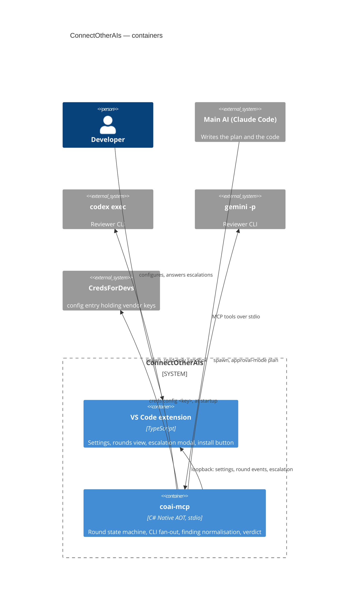

# ConnectOtherAIs — architecture

> The system **as it is**. Right now that is mostly scaffolding: the repository skeleton exists, the
> product does not yet. Each epic that lands updates this file and adds its `module_*.md`; a diagram
> here that shows unbuilt parts is marked *(planned)* until the code exists.

## What this is

A multi-model review gate. The main AI writes the plan and the code; secondary vendor CLIs review
both in rounds until the de-duplicated count of blocking+major findings drops under a threshold, or
a human is escalated to. Design record: [../todo/PLAN_connect_other_ais.md](../todo/PLAN_connect_other_ais.md)
until implemented, then promoted here.

## Containers *(planned — epics 02–05)*

## Module map

| Module | Doc | Status |
|---|---|---|
| Repository foundation (build, logging, CI) | *(this file, for now)* | epic 01 — in progress |
| Pure core (findings, sanitizer, counting, rounds) | `module_core.md` | epic 02 — not started |
| Reviewer runners (worktrees, scheduler, vendors) | `module_runners.md` | epic 03 — not started |
| `coai-mcp` server | `module_server.md` | epic 04 — not started |
| VS Code extension | `module_extension.md` | epic 05 — not started |

## Cross-cutting decisions already in force

- **Solution layout follows `dew_flow_creds_for_devs`**: `src_mcp/{src,tests}`, later
  `src_vs_code/`; central package versions; net10.0; `TreatWarningsAsErrors`.
- **Tests are MTP executables** (xUnit v3); `dotnet test` aborts here by design of the toolchain.
- **Logging** per the shared Serilog rule; stdio hosts log console to stderr.
- **Conventions** are the `dew_flow_conventions` submodule at `.claude/rules/shared`;
  `.claude/settings.json` is a byte-identical copy of its reference.
