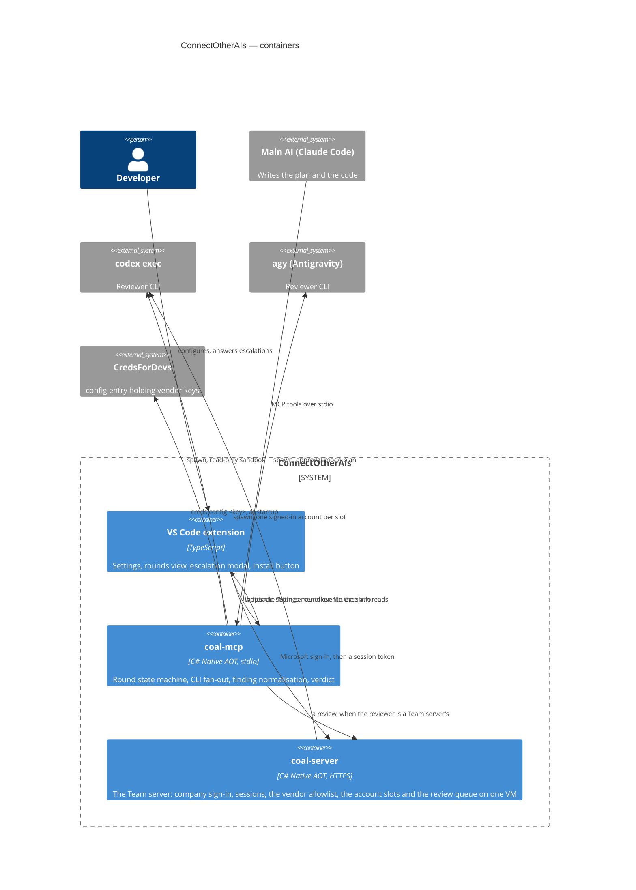

# ConnectOtherAIs — architecture

> The system **as it is**. All six epics and the escalation tail shipped on 2026-08-31: the server
> runs the loop from any MCP client, the extension installs it, and `ask_human` reaches a person in
> VS Code ([PLAN_escalation_loopback.md](PLAN_escalation_loopback.md)) — observed end to end, a
> question asked by the installed binary and answered in the installed extension.

## What this is

A multi-model review gate. The main AI writes the plan and the code; secondary vendor CLIs review
both in rounds until the de-duplicated count of blocking+major findings drops under a threshold, or
a human is escalated to. Design record: [PLAN_connect_other_ais.md](PLAN_connect_other_ais.md)
until implemented, then promoted here.

## Containers

## Module map

| Module | Doc | Status |
|---|---|---|
| Repository foundation (build, logging, CI) | [PLAN_epic_01_foundation.md](PLAN_epic_01_foundation.md) | **shipped 2026-08-31** |
| Pure core (findings, sanitizer, counting, rounds) | [module_core.md](module_core.md) | **shipped 2026-08-31** |
| Reviewer runners (worktrees, scheduler, vendors) | [module_runners.md](module_runners.md) | **shipped 2026-08-31** |
| `coai-mcp` server | [module_server.md](module_server.md) | **shipped 2026-08-31** |
| VS Code extension | [module_extension.md](module_extension.md) | **shipped 2026-08-31** (escalation loopback deferred) |
| Team server (`coai-server`) | [module_team_server.md](module_team_server.md) · [PLAN_team_server.md](PLAN_team_server.md) | **epics 1–3 complete, 2026-09-06** — the host, company sign-in, sessions, the vendor catalog, the account slots, `login`, the job queue with the review endpoints, and per-person usage with the admin company view; every route has an `http/` contract. The client runtime (`remote`, `--ask-remote`) and the panel's *Team servers* section, add-a-reviewer and spending block are in; a sign-in belongs to a SIDE of the machine, and the *Server* section shows the address read-only with the server's version beside it. The container, the host edge and the release are epic 4; the per-PERSON spending view is [../todo/PLAN_team_usage_by_person.md](../todo/PLAN_team_usage_by_person.md) |
| Measurement bench (`coai-bench`) | [module_bench.md](module_bench.md) · [../src_bench/README.md](../src_bench/README.md) | **shipped 2026-09-04** — drives the published server over stdio, records whole, judges separately |
| Tests: the harness, its flows, its gaps | [module_tests.md](module_tests.md) | **recorded 2026-09-06** — three suites in-repo, the flow catalogue derived from the tool registry, and the two gaps named (no extension host, no real vendor in CI) |

## The one interface neither container owns (2026-09-06)

The Team-server **token file** is written by the extension and read by `coai-mcp`, and neither is the
other's caller — they meet only at a path. Both derive that path independently: TypeScript's `URL`
in `teamServers.ts`, .NET's `Uri` in `TeamServerAuth.cs`, hashed to
`<dataDir>/servers/<sha256(canonicalUrl)[..16]>.token`.

Isolated tests on each side cannot see a divergence, because each side is self-consistent. The
failure appears only as somebody signing in successfully and being told they are not signed in one
second later. So the vectors live in `shared/team-server-url-vectors.json`, outside both
implementations, and **both suites assert them** — 38 C# assertions and their TypeScript twins.

The same shape governs `remoteVendor`: the row id is `<serverId>-<vendor>` because it must be unique
across servers, while `--vendor` must carry the SERVER's own spelling. Two names for one thing, and
the moment either side normalises the wrong one, every review on that server is refused as a vendor
it "does not offer".

**That prediction came true before the paragraph was a week old, and in the one way it did not
cover: not a side normalising the wrong name, but a side never sending it.** The extension's
`vendorsEnv` omitted `remoteVendor` from `COAI_VENDORS` for the whole of 0.31.0–0.31.2 while the
server parsed it faithfully. Every Team-server reviewer was therefore dropped from every round —
silently, because a round did not report a reviewer it never asked. Both suites were green
throughout, which is the property this section is about: a seam neither container owns is a seam
neither container's tests reach. Recorded, with the fix, in
[PLAN_team_server_reviewer_never_called.md](../todo/PLAN_team_server_reviewer_never_called.md).

## How the Team server is deployed (2026-09-06)

`coai.remsoft.dev` runs as a **systemd unit on the host**, not as a container, and the reason is the
host rather than a preference: the three vendor CLIs were already installed there
(`/root/.local/bin`, symlinked into `/usr/local/bin`) and every account slot under
`/opt/coai/data/accounts/` was already signed in. An image that installs its own copies adds ~750 MB
to duplicate binaries that are present, and the credentials live on disk either way.

| | |
|---|---|
| `/opt/coai/bin/coai-server` | the Native AOT binary — **21 MB**, holding **19.7 MB** resident |
| `/opt/coai/data` | `vendors.json`, the signed-in slots, sessions, `usage.jsonl` |
| `/etc/coai-server.env` | the configuration, `0600` |
| `/etc/systemd/system/coai-server.service` | `MemoryMax=1500M`, `Restart=on-failure` |
| `/etc/nginx/sites-enabled/coai` | the host edge, TLS by host certbot, proxying `127.0.0.1:8090` |

Nothing of `dew_flow_creds_for_devs` is touched: it has its own site file and its own certificate,
and both services are reached on loopback rather than through a shared network.

**The container is kept and is correct for a fresh host** that has none of this —
`src_server/Dockerfile` installs the CLIs itself and `deploy/docker-compose.yml` runs it bound to
loopback with the same memory ceiling. Of its 1.27 GB, 750 MB is the three CLIs.

The unit runs as **root**, which is a consequence and not a default: `claude` and `codex` are
symlinks into `/root`, and the slots were signed in as root. Tightening it means re-installing the
CLIs and re-signing every slot as a service account.

## Cross-cutting decisions already in force

- **Solution layout follows `dew_flow_creds_for_devs`**: `src_mcp/{src,tests}`, later
  `src_vs_code/`; central package versions; net10.0; `TreatWarningsAsErrors`.
- **Tests are MTP executables** (xUnit v3); `dotnet test` aborts here by design of the toolchain.
- **Logging** per the shared Serilog rule; stdio hosts log console to stderr.
- **Conventions** are the `dew_flow_conventions` submodule at `.claude/rules/shared`;
  `.claude/settings.json` is a byte-identical copy of its reference.

## Additions after the first real runs (2026-08-31 → 09-01)

| What | Where | Why it is here |
|---|---|---|
| Antigravity vendor adapter | `runners/Reviewers/AntigravityRuntime.cs` | Google retired Gemini Code Assist for individuals; `agy` is the migration, and it fits the contract better than anything else here |
| Per-vendor token & cost reading | each adapter's `ReadUsage` | one shared rule is wrong for at least one vendor by a factor of two, silently |
| Prompt catalog + per-round choice + rotation | `core/Rounds/PromptCatalog.cs`, panel section | one prompt per role forever is the right default and the wrong ceiling |
| Settings re-read per call | `src/Server/PanelServiceHost.cs` | a setting that applies only after a client restart is a setting nobody can tell is broken |
| Spending ledger + chart | `src/Server/UsageLedger.cs`, `src_vs_code/src/usage.ts` | spending spans sessions and must outlive them |
| Audit trail per reviewer | `src/Server/RoundAudit.cs` | a gate that cannot say why a reviewer did not review cannot be trusted with a verdict |
| Evidence kept for unparseable answers | `runners/Reviewers/ReviewerExecutor.cs` | the one failure whose raw text IS the diagnosis |
