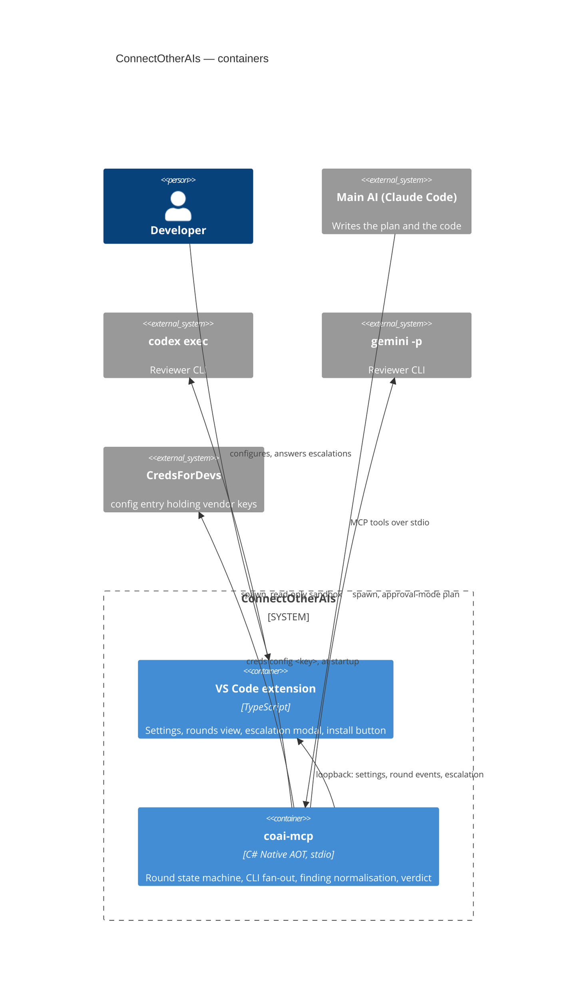

# ConnectOtherAIs — architecture

> The system **as it is**. All six epics and the escalation tail shipped on 2026-08-31: the server
> runs the loop from any MCP client, the extension installs it, and `ask_human` reaches a person in
> VS Code ([PLAN_escalation_loopback.md](PLAN_escalation_loopback.md)) — observed end to end, a
> question asked by the installed binary and answered in the installed extension.

## What this is

A multi-model review gate. The main AI writes the plan and the code; secondary vendor CLIs review
both in rounds until the de-duplicated count of blocking+major findings drops under a threshold, or
a human is escalated to. Design record: [PLAN_connect_other_ais.md](PLAN_connect_other_ais.md)
until implemented, then promoted here.

## Containers

## Module map

| Module | Doc | Status |
|---|---|---|
| Repository foundation (build, logging, CI) | [PLAN_epic_01_foundation.md](PLAN_epic_01_foundation.md) | **shipped 2026-08-31** |
| Pure core (findings, sanitizer, counting, rounds) | [module_core.md](module_core.md) | **shipped 2026-08-31** |
| Reviewer runners (worktrees, scheduler, vendors) | [module_runners.md](module_runners.md) | **shipped 2026-08-31** |
| `coai-mcp` server | [module_server.md](module_server.md) | **shipped 2026-08-31** |
| VS Code extension | [module_extension.md](module_extension.md) | **shipped 2026-08-31** (escalation loopback deferred) |

## Cross-cutting decisions already in force

- **Solution layout follows `dew_flow_creds_for_devs`**: `src_mcp/{src,tests}`, later
  `src_vs_code/`; central package versions; net10.0; `TreatWarningsAsErrors`.
- **Tests are MTP executables** (xUnit v3); `dotnet test` aborts here by design of the toolchain.
- **Logging** per the shared Serilog rule; stdio hosts log console to stderr.
- **Conventions** are the `dew_flow_conventions` submodule at `.claude/rules/shared`;
  `.claude/settings.json` is a byte-identical copy of its reference.

## Additions after the first real runs (2026-08-31 → 09-01)

| What | Where | Why it is here |
|---|---|---|
| Antigravity vendor adapter | `runners/Reviewers/AntigravityRuntime.cs` | Google retired Gemini Code Assist for individuals; `agy` is the migration, and it fits the contract better than anything else here |
| Per-vendor token & cost reading | each adapter's `ReadUsage` | one shared rule is wrong for at least one vendor by a factor of two, silently |
| Prompt catalog + per-round choice + rotation | `core/Rounds/PromptCatalog.cs`, panel section | one prompt per role forever is the right default and the wrong ceiling |
| Settings re-read per call | `src/Server/PanelServiceHost.cs` | a setting that applies only after a client restart is a setting nobody can tell is broken |
| Spending ledger + chart | `src/Server/UsageLedger.cs`, `src_vs_code/src/usage.ts` | spending spans sessions and must outlive them |
| Audit trail per reviewer | `src/Server/RoundAudit.cs` | a gate that cannot say why a reviewer did not review cannot be trusted with a verdict |
| Evidence kept for unparseable answers | `runners/Reviewers/ReviewerExecutor.cs` | the one failure whose raw text IS the diagnosis |
