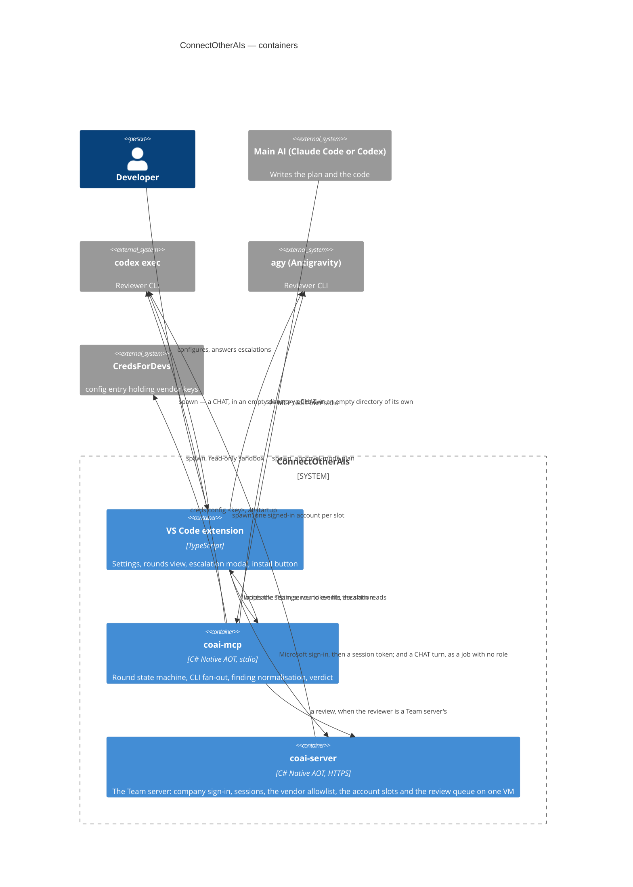
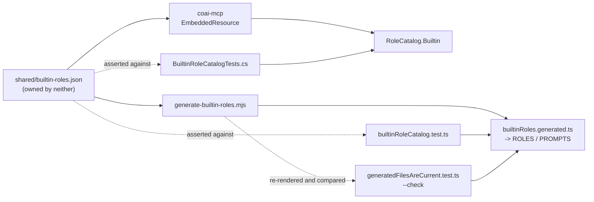

# ConnectOtherAIs — architecture

> The system **as it is**. All six epics and the escalation tail shipped on 2026-08-31: the server
> runs the loop from any MCP client, the extension installs it, and `ask_human` reaches a person in
> VS Code ([PLAN_escalation_loopback.md](PLAN_escalation_loopback.md)) — observed end to end, a
> question asked by the installed binary and answered in the installed extension.

## What this is

A multi-model review gate. The main AI writes the plan and the code; secondary vendor CLIs review
both in rounds until the de-duplicated count of blocking+major findings drops under a threshold, or
a human is escalated to. Design record: [PLAN_connect_other_ais.md](PLAN_connect_other_ais.md)
until implemented, then promoted here.

## Containers

## Module map

| Module | Doc | Status |
|---|---|---|
| Repository foundation (build, logging, CI) | [PLAN_epic_01_foundation.md](PLAN_epic_01_foundation.md) | **shipped 2026-08-31** |
| Pure core (findings, sanitizer, counting, rounds) | [module_core.md](module_core.md) | **shipped 2026-08-31** |
| Reviewer runners (worktrees, scheduler, vendors) | [module_runners.md](module_runners.md) | **shipped 2026-08-31** |
| `coai-mcp` server | [module_server.md](module_server.md) | **shipped 2026-08-31** |
| VS Code extension | [module_extension.md](module_extension.md) | **shipped 2026-08-31** (escalation loopback deferred) |
| Team server (`coai-server`) | [module_team_server.md](module_team_server.md) · [PLAN_team_server.md](PLAN_team_server.md) | **epics 1–3 complete, 2026-09-06** — the host, company sign-in, sessions, the vendor catalog, the account slots, `login`, the job queue with the review endpoints, and per-person usage with the admin company view; every route has an `http/` contract. The client runtime (`remote`, `--ask-remote`) and the panel's *Team servers* section, add-a-reviewer and spending block are in; a sign-in belongs to a SIDE of the machine, and the *Server* section shows the address read-only with the server's version beside it. The container, the host edge and the release are epic 4 — and since 2026-09-08 a `server-v*` tag publishes six Native AOT binaries on a GitHub Release beside the image, with [deploy-server.yml](../.github/workflows/deploy-server.yml) driving `deploy/systemd-release.sh` on the host; the per-PERSON spending view is [../todo/PLAN_team_usage_by_person.md](../todo/PLAN_team_usage_by_person.md) |
| Measurement bench (`coai-bench`) | [module_bench.md](module_bench.md) · [../src_bench/README.md](../src_bench/README.md) | **shipped 2026-09-04** — drives the published server over stdio, records whole, judges separately |
| Tests: the harness, its flows, its gaps | [module_tests.md](module_tests.md) | **recorded 2026-09-06** — three suites in-repo, the flow catalogue derived from the tool registry, and the two gaps named (no extension host, no real vendor in CI) |

## The extension gained two arrows of its own (2026-09-09)

Until the chat, every vendor was reached through `coai-mcp`: the extension configured reviewers and
read rounds, and the shim did the spawning. *Chat other AIs* gave the extension two edges the diagram
above now carries — it launches a vendor CLI itself, and it submits a job to the Team server itself.

**Both were deliberate, and the reason is the same one: a chat is not a review.** A review is a round
with roles, thresholds, findings and a verdict; a chat is one person asking one question about one
passage. Routing it through the round state machine would have meant inventing a role for something
that has none — and the Team server refuses exactly that, measured: `'Chat' is not a review role`.
What it accepts is a job with no role, which is also how the spending view will tell the two apart.
The rest of that separation is a server change, written up as
[PLAN_the_server_knows_a_chat_from_a_review.md](PLAN_the_server_knows_a_chat_from_a_review.md).

What the two edges share is `ChatSession` — one interface, a long-lived process behind one
implementation and a poll loop behind the other, so the panel does not know which it holds. What
they do NOT share is memory: a CLI keeps the conversation in its own process, a server keeps none,
and that difference is `memoryOf` in `chatModels.ts` — it decides whether the transcript travels with
every turn and whether the conversation is capped, and it travels with the model when the person
changes it.

### And a ledger of its own, because it now spends on its own (2026-09-10)

Spending an edge means accounting for it. `usage.jsonl` is written by `coai-mcp` and only READ by the
extension — one line per reviewer per round — and a chat turn appeared in it nowhere, so the money the
extension's two new arrows spent was recorded by nobody.

The extension therefore writes **`chat-usage.jsonl`**, beside the server's file in the same data
directory, and the log page **merges the two in memory** (`mergedRows` in `roundsLog.ts`) into one
table with a *Kind* column. The alternative — chat rows inside `usage.jsonl` — was rejected on the
gate's plan round for the reason that decides most seams here: **its two writers release on different
days.** A format shared by two programs that ship separately is a contract nobody wrote down, and this
repository has already paid for one of those (`remoteVendor`, dropped by every component written
before it existed). Two files and one merge costs one extra read and lets either half move alone.

The reviewers' other objection — that two extension hosts appending to one file tear each other's
lines — was measured rather than believed (`npm run measure:append`): eight processes × 1000 records,
116 MB with 60 KB lines among them, 8000 whole records of 8000 and nothing torn. `O_APPEND` /
`FILE_APPEND_DATA` is what `appendFile` opens with and what those guarantee.

**Where the vendor-shaped knowledge lives is the other decision.** `codex` reports a token total that
counts UP across a thread; the other two price each turn. Normalising that belongs to the SESSION,
because a session's lifetime is exactly a vendor thread's lifetime — it holds the id it resumes by,
and a replacement session (a model switch, a window reload) starts a new thread whose count starts
again. So `TurnResult` always carries the cost of ONE turn whatever its vendor counts in, `ChatAdapter`
declares `cumulative` as a required field the compiler asks for, and nothing above the session knows
that vendors differ. The rule reached two layers higher in the first draft, and a gate reviewer named
what that costs: implementing `ChatAdapter` would not have been enough to be billed correctly.

## The one interface neither container owns (2026-09-06)

The Team-server **token file** is written by the extension and read by `coai-mcp`, and neither is the
other's caller — they meet only at a path. Both derive that path independently: TypeScript's `URL`
in `teamServers.ts`, .NET's `Uri` in `TeamServerAuth.cs`, hashed to
`<dataDir>/servers/<sha256(canonicalUrl)[..16]>.token`.

Isolated tests on each side cannot see a divergence, because each side is self-consistent. The
failure appears only as somebody signing in successfully and being told they are not signed in one
second later. So the vectors live in `shared/team-server-url-vectors.json`, outside both
implementations, and **both suites assert them** — 38 C# assertions and their TypeScript twins.

The same shape governs `remoteVendor`: the row id is `<serverId>-<vendor>` because it must be unique
across servers, while `--vendor` must carry the SERVER's own spelling. Two names for one thing, and
the moment either side normalises the wrong one, every review on that server is refused as a vendor
it "does not offer".

**That prediction came true before the paragraph was a week old, and in the one way it did not
cover: not a side normalising the wrong name, but a side never sending it.** The extension's
`vendorsEnv` omitted `remoteVendor` from `COAI_VENDORS` for the whole of 0.31.0–0.31.2 while the
server parsed it faithfully. Every Team-server reviewer was therefore dropped from every round —
silently, because a round did not report a reviewer it never asked. Both suites were green
throughout, which is the property this section is about: a seam neither container owns is a seam
neither container's tests reach. Recorded, with the fix, in
[PLAN_team_server_reviewer_never_called.md](PLAN_team_server_reviewer_never_called.md).

### The second one: the review ROLES (2026-09-12)

The same shape, arrived at the same way. `coai-mcp` held five roles and twenty-five prompts as a C#
array; the extension held the same list as TypeScript literals, because the panel is drawn before any
server has started and a settings page that must wait for a subprocess shows an empty box on first
open. What held them level was a test that parsed **C# source with a regular expression** — it broke
on a reformat, could not see a field it had not been taught, and had already let one drift through.

So `shared/builtin-roles.json` sits beside the URL vectors, owned by neither container. The two halves
consume it differently, because they can: `coai-mcp` **embeds** it as a manifest resource
(`RoleCatalog.Builtin`), and the extension **generates** `src/builtinRoles.generated.ts` from it with
`scripts/generate-builtin-roles.mjs`, deriving its `ROLES` and `PROMPTS` from that. Each half then
asserts its own LOADER against the file — `BuiltinRoleCatalogTests.cs` and
`builtinRoleCatalog.test.ts` — so a seed edit either side misses goes red on that side, for the reason
it actually happened.

Generation adds one failure the token vectors do not have: a generated file can fall behind its
GENERATOR as well as its input, and that direction is invisible — the committed file still matches
the seed and every test stays green. So each generator has a `--check` mode that renders and compares
without writing, and `generatedFilesAreCurrent.test.ts` runs them.

**And `NothingReadsAnotherProgramsSourceTests` keeps the seam from being un-made.** What this replaced
was two regular expressions, each parsing the other program's SOURCE, and the reason they had to go
is that such a test goes QUIET rather than red: it breaks on a reformat, is blind to a field it was
not taught, and returns an empty list that every assertion below passes over. The shape is tempting
and will be reached for again, so a repository-level test refuses it. Its own first draft had the
defect it guards against — it matched only single-quoted path literals, which C# cannot produce at
all — which is the argument for the rule in one sentence.

### A version that rides in both directions (2026-09-09)

The extension↔Team-server seam has a version of its own — `X-Coai-Contract`, an integer on every
request AND every response — and it is the seam's only self-describing part. The server has judged
the client's number since it shipped, refusing a client below `Coai:MinimumClientContract` with 426
rather than serving one whose expectations it can no longer meet.

Until 2026-09-09 the other direction was written but not read. `ContractVersion`'s own remarks name
the client's check as "the right place to decide" what to do about a server that is behind, and the
extension sent its number and discarded the answer. It reads it now
([PLAN_the_client_reads_the_contract_back.md](PLAN_the_client_reads_the_contract_back.md)), which
makes this the first crossing where BOTH halves can describe themselves to the other.

The asymmetry in what they do about it is deliberate and worth stating at this level: the server
REFUSES, because serving a client it cannot satisfy corrupts state; the panel REPORTS, because a
client that refused a server it merely suspects would turn a warning into an outage. Same fact, two
different powers, decided by which side can do damage by continuing.

### A setting whose ABSENCE must mean something (2026-09-08)

`COAI_ENABLED_<ROLE>` crosses the same seam and is shaped by the same lesson, pushed one step
further: it is written only when a role is switched OFF, so the absent state has to carry a meaning
rather than be a gap. Both sides therefore encode "absent means on" structurally rather than by
agreement — the server's `RoleGate.Enabled` is a positional default of `true`, and the panel's
`asRoleFlags` reads the stored record one KEY at a time so a partial object (written before the key
existed, or holding only the role somebody unticked) still answers on for everything else.

Only the four spellings of false disable a role, on both sides. The asymmetry is deliberate and it is
a property of the seam rather than of either half: a role wrongly ON costs one extra reviewer pass,
while a role wrongly OFF is a review nobody performed, with nothing on either side saying so. This is
also the first crossing where an OLD server fails BACKWARDS — it never looks for the key and runs the
role anyway — so the panel carries `ROLE_SWITCH_SINCE` and says out loud which roles the installed
server would run regardless of the boxes.

### A setting whose default lives on BOTH sides (2026-09-08)

`COAI_ROUND_TIMEOUT_MINUTES` is the newest crossing of the same seam, and it is shaped to make the
seam harmless. The extension writes the key only when it DIFFERS from its own default, so a pristine
panel sends nothing and the server's fallback is what runs — which means the two defaults are one
contract, not two numbers that happen to agree. That contract broke once already, for a day, when a
release moved the panel's gate defaults and left the server's alone: a new install read *1 round,
threshold 6* off the screen and ran three rounds at threshold 2.

The round limit avoids repeating it by making ZERO the default on both sides and meaning *derive*.
There is no number to keep in step: the server computes the budget from the round's own shape
(`RoundBudget`), and the panel shows the same arithmetic beside the box so a person can see what the
zero comes to. The panel's figure is an upper bound and says so — the server derives from the
reviewers a round actually schedules, which is fewer when a repository wrote no rules down and the
Conventions reviewers are dropped.

## How the Team server is deployed (2026-09-06)

`coai.remsoft.dev` runs as a **systemd unit on the host**, not as a container, and the reason is the
host rather than a preference: the three vendor CLIs were already installed there
(`/root/.local/bin`, symlinked into `/usr/local/bin`) and every account slot under
`/opt/coai/data/accounts/` was already signed in. An image that installs its own copies adds ~750 MB
to duplicate binaries that are present, and the credentials live on disk either way.

| | |
|---|---|
| `/opt/coai/bin/coai-server` | the Native AOT binary — **21 MB**, holding **19.7 MB** resident |
| `/opt/coai/data` | `vendors.json`, the signed-in slots, sessions, `usage.jsonl` |
| `/etc/coai-server.env` | the configuration, `0600` |
| `/etc/systemd/system/coai-server.service` | `MemoryMax=1500M`, `Restart=on-failure` |
| `/etc/nginx/sites-enabled/coai` | the host edge, TLS by host certbot, proxying `127.0.0.1:8090` |

Nothing of `dew_flow_creds_for_devs` is touched: it has its own site file and its own certificate,
and both services are reached on loopback rather than through a shared network.

**The container is kept and is correct for a fresh host** that has none of this —
`src_server/Dockerfile` installs the CLIs itself and `deploy/docker-compose.yml` runs it bound to
loopback with the same memory ceiling. Of its 1.27 GB, 750 MB is the three CLIs.

The unit runs as **root**, which is a consequence and not a default: `claude` and `codex` are
symlinks into `/root`, and the slots were signed in as root. Tightening it means re-installing the
CLIs and re-signing every slot as a service account.

Since 2026-09-11 a reviewer the server launches is **confined to its prompt on the application side**:
the child starts from an allowlisted environment rather than the server's own, so
`/etc/coai-server.env` is not in it; `claude` is additionally launched with every file and shell tool
denied; and the job's `TMPDIR` is the per-job directory the launcher already creates and deletes,
rather than the shared `/tmp` of a root box. Both halves are derived from one `Confinement` value, so
a later edit cannot confine half a launch. **This is not filesystem isolation**: `codex` and
`antigravity` are bound to read-only rather than to a directory, and the process is still root — a
cross-slot READ is what the unprivileged plan above is for.

## Cross-cutting decisions already in force

- **Solution layout follows `dew_flow_creds_for_devs`**: `src_mcp/{src,tests}`, later
  `src_vs_code/`; central package versions; net10.0; `TreatWarningsAsErrors`.
- **Tests are MTP executables** (xUnit v3); `dotnet test` aborts here by design of the toolchain.
- **Logging** per the shared Serilog rule; stdio hosts log console to stderr.
- **Conventions** are the `dew_flow_conventions` submodule at `.agents/conventions`;
  `.claude/settings.json` is a byte-identical copy of its reference.
  AGENTS directs both agents to the shared ENTRY and `.agents/PROJECT.md`; CLAUDE imports
  only AGENTS. Local rules live in `.agents/rules`. The extension generates its distributable
  gate body from this pinned source before building, and reviewers sample its canonical rule
  directories. The shared resolver owns applicability; the reviewer sample is not a second selector.

## Additions after the first real runs (2026-08-31 → 09-01)

| What | Where | Why it is here |
|---|---|---|
| Antigravity vendor adapter | `runners/Reviewers/AntigravityRuntime.cs` | Google retired Gemini Code Assist for individuals; `agy` is the migration, and it fits the contract better than anything else here |
| Per-vendor token & cost reading | each adapter's `ReadUsage` | one shared rule is wrong for at least one vendor by a factor of two, silently |
| Prompt catalog + per-round choice | `shared/builtin-roles.json` -> `core/Rounds/RoleCatalog.cs`, panel section | one prompt per role forever is the right default and the wrong ceiling |
| Settings re-read per call | `src/Server/PanelServiceHost.cs` | a setting that applies only after a client restart is a setting nobody can tell is broken |
| Spending ledger + chart | `src/Server/UsageLedger.cs`, `src_vs_code/src/usage.ts` | spending spans sessions and must outlive them |
| Audit trail per reviewer | `src/Server/RoundAudit.cs` | a gate that cannot say why a reviewer did not review cannot be trusted with a verdict |
| Evidence kept for unparseable answers | `runners/Reviewers/ReviewerExecutor.cs` | the one failure whose raw text IS the diagnosis |
