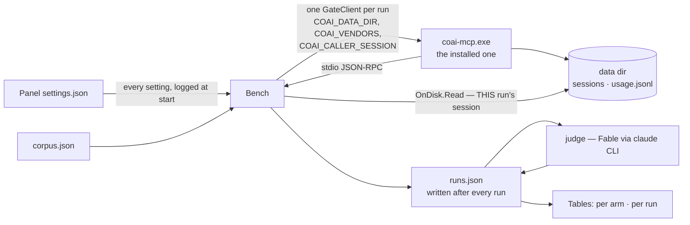

# Module — the bench (`src_bench/CoaiBench`)

> A .NET 10 console that drives the **installed** `coai-mcp` through the real protocol — `open`,
> `review_plan`, `resolve`, `review_code`, `resolve` — over a corpus of real plans and commits, and
> records what happened. It is in CI and NOT in the release. Operator-facing usage lives in
> [src_bench/README.md](../src_bench/README.md); this page is the design record.

## Purpose

Every measurement before 2026-09-04 was a throwaway harness written for that evening — and rewritten
the next. The operator's ruling: *"добавляй в проект отдельный проект на C# .NET 10, чтобы не
писать, а в крайнем случае вдохновляться и дописывать."* The bench answers the standing questions —
all vendors × N, one model on its own, local against hosted, five windows on one machine, plans only,
diffs only — and **records without judging**: whether a finding was worth having is a second pass with
Fable as the judge, over data already on disk, so a change of mind about worth costs a judgement
rather than another evening of rounds.

## Shape

| Part | File | Job |
|---|---|---|
| Options | `Cli/Options.cs` | `run` / `judge`; `--exe --repo --corpus --arm --model --repeat --parallel --stages --set --case --out --runs --judge --timeout-minutes --vendors-from` |
| Vendors | `Running/Vendors.cs`, `PanelSettingsFile.cs` | The operator's OWN vendors and every other setting, read from the panel's `settings.json`; an arm selects by id, never rebuilds from names |
| Matrix | `Running/Bench.cs` | cells = corpus × arms × repeats; lanes = arms unless `--parallel`; a data dir per run, or ONE shared dir under `--parallel`; the real data dir by default so rounds show in the panel |
| Runner | `Running/RoundRunner.cs` | the protocol in order; the plan stage repeats until it passes; accept-all resolves; **the resolve reply is kept** |
| Client | `Running/GateClient.cs` | one server process per run, newline JSON-RPC, stderr tail kept as `ServerSaid` |
| Disk | `Running/OnDisk.cs`, `Sessions.cs` | THIS run's session file — `Clean` (no round left `running`, file readable) and `Pending` (informational) |
| Settings check | `Running/SettingsApplied.cs` | asked-for settings against the session's own config and the orders a passing plan round handed back |
| Store | `Store/RunStore.cs` | `runs.json`, written after every run — a resumed campaign skips finished cells |
| Judge | `Judging/Judge.cs` | Fable through the Claude Code CLI, one finding at a time WITH the file it names |
| Tables | `Reporting/Tables.cs` | per-arm medians and per-run rows: time, findings, gating, useful, tokens, cost |

## What it measures, and what it refuses to decide

- **Everything from the panel.** Thresholds, rounds per role, prompts per round, the exhausted policy,
  the three switches — read from `settings.json`, handed to every server, and printed at start. A
  campaign once ran on the server's defaults (`maxRounds 3, threshold 2, Human`) while the operator's
  panel said 1/6/good_enough, and every table described a machine nobody runs.
- **Settings are verified, not trusted.** The session's `state.config` is compared with what was
  asked; the three switches are visible only as ORDERS in a passing plan round, and are checked by
  phrases quoted from the one command that can produce them.
- **Worth is a second pass.** Counting findings ranks noise above insight
  (`RESULTS_findings_that_are_worth_something.md`); an unjudged run prints `—`, never a zero.
- **The snippet version in force** is recorded with the run (the target repo's `CLAUDE.md`).

## Three things the bench got wrong about itself, all found by its own runs

1. **One caller for the whole campaign (2026-09-04).** The gate gives the split order ONCE per
   calling AI session — the floor under epics-of-epics. Calling every run as one caller measured the
   split path once and the already-split path ever after, and three of four runs read
   `SETTINGS NOT APPLIED` while the feature worked. One run models one AI session, so each run now
   IS one: `COAI_CALLER_SESSION = bench-<campaign stamp>-<arm>-<case>-<repeat>`.
2. **Judged on everybody's disk (2026-09-04).** With the real data directory shared by every window,
   `OnDisk.Read` summed every session on the machine: `NOT RESOLVABLE: 1 still running, 40 pending`
   against a run that had finished cleanly — the forty and the one were a neighbour's. It reads THIS
   run's session now, through the same ownership question `Sessions.Reset` asks, which gained the
   third answer it needed: a torn file is *unreadable*, not somebody else's.
3. **"Resolvable" defined as `pending > 0` (2026-09-05).** The bench resolves every finding right
   after each stage, so a run that did its job leaves nothing pending — the definition could only be
   true for somebody else's session. The disk now answers what it can (`Clean`), and the question the
   check was written for is answered where the server says so: the resolve reply, kept on the stage as
   `ResolveRefused` and printed as `[RESOLVE REFUSED: …]`.

## Running

See [src_bench/README.md](../src_bench/README.md). Tests: `./src_bench/CoaiBench.Tests/bin/Debug/net10.0/CoaiBench.Tests.exe`
(80 on 2026-09-05). CI builds and runs them; the release workflow does not package the bench.

## Records

- [RESULTS_commands_campaign.md](RESULTS_commands_campaign.md) — the commands-and-autonomy campaign.
- [RESULTS_predelivery_campaign.md](RESULTS_predelivery_campaign.md).
- [RESULTS_bench_campaign_0_17_1.md](RESULTS_bench_campaign_0_17_1.md) — the store-fix campaign of
  2026-09-05: sequential and five-window runs, Fable's judgement, and the three instrument defects
  above, each found by a run.
