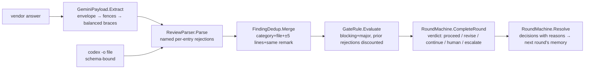

# module: core — findings, sanitizer, counting, rounds

> `src_mcp/core/CoaiMcp.Core` — the pure project. No Process, no HttpClient, no filesystem;
> everything is a pure function under a unit test (`ArchitectureTests` holds the process/network
> line by assembly references; filesystem stays out by review — it is not visible as a reference).

## Purpose

Everything that decides whether a round passes, isolated from everything that runs a round. The
runners (epic 03) and the server (epic 04) carry data to and from this module; they add no rules.

## Flow

## Core entities

| Type | File | Role |
|---|---|---|
| `Finding`, `NormalisedReview`, `RejectedEntry` | `Findings/Finding.cs` | the normalised remark; rejects are named, never dropped |
| `FindingSchema.Json` | `Findings/FindingSchema.cs` | THE one copy of the wire contract (codex `--output-schema`, Gemini prompt) |
| `ReviewParser` | `Findings/ReviewParser.cs` | vendor JSON → review; unknown severity/category = per-entry rejection |
| `GeminiPayload` | `Findings/GeminiPayload.cs` | `-o json` envelope → fence stripping → string-aware balanced `{…}` |
| `FindingDedup` | `Gate/FindingDedup.cs` | cross-provider merge; severity disagreement resolves toward caution |
| `GateRule`, `PriorRejection`, `GateResult` | `Gate/GateRule.cs` | the counting rule incl. the standing-rejection discount |
| `TextSimilarity` | `Gate/TextSimilarity.cs` | token Jaccard ≥ 0.5 = "same remark" — deterministic, arguable-with |
| `SessionState`, `PanelConfig`, `SessionKey` | `Rounds/SessionState.cs` | immutable session; key = normalised repo path + branch |
| `RoundMachine`, `RoundVerdict`, `Decision`, `Transition` | `Rounds/RoundMachine.cs` | ordering by refusal; the escalation ladder; resolve feeds rejections forward |

## The decisions a reader needs

- **Verdict at completion, stage advance at resolve.** `CompleteRound` computes the verdict and sets
  `AdvanceOnResolve`; only `Resolve` moves the stage. So findings are never left undecided: even a
  passing round's minors must be accepted/rejected before the next stage opens.
- **The ladder** (`ReviewerEffortUp → ReviewerModelUp → ArbiterModelUp`) fires one step per
  exhausted stage and resets the round counter; exhausted ladder falls through to `CallHuman`.
- **A rejection without a reason refuses the whole resolve** — the reason is what the discount rule
  compares future `why`s against.

## Tests

`CoaiMcp.Tests`: ReviewParserTests, GeminiPayloadTests, FindingDedupTests, GateRuleTests,
RoundMachineTests, ArchitectureTests. Teeth proven red for: the balanced-brace scan (naive
first-to-last), the standing-rejection discount (disabled), the ladder order (reversed).
