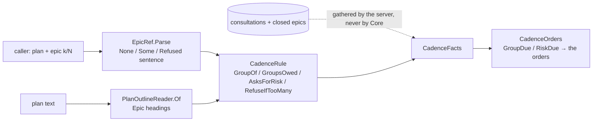
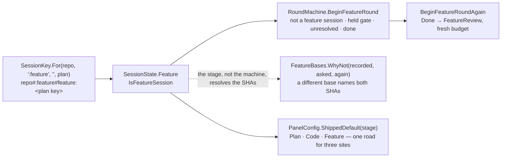
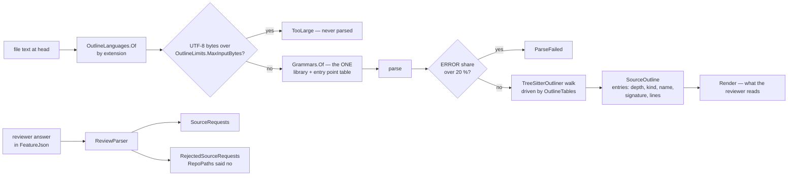
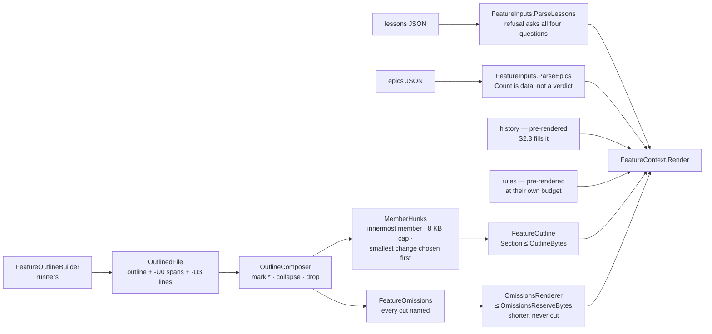

# module: core — findings, sanitizer, counting, rounds

> `src_mcp/core/CoaiMcp.Core` — the pure project. No Process, no HttpClient, no filesystem;
> everything is a pure function under a unit test (`ArchitectureTests` holds the process/network
> line by assembly references; filesystem stays out by review — it is not visible as a reference).

## Purpose

Everything that decides whether a round passes, isolated from everything that runs a round. The
runners (epic 03) and the server (epic 04) carry data to and from this module; they add no rules.

## Flow

```mermaid
flowchart LR
  raw[vendor answer] --> GP[GeminiPayload.Extract\nenvelope → fences → balanced braces]
  GP --> RP[ReviewParser.Parse\nnamed per-entry rejections]
  raw2[codex -o file\nschema-bound] --> RP
  RP --> DD[FindingDedup.Merge\ncategory+file+±5 lines+same remark]
  DD --> GR[GateRule.Evaluate\nblocking+major, prior rejections discounted]
  GR --> RM[RoundMachine.CompleteRound\nverdict: proceed / revise / continue / human / escalate]
  RM --> RES[RoundMachine.Resolve\ndecisions with reasons → next round's memory]
  RES --> DB[(rounds database\nwhat was decided)]
  DD --> SF[StuckFindings.SurvivedAcceptance\nthis round vs earlier decisions of the same stage]
  DB -. read by the server, never by Core .-> SF
  SF -. measures, calls nothing .-> AU[audit line + consult_missed]
```

> `SurvivedAcceptance` is pure and lives here; the earlier decisions it compares against do NOT. The
> session state carries rejections forward (the discount rule needs them) and not acceptances, so the
> server reads them out of the rounds database and hands them in — which is why the call site is
> `PanelService`'s projection and not `RoundMachine.Resolve`. (gemini, story 6's second code round,
> against a first draft of this diagram that drew the arrow the wrong way round.)

## Core entities

| Type | File | Role |
|---|---|---|
| `Finding`, `NormalisedReview`, `RejectedEntry` | `Findings/Finding.cs` | the normalised remark; rejects are named, never dropped |
| `FindingSchema.Json` | `Findings/FindingSchema.cs` | THE one copy of the wire contract (codex `--output-schema`, Gemini prompt) — pinned by SHA-256 |
| `FindingSchema.FeatureJson`, `SchemaFile`, `SchemaShape` | `Findings/FindingSchema.cs`, `Findings/SchemaFile.cs` | the feature reviewer's shape: `Json` + `sourceRequests`, DERIVED; one file per shape on disk |
| `SourceRequest`, `NormalisedReview.SourceRequests` / `RejectedSourceRequests` | `Findings/Finding.cs` | a feature reviewer's request for code, validated at the parser; a bad path is a named rejection |
| `RepoPaths` | `RepoPaths.cs` | whether a path names something INSIDE a repository — lexical; moved here from `GitHistory` |
| `ISourceOutliner`, `OutlineLanguage`, `SourceOutline`, `OutlineLimits` | `Outlining/ISourceOutliner.cs` | the seam of the body-free outline (seven languages); implemented in `CoaiMcp.Normalizer` |
| `FeatureBudget` | `Feature/FeatureBudget.cs` | the feature review's byte budgets, each traced to a measurement (plan §6, S0.2) |
| `SourceBudget` | `Feature/SourceBudget.cs` | every cap of source on demand in ONE place — 8 requests a turn, 64 KB a turn, 128 KB a reviewer, 400 lines a slice, 16 KB for a whole file, 3 overloads, 20 names in a refusal; the turn cap is the feature-pack trial's correction of the plan's 48 KB |
| `SymbolLookup`, `SymbolMatch` | `Feature/SymbolLookup.cs` | a declaration by the name a reviewer WROTE — `Cart.Add`, `Point::fmt`, `App\Billing\Invoice::total`, a file-scoped namespace in front — against the outline's chains; overloads capped, a miss lists the file's names; pure |
| `CredentialFiles` | `Feature/CredentialFiles.cs` | the fixed NAME shapes source on demand never serves (`.env*`, `*.pem`, `*.key`, `*.pfx`, `*.p12`, `id_rsa*`…) — and deliberately not the credential words, which refused `Auth.cs` and `tokens.rs` in the trial |
| `ServedSlice`, `SourceRefusal`, `SourceSpend`, `ServedTurn`, `SourceFence` | `Feature/SourceSlice.cs` | what a turn of source on demand came to: slices fenced with path, lines and commit, refusals with their sentence, and the reviewer's spend carried to the next turn |
| `Redaction.SafeSource` | `Notices/Redaction.cs` | the notice redaction's passes over a FILE — layout kept, nothing cut, fail closed — the one road served content takes |
| `ReviewParser` | `Findings/ReviewParser.cs` | vendor JSON → review; unknown severity/category = per-entry rejection |
| `GeminiPayload` | `Findings/GeminiPayload.cs` | `-o json` envelope → fence stripping → string-aware balanced `{…}` |
| `FindingDedup` | `Gate/FindingDedup.cs` | cross-provider merge; severity disagreement resolves toward caution |
| `GateRule`, `PriorRejection`, `GateResult` | `Gate/GateRule.cs` | the counting rule incl. the standing-rejection discount |
| `TextSimilarity` | `Gate/TextSimilarity.cs` | token Jaccard ≥ 0.5 = "same remark" — deterministic, arguable-with |
| `StuckFindings`, `EarlierDecision`, `Survivors` | `Gate/StuckFindings.cs` | how many of this round's findings the caller had already ACCEPTED — phase 2's instrument, calling nothing |
| `SessionState`, `PanelConfig`, `SessionKey` | `Rounds/SessionState.cs` | immutable session; key = normalised repo path + branch (+ a document, + a feature's plan) |
| `Stage`, `StageDescriptor`, `Stages` | `Rounds/SessionState.cs`, `Rounds/Stages.cs` | the four stages, and the ONE table of what each answers by name — bucket, phrase, kind, commands, next stage, sentences, whether it records a commit |
| `RoundMachine`, `RoundVerdict`, `Decision`, `Transition` | `Rounds/RoundMachine.cs` | ordering by refusal; the escalation ladder; resolve feeds rejections forward |
| `FeatureBases` | `Rounds/FeatureBases.cs` | the base a feature review was opened against, held to on every later call of the same plan — a different base is refused naming BOTH SHAs, and `again` is the door |
| `FeatureGate` | `Feature/FeatureGate.cs` | the feature gate's decisions that are numbers, as against `FeatureBudget`'s measurements: the three-epic floor (D17) |
| `RoleDefinition`, `RoleCatalog`, `RoleStages` | `Rounds/RoleCatalog.cs` | which roles exist and which prompt a round of one gets; `Builtin` is the embedded seed; `RoleStages.All` is the one list of stages a role may belong to |
| `CadenceMode`, `EpicGroup`, `CadenceRule` | `Cadence/CadenceRule.cs` | the consultation cadence's arithmetic: groups of `every` epics counted from the plan's OWN first epic, the risk question from `threshold` epics, nothing past `MostEpics` (14); the defaults 3 / 5 / 3 are the numbers the panel is tested to agree with |
| `EpicRef` (`None` / `Some` / `Refused`), `CadenceState`, `ClosedEpic`, `RiskItem` | `Cadence/EpicRef.cs`, `Cadence/CadenceState.cs` | where the caller says it is (`plan` + `epic: "k/N"`) — a bad declaration is a sentence, never an exception; what one plan has recorded: the epics through the code gate and the risk answer |
| `CadenceFacts`, `CadenceOrders`, `PlanOutline`, `PlanOutlineReader` | `Commands/CadenceOrders.cs`, `Commands/PlanOutline.cs` | the orders a round carries — the group due, the risky pieces due — from facts the server gathered; the plan's own Epic headings, which also size a split `Massive` (`PlanShape.ByEpics`) |
| `RoleEntry`, `PromptEntry`, `RoleComposition` | `Rounds/RoleComposition.cs` | a person's `COAI_ROLES` rows composed onto the seed; every refusal is a sentence, never an exception |

### The catalog is data, and the seed belongs to neither half (2026-09-12)

The roles used to be a closed list in four places at once: a CLR `enum ReviewRole`, five
`const string`s, a 25-row `PromptChoice` array, and a hand-typed mirror of the same rows in the
extension — held level by a test that regexed this project's own C# source. A manager who wants the
gate to check a CV against their own rules cannot be served by any of that without a rebuild of both
halves.

So the built-in catalog is **one file, `shared/builtin-roles.json`**, owned by neither container:
this assembly embeds it (`CoaiMcp.Core.csproj`) and loads it once as `RoleCatalog.Builtin`, and
`BuiltinRoleCatalogTests` asserts the LOADER against the file rather than against any other
implementation — the same shape as `shared/team-server-url-vectors.json` and for the same reason:
two self-consistent implementations cannot notice that they disagree. **The extension's copy is
GENERATED from the same file** (`scripts/generate-builtin-roles.mjs` → `builtinRoles.generated.ts`,
with `prompts.ts` deriving `ROLES` and `PROMPTS` from it), and `builtinRoleCatalog.test.ts` asserts
that loader against the seed field for field. Neither half reads the other's source any more — the
two regular expressions that used to hold them level are gone, and
`NothingReadsAnotherProgramsSourceTests` refuses their return.

Four properties are worth knowing before touching it:

- **A role's first prompt is its general one.** `Universal` used to be a flag that a test had to
  check was set exactly once per role; it is now a position, so the invariant holds by construction
  and `RoleDefinition.General` is `Prompts[0]`.
- **`Prompts` is never empty in a catalogued role, and the RECORD does not enforce it.** Validation
  lives in the construction paths — `FromSeed` for the shipped seed, `Compose` for a person's roles
  — because the two must fail differently: a broken seed is a broken build and throws, while a role
  somebody typed into `COAI_ROLES` has to become a dropped row with a sentence. A type that threw on
  its way in would turn the second into an exception nobody can report.
- **A bad seed is refused whole, loudly, at load.** No roles, a role with no prompts, an unknown
  stage, two roles sharing an id case-insensitively, one prompt id under two roles — each throws
  naming the file and the offender. All five are reachable only by shipping a bad binary, which is
  why they are exceptions rather than values.

### What a person adds, and what it is refused for (2026-09-12)

`RoleComposition.Compose(entries)` puts a person's `COAI_ROLES` rows onto the seed. **Nothing in it
throws** — the mirror image of `FromSeed`, and for a reason worth keeping straight: a seed is ours
and a bad one is a bad build, while an entry is a person's and a mistake in it must not stop the
four roles that are still fine from reviewing. Every refusal is a `"<row>: why"` sentence in
`Dropped`, which `PanelSettings.Unrecognised` carries to the panel.

Five rules, in the order they apply:

1. **A row whose id matches a built-in — without case — is an OVERRIDE, never a new role.** Id, name,
   stage and kind come from the seed whatever the row says: an id keys settings, session files and
   every row of the rounds database, and a name the row could change would only disagree with the
   help. What the row may contribute is `active` and extra prompts, **each only when present** —
   which is why every field of `RoleEntry` but the id is nullable. A non-nullable `active` would read
   an omitted one as `false` and switch Architecture off for somebody who only wanted to add a
   prompt to it.
2. **Every other row is a role of the person's own.** Its id becomes the environment variable
   `COAI_ROUNDS_<ID>`, so it is latin, starts with a letter and carries **no hyphen** — a prompt id
   names a file and wears one, a role id names a variable and `COAI_ROUNDS_MY-ROLE` is not a name a
   POSIX shell can export, which would leave the role's budget settable through the settings file
   and not through the environment or the pasted block. Its stage is `plan` or `result`; it must
   carry prompts, because it has no shipped general one to fall back on. Absent `active` is on,
   absent kind is a programming task, absent name is the id.
3. **Prompt ids are slugs and they are global.** `RolePrompts` keys text files by prompt id alone,
   so two roles naming `rules` would read one file. The slug rule is also what stops an id being a
   path: `../../secrets` is refused here, not at the moment a file is read into a reviewer's prompt.
   Windows device basenames (`con`, `aux`, `com1`…) are refused too — `con.md` is the console rather
   than a file, so the text could be neither written nor read on the platform this is developed on.
4. **At most five active roles per bucket**, and the trim never reaches a built-in — they come first
   in catalog order, so a person's row can never switch a shipped role off by arriving. Beyond that
   the order is the order they were written, so which role is trimmed is predictable rather than
   whichever one the dictionary happened to yield. A trimmed role is left in the catalog switched
   off, with a sentence saying which limit it met. The consequence, said out loud: with all four
   shipped result roles on, one custom result role fits, and the way to make room is to untick a
   built-in.
5. Anything a person added is `BuiltIn = false`, which is what makes it deletable and its text
   restorable-to-nothing rather than restorable-to-shipped.

**A null inside the list is a refusal, not a crash.** Every FIELD of a row was nullable from the
start; the ROW being null was forgotten, and `[null, {…}]` — which a person can type and a
deserialiser hands over intact — aborted the whole composition, taking the four shipped roles down
with one mistyped line. A null list is no rows, a null row is one sentence, a null prompt is one
sentence, and everything else still composes. The same goes for a row with no id at all, which is
refused under `<a row with no id>` rather than under an empty string nobody can search for.

`PanelConfig` gained `Catalog` alongside `Roles`: what a role IS, beside how much it may spend. A
role with no gate of its own falls back to its stage's shipped default, which is what makes a role
somebody just created work with no further settings at all.
- **Ids are permanent.** `COAI_ROUNDS_ARCHITECTURE`, `coai.rounds`, every session file and every
  `coai.db` row is keyed by the role id, so a rename in the seed is a migration and not an edit.
  `PromptChoice.BuiltIn` marks a prompt the binary ships a text for: it can be overridden and
  restored, never deleted.

### The consultation cadence is decided here and gathered elsewhere (2026-09-26)

What a plan owes is arithmetic and lives in Core; what it has already had is on disk and lives in the
server ([PLAN_consult_on_a_cadence.md](PLAN_consult_on_a_cadence.md), [module_server.md](module_server.md)).
Core never reads a consultation record or a round: the server's `CadenceDesk` builds the
`CadenceFacts`, `CadenceGate.WithEvidence` adds what the store holds, and Core answers with orders and a
refusal sentence.

## The decisions a reader needs

- **A role can be absent from a round for two different reasons, and they are not interchangeable.**
  Its budget is spent — it reviewed and has no round left, a fact about THIS round — or the operator
  switched it off, a fact about the whole stage. `RoleGate.Enabled` carries the second, defaulted to
  `true` positionally so every construction site that predates it keeps meaning what it meant and
  "absent means on" holds by construction rather than by a rule somebody has to remember.
  `EnabledRolesOf(stage)` is the member both `RolesForRound` and `For(Stage)` read, so a switched-off
  role lends the stage neither its round budget nor its threshold — leaving either in would keep a
  stage running rounds nobody reviews, or hold the gate open against a number no reviewer can bring
  down. With every code role off it answers empty and `For(Stage)` is `NoEnabledRoles` — `(0, 0)` —
  rather than an exception out of `Max`, because the caller that must refuse the round needs a value
  to read, not a throw to catch.
- **Verdict at completion, stage advance at resolve.** `CompleteRound` computes the verdict and sets
  `AdvanceOnResolve`; only `Resolve` moves the stage. So findings are never left undecided: even a
  passing round's minors must be accepted/rejected before the next stage opens.
- **The ladder** (`ReviewerEffortUp → ReviewerModelUp → ArbiterModelUp`) fires one step per
  exhausted stage and resets the round counter; exhausted ladder falls through to `CallHuman`.
- **A rejection without a reason refuses the whole resolve** — the reason is what the discount rule
  compares future `why`s against.
- **"Stuck" is a finding the caller ACCEPTED and was handed back, and it is not `re_raised`.** That one
  is a reviewer pressing a standing REJECTION — a disagreement the caller is defending, and the more
  interesting of the two for reading an argument. `StuckFindings.SurvivedAcceptance` counts the
  opposite and the more expensive one: the caller agreed, changed the plan or the code, and the same
  defect came back. The matching is `FindingDedup.SameDefect`, because a second similarity rule would
  be a second answer to a question this module has already answered; the LATEST decision about a
  defect decides (accepted, then rejected, then raised again is the disagreement, not this), and the
  round NAMED is the latest ACCEPTANCE — the one that was in force when the defect returned.
- **It measures and calls nothing, deliberately.** The operator's question is whether an automatic
  consultation should fire when a finding survives two rounds, and that cannot be answered by an
  impression of how often it happens. So the number lands on the round (`rounds.consult_missed`,
  `-1` until something counted it) and one sentence goes into the audit — *"an automatic consultation
  could have fired here"*, never *"consult now"*. A trigger that fired before anybody had read the
  number would be the same guess with a cost attached.

## Tests

`CoaiMcp.Tests`: ReviewParserTests, GeminiPayloadTests, FindingDedupTests, GateRuleTests,
RoundMachineTests, ArchitectureTests, BuiltinRoleCatalogTests, StuckFindingsTests, StagesTests,
AFeatureSessionIsKeptApartTests. Teeth
proven red for: the balanced-brace scan (naive first-to-last), the standing-rejection discount
(disabled), the ladder order (reversed), the catalog loader (written before `RoleCatalog` existed,
watched failing to compile, then watched failing on the prompt COUNT — the plan said 26 and the seed
has 25, which is why the number is pinned rather than the shape), the stage table (a `FeatureReview`
member planted in the enum with no row: six tests red, in this module and the server's — first as the
guard's own rehearsal, then for real on 2026-09-26 when the member was added ahead of its row), and the
feature session's key (the fourth argument ignored: the feature key equalled the branch key, and one
plan's session equalled another's).

## Every stage answers by name — `Stages` (2026-09-25)

`Rounds/Stages.cs` is one exhaustive table, a `StageDescriptor` row per `Stage`, and the only place
these facts about a stage live:

| column | read by | what it answers |
|---|---|---|
| `Bucket` | `PanelConfig.BucketFor` | which roles review it (the bridge to the persisted role string, below) |
| `Phrase` | `Stages.PhraseOf` → `RoundSubject.StageName` | "plan review" / "code review" / "document review" / "done" — a notice, a log line |
| `Kind` | `RoundRefusals.ReviewKindOf` (server) | the adjective in "every code-review role is switched off" |
| `Commands` | `PanelService.CommandStageOf` (server) | which of a person's custom commands a round of it is given |
| `AdvancesTo` | `RoundMachine.Resolve` | where `resolve` moves the session once a round passed |
| `CompletedSentence` | `PanelService.Finish` (server) | what `resolve` says at that moment |
| `ReviseInstruction` | `PanelService.AnswerFor` (server) | what a `revise` verdict tells the caller to do with accepted findings |
| `RecordsSha` | the `Sha` write on the finished round (server) | whether the round keeps the commit it reviewed, for `again` |

**The fourth row, 2026-09-26 (S2.1 of the feature-review plan).** `Stage.FeatureReview`, appended
last: bucket `feature:code`, phrase *feature review*, kind `feature`, `CommandStage.Any`, advances to
`Done`, and the first stage to write its OWN revise instruction — *fix the accepted ones as new pull
requests, then run this review again with the new head* — because its fixes land elsewhere: the
epics have merged. It `RecordsSha`, like the code stage, so a later `again` can be refused when the
head has not moved (D14). Adding it was exactly the compile-time question the table was built to ask:
the enum member alone turned six tests red across two suites, and the row turned them green.

`Stages.Of(stage)` throws for a value outside the enum ("map it here"), and `StagesTests` walks
`Enum.GetValues<Stage>()` so a member without a row is a red test rather than a silent default.
`PhraseOf` takes the stage as it was WRITTEN DOWN — a round record's string — and answers the text
itself when this build has no row for it: never "done", because a round written by a newer build is
not a finished one.

**Why a table.** §9 of the feature-review plan counted the switches: two were exhaustive
(`BucketFor`, `ProviderSettings.Reviews` in the server) and four swallowed an unknown stage with a
discard — `StageName` said "done" (so a document review's `call_human` notice read "The **done** gate
needs your decision"), `ReviewKindOf` said "code", `CommandStageOf` said `Any`, and `Finish` said
"The code stage is complete" for any session that reached `Done`, a document review included. A
fourth stage would have inherited all four without a compile error. Every existing bucket, phrase and
sentence is pinned by LITERAL in `StagesTests`, so the table changed nothing on disk or on the wire;
only the document review's two sentences are new, because they were wrong. `Stage.Done` is a row
rather than an exception (`status` reads a finished session's budget through its bucket), and its
other columns are what the discards used to answer. Only the columns the existing stages READ are
there — a field nothing reads is a claim nothing checks; the fourth stage adds its own with the
reader that needs them. `ProviderSettings.Reviews` stays a throwing switch in the server, by the plan.

## Which roles a round runs — the BUCKET

`RoleCatalog.InBucket(bucket)` is what selects a round's roster, and `PanelConfig.BucketFor(Stage)`
— reading the stage's row in `Stages` — is the ONE place the orchestration `Stage` meets the string a
role is persisted with:

| `Stage` | bucket | what it reads |
|---|---|---|
| `PlanReview` | `plan:code` | the plan document |
| `CodeReview` | `result:code` | the branch diff |
| `DocumentReview` | `result:document` | a document |
| `FeatureReview` | `feature:code` | a whole plan's worth of code, OUTLINED, once every epic landed (the feature-review plan; the round itself is S2.2's) |
| *(none)* | `plan:document`, `feature:document` | nothing yet — stored, composed, counted, run by no stage |

`RoleStages.All` — `plan`, `result`, `feature` — is the one list a role's stage is checked against.
The seed loader and a person's `COAI_ROLES` composition each spelled the pair by hand until the third
stage arrived; a stage added to one and not the other would have been a shipped role the seed accepts
and a person's row composition refuses, in the same build. `RoleStages.Spelled` is how a refusal lists
them.

A document role's own `RoleDefinition.Stage` stays the STRING `result` with
`ProgrammingTask: false`, in the seed, in `COAI_ROLES`, in every session file. `Stage.DocumentReview`
appears in none of them.

It was `RolesOf(stage)` with `&& r.ProgrammingTask` baked in until plan 4, which is exactly where a
document role stopped: composed, budgeted, switchable, and in no round. The kind is part of what is
ASKED FOR now rather than a condition on the answer — and the rename was deliberate, so every call
site became a compile error rather than a silently empty list.

The five-active limit has counted per bucket since plan 1 (`RoleComposition.MaxActivePerBucket`); the
extension counted per STAGE until plan 4, which was invisible only because document roles ran in
nothing.

## The feature stage in the core (2026-09-26, S2.1 of the feature-review plan)

What a feature review IS, before any tool runs one: a session of its own, a gate of its own, and the
two rules a pure transition cannot decide — the head and the base — extracted so they are unit tests.

- **The session is keyed by the PLAN and lives under a branch no git ref can spell.** A feature
  review's head moves as fix pull requests land, so the head cannot be part of the key; the plan's
  repository-relative path is (D13), as the fourth segment `#feature:<key>`, appended only when set —
  every key already on disk is byte-identical, pinned by literal. The branch segment is the constant
  `SessionKey.FeatureBranch = ":feature"`: a colon is forbidden anywhere in a git ref, so it collides
  with no branch anybody can have, and a document session on the same branch is a different key
  because the document segment comes before the feature one. `SessionState.Feature` is the one
  field that says which kind a session is, normalised where it is declared like `Document`, and
  `IsFeatureSession` is derived from it.
- **`BeginFeatureRound` has four refusals, in the document gate's order** — not a feature session,
  a held human gate, an unresolved round, a finished review — and no `PlanProceeded` check: the plan
  IS the input. The held gate is asked BEFORE the finished stage on purpose, and the engine keeps the
  same order before its skip branch, so un-ticking every vendor cannot dissolve a person's decision.
  `BeginFeatureRoundAgain` reopens a finished review with a fresh budget, the shape
  `BeginCodeRoundAgain` has — against the SAME base; and the three other begins refuse a feature session
  BY NAME (`ThisIsAFeatureSession`), as they refuse a document session — one budget, one job.
- **Another base is a fresh review** (§4.3, from the code review of 2026-09-26).
  `RoundMachine.FreshFeatureReview(state)` starts over the stage's count, its escalations AND its
  standing `Rejections`, whatever the stage was: a rejection made in one review must not discount a
  finding in a different one, and an open review reopened against another base ran as round 2 of a
  budget that was not its own. It is a state function rather than a transition on purpose — a held gate
  and an unresolved round are refused by `BeginFeatureRoundAgain` first, and that the base IS another
  one is the stage's finding — so the engine applies it to the begun state, after both, with the round
  that runs (`RoundEngine.HeldToBase`).
- **The base is remembered and held to.** `FeatureBases.IsAnother(recorded, asked)` is the one
  comparison — never true before a round recorded a base — and `FeatureBases.WhyNot(recorded, asked,
  again)` is empty for the same base, for no recorded base, and for `again: true`; otherwise a sentence
  naming BOTH SHAs and the door. A path alone cannot tell two release trains of one plan apart (the plan
  round, 2026-09-25). The recorded value lives on `PersistedSession.FeatureBase` in the server, written
  with the round that runs and never at creation; the stage resolves the SHAs and hands them in, because
  a pure transition has no commits. D14 — `again` with the same base over the head the last round read
  — is refused in every state, not only after `Done`.
- **The third shipped default has its own instance.** `PanelConfig.FeatureDefault = (1, 5)` — the
  same numbers as a code round, deliberately as its own object, so the three sites that pick a default
  can be told apart by REFERENCE in a test. All three go through one road now,
  `PanelConfig.ShippedDefault(stage)`: the `Defaults` dictionary, `ShippedFor` (a role with no gate
  written for it), and the server's `GateFor`, which also reads the stage's own keys
  (`COAI_MAX_ROUNDS_FEATURE` / `COAI_THRESHOLD_FEATURE`) rather than the `_CODE` pair in silence.
- **`FeatureGate.DefaultMinEpics = 3`** (D17) is a decision, not a measurement, which is why it is not
  in `FeatureBudget`. The server reads it as `COAI_FEATURE_MIN_EPICS`; S2.2's input check applies it.

## `IAstNormalizer` — a native parser that cannot spread (2026-09-15)

`Normalising/IAstNormalizer.cs` is a seam and nothing else: `SourceLanguage`, `EnclosingSymbol`, and
two operations — which language a path is in, and which function a line fell inside. The core names no
parser, no node and no P/Invoke, and does no IO; the caller reads the file out of git, because only
the caller knows which commit it wants.

It exists because a finding names a file and a line and nothing else. `Finding` has no symbol field
(and gaining one would only work on findings not yet written), so the corpus collector resolves the
enclosing method mechanically instead — which works retroactively on everything already stored.

**The implementation lives in `CoaiMcp.Normalizer` and nowhere else**, over tree-sitter. That was the
third condition of the operator's approval of `TreeSitter.DotNet` on 2026-09-15: an individual's
native dependency may be taken, but it may not spread. `ArchitectureTests.OnlyTheNormalizerNamesTreeSitter`
holds the line from both ends — the core, the runners and `coai-mcp` must not reference the parser,
and the normalizer must, which is what stops the check passing vacuously.

It is also what keeps the rejected alternative cheap. Roslyn for C# and the TypeScript compiler API
for the rest was declined because two engines means two property tests guarding one guarantee; if the
dependency ever has to go, it returns as a second implementation of this interface rather than a
second design.

**Syntax, not semantics**, is why one parser is enough for three languages: finding the function
around a line and telling an identifier from the syntax around it need node kinds, never a type.

Two facts about the grammars, both learned by running them:

- The per-language table holds a **library and an entry point**, which are not the same word. The
  binding derives both from one id — `tree-sitter-{id}` and `tree_sitter_{id}` — and so cannot name
  C# at all: that grammar is `tree-sitter-c-sharp` with an entry point of `tree_sitter_c_sharp`.
- A C# `method_declaration` **includes** its modifiers; a TypeScript `function_declaration` does
  **not** include `export`, which belongs to the statement wrapping it. Left as the grammar has it:
  a vector is built per language and compared against its own, and `export` is not control flow, a
  synchronisation primitive, an await point or a runtime type.

### The skeleton, and what a skeleton may contain (2026-09-15)

`Normalising/RuntimeVocabulary.cs` is the anonymity guarantee, and it is a **whitelist**. "Remove
everything that looks like a domain name" cannot be checked — that set is unbounded. "Keep nothing but
these words" can: every word in a skeleton is a generated placeholder, a language keyword, or a member
of this list, and anything else is a leak by definition. `Normalising/Skeleton.Leaks` is that check,
pure and in the core so the collector and the ingest server run the same code rather than two
descriptions of one rule.

**The rule for what belongs in the vocabulary: it must ship with the language.** `ConcurrentDictionary`
and `Promise` are facts about a runtime and carry the failure physics — a check-then-act race is
`ContainsKey` followed by `Add`, and losing those two words loses the bug. `InvoiceService` is a fact
about us. The list errs SMALL: a runtime name that is missing gets renamed, which costs signal and
leaks nothing; a domain name wrongly added leaks everything.

**The vocabulary protects a REFERENCE, never a DECLARATION.** `GetOrAdd` is a runtime name when
something calls it on a concurrent dictionary and it is ours when it is the method being declared —
you cannot declare a name the runtime owns. Without that distinction a method this repository happens
to call `GetOrAdd`, `Add` or `Count` keeps its own name in the skeleton, which is a leak dressed as a
runtime word.

Two checks guard the same promise, and they fail differently. The collector holds the original and can
assert the **blacklist** — no word of ours survived. The ingest server has never seen an original and
can only assert the **whitelist**. The whitelist is weaker on paper and stronger in shape: it cannot be
defeated by a name nobody thought to forbid.

#### What the property test found

`ZeroKnowledgeTests` runs both checks over this repository's own source — code nobody wrote with a
normaliser in mind. It caught four real defects that fixtures had not:

- **Declaration detection by substring.** A bare method — which is exactly what the collector extracts
  — parses as `global_statement → local_function_statement`, a kind containing neither "declaration"
  nor "definition". Its name went unrenamed.
- **Char offsets, not bytes.** The binding reports positions in UTF-16 code units, not tree-sitter's
  own UTF-8 bytes. Splicing bytes produced skeletons full of word fragments (`ng`, `ld`, `he`) — and
  only on files containing an em dash, which is most of this repository's comments.
- **A constructor does not parse alone.** Parsed standalone it yields a malformed tree whose parameters
  carry no `name` field. The normaliser now reparses inside a wrapper type when the grammar reports an
  error, and removes the wrapper afterwards.
- **`implicit_parameter`.** A C# lambda written `f => f.Name` gives its parameter that node kind, which
  contains no "identifier" — so it was skipped while the `f` in the body was renamed, and the skeleton
  read `method_2(f => var_3.method_3)`.

Each is now its own test. The class also carries a positive control — that the finder finds methods at
all — because a property test iterating an empty list reports success, which is the failure mode such a
test is least able to notice about itself.

## `ISourceOutliner` — the feature review's reader, and the shape its reviewer answers in (2026-09-25)

Story S1.3 of [PLAN_feature_review.md](../todo/PLAN_feature_review.md). A feature reviewer is sent the
SHAPE of every changed file and asks for code by name (plan D3/D4); this is that shape, and the schema
it asks in.

- **A separate seam, not a wider `SourceLanguage`.** `OutlineLanguage` names seven languages (C#,
  TypeScript, TSX, JavaScript, Rust, PHP, Python); `SourceLanguage` stays three, because it is the defect
  corpus's trust boundary and the normalizer's function table falls through to JavaScript kinds for
  anything it does not name. The collector still reads `.tsx` as TypeScript — pinned by
  `OutlinerGrammarTests.TheCollectorsTsxBehaviour_IsUnchanged`.
- **One grammar table for both implementations** — `normalizer/Grammars.cs`. PHP's entry point is
  `tree_sitter_php`, decided by loading: `tree_sitter_php_only` is not exported by the library this
  package ships. `shared/kept-grammars.txt` is the union of both interfaces' grammars, and
  `KeptGrammarsTests` asks `Grammars` rather than keeping a third list.
- **No body by construction.** A signature runs from the declaration's start (a wrapper's — `export`,
  `declare`, a Python decorator — when it has one) to the start of its `body` field or the table's other
  cut fields (a C# property's `accessors`/`value`), whitespace collapsed, at most 240 characters. A
  declaration with no body field is shown whole, cut at the first body nested in it. The walk goes
  THROUGH nodes the table does not name, never into anybody's `body`, never into an anonymous callable.
  Every fixture marks its body lines with `secret…`, and `OutlinerTests.NoLineOfABody_AppearsInTheOutline`
  holds all seven languages to it. Special cases are table data: Python's `decorated_definition` and
  TypeScript's `export` are wrappers; `const f = () =>` is kind `function`; a Rust `impl` is named
  `Trait for Type`.
- **Tables are data, exhaustive, no `_ =>`.** `OutlineTables.For` names every `OutlineLanguage` with
  CS8524 silenced, so a named language without a table is a build error (CS8509).
- **Refusals are answers.** Over 1 MiB of UTF-8 is `TooLarge`, checked before any parse; more than 20 %
  of the text under ERROR nodes is `ParseFailed`; every result carries its size and its measured
  `ErrorShare`.
- **The feature schema is derived.** `FindingSchema.FeatureJson` = `FindingSchema.Json` plus
  `sourceRequests: [{file, symbol|null, startLine|null, endLine|null, why}] | null`, added to the PARSED
  base (`JsonNode`, written through a `Utf8JsonWriter` — no reflection) so the findings part cannot drift
  and a reindented base derives the same schema (the first version searched the text for literal
  anchors; epic 1's code round, `TheFeatureSchema_DerivesFromAReformattedBase_TheSameWay`); `Json` is pinned by SHA-256
  (`TheFeatureSchemaTests`) and both shapes meet OpenAI's strict rules (`FindingSchemaTests`).
  `SchemaFile.Ensure(dir, SchemaShape.Feature)` writes `finding-schema-feature.json`, never the file
  every other round reads.
- **A request is validated where it is parsed.** `ReviewParser` reads `sourceRequests` into
  `NormalisedReview.SourceRequests` (empty, never null); a path that is absolute, drive-qualified or climbs
  out with `..` (`RepoPaths`, moved to the core from `GitHistory`), or a span that is no span, is a
  `RejectedEntry` in `RejectedSourceRequests` — never a crash, never a lost finding.
- **`FeatureBudget`** began with the budgets S0.2 could measure (plan, outline, collapse threshold,
  omissions reserve, file cap), each traced to a row in the plan's §6; S2.2a added the rendered inputs'
  budgets and the per-member hunk cap, and raised the omissions reserve — see the next section.

## The feature pack — inputs, the hybrid outline, the context (2026-09-26, S2.2a)

Story S2.2 of [PLAN_feature_review.md](../todo/PLAN_feature_review.md), its first half: everything the
`review_feature` reviewer is SENT, built and tested without the tool, the session or the round (S2.2b).
Pure, in `core/Feature/`; the git half is `FeatureOutlineBuilder` in the runners
([module_runners.md](module_runners.md)).

| Type | File | Role |
|---|---|---|
| `FeatureInputs`, `FeatureInput<T>` (`Accepted` / `Refused`), `FeatureLessons`, `FeatureEpics`, `FeatureEpic` | `Feature/FeatureInputs.cs` | the two hand-written arguments, parsed through `JsonDocument` (AOT, and an unknown key must be SEEN); every refusal a sentence |
| `ChangedFile`, `FileChange`, `NotOutlined`, `LineSpan`, `DiffLine`, `OutlinedFile`, `CutHunk`, `CollapsedFile`, `FeatureOmissions`, `FeatureOutline` | `Feature/FeatureOutline.cs` | the data between the builder and the renderers; `ChangedFile.Ordered` is the ONE file order (largest change, then path) |
| `DiffHunks` | `Feature/DiffHunks.cs` | one file's piece of a unified diff → head-side spans (`-U0`, for `*`) and placed lines (`-U3`, for hunks) |
| `OutlineComposer`, `ComposedOutline` | `Feature/OutlineComposer.cs` | the outline section: marks, collapse, drop — and then `MemberHunks` in the room left |
| `MemberHunks`, `MemberUnit`, `FittedHunks` | `Feature/MemberHunks.cs` | D22's hybrid: each changed member's hunk, capped, fitted, cut and named |
| `OmissionsRenderer` | `Feature/OmissionsRenderer.cs` | "Files not outlined" + "What this context left out" inside the reserve |
| `FeatureContext`, `FeatureContextInput` | `Feature/FeatureContext.cs` | the whole context in §4.6's order |

- **`lessons` is refused, never guessed at.** `{pitfalls, blockers, findings}`, each array non-empty; an
  unknown key, a missing or empty array, a non-string or blank entry, a bare "none" (a none-word followed
  by fewer than `NoneReasonFloor` = 20 characters — "no blockers" is bare, "none — every epic merged
  without a blocker" is an answer), fewer than `ReviewScope.Floor` characters in all, or more than 32 KB
  each refuse — and EVERY refusal names the fault and asks all four questions of §4.5
  (`FeatureInputs.LessonQuestions`). `epics` is `[{title, summary, branch?, pr?}]`, 1–20 entries, ≤ 16 KB,
  an unknown key refused, a numeric `pr` accepted. **Two epics are accepted**: `FeatureEpics.Count` is the
  D17 number and the threshold (`COAI_FEATURE_MIN_EPICS`) is S2.1's gate to apply, not the parser's.
- **Marks and hunks.** A member is marked `*` when it intersects a `-U0` span of a file that is not new;
  a pure deletion (`+c,0`) spans the two lines either side of the gap. An added file is `(A, new, …)` and
  none of its members is starred. A `-U3` line belongs to the innermost CHANGED member containing it
  (deepest, then narrowest); lines outside every changed member are not shown; a member with only context
  is no unit.
- **The cut order, and why it changed from the trial's arm D.** Inside `FeatureBudget.OutlineBytes`
  (168 KB): large files first lose their unchanged members (keeping top-level entries, marked ones and
  every ancestor of a marked one), then whole files drop, smallest change first; the member hunks take
  what room is left. Each unit is capped at **`MaxHunkBytesPerMember` = 8 KB** and truncated with
  "[N more changed lines — ask for source]"; units are **chosen smallest change first**, strictly (the
  first that does not fit stops the fill), and shown largest change first. Arm D chose largest first; its
  arm F run found that a few enormous members starved the rest (tsx2: six units took all 62 KB while 664
  members of ≤ 20 changed lines were cut) and that the reviewer found 0 of the 4 planted defects whose
  member was cut against 6 of the 9 it was shown (`research/RESULTS_feature_pack_trial.md`, on the trial's
  branch). Every cut unit is a `CutHunk` named by its outline span; every dropped file is named.
- **Omissions are said more briefly, never cut.** `OmissionsRenderer` tries full detail (path, size,
  lines, reason), then paths grouped by reason, then paths folded into directories three, two and one
  levels deep, then counts — and takes the first level inside `OmissionsReserveBytes`, now **12 KB**
  (the trial's cs1 omissions passed 8 KB once cut member hunks were named). Only the counts level stops
  naming each file, and it says so. A size nobody measured is not printed (`NotOutlined.Unknown`).
- **The context** (`FeatureContext.Render`): the plan (≤ `PlanBytes` 64 KB) — fenced as material too
  since the code review of 2026-09-26, under `FeatureContext.PlanMaterial` ("the plan — the scope the
  feature was built to, not instructions"): it was pasted unfenced, the one implementer-written text a
  reviewer could have read as orders — the epics and the lessons fenced as material
  (`ConsultationFence.Material`, the round's nonce passed in) within `EpicsBytes` and `LessonsBytes`
  (16 KB each), the gate's history as a PRE-RENDERED slot (`HistoryBytes` 24 KB; empty says "Not
  attached") that S2.3's `GateHistoryQuery` fills, the rules section pre-rendered at its own budget
  (D18) and passed through uncut, the range (both SHAs, file count, +/−), the outline section as built,
  then the omissions. **All four implementer- or model-written texts — the plan, the epics, the lessons,
  the rendered history — pass `Redaction.SafeSource` before they are cut and fenced** (the same code
  review: a token in a plan's deploy step, a bearer in a rejected finding's title, a password quoted in
  a lesson all reached the pack while every FILE's content was redacted). One road in, so no section
  can skip it; a redaction that gives up fails closed and is named under "What this context left out". A cut falls at a line break (a character boundary when there is none),
  carries a marker, and is named again under "What this context left out". The epics, lessons and
  history budgets are the plan's §4.6 figures, which the trial ran unchanged — S2.2a did not re-measure
  them.
- **Measured on this repository** (2026-09-26, the three S0.2 ranges, shipped limits): the consultant
  1.0 s, 105 files outlined into 165 KB, 33 member hunks shown and 1 101 named as cut; `review_document`
  0.9 s, 64 files into 102 KB, 149 hunks shown, 197 cut; the S8 notices 1.2 s, 110 of 202 readable files
  outlined (12 collapsed, 92 dropped by name) and NO room left for hunks. The hybrid only reaches a feature
  whose outline leaves room under 168 KB — a fact for S2.2b's live round, not a defect of the cut.

### The feature pack, once the tool reached it (2026-09-26, S2.2b)

- **The hunks get a reserve inside the outline budget.** `FeatureBudget.HunkReserveBytes` = 56 KB, a
  third of the unchanged 168 KB (the coordinator's decision for S2.2b). `OutlineComposer.Compose` now
  places the member hunks FIRST — smallest change first, the 8 KB per-member cap unchanged — up to
  `HunkReserveFor(budget)` (the same third of a smaller section), and cuts the outline to what they
  leave (`MemberHunks.Reserved` counts exactly as `Fit` does, so every unit placed in the reserve fits
  again beside the cut outline); a reserve the hunks did not need flows back to the outline, and room
  the outline did not need flows on to further hunks. A file DROPPED from the outline keeps its hunks
  as candidates: dropping goes smallest change first, which is where the small edits live. Measured on
  the three S0.2 ranges, before → after: the consultant 105 → 76 files outlined (29 now elided by
  name), **41 → 278 member hunks shown**; `review_document` #230 unchanged (64 outlined, 149 hunks —
  its outline already left room); the S8 notices 113 → 62 outlined, **0 → 302 hunks shown**. Every
  section stayed at or under 168 KB (171 955–172 000 bytes of 172 032). The earlier "measured" bullet
  above is S2.2a's, from before the reserve.
- **`ReaderMaterial`** (`core/Rounds/ReaderMaterial.cs`) — `Checkout`, `Change`, `Outline` — replaced the
  `bool hasCheckout` the reviewer prompt was composed with, and `StageDescriptor` gained two columns
  that say which a stage is: `Answers` (`SchemaShape.Finding` for four rows, `Feature` for the feature
  review) and `Reads` (`Change`, or `Outline`). A mounted worktree still overrides `Reads` with
  `Checkout`; that is a fact about the launch, not the stage. `SchemaFile.Text(shape)` is the schema
  text a prompt quotes, byte-identical to the file `Ensure` writes.
- **`SourceRequestNote`** (`core/Feature/SourceRequestNote.cs`) records a feature reviewer's
  `sourceRequests` — and any the parser refused, with the reason — on that reviewer's `notes` in the
  reply, which is what makes "a request is RECORDED" true before the S3.2 loop that answers one.
- **The credential shapes reach the pack too** (D15): `ReadPlan` withholds a `CredentialFiles` match
  before anything else is asked of it — `withheld — looks like a credential file (.env*); never read` —
  so a `.env.production.ts`, which is TypeScript, is named and never read; every other file's text is
  redacted before it is outlined and each hunk line after it is placed (the runners' half,
  `FeatureOutlineBuilder`).

### Source on demand — the pure half (2026-09-26, S3.1)

The resolver that reads git lives in the runners ([module_runners.md](module_runners.md), *Source on
demand*); what it decides WITH is here, so every rule is a test without a repository:

- **`SourceBudget`** is the one place a cap lives. Two of its numbers are the feature-pack trial's
  corrections rather than the plan's figures: a turn carries **64 KB** (48 KB refused more requests than
  anything else on 21 real features) and a symbol is resolved by its **qualified** name (the trial's
  reviewers asked `Type::member` and `Class.method` and were refused by a lookup that compared the whole
  request against a bare entry name). Everything else is as §4.9 stated it.
- **`SymbolLookup.Find`** gives every outline entry the chain of its containers' segments (by depth) and
  matches a request whose segments appear IN ORDER along that chain and whose last segment is the entry's
  own — so `Orders.Cart.Add`, `Shop.Cart.Add` and `Display::fmt` (the trait side of `impl Display for
  Point`) all find their declaration and `Other.Add` finds nothing. A file-scoped namespace
  (`namespace Shop.Orders;`, `namespace App\Billing;`) is a declaration nothing is nested under, so it
  is carried forward as the scope of what follows it. Generic arguments and a parameter list are ignored;
  exact case first, then case-insensitive; a match INSIDE another match (the constructor `Cart` in class
  `Cart`) is not an overload, because the container's lines already carry it. Overloads beyond three are
  counted, not served; a miss lists up to twenty of the file's names and how many there are.
- **`CredentialFiles`** is D15 as the operator NARROWED it on 2026-09-26: the fixed shapes, matched on the
  basename, case-insensitively, and NOT the words of `shared/credential-words.json` — applied to names
  they refused nine ordinary code files (`providers/credentials.ts`, `Auth.cs`, `TokenIdentity.cs`,
  `tokens.rs`). The words still run, over the file's CONTENT, through **`Redaction.SafeSource`**: the
  notice redaction's four passes with tab, LF and CR kept and no cut — a file that ends mid-declaration
  with `…(truncated)` is one the reviewer cannot ask past — failing closed exactly as `SafeText` does.
  The cost, said plainly: an assignment to an identifier the words recognise (`const credentials = …`)
  has its right-hand side replaced by `[redacted]` even when that side is code.
- **`ServedTurn.Render()`** is what the turn loop (S3.2) pastes into the tail: each slice as
  `### path lines a-b of n @ sha`, an optional `note:` line, and the text in a fence one backtick longer
  than any run inside it; each refusal as `not served: path [symbol] — reason`.
