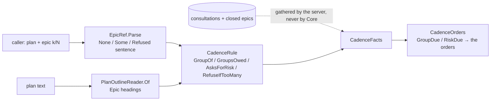
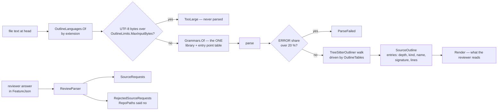

# module: core — findings, sanitizer, counting, rounds

> `src_mcp/core/CoaiMcp.Core` — the pure project. No Process, no HttpClient, no filesystem;
> everything is a pure function under a unit test (`ArchitectureTests` holds the process/network
> line by assembly references; filesystem stays out by review — it is not visible as a reference).

## Purpose

Everything that decides whether a round passes, isolated from everything that runs a round. The
runners (epic 03) and the server (epic 04) carry data to and from this module; they add no rules.

## Flow

```mermaid
flowchart LR
  raw[vendor answer] --> GP[GeminiPayload.Extract\nenvelope → fences → balanced braces]
  GP --> RP[ReviewParser.Parse\nnamed per-entry rejections]
  raw2[codex -o file\nschema-bound] --> RP
  RP --> DD[FindingDedup.Merge\ncategory+file+±5 lines+same remark]
  DD --> GR[GateRule.Evaluate\nblocking+major, prior rejections discounted]
  GR --> RM[RoundMachine.CompleteRound\nverdict: proceed / revise / continue / human / escalate]
  RM --> RES[RoundMachine.Resolve\ndecisions with reasons → next round's memory]
  RES --> DB[(rounds database\nwhat was decided)]
  DD --> SF[StuckFindings.SurvivedAcceptance\nthis round vs earlier decisions of the same stage]
  DB -. read by the server, never by Core .-> SF
  SF -. measures, calls nothing .-> AU[audit line + consult_missed]
```

> `SurvivedAcceptance` is pure and lives here; the earlier decisions it compares against do NOT. The
> session state carries rejections forward (the discount rule needs them) and not acceptances, so the
> server reads them out of the rounds database and hands them in — which is why the call site is
> `PanelService`'s projection and not `RoundMachine.Resolve`. (gemini, story 6's second code round,
> against a first draft of this diagram that drew the arrow the wrong way round.)

## Core entities

| Type | File | Role |
|---|---|---|
| `Finding`, `NormalisedReview`, `RejectedEntry` | `Findings/Finding.cs` | the normalised remark; rejects are named, never dropped |
| `FindingSchema.Json` | `Findings/FindingSchema.cs` | THE one copy of the wire contract (codex `--output-schema`, Gemini prompt) — pinned by SHA-256 |
| `FindingSchema.FeatureJson`, `SchemaFile`, `SchemaShape` | `Findings/FindingSchema.cs`, `Findings/SchemaFile.cs` | the feature reviewer's shape: `Json` + `sourceRequests`, DERIVED; one file per shape on disk |
| `SourceRequest`, `NormalisedReview.SourceRequests` / `RejectedSourceRequests` | `Findings/Finding.cs` | a feature reviewer's request for code, validated at the parser; a bad path is a named rejection |
| `RepoPaths` | `RepoPaths.cs` | whether a path names something INSIDE a repository — lexical; moved here from `GitHistory` |
| `ISourceOutliner`, `OutlineLanguage`, `SourceOutline`, `OutlineLimits` | `Outlining/ISourceOutliner.cs` | the seam of the body-free outline (seven languages); implemented in `CoaiMcp.Normalizer` |
| `FeatureBudget` | `Feature/FeatureBudget.cs` | the feature review's byte budgets, each traced to a measurement (plan §6, S0.2) |
| `ReviewParser` | `Findings/ReviewParser.cs` | vendor JSON → review; unknown severity/category = per-entry rejection |
| `GeminiPayload` | `Findings/GeminiPayload.cs` | `-o json` envelope → fence stripping → string-aware balanced `{…}` |
| `FindingDedup` | `Gate/FindingDedup.cs` | cross-provider merge; severity disagreement resolves toward caution |
| `GateRule`, `PriorRejection`, `GateResult` | `Gate/GateRule.cs` | the counting rule incl. the standing-rejection discount |
| `TextSimilarity` | `Gate/TextSimilarity.cs` | token Jaccard ≥ 0.5 = "same remark" — deterministic, arguable-with |
| `StuckFindings`, `EarlierDecision`, `Survivors` | `Gate/StuckFindings.cs` | how many of this round's findings the caller had already ACCEPTED — phase 2's instrument, calling nothing |
| `SessionState`, `PanelConfig`, `SessionKey` | `Rounds/SessionState.cs` | immutable session; key = normalised repo path + branch |
| `Stage`, `StageDescriptor`, `Stages` | `Rounds/SessionState.cs`, `Rounds/Stages.cs` | the stages, and the ONE table of what each answers by name — bucket, phrase, kind, commands, next stage, sentences, whether it records a commit |
| `RoundMachine`, `RoundVerdict`, `Decision`, `Transition` | `Rounds/RoundMachine.cs` | ordering by refusal; the escalation ladder; resolve feeds rejections forward |
| `RoleDefinition`, `RoleCatalog`, `RoleStages` | `Rounds/RoleCatalog.cs` | which roles exist and which prompt a round of one gets; `Builtin` is the embedded seed |
| `CadenceMode`, `EpicGroup`, `CadenceRule` | `Cadence/CadenceRule.cs` | the consultation cadence's arithmetic: groups of `every` epics counted from the plan's OWN first epic, the risk question from `threshold` epics, nothing past `MostEpics` (14); the defaults 3 / 5 / 3 are the numbers the panel is tested to agree with |
| `EpicRef` (`None` / `Some` / `Refused`), `CadenceState`, `ClosedEpic`, `RiskItem` | `Cadence/EpicRef.cs`, `Cadence/CadenceState.cs` | where the caller says it is (`plan` + `epic: "k/N"`) — a bad declaration is a sentence, never an exception; what one plan has recorded: the epics through the code gate and the risk answer |
| `CadenceFacts`, `CadenceOrders`, `PlanOutline`, `PlanOutlineReader` | `Commands/CadenceOrders.cs`, `Commands/PlanOutline.cs` | the orders a round carries — the group due, the risky pieces due — from facts the server gathered; the plan's own Epic headings, which also size a split `Massive` (`PlanShape.ByEpics`) |
| `RoleEntry`, `PromptEntry`, `RoleComposition` | `Rounds/RoleComposition.cs` | a person's `COAI_ROLES` rows composed onto the seed; every refusal is a sentence, never an exception |

### The catalog is data, and the seed belongs to neither half (2026-09-12)

The roles used to be a closed list in four places at once: a CLR `enum ReviewRole`, five
`const string`s, a 25-row `PromptChoice` array, and a hand-typed mirror of the same rows in the
extension — held level by a test that regexed this project's own C# source. A manager who wants the
gate to check a CV against their own rules cannot be served by any of that without a rebuild of both
halves.

So the built-in catalog is **one file, `shared/builtin-roles.json`**, owned by neither container:
this assembly embeds it (`CoaiMcp.Core.csproj`) and loads it once as `RoleCatalog.Builtin`, and
`BuiltinRoleCatalogTests` asserts the LOADER against the file rather than against any other
implementation — the same shape as `shared/team-server-url-vectors.json` and for the same reason:
two self-consistent implementations cannot notice that they disagree. **The extension's copy is
GENERATED from the same file** (`scripts/generate-builtin-roles.mjs` → `builtinRoles.generated.ts`,
with `prompts.ts` deriving `ROLES` and `PROMPTS` from it), and `builtinRoleCatalog.test.ts` asserts
that loader against the seed field for field. Neither half reads the other's source any more — the
two regular expressions that used to hold them level are gone, and
`NothingReadsAnotherProgramsSourceTests` refuses their return.

Four properties are worth knowing before touching it:

- **A role's first prompt is its general one.** `Universal` used to be a flag that a test had to
  check was set exactly once per role; it is now a position, so the invariant holds by construction
  and `RoleDefinition.General` is `Prompts[0]`.
- **`Prompts` is never empty in a catalogued role, and the RECORD does not enforce it.** Validation
  lives in the construction paths — `FromSeed` for the shipped seed, `Compose` for a person's roles
  — because the two must fail differently: a broken seed is a broken build and throws, while a role
  somebody typed into `COAI_ROLES` has to become a dropped row with a sentence. A type that threw on
  its way in would turn the second into an exception nobody can report.
- **A bad seed is refused whole, loudly, at load.** No roles, a role with no prompts, an unknown
  stage, two roles sharing an id case-insensitively, one prompt id under two roles — each throws
  naming the file and the offender. All five are reachable only by shipping a bad binary, which is
  why they are exceptions rather than values.

### What a person adds, and what it is refused for (2026-09-12)

`RoleComposition.Compose(entries)` puts a person's `COAI_ROLES` rows onto the seed. **Nothing in it
throws** — the mirror image of `FromSeed`, and for a reason worth keeping straight: a seed is ours
and a bad one is a bad build, while an entry is a person's and a mistake in it must not stop the
four roles that are still fine from reviewing. Every refusal is a `"<row>: why"` sentence in
`Dropped`, which `PanelSettings.Unrecognised` carries to the panel.

Five rules, in the order they apply:

1. **A row whose id matches a built-in — without case — is an OVERRIDE, never a new role.** Id, name,
   stage and kind come from the seed whatever the row says: an id keys settings, session files and
   every row of the rounds database, and a name the row could change would only disagree with the
   help. What the row may contribute is `active` and extra prompts, **each only when present** —
   which is why every field of `RoleEntry` but the id is nullable. A non-nullable `active` would read
   an omitted one as `false` and switch Architecture off for somebody who only wanted to add a
   prompt to it.
2. **Every other row is a role of the person's own.** Its id becomes the environment variable
   `COAI_ROUNDS_<ID>`, so it is latin, starts with a letter and carries **no hyphen** — a prompt id
   names a file and wears one, a role id names a variable and `COAI_ROUNDS_MY-ROLE` is not a name a
   POSIX shell can export, which would leave the role's budget settable through the settings file
   and not through the environment or the pasted block. Its stage is `plan` or `result`; it must
   carry prompts, because it has no shipped general one to fall back on. Absent `active` is on,
   absent kind is a programming task, absent name is the id.
3. **Prompt ids are slugs and they are global.** `RolePrompts` keys text files by prompt id alone,
   so two roles naming `rules` would read one file. The slug rule is also what stops an id being a
   path: `../../secrets` is refused here, not at the moment a file is read into a reviewer's prompt.
   Windows device basenames (`con`, `aux`, `com1`…) are refused too — `con.md` is the console rather
   than a file, so the text could be neither written nor read on the platform this is developed on.
4. **At most five active roles per bucket**, and the trim never reaches a built-in — they come first
   in catalog order, so a person's row can never switch a shipped role off by arriving. Beyond that
   the order is the order they were written, so which role is trimmed is predictable rather than
   whichever one the dictionary happened to yield. A trimmed role is left in the catalog switched
   off, with a sentence saying which limit it met. The consequence, said out loud: with all four
   shipped result roles on, one custom result role fits, and the way to make room is to untick a
   built-in.
5. Anything a person added is `BuiltIn = false`, which is what makes it deletable and its text
   restorable-to-nothing rather than restorable-to-shipped.

**A null inside the list is a refusal, not a crash.** Every FIELD of a row was nullable from the
start; the ROW being null was forgotten, and `[null, {…}]` — which a person can type and a
deserialiser hands over intact — aborted the whole composition, taking the four shipped roles down
with one mistyped line. A null list is no rows, a null row is one sentence, a null prompt is one
sentence, and everything else still composes. The same goes for a row with no id at all, which is
refused under `<a row with no id>` rather than under an empty string nobody can search for.

`PanelConfig` gained `Catalog` alongside `Roles`: what a role IS, beside how much it may spend. A
role with no gate of its own falls back to its stage's shipped default, which is what makes a role
somebody just created work with no further settings at all.
- **Ids are permanent.** `COAI_ROUNDS_ARCHITECTURE`, `coai.rounds`, every session file and every
  `coai.db` row is keyed by the role id, so a rename in the seed is a migration and not an edit.
  `PromptChoice.BuiltIn` marks a prompt the binary ships a text for: it can be overridden and
  restored, never deleted.

### The consultation cadence is decided here and gathered elsewhere (2026-09-26)

What a plan owes is arithmetic and lives in Core; what it has already had is on disk and lives in the
server ([PLAN_consult_on_a_cadence.md](PLAN_consult_on_a_cadence.md), [module_server.md](module_server.md)).
Core never reads a consultation record or a round: the server's `CadenceDesk` builds the
`CadenceFacts`, `CadenceGate.WithEvidence` adds what the store holds, and Core answers with orders and a
refusal sentence.

## The decisions a reader needs

- **A role can be absent from a round for two different reasons, and they are not interchangeable.**
  Its budget is spent — it reviewed and has no round left, a fact about THIS round — or the operator
  switched it off, a fact about the whole stage. `RoleGate.Enabled` carries the second, defaulted to
  `true` positionally so every construction site that predates it keeps meaning what it meant and
  "absent means on" holds by construction rather than by a rule somebody has to remember.
  `EnabledRolesOf(stage)` is the member both `RolesForRound` and `For(Stage)` read, so a switched-off
  role lends the stage neither its round budget nor its threshold — leaving either in would keep a
  stage running rounds nobody reviews, or hold the gate open against a number no reviewer can bring
  down. With every code role off it answers empty and `For(Stage)` is `NoEnabledRoles` — `(0, 0)` —
  rather than an exception out of `Max`, because the caller that must refuse the round needs a value
  to read, not a throw to catch.
- **Verdict at completion, stage advance at resolve.** `CompleteRound` computes the verdict and sets
  `AdvanceOnResolve`; only `Resolve` moves the stage. So findings are never left undecided: even a
  passing round's minors must be accepted/rejected before the next stage opens.
- **The ladder** (`ReviewerEffortUp → ReviewerModelUp → ArbiterModelUp`) fires one step per
  exhausted stage and resets the round counter; exhausted ladder falls through to `CallHuman`.
- **A rejection without a reason refuses the whole resolve** — the reason is what the discount rule
  compares future `why`s against.
- **"Stuck" is a finding the caller ACCEPTED and was handed back, and it is not `re_raised`.** That one
  is a reviewer pressing a standing REJECTION — a disagreement the caller is defending, and the more
  interesting of the two for reading an argument. `StuckFindings.SurvivedAcceptance` counts the
  opposite and the more expensive one: the caller agreed, changed the plan or the code, and the same
  defect came back. The matching is `FindingDedup.SameDefect`, because a second similarity rule would
  be a second answer to a question this module has already answered; the LATEST decision about a
  defect decides (accepted, then rejected, then raised again is the disagreement, not this), and the
  round NAMED is the latest ACCEPTANCE — the one that was in force when the defect returned.
- **It measures and calls nothing, deliberately.** The operator's question is whether an automatic
  consultation should fire when a finding survives two rounds, and that cannot be answered by an
  impression of how often it happens. So the number lands on the round (`rounds.consult_missed`,
  `-1` until something counted it) and one sentence goes into the audit — *"an automatic consultation
  could have fired here"*, never *"consult now"*. A trigger that fired before anybody had read the
  number would be the same guess with a cost attached.

## Tests

`CoaiMcp.Tests`: ReviewParserTests, GeminiPayloadTests, FindingDedupTests, GateRuleTests,
RoundMachineTests, ArchitectureTests, BuiltinRoleCatalogTests, StuckFindingsTests, StagesTests. Teeth
proven red for: the balanced-brace scan (naive first-to-last), the standing-rejection discount
(disabled), the ladder order (reversed), the catalog loader (written before `RoleCatalog` existed,
watched failing to compile, then watched failing on the prompt COUNT — the plan said 26 and the seed
has 25, which is why the number is pinned rather than the shape), and the stage table (a `FeatureReview`
member planted in the enum with no row: six tests red, in this module and the server's).

## Every stage answers by name — `Stages` (2026-09-25)

`Rounds/Stages.cs` is one exhaustive table, a `StageDescriptor` row per `Stage`, and the only place
these facts about a stage live:

| column | read by | what it answers |
|---|---|---|
| `Bucket` | `PanelConfig.BucketFor` | which roles review it (the bridge to the persisted role string, below) |
| `Phrase` | `Stages.PhraseOf` → `RoundSubject.StageName` | "plan review" / "code review" / "document review" / "done" — a notice, a log line |
| `Kind` | `RoundRefusals.ReviewKindOf` (server) | the adjective in "every code-review role is switched off" |
| `Commands` | `PanelService.CommandStageOf` (server) | which of a person's custom commands a round of it is given |
| `AdvancesTo` | `RoundMachine.Resolve` | where `resolve` moves the session once a round passed |
| `CompletedSentence` | `PanelService.Finish` (server) | what `resolve` says at that moment |
| `ReviseInstruction` | `PanelService.AnswerFor` (server) | what a `revise` verdict tells the caller to do with accepted findings |
| `RecordsSha` | the `Sha` write on the finished round (server) | whether the round keeps the commit it reviewed, for `again` |

`Stages.Of(stage)` throws for a value outside the enum ("map it here"), and `StagesTests` walks
`Enum.GetValues<Stage>()` so a member without a row is a red test rather than a silent default.
`PhraseOf` takes the stage as it was WRITTEN DOWN — a round record's string — and answers the text
itself when this build has no row for it: never "done", because a round written by a newer build is
not a finished one.

**Why a table.** §9 of the feature-review plan counted the switches: two were exhaustive
(`BucketFor`, `ProviderSettings.Reviews` in the server) and four swallowed an unknown stage with a
discard — `StageName` said "done" (so a document review's `call_human` notice read "The **done** gate
needs your decision"), `ReviewKindOf` said "code", `CommandStageOf` said `Any`, and `Finish` said
"The code stage is complete" for any session that reached `Done`, a document review included. A
fourth stage would have inherited all four without a compile error. Every existing bucket, phrase and
sentence is pinned by LITERAL in `StagesTests`, so the table changed nothing on disk or on the wire;
only the document review's two sentences are new, because they were wrong. `Stage.Done` is a row
rather than an exception (`status` reads a finished session's budget through its bucket), and its
other columns are what the discards used to answer. Only the columns the existing stages READ are
there — a field nothing reads is a claim nothing checks; the fourth stage adds its own with the
reader that needs them. `ProviderSettings.Reviews` stays a throwing switch in the server, by the plan.

## Which roles a round runs — the BUCKET

`RoleCatalog.InBucket(bucket)` is what selects a round's roster, and `PanelConfig.BucketFor(Stage)`
— reading the stage's row in `Stages` — is the ONE place the orchestration `Stage` meets the string a
role is persisted with:

| `Stage` | bucket | what it reads |
|---|---|---|
| `PlanReview` | `plan:code` | the plan document |
| `CodeReview` | `result:code` | the branch diff |
| `DocumentReview` | `result:document` | a document |
| *(none)* | `plan:document` | nothing yet — stored, composed, counted, run by no stage |

A document role's own `RoleDefinition.Stage` stays the STRING `result` with
`ProgrammingTask: false`, in the seed, in `COAI_ROLES`, in every session file. `Stage.DocumentReview`
appears in none of them.

It was `RolesOf(stage)` with `&& r.ProgrammingTask` baked in until plan 4, which is exactly where a
document role stopped: composed, budgeted, switchable, and in no round. The kind is part of what is
ASKED FOR now rather than a condition on the answer — and the rename was deliberate, so every call
site became a compile error rather than a silently empty list.

The five-active limit has counted per bucket since plan 1 (`RoleComposition.MaxActivePerBucket`); the
extension counted per STAGE until plan 4, which was invisible only because document roles ran in
nothing.

## `IAstNormalizer` — a native parser that cannot spread (2026-09-15)

`Normalising/IAstNormalizer.cs` is a seam and nothing else: `SourceLanguage`, `EnclosingSymbol`, and
two operations — which language a path is in, and which function a line fell inside. The core names no
parser, no node and no P/Invoke, and does no IO; the caller reads the file out of git, because only
the caller knows which commit it wants.

It exists because a finding names a file and a line and nothing else. `Finding` has no symbol field
(and gaining one would only work on findings not yet written), so the corpus collector resolves the
enclosing method mechanically instead — which works retroactively on everything already stored.

**The implementation lives in `CoaiMcp.Normalizer` and nowhere else**, over tree-sitter. That was the
third condition of the operator's approval of `TreeSitter.DotNet` on 2026-09-15: an individual's
native dependency may be taken, but it may not spread. `ArchitectureTests.OnlyTheNormalizerNamesTreeSitter`
holds the line from both ends — the core, the runners and `coai-mcp` must not reference the parser,
and the normalizer must, which is what stops the check passing vacuously.

It is also what keeps the rejected alternative cheap. Roslyn for C# and the TypeScript compiler API
for the rest was declined because two engines means two property tests guarding one guarantee; if the
dependency ever has to go, it returns as a second implementation of this interface rather than a
second design.

**Syntax, not semantics**, is why one parser is enough for three languages: finding the function
around a line and telling an identifier from the syntax around it need node kinds, never a type.

Two facts about the grammars, both learned by running them:

- The per-language table holds a **library and an entry point**, which are not the same word. The
  binding derives both from one id — `tree-sitter-{id}` and `tree_sitter_{id}` — and so cannot name
  C# at all: that grammar is `tree-sitter-c-sharp` with an entry point of `tree_sitter_c_sharp`.
- A C# `method_declaration` **includes** its modifiers; a TypeScript `function_declaration` does
  **not** include `export`, which belongs to the statement wrapping it. Left as the grammar has it:
  a vector is built per language and compared against its own, and `export` is not control flow, a
  synchronisation primitive, an await point or a runtime type.

### The skeleton, and what a skeleton may contain (2026-09-15)

`Normalising/RuntimeVocabulary.cs` is the anonymity guarantee, and it is a **whitelist**. "Remove
everything that looks like a domain name" cannot be checked — that set is unbounded. "Keep nothing but
these words" can: every word in a skeleton is a generated placeholder, a language keyword, or a member
of this list, and anything else is a leak by definition. `Normalising/Skeleton.Leaks` is that check,
pure and in the core so the collector and the ingest server run the same code rather than two
descriptions of one rule.

**The rule for what belongs in the vocabulary: it must ship with the language.** `ConcurrentDictionary`
and `Promise` are facts about a runtime and carry the failure physics — a check-then-act race is
`ContainsKey` followed by `Add`, and losing those two words loses the bug. `InvoiceService` is a fact
about us. The list errs SMALL: a runtime name that is missing gets renamed, which costs signal and
leaks nothing; a domain name wrongly added leaks everything.

**The vocabulary protects a REFERENCE, never a DECLARATION.** `GetOrAdd` is a runtime name when
something calls it on a concurrent dictionary and it is ours when it is the method being declared —
you cannot declare a name the runtime owns. Without that distinction a method this repository happens
to call `GetOrAdd`, `Add` or `Count` keeps its own name in the skeleton, which is a leak dressed as a
runtime word.

Two checks guard the same promise, and they fail differently. The collector holds the original and can
assert the **blacklist** — no word of ours survived. The ingest server has never seen an original and
can only assert the **whitelist**. The whitelist is weaker on paper and stronger in shape: it cannot be
defeated by a name nobody thought to forbid.

#### What the property test found

`ZeroKnowledgeTests` runs both checks over this repository's own source — code nobody wrote with a
normaliser in mind. It caught four real defects that fixtures had not:

- **Declaration detection by substring.** A bare method — which is exactly what the collector extracts
  — parses as `global_statement → local_function_statement`, a kind containing neither "declaration"
  nor "definition". Its name went unrenamed.
- **Char offsets, not bytes.** The binding reports positions in UTF-16 code units, not tree-sitter's
  own UTF-8 bytes. Splicing bytes produced skeletons full of word fragments (`ng`, `ld`, `he`) — and
  only on files containing an em dash, which is most of this repository's comments.
- **A constructor does not parse alone.** Parsed standalone it yields a malformed tree whose parameters
  carry no `name` field. The normaliser now reparses inside a wrapper type when the grammar reports an
  error, and removes the wrapper afterwards.
- **`implicit_parameter`.** A C# lambda written `f => f.Name` gives its parameter that node kind, which
  contains no "identifier" — so it was skipped while the `f` in the body was renamed, and the skeleton
  read `method_2(f => var_3.method_3)`.

Each is now its own test. The class also carries a positive control — that the finder finds methods at
all — because a property test iterating an empty list reports success, which is the failure mode such a
test is least able to notice about itself.

## `ISourceOutliner` — the feature review's reader, and the shape its reviewer answers in (2026-09-25)

Story S1.3 of [PLAN_feature_review.md](../todo/PLAN_feature_review.md). A feature reviewer is sent the
SHAPE of every changed file and asks for code by name (plan D3/D4); this is that shape, and the schema
it asks in.

- **A separate seam, not a wider `SourceLanguage`.** `OutlineLanguage` names seven languages (C#,
  TypeScript, TSX, JavaScript, Rust, PHP, Python); `SourceLanguage` stays three, because it is the defect
  corpus's trust boundary and the normalizer's function table falls through to JavaScript kinds for
  anything it does not name. The collector still reads `.tsx` as TypeScript — pinned by
  `OutlinerGrammarTests.TheCollectorsTsxBehaviour_IsUnchanged`.
- **One grammar table for both implementations** — `normalizer/Grammars.cs`. PHP's entry point is
  `tree_sitter_php`, decided by loading: `tree_sitter_php_only` is not exported by the library this
  package ships. `shared/kept-grammars.txt` is the union of both interfaces' grammars, and
  `KeptGrammarsTests` asks `Grammars` rather than keeping a third list.
- **No body by construction.** A signature runs from the declaration's start (a wrapper's — `export`,
  `declare`, a Python decorator — when it has one) to the start of its `body` field or the table's other
  cut fields (a C# property's `accessors`/`value`), whitespace collapsed, at most 240 characters. A
  declaration with no body field is shown whole, cut at the first body nested in it. The walk goes
  THROUGH nodes the table does not name, never into anybody's `body`, never into an anonymous callable.
  Every fixture marks its body lines with `secret…`, and `OutlinerTests.NoLineOfABody_AppearsInTheOutline`
  holds all seven languages to it. Special cases are table data: Python's `decorated_definition` and
  TypeScript's `export` are wrappers; `const f = () =>` is kind `function`; a Rust `impl` is named
  `Trait for Type`.
- **Tables are data, exhaustive, no `_ =>`.** `OutlineTables.For` names every `OutlineLanguage` with
  CS8524 silenced, so a named language without a table is a build error (CS8509).
- **Refusals are answers.** Over 1 MiB of UTF-8 is `TooLarge`, checked before any parse; more than 20 %
  of the text under ERROR nodes is `ParseFailed`; every result carries its size and its measured
  `ErrorShare`.
- **The feature schema is derived.** `FindingSchema.FeatureJson` = `FindingSchema.Json` plus
  `sourceRequests: [{file, symbol|null, startLine|null, endLine|null, why}] | null`, added to the PARSED
  base (`JsonNode`, written through a `Utf8JsonWriter` — no reflection) so the findings part cannot drift
  and a reindented base derives the same schema (the first version searched the text for literal
  anchors; epic 1's code round, `TheFeatureSchema_DerivesFromAReformattedBase_TheSameWay`); `Json` is pinned by SHA-256
  (`TheFeatureSchemaTests`) and both shapes meet OpenAI's strict rules (`FindingSchemaTests`).
  `SchemaFile.Ensure(dir, SchemaShape.Feature)` writes `finding-schema-feature.json`, never the file
  every other round reads.
- **A request is validated where it is parsed.** `ReviewParser` reads `sourceRequests` into
  `NormalisedReview.SourceRequests` (empty, never null); a path that is absolute, drive-qualified or climbs
  out with `..` (`RepoPaths`, moved to the core from `GitHistory`), or a span that is no span, is a
  `RejectedEntry` in `RejectedSourceRequests` — never a crash, never a lost finding.
- **`FeatureBudget`** holds only the budgets S0.2 could measure (plan, outline, collapse threshold,
  omissions reserve, file cap), each traced to a row in the plan's §6.
