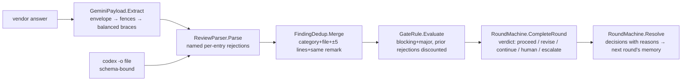

# module: core — findings, sanitizer, counting, rounds

> `src_mcp/core/CoaiMcp.Core` — the pure project. No Process, no HttpClient, no filesystem;
> everything is a pure function under a unit test (`ArchitectureTests` holds the process/network
> line by assembly references; filesystem stays out by review — it is not visible as a reference).

## Purpose

Everything that decides whether a round passes, isolated from everything that runs a round. The
runners (epic 03) and the server (epic 04) carry data to and from this module; they add no rules.

## Flow

## Core entities

| Type | File | Role |
|---|---|---|
| `Finding`, `NormalisedReview`, `RejectedEntry` | `Findings/Finding.cs` | the normalised remark; rejects are named, never dropped |
| `FindingSchema.Json` | `Findings/FindingSchema.cs` | THE one copy of the wire contract (codex `--output-schema`, Gemini prompt) |
| `ReviewParser` | `Findings/ReviewParser.cs` | vendor JSON → review; unknown severity/category = per-entry rejection |
| `GeminiPayload` | `Findings/GeminiPayload.cs` | `-o json` envelope → fence stripping → string-aware balanced `{…}` |
| `FindingDedup` | `Gate/FindingDedup.cs` | cross-provider merge; severity disagreement resolves toward caution |
| `GateRule`, `PriorRejection`, `GateResult` | `Gate/GateRule.cs` | the counting rule incl. the standing-rejection discount |
| `TextSimilarity` | `Gate/TextSimilarity.cs` | token Jaccard ≥ 0.5 = "same remark" — deterministic, arguable-with |
| `SessionState`, `PanelConfig`, `SessionKey` | `Rounds/SessionState.cs` | immutable session; key = normalised repo path + branch |
| `RoundMachine`, `RoundVerdict`, `Decision`, `Transition` | `Rounds/RoundMachine.cs` | ordering by refusal; the escalation ladder; resolve feeds rejections forward |
| `RoleDefinition`, `RoleCatalog`, `RoleStages` | `Rounds/RoleCatalog.cs` | which roles exist and which prompt a round of one gets; `Builtin` is the embedded seed |
| `RoleEntry`, `PromptEntry`, `RoleComposition` | `Rounds/RoleComposition.cs` | a person's `COAI_ROLES` rows composed onto the seed; every refusal is a sentence, never an exception |

### The catalog is data, and the seed belongs to neither half (2026-09-12)

The roles used to be a closed list in four places at once: a CLR `enum ReviewRole`, five
`const string`s, a 25-row `PromptChoice` array, and a hand-typed mirror of the same rows in the
extension — held level by a test that regexed this project's own C# source. A manager who wants the
gate to check a CV against their own rules cannot be served by any of that without a rebuild of both
halves.

So the built-in catalog is **one file, `shared/builtin-roles.json`**, owned by neither container:
this assembly embeds it (`CoaiMcp.Core.csproj`) and loads it once as `RoleCatalog.Builtin`, and
`BuiltinRoleCatalogTests` asserts the LOADER against the file rather than against any other
implementation — the same shape as `shared/team-server-url-vectors.json` and for the same reason:
two self-consistent implementations cannot notice that they disagree. **The extension still carries
its own hand-typed mirror** (`prompts.ts`) and still has the regex-over-C# test holding the two
level; generating that copy from this seed is a later story of the same plan, and until it lands
this paragraph describes one half, not both.

Four properties are worth knowing before touching it:

- **A role's first prompt is its general one.** `Universal` used to be a flag that a test had to
  check was set exactly once per role; it is now a position, so the invariant holds by construction
  and `RoleDefinition.General` is `Prompts[0]`.
- **`Prompts` is never empty in a catalogued role, and the RECORD does not enforce it.** Validation
  lives in the construction paths — `FromSeed` for the shipped seed, `Compose` for a person's roles
  — because the two must fail differently: a broken seed is a broken build and throws, while a role
  somebody typed into `COAI_ROLES` has to become a dropped row with a sentence. A type that threw on
  its way in would turn the second into an exception nobody can report.
- **A bad seed is refused whole, loudly, at load.** No roles, a role with no prompts, an unknown
  stage, two roles sharing an id case-insensitively, one prompt id under two roles — each throws
  naming the file and the offender. All five are reachable only by shipping a bad binary, which is
  why they are exceptions rather than values.

### What a person adds, and what it is refused for (2026-09-12)

`RoleComposition.Compose(entries)` puts a person's `COAI_ROLES` rows onto the seed. **Nothing in it
throws** — the mirror image of `FromSeed`, and for a reason worth keeping straight: a seed is ours
and a bad one is a bad build, while an entry is a person's and a mistake in it must not stop the
four roles that are still fine from reviewing. Every refusal is a `"<row>: why"` sentence in
`Dropped`, which `PanelSettings.Unrecognised` carries to the panel.

Five rules, in the order they apply:

1. **A row whose id matches a built-in — without case — is an OVERRIDE, never a new role.** Id, name,
   stage and kind come from the seed whatever the row says: an id keys settings, session files and
   every row of the rounds database, and a name the row could change would only disagree with the
   help. What the row may contribute is `active` and extra prompts, **each only when present** —
   which is why every field of `RoleEntry` but the id is nullable. A non-nullable `active` would read
   an omitted one as `false` and switch Architecture off for somebody who only wanted to add a
   prompt to it.
2. **Every other row is a role of the person's own.** Its id becomes the environment variable
   `COAI_ROUNDS_<ID>`, so it is latin, starts with a letter and carries **no hyphen** — a prompt id
   names a file and wears one, a role id names a variable and `COAI_ROUNDS_MY-ROLE` is not a name a
   POSIX shell can export, which would leave the role's budget settable through the settings file
   and not through the environment or the pasted block. Its stage is `plan` or `result`; it must
   carry prompts, because it has no shipped general one to fall back on. Absent `active` is on,
   absent kind is a programming task, absent name is the id.
3. **Prompt ids are slugs and they are global.** `RolePrompts` keys text files by prompt id alone,
   so two roles naming `rules` would read one file. The slug rule is also what stops an id being a
   path: `../../secrets` is refused here, not at the moment a file is read into a reviewer's prompt.
4. **At most five active roles per bucket**, and the trim never reaches a built-in — they come first
   in catalog order, so a person's row can never switch a shipped role off by arriving. Beyond that
   the order is the order they were written, so which role is trimmed is predictable rather than
   whichever one the dictionary happened to yield. A trimmed role is left in the catalog switched
   off, with a sentence saying which limit it met. The consequence, said out loud: with all four
   shipped result roles on, one custom result role fits, and the way to make room is to untick a
   built-in.
5. Anything a person added is `BuiltIn = false`, which is what makes it deletable and its text
   restorable-to-nothing rather than restorable-to-shipped.

`PanelConfig` gained `Catalog` alongside `Roles`: what a role IS, beside how much it may spend. A
role with no gate of its own falls back to its stage's shipped default, which is what makes a role
somebody just created work with no further settings at all.
- **Ids are permanent.** `COAI_ROUNDS_ARCHITECTURE`, `coai.rounds`, every session file and every
  `coai.db` row is keyed by the role id, so a rename in the seed is a migration and not an edit.
  `PromptChoice.BuiltIn` marks a prompt the binary ships a text for: it can be overridden and
  restored, never deleted.

## The decisions a reader needs

- **A role can be absent from a round for two different reasons, and they are not interchangeable.**
  Its budget is spent — it reviewed and has no round left, a fact about THIS round — or the operator
  switched it off, a fact about the whole stage. `RoleGate.Enabled` carries the second, defaulted to
  `true` positionally so every construction site that predates it keeps meaning what it meant and
  "absent means on" holds by construction rather than by a rule somebody has to remember.
  `EnabledRolesOf(stage)` is the member both `RolesForRound` and `For(Stage)` read, so a switched-off
  role lends the stage neither its round budget nor its threshold — leaving either in would keep a
  stage running rounds nobody reviews, or hold the gate open against a number no reviewer can bring
  down. With every code role off it answers empty and `For(Stage)` is `NoEnabledRoles` — `(0, 0)` —
  rather than an exception out of `Max`, because the caller that must refuse the round needs a value
  to read, not a throw to catch.
- **Verdict at completion, stage advance at resolve.** `CompleteRound` computes the verdict and sets
  `AdvanceOnResolve`; only `Resolve` moves the stage. So findings are never left undecided: even a
  passing round's minors must be accepted/rejected before the next stage opens.
- **The ladder** (`ReviewerEffortUp → ReviewerModelUp → ArbiterModelUp`) fires one step per
  exhausted stage and resets the round counter; exhausted ladder falls through to `CallHuman`.
- **A rejection without a reason refuses the whole resolve** — the reason is what the discount rule
  compares future `why`s against.

## Tests

`CoaiMcp.Tests`: ReviewParserTests, GeminiPayloadTests, FindingDedupTests, GateRuleTests,
RoundMachineTests, ArchitectureTests, BuiltinRoleCatalogTests. Teeth proven red for: the
balanced-brace scan (naive first-to-last), the standing-rejection discount (disabled), the ladder
order (reversed), and the catalog loader (written before `RoleCatalog` existed, watched failing to
compile, then watched failing on the prompt COUNT — the plan said 26 and the seed has 25, which is
why the number is pinned rather than the shape).
