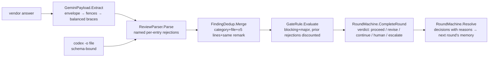

# module: core — findings, sanitizer, counting, rounds

> `src_mcp/core/CoaiMcp.Core` — the pure project. No Process, no HttpClient, no filesystem;
> everything is a pure function under a unit test (`ArchitectureTests` holds the process/network
> line by assembly references; filesystem stays out by review — it is not visible as a reference).

## Purpose

Everything that decides whether a round passes, isolated from everything that runs a round. The
runners (epic 03) and the server (epic 04) carry data to and from this module; they add no rules.

## Flow

## Core entities

| Type | File | Role |
|---|---|---|
| `Finding`, `NormalisedReview`, `RejectedEntry` | `Findings/Finding.cs` | the normalised remark; rejects are named, never dropped |
| `FindingSchema.Json` | `Findings/FindingSchema.cs` | THE one copy of the wire contract (codex `--output-schema`, Gemini prompt) |
| `ReviewParser` | `Findings/ReviewParser.cs` | vendor JSON → review; unknown severity/category = per-entry rejection |
| `GeminiPayload` | `Findings/GeminiPayload.cs` | `-o json` envelope → fence stripping → string-aware balanced `{…}` |
| `FindingDedup` | `Gate/FindingDedup.cs` | cross-provider merge; severity disagreement resolves toward caution |
| `GateRule`, `PriorRejection`, `GateResult` | `Gate/GateRule.cs` | the counting rule incl. the standing-rejection discount |
| `TextSimilarity` | `Gate/TextSimilarity.cs` | token Jaccard ≥ 0.5 = "same remark" — deterministic, arguable-with |
| `SessionState`, `PanelConfig`, `SessionKey` | `Rounds/SessionState.cs` | immutable session; key = normalised repo path + branch |
| `RoundMachine`, `RoundVerdict`, `Decision`, `Transition` | `Rounds/RoundMachine.cs` | ordering by refusal; the escalation ladder; resolve feeds rejections forward |
| `RoleDefinition`, `RoleCatalog`, `RoleStages` | `Rounds/RoleCatalog.cs` | which roles exist and which prompt a round of one gets; `Builtin` is the embedded seed |

### The catalog is data, and the seed belongs to neither half (2026-09-12)

The roles used to be a closed list in four places at once: a CLR `enum ReviewRole`, five
`const string`s, a 25-row `PromptChoice` array, and a hand-typed mirror of the same rows in the
extension — held level by a test that regexed this project's own C# source. A manager who wants the
gate to check a CV against their own rules cannot be served by any of that without a rebuild of both
halves.

So the built-in catalog is **one file, `shared/builtin-roles.json`**, owned by neither container:
this assembly embeds it (`CoaiMcp.Core.csproj`) and loads it once as `RoleCatalog.Builtin`; the
extension generates its copy from the same file. Each half asserts its own LOADER against the file
— `BuiltinRoleCatalogTests` here, `builtinRoleCatalog.test.ts` there — rather than against the other
half's source, which is the same shape as `shared/team-server-url-vectors.json` and for the same
reason: two self-consistent implementations cannot notice that they disagree.

Three properties are worth knowing before touching it:

- **A role's first prompt is its general one.** `Universal` used to be a flag that a test had to
  check was set exactly once per role; it is now a position, so the invariant holds by construction
  and `RoleDefinition.General` is `Prompts[0]`.
- **`Prompts` is never empty** — the record throws on an empty list rather than letting `General`
  become an `IndexOutOfRangeException` reached from a configuration file. Only the seed loader and
  (from the next story) the composition construct one, and both validate first.
- **Ids are permanent.** `COAI_ROUNDS_ARCHITECTURE`, `coai.rounds`, every session file and every
  `coai.db` row is keyed by the role id, so a rename in the seed is a migration and not an edit.
  `PromptChoice.BuiltIn` marks a prompt the binary ships a text for: it can be overridden and
  restored, never deleted.

## The decisions a reader needs

- **A role can be absent from a round for two different reasons, and they are not interchangeable.**
  Its budget is spent — it reviewed and has no round left, a fact about THIS round — or the operator
  switched it off, a fact about the whole stage. `RoleGate.Enabled` carries the second, defaulted to
  `true` positionally so every construction site that predates it keeps meaning what it meant and
  "absent means on" holds by construction rather than by a rule somebody has to remember.
  `EnabledRolesOf(stage)` is the member both `RolesForRound` and `For(Stage)` read, so a switched-off
  role lends the stage neither its round budget nor its threshold — leaving either in would keep a
  stage running rounds nobody reviews, or hold the gate open against a number no reviewer can bring
  down. With every code role off it answers empty and `For(Stage)` is `NoEnabledRoles` — `(0, 0)` —
  rather than an exception out of `Max`, because the caller that must refuse the round needs a value
  to read, not a throw to catch.
- **Verdict at completion, stage advance at resolve.** `CompleteRound` computes the verdict and sets
  `AdvanceOnResolve`; only `Resolve` moves the stage. So findings are never left undecided: even a
  passing round's minors must be accepted/rejected before the next stage opens.
- **The ladder** (`ReviewerEffortUp → ReviewerModelUp → ArbiterModelUp`) fires one step per
  exhausted stage and resets the round counter; exhausted ladder falls through to `CallHuman`.
- **A rejection without a reason refuses the whole resolve** — the reason is what the discount rule
  compares future `why`s against.

## Tests

`CoaiMcp.Tests`: ReviewParserTests, GeminiPayloadTests, FindingDedupTests, GateRuleTests,
RoundMachineTests, ArchitectureTests, BuiltinRoleCatalogTests. Teeth proven red for: the
balanced-brace scan (naive first-to-last), the standing-rejection discount (disabled), the ladder
order (reversed), and the catalog loader (written before `RoleCatalog` existed, watched failing to
compile, then watched failing on the prompt COUNT — the plan said 26 and the seed has 25, which is
why the number is pinned rather than the shape).
