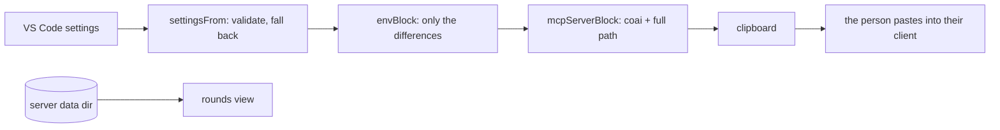

# module: extension — ConnectOtherAIs in VS Code

> `src_vs_code` — the human surface. Four commands, zero runtime dependencies, no background work
> and **no port**: the review itself lives in `coai-mcp`, which an MCP client owns and starts.

## Commands

| Command | Does |
|---|---|
| `coai.installServer` | Downloads the latest `mcp-v*` asset for this RID into the extension's storage, verifies its `.sha256`, extracts with `tar`, remembers the version, and puts the `mcpServers` block on the clipboard |
| `coai.copyConfigBlock` | Regenerates that block from current settings — the way changed settings reach the server |
| `coai.copyClaudeSnippet` | The CLAUDE.md text teaching a target repo's main AI the tool order |
| `coai.showRounds` | Writes `<dataDir>/rounds.md` from the server's own session files and opens it — a REAL file, so closing it never asks to save, and it is rewritten in place while a round runs |

## How settings reach the server

One way, in the `env` of the copied block — the MCP client owns the server's process and its config
is static, so there is nowhere else for configuration to cross. `envBlock` emits **only what differs
from the server's own defaults**, so a pristine configuration produces no `env` at all. A settings
change is therefore: change it, copy the block again, restart the client.



## What it deliberately does not do

- **Never writes another program's config file.** The block is offered; the person sees what they
  grant, and several clients can coexist. (CredsForDevs' reasoning, kept.)
- **Never puts a binary on `PATH`.** Extension storage: uninstall removes it, and the full path is
  what the block carries anyway.
- **Never installs unverified bytes.** A missing `.sha256` is refused OUT LOUD — a quiet skip is
  indistinguishable from a check that passed.
- **Opens no port — still.** Escalation was the one case that needed a channel, and it arrives as a
  FILE in the same data directory: `EscalationWatcher` watches `escalations/*.json`, raises a modal,
  keeps a status-bar item so a dismissed modal loses nothing, lists open questions at the TOP of the
  rounds view, and writes the answer atomically (temp + rename) because half a file must never
  resolve a question.
- **No account, no sign-in, no cloud service of its own.**

## Entities

| Module | Role |
|---|---|
| `settingsShape.ts` | config → validated `CoaiSettings`; `envBlock`; the defaults pinned to the master plan's table |
| `coaiInstall.ts` | pure install decisions: RID (macOS honestly absent), asset/entry names, version compare, update-available |
| `installer.ts` | the impure half: fetch, sha256, `tar`, chmod, remembered version |
| `mcpBlock.ts` | the `mcpServers` block (server id `coai`), client targets, install message |
| `claudeSnippet.ts` | the paste for a target repo's CLAUDE.md |
| `rounds.ts` | parse the server's session files; render the view (status, elapsed, tokens, cost, the reviewers in flight); a torn file is skipped; a file from an older server with no status still renders |
| `panelView.ts` | the sidebar's HTML, pure: sections, vendor cards with the green run button, the two live regions (`live-questions`, `live-rounds`) |
| `panelProvider.ts` | the wiring: repaint ONLY when a control changed, live regions posted instead; vendor add/remove (confirmed)/run-in-terminal |
| `vendorTerminal.ts` | pure: which CLI a vendor is, its own usage command (`/usage`, `/status`, `/stats`), and the provider overrides a custom endpoint needs |
| `escalations.ts` | pure: parse a question, the answer file's shape, status-bar text, prompt-once, modal body, the open-questions section |
| `escalationWatcher.ts` | the impure half: file watcher + a 5s poll (a watcher on a path outside the workspace is not guaranteed), the modal, the status-bar item, the atomic answer write |
| `extension.ts` | activation, the four commands, the update offer |

## Three UI decisions with a cause

- **A repaint is conditional, and live data is posted.** Assigning `webview.html` RELOADS the
  webview, which closes any open `<select>`. With the escalation watcher ticking every five seconds
  and a running round rewriting its session file constantly, an unconditional repaint shut every
  dropdown in the panel two or three seconds after it was opened. Now a change to the CONTROLS
  repaints; `live-questions` and `live-rounds` are patched through `postMessage`.
- **The rounds view is a file on disk.** It used to be an untitled document built from a string,
  which VS Code treats as unsaved work — so every close asked whether to save content that is
  derived and regenerated on demand. `<dataDir>/rounds.md` closes silently, reopens in the same tab,
  and is rewritten while it is open so a running round advances on screen.
- **Every default vendor is also a preset.** Gemini shipped as a default and was missing from
  "Add a reviewer", so removing it was a one-way door. `vendors.test.ts` now holds that shut.

## Verified

90 `node:test` cases over the pure modules; `.vsix` packaged in CI and installed by hand on
2026-08-31; the released win-x64 asset downloaded, checksum-matched, extracted with Windows
bsdtar and registered — `claude mcp list` reported `coai ✔ Connected`.

### What repaints, and what is patched (2026-09-01)

The panel has two update paths, and `staticKey` (in `panelView.ts`, so it is testable without
`vscode`) decides which one runs. A repaint reloads the webview and closes any open dropdown, so it
is reserved for the person's own doing; everything that moves by itself travels through
`liveRegions` and is patched into `#live-questions`, `#live-rounds` and `#live-usage`.

**Anything missing from that key is a control that can never change.** The spending window was
missing: clicking Today, Month or Year recorded the choice, produced an identical key, and
repainted nothing — the section sat on Week for good and the buttons read as broken, because they
were. `usageWindow` and `latestServerVersion` are now in the key; the spending ROWS are a live
region, so they advance mid-round without closing a dropdown. The window tabs deliberately sit
OUTSIDE that region: a button inside a patched region loses its click listener on the next tick.

### The rounds view refreshes for a RESTORED tab too

`refreshRoundsFile` rewrites `rounds.md` only while somebody has it open, and "open" was an exact
string comparison of two Windows paths. VS Code hands back `c:\Users\…` for a tab it restored and
`C:\Users\…` for one this extension opened, so a restored tab silently stopped being refreshed and
the file went stale while rounds kept running. `roundsViewIsOpen` (in `rounds.ts`, pure) compares
case-insensitively.

### A panel button cannot be wired to nothing (2026-09-01)

The Update button in the Server section did nothing for a day. The markup emitted
`data-command="installServer"`, the provider's switch had no case for it, and the click fell into
`default: return` — no error, no notification, no log line. A button wired to nothing looks exactly
like a button whose work failed silently, which is why it took a person reporting it.

`PANEL_COMMANDS` in `panelView.ts` now declares the panel's whole command vocabulary beside the
markup that emits it, and `PanelProvider.run` switches over that union with a `never`
exhaustiveness check. A declared command with no case is a **compile error**:

```
src/panelProvider.ts(239,15): error TS2322: Type '"installServer"' is not assignable to type 'never'.
```

A test covers the reverse — a button posting a name nobody declared.

The install itself now answers a locked binary with the cure rather than an errno: overwriting a
running `coai-mcp.exe` is refused by Windows, and an MCP client holding it open is the normal case
at the exact moment somebody presses Update, because that client is what started it.

### One class, one section (2026-09-01)

The spending cards were dim enough to read as disabled. Nothing was broken: `.usage` was defined
TWICE in the panel's stylesheet — once for the per-round usage line in Recent rounds
(`font-size: 11px; opacity: .7`) and once for the spending card. CSS does not care which was meant,
so every card rendered at 70%, and the `.hint` lines inside at .7 x .65 = 45%.

The spending card is `.spend` now, with its own head (`space-between`, so the vendor and its cost
sit at opposite ends instead of reading as `antigravity—`), its own `.cost`, and a `.figures` line
that is NOT a hint: the tokens are what the section exists to show. A test walks the emitted CSS
and fails on any selector defined twice — the dimming had no other symptom, and nobody would have
gone looking for a stylesheet collision.

### Installing a reviewer's CLI from the row (2026-09-01)

A fresh WSL box has none of these CLIs, and the panel is where somebody is standing when they find
that out. The `⤓` button beside `▶` opens a terminal with the install command typed and waiting.

- The command itself is identical in both shells — `npm install -g` does not care. What differs is
  getting node in the first place, which is the actual reason somebody is reading this on a fresh
  machine, so the PREREQUISITE is what is chosen per shell. The shell is read from the terminal
  profile rather than from the platform: a Windows machine whose default profile is WSL wants the
  apt line, and that is precisely the machine someone is on when they press it.
- **A CLI npm does not publish is pointed at, never invented.** `agy` ships as a Go binary with the
  Antigravity app; a plausible npm line for it would be a command that fails, in the one place
  somebody came to because they did not know the answer. That row opens the documentation instead.

Fixed alongside it: `vendorTerminal` resolved its executable with a two-step chain that fell through
to `codex`, so `▶` on an Antigravity row opened a different vendor's CLI under that vendor's name —
the wrong-model defect again, on the button whose whole purpose is signing that vendor in. Every
runtime this build knows is now a row in one table.

### Two frames, four colours, and a stage each (2026-09-01)

The Prompts section is two frames: the plan role alone, and the three code roles together. Each role
is a box with a coloured LEFT EDGE rather than a filled panel — it marks the role at a glance without
turning a settings panel into four coloured slabs, and it survives a light theme unchanged. The
palette is the sibling product's own token set (`creds/src_vs_code/src/entityFormStyles.ts`): a
`--vscode-charts-*` token with the hex it falls back to, so a theme that defines them wins and one
that does not still gets the intended colour. **The colour is never the only signal** — every role's
name is written out.

That fallback is why `colours come from the theme, never from us` had to be narrowed: a hex inside
`var(--x, #hex)` is sanctioned, a bare one is still us choosing a colour for somebody's editor.

The Gate section is now two boxes, plan and code, each with its own rounds and threshold. Each
prompt row shows only the rounds ITS stage will run: a picker for a round nobody reaches is a control
that cannot do anything, which is the lesson the spending tabs already taught.

### The escalation is answered with buttons

"Proceed anyway, or fix the findings and review again?" was asked with a free-text input box — the
control for a question an AI wrote in words, and this is not that. Worse, a typed answer had no
effect at all (see [module_server.md](module_server.md)). It is a QuickPick of three now, each saying
what it will cause: another set of rounds, stop and act on the findings, or stop and talk. `''` is
not among them: there is no "ship it anyway".

### One section per role, and no language (2026-09-01)

The Prompts and Gate sections described one thing between them: how many times a role asks, how much
it may still find, and what it asks each time. They are one box per role now — rounds, threshold and
the per-round prompt pickers together, with the role's colour on its left edge. What is left in The
Gate is the single decision that belongs to neither role nor stage: what to do when the rounds run
out, now with a fourth answer (*good enough — take what's true and move on*).

`coai.rounds` and `coai.thresholds` are role-keyed objects; a stored map is whatever a person or a
sync left there, so each entry is validated on its own and a junk one takes its default rather than
poisoning the map. `maxRoundsCode` was briefly a field and is now DERIVED where it is needed — a
stored copy would be a second source of truth for a number that already exists, and the
every-setting-reaches-the-server test caught it by refusing to see a change in the env block.

`selectedFor` mirrors the server's conventions rule, because it did not and the panel showed
`Universal` for a round the server would run `Conventions` in.

The Language section is gone with the translator. The help's own language switch is unaffected: that
is `coai.helpLanguage`, the reading side.

### The picker is a claim about another program (2026-09-01)

`selectedFor` decides what the prompt picker SHOWS for a round nobody has set. Every branch in it is
a claim about what `PromptCatalog.ForRound` will do — so a branch only one of the two has is not a
feature, it is a lie with a dropdown around it. That is what the rotation branch had become: fed by
the panel's dealing switch, unread by the server, naming `arch-boundaries` for a round the server
would spend on `architecture`.

`panelServerPromptAgreement.test.ts` is the guard, and it is deliberately shaped as a mirror of the
server's resolution rather than a list of expected ids: role x round x `hasRules`, compared against
one local function that spells out what the C# does. Its twin is `ConventionsPassTests`. Two suites
for one rule, because the rule is that two programs agree and neither can check that alone.

The same pass removed three orphan tooltips — `language`, `translator`, `translatorModel` — left in
`help.ts` when the translator went. `helpTooltips.test.ts` now fails when a tooltip describes a
control the panel does not render: the coverage test next door fails when a control has no help, and
a catalog needs both directions because only one of them is caught by using the product.

### One slot cannot carry two kinds of key (2026-09-01)

Every control in the panel posts `{key, value, vendor}` and the provider decided from `vendor`
whether this was a vendor property or a plain setting. When rounds and thresholds became per-ROLE,
their inputs were given `data-vendor="Architecture"` — the only slot there was — and the provider
dutifully searched the vendor list for a vendor by that name, found none, and wrote the list back
unchanged. `coai.rounds` was never written.

From the panel that read as two separate bugs: a number that reverted on the next repaint, and prompt
pickers whose count never followed the rounds. Both were the same write going nowhere. The rendering
had always sized the pickers from `settings.rounds[role]`; it was reading a value nothing could change.

The routing is now `settingWrite` in `settingsShape.ts` — pure, `vscode`-free, three named outcomes
(`plain`, `vendor`, `role`) — and `PanelProvider.write` switches on it under a `never` guard, the shape
this file already used for commands. `roleRecordUpdate` merges one role into the record rather than
replacing it: replacing would drop the three roles nobody touched, and the symptom would have been
identical for three roles instead of one.

**Two tests had pinned the broken markup.** `panelView.test.ts` asserted
`data-setting="rounds" data-vendor="${role}"` and passed, because the control did exist — it simply
could not save. A test written by copying markup can only confirm that markup;
`settingWrite.test.ts` asks where the value LANDS, and one of its assertions is that no role-keyed
control arrives in the vendor slot at all.

### Where a CLI version comes from (2026-09-01)

`cliVersions.ts` answers two questions per vendor and the panel colours one button from them.

**Installed** is the binary's own `--version`, spawned with an 8-second cap, through
`executableFor(vendor)` — the same "a CLI path beats the bare name" decision the ▶ and ⤓ buttons
make, extracted so there is one of it. The output formats all differ (`codex-cli 0.152.0`, a bare
`1.1.23`, `2.1.211 (Claude Code)`), and a node CLI that FAILS prints its own banner last, so the
parser drops any line naming Node.js before looking for a semver — the same trap the reviewer
summaries already learned.

**Published** comes from the vendor, never from a table shipped here:

| runtime | source | checked |
|---|---|---|
| codex, gemini, claude | `registry.npmjs.org/<package>/latest` | queried live: 0.152.0, 0.57.0, 2.1.257 |
| antigravity | `…run.app/manifests/${os}_${arch}.json` — the endpoint Google's own `install.sh` reads at line 99 | six manifests, all answered 1.1.23 |

A runtime this build does not know gets `undefined`, not a guess. An unknown runtime rides the Codex
CLI for REVIEWS, which is deliberate — but reporting codex's version for a vendor that is not codex
would be a confident lie.

**There is no update COMMAND.** Every vendor here updates by re-running its own installer, which was
established by reading their sites rather than assumed: OpenAI prints one line under both *Install
Codex* and *Update Codex*, Anthropic's native install is the same script, `agy` has no `update`
subcommand. So ⟳ runs exactly what ⤓ runs, and the only new knowledge is the pair of numbers.

Both reads are cached for half an hour — the panel repaints on every change, and uncached this would
spawn a process and open a connection per vendor each time. Pressing the button clears the cache, so
"I just updated it" is answered now rather than in twenty minutes. Every failure path lands on an
empty string, which renders grey: a button that lights up because a fetch failed is a button that
lies.

### The pasted snippet carries a version (2026-09-01)

Handing somebody text to paste means the source moves and the copy does not, and the copy is the one
being obeyed. Found in the wild: the block in `dew_flow_creds_for_devs/CLAUDE.md` predated the SCOPE
rule, so the AI following it would call `review_code` with a commit subject and meet a refusal that
nothing in its instructions explained.

`claudeSnippet.ts` now emits `<!-- coai-snippet vN -->`, and `PanelProvider.pastedSnippet` reads it
back out of the workspace's `CLAUDE.md`, `AGENTS.md`, `GEMINI.md` or `.github/copilot-instructions.md`
— the same four the server reads for its conventions pass, because there is no reason the two halves
of this product should disagree about which files an AI reads. The first file carrying the block
wins; a repository with it in two places has a problem this panel cannot fix.

**A number, not a hash — and both.** A hash cannot be forgotten but only answers "different", while
the useful sentence is "OLDER than the current one": a stale paste and a locally edited one want
opposite advice, and only an ordered number tells them apart. So the number is ordered and
`snippetVersion.test.ts` pins it to the text's hash — editing the snippet fails the build until the
number moves with it, and the failure message carries the next number and the new hash.

Five outcomes rather than a boolean, because they want different sentences: `current` and `absent`
say nothing (a repository that never adopted the gate is entitled not to), `unversioned` means the
copy predates the marker, `older` names both numbers, and `ahead` — an extension older than the
repository — says to update this build rather than paste over the repo.

### A runtime the type knew and the parser did not (2026-09-02)

`Runtime` is now DERIVED from the `RUNTIMES` array (`models.ts`) rather than declared beside it.
There used to be two declarations — the union in `models.ts` and an array in `vendors.ts` that
`vendorsFrom` validated against — and `local` was added to the first and not the second. An unknown
runtime is deliberately rewritten to `codex` (it is the one that takes a base URL, so a name from a
newer extension still leaves a row that launches something), which meant every saved local reviewer
came back as a CODEX reviewer: the row kept the name `local`, listed codex's models, offered codex's
buttons, and a round would have gone through the Codex CLI.

The comment beside that check already said the two lists had to be kept in step, which is why the
fix is not a better comment: with one declaration there is nothing to keep in step. Tests walk every
runtime and every `VENDOR_PRESETS` entry through a save and a read, with `gemini` named as the one
deliberate exception — it is MIGRATED to `antigravity` because Google retired Code Assist, and
separating a migration from a defect is exactly what the test does.

### The settings mirror is not the panel's (2026-09-02)

`serverSettingsSync.ts` owns the one job of getting `coai.*` into the file the server reads, and it
is created in `activate` rather than by `PanelProvider`. That placement is the whole point.

**What it was, and what that cost.** The write lived in `PanelProvider.render()` behind the view
guard, and `onDidChangeConfiguration` was registered inside `resolveWebviewView`. VS Code resolves a
webview view LAZILY — `resolveWebviewView` is not called until the view is first made visible — so a
window in which nobody had opened the panel had no configuration listener at all and never wrote the
file. Reported from a macOS checkout: `onExhausted` set to `good_enough`, everything restarted, and
ten consecutive third rounds still answered `call_human` from an `env` block pasted months earlier.
The mechanism was right, present since `mcp-v0.3.1`, and unreachable.

Three properties now hold, each with a test that was watched fail or that pins the shape:

- **No view anywhere in the call.** The sync takes a read function and a write function and imports
  nothing from `vscode`, which is what makes it testable at all — `panelProvider.ts` cannot be,
  and that is why the defect had no test.
- **An unchanged configuration writes nothing.** `PanelServiceHost` reloads on this file's mtime and
  length, and the panel repaints on every live poll; identical rewrites would ask the server to
  re-read its settings several times a minute.
- **A failed write is not remembered as done.** It runs from a configuration listener, so throwing
  would put an error in front of somebody for every keystroke in their settings file — but the next
  change must still try.

A source-shape test asserts the listener and the write are NOT in `panelProvider.ts` and ARE in
`extension.ts`. It is a blunt instrument, and it is the only one available: a behavioural test would
have to drive VS Code's lazy view resolution, which is the exact thing that cannot be done here.

### Discovering an engine on this machine (2026-09-02)

`localEngines.ts` probes for a local model engine and `PanelProvider` calls it only when a local
reviewer is configured — probing two ports on every repaint of every panel would be this extension
knocking on a developer's machine for a feature they are not using.

Three decisions, each measured rather than assumed:

- **`/v1/models` is the source of truth and `api/tags` is enrichment.** Both Ollama and vLLM answer
  the first; only Ollama answers the second, and it is where the parameter size, quantisation and
  disk size come from. `mergeModels` maps over the PORTABLE list, so a model the native list does not
  mention keeps its id with an empty detail — which is what makes a vLLM work at all.
- **The probe URL and the OpenAI base are different URLs.** Ollama serves its own API at the root and
  the compatible one under `/v1`; a configuration holding the probe URL fails at its first completion
  with a 404 that reads like a model problem.
- **Failure carries a reason.** Refused, `answered 502` and `no answer within 4s` want different
  actions, and each GET has an explicit timeout because `fetch` has none by default.

The cache is keyed BY endpoint, an answer arriving after the endpoint changed is discarded, and a
probe that found NOTHING is not cached at all — so starting an engine after opening the panel is
noticed on the next repaint rather than after a TTL. `⟳` on the row clears it by hand, which was left
out of the first version as "a CLI's button" until the gate pointed out that a cache with no way to
clear it is a stale list with no way out.

**The trust line is not decoration.** The endpoint field is advertised for "a box on the network", so
a URL can be pasted — or arrive in workspace settings from a cloned repository — and every review
POSTs the plan, the diffs and the file contents around them to it. `isLoopback` parses the host, so
`http://127.0.0.1.evil.test` is somebody else's machine and the whole 127.0.0.0/8 block is this one,
and anything else puts a visible line in the row naming the host and what leaves with it.
