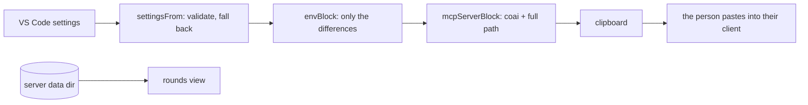

# module: extension — ConnectOtherAIs in VS Code

> `src_vs_code` — the human surface. Four commands, zero runtime dependencies, no background work
> and **no port**: the review itself lives in `coai-mcp`, which an MCP client owns and starts.

## Commands

| Command | Does |
|---|---|
| `coai.installServer` | Downloads the latest `mcp-v*` asset for this RID into the extension's storage, verifies its `.sha256`, extracts with `tar`, remembers the version, and puts the `mcpServers` block on the clipboard |
| `coai.copyConfigBlock` | Regenerates that block from current settings — the way changed settings reach the server |
| `coai.copyClaudeSnippet` | The CLAUDE.md text teaching a target repo's main AI the tool order |
| `coai.showRounds` | Writes `<dataDir>/rounds.md` from the server's own session files and opens it — a REAL file, so closing it never asks to save, and it is rewritten in place while a round runs |

## How settings reach the server

One way, in the `env` of the copied block — the MCP client owns the server's process and its config
is static, so there is nowhere else for configuration to cross. `envBlock` emits **only what differs
from the server's own defaults**, so a pristine configuration produces no `env` at all. A settings
change is therefore: change it, copy the block again, restart the client.



## What it deliberately does not do

- **Never writes another program's config file.** The block is offered; the person sees what they
  grant, and several clients can coexist. (CredsForDevs' reasoning, kept.)
- **Never puts a binary on `PATH`.** Extension storage: uninstall removes it, and the full path is
  what the block carries anyway.
- **Never installs unverified bytes.** A missing `.sha256` is refused OUT LOUD — a quiet skip is
  indistinguishable from a check that passed.
- **Opens no port — still.** Escalation was the one case that needed a channel, and it arrives as a
  FILE in the same data directory: `EscalationWatcher` watches `escalations/*.json`, raises a modal,
  keeps a status-bar item so a dismissed modal loses nothing, lists open questions at the TOP of the
  rounds view, and writes the answer atomically (temp + rename) because half a file must never
  resolve a question.
- **No account, no sign-in, no cloud service of its own.**

## Entities

| Module | Role |
|---|---|
| `settingsShape.ts` | config → validated `CoaiSettings`; `envBlock`; the defaults pinned to the master plan's table |
| `coaiInstall.ts` | pure install decisions: RID (macOS honestly absent), asset/entry names, version compare, update-available |
| `installer.ts` | the impure half: fetch, sha256, `tar`, chmod, remembered version |
| `mcpBlock.ts` | the `mcpServers` block (server id `coai`), client targets, install message |
| `claudeSnippet.ts` | the paste for a target repo's CLAUDE.md |
| `rounds.ts` | parse the server's session files; render the view (status, elapsed, tokens, cost, the reviewers in flight); a torn file is skipped; a file from an older server with no status still renders |
| `panelView.ts` | the sidebar's HTML, pure: sections, vendor cards with the green run button, the two live regions (`live-questions`, `live-rounds`) |
| `panelProvider.ts` | the wiring: repaint ONLY when a control changed, live regions posted instead; vendor add/remove (confirmed)/run-in-terminal |
| `vendorTerminal.ts` | pure: which CLI a vendor is, its own usage command (`/usage`, `/status`, `/stats`), and the provider overrides a custom endpoint needs |
| `escalations.ts` | pure: parse a question, the answer file's shape, status-bar text, prompt-once, modal body, the open-questions section |
| `escalationWatcher.ts` | the impure half: file watcher + a 5s poll (a watcher on a path outside the workspace is not guaranteed), the modal, the status-bar item, the atomic answer write |
| `extension.ts` | activation, the four commands, the update offer |

## Three UI decisions with a cause

- **A repaint is conditional, and live data is posted.** Assigning `webview.html` RELOADS the
  webview, which closes any open `<select>`. With the escalation watcher ticking every five seconds
  and a running round rewriting its session file constantly, an unconditional repaint shut every
  dropdown in the panel two or three seconds after it was opened. Now a change to the CONTROLS
  repaints; `live-questions` and `live-rounds` are patched through `postMessage`.
- **The rounds view is a file on disk.** It used to be an untitled document built from a string,
  which VS Code treats as unsaved work — so every close asked whether to save content that is
  derived and regenerated on demand. `<dataDir>/rounds.md` closes silently, reopens in the same tab,
  and is rewritten while it is open so a running round advances on screen.
- **Every default vendor is also a preset.** Gemini shipped as a default and was missing from
  "Add a reviewer", so removing it was a one-way door. `vendors.test.ts` now holds that shut.

## Verified

90 `node:test` cases over the pure modules; `.vsix` packaged in CI and installed by hand on
2026-08-31; the released win-x64 asset downloaded, checksum-matched, extracted with Windows
bsdtar and registered — `claude mcp list` reported `coai ✔ Connected`.

### What repaints, and what is patched (2026-09-01)

The panel has two update paths, and `staticKey` (in `panelView.ts`, so it is testable without
`vscode`) decides which one runs. A repaint reloads the webview and closes any open dropdown, so it
is reserved for the person's own doing; everything that moves by itself travels through
`liveRegions` and is patched into `#live-questions`, `#live-rounds` and `#live-usage`.

**Anything missing from that key is a control that can never change.** The spending window was
missing: clicking Today, Month or Year recorded the choice, produced an identical key, and
repainted nothing — the section sat on Week for good and the buttons read as broken, because they
were. `usageWindow` and `latestServerVersion` are now in the key; the spending ROWS are a live
region, so they advance mid-round without closing a dropdown. The window tabs deliberately sit
OUTSIDE that region: a button inside a patched region loses its click listener on the next tick.

### The rounds view refreshes for a RESTORED tab too

`refreshRoundsFile` rewrites `rounds.md` only while somebody has it open, and "open" was an exact
string comparison of two Windows paths. VS Code hands back `c:\Users\…` for a tab it restored and
`C:\Users\…` for one this extension opened, so a restored tab silently stopped being refreshed and
the file went stale while rounds kept running. `roundsViewIsOpen` (in `rounds.ts`, pure) compares
case-insensitively.

### A panel button cannot be wired to nothing (2026-09-01)

The Update button in the Server section did nothing for a day. The markup emitted
`data-command="installServer"`, the provider's switch had no case for it, and the click fell into
`default: return` — no error, no notification, no log line. A button wired to nothing looks exactly
like a button whose work failed silently, which is why it took a person reporting it.

`PANEL_COMMANDS` in `panelView.ts` now declares the panel's whole command vocabulary beside the
markup that emits it, and `PanelProvider.run` switches over that union with a `never`
exhaustiveness check. A declared command with no case is a **compile error**:

```
src/panelProvider.ts(239,15): error TS2322: Type '"installServer"' is not assignable to type 'never'.
```

A test covers the reverse — a button posting a name nobody declared.

The install itself now answers a locked binary with the cure rather than an errno: overwriting a
running `coai-mcp.exe` is refused by Windows, and an MCP client holding it open is the normal case
at the exact moment somebody presses Update, because that client is what started it.

### One class, one section (2026-09-01)

The spending cards were dim enough to read as disabled. Nothing was broken: `.usage` was defined
TWICE in the panel's stylesheet — once for the per-round usage line in Recent rounds
(`font-size: 11px; opacity: .7`) and once for the spending card. CSS does not care which was meant,
so every card rendered at 70%, and the `.hint` lines inside at .7 x .65 = 45%.

The spending card is `.spend` now, with its own head (`space-between`, so the vendor and its cost
sit at opposite ends instead of reading as `antigravity—`), its own `.cost`, and a `.figures` line
that is NOT a hint: the tokens are what the section exists to show. A test walks the emitted CSS
and fails on any selector defined twice — the dimming had no other symptom, and nobody would have
gone looking for a stylesheet collision.
