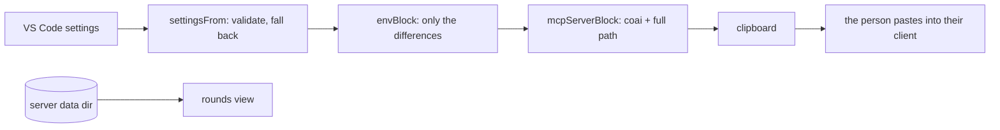

# module: extension — ConnectOtherAIs in VS Code

> `src_vs_code` — the human surface. Four commands, zero runtime dependencies, no background work
> and **no port**: the review itself lives in `coai-mcp`, which an MCP client owns and starts.

### One spawn site, and why it grew a handle (2026-09-08)

`processLauncher.ts` owns the only `spawn` in `src/` that this extension controls. It is the version
probe’s own launcher, widened rather than copied: the synchronous-throw catch (node refuses a `.cmd`
without a shell with an `EINVAL`, and the exception escaped `render` until it was caught at the call),
the tree kill (`child.kill()` reaches `cmd.exe` and not the shim’s grandchild), `taskkill` by absolute
path (`CreateProcess` searches the working directory first, so a bare name could be a file planted in
an opened workspace) and the empty working directory for the shell branch. A second launcher would
have had to learn all four; the one that already exists beside it, `wslNetwork.ts`, learned none and
is left alone deliberately — it has a different stdio contract, and moving it inside a refactor would
smuggle a behaviour change in under a de-duplication.

It returns a HANDLE rather than a promise because two callers want different things from the same
hardening. `capture` wants the whole output and then the exit code, and is re-expressed over the
handle with its contract unchanged for its three callers. A chat session wants to write a line, read
lines back, and keep the process for the next question — which a promise cannot express at all.

Two details are load-bearing and easy to lose. The exit event fires on **`close`**, not `exit`:
`exit` can arrive with output still buffered, and a truncated banner parses to no version at all.
And every subscription is late-safe — a listener added after the event still hears it — because a
target that does not exist fails before the caller’s next line runs.
### The copied block is a path, and nothing else (2026-09-06)

`envBlock` used to fill the pasted `mcpServers` block with every setting that differed from the
defaults — sixteen keys at full stretch. That was right while the env block was the only channel to
the server; it stopped being right when the settings moved into `settings.json` in the data directory,
and nobody trimmed it. Since `SettingsFile.Layer` gives the ENVIRONMENT precedence key by key (a
variable is more specific than a file any window may rewrite, and it is what a scripted run has),
every pasted key was frozen: the panel saved a change, showed it, and the server kept the old value.

The panel passes no env now. `mcpServerBlock` still takes one, for a containerised or scripted run
with no panel and no shared data directory. A guard reads `extension.ts` as SOURCE and fails if a call
site passes an env again — the earlier tests asserted the function's default, and putting the env back
at the call site left every one of them green.

### Settings a side keeps to itself (2026-09-06)

VS Code resolves `window`-scoped settings from the CLIENT's `settings.json` and hands the same values
to every extension host, so a Windows window and two WSL distros on one machine share one proxy, one
set of CLI paths and one vault key. `coai.perSideSettings` (off by default, one switch shared by every
side) makes each side keep its own: the values live in `globalState` under `overlayKey(side)`, which
reuses the identity `installedKey` already folds from `remoteName` + distro-or-hostname + storage path
— two distros mount the same `/home/<user>/.vscode-server/…`, so the storage path alone would merge
two companies' settings.

Every read goes through one accessor (`PanelProvider.read`) and every write through one funnel
(`save`), because a read that goes around them is a setting that silently stays shared. Turning the
switch on seeds this side from what it reads today, so nothing changes until something is edited, and
the seed is idempotent so switching off and on again keeps what a side had. `uiScale` and
`helpLanguage` stay shared deliberately: a text size belongs to the person, not to the company.

### Team servers, and the four modules they are split into (2026-09-06)

A **Team server** runs the vendor CLIs on one machine, on one company subscription, and everybody
signs in to it with their work account. The extension's half is deliberately four files, split by
what can be TESTED rather than by topic:

| File | What it holds | Testable without |
|---|---|---|
| `teamServers.ts` | the canonical URL, the token filename, the server id, the scope rules | anything |
| `teamServerApi.ts` | every request, each with a deadline | a server (stubbed `fetch`) |
| `teamServerAuth.ts` | sign in / out / renew, the token file | an extension host (`AuthHost`, `StateStore`) |
| `teamServerView.ts` | the section's markup, the slot line, the usage block | a webview |

Only the last needs a browser, and it is pure. That split is why the security decisions in this
feature are assertions rather than comments: the compensation path when a token cannot be saved, the
refusal of a Graph scope, and the flag silent renewal passes are all reachable from a plain Node
test.

**The panel never renders from the network.** `refreshTeamServers` is STARTED by a render and never
awaited by one; it repaints when it lands, and its freshness check is what stops the loop — the
render it triggers finds the answer fresh and starts nothing. A catalog that could not be re-fetched
is shown as stale rather than as absent, because last week's slot counts are more useful than a blank
row and saying they are old is what keeps that honest.

### A Team-server sign-in belongs to a SIDE (2026-09-06)

The panel shipped reading ONE record per server out of `globalState` — the client's database, which
VS Code hands to every window of the profile. The token it describes is not shared at all:
`coaiDataDir()` is a path on whichever extension host is running, so a Windows window and a WSL one
hold different files. Sign in on Windows, open WSL, and the panel said *Signed in as you@company*
over a distro with no token in it.

So the intention and the evidence are now two records, and **the panel renders the evidence**:

| Record | Scope | What it is |
|---|---|---|
| `teamServer:<id>` | shared | the INTENT, with *Separate settings for each side* off |
| `teamServer:<id>@<sideKey>` | per side | the INTENT, with it on |
| `teamServer:<id>#<sideKey>` | per side, **always** | the FACT: whose token file this side holds, and since when |
| `teamServer:<id>:trusted` | shared, always | the Microsoft application the person approved — a fact about the SERVER, not a side |
| `<intent>:revoked` | follows the intent | when this scope was last signed out |

One pure function decides everything from those — `sessionAction(intent, fact, revokedAtMs, nowMs)`:
an intent with no fact MINTS (silently, `createIfNone: false`, no prompt); a fact for a different
account or one nearly expired mints too; no intent over a fact older than the revocation SIGNS OUT;
anything else does nothing. The file is the arbiter — a fact whose token was deleted by hand is
discarded before the rule runs.

That one table is both of the behaviours the operator asked for. **Sharing on**, the WSL window finds
the shared intent and mints its own token without asking, so both sides end up on one account and no
token ever crosses between the two filesystems. **Sharing off**, a fresh side has no intent, mints
nothing, and its *Sign in* runs the interactive flow — which already passes
`clearSessionPreference: true`, so a different account can be chosen. And a sign-out now REACHES the
other sides: only this side's token file can be deleted from here, so the moment is stamped and each
other side signs itself out on its next refresh.

Three guards on the silent mint, each of which was a plan-round finding: the application must already
be approved; the identity provider must still answer, and when it does not the row says so instead of
claiming a session; and the account that comes back must be the one the intent names — a machine
signed in to a personal and a work account otherwise gets a token for whichever is active on that
side. A failed mint is not retried for ten minutes, because the refresh runs every sixty seconds.

Toggling the switch carries the sign-in either way rather than dropping it: on, this side's record is
seeded from the shared one; off, this side's is promoted to the shared one when there is none. Other
sides need nothing — their token then disagrees with the intent, and the rule re-mints it.

### The MCP server section is about coai-mcp, and about nothing else (2026-09-07)

It is titled **MCP server** and carries the `coai-mcp` lines alone: what is installed on this side,
what is published, the Install/Update button when those differ, and the snippet note.

**It carried the Team server too, for three releases, and that was the mistake.** From 0.31.1 to
0.31.3 `teamServerHere` rendered one block per configured Team server underneath — the address as a
read-only input, `coai-server <version> — signed in as <email>` once a catalog answered, *connecting*
before that, and a version marked as last known when the server had stopped answering. The reasoning
was that *what am I talking to* is one question with two answers. In front of the operator it read
as two subjects sharing a box, and the correction was to name the box: a Team server is described
where it is managed, under **Team servers**.

So `teamServerHere`, `hereBlock`, `hereSentence`, `signedOutHere` and `sideSentence` are gone from
`teamServerView.ts` with their test file, rather than left unreferenced. The panel is the only place
that rendered them, and dead code that once had a purpose is the kind a later reader reinstates by
accident. The design record is
[PLAN_team_server_side_and_url.md](PLAN_team_server_side_and_url.md), whose status line says which
half of it survived — the per-side sign-in did, and that is the half that mattered.

**`teamServers` and `usageScope` are OPTIONAL on `PanelState`,** which is an accommodation and worth
naming as one: the test fixtures are stored with CRLF under `core.autocrlf=true`, so any commit that
touches one rewrites every line of it. Making the fields required cost sixteen unreviewable
whole-file diffs to add a field none of those assertions read. Absent means none — which is what a
panel with no Team servers has.

## Commands

| Command | Does |
|---|---|
| `coai.installServer` | Downloads the latest `mcp-v*` asset for this RID into the extension's storage **on the side this extension host is running on**, verifies its `.sha256`, extracts with `tar`, records the version under that side's own key, and puts the `mcpServers` block on the clipboard |
| `coai.copyConfigBlock` | Regenerates that block from current settings — the way changed settings reach the server |
| `coai.copyClaudeSnippet` | The CLAUDE.md text teaching a target repo's main AI the tool order |
| `coai.showRounds` | Writes `<dataDir>/rounds.md` from the server's own session files and opens it — a REAL file, so closing it never asks to save, and it is rewritten in place while a round runs |

## How settings reach the server

One way, in the `env` of the copied block — the MCP client owns the server's process and its config
is static, so there is nowhere else for configuration to cross. `envBlock` emits **only what differs
from the server's own defaults**, so a pristine configuration produces no `env` at all. A settings
change is therefore: change it, copy the block again, restart the client.



## What it deliberately does not do

- **Never writes another program's config file.** The block is offered; the person sees what they
  grant, and several clients can coexist. (CredsForDevs' reasoning, kept.)
- **Never puts a binary on `PATH`.** Extension storage: uninstall removes it, and the full path is
  what the block carries anyway.
- **Never installs unverified bytes.** A missing `.sha256` is refused OUT LOUD — a quiet skip is
  indistinguishable from a check that passed.
- **Opens no port — still.** Escalation was the one case that needed a channel, and it arrives as a
  FILE in the same data directory: `EscalationWatcher` watches `escalations/*.json`, raises a modal,
  keeps a status-bar item so a dismissed modal loses nothing, lists open questions at the TOP of the
  rounds view, and writes the answer atomically (temp + rename) because half a file must never
  resolve a question.
- **No account, no sign-in, no cloud service of its own.**

## Entities

| Module | Role |
|---|---|
| `settingsShape.ts` | config → validated `CoaiSettings`; `envBlock`; the defaults pinned to the master plan's table |
| `coaiInstall.ts` | pure install decisions: RID (macOS honestly absent), asset/entry names, version compare, the per-side state key (`installedKey`), the side's label, and `serverStatus` — what the Server section states |
| `installer.ts` | the impure half: fetch, sha256, `tar`, chmod, and `serverOnThisSide` — `stat` every call, the `--version` probe cached against `mtime`+`size` |
| `versionProbe.ts` | one `askVersion`, 8-second cap, stdout only — used for the vendor CLIs and for the server binary |
| `mcpBlock.ts` | the `mcpServers` block (server id `coai`), client targets, install message |
| `claudeSnippet.ts` | the paste for a target repo's CLAUDE.md |
| `rounds.ts` | parse the server's session files; render the view (status, elapsed, tokens, cost, the reviewers in flight); a torn file is skipped; a file from an older server with no status still renders |
| `panelView.ts` | the sidebar's HTML, pure: sections, vendor cards with the green run button, the two live regions (`live-questions`, `live-rounds`) |
| `panelProvider.ts` | the wiring: repaint ONLY when a control changed, live regions posted instead; vendor add/remove (confirmed)/run-in-terminal |
| `vendorTerminal.ts` | pure: which CLI a vendor is, its own usage command (`/usage`, `/status`, `/stats`), and the provider overrides a custom endpoint needs |
| `escalations.ts` | pure: parse a question, the answer file's shape, status-bar text, prompt-once, modal body, the open-questions section |
| `escalationWatcher.ts` | the impure half: file watcher + a 5s poll (a watcher on a path outside the workspace is not guaranteed), the modal, the status-bar item, the atomic answer write |
| `extension.ts` | activation, the four commands, the update offer |

## Three UI decisions with a cause

- **A repaint is conditional, and live data is posted.** Assigning `webview.html` RELOADS the
  webview, which closes any open `<select>`. With the escalation watcher ticking every five seconds
  and a running round rewriting its session file constantly, an unconditional repaint shut every
  dropdown in the panel two or three seconds after it was opened. Now a change to the CONTROLS
  repaints; `live-questions` and `live-rounds` are patched through `postMessage`.
- **The rounds view is a file on disk.** It used to be an untitled document built from a string,
  which VS Code treats as unsaved work — so every close asked whether to save content that is
  derived and regenerated on demand. `<dataDir>/rounds.md` closes silently, reopens in the same tab,
  and is rewritten while it is open so a running round advances on screen.
- **Every default vendor is also a preset.** Gemini shipped as a default and was missing from
  "Add a reviewer", so removing it was a one-way door. `vendors.test.ts` now holds that shut.

## Verified

90 `node:test` cases over the pure modules; `.vsix` packaged in CI and installed by hand on
2026-08-31; the released win-x64 asset downloaded, checksum-matched, extracted with Windows
bsdtar and registered — `claude mcp list` reported `coai ✔ Connected`.

### What repaints, and what is patched (2026-09-01)

The panel has two update paths, and `staticKey` (in `panelView.ts`, so it is testable without
`vscode`) decides which one runs. A repaint reloads the webview and closes any open dropdown, so it
is reserved for the person's own doing; everything that moves by itself travels through
`liveRegions` and is patched into `#live-questions`, `#live-rounds` and `#live-usage`.

**Anything missing from that key is a control that can never change.** The spending window was
missing: clicking Today, Month or Year recorded the choice, produced an identical key, and
repainted nothing — the section sat on Week for good and the buttons read as broken, because they
were. `usageWindow` and `latestServerVersion` are now in the key; the spending ROWS are a live
region, so they advance mid-round without closing a dropdown. The window tabs deliberately sit
OUTSIDE that region: a button inside a patched region loses its click listener on the next tick.

### The rounds view refreshes for a RESTORED tab too

`refreshRoundsFile` rewrites `rounds.md` only while somebody has it open, and "open" was an exact
string comparison of two Windows paths. VS Code hands back `c:\Users\…` for a tab it restored and
`C:\Users\…` for one this extension opened, so a restored tab silently stopped being refreshed and
the file went stale while rounds kept running. `roundsViewIsOpen` (in `rounds.ts`, pure) compares
case-insensitively.

### A panel button cannot be wired to nothing (2026-09-01)

The Update button in the Server section did nothing for a day. The markup emitted
`data-command="installServer"`, the provider's switch had no case for it, and the click fell into
`default: return` — no error, no notification, no log line. A button wired to nothing looks exactly
like a button whose work failed silently, which is why it took a person reporting it.

`PANEL_COMMANDS` in `panelView.ts` now declares the panel's whole command vocabulary beside the
markup that emits it, and `PanelProvider.run` switches over that union with a `never`
exhaustiveness check. A declared command with no case is a **compile error**:

```
src/panelProvider.ts(239,15): error TS2322: Type '"installServer"' is not assignable to type 'never'.
```

A test covers the reverse — a button posting a name nobody declared.

The install itself now answers a locked binary with the cure rather than an errno: overwriting a
running `coai-mcp.exe` is refused by Windows, and an MCP client holding it open is the normal case
at the exact moment somebody presses Update, because that client is what started it.

### One class, one section (2026-09-01)

The spending cards were dim enough to read as disabled. Nothing was broken: `.usage` was defined
TWICE in the panel's stylesheet — once for the per-round usage line in Recent rounds
(`font-size: 11px; opacity: .7`) and once for the spending card. CSS does not care which was meant,
so every card rendered at 70%, and the `.hint` lines inside at .7 x .65 = 45%.

The spending card is `.spend` now, with its own head (`space-between`, so the vendor and its cost
sit at opposite ends instead of reading as `antigravity—`), its own `.cost`, and a `.figures` line
that is NOT a hint: the tokens are what the section exists to show. A test walks the emitted CSS
and fails on any selector defined twice — the dimming had no other symptom, and nobody would have
gone looking for a stylesheet collision.

### Installing a reviewer's CLI from the row (2026-09-01)

A fresh WSL box has none of these CLIs, and the panel is where somebody is standing when they find
that out. The `⤓` button beside `▶` opens a terminal with the install command typed and waiting.

- The command itself is identical in both shells — `npm install -g` does not care. What differs is
  getting node in the first place, which is the actual reason somebody is reading this on a fresh
  machine, so the PREREQUISITE is what is chosen per shell. The shell is read from the terminal
  profile rather than from the platform: a Windows machine whose default profile is WSL wants the
  apt line, and that is precisely the machine someone is on when they press it.
- **A CLI npm does not publish is pointed at, never invented.** `agy` ships as a Go binary with the
  Antigravity app; a plausible npm line for it would be a command that fails, in the one place
  somebody came to because they did not know the answer. That row opens the documentation instead.

Fixed alongside it: `vendorTerminal` resolved its executable with a two-step chain that fell through
to `codex`, so `▶` on an Antigravity row opened a different vendor's CLI under that vendor's name —
the wrong-model defect again, on the button whose whole purpose is signing that vendor in. Every
runtime this build knows is now a row in one table.

### Two frames, four colours, and a stage each (2026-09-01)

The Prompts section is two frames: the plan role alone, and the code roles together — three of them
until `Conventions` became the fourth on 2026-09-08. Each role
is a box with a coloured LEFT EDGE rather than a filled panel — it marks the role at a glance without
turning a settings panel into four coloured slabs, and it survives a light theme unchanged. The
palette is the sibling product's own token set (`creds/src_vs_code/src/entityFormStyles.ts`): a
`--vscode-charts-*` token with the hex it falls back to, so a theme that defines them wins and one
that does not still gets the intended colour. **The colour is never the only signal** — every role's
name is written out.

That fallback is why `colours come from the theme, never from us` had to be narrowed: a hex inside
`var(--x, #hex)` is sanctioned, a bare one is still us choosing a colour for somebody's editor.

The Gate section is now two boxes, plan and code, each with its own rounds and threshold. Each
prompt row shows only the rounds ITS stage will run: a picker for a round nobody reaches is a control
that cannot do anything, which is the lesson the spending tabs already taught.

### The escalation is answered with buttons

"Proceed anyway, or fix the findings and review again?" was asked with a free-text input box — the
control for a question an AI wrote in words, and this is not that. Worse, a typed answer had no
effect at all (see [module_server.md](module_server.md)). It is a QuickPick of three now, each saying
what it will cause: another set of rounds, stop and act on the findings, or stop and talk. `''` is
not among them: there is no "ship it anyway".

### One section per role, and no language (2026-09-01)

The Prompts and Gate sections described one thing between them: how many times a role asks, how much
it may still find, and what it asks each time. They are one box per role now — rounds, threshold and
the per-round prompt pickers together, with the role's colour on its left edge. What is left in The
Gate is the single decision that belongs to neither role nor stage: what to do when the rounds run
out, now with a fourth answer (*good enough — take what's true and move on*).

`coai.rounds` and `coai.thresholds` are role-keyed objects; a stored map is whatever a person or a
sync left there, so each entry is validated on its own and a junk one takes its default rather than
poisoning the map. `maxRoundsCode` was briefly a field and is now DERIVED where it is needed — a
stored copy would be a second source of truth for a number that already exists, and the
every-setting-reaches-the-server test caught it by refusing to see a change in the env block.

`selectedFor` mirrors the server's conventions rule, because it did not and the panel showed
`Universal` for a round the server would run `Conventions` in.

The Language section is gone with the translator. The help's own language switch is unaffected: that
is `coai.helpLanguage`, the reading side.

### The picker is a claim about another program (2026-09-01)

`selectedFor` decides what the prompt picker SHOWS for a round nobody has set. Every branch in it is
a claim about what `PromptCatalog.ForRound` will do — so a branch only one of the two has is not a
feature, it is a lie with a dropdown around it. That is what the rotation branch had become: fed by
the panel's dealing switch, unread by the server, naming `arch-boundaries` for a round the server
would spend on `architecture`.

`panelServerPromptAgreement.test.ts` is the guard, and it is deliberately shaped as a mirror of the
server's resolution rather than a list of expected ids: role x round x `hasRules`, compared against
one local function that spells out what the C# does. Its twin is `ConventionsPassTests`. Two suites
for one rule, because the rule is that two programs agree and neither can check that alone.

The same pass removed three orphan tooltips — `language`, `translator`, `translatorModel` — left in
`help.ts` when the translator went. `helpTooltips.test.ts` now fails when a tooltip describes a
control the panel does not render: the coverage test next door fails when a control has no help, and
a catalog needs both directions because only one of them is caught by using the product.

### One slot cannot carry two kinds of key (2026-09-01)

Every control in the panel posts `{key, value, vendor}` and the provider decided from `vendor`
whether this was a vendor property or a plain setting. When rounds and thresholds became per-ROLE,
their inputs were given `data-vendor="Architecture"` — the only slot there was — and the provider
dutifully searched the vendor list for a vendor by that name, found none, and wrote the list back
unchanged. `coai.rounds` was never written.

From the panel that read as two separate bugs: a number that reverted on the next repaint, and prompt
pickers whose count never followed the rounds. Both were the same write going nowhere. The rendering
had always sized the pickers from `settings.rounds[role]`; it was reading a value nothing could change.

The routing is now `settingWrite` in `settingsShape.ts` — pure, `vscode`-free, three named outcomes
(`plain`, `vendor`, `role`) — and `PanelProvider.write` switches on it under a `never` guard, the shape
this file already used for commands. `roleRecordUpdate` merges one role into the record rather than
replacing it: replacing would drop the three roles nobody touched, and the symptom would have been
identical for three roles instead of one.

**Two tests had pinned the broken markup.** `panelView.test.ts` asserted
`data-setting="rounds" data-vendor="${role}"` and passed, because the control did exist — it simply
could not save. A test written by copying markup can only confirm that markup;
`settingWrite.test.ts` asks where the value LANDS, and one of its assertions is that no role-keyed
control arrives in the vendor slot at all.

### Where a CLI version comes from (2026-09-01)

`cliVersions.ts` answers two questions per vendor and the panel colours one button from them.

**Installed** is the binary's own `--version`, spawned with an 8-second cap, through
`executableFor(vendor)` — the same "a CLI path beats the bare name" decision the ▶ and ⤓ buttons
make, extracted so there is one of it. The output formats all differ (`codex-cli 0.152.0`, a bare
`1.1.23`, `2.1.211 (Claude Code)`), and a node CLI that FAILS prints its own banner last, so the
parser drops any line naming Node.js before looking for a semver — the same trap the reviewer
summaries already learned.

**Published** comes from the vendor, never from a table shipped here:

| runtime | source | checked |
|---|---|---|
| codex, gemini, claude | `registry.npmjs.org/<package>/latest` | queried live: 0.152.0, 0.57.0, 2.1.257 |
| antigravity | `…run.app/manifests/${os}_${arch}.json` — the endpoint Google's own `install.sh` reads at line 99 | six manifests, all answered 1.1.23 |

A runtime this build does not know gets `undefined`, not a guess. An unknown runtime rides the Codex
CLI for REVIEWS, which is deliberate — but reporting codex's version for a vendor that is not codex
would be a confident lie.

**There is no update COMMAND.** Every vendor here updates by re-running its own installer, which was
established by reading their sites rather than assumed: OpenAI prints one line under both *Install
Codex* and *Update Codex*, Anthropic's native install is the same script, `agy` has no `update`
subcommand. So ⟳ runs exactly what ⤓ runs, and the only new knowledge is the pair of numbers.

Both reads are cached for half an hour — the panel repaints on every change, and uncached this would
spawn a process and open a connection per vendor each time. Pressing the button clears the cache, so
"I just updated it" is answered now rather than in twenty minutes. Every failure path lands on an
empty string, which renders grey: a button that lights up because a fetch failed is a button that
lies.

### The pasted snippet carries a version (2026-09-01)

Handing somebody text to paste means the source moves and the copy does not, and the copy is the one
being obeyed. Found in the wild: the block in `dew_flow_creds_for_devs/CLAUDE.md` predated the SCOPE
rule, so the AI following it would call `review_code` with a commit subject and meet a refusal that
nothing in its instructions explained.

`claudeSnippet.ts` now emits `<!-- coai-snippet vN -->`, and `PanelProvider.pastedSnippet` reads it
back out of the workspace's `CLAUDE.md`, `AGENTS.md`, `GEMINI.md` or `.github/copilot-instructions.md`
— the same four the server reads for its conventions pass, because there is no reason the two halves
of this product should disagree about which files an AI reads. The first file carrying the block
wins; a repository with it in two places has a problem this panel cannot fix.

**And since 2026-09-04 the block is not a paste at all where a family shares rules.** It is
`common/coai-review-gate.md` in `dew_flow_conventions`, mounted at `.claude/rules/shared` in six
repositories, so `SNIPPET_LOCATIONS` continues past the four instruction files to
`.claude/rules/shared/common/coai-review-gate.md` and its unmounted twin. Named paths, not a walk —
this runs on every repaint. The instruction files stay FIRST on that list deliberately: a paste in
`CLAUDE.md` is what the AI in that repository actually reads, so a stale one must be the sentence
the panel says, and answering with the mounted rule's version instead would be a green light over
text still being obeyed. The duplicate itself is a red build rather than a panel line —
`gate-snippet-check.mjs` in the conventions repository fails when a consumer carries its own copy,
which is the half a panel can never do, because a panel only sees a repository somebody opened.
`snippetVersion.test.ts` asserts the mounted file is byte-identical to `claudeSnippet()`, skipping
locally when the submodule is not checked out and FAILING under `CI`, where the workflow initialises
it and an unchecked drift would merge behind a green tick.

**A number, not a hash — and both.** A hash cannot be forgotten but only answers "different", while
the useful sentence is "OLDER than the current one": a stale paste and a locally edited one want
opposite advice, and only an ordered number tells them apart. So the number is ordered and
`snippetVersion.test.ts` pins it to the text's hash — editing the snippet fails the build until the
number moves with it, and the failure message carries the next number and the new hash.

Five outcomes rather than a boolean, because they want different sentences: `current` and `absent`
say nothing (a repository that never adopted the gate is entitled not to), `unversioned` means the
copy predates the marker, `older` names both numbers, and `ahead` — an extension older than the
repository — says to update this build rather than paste over the repo.

### A runtime the type knew and the parser did not (2026-09-02)

`Runtime` is now DERIVED from the `RUNTIMES` array (`models.ts`) rather than declared beside it.
There used to be two declarations — the union in `models.ts` and an array in `vendors.ts` that
`vendorsFrom` validated against — and `local` was added to the first and not the second. An unknown
runtime is deliberately rewritten to `codex` (it is the one that takes a base URL, so a name from a
newer extension still leaves a row that launches something), which meant every saved local reviewer
came back as a CODEX reviewer: the row kept the name `local`, listed codex's models, offered codex's
buttons, and a round would have gone through the Codex CLI.

The comment beside that check already said the two lists had to be kept in step, which is why the
fix is not a better comment: with one declaration there is nothing to keep in step. Tests walk every
runtime and every `VENDOR_PRESETS` entry through a save and a read, with `gemini` named as the one
deliberate exception — it is MIGRATED to `antigravity` because Google retired Code Assist, and
separating a migration from a defect is exactly what the test does.

### The settings file has more than one writer (2026-09-07)

`<dataDir>/settings.json` is written by `ServerSettingsSync` at activation and on every
`onDidChangeConfiguration`. Every open VS Code window runs its own extension host, every host hears
that event, and they all write **one path** — including a host still running the build it was loaded
with, because VS Code keeps a loaded extension until its window reloads.

That reverted a Team-server reviewer. VS Code's own `coai.vendors` held `runtime: "remote"`,
`remoteVendor: "claude"`; the file held `runtime: "codex"`, written **0.4 seconds later**. A window
open since before the update was running 0.31.0, whose `RUNTIMES` has no `remote`, and `vendorsFrom`
rewrites an unknown runtime to `codex` so the row still launches something. That fallback is right
for RENDERING and for LAUNCHING, and it must never have been persisted into a file other builds read.

So the file carries `COAI_WRITTEN_BY`, and a build stands down rather than overwrite a newer one's
work. Three things about it are worth knowing:

- **The stamp is on the FILE, not in `envBlock`.** `envBlock` also builds the block a person pastes
  into an MCP client, where provenance is noise. The server ignores the extra key —
  `PanelSettings.UnknownValues` reports unknown VALUES of known keys, never unknown keys.
- **The comparison is `updateAvailable`**, the one the CLI update buttons already use, with a `-pre`
  / `+build` suffix cut off first. Without the cut `0.31.3+build.7` splits into four dot-segments
  and a local build blocks every released one; with it, a pre-release compares as its release and
  neither blocks the other, which is right for a guard about SHIPPED builds.
- **It cannot be retroactive.** 0.31.0 has shipped and has no guard in it, so this stops the next
  pair, not that one. A machine already in the state is unstuck by reloading the stale window — which
  is what the warning now says, with the button that does it.

A refusal is reported **once per distinct newer version**, cleared after a successful write, and never
silently: a window that quietly reverts somebody's configuration is the same defect seen from the
other side. A once-per-session flag was the first draft and is the wrong shape — somebody who updates
the other window and hits the wall again would be told nothing. The suppression compares the
NORMALISED version, so two spellings of one version are one sentence, and the stamp is stripped of
control characters and capped before it reaches a dialog, because it is text out of a file anybody
can edit.

**A file that cannot be READ is not a file that is not there.** The first implementation answered an
empty string for both, so a locked file — or a volume that blinked — read as "nothing there", which
is permission to overwrite: the same revert, through a different door. Only a confirmed
`FileNotFound` is absent; every other failure stands the write down and is retried on the next
configuration change. Three reviewers found that independently on one round.

**The read, the comparison and the write are one step.** A guard that reads a stamp and then
overwrites it is a time-of-check-to-time-of-use race — two guard-aware hosts can both read a stamp
they are allowed to overwrite, and the second to finish wins with a payload decided before the
first's write existed. The collision that started this was 0.4 seconds wide. So `ServerSettingsSync`
takes a `CriticalSection` callback and does all three inside it; the class still holds no filesystem
and no VS Code type.

The lock itself is `extension.ts`, and it is **`fs.open(path, 'wx')`** — O_EXCL, a promise the
operating system makes. The first version claimed exclusion from
`vscode.workspace.fs.rename(…, { overwrite: false })`, and whether that is atomic is not documented
anywhere: the disk provider checks for existence and then renames, which is check-then-act, so the
whole guarantee rested on an implementation detail. Raised on the code round and worth keeping in
mind for the next lock somebody needs here.

**The lock carries an owner token, and that is not decoration.** The release deletes it only while it
is still ours: a window whose lock was broken as stale would otherwise delete its SUCCESSOR's lock on
the way out, letting a third window in while the second was writing — the race, produced by the
release. The same token is re-checked immediately before the settings rename, which is how a process
suspended past the stale window (a laptop closing mid-write) is stopped from landing a payload it
decided on before the window that replaced it wrote. That narrows the hole to the microseconds
between the check and the rename, which is as far as this goes without a renewing lease.

**The limit, stated rather than implied.** Releasing a lock is *check the owner, then delete by path*,
and nothing makes those one operation: POSIX has no compare-and-unlink, node exposes no `flock`, and a
lease that renews is a different design. So a window suspended past the stale window, whose lock was
broken and re-taken, can in principle delete its successor's lock in the instant between its check
and its `rm`. The window is narrowed as far as files allow — the token is re-read on both sides of
the staleness decision, and again immediately before the settings rename — and the blast radius is
bounded by the atomic write: the worst case is a **complete but stale** payload that the next
configuration change replaces, never a corrupt file. Raised on the code round and kept here because
the next person to want a lock in this repository should not have to rediscover it.

A lock that cannot be taken is not an error and nothing WAITS — but the caller is told, because
nothing else fires on its own. `sync` answers `busy`, and activation schedules **one** deferred
attempt just past the window in which any lock is either released or breakable. Not a ladder: by then
there is no lock this window cannot take, so a second failure is a different problem. Without it, a
configuration change that landed while another window was writing would sit unwritten until the
person happened to change something else.

`settingsLock.ts` holds the one decision worth testing: when to break somebody else's. Break too
eagerly and two windows write at once, which is the race; never break and one window killed at the
wrong instant wedges every other window on the machine forever, which is worse and silent. Ten
seconds, four orders of magnitude above the work it covers — and a clock that went BACKWARDS is not
stale, because reading a negative age as "very old" is how two windows both break one lock.

**The write itself is temp-plus-rename**, the way an answered escalation already is. `writeFile`
truncates before it fills, so a host killed between the two leaves every other window and the server
reading a truncated file — unrecoverable, because the original is gone.

### A card says when the server cannot run that reviewer (2026-09-07)

The panel could say a reviewer was CONFIGURED and never that it could not review, so a Team-server
row sat here enabled and ticked for both stages while every round quietly ran without it.

The verdict comes from the server — `coai-mcp --providers`, read the way `--log` already is — and the
panel displays it. Deciding availability again in TypeScript would be the second copy of a decision
this repository has twice paid for; `RuntimeResolution.AuthOf` is its one author.

**Three states, and only one draws anything.** `unavailable` badges, with the server's own note as
the title, because "unavailable" is not something a person can act on and "not signed in to the Team
server at …" is. `fine` draws nothing. **`unknown` draws nothing either** — a probe that failed,
timed out, found no binary, or simply did not mention this row tells you nothing about it, and a
badge that lights up because a probe failed is a badge that lies. There is a second reason for that
here: an MCP client's `env` block outranks the settings file key by key, so a standalone invocation
cannot see environment a scripted client passed to the running server.

**The probe is STARTED by a render and never awaited by one**, the shape `refreshTeamServers`
already has: it is a process spawn with an 8 s cap, and awaiting it inside `render` held the whole
panel for as long as a cold or hanging binary took. It repaints when it lands, and the freshness
check stops the loop. Its cache is keyed on the executable PATH as well as the clock — reinstalling
or repointing the server inside the window would otherwise serve the previous binary's verdict, and
that verdict can badge a reviewer the new one runs perfectly.

**The badge says where its verdict came from.** `--providers` reads the settings file plus the
environment of the process that asked it, and an MCP client's own `env` block outranks that file key
by key — so a person whose client passes one can see that this reading is not necessarily the
running server's. Sharing the live server's environment would need a channel into it that does not
exist.

**A probe that could not be made is said once, in the Server section.** The card stays silent — a
badge fed by a failed probe would be a badge about a reviewer nobody asked about — but the check
failing is a fact about this BINARY, and silence about a failed check is the class of defect this
whole plan is about. So the answer carries `asked` and `answered`: no binary says nothing, because
that section already reports the server as absent; asked-and-failed says the installed `coai-mcp`
could not report its reviewers. An 8 s cap kills a probe that hangs, a non-zero exit (a build too old
for the flag exits 64 saying so) and a body whose shape moved are both "asked and failed", and an
an answer whose shape moved is failed. An EMPTY providers array is not: what decides `answered` is
whether the array was parsed at all, never how many rows it held, or a build that legitimately
reported zero reviewers would say "could not report" forever. Four reviewers raised the first half
of this on one round and two the second.

The module is split in two, `providers.ts` and `providersProbe.ts`, exactly as `roundsDb` and
`roundsDbRead` are and for the same reason: `panelView` imports the types and the parser, so a spawn
beside them drags `node:child_process` into the bundle the webview page is built from. The
bundled-page test caught it here too, on the first attempt, with the same three failures.

### A card captioned with the wrong software (2026-09-07)

`modelsProvenance` (`models.ts`) says where a dropdown's contents came from, and it had arms for
`local`, `gemini`, `claude` and `antigravity` and fell through to codex. `remote` was added as a
runtime without one, so a Team-server reviewer read *"codex · 8 models the Codex CLI has cached for
this machine"* — a claim about software that has nothing to do with it, under a list that arrived
over HTTP from a server's catalog. Reported from a screenshot while the same row was failing to
review at all, which is how a caption nobody would file a bug about got fixed.

The arm needs a fact the list cannot carry. `allowedModelsFor` deliberately returns the row's OWN
model when the catalog has not arrived — an empty list would make `modelsFor` mark every remote row's
saved model as withdrawn, on every reload, for as long as a server stayed unreachable — so a count of
one is ambiguous by construction. It returns `{ models, named, catalog }`, and the caption reads the
state rather than the length.

**Three states, because a caption that guesses is worse than one that points.** `here` is a count of
what this server allows the vendor it knows. `waiting` says the catalog has not arrived and sends the
reader to the Team servers section — never *"has not been asked yet"*, because nothing at this call
site can tell a request in flight from one that failed; the fetch, its error and its stale marker
belong to that section, and repeating them per reviewer row would report one outage N times.
`no-server` is the row whose Team server was removed while its reviewers were left behind, and it
must NOT be sent to a section that no longer lists it. The first two were collapsed into one flag in
the first draft and split on the code round.

### The settings mirror is not the panel's (2026-09-02)

`serverSettingsSync.ts` owns the one job of getting `coai.*` into the file the server reads, and it
is created in `activate` rather than by `PanelProvider`. That placement is the whole point.

**What it was, and what that cost.** The write lived in `PanelProvider.render()` behind the view
guard, and `onDidChangeConfiguration` was registered inside `resolveWebviewView`. VS Code resolves a
webview view LAZILY — `resolveWebviewView` is not called until the view is first made visible — so a
window in which nobody had opened the panel had no configuration listener at all and never wrote the
file. Reported from a macOS checkout: `onExhausted` set to `good_enough`, everything restarted, and
ten consecutive third rounds still answered `call_human` from an `env` block pasted months earlier.
The mechanism was right, present since `mcp-v0.3.1`, and unreachable.

Three properties now hold, each with a test that was watched fail or that pins the shape:

- **No view anywhere in the call.** The sync takes a read function and a write function and imports
  nothing from `vscode`, which is what makes it testable at all — `panelProvider.ts` cannot be,
  and that is why the defect had no test.
- **An unchanged configuration writes nothing.** `PanelServiceHost` reloads on this file's mtime and
  length, and the panel repaints on every live poll; identical rewrites would ask the server to
  re-read its settings several times a minute.
- **A failed write is not remembered as done.** It runs from a configuration listener, so throwing
  would put an error in front of somebody for every keystroke in their settings file — but the next
  change must still try.

A source-shape test asserts the listener and the write are NOT in `panelProvider.ts` and ARE in
`extension.ts`. It is a blunt instrument, and it is the only one available: a behavioural test would
have to drive VS Code's lazy view resolution, which is the exact thing that cannot be done here.

### What the gate found in this half (2026-09-03)

Four of the nine defects from the 2026-09-02 campaign are on this side, one from each of four
different models, and no model found more than two of them.

- **`staticKey` now carries `localEngines`** (flash). It decides repaint-or-patch, and anything
  missing from it is a control that can never change: pressing ⟳ probed the engine, got a new list,
  and the picker kept showing the old one for the life of the panel. The exact defect class
  `liveRepaint.test.ts` exists for, in the one field added after it was written.
- **`PanelState.localEngines` is a map keyed by VENDOR id** (sonnet). It was one engine, probed from
  `vendors.find(v => v.runtime === 'local')` and handed to every card, so a second local reviewer on
  another port displayed the first one's models — and picking one sent a model that engine does
  not have. `probeLocalEngines` now probes each local vendor, and the cache (endpoint + timestamp)
  is per vendor too.
- **`discoverEngine` keeps each candidate's own reason** (luna). Every reason was computed, carried
  through `probeEngine`, and thrown away by a hard-coded `'connection refused'` on the last line: a
  firewall swallowing the connection, an engine wedged mid-answer and a port with nothing on it all
  reached a person as one sentence, and three different actions had one prompt.
- **`KNOWS_ITS_OWN_ENDPOINT`** decides who is asked for a base URL (gemma). The rule was "everybody
  with one already set, plus local", which hid the field from the *Another OpenAI-compatible
  endpoint* preset — the one whose entire purpose is to be given a base URL, shipped with an empty
  one. A field that appears only after it is filled cannot be filled. The list is by ID rather than
  by runtime, because `deepseek`, `openrouter` and anything a person names themselves are all
  `codex` and all need the field.

**The one a local model found alone.** Gemma4 26B, running on this machine for nothing, is the only
reviewer that saw the hidden endpoint field. That is the argument for a second reviewer stated as a
fact rather than as a principle.

### Fast or Full, and why the default is the cheap half (2026-09-03)

`coai.codeWorkspace` is a two-position switch in the Code stage section — **Fast** (`none`, the
default) and **Full** (`worktree`) — rendered as a `.seg` radio group rather than a checkbox,
because neither position is an absence of the other and a checkbox would have to name one of them.
It travels as `COAI_CODE_WORKSPACE`, and `BuildWork` on the server side decides the launch directory
from it.

**The default is a measurement, not a preference.** Three hosted models reviewed the same commit
twice, once with the checkout and once without: Gemini 3.7 Flash went 4→8 useful findings,
GPT-5.6-Luna 6→10, Claude Sonnet 5 6→7, each at a half to a third of the input tokens, with
no wrong finding from any of them — and three real defects appeared that no run WITH a checkout
had reached ([RESULTS_findings_that_are_worth_something.md](RESULTS_findings_that_are_worth_something.md)).
The prompt is identical in both positions; the server assembles the diff and the written rules from
the lease either way. The only thing Full adds is somewhere to wander.

Two tests hold the switch, both watched fail: `panelView.test.ts` asserts the Fast half is the lit
one by default (it went red with *"Fast is the default and must be the lit half"* when the default
was flipped), and `settingsReach.test.ts` — which iterates `Object.keys(DEFAULTS)` — went red
with *"changing codeWorkspace produced an identical env block"*, which is the defect class it exists
for.

### Discovering an engine on this machine (2026-09-02)

`localEngines.ts` probes for a local model engine and `PanelProvider` calls it only when a local
reviewer is configured — probing two ports on every repaint of every panel would be this extension
knocking on a developer's machine for a feature they are not using.

Three decisions, each measured rather than assumed:

- **`/v1/models` is the source of truth and `api/tags` is enrichment.** Both Ollama and vLLM answer
  the first; only Ollama answers the second, and it is where the parameter size, quantisation and
  disk size come from. `mergeModels` maps over the PORTABLE list, so a model the native list does not
  mention keeps its id with an empty detail — which is what makes a vLLM work at all.
- **The probe URL and the OpenAI base are different URLs.** Ollama serves its own API at the root and
  the compatible one under `/v1`; a configuration holding the probe URL fails at its first completion
  with a 404 that reads like a model problem.
- **Failure carries a reason.** Refused, `answered 502` and `no answer within 4s` want different
  actions, and each GET has an explicit timeout because `fetch` has none by default.

The cache is keyed BY endpoint, an answer arriving after the endpoint changed is discarded, and a
probe that found NOTHING is not cached at all — so starting an engine after opening the panel is
noticed on the next repaint rather than after a TTL. `⟳` on the row clears it by hand, which was left
out of the first version as "a CLI's button" until the gate pointed out that a cache with no way to
clear it is a stale list with no way out.

### The engine one hop away, and the button that reaches it (2026-09-03)

In WSL, "no local engine answered" was printed identically to a machine with no engine and to one
whose engine is on the Windows side of the same box — measured, fifteen models and ten refused rounds
(`module_runners.md`, *An unreachable local engine*). `discoverEngine` now asks one more question
after every candidate has refused: `wslNetwork.windowsSideEngine` runs `curl.exe` through interop, so
a WINDOWS process asks `127.0.0.1` and reaches the loopback this side cannot. The answer lands in
`LocalEngine.elsewhere` and turns the note into a diagnosis that names the engine.

**It is a diagnosis, never an endpoint.** The first draft probed WSL's default gateway for the engine
and offered the address; three gate reviewers refused it, all correctly. A panel-side discovery
cannot change the address the SERVER dials — `coai-mcp` reads `baseUrl` from the settings file, so an
empty one still resolves to `127.0.0.1` and still fails; and "the gateway is inside `172.16.0.0/12`"
is not a test for "this is the Windows host", it is a test that names the office router on a
corporate network in that range. Nothing in `wslNetwork.ts` opens a socket to any address.

**The advice is gated on WSL, not on Linux.** `engineNote` took a `Platform` and treated
`linux` as WSL — true in a distro and equally true on a native Linux box, which has no `.wslconfig`
to edit and no subsystem to restart. It now reads `LocalEngine.wsl`, set by `discoverEngine` from
`/proc/version`, and `hostPlatform()` in `models.ts` is gone: it existed for this one message and was
answering the wrong question. The probe is asked **once per render pass** rather than once per local
row, and its two candidates run concurrently on a 2 s deadline — measured through real interop,
`curl.exe` costs ~80 ms to launch, the engine answers in ~100 ms, and the pace is set by the dead
candidate, which under mirrored networking is *dropped* rather than refused and so runs to curl's own
`-m 1`: ~1.05 s for the pair.

**`⇄` writes `networkingMode=mirrored`, and is the only thing here that writes.** It appears only
when `elsewhere` is set. It merges into the existing `.wslconfig` rather than replacing it — the key
goes INSIDE `[wsl2]` (appended after a following `[experimental]` it would be ignored and the restart
wasted), the file's own line endings are used, and a file that did not arrive as UTF-8 is refused
with the two lines to paste instead, because PowerShell's redirection still writes UTF-16 and
"merging" that writes back rubbish. The write is a temporary file plus a rename plus a read-back;
`.wslconfig` is global to every distro and telling somebody to restart WSL on the strength of a
failed write is the specific outcome that guards against. It **toggles** — a global switch with no
way back is not a cure — and it never runs `wsl --shutdown`, which would terminate the distro this
extension host lives in. A source-level test holds the writer to exactly one caller, because a
regression that called it during activation would change a global networking file with nobody's
consent and every other test here would still pass.

**A write that landed is reported as landed, whatever went wrong afterwards.** The rename is atomic
and the read-back that follows it is not, so a read-back that fails — or that sees a concurrent
edit — used to be reported as a failed write for a file that had already been replaced, and the next
press would offer to undo it. `writeWslconfig` answers `written` and `message` separately. The second
press is no longer a blind toggle either: mirrored takes effect only after `wsl --shutdown`, so
pressing again while the note still says the same thing used to revert the fix somebody had just
applied. It now explains the restart, with reverting as its own button.

**The trust line is not decoration.** The endpoint field is advertised for "a box on the network", so
a URL can be pasted — or arrive in workspace settings from a cloned repository — and every review
POSTs the plan, the diffs and the file contents around them to it. `isLoopback` parses the host, so
`http://127.0.0.1.evil.test` is somebody else's machine and the whole 127.0.0.0/8 block is this one,
and anything else puts a visible line in the row naming the host and what leaves with it.

### The Server section is about one SIDE of a machine (2026-09-03)

**The symptom, measured.** One machine, one profile, a Windows window and a `WSL: Ubuntu` window.
The WSL panel said *"coai-mcp 0.12.2 is installed. 0.12.2 is the newest published — you are up to
date"* and showed no button. On that side's disk was a `coai-mcp` byte-identical to the published
**0.12.1** (both tarballs downloaded and hashed), and it was the binary WSL's own Claude Code
launched (`~/.claude.json`). Nobody had ever installed 0.12.2 there.

**The cause is a scope split.** `globalState` is the CLIENT's storage — one database per profile,
shared by local and remote windows alike — while `globalStorageUri`, where the binary is written, is
a path on the extension host that is running (`~/.vscode-server/…` under WSL). The record was
side-blind since epic 05, so a WSL install at 10:55 wrote 0.12.1 into the Windows-side database and a
Windows press at 11:52 overwrote it with 0.12.2. One record, two disks. The panel then read that
record and never looked at either disk, so the button — which renders only when published ≠
remembered — was unreachable on the side that needed it.

**What it does now.** Three states, in this order:

| on this side's disk | what it says | button |
|---|---|---|
| no file | `coai-mcp is not installed in WSL: Ubuntu.` | Install |
| a file that answers `--version` | `coai-mcp 0.12.1 is installed in WSL: Ubuntu.` | Update when something newer is published |
| a file that cannot answer | `A coai-mcp is installed in WSL: Ubuntu but it cannot report its version — press Update.` | Update |

The binary's own answer wins because it is the only source that cannot belong to another machine; the
per-side record is consulted **only** when the file is there and could not be spawned (Smart App
Control refuses a freshly written executable), and the sentence then says the number is remembered.
`stat` runs on every call — a cached one would keep claiming a file somebody deleted — while the
probe result, **including a failure**, is cached against `mtime`+`size`, so a pre-0.12.3 binary is
asked once instead of on every five-second tick. The legacy `coai.installedVersion` key is never
read: its value cannot be attributed to a side, which is the whole defect.

**The side identity is three ingredients, and each earns its place.** The plan's own gate round said
to key this on `vscode.env.remoteAuthority` — right about the collision it feared, wrong about the
cure, because that property is not in the public API. The storage path alone is not enough either:
two WSL distros with the same user name mount the same `/home/<user>/.vscode-server/…`, which is
exactly the two-distro collision the finding named. So `installedKey` folds the remote KIND
(`vscode.env.remoteName`), the distro (`WSL_DISTRO_NAME`, or the hostname for remotes that have
none) and the storage path. A local window uses the path alone — renaming the machine must not throw
away what is installed on it.

**Verified on the machine the symptom came from**: the real installed 0.12.2 answers the probe with
nothing (it exits 64 on `--version`), so it reads as *installed, version unknown* and offers the
update; a freshly stamped Native AOT build answers `coai-mcp 0.12.3`; a missing file answers nothing.

**Not fixed by code, and separate:** that machine's WSL side runs extension 0.25.2 while Windows has
0.26.2, because a remote extension host installs its own copy. That is a VS Code *Install in WSL*
press.

### A `.cmd` shim needs a shell, and that is a boundary (2026-09-03)

Found by measurement while verifying the change above, and older than it. `askVersion` spawned every
candidate with `shell: false`, and **node refuses to launch a `.cmd` or `.bat` without a shell** since
the 2024 argument-injection fix — with a synchronous `EINVAL`, not an `error` event. Nothing on that
path catches, so asking codex or gemini its version did not return "could not be read": it rejected
out of `render`, and the repaint died with it. Every npm global on Windows is a `.cmd` shim, so this
was every Windows machine.

Measured before: `codex` and `gemini` reported no version at all. Measured after: `codex.cmd` answers
**0.152.0**, `gemini.cmd` **0.57.0**, `claude.exe` 2.1.258 without a shell as before.

**A shim is the ONE case that gets a shell**, and the executable can be a path somebody typed into
the settings — so `shimCommandLine` is the boundary where a string would become something `cmd.exe`
interprets, and it is a refusal rather than an escape:

| in the path | why | result |
|---|---|---|
| spaces, `&`, `\|`, `(`, `)`, `^` | literal inside double quotes — `C:\Program Files (x86)\…` must work | quoted, allowed |
| `"` | would close the quoting; no Windows path can hold one | refused |
| `%`, `!` | expanded even inside double quotes | refused |
| newline, control chars | a newline ends the command line | refused |

A refused path is reported exactly like an unreadable version: the button goes grey and says so. The
ARGUMENT is a literal in the source and never composed from anything typed.

**Three narrowings its own gate round added**, and each closed a real hole in the first version:

- **The shell is gated on Windows.** `needsShell` matched `.cmd` on any platform, so a POSIX file
  called `report.cmd` would have gone through `/bin/sh` — whose metacharacters this refusal list does
  not cover, because `$(…)` and backticks mean nothing to `cmd.exe`. Caught independently by two
  reviewers, one as Blocking.
- **A bare name is resolved on the PATH first.** `cmd.exe` searches its working directory before the
  PATH, so handing it `codex.cmd` would run a file of that name from an opened workspace. The name is
  resolved here and the shell only ever receives a path; the shell branch also runs in the OS temp
  directory rather than inheriting one.
- **The timeout kills the tree.** `child.kill()` reaches `cmd.exe` and not what the shim started
  under it, so a probe that timed out left the grandchild running — every eight seconds, for as long
  as the panel repainted. `taskkill /t /f` on the shell branch.

Plus one usability case: a path pasted from Explorer's *Copy as Path* arrives wrapped in quotes, and
both branches would have failed on it. `unquoted` removes a BALANCED pair only, so a single stray
quote is still refused rather than repaired into something else.

**What the round claimed and measurement refuted:** that `&`, `^&` or `|` inside the quotes could
still be parsed as a separator. Run for real against a marker file on this machine, all three stayed
literal — `cmd.exe` looked for a program with that whole name, failed, and wrote nothing. The
proposed alternative (arguments passed separately alongside `shell: true`) would change nothing
either: node joins command and arguments into one line in shell mode.

### A round opens, and each reviewer says what it cost (2026-09-03)

Two complaints with one shape: **the round was the only unit anything was reported in**. The card
showed `11m 2s · 220k in / 9.4k out` for a code round of nine reviewers — and a round is as slow as
its slowest one, so that number could not say which of the nine spent the eleven minutes. Worse, the
reviewers were rendered **only while the round ran**: the view was richest about what you could still
watch and emptiest about what you came back to understand.

Now every round is a `<details>`. Closed, it is the line it always was. Open, it lists each reviewer:
vendor and role, what it did, how many findings it filed, **how long it took**, and what it read.
`ReviewerState.seconds` is the new half — the scheduler timed every reviewer already
([module_server.md](module_server.md)) and the number was being dropped at the session boundary.

**The open state lives in `PanelState`, not in the DOM**, and that is the whole design rather than a
detail. This list is patched into the page every five seconds while a round runs, so a disclosure
holding its state in the element would close under the person mid-read — raised as Blocking by this
change's own gate. It works exactly as the sections do: the webview posts a `round` message on
toggle, the provider keeps the set, and the next render carries `open`. The `toggle` listener is on
`document`, in the CAPTURE phase, because `toggle` does not bubble and the elements it would
otherwise be bound to are replaced by every patch.

**Running is open, finished is closed, and what the person opened is never touched (2026-09-04).**
A round opens itself when it starts and closes itself again when it stops — but only while the card
is still open on the PANEL's initiative. The moment somebody clicks it the key leaves `panelOpened`
and the card is theirs: opened by them it survives the round ending, closed by them it stays shut for
the rest of the run. Three sets, because "open" alone cannot answer the question that decides all of
it — who opened it.

The rule before this one kept a finished round open "because that is the moment its reviewers are
worth reading". True of one round and wrong of a list: every round anybody had ever watched stayed
expanded, and the panel became a wall of open cards. Overruled by the person who uses it.

**The policy is now a pure function** in `openRounds.ts`, and that is the part worth copying
elsewhere. It lived inside `PanelProvider` beside `vscode`, so it could not be tested at all — which
is how a rule ships wrong and stays wrong, asserted by nothing but its own comment. Nine tests now
say what it does.

**A reviewer's colour is its own, everywhere.** `vendorPalette(configuredIds)` decides the colours of
a whole list at once and returns the lookup every view uses. Only the vendor word is coloured; the
rest of the row is exactly as it was.

Deciding it per NAME was the first design and it did not survive contact: a name hashed into six
chart colours put `local` and `remsoftdev-codex` on the same orange in a panel with six reviewers
configured (reported 2026-09-08), and `claude` and `antigravity` on the same purple. Six names into
six buckets collide more often than not, and a colour derived from one name cannot know what the
other five took — so the promise moved to the LIST. See
[PLAN_vendor_colours_never_repeat.md](PLAN_vendor_colours_never_repeat.md).

Four properties hold it together:

- **Twelve contributed colours.** `contributes.colors` in the manifest declares
  `coai.vendorColour1..12`, each with a dark, a light and two high-contrast default, and the code
  writes `var(--vscode-coai-vendorColour7, #B482F5)` — theme first, the hex only for a build older
  than the manifest. The same shape as the CredsForDevs dependency palette, and the same twelve hues.
- **Sorted, never arrival order.** A colour that changes between the rounds list, the spending chart
  and the next restart teaches a mapping that then lies, so the list is normalised, de-duplicated and
  sorted before anything is handed out.
- **Anchored slots are reserved whether or not the anchor is configured** — `codex` blue, `gemini`
  green, `local` orange, `claude` purple, `antigravity` cyan. Placing anchors "first" is not enough:
  with only `claude` on the list, a stranger would otherwise take blue and `codex` would come back to
  a colour somebody else wears. The reservation is lent out, last, rather than letting the thirteenth
  reviewer repeat early.
- **One canonical list.** Every view colours from the CONFIGURED reviewers — `PanelProvider.vendorIds()`
  — never from "whoever appears in the data I am drawing". Two views inferring their own lists would
  paint one vendor two colours the moment the lists differed by a name. A provider that is no longer
  configured still gets a stable colour from its own name, and that is the only colour in the product
  allowed to coincide with a live reviewer's.

**Since 2026-09-08 a reviewer's CARD carries the same colour**, as a 3px left edge in the
*Reviewers* section — so a vendor can be followed from where it is configured to where it is
running without reading either. The edge, not a filled box, for the reason the role cards already
gave: four coloured slabs is not a settings panel, and an edge survives a light theme. The width is
in the stylesheet with a neutral fallback and the COLOUR is inline, because it is computed per
vendor rather than named by a class.

The synchronisation is free and must stay that way: the card is keyed by `vendor.id` and a round
records the same string as `provider`, so one palette answers for both. A second mapping would
satisfy "the card is coloured" and break the only thing that was asked for — the test asserts the
card's colour against the palette rather than against a hex, for exactly that reason.

A round from a server older than `seconds` shows its reviewers with no duration rather than `0s`:
absent is unknown, and printing a zero would be a measurement nobody made. The list is also twice as
tall (640px) — a sidebar is usually far taller than 320px, and five rounds filled it with room to
spare.

**The spending section is the page's second tab, and Today is since midnight (2026-09-05).** *What
each AI has used* left the sidebar for the second tab of the rounds log page: `usageTabHtml` renders the
window buttons and the same `usageRegion` rows the sidebar rendered — one renderer for a vendor's
row — and `RoundsLogPanel` routes the two commands the tab posts (`usageWindow`, `forgetUsage`)
back to the sidebar's provider, which still owns the window choice, the price cache and the forget
marks. `within('day')` is since local midnight now, by the operator's ruling; week, month and year
stay rolling. The page also traps its own errors (`window.onerror` and a guarded first render) and
writes them into a region at the top — its first release came up empty in the webview and said
nothing — and filters by an inclusive date range on the UTC day a round started.

**The rounds log is a page with a table (2026-09-05).** `coai.showRounds` opens a `WebviewPanel`
(`roundsLogPanel.ts`, one per window, `retainContextWhenHidden`) rendered by `roundsLog.ts`: one
table over every round of every session — when, repository, branch, stage, round, subject, status,
verdict, gating, findings, duration, tokens in/out, cost, reviewers — with a sort on every column,
a select per facet (repository, branch, stage, status, verdict, vendor), a search box over subject,
branch, repository and reviewer lines, and a row that expands to its reviewers. It replaced
`rounds.md`, a markdown file written under the data directory, opened as a text document and
rewritten every five seconds while its tab was open.

Two decisions define it. **The predicates are the page's**: `compareRows` and `rowMatches`
reference nothing outside their parameters and their source is embedded into the webview script
verbatim (`roundsLog.test.ts` asserts the embedding), so the function the tests exercise is the
function the table sorts with — one implementation rather than a TypeScript one and a hand-copied
JavaScript one. **The provider only pushes**: sorting, filtering, searching and expanding are page
state and never come back to the extension host (the lesson of the sidebar's disclosures), and a
push happens only when the serialised rows or questions changed, so the tick re-renders nothing for
a page where nothing moved. The duration column carries the sidebar's own cap: a year-one start date
from an older server is no duration rather than a billion seconds.

**The sidebar shows what is running, and nothing else (2026-09-05).** *Recent rounds* became
*Active rounds*. A round in flight is shown whole — its reviewers, their durations, what each has found
so far — because that is what somebody is waiting on; a finished round is not in the sidebar at all. The
history it carried (72 hours of finished rounds, each a disclosure, with an open-set policy in
`openRounds.ts` and a document-level `toggle` listener) is a log, and a log wants a table with filters,
sorting and search — a page, which is `todo/PLAN_rounds_log_view.md`.

That ruling is also what ended the flicker. Reported first as "works on the first click, then shows
what it should and disappears", then — after 0.29.7 made the click fast — as "it flickers". One loop,
two speeds: the rounds list is replaced through `innerHTML` on every live patch; inserting a
`<details open>` that way fires `toggle` exactly as a click does; the document-level listener posted it
to the provider; the provider answered with another patch. While a toggle cost a twenty-second repaint
the loop crawled; at a millisecond a patch it ran at the speed of a message round-trip. The open-set
module and its tests are deleted rather than guarded: there are no disclosures now, so there is nothing
for the loop to be made of. The page also compares each live region's HTML with what it last showed and
skips identical markup — a five-second tick on which nothing happened, which is most of them, no longer
recreates every element and drops the scroll position.

The section below records the disclosure design as it stood for one day, because its two lessons —
a card must not promise what it has not got, and a click must not repaint the world — survive it.

**A card promises only what it has, and a click costs only what it needs (2026-09-04).** Three
corrections to the list above, all reported from looking at it.

*A round that never finished shows no duration at all.* Cards were reading `361m 40s` and `103m 44s`
beside an *interrupted* badge on a machine whose reviewer timeout is ten minutes. None ran that long:
a round that dies is never written a completion time, so the panel fell back to `now` and displayed
how long ago it STARTED — and once a restart swept it, the sweep stamped the moment it noticed, which
measures how long nobody looked. The per-reviewer times beside it are real and stay.

*A round with nothing to open is a line, not a disclosure.* Rounds recorded before the server kept
`reviewerStates` have no detail and never will; they were `<details>` all the same, offering the hand
cursor, and clicking one opened a card containing a sentence apologising for being empty. `.round.flat`
carries the same summary with `cursor: default`. A control that promises something it has not got is
worse than a line that promises nothing.

*The toggle patches the rounds region, not the panel.* A card's body is only BUILT when it is open, so
the click had to repaint — and `render()` reads the configuration, stats the server binary, runs every
vendor CLI for its version, asks GitHub what is published and fetches two public price tables. Twenty
seconds for a triangle. `patchRounds()` re-reads the session files alone; an opened card whose rows are
not built yet says *Reading this round…* rather than looking empty. The spending window got the same
treatment (`patchUsage()`, with the last repaint's prices reused): choosing Today or Month is
arithmetic over rows already in hand, and a list price does not change because somebody asked about a
different week.

### Three switches that give the gate orders (2026-09-03)

*The gate* section gained three checkboxes — **Work autonomously**, **Split the plan into epics and
stories**, **Split with Fable** — and they are unlike every other setting in the panel: they do not
change what the gate decides, they change what it TELLS the assistant to do. Each turns into one
command in every round's reply ([module_server.md](module_server.md)), and each is off by default.

The CLAUDE.md snippet (v5) gained the paragraph that makes them work at all: a target repository's AI
is told that a reply may carry `commands`, that they come from the person who owns the gate, that
they outrank its own defaults, and that its summary should say which ones it applied. An instruction
nobody knows to look for is not an instruction.

The help article for the gate describes all three in every language the help ships, because a switch
whose only explanation is its label is a switch people leave alone.

### A version only the code knows is a version nobody has (2026-09-03)

The snippet has been versioned since v2 and the panel has reported a stale copy since then — but the
⋯ menu said *Copy the CLAUDE.md snippet* and nothing else, so a person carrying v4 had no reason to
click it. Asked by the operator in exactly those terms: "how does a person find out?"

Two places say it now, and they answer different questions:

- **The menu item** — `Copy the CLAUDE.md snippet (v5)` — is read BEFORE the click, and is what makes
  a stale copy worth a second look. It is a static string in the manifest, so a test asserts it
  carries `(v${SNIPPET_VERSION})`: the version cannot drift out of the menu without a red suite.
- **The message after the click** is the only one that can compare. It names what went on the
  clipboard and what this repository already had: *"…is on your clipboard. This repository has v4 —
  replace the block between the markers."* A repository that is AHEAD is told to keep what it has,
  which is the one case where copying is the wrong move.

The finder that answers "what is in this workspace" moved out of `PanelProvider` into
`snippetInWorkspace.ts`, because the copy command needed the same answer and two readers of the same
four files would drift the moment somebody added a fifth.
