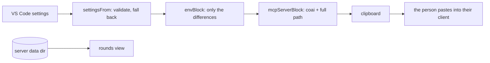

# module: extension — ConnectOtherAIs in VS Code

> `src_vs_code` — the human surface. Four commands, zero runtime dependencies, no background work
> and **no port**: the review itself lives in `coai-mcp`, which an MCP client owns and starts.

## Commands

| Command | Does |
|---|---|
| `coai.installServer` | Downloads the latest `mcp-v*` asset for this RID into the extension's storage, verifies its `.sha256`, extracts with `tar`, remembers the version, and puts the `mcpServers` block on the clipboard |
| `coai.copyConfigBlock` | Regenerates that block from current settings — the way changed settings reach the server |
| `coai.copyClaudeSnippet` | The CLAUDE.md text teaching a target repo's main AI the tool order |
| `coai.showRounds` | Renders every session's rounds from the server's own session files as markdown |

## How settings reach the server

One way, in the `env` of the copied block — the MCP client owns the server's process and its config
is static, so there is nowhere else for configuration to cross. `envBlock` emits **only what differs
from the server's own defaults**, so a pristine configuration produces no `env` at all. A settings
change is therefore: change it, copy the block again, restart the client.

## What it deliberately does not do

- **Never writes another program's config file.** The block is offered; the person sees what they
  grant, and several clients can coexist. (CredsForDevs' reasoning, kept.)
- **Never puts a binary on `PATH`.** Extension storage: uninstall removes it, and the full path is
  what the block carries anyway.
- **Never installs unverified bytes.** A missing `.sha256` is refused OUT LOUD — a quiet skip is
  indistinguishable from a check that passed.
- **Opens no port — still.** Escalation was the one case that needed a channel, and it arrives as a
  FILE in the same data directory: `EscalationWatcher` watches `escalations/*.json`, raises a modal,
  keeps a status-bar item so a dismissed modal loses nothing, lists open questions at the TOP of the
  rounds view, and writes the answer atomically (temp + rename) because half a file must never
  resolve a question.
- **No account, no sign-in, no cloud service of its own.**

## Entities

| Module | Role |
|---|---|
| `settingsShape.ts` | config → validated `CoaiSettings`; `envBlock`; the defaults pinned to the master plan's table |
| `coaiInstall.ts` | pure install decisions: RID (macOS honestly absent), asset/entry names, version compare, update-available |
| `installer.ts` | the impure half: fetch, sha256, `tar`, chmod, remembered version |
| `mcpBlock.ts` | the `mcpServers` block (server id `coai`), client targets, install message |
| `claudeSnippet.ts` | the paste for a target repo's CLAUDE.md |
| `rounds.ts` | parse the server's session files; render the view; a torn file is skipped |
| `escalations.ts` | pure: parse a question, the answer file's shape, status-bar text, prompt-once, modal body, the open-questions section |
| `escalationWatcher.ts` | the impure half: file watcher + a 5s poll (a watcher on a path outside the workspace is not guaranteed), the modal, the status-bar item, the atomic answer write |
| `extension.ts` | activation, the four commands, the update offer |

## Verified

25 `node:test` cases over the pure modules; `.vsix` packaged in CI and installed by hand on
2026-08-31; the released win-x64 asset downloaded, checksum-matched, extracted with Windows
bsdtar and registered — `claude mcp list` reported `coai ✔ Connected`.
