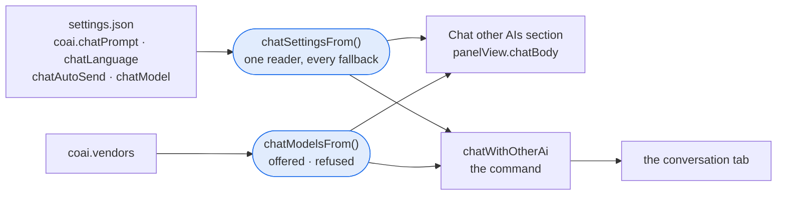
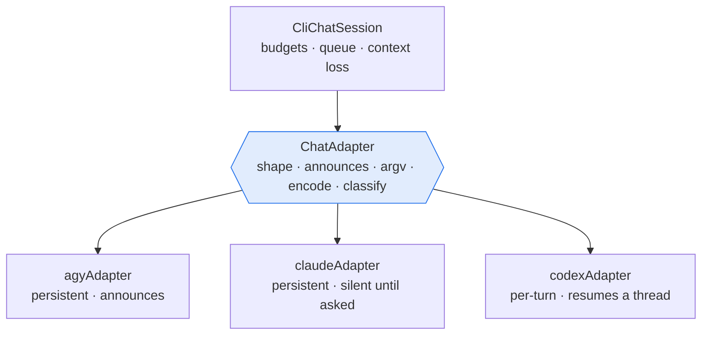
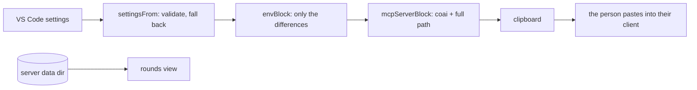
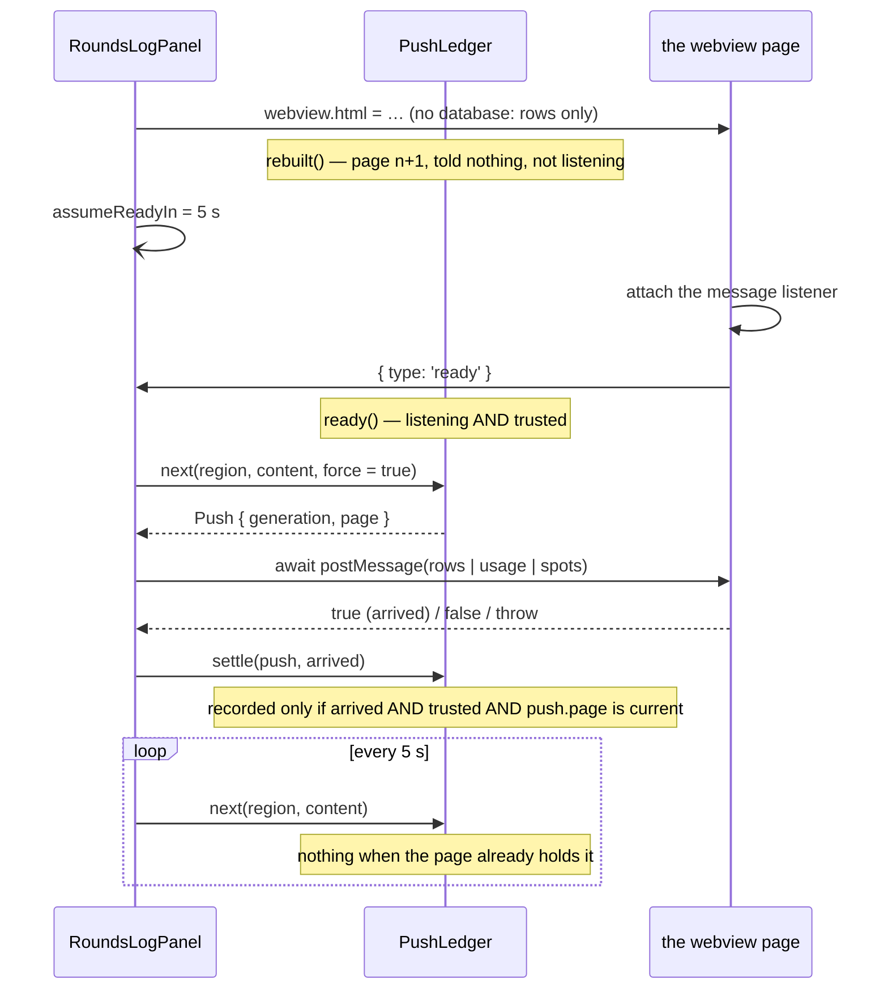

# module: extension — ConnectOtherAIs in VS Code

> `src_vs_code` — the human surface. Four commands, **one** runtime dependency, no background work
> and **no port**: the review itself lives in `coai-mcp`, which an MCP client owns and starts.
>
> That line said *zero* runtime dependencies until 2026-09-09, and the one that ended it is `marked`
> — see *An answer reads like a document* below. It was taken on the plan round's advice, against
> this file's own preference, and the reason is written there rather than left as a version bump
> somebody finds later.

### What the code round did to the chat tab (2026-09-08)

Twelve reviewers read epic 2 and found two real defects in it, both of the same family: something
that survives longer than the thing it was named after.

A panel’s callbacks closed over the TAB KEY they were created with. When `sessionKey` re-keys a
conversation onto a replacement tab object, every message from that page was then looked up under a
key nobody held: sends dropped silently, and a close that could not find its entry left the vendor
process running. A conversation now carries its own `id`, made once in `createChatPanel` and never
replaced; hooks take the id, only the map takes the key.

And `closeAll` disposed sessions without disposing panels. On a tab close that is right — VS Code
has already disposed the panel — but deactivation is not a tab closing, and it left tabs open whose
composer still took text with nothing behind it. `closeAll` now removes the entry FIRST and then
disposes both, so the `onDidDispose` it triggers finds nothing and cannot dispose a session twice.

Four smaller ones came with them: the model now travels in a pushed state (after `continue with a
local model` the page would otherwise still show the remote one as selected while answers came from
somewhere else), a pushed state that has not changed is not sent at all, a `pick` naming a model the
conversation was never offered is refused at the host boundary rather than trusted, and the
composer takes focus back when a turn ends — without which every follow-up costs a mouse click.
### A picture in the question (2026-09-10)

Phase 0 MEASURED the mechanism rather than assuming one: `claude` and `agy` both read a number out of
a real PNG when the file's PATH was named in the prompt. **The vendor process opens the file itself**,
which makes the file's name, its location and its lifetime part of the contract with the model rather
than an implementation detail.

**The page reads the bytes and writes nothing.** Only the page has a clipboard event; only the host
has a disk. The page posts a data URL and the host writes the file the vendor will open.

**`img-src data:` and nothing wider.** The CSP is `default-src 'none'`, which blocks images too, so a
thumbnail of what was just pasted needs that one addition: no remote host, no `file:`, and
`localResourceRoots` stays empty. `attachedHtml` also refuses to render a `src` that is not one of the
four image types — the value comes from the host, so it is not arbitrary, but a page that renders a
`src` it has not looked at is a page that would render `javascript:` the day something else fills
that field.

**SVG is refused although it is an image.** It is markup with script in it, and the one thing this
feature does is hand a file to a process that will open it.

**Refused BY NAME where the provider cannot take one**, which is the rule the picker already keeps.
`codex` is refused as UNTESTED rather than as incapable — its account hit a usage limit during phase
0, and that is a different sentence from a measured no. A Team server is refused because an image is
a wire-format change on a server deployed by hand.

**The file is named here, from what the image IS**, never from anything the page said: a name from
the page would be a path fragment chosen by whatever wrote into the clipboard. One directory per
conversation, which is what makes forgetting them possible.

**A picture goes with the question it was pasted for and no other.** The turn names the file, the
vendor opens it, and the attachment is spent — keeping it would send the same screenshot with every
question after it.

### An empty box asks the other model the same thing (2026-09-10)

Entry 24, in the operator's words: *"maybe I don't like gemini's answer and want to switch to Fable.
If I switch the model and press Enter with an empty box — take the previous context (except the last
answer) and feed it to the new model."*

**Except the last answer**, and the reason is sound: an answer somebody rejected, handed to the next
model, is a model being asked to agree with it. The QUESTION is kept and re-sent verbatim — it is
what they want answered again — and everything before it stays, because that is the conversation the
answer was given in. Both the answer and its question leave the transcript: the question comes back
as this turn's own, and keeping the answer would show it twice in a conversation that has moved past
it.

**On offer only when the model has CHANGED since that answer.** Pressing Enter on an empty box with
the same model chosen does what it has always done, which is nothing.

**The gesture is invisible, so the button says it.** `send()` has always refused an empty box, which
is what made the gesture free to take — and a feature whose only trigger is pressing Enter on nothing
is a feature nobody discovers. The Send button reads *Re-ask · <model>* whenever there is something
to re-ask, which is both the second way in and the only way to know the first exists. Text in the box
is a question and is never swallowed by it.

**It goes through `oneTurn`, and that is the point.** A re-ask is a turn: the lock, the turn number a
stop can name, the transcript, the model recorded on the answer and the cap on a forgetful
conversation all happen because this is not a second path.

### The presets tab (2026-09-10)

`chatPresetsPage.ts` and `chatPresetsPanel.ts` — a page module and a thin panel host, which is the
arrangement the rounds log and the help page already use rather than a third one. The command is
`coai.editChatPresets`.

**Everything on this page is text the person in front of it wrote**, which makes escaping a
different question here from the rest of the panel: elsewhere a label comes from a catalog this
product shipped or a server it talked to, and the worst case is somebody else's mistake. Here it is
their own name for their own prompt, which they can paste a `<script>` into to see what happens — and
the answer must be that they see a `<script>`.

**The prompt box is large**, which was asked for in as many words. A prompt is often a paragraph and
sometimes several, and editing one in a three-line box is reading it three lines at a time. It sizes
itself to its content where the engine can, with the `rows` attribute as the floor for engines that
cannot.

**Saved as it is typed, and re-rendered only when the SHAPE changes.** An edit writes the setting and
leaves the page alone: re-rendering on every keystroke would move the caret to the end of the box
somebody is typing in the middle of, which is exactly the defect the sidebar's prompt box had.
Adding and removing a row do re-render, because the list's shape is what changed.

**A field this page does not have is not a field.** `presetEdit` checks the name against a list of
the fields each list HAS rather than testing the object, so no key of `Object.prototype` can be one —
`__proto__` has a test of its own.

**Ticking `main` unticks the others when it is SAVED**, not when it is read. A reader that had to
correct the file every time it read it would be hiding a file nobody could trust.

**The first edit to a migrated prompt writes the prompt too.** The page shows what the migration
produced while the setting still holds nothing, so an edit that wrote only itself would lose the
prompt it came from.

### Two rows of buttons above the composer (2026-09-10)

The prompts a person saved and the models they saved, as buttons in the pinned footer. **Two rows
and not one merged list**, which was the operator's decision rather than a layout preference: they
are two kinds of decision — what shall be ASKED and what shall ANSWER — and one button that silently
sets both is a button whose effect cannot be predicted from its name.

**The colour is an EDGE, and only the model row has one of its own.** A model button wears its
vendor's colour from `vendorPalette`, so it IS a vendor's button and keeps the rule the rounds list,
the reviewer cards and the answer captions already hold: one vendor, one colour, everywhere. The
prompt row takes the link colour, which is in no vendor's palette, so a prompt can never look like a
vendor. An edge rather than a filled box, for the reason the reviewer cards gave: a wall of filled
blocks is harder to read than the text in it.

**The page names what was pressed and does nothing else.** What a prompt preset does to the composer
and what a model preset does to the conversation are the host's to decide — it holds the lists, and a
page acting on its own copy would be a second place for them to drift. The listener is delegated on
the row, because a push replaces both rows whenever the saved lists change.

### Presets: the two lists a person builds (2026-09-10)

`chatPresets.ts` reads `coai.chatPromptPresets` and `coai.chatModelPresets` — the first values in
this extension that a person COMPOSES rather than picks from a catalog this product shipped.
`prompts.ts` is a list we wrote and they override; this is a list they wrote, and it is the only
place where losing a value means losing their words.

**So a bad row is dropped and the rest survives.** Refusing the whole list because one entry was
mistyped would take away every prompt somebody saved for the sake of the one they got wrong — and
`settings.json` is a file people edit by hand. Nothing here throws.

**The migration is the part that must not be got wrong.** `coai.chatPrompt` is a single string a
person has been editing since the chat shipped. It becomes their first preset, named after its own
first words so they recognise it as the thing they wrote, ticked as the main one — and **only when
they have no presets at all**: somebody with a list has already moved, and re-adding the old string
on every read would resurrect a prompt they deleted. The setting stays declared for one release,
saying in the manifest that it is superseded and read only by that migration.

**Exactly one prompt is the main one** — the one a trigger that sends by itself uses — and the first
claim wins. A list with none ticked has its first entry standing in: while there is any prompt at
all there must be one to send, or the keybinding path has nothing to say.

**Ids are made where they are missing.** A person editing settings by hand will not write one, and
two presets sharing an id makes a click ambiguous — the buttons name what they chose and the host
looks it up.

A name is cut at sixty characters and a prompt is never cut: one has a width to respect, the other
has meaning to keep. Both lists keep the chat settings' two standing decisions — not overlaid
per-side, and not mirrored to the server.

### The picker asks for a provider, then for a model (2026-09-10)

It used to be one flat list of the configured reviewer ROWS, each labelled with the single model it
happened to be set to — so `gemini · gemini-3.8-flash` was a row rather than a choice, and picking a
different model meant leaving the conversation and reconfiguring a reviewer. The operator's words
were that it read as an arbitrary handful.

**A provider is a vendor ROW, not a runtime**, and that was settled by measurement rather than by
preference: three vendors' reviewers independently overturned the plan's recommendation on the pure
half's round. The row carries the runtime, the executable, the base URL, the price and — for a Team
server — the server and the vendor name on it, so it is the identity a saved choice stores and the
identity resolution looks up.

**The model list is the chosen provider's and nobody else's.** A list holding another row's models is
a list somebody can pick a combination from that has no adapter — a Claude model through `agy`, which
`vendor-routing.md` forbids.

**Either half posts BOTH.** A message carrying only what changed would leave the host pairing it with
whatever it last heard, and the two can disagree, because the model list belongs to a provider.
Changing the provider carries no model: which of the new row's models answers is the host's to decide
— it holds the catalog — and sending the old one would name a model that belongs to somebody else.

**A lone provider is still shown.** The flat list hid itself when it had one entry, which made sense
while an entry was a whole row: there was nothing to choose. With two steps there always is, and
hiding it would leave a person unable to see what will answer.

**What is saved was always a row id.** `coai.chatModel` and a restored tab's `modelId` both predate
the pair, so `savedPick` reads them through `legacyPick` rather than as model names — one function,
two callers, so they cannot drift.

**The open tail is discovery.** Three of the four model sources are FETCHED rather than read: a local
engine's list and the codex and agy CLIs' own lists are discovered by asking the machine, and a Team
server's allowlist is fetched from the server. All three live in the panel, which has already done
that work; the chat command has none of it, and starting subprocesses or HTTP calls to open a tab
would trade the operator's complaint for a slower one. So a row whose list must be fetched offers the
model it is configured to and nothing else — exactly what the flat list offered, which makes this
strictly not worse — and what gains a real choice today is Claude's curated three. Handing the
panel's discovered lists across is the next step.

### Every answer says which model gave it (2026-09-09)

Every answer was captioned `The other AI`, while switching the model mid-conversation is a shipped
feature and the thread is carried across — so one tab routinely held answers from two models with
nothing on screen telling them apart.

`ChatMessage.model` is recorded when the answer ARRIVES, from the model that gave it. Reading the
setting at render time would relabel every earlier answer the day somebody switched, which is the
defect stated backwards. It is optional for two honest reasons: what the PERSON said has no model,
and an answer from before the field existed has none either — both fall back to the old caption
rather than rendering an empty line where a name should be.

**The colour is the vendor's own**, through the same `vendorPalette` the rounds list and the reviewer
cards call, so a vendor a person has learned is that colour wherever they meet it. The caption
carries a class per model and `chatStyle` emits one rule per model the page knows; a model that
answered once and is no longer offered gets no rule and falls back to the ordinary caption colour,
which is honest — the page cannot say what colour a vendor it has never been told about would have.

**The rules are built from every model the page will SHOW, not only the ones it can still offer.**
Switching models carries the whole thread across — which is the feature this caption exists for — so
a conversation routinely displays a model the picker has moved on from, and building the rules from
the picker alone left those answers with a class and no rule. The ids are in the messages already.

**The caption is its own element.** It began as a `who` span inside the `who` row, which meant every
rule written for the row — its flex, its gap, its margin, its opacity — landed on the label too, and
the next person to change the row's layout would have moved the text with it without knowing why.

The label comes from the picker, so the caption reads as the name a person chose from; a model the
catalog has withdrawn is still named by its id, because what answered is a fact about the past.

### A turn can be stopped from the page it is running on (2026-09-09)

The seam shipped first and waited: `ChatSession.stop()` and an `onStop(id, turn)` hook that takes a
TURN NUMBER, because a wildcard stop ends whatever is running — which, by the time a late message
lands, can be the turn AFTER the one somebody pressed for. So the page had to be able to name it.

`turn` travels in the page state and in every push, and the control is rendered INTO the thinking
line with that number in its markup. A control on screen can therefore only ever name the turn it
was drawn for: nothing in the script remembers one across a push, which is the point. **No number,
no button** — a control that posted a message the seam refuses would look to a person exactly like a
stop that did not work.

**A push must not hand the control back.** The thinking line is replaced wholesale whenever it
changes — a Team server pushes its queue position while a turn waits — and the replacement carried a
fresh, pressable control for a turn the person had already stopped: they would press it again and
watch it come back. The page remembers the ONE turn a stop was asked for, and a redrawn control
naming that turn comes back disabled. One number rather than a set, because there is one turn in
flight, and the next turn's control is live — inheriting a stop nobody asked for is the opposite
defect. The keyboard's place is carried across the same replacement, since somebody who tabbed to
Stop while waiting is precisely somebody who wants it.

The listener is delegated on `#thinking` for the same reason the answers' links are delegated on
`#messages`: the region is replaced wholesale on every push, and a listener bound to the old button
dies with it. Pressing it disables it at once — a second press names the same turn, and by the time
it landed the host could have moved on.

### An answer reads like a document (2026-09-09)

A model's answer used to reach the page as `escapeHtml(text)` under `white-space: pre-wrap` — the
raw characters, wrapped. `renderAnswer` renders it, and **the split inside that module is the whole
design: `marked` tokenizes, and the emitting is ours.**

**Why a dependency, in a file that advertised having none.** The alternative was widening
`bodyHtml` (`helpPage.ts`), whose rule — *escape first, mark up second* — the chat page needs
verbatim. Both reviewers on the plan round refused it, and the argument holds: as a REGEX pipeline
that rule breaks on a fence containing entities (escaping the string first turns `<` into `&lt;`
inside the code the reader is shown) and it cannot count nesting at all. What is needed is a lexer
that hands back an AST, with escaping applied to the text LEAVES. So the tokenizer is bought and the
safety is written.

**Nothing marked would emit is used.** The renderer walks the token tree and emits a fixed list of
tags and nothing else; a token it does not recognise becomes its own raw text, escaped. Raw HTML —
`<script>`, an `onerror`, an `<iframe>` — is neither passed through nor dropped: it is escaped and
SHOWN, because a model that wrote a tag meant to show one. An image renders as its words, since the
page's CSP has no `img-src` and an `` could only ever be a broken one.

**No `href` is ever emitted.** A link becomes an anchor carrying `data-open` or `data-file`, and one
delegated listener asks the HOST to act on it — so there is nothing for a `javascript:` URL to be.
The host validates again: `chatCommandOf` refuses every scheme but `http`/`https`, refuses a path
that is absolute, traversing, drive-lettered or backslashed, and `openWorkspaceFile` resolves what is
left against each workspace root and checks the RESULT is still inside before opening it. A
reference that resolves nowhere is reported to the tab rather than opened somewhere else. The page
is a surface; the host is the boundary.

**Containment is not a prefix, and that is the boundary's real shape.** `isInside` compares against
the root with a separator appended: with a root of `/w/app`, the path `/w/app-secret/config.json`
starts with it and belongs to a different project. It is case-SENSITIVE on purpose — folding case
would be a guess about the filesystem underneath, wrong on one of the two this product runs on, and
the cheap direction to be wrong in is refusing a reference a model can simply write again.

**One grammar for what a file reference is.** The renderer used to demand a dot before it would
offer a link while the host's own check did not, so `Dockerfile`, `LICENSE` and `Makefile` were never
offered by a page whose host would have opened them. `fileTargetOf` splits the line off and asks
`isConfinedRelativePath` — the host's function — about the rest.

**The panel delegates, as it does for everything else.** Opening the file is `onOpenFile`, a hook,
and the work lives with the other host actions: `chatPanel.ts` is the `vscode` wiring, and a function
that reaches into the workspace, the filesystem and the active editor is not wiring.

**A bare address in prose is not a link.** GFM autolinks one, and this family has already shipped a
defect of exactly that shape — a URL inside a person's name that GitHub made clickable. A link is a
link only when the model typed the bracket.

**What the reader sees.** `You` on the right behind a link-coloured edge, the model on the left
behind a green one — an edge rather than a filled box, the decision already shipped for the reviewer
cards. A rule closes each answer. A copy control on each answer hands back the markdown SOURCE,
which is the one thing selecting the page cannot give. The prose takes
`var(--vscode-editor-foreground)` and a line height — scoped to the prose, because the chrome around
it belongs to `--vscode-foreground` and overriding that on `body` produces a seam rather than a
brighter page.

**The hostile-input file is this feature's safety**, and it is meant to grow: `renderAnswer.test.ts`
asserts on the TAG NAMES that came out, against the allow-list, rather than on words like `onerror`
— which would flag escaped text that merely mentions one, and would miss a hostile tag nobody
thought of.

### The chat page's layout: one scrolling region, a pinned footer (2026-09-09)

`chatPage.ts` renders two children of `body` and nothing else at the top level: `<main id="scroll">`
holds the header, the passage, the failure box, the messages, the thinking line and the capped
notice; `<footer id="composer">` holds the picker row, the textarea, the **Send** button and the
hint. `body` is a flex column with `overflow: hidden`, so **the page itself never scrolls** — only
the region does.

`#scroll` carries `flex: 1 1 auto; min-height: 0; overflow-y: auto`, and the `min-height: 0` is the
load-bearing line: a flex child refuses to shrink below its content without it, so the region would
never scroll, the body would instead, and the composer would leave the screen — which is the exact
symptom the layout exists to end.

**The passage is no longer capped.** It used to carry `max-height: 180px; overflow-y: auto` — a
second scrollbar on the same page — because a fifty-line selection would otherwise push the composer
off screen on open. Pinning the composer retires that reason: what a long selection pushes down is
the conversation. The block itself stays, for the reason it always had — a person must see a stale
clipboard before they discover it in the answer.

**One send, two callers, one lock.** `send()` is the only path; the Send button's listener is
attached inside the nonced script (the page's CSP is `script-src 'nonce-…'`, so an inline handler
would be a dead button) and Enter's keydown handler calls the same function. `send()` locks BOTH
controls the moment it has posted, through a single `lock()` — not when the host's `running: true`
comes back. That window was small and real: two vendors found it independently in the code round,
and a second Enter inside it put a second turn down a pipe that carries one. Nothing focuses the box
on send, because focusing a control you have just disabled is how a caret ends up somewhere nobody
can type; the existing unlock path hands focus back when the turn ends, whichever way it went.

**A defect fixed on the way in: the page's `body` rule had never applied.** The stylesheet opened
with the zoom as a bare `font-size: 13px;` outside any rule. CSS has no such thing at the top level
— a parser consuming a qualified rule appends every token to the prelude until it meets `{`, and `;`
does not end one — so the selector became `font-size: 13px; body` and the whole rule was dropped:
no margin, no padding, no font-family, no background, and the chosen text size never applied until
an unrelated push set it. The zoom now sits inside the rule, as `helpPage.ts` always had it, and a
structural test fails the build if any rule on this page is swallowed again.

### The chat page's scroll rule, decided once (2026-09-09)

Three separate fixes move this page — the pinned composer, the *jump to newest* control, the growing
composer — so the rule the operator decided (entry 23 of the bug list of 2026-09-09) is implemented
ONCE and the others obey it. Deciding it three times is how a page ends up behaving differently
depending on which change you provoked.

1. **On open the tab looks at the last message.** The passage stays above it, reached by scrolling up.
2. **A new answer scrolls to itself only if the reader was already at the bottom** — within
   `FOLLOW_SLACK_PX` (48) of it, measured BEFORE the content is inserted.
3. A reader who is scrolled up gets a *jump to newest* control (its own story).

**`shouldFollow` is exported and its SOURCE is embedded into the page** by `toString()`, bound by
assignment. That is the rounds log's idiom and it is not decoration: a function referenced only from
a template string is one the minifier renames out from under the page, which shipped dead there
twice. It references nothing outside itself — the slack is a parameter for that reason — and it is
written as `!(distance > slack)` rather than `distance <= slack` so that an unmeasurable page (NaN,
every comparison with which is false) follows: a page whose numbers cannot be read is a page whose
reader has not scrolled away from anything.

**The snapshot is the first statement of the one state handler.** Read after a write, `scrollHeight`
already includes what arrived, so a reader who was at the bottom measures a screen short of it and
is never followed — rule 2 becomes "never follow", silently, and only the real webview shows it.
Every region arrives through that one handler, which is what makes the ordering true by construction
rather than by remembering it in five places. A write counts only when the value actually CHANGED: a
retry that assigns the same html is not an insertion, and scrolling for it moves a reader for content
already in front of them.

**Two entry points, and they are the contract.** `landOnNewest()` scrolls now; `scheduleFollow()`
scrolls on the next frame and can be cancelled. Nothing else in this page may write `scrollTop` —
the jump control and the composer's resize both go through these, or the one rule becomes four that
agree by accident.

**A deferred follow is cancelled by the reader, not by re-measuring.** The reader can move between
the frame being asked for and the frame arriving, and re-measuring in the callback cannot tell: the
content is already in, so a reader who *was* at the bottom now measures short of it. Only the reader
knows they moved, so their scroll event invalidates the pending token.

**Telling the page's own scroll from the reader's took three shapes, and the first two were wrong.**
A flag cleared on a later frame stays raised for as long as that frame has not come, so every scroll
in between reads as the page's own. A position kept indefinitely turns the bottom into a magic pixel:
a reader who scrolls away and comes back to it — which is what *scroll back down* is — was still
being read as the page for the rest of the tab's life. What is there now is a ONE-SHOT arming:
`landOnNewest` records the position it actually reached (what the browser clamped to, and `null` when
nothing moved, since then no event is coming to consume it), and the first scroll event matching it
consumes the arming. Everything after that is the reader.

**The fonts-settled correction belongs to the opening follow and dies with it.** Scheduling it
unconditionally made a fresh token, so a cancelled open came back to life whenever the fonts happened
to settle, and a person who opened a tab and started reading upward was dragged down by a font. It
captures the generation at open and skips if a reader's scroll has moved it.

**Rule 3 is an OVERLAY, and that is structural rather than styling.** The *jump to newest* control
hangs above the composer out of flow (`.jump { position: absolute }` against a positioned
`#composer`). In the flow it would take room in the footer, which shrinks the scrolling region,
which changes `clientHeight` — one of the three numbers the follow decision is made from. A control
that appears BECAUSE a reader was not followed must not alter what "at the bottom" means. It is
shown only when an insertion happened and the reader was not taken to it, and it is retired two
ways: by its own click, and by the reader arriving under their own steam, which has answered the
question it was asking. Its click goes through `landOnNewest()`, the same entry point everything
else uses, and it hands the box back the focus unless a turn is running — focusing a disabled
control puts the caret where nobody can type.

**The composer sizes itself to its text, under one ceiling, on either kind of host.** `field-sizing:
content` with `max-height: 30vh` does it in CSS where the engine has it; the page ASKS
(`CSS.supports('field-sizing', 'content')`) and falls back to an `input` handler that sets the height
from `scrollHeight`, with the SAME CSS ceiling capping it — the 30 % lives in one rule so the two
paths cannot disagree about where the top is. Asking rather than assuming is the point: the property
is Chromium-only and the manifest declares support back to VS Code 1.85, whose engine has never heard
of it, so a page that took it on faith would work on the machine it was written on and silently never
grow anywhere else, which is the one failure a person cannot report because nothing happens. The
fallback is also called after a send empties the box and after a pushed draft, so shrinking back is a
call rather than a hope.

**A footer whose height changes takes the room from the conversation above it**, and here the flag
that rule 2 refuses IS the right instrument: a reader at the bottom did not scroll — the region
shrank underneath them — so re-measuring would call them scrolled away and leave the last answer
behind the box they are typing into. What they WERE is the only measurement that survives the resize.
A `ResizeObserver` on `#composer` re-pins them through `landOnNewest()`, and where the host has none
the fallback that sized the box says so itself — those are the same hosts, since an engine without
`field-sizing` is an old engine, and the promise was made to them too. Whoever changed the height
reports it; the pin is one function.

**A follow the reader cancels hands them the jump control instead.** An answer can arrive while
somebody is at the bottom — so a follow is scheduled rather than done — and they can scroll up inside
that frame. Cancelling is right; leaving them scrolled up with an answer they were never taken to and
nothing on screen saying it came is not.

**A write is compared against what was LAST WRITTEN, not against the element.** Reading `innerHTML`
back makes the browser serialise the whole subtree on every push, and what comes back is normalised —
attributes reordered, entities decoded — so an unchanged push can read as different and a changed one
as the same. `cappedHtml` and `failureHtml` clear when they are not mentioned, which the protocol has
always meant: a cap notice or a failure left on screen after it stopped being true is one a person
acts on. The record is SEEDED from what the markup holds — `regionsOf`, the one function both the
markup and the script take their four strings from — or the first push would compare against nothing,
read as a change, and scroll a reader for content already on their screen.

### One webview per SESSION, which no other page in here does (2026-09-08)

Every other webview in this extension is a singleton — the rounds log and the help page each keep
one panel in one field, revealed while open. The chat tab keeps a MAP, because the requirement is
that session 1’s conversation lives in its tab, session 2 opens its own, and both stay open while
somebody moves between them.

The key is the host’s own `vscode.Tab` object, never the tab’s label. Two Claude Code tabs can both
be called `main`, and a registry keyed by name hands the second one the first one’s conversation —
an answer that arrives and is simply about somebody else’s question. Two of the plan gate’s three
reviewers refused the label design independently, and a third finding on the code round showed the
same hole had survived in the FALLBACK: re-attaching a closed panel by label while a live namesake
sat beside it. The fallback now requires the label to name exactly one panel.

`chatPanels.ts` is the registry and knows nothing about `vscode`, so the rule that matters can be
tested: closing one tab disposes ONE session, its own. A vendor process that outlives its tab is an
authenticated child nobody can see and nobody will stop; one that dies with a stranger’s tab loses a
conversation somebody is still reading.
### The two doors into a chat, and why they behave differently (2026-09-08)

`coai.chatWithOtherAi` is reachable two ways, and they are not the same door. From the KEYBINDING
(`Ctrl+Alt+A`, scoped to the Claude Code panel) the webview still holds the keyboard, so the command
copies the selection itself with a synthetic `Ctrl+C` and asks straight away. From the CONTEXT MENU
it cannot: closing that menu takes the selection or the focus out of the webview, and the clipboard
is not even touched. Both measured with a throwaway probe extension before either was written.

So the menu path takes whatever is on the clipboard and, by default, does NOT send — it fills the
composer and waits for one keypress. It cannot know how old that clipboard is, and a wrong-content
vendor call costs money. `coai.chatAutoSend` lets the person overrule that in either direction.

The copy helper is WinAPI (`keybd_event`) and not .NET’s `SendKeys`, which was measured to deliver
NOTHING to an Electron window: 0 characters against 17107 in the same window in the same second. It
travels to PowerShell base64-encoded, so no layer of shell quoting can touch it — and it is ONE
constant with nothing interpolated into it: the passage comes back through the clipboard, as data.

**It waits for the person’s chord to come up; it does not force it up.** A keybinding can leave
Ctrl and Alt physically held, and a synthetic `Ctrl+C` on top of a held Alt is `Ctrl+Alt+C`, which
copies nothing. The first version answered that by releasing every modifier unconditionally, and
the plan gate refused it from both sides at once: a key-up sent while a finger is down does not
stay up (the hardware repeat re-asserts it), and where it does stay up the person’s next keystroke
arrives with the modifier missing. Both objections are about the same mistake — changing global
keyboard state that belongs to somebody else. `GetAsyncKeyState` asks instead: in the ordinary case
the keypress is long over before PowerShell has even started and NOTHING is released; a chord still
held after 800 ms is released key by key, only where it is actually down.

**The clipboard is borrowed, never taken.** It is saved, used as a channel, and put back only if
nothing else wrote to it during the window — which is over a second wide, and long enough for
somebody to copy something in another window. What the borrow cannot promise is worth stating:
`vscode.env.clipboard` is text and nothing else, so an image or a file on the clipboard is invisible
to it. The narrower guarantee it does keep is that nothing it could not READ is ever written over —
when the borrow comes back empty, the emptiness is its own sentinel and not a byte is written.

Each conversation runs in an empty temp directory of its own, made where the process is actually
started and removed when the tab closes. It used to be made on every INVOCATION, including the ones
that only reveal a tab already open, and removed never.

Three more rules the code round of the gate settled, each of them about not deciding something on
somebody's behalf:

- **A model the person NAMED and which cannot answer is refused by that name.** `chatChoice` falls
  back to the first row on offer only for an EMPTY setting, which is not a choice. A filled one that
  cannot be honoured used to be replaced in silence — the passage went to a different vendor, billed
  to an account nobody picked, answered in a voice nobody asked for, with no line anywhere saying so.
- **The turns of one conversation are chained.** The session already refuses to interleave two turns
  down one pipe, but the transcript lives in the command, and two overlapping asks wrote it out of
  order: press the keybinding twice against an open tab and both questions stood above both answers.
  The chain also catches a `send` that REJECTS, which the CLI session promises never to do and the
  remote one has not been written yet to promise at all — without it, a rejection behind a detached
  call left the composer locked with nothing on screen to say why.
- **The clipboard marker is unique per capture.** A fixed sentinel is a string somebody can copy —
  this repository's own source contains it — and copying it would have been reported as nothing
  copied. A capture may fail for many reasons; the CONTENT of the selection is not allowed to be one.

- **Picking a model in the tab starts a new process but NOT a new conversation.** The whole
  transcript — the questions and the answers both — is handed to the next turn (`carriedTurn`),
  because a vendor CLI keeps its context inside its own process and saying it again is the only way
  it crosses. Once, in the next question, and then never again: from there the new process
  remembers as the old one did. Nothing is sent at the moment of the switch, so moving a
  conversation and not continuing it costs nothing. The picker was wired rather than left as a
  caption that changed while nothing else did; a control that lies is worse than no control. The old
  session is disposed and its directory goes with it, and the tab closing ends whatever session the
  thread holds NOW, which after a switch is not the one the entry was created with.
- **The switch waits for a turn in flight** rather than killing it. The page disables its composer
  while the model is thinking but not its picker, and disposing the session under a running turn
  would fail that turn with "the conversation was closed" — an error about something the person did
  on purpose. It joins the same queue the turns run in.
- **The carried transcript is fenced with a per-turn id**, not a fixed delimiter. The material is a
  conversation that can contain any text at all, this repository's own delimiters included, and a
  transcript that closes its own fence early turns everything after it back into instructions to
  the model. The question is the LAST thing in the turn and says so in as many words: nothing
  inside the fence is an instruction.
- **It is bounded at 60 000 characters**, keeping the newest turns and saying inside the turn when
  anything was left behind. The plan said nothing would be truncated and three reviewers refused
  that in one round: past a model's window the request is either rejected outright or silently cut
  by the vendor, and a silent cut means the second opinion is formed on a conversation nobody
  chose the shape of. The number is far beyond any chat this feature is for and far short of the
  smallest window a vendor here offers. The remote transport's own three-turn cap is a different
  bound for a different reason and still belongs to its own plan.
- **A failed turn does not lose the carry.** It is cleared only after an answer arrives, so the
  retry one keypress later still reaches the new model with the conversation behind it.
- **Which tab this is gets asked FIRST**, before the capture. The keybinding is scoped to the
  assistant panel but the command palette is not, and invoked from the wrong tab this used to
  spend 1.7 s, borrow the clipboard and synthesise a keystroke before saying it was the wrong tab.
- **`CHAT_RUNTIMES` lives in `cliChatLaunch.ts`**, beside the argv that implements it, rather than
  in the module that builds the picker. A capability belongs with the code that provides it; the
  old direction had the launch layer importing a constant out of a module that imports the page.

And the keybinding now says it is working: `withProgress` puts *Copying the selection…* in the status
bar for the ~1.7 s PowerShell takes, because a shortcut that appears to do nothing gets pressed again,
which is how one question becomes two.
### The four settings, and where they are edited (2026-09-09)

`coai.chatPrompt`, `coai.chatLanguage`, `coai.chatAutoSend` and `coai.chatModel` reach a MODEL —
they decide what is asked, in which language, who presses send and which vendor is billed. They
shipped editable only in `settings.json`, which is where a prompt goes to be forgotten; the
**Chat other AIs** section beside *Reviewers* now holds all four, with the prompt as a multi-line
box because one word is the default rather than the limit.



Two functions are read by both halves, and that is the whole architecture of this section: what the
panel shows and what the conversation uses cannot disagree, because neither has a reader of its own.

### A provider is a ROW, and the pair is checked as a pair (2026-09-09)

`chatProvidersFrom(vendors, catalog)` sits beside `chatModelsFrom` and answers a different question:
not "which rows can chat" but "which providers exist, and what can each of them be pointed at". A
provider carries its own model list — discovered for `codex` and `agy`, curated for Claude, a Team
server's allowlist for a remote row — from `modelsFor`, with a model the server has withdrawn kept
and marked rather than dropped.

**A provider is a configured vendor ROW, not a runtime, and that was not the first draft.** The plan
recommended resolving a chosen runtime to "the first enabled row of that runtime". Three vendors'
reviewers rejected it independently on one round: two `codex` rows with different executables, base
URLs or prices are two different backends, and picking whichever comes first is a coin toss that
bills the wrong one with nothing on screen saying which — and the answer would change on a restart if
the rows were ever reordered. A fourth finding extended it to Team servers, where one server hosts
several vendor rows (`<server>-codex`, `<server>-claude`), so a server id alone cannot say which
vendor is to answer. So resolution is a LOOKUP by row id rather than a search, and nothing in it can
be ambiguous because nothing in it searches.

`resolveChatPick(vendors, list, providerId, modelId)` turns a pair into the row that says HOW to run
it. **The pair is checked as a pair**: a model-only membership check would accept `sonnet` against
the `agy` row whenever any other provider offers a model by that name, and `vendor-routing.md`
forbids a Claude model going through `agy` by name. The chosen model is returned BESIDE the row
rather than written into it — a row's configured model belongs to the reviewer that row is, and a
chat picking another model must not edit somebody's reviewer.

`legacyPick` is what a saved `coai.chatModel` from before the pair means now. Naming a row keeps
working and brings that row's own model with it. Naming a MODEL resolves only when exactly one
provider offers it: with two, this code would be choosing a vendor — and a bill — on somebody's
behalf from a value that never meant to say which, so it keeps the model and leaves the provider
empty for the caller to strand and ask.

`allowedModelsFor` **moved from `panelView.ts` to `models.ts`**, unchanged. It was always pure, but
it lived in the file that renders the panel, so anything else needing the same answer had to import a
webview renderer to get it. It now sits beside `modelsFor`, which consumes what it returns, and
beside `RemoteProvenance`, which was already declared there.

> The two SELECTS are not here yet. `chatPickerHtml` lives in `chatPage.ts` and the panel's control
> in `panelView.ts`, both owned by other lanes; the `coai.chatProvider` setting ships with the UI
> that reads it, since a setting drags a manifest entry, a help article and four translations behind
> it. What exists is the pure half: the providers, the resolution, and the legacy rule.

**One reader, both sides.** The section renders `chatSettingsFrom(...)` and the command calls
`chatSettingsFrom(...)` — the same function over the same per-side config reader. That is why these
four are NOT folded into `CoaiSettings`: two readers for one set of keys is a drift this repository
has already paid for twice, and the panel would eventually show something the conversation does not
use. A test drives one settings file through the reader and asserts the section renders exactly what
it returned.

**A model named in the settings that cannot answer is shown as chosen, and as unable.** Without the
option the browser falls back to the first one and the panel reads *the first one that can answer*
while `settings.json` says `codex`: a section describing a state that is not the one the command
will refuse. It is selected so what is configured is what is shown, and disabled so it cannot be
picked again once it is left. Reviewers on other runtimes are named underneath with the reason,
never quietly absent — the same rule the command follows.

`PanelState.chat` is optional for the reason `teamServers` is: sixteen fixtures predate it, the
files are stored CRLF, and a required field would have meant sixteen unreviewable whole-file diffs.
Absent means the defaults, which is what an untouched panel shows anyway.

### What a force-killed editor leaves behind (2026-09-09)

A chat is a vendor CLI signed in as the person, and it lives as long as its tab. Closing the tab
kills it; deactivating the extension kills them all. **Neither runs when VS Code is force-killed** —
the Task Manager, a battery that goes, an installer that restarts the machine — and what survives
that is an authenticated process nobody can see and nobody will stop.

So every child is written down as it starts and struck out as it ends, and the next activation reads
what is left. In the ordinary case the file is empty and the whole mechanism costs nothing.

**One ledger file per extension host, named after it.** `globalStorageUri` is shared by every VS
Code window. A single file meant one window reading another window’s LIVE children and killing them
as orphans — they really are this extension’s, so every identity check would have passed — and a
person with two windows would have watched a working conversation die when they opened the second.
The gate called it Blocking. The owner’s pid is in the file NAME, a window only reads files whose
owner is gone, and two windows never write the same file, which also removes a cross-process write
race that no in-memory promise could have covered.

**The dangerous part is the killing, and the ledger exists to make it safe.** The launcher has said
so since it was written: a pid is not an identity, Windows hands used numbers out again, and killing
by number can end whatever now holds it. A record is therefore three facts — the pid, the image, and
WHEN it started — and all three must still hold. The operating system is asked who holds the number
now (`Get-CimInstance Win32_Process`, which reports the name WITH its extension, unlike
`Get-Process`), and a mismatch on either fact leaves the process alone.

**The check and the kill are ONE command.** A query followed by a kill is a window in which the
verified process can exit and its number be handed to somebody else — small, and small windows
around killing are precisely what this is for. The three facts are compared and the tree is ended
inside a single PowerShell invocation, which also means a TREE kill: a Windows shim is a tree —
`codex` is `codex.cmd` running `cmd.exe` running node — and ending only its root leaves the CLI that
was actually working.

**An answer nobody could get KEEPS the record.** No PowerShell, a refusal, a machine that is not
Windows: the entry is retried at the next activation rather than dropped, because dropping it is how
an orphan becomes permanent. A week is the bound on that — past it a pid means nothing on any
machine that has rebooted.

The case that decides the design is not the orphan. It is somebody’s own `claude`, running their own
work, on a number an extension wrote down an hour ago: **killing that would be far worse than the
orphan it was tidying up.** Every unhappy answer — no such process, a refusal, a PowerShell that
would not start — means the same thing and kills nothing. The guard fails CLOSED.

Verified live rather than reasoned, three processes and three ledger files: the orphan of a
force-killed window was ENDED, a stranger of the same image recorded an hour off was LEFT ALONE,
another window’s live child was LEFT ALONE and its file was not even read, the dead window’s file was
removed and the live one was untouched.

### A Team server answers a chat, bounded at three turns (2026-09-09)

`RemoteChatSession` is the same `ChatSession` the local half implements, over a QUEUE instead of a
pipe: submit a review, poll it while it waits behind everybody else’s, take the answer, cancel what
is still queued when the tab closes. The wire is the one `coai-mcp --ask-remote` has spoken since
the Team server existed — a second dialect of one protocol is how two halves become green about
opposite things.

**Two measurements changed the design before any of it was trusted.**

- **A chat turn carries no review ROLE, and says `kind: chat` instead.** The first version sent
  `Chat` as a role, which the server refuses outright — and it is right to: a role there carries a
  shipped prompt, a threshold and a round budget, and a test walks every value of that enum asserting
  each asks for an honest empty findings list. What the server does accept is a job with no role,
  which is also the separation the owner asked for: a usage row with no role is a conversation,
  because every review has one. But an absence is not a contract, so the turn ALSO carries the `kind`
  field that `research/PLAN_the_server_knows_a_chat_from_a_review.md` will add — sent before the server
  reads it, because the day a job defaulting to `review` requires a role, a client sending a blank
  role and no kind is refused, and that client is every copy already installed. Measured before
  shipping it: a body carrying `kind` was accepted in 56 ms, exactly as one without.
- **A poll may not ask for longer than this side will wait.** `ask` aborts every request at ten
  seconds; the long poll was asking the server to hold for twenty-five. Every poll would have failed
  with *"it did not answer within 10s"*, for a server behaving perfectly. Two constants in two files,
  and the defect only exists when they are read together.

**Three turns is the cap**, and the reason is arithmetic rather than policy: a remote model keeps no
conversation, so every turn re-sends the whole transcript and the bill for turn N is the bill for
everything before it. The page’s `capped` region — built in epic 2 and never set until now — says so
and offers the local model that HAS a memory. What travels is `carriedTurn`, bounded tighter for a
server (20 000 characters) than for a pipe (60 000): a pipe took 76 059 bytes in five seconds, and a
JSON body through whatever sits in front of a server is where a 413 arrives at turn three.

**A status this build does not know is NAMED, not waited out.** The server has exactly four — Queued,
Running, Done, Failed — so a fifth value means a server much newer than this client, or something in
front of it answering for it, and three minutes of "Thinking…" is the worst way to say either.

**The vendor name the server knows is not the row's own id.** A row is called `<server>-<vendor>` so
that two Team servers each offering `codex` do not collide, and `remoteVendor` records the half the
server wants — but only since the field existed. Falling back to the row id for an older row sends
the compound name, and the server answers *"'remsoftdev-codex' is not a vendor here"*: zero tokens,
seconds per round, and a message that reads exactly like a typo in a setting nobody typed. This
repository shipped that in three releases already. `serverVendorOf` in `teamServers.ts` is the
inverse of `remoteVendorRowId` and lives beside it, so the two directions cannot drift apart.

**The memory rules belong to the model, so switching one replaces them.** `memoryOf` answers both —
whether the model keeps a conversation, and how many turns it has been asked — and both places a
session starts spread that one object. The first version set them where a conversation was created
and left them alone where its model CHANGED, which broke both directions invisibly: local to a
server left the flag false, so a server that remembers nothing was asked turn two with no transcript
and the three-turn cap never applied at all; server to local left it true, so a CLI that HAS a
memory was refused a fourth question.

**A stranger's identifier is checked before it becomes part of an authenticated URL.** The review id
comes from the server and goes into `api/reviews/<id>` on a request carrying this machine's bearer
token; `../../api/servers` would steer that token at a route nobody chose. The same guard the
catalog's vendor ids get and the local adapters' thread ids get — three places, one rule.

**A queue says where you are.** A shared server queues twenty deep per person by design, and the
position was already parsed out of every poll and thrown away; minutes of an unchanging spinner is
the one shape a busy server and a broken tab look identical in. `ChatSession.send` takes an optional
progress callback that a local session never calls.

Measured live against `coai.remsoft.dev`: a legacy row `remsoftdev-claude` resolves to `claude`, the
server's own id — `639245409310726709-c7c8d927752342539710abbc0cb5142d` — passes the shape guard,
and a real turn answered in 3.8 seconds.

### Three vendors, one seam (2026-09-09)

The chat answered on one runtime because the master plan recorded a limitation as fact:
*“claude’s stream-json schema differs and codex exec has no multi-turn stdin”*. Measured, half of
that was wrong. `claude` holds a conversation exactly as `agy` does and answers faster than either;
`codex` holds one too, through a stored session it resumes rather than a pipe it keeps.

`cliChatSession.ts` did two jobs — the process LIFECYCLE (budgets, one turn at a time, the four
ways a child ends, what a death costs a conversation) and `agy`’s wire protocol. The first is
vendor-neutral and tested; only the second differs. `chatAdapter.ts` is the line between them.



**Two shapes, and the difference is not cosmetic.** A `persistent` vendor is a pipe: write a line,
read events, the context lives in the child, and a child that dies takes the conversation with it.
A `per-turn` vendor is a process per question: the prompt goes in on stdin, the stream is CLOSED,
the answer arrives, the process exits — and nothing is lost, because the conversation lives in the
vendor’s own store and the next turn resumes it by id. **So the context-loss rule is inverted
between them**, which is the single most likely place for this to go wrong and has a test file of
its own.

**Three things the live check found that no unit test could.**

- **Who speaks first is a property of the vendor.** `agy` prints `init` on start; `claude` prints
  nothing at all until a turn arrives, and given an empty stdin simply exits. A session that waits
  for readiness first spends its whole startup budget and reports a CLI that never started, for one
  that was working and had not been asked. Hence `ChatAdapter.announces`.
- **`spawn` searches neither PATHEXT nor the shell.** A bare `codex` on Windows means `codex.cmd`,
  and spawning the bare name dies with `ENOENT` at the first turn, where it reads as the model
  refusing. `resolvedExecutable` — exported from `versionProbe`, which had known this for
  `--version` since it was written — answers it once, before a tab exists, and a CLI that cannot
  be found is refused in a sentence somebody can act on.
- **`codex` is resumed by THREAD ID, never by `--last`.** `--last` is the most recent codex session
  on the machine, so two chat tabs — or one chat and one review round — would answer each other’s
  questions. `--json` gives `thread.started` with the id, and `item.completed` carries the answer.

Measured through this build’s own session, two turns each, the second asking for a number planted
in the first — **subject `9765c23`, harness `src_vs_code/scripts/live-chat.mjs` (`npm run test:live`),
planted number 7431, Windows 11 on node 24.18.0, 2026-09-09**: `agy` 8.0 s then 1.4 s, `claude` 3.0 s then 1.6 s, `codex` 7.3 s then 6.7 s. All three
kept their context. A 76 059-byte prompt reached `codex` through stdin in five seconds, which is why
the prompt does not travel in argv — Windows caps a command line at 32 767 characters and a carried
conversation is bounded at 60 000.

`vendor-routing.md` still binds, and the adapter map is how: the runtime chooses the adapter AND the
executable together, so a Claude model reaches the `claude` CLI and can never be routed through
`agy`. A runtime with no adapter — a local OpenAI endpoint, a Team server — is still refused by name.

### A conversation is a process, and it ends four ways (2026-09-08)

```mermaid
stateDiagram-v2
  [*] --> Idle
  Idle --> Starting: send, no process
  Starting --> Ready: init
  Starting --> Failed: startup budget · launcher threw · died before init
  Ready --> Asking: one NDJSON line
  Asking --> Ready: result SUCCESS
  Asking --> Ready: result ERROR (the model refused; the process lives)
  Asking --> Failed: turn budget · exit · error
  Starting --> Stopped: stop (the person), before init
  Asking --> Stopped: stop (the person)
  Stopped --> Starting: the next send, carrying the transcript ONLY when contextLost
  Failed --> Starting: the next send, with contextLost
  Ready --> [*]: dispose
  Starting --> [*]: dispose (the waiter is told at once)
```



Five ends, one of them a person closing a tab and one a person ending a single answer. `Failed`
always kills the tree: a process that has stopped answering must not be handed the next turn. The
edge back into `Starting` is the one that carries `contextLost` — the replacement never heard the
passage, and the first answer afterwards says so rather than reading as a model that has lost the
thread.

### `stop()` — ending a turn without ending the conversation (2026-09-09)

`ChatSession` has a third method beside `send` and `dispose`. A measured turn is 9.4 s and a long one
much more, and until now a question sent by accident could only be waited out — and billed.

`stop()` ends the turn that is running NOW and leaves the session able to take another. **A stop that
names nothing does nothing**: with no turn in flight it neither kills an idle process nor marks a
conversation lost. That is not defensive coding, it is the whole guarantee — a stop can arrive late (a
queued bridge message, a second press, a keybinding pressed as the answer lands), and the identity of
the turn being ended lives in a closure created by that turn and cleared the moment it settles by any
route. A stop one tick late finds `undefined`; a stop after the next turn began finds that turn's own
closure, which is why the host also checks the turn NUMBER before calling this at all.

**The handle is armed before the process starts, not after the question is written.** Startup is a
measured 3.6–6.6 s — a large share of the wait a person is pressing stop to end — and the first draft
armed it only once the line had gone down the pipe, which made a stop during launch a silent no-op:
the process went on starting, took the question and answered it. Four reviewers across three vendors
found that on the code round. A stop during startup now cancels the start budget, tells the waiter,
kills the child and settles the turn, which is everything `dispose` does to a start in progress minus
the disposal itself.

**There is no stop wildcard.** The bridge refuses a `stop` that does not name a turn, and refuses one
naming anything that is not a whole positive number — a string, a negative, a fraction, `NaN`. An
earlier version let a missing number mean "whichever is running", for a page too old to send one;
three vendors pointed out that this hands back the exact defect the number exists to prevent, and
there is no such page, because `stop` and its turn number ship in the same release.

What a stop costs differs by session shape, and the session knows which it is:

| shape | vendor | what the kill costs | what the next turn does |
|---|---|---|---|
| persistent | `claude`, `agy` | the conversation — it lived in that process | re-sends the transcript (`contextLost: true`) |
| per-turn | `codex` | the answer only — the thread is in the vendor's store | resumes by the same thread id |
| remote | a Team server | nothing — a server remembers nothing anyway | submits as usual |

The failure arm of `TurnResult` grew two optional flags to carry that: `stopped`, so a caller can tell
an instruction that was obeyed from a defect, and `contextLost`, so it knows whether to re-send.
`contextLost` is set for a stop and **not** for a crash — a stop is the person's decision, whereas
silently re-sending a transcript because a third-party CLI fell over bills somebody for an accident.
That case is [its own plan](../todo/PLAN_a_dead_process_could_carry_the_conversation_too.md), gated on
measuring how often it happens.

The remote half settles the turn through a `Promise.race` rather than by waiting for the poll in
flight: a long poll holds the connection for up to eight seconds, and waiting that out is the very
complaint the feature answers. The job is cancelled on the server in the same breath — `DELETE
api/reviews/{id}`, which already existed — because a queued job holds a slot on a shared vendor
account and the drop-on-no-poll sweep would not take it back for three minutes. Whatever the abandoned
poll eventually answers is dropped; a race settles once, so an answer landing after a stop cannot turn
a stopped turn into an answered one. That race covers the SUBMIT as well as the polling, because a
POST can take twenty seconds and a stop pressed during one must not be waited out.

Which turn a remote poll belongs to is a **generation number**, not a boolean. The first draft used a
`stopped` flag that the next turn reset — so turn A's poll, sitting in an `await` when A was stopped,
woke up after turn B had cleared the flag, decided it was not stopped after all, and carried on
polling A's cancelled job and pushing A's queue positions into B's tab. Three reviewers found it. A
number cannot be un-stopped: each turn captures its own value, every stop and every new turn moves the
session past it, and the loop re-checks staleness the instant each poll returns rather than at the top
of the next iteration.

`chatCommand.ts` records the stop in the transcript before carrying it. The question is appended
*before* the turn is sent, so a turn ending without an answer leaves the transcript on a dangling
question; carrying that would hand the next model a question nobody answered with no sign it was
abandoned, and the turn after would append a second `you` on top of the first.

> The Stop CONTROL is not here yet. This is the seam half; the button in `chatStatusHtml` belongs to
> the chat-page lane, which owns that file. The seam is complete and tested without it, and the host
> route already accepts the message the button will post.


`cliChatSession.ts` holds one long-lived vendor process per conversation. The protocol was measured
rather than read: `agy --input-format stream-json --output-format stream-json` takes one NDJSON
message per line and answers `init`, then `step_update`s, then a `result`. The message schema came
out of the binary’s own refusal - `stream input message is missing the "event" field` - after
`type:` was the first guess and the wrong one.

The file is shaped by the four ways such a process ends, three of which the first plan did not
mention and the gate raised as five separate findings: disposal, an exit of its own, a start that
never reaches `init`, and a turn that is never answered. The last two are separate budgets with
separate sentences, because **it would not start** and **it will not answer** send a person to
different places. Both kill the process; a child that has stopped answering must not be handed the
next turn as though nothing happened.

Turns are serialised in the session, not merely discouraged in the page. The page disables its
composer, but a page is a suggestion - two sends arriving together must not interleave two turns
down one pipe, and the second waits rather than being refused, because refusing loses what somebody
typed.

**One defect found by its own tests, worth keeping.** The launcher REPLAYS what a child said before
its first subscriber, which is what makes a fast `init` safe - and the session subscribed and only
then registered the waiter, so the replayed `init` arrived with nobody to tell. Every turn hung for
the whole startup budget. It now ASKS what happened after subscribing rather than waiting for a
signal already sent.
### One spawn site, and why it grew a handle (2026-09-08)

`processLauncher.ts` owns the only `spawn` in `src/` that this extension controls. It is the version
probe’s own launcher, widened rather than copied: the synchronous-throw catch (node refuses a `.cmd`
without a shell with an `EINVAL`, and the exception escaped `render` until it was caught at the call),
the tree kill (`child.kill()` reaches `cmd.exe` and not the shim’s grandchild), `taskkill` by absolute
path (`CreateProcess` searches the working directory first, so a bare name could be a file planted in
an opened workspace) and the empty working directory for the shell branch. A second launcher would
have had to learn all four; the one that already exists beside it, `wslNetwork.ts`, learned none and
is left alone deliberately — it has a different stdio contract, and moving it inside a refactor would
smuggle a behaviour change in under a de-duplication.

It returns a HANDLE rather than a promise because two callers want different things from the same
hardening. `capture` wants the whole output and then the exit code, and is re-expressed over the
handle with its contract unchanged for its three callers. A chat session wants to write a line, read
lines back, and keep the process for the next question — which a promise cannot express at all.

Two details are load-bearing and easy to lose. The exit event fires on **`close`**, not `exit`:
`exit` can arrive with output still buffered, and a truncated banner parses to no version at all.
And every subscription is late-safe — a listener added after the event still hears it — because a
target that does not exist fails before the caller’s next line runs.
### What the code round did to the launcher (2026-09-08)

Twelve reviewers read the extraction and found seven things in it worth fixing. Two of them would
have taken the whole extension host down: an EPIPE on the child’s stdin arrives ASYNCHRONOUSLY, so
no try/catch around `write` can see it, and unhandled it is fatal — the guard is an error listener
on stdin; the same is true of `taskkill`, whose own spawn had no error listener and would have
crashed the host on a machine where it could not start.

One was silent rather than fatal, and it is the one this feature could least afford: `chunk.toString()`
decodes each chunk alone, so a Cyrillic character split across a chunk boundary became two
replacement characters. The passages this launcher carries are routinely Russian. `setEncoding("utf8")`
on the stream keeps the decoder’s state across chunks; the test writes a Cyrillic word in two
halves and fails without it.

The other four are about the long-lived case the widening exists for. Output that arrives before
anybody subscribes is REPLAYED to the first subscriber — a child can print its whole answer and
close before the caller’s next statement runs. `onLine` and `onStdout` return an unsubscribe, because
a chat session that registers per turn would otherwise deliver turn 100’s answer to ninety-nine stale
handlers. A shell launched with no working directory now defaults to the temp directory rather than
inheriting the opened workspace, so the `cmd.exe`-searches-the-cwd hole is closed for every caller
instead of for the one that remembered. And a failure that never produced a process now carries its
reason in `stderrTail`, so "could not be read" can be told apart from "not installed".

`onPath` moved BACK to `versionProbe.ts` in the same round: it needs `unquoted` from `cliVersions`,
and a process primitive that imports a CLI-domain module has its layers inverted.
### The copied block is a path, and nothing else (2026-09-06)

`envBlock` used to fill the pasted `mcpServers` block with every setting that differed from the
defaults — sixteen keys at full stretch. That was right while the env block was the only channel to
the server; it stopped being right when the settings moved into `settings.json` in the data directory,
and nobody trimmed it. Since `SettingsFile.Layer` gives the ENVIRONMENT precedence key by key (a
variable is more specific than a file any window may rewrite, and it is what a scripted run has),
every pasted key was frozen: the panel saved a change, showed it, and the server kept the old value.

The panel passes no env now. `mcpServerBlock` still takes one, for a containerised or scripted run
with no panel and no shared data directory. A guard reads `extension.ts` as SOURCE and fails if a call
site passes an env again — the earlier tests asserted the function's default, and putting the env back
at the call site left every one of them green.

### Settings a side keeps to itself (2026-09-06)

VS Code resolves `window`-scoped settings from the CLIENT's `settings.json` and hands the same values
to every extension host, so a Windows window and two WSL distros on one machine share one proxy, one
set of CLI paths and one vault key. `coai.perSideSettings` (off by default, one switch shared by every
side) makes each side keep its own: the values live in `globalState` under `overlayKey(side)`, which
reuses the identity `installedKey` already folds from `remoteName` + distro-or-hostname + storage path
— two distros mount the same `/home/<user>/.vscode-server/…`, so the storage path alone would merge
two companies' settings.

Every read goes through one accessor (`PanelProvider.read`) and every write through one funnel
(`save`), because a read that goes around them is a setting that silently stays shared. Turning the
switch on seeds this side from what it reads today, so nothing changes until something is edited, and
the seed is idempotent so switching off and on again keeps what a side had. `uiScale` and
`helpLanguage` stay shared deliberately: a text size belongs to the person, not to the company.

### Team servers, and the four modules they are split into (2026-09-06)

A **Team server** runs the vendor CLIs on one machine, on one company subscription, and everybody
signs in to it with their work account. The extension's half is deliberately four files, split by
what can be TESTED rather than by topic:

| File | What it holds | Testable without |
|---|---|---|
| `teamServers.ts` | the canonical URL, the token filename, the server id, the scope rules | anything |
| `teamServerApi.ts` | every request, each with a deadline | a server (stubbed `fetch`) |
| `teamServerAuth.ts` | sign in / out / renew, the token file | an extension host (`AuthHost`, `StateStore`) |
| `teamServerView.ts` | the section's markup, the slot line, the usage block | a webview |

Only the last needs a browser, and it is pure. That split is why the security decisions in this
feature are assertions rather than comments: the compensation path when a token cannot be saved, the
refusal of a Graph scope, and the flag silent renewal passes are all reachable from a plain Node
test.

**The panel never renders from the network.** `refreshTeamServers` is STARTED by a render and never
awaited by one; it repaints when it lands, and its freshness check is what stops the loop — the
render it triggers finds the answer fresh and starts nothing. A catalog that could not be re-fetched
is shown as stale rather than as absent, because last week's slot counts are more useful than a blank
row and saying they are old is what keeps that honest.

### A Team-server sign-in belongs to a SIDE (2026-09-06)

The panel shipped reading ONE record per server out of `globalState` — the client's database, which
VS Code hands to every window of the profile. The token it describes is not shared at all:
`coaiDataDir()` is a path on whichever extension host is running, so a Windows window and a WSL one
hold different files. Sign in on Windows, open WSL, and the panel said *Signed in as you@company*
over a distro with no token in it.

So the intention and the evidence are now two records, and **the panel renders the evidence**:

| Record | Scope | What it is |
|---|---|---|
| `teamServer:<id>` | shared | the INTENT, with *Separate settings for each side* off |
| `teamServer:<id>@<sideKey>` | per side | the INTENT, with it on |
| `teamServer:<id>#<sideKey>` | per side, **always** | the FACT: whose token file this side holds, and since when |
| `teamServer:<id>:trusted` | shared, always | the Microsoft application the person approved — a fact about the SERVER, not a side |
| `<intent>:revoked` | follows the intent | when this scope was last signed out |

One pure function decides everything from those — `sessionAction(intent, fact, revokedAtMs, nowMs)`:
an intent with no fact MINTS (silently, `createIfNone: false`, no prompt); a fact for a different
account or one nearly expired mints too; no intent over a fact older than the revocation SIGNS OUT;
anything else does nothing. The file is the arbiter — a fact whose token was deleted by hand is
discarded before the rule runs.

That one table is both of the behaviours the operator asked for. **Sharing on**, the WSL window finds
the shared intent and mints its own token without asking, so both sides end up on one account and no
token ever crosses between the two filesystems. **Sharing off**, a fresh side has no intent, mints
nothing, and its *Sign in* runs the interactive flow — which already passes
`clearSessionPreference: true`, so a different account can be chosen. And a sign-out now REACHES the
other sides: only this side's token file can be deleted from here, so the moment is stamped and each
other side signs itself out on its next refresh.

Three guards on the silent mint, each of which was a plan-round finding: the application must already
be approved; the identity provider must still answer, and when it does not the row says so instead of
claiming a session; and the account that comes back must be the one the intent names — a machine
signed in to a personal and a work account otherwise gets a token for whichever is active on that
side. A failed mint is not retried for ten minutes, because the refresh runs every sixty seconds.

Toggling the switch carries the sign-in either way rather than dropping it: on, this side's record is
seeded from the shared one; off, this side's is promoted to the shared one when there is none. Other
sides need nothing — their token then disagrees with the intent, and the rule re-mints it.

### The MCP server section is about coai-mcp, and about nothing else (2026-09-07)

It is titled **MCP server** and carries the `coai-mcp` lines alone: what is installed on this side,
what is published, the Install/Update button when those differ, and the snippet note.

**It carried the Team server too, for three releases, and that was the mistake.** From 0.31.1 to
0.31.3 `teamServerHere` rendered one block per configured Team server underneath — the address as a
read-only input, `coai-server <version> — signed in as <email>` once a catalog answered, *connecting*
before that, and a version marked as last known when the server had stopped answering. The reasoning
was that *what am I talking to* is one question with two answers. In front of the operator it read
as two subjects sharing a box, and the correction was to name the box: a Team server is described
where it is managed, under **Team servers**.

So `teamServerHere`, `hereBlock`, `hereSentence`, `signedOutHere` and `sideSentence` are gone from
`teamServerView.ts` with their test file, rather than left unreferenced. The panel is the only place
that rendered them, and dead code that once had a purpose is the kind a later reader reinstates by
accident. The design record is
[PLAN_team_server_side_and_url.md](PLAN_team_server_side_and_url.md), whose status line says which
half of it survived — the per-side sign-in did, and that is the half that mattered.

**`teamServers` and `usageScope` are OPTIONAL on `PanelState`,** which is an accommodation and worth
naming as one: the test fixtures are stored with CRLF under `core.autocrlf=true`, so any commit that
touches one rewrites every line of it. Making the fields required cost sixteen unreviewable
whole-file diffs to add a field none of those assertions read. Absent means none — which is what a
panel with no Team servers has.

## Commands

| Command | Does |
|---|---|
| `coai.installServer` | Downloads the latest `mcp-v*` asset for this RID into the extension's storage **on the side this extension host is running on**, verifies its `.sha256`, extracts with `tar`, records the version under that side's own key, and puts the `mcpServers` block on the clipboard |
| `coai.copyConfigBlock` | Regenerates that block from current settings — the way changed settings reach the server |
| `coai.copyClaudeSnippet` | The CLAUDE.md text teaching a target repo's main AI the tool order |
| `coai.showRounds` | Writes `<dataDir>/rounds.md` from the server's own session files and opens it — a REAL file, so closing it never asks to save, and it is rewritten in place while a round runs |

## How settings reach the server

One way, in the `env` of the copied block — the MCP client owns the server's process and its config
is static, so there is nowhere else for configuration to cross. `envBlock` emits **only what differs
from the server's own defaults**, so a pristine configuration produces no `env` at all. A settings
change is therefore: change it, copy the block again, restart the client.



## What it deliberately does not do

- **Never writes another program's config file.** The block is offered; the person sees what they
  grant, and several clients can coexist. (CredsForDevs' reasoning, kept.)
- **Never puts a binary on `PATH`.** Extension storage: uninstall removes it, and the full path is
  what the block carries anyway.
- **Never installs unverified bytes.** A missing `.sha256` is refused OUT LOUD — a quiet skip is
  indistinguishable from a check that passed.
- **Opens no port — still.** Escalation was the one case that needed a channel, and it arrives as a
  FILE in the same data directory: `EscalationWatcher` watches `escalations/*.json`, raises a modal,
  keeps a status-bar item so a dismissed modal loses nothing, lists open questions at the TOP of the
  rounds view, and writes the answer atomically (temp + rename) because half a file must never
  resolve a question.
- **No account, no sign-in, no cloud service of its own.**

## Entities

| Module | Role |
|---|---|
| `settingsShape.ts` | config → validated `CoaiSettings`; `envBlock`; the defaults pinned to the master plan's table |
| `coaiInstall.ts` | pure install decisions: RID (macOS honestly absent), asset/entry names, version compare, the per-side state key (`installedKey`), the side's label, and `serverStatus` — what the Server section states |
| `installer.ts` | the impure half: fetch, sha256, `tar`, chmod, and `serverOnThisSide` — `stat` every call, the `--version` probe cached against `mtime`+`size` |
| `versionProbe.ts` | one `askVersion`, 8-second cap, stdout only — used for the vendor CLIs and for the server binary |
| `mcpBlock.ts` | the `mcpServers` block (server id `coai`), client targets, install message |
| `claudeSnippet.ts` | the paste for a target repo's CLAUDE.md |
| `rounds.ts` | parse the server's session files; render the view (status, elapsed, tokens, cost, the reviewers in flight); a torn file is skipped; a file from an older server with no status still renders |
| `panelView.ts` | the sidebar's HTML, pure: sections, vendor cards with the green run button, the two live regions (`live-questions`, `live-rounds`) |
| `panelProvider.ts` | the wiring: repaint ONLY when a control changed, live regions posted instead; vendor add/remove (confirmed)/run-in-terminal |
| `vendorTerminal.ts` | pure: which CLI a vendor is, its own usage command (`/usage`, `/status`, `/stats`), and the provider overrides a custom endpoint needs |
| `escalations.ts` | pure: parse a question, the answer file's shape, status-bar text, prompt-once, modal body, the open-questions section |
| `escalationWatcher.ts` | the impure half: file watcher + a 5s poll (a watcher on a path outside the workspace is not guaranteed), the modal, the status-bar item, the atomic answer write |
| `extension.ts` | activation, the four commands, the update offer |

## Three UI decisions with a cause

- **A repaint is conditional, and live data is posted.** Assigning `webview.html` RELOADS the
  webview, which closes any open `<select>`. With the escalation watcher ticking every five seconds
  and a running round rewriting its session file constantly, an unconditional repaint shut every
  dropdown in the panel two or three seconds after it was opened. Now a change to the CONTROLS
  repaints; `live-questions` and `live-rounds` are patched through `postMessage`.
- **The rounds view is a file on disk.** It used to be an untitled document built from a string,
  which VS Code treats as unsaved work — so every close asked whether to save content that is
  derived and regenerated on demand. `<dataDir>/rounds.md` closes silently, reopens in the same tab,
  and is rewritten while it is open so a running round advances on screen.
- **Every default vendor is also a preset.** Gemini shipped as a default and was missing from
  "Add a reviewer", so removing it was a one-way door. `vendors.test.ts` now holds that shut.

## A view is disposed when it is HIDDEN, and JSON on disk is not a string (2026-09-08)

Two errors, one session, at the worst possible moment: a person ran a plan review, the gate asked
them a question, and opening the rounds log to ANSWER it produced `Webview is disposed` and
`e.replace is not a function`.

**The sidebar outlived its own view.** `PanelProvider` held a `vscode.WebviewView` and never
subscribed to `onDidDispose` — while `helpPanel` and `roundsLogPanel`, the two other webview owners
here, both did and both nulled their handle there. VS Code disposes a view when it is hidden, and
opening the log hides the sidebar; the escalation watcher then repainted into a dead view every five
seconds. Both write paths were affected: `webview.html = …` throws synchronously, and a
`void webview.postMessage(…)` becomes an unhandled rejection, which is what VS Code shows as a
notification.

The rules now live in `ViewHandle` (`viewHandle.ts`), with no `vscode` import, because a decision
inside the provider is a decision no test can reach — the provider keeps the API and the handle
keeps the rules. Two of them are not obvious:

- **A disposal clears the handle only if that view is still the one held.** VS Code re-creates a
  hidden view when it is shown again, so the order can be A resolved → A hidden → B resolved → A's
  callback fires. An unconditional clear there blanks the LIVE view.
- **A null check cannot close the window it opens before.** `render()` awaits several times between
  its check and its write, and `onDidDispose` can fire in any of them, so the write is guarded as
  well — and only the disposal is swallowed. A live view refusing a message (a payload that cannot
  be cloned, a host channel that fell over) keeps its reporter.

**And every escaper now coerces.** `escapeHtml` is typed `(text: string)`, TypeScript erases that at
run time, and every value it escapes comes from JSON on disk — a session file, a question file —
which `parseEscalation` validates two fields of. `null`/`undefined` escape to nothing rather than to
the words; everything else is shown. The in-page twin, `esc` in `roundsLog.ts`, had always done this:
half the codebase had learned the lesson.

**What was NOT done, and why.** The first plan said to validate every declared field and SKIP a file
that failed. Both gemini and codex refused it on the plan round, and they were right: the file being
validated IS the question a person is waiting to answer, so dropping it because `branch` is a number
leaves the round gated with nothing on screen — a crash traded for a hang, which is worse, because a
crash at least says that something happened. `id` and `question` remain the only two that decide
whether a question can be shown; the rest is metadata, and metadata is rendered, not adjudicated.

## Every page can be searched (2026-09-09)

The three `WebviewPanel`s this extension opens — the chat tab (`chatPanel.ts`), the rounds log
(`roundsLogPanel.ts`) and the help page (`helpPanel.ts`) — are created with `enableFindWidget: true`
beside `enableScripts` and `localResourceRoots`. That option is the whole of Ctrl+F: VS Code gives a
webview panel the editor's own find bar for it and for nothing else, and without it the shortcut is
silently dead. Two of the three pages are long text somebody reads — a transcript of answers, and a
table built to be searched — so a dead Ctrl+F was a defect on both.

The help page is in although it has a search box of its own. The find bar is chrome ABOVE the
webview and displaces nothing, and the test that holds this is a discovery — it walks `src/` for
every `createWebviewPanel(` call rather than naming three files, so a fourth panel is covered the day
it is written. A test like that cannot carry an exception for one file without becoming the
hand-written list it replaces. The sidebar is not affected: it is a `WebviewView`, and the API has no
such option for one.

**What the code round did to the test.** The first version matched `enableFindWidget: true` anywhere
in a call's text, and three reviewers refused it independently for the same reason: a string literal,
a comment, or an object one level down can all carry those words while the call VS Code receives has
no such option — the guard stays green over a dead Ctrl+F. So `panelsAreSearchable.test.ts` now blanks
every comment, string and regular expression first (delimiters kept, so offsets and bracket counts
survive), which is also what makes the balanced-parenthesis cut of the arguments safe: a `)` inside a
title can no longer close the count. The option is then required as a TOP-LEVEL property of the
options object, exactly once, with a literal `true`, and a spread among those properties is refused
because it could override the value out of sight. A second test in the file drives all seven evasions
— absent, false, in a string, in a comment, nested, spread, a variable — plus the two formattings
(`)` inside a string, the bracket on the next line) through the same code and watches it complain; a
guard that cannot be described in a fixture is a guard nobody can trust. The discovery walks `.ts`,
`.tsx`, `.mts` and `.cts`, so a panel arriving as a `.tsx` is not a panel nobody scans.

## A conversation survives a window reload (2026-09-09)

There was no `registerWebviewPanelSerializer` anywhere in this extension, so a window reload — or an
extension update restarting the host — emptied every chat tab. `retainContextWhenHidden` keeps a
panel alive while it is HIDDEN, which is a different thing entirely.

**Identity is the whole design, and the plan round is why.** The first draft keyed the store by the
tab's TITLE, because nothing was calling `setState` and a title is the only thing VS Code preserves
by itself. Six reviewers took it apart independently and they were right on every count: two namesake
tabs would overwrite each other on the way IN, so the collision could never even be detected on the
way out; a `deserializeWebviewPanel` call cannot know whether another panel of the same name is still
coming; and `workspaceState` is shared by two windows on one folder. So the conversation carries its
own id — minted in `newConversation`, rendered into the page, handed straight back through
`setState`, and returned to the serializer after a reload. That is the one line in `chatPage.ts`.

**Nothing is started when a tab comes back.** The process that was answering died with the window,
and most restored tabs are never spoken to again; opening a CLI for each of them at every reload
would be a window full of vendor processes nobody asked for. The transcript is rendered, the composer
works, and `reopened` starts the session inside the FIRST turn — re-running the same three checks the
command makes before opening a tab at all, because a reload can be a week and a machine rebuild away
from the conversation it restores. The transcript is already in `carry`, so the model that answers is
handed the whole thread through `carriedTurn`: the handover a model switch already ships, which is
why nothing here resumes a vendor thread and no adapter learns anything new.

**A restored panel is built by `createChatPanel`, with the panel VS Code handed back.** That is what
keeps the icon, the message wiring, the zoom hook and the disposal in one place; the icon plan's own
test holds it from the other side. Two halves of the options are not the same: `webview.options` can
be set again on a restored panel and is, but `retainContextWhenHidden` and `enableFindWidget` are
fixed at creation with no API to change them, so whether a restored tab keeps its find bar is the
workbench's decision and not ours.

**Nothing is deleted when a tab closes**, and that is deliberate: a disposal cannot tell a person
closing a tab from a reload tearing one down, and VS Code disposes every panel on reload. Deleting
there would erase the transcript at exactly the moment it is needed — the code round named it, and it
would have made the whole feature a no-op. A closed tab is simply never restored, because VS Code
only deserializes panels that were open. The store is bounded instead: a record per conversation,
newest first, cut at a week and at twenty, swept once on activation.

**A push that changed nothing writes nothing.** `show` runs on every state push — a turn starting, a
queue position moving, a failure clearing — and the first version rewrote up to twenty whole
transcripts into one key each time, which is a great deal of JSON on the extension host for a page
that said the same words. The comparison is by REFERENCE, exact because `thread.messages` is replaced
rather than mutated. And a question a restored conversation refuses comes BACK to the composer: the
page clears its box when it sends, so a refusal that said only what was wrong would also have thrown
away what the person typed, leaving them to write it again to try the fix they were just told to make.

`chatTabs.ts` holds all of that with no `vscode` import — what is written, what a damaged record does
(dropped, never repaired: a transcript with a hole reads as a model that said nothing), what a
different `version` does (discarded, never guessed at), and the write queue. The queue matters
because every write is read-modify-write of one key: two tabs saving in the same moment would both
read the same old value and the later write would drop the earlier one's conversation. It recovers
from a rejection rather than staying poisoned, since a storage failure that silently stopped every
later write would be indistinguishable from the bug this fixes.

**Two open tails.** A panel restored into a window where the conversation's record was pruned is
disposed rather than left as an empty tab pretending to be one — silently, which is the right trade at
window start and the wrong one if anybody reports the tab vanishing.

And `chatCommand.ts` is 920 lines, over the 800 the coding-style rule allows; it was 720 before this
change. The extraction that fixes it is real and named: `readyToChat`, `cliFor`, `remoteFor` and
`started` are a coherent "what can answer, and how is it started" cluster with no tie to the thread
registry, used by three callers — opening a tab, switching a model, and reopening a restored
conversation. It is NOT done here on purpose: this diff has been through its code round, a file move
afterwards would ship unreviewed movement, and two other plans are editing the same file. It is worth
one small change of its own.

## The chat tab wears its own glyph (2026-09-09)

Every chat tab wore the generic `≡`, because `createWebviewPanel` never set `iconPath` — there was
not one in the whole extension. A person with three conversations open had three tabs that looked
like everything else in the editor.

`media/chat.svg` and `media/chat-light.svg` are the activity-bar glyph (`panel.svg`: three nodes
around a hub) with three things changed for a tab. The colour is BAKED IN, twice, because a tab icon
is workbench chrome and no theme reaches it: `var(--vscode-…)` is unavailable and `iconPath` takes a
`Uri` or a `{ light, dark }` pair — `#5CC46F`, palette slot 5, on a dark ground, and `#2E8B3E`, the
same hue darkened, on a light one, because a bright green on white reads pale. Measured against the
grounds they sit on: 4.30:1 on white, 3.64:1 on a Light+ tab, 7.61:1 on Dark+, 8.10:1 on Dark
Modern — every one past the 3:1 WCAG asks of a graphical object. And the viewBox is cut to the
content (`2.7 0.85 18.6 18.6`, centred on the hub's visual centre at y 10.15 rather than the box's
12) with the strokes taken from 0.95/1.15 to 1.7/1.8, because "big" is not a size the workbench lets
you ask for: it draws a tab icon at its own fixed size, and the Welcome tab's looks big only because
its glyph fills the box edge to edge.

**The line was the small half.** `createChatPanel` took no context and no URI, and neither did
`newConversation` or `chatWithOtherAi`; `context` exists only in `activate`. The URI is threaded
through all three — the URI, not the `ExtensionContext`, because a function that needs a media folder
should say that and this one needs neither storage nor subscriptions. `PanelProvider` holding a whole
context is the precedent for the other choice and it is the right one there: it uses `globalState`
and `globalStorageUri`.

**Where the path lives, and why it is not in `chatPanel.ts`.** `chatIcon.ts` holds the two file names
and imports nothing. The only failure mode an icon has is a path that names a file nobody shipped —
nothing type-checks a `Uri`, and a wrong one produces the generic icon and no error anywhere. The
code round refused a regex over `chatPanel.ts` for this, and it was right: a regex proves that
somebody wrote a string down. So the RESOLUTION is a pure function, `chatTabIcon(join)` — the panel
hands it `vscode.Uri.joinPath` and the test hands it a joiner of its own, and both observe the same
two paths, which the test then opens on disk. One structural assertion survives, for the one thing no
test here can reach: that `chatPanel.ts` assigns `panel.iconPath` at all.

That assignment mutates a live object, which the immutability rule would ordinarily refuse. The rule
governs OUR data; this handle is VS Code's, `iconPath` is settable only after creation, and every
webview in this extension is configured the same way. Recorded at the line rather than worked around,
because the alternative is a creation API that does not exist.

**What the packaging test had to become.** Asserting that no `.vscodeignore` line STARTS with `media`
was the first version, and it was green with `**/*.svg` sitting in the file — measured, not supposed.
Each pattern is now expanded into the regex the packager's glob means by it, in one character-by-character
pass, and run against the paths the panel actually asks for. A chain of `.replace` calls cannot do
that job: the `.*` that `**/` expands to contains a `*`, which the later `*` rule rewrites into
`[^/]*`. It was checked against `**/*.svg`, `media/**`, `**/media/**` and `media`, all four of which
now fail it. `vsce ls` was also run and lists both files.

**Not verified here.** The side-by-side against the Welcome tab needs a running workbench and a human
eye. The geometry matches the numbers the plan measured, but "indistinguishable in size" is recorded
as unverified rather than claimed.

**The tail is held by a test, not by a paragraph.** A panel restored by a `WebviewPanelSerializer`
would not pass through `chatWithOtherAi`, so it would come back without an icon. There is no
serializer in this extension today — `registerWebviewPanelSerializer` appears nowhere — so no tab
loses anything yet; the plan that adds one (`a_conversation_survives_a_reload`) must route its
restored panel through `createChatPanel`. `theTabWearsAnIcon.test.ts` walks `src/` and fails any file
that registers a serializer without reaching `createChatPanel`, so the requirement arrives with the
change that needs it rather than being remembered.

## The update check can trust `…/releases` again (2026-09-08)

`installer.ts` asks GitHub for the newest release and offers its asset. That was safe only while a
release meant a FINISHED release — and it never did: `gh release create` ran inside every matrix leg,
so the release existed from the moment the FIRST of six finished, and the other five were still
uploading. For that window the update check saw a published release and offered a download that
answered 404.

Measured twice. `mcp-v0.16.0` shipped five RIDs and no `win-x64`, and the tag had to be burned. On
2026-09-08 an operator pressed Install and got

```
downloading …/releases/download/mcp-v0.18.13/coai-mcp-0.18.13-win-x64.zip answered 404
```

on an asset uploaded at 17:31:54Z — after the click.

**Every release line now creates a DRAFT**, which `GET /releases` does not return to anyone but a
writer, so there is no window at all. A completeness job publishes it (`gh release edit
--draft=false`) once every expected asset is present BY NAME — and the mcp line gained that job,
which only the server line had. A failed matrix leg therefore leaves a draft nobody can see, instead
of five platforms of six with the sixth answering 404 permanently.

The extension line drafts and publishes inside its one job: it has one asset and no siblings to wait
for. The draft still earns its place there, because "the window is small" is what the mcp line's
window was called before it cost a release.

## Verified

90 `node:test` cases over the pure modules; `.vsix` packaged in CI and installed by hand on
2026-08-31; the released win-x64 asset downloaded, checksum-matched, extracted with Windows
bsdtar and registered — `claude mcp list` reported `coai ✔ Connected`.

### What repaints, and what is patched (2026-09-01)

The panel has two update paths, and `staticKey` (in `panelView.ts`, so it is testable without
`vscode`) decides which one runs. A repaint reloads the webview and closes any open dropdown, so it
is reserved for the person's own doing; everything that moves by itself travels through
`liveRegions` and is patched into `#live-questions`, `#live-rounds` and `#live-usage`.

**Anything missing from that key is a control that can never change.** The spending window was
missing: clicking Today, Month or Year recorded the choice, produced an identical key, and
repainted nothing — the section sat on Week for good and the buttons read as broken, because they
were. `usageWindow` and `latestServerVersion` are now in the key; the spending ROWS are a live
region, so they advance mid-round without closing a dropdown. The window tabs deliberately sit
OUTSIDE that region: a button inside a patched region loses its click listener on the next tick.

### A third answer beside repaint and patch: WITHHOLD (2026-09-09)

The prompt box in *Chat other AIs* forgot what was typed into it. Two halves, and a measurement that
refuted the obvious fix before it was written.

**The measurement.** `chatPrompt` was suspected of repainting the panel on every save, which is why
the draft plan called "save as you type" a trap. It does not: the paint decision is `staticKey`, and
its eleven fields are `settings`, `vendors`, `codexModels`, `localEngines`, `server`, `side`,
`latestServerVersion`, `usageWindow`, `openSections`, `teamServers` and `usageScope`. `state.chat` is
not one of them, and `state.settings` is `CoaiSettings`, which the chat keys are deliberately not
part of. A chat setting cannot rebuild the page. That is now an assertion in
`thePromptBoxRemembers.test.ts`, so adding `chat` to the key fails with that sentence instead of
making the box flicker.

**What actually killed the draft** is the same reading from the other side. `render()` runs
unconditionally every five seconds from the escalation watcher, recomputing all eleven, and four of
them move with nobody touching the panel — the local-engine probe, the server's own `--version`, the
published-release fetch and the Team-server catalog — while `settings` moves whenever any other
control is written, from this window or another one sharing `settings.json`. Any of those rebuilt the
document, and the typed text existed only in that document, because the `[data-setting]` listener
posted on `change`, which a textarea fires at BLUR.

**Half one: a textarea is written as it is typed.** One message per 400 ms pause rather than one per
key, flushed at once on blur, on the panel being hidden, and on the page unloading. Selects and
checkboxes keep `change` alone — a dropdown must not save half-chosen.

**Half two: the page is not rebuilt under a focused control.** The page reports focus in and out of
any `[data-setting]` control and `render` withholds the html assignment while one is held, patching
the live regions as usual. The key is not recorded while a paint is withheld, so the next render
after focus leaves paints what this one could not. A transition between two controls reports neither
edge — the focusout of the one being left arrives before the focusin of the one being entered, and a
repaint in between would land on a caret that is on its way.

**The hold is capped at 30 seconds, from the start of the editing SESSION.** Not renewed by typing,
and not by tabbing to the next control either — the code round found that half, and it is the same
defect twice: a cap a keystroke or a focus change renews is a cap with no bound. `focusout` is not
guaranteed on top of that: switch to another application mid-sentence and the panel would never learn
the box was abandoned, which is the whole reason there is a cap at all. Closing the sidebar fires no
`focusout` either, so disposal forgets the editing state outright; without that a view resolved again
inside the cap would refuse to paint and would refocus a control from a page that no longer exists.

**Nothing is lost when the cap expires.** The value was written 400 ms after the last keystroke, and
the paint carries `PanelState.focus` — `{ id, start, end }`. The id is `setting|vendor|role`, not the
setting name: a role-keyed control and a vendor-keyed one both carry `data-setting="rounds"`, and a
name would refocus whichever of them the document held first. The caret rides on the debounced write
that already happens, so it costs no message of its own, and it is clamped to the length of the value
the rebuilt page holds. The page compares the id as DATA against ids it builds from its own
attributes — it never becomes a selector. On the way out it is refused unless it matches
`[A-Za-z0-9_.-]+\|[A-Za-z0-9_.-]*\|[A-Za-z0-9_.-]*`, the caret is coerced to two ordered
non-negative integers, and the serialised result has `<` escaped: a whitelist alone is a guarantee
that depends on nobody widening it.

**One write per change, not two.** `change` compares a control with the value it held when it gained
FOCUS, not with the value last sent — so typing, pausing past the write, then clicking away wrote the
same string twice. The page remembers what it last posted per control and skips a repeat.

**Writes queue, and a render waits for them.** `onDidReceiveMessage` fired `void this.write(...)` per
message, so two writes raced and a render could read a configuration a write had not finished
applying. They go on one chain now, the chain recovers from a rejection instead of staying poisoned,
and `render` awaits it before deciding anything — without which blur → `change` → write → focusout →
render is a race the render can win, re-stamping the box from the value being replaced. It awaits the
queue until it is STABLE rather than once, because a write appended while the render was suspended
would otherwise be read a moment too late; bounded to five rounds, since under continuous typing the
queue never settles and a render that waits for silence is a render that never happens.

`choosePrompt` and `run` deliberately do NOT join that queue. `choosePrompt` renders at the end of
itself and `render` awaits the queue, so queueing it would deadlock; and `run` installs binaries and
starts processes, so a render waiting behind one would freeze the panel for as long as an install
takes.

**The open tail.** A `config.update` that REJECTS — an unwritable `settings.json` — leaves the typed
value in the document and nowhere else, and the paint that eventually lands replaces it. The person
is told by the error notification `save` already raises, and surviving it properly would mean the
host keeping a shadow copy of what every dirty control holds: a second source of truth for a control
value, which is the drift this module has already paid for twice. Named here rather than built.

The page's script is now EXECUTED by its tests against a fake document rather than scanned as text: a
script can contain an `input` listener, a debounce and a focus message while posting the wrong key, a
stale value or the wrong order, and a scan would call that green.

### The rounds view refreshes for a RESTORED tab too

`refreshRoundsFile` rewrites `rounds.md` only while somebody has it open, and "open" was an exact
string comparison of two Windows paths. VS Code hands back `c:\Users\…` for a tab it restored and
`C:\Users\…` for one this extension opened, so a restored tab silently stopped being refreshed and
the file went stale while rounds kept running. `roundsViewIsOpen` (in `rounds.ts`, pure) compares
case-insensitively.

### A panel button cannot be wired to nothing (2026-09-01)

The Update button in the Server section did nothing for a day. The markup emitted
`data-command="installServer"`, the provider's switch had no case for it, and the click fell into
`default: return` — no error, no notification, no log line. A button wired to nothing looks exactly
like a button whose work failed silently, which is why it took a person reporting it.

`PANEL_COMMANDS` in `panelView.ts` now declares the panel's whole command vocabulary beside the
markup that emits it, and `PanelProvider.run` switches over that union with a `never`
exhaustiveness check. A declared command with no case is a **compile error**:

```
src/panelProvider.ts(239,15): error TS2322: Type '"installServer"' is not assignable to type 'never'.
```

A test covers the reverse — a button posting a name nobody declared.

The install itself now answers a locked binary with the cure rather than an errno: overwriting a
running `coai-mcp.exe` is refused by Windows, and an MCP client holding it open is the normal case
at the exact moment somebody presses Update, because that client is what started it.

### One class, one section (2026-09-01)

The spending cards were dim enough to read as disabled. Nothing was broken: `.usage` was defined
TWICE in the panel's stylesheet — once for the per-round usage line in Recent rounds
(`font-size: 11px; opacity: .7`) and once for the spending card. CSS does not care which was meant,
so every card rendered at 70%, and the `.hint` lines inside at .7 x .65 = 45%.

The spending card is `.spend` now, with its own head (`space-between`, so the vendor and its cost
sit at opposite ends instead of reading as `antigravity—`), its own `.cost`, and a `.figures` line
that is NOT a hint: the tokens are what the section exists to show. A test walks the emitted CSS
and fails on any selector defined twice — the dimming had no other symptom, and nobody would have
gone looking for a stylesheet collision.

### Installing a reviewer's CLI from the row (2026-09-01)

A fresh WSL box has none of these CLIs, and the panel is where somebody is standing when they find
that out. The `⤓` button beside `▶` opens a terminal with the install command typed and waiting.

- The command itself is identical in both shells — `npm install -g` does not care. What differs is
  getting node in the first place, which is the actual reason somebody is reading this on a fresh
  machine, so the PREREQUISITE is what is chosen per shell. The shell is read from the terminal
  profile rather than from the platform: a Windows machine whose default profile is WSL wants the
  apt line, and that is precisely the machine someone is on when they press it.
- **A CLI npm does not publish is pointed at, never invented.** `agy` ships as a Go binary with the
  Antigravity app; a plausible npm line for it would be a command that fails, in the one place
  somebody came to because they did not know the answer. That row opens the documentation instead.

Fixed alongside it: `vendorTerminal` resolved its executable with a two-step chain that fell through
to `codex`, so `▶` on an Antigravity row opened a different vendor's CLI under that vendor's name —
the wrong-model defect again, on the button whose whole purpose is signing that vendor in. Every
runtime this build knows is now a row in one table.

### Two frames, four colours, and a stage each (2026-09-01)

The Prompts section is two frames: the plan role alone, and the code roles together — three of them
until `Conventions` became the fourth on 2026-09-08. Each role
is a box with a coloured LEFT EDGE rather than a filled panel — it marks the role at a glance without
turning a settings panel into four coloured slabs, and it survives a light theme unchanged. The
palette is the sibling product's own token set (`creds/src_vs_code/src/entityFormStyles.ts`): a
`--vscode-charts-*` token with the hex it falls back to, so a theme that defines them wins and one
that does not still gets the intended colour. **The colour is never the only signal** — every role's
name is written out.

That fallback is why `colours come from the theme, never from us` had to be narrowed: a hex inside
`var(--x, #hex)` is sanctioned, a bare one is still us choosing a colour for somebody's editor.

The Gate section is now two boxes, plan and code, each with its own rounds and threshold. Each
prompt row shows only the rounds ITS stage will run: a picker for a round nobody reaches is a control
that cannot do anything, which is the lesson the spending tabs already taught.

### The escalation is answered with buttons

"Proceed anyway, or fix the findings and review again?" was asked with a free-text input box — the
control for a question an AI wrote in words, and this is not that. Worse, a typed answer had no
effect at all (see [module_server.md](module_server.md)). It is a QuickPick of three now, each saying
what it will cause: another set of rounds, stop and act on the findings, or stop and talk. `''` is
not among them: there is no "ship it anyway".

### One section per role, and no language (2026-09-01)

The Prompts and Gate sections described one thing between them: how many times a role asks, how much
it may still find, and what it asks each time. They are one box per role now — rounds, threshold and
the per-round prompt pickers together, with the role's colour on its left edge. What is left in The
Gate is the single decision that belongs to neither role nor stage: what to do when the rounds run
out, now with a fourth answer (*good enough — take what's true and move on*).

`coai.rounds` and `coai.thresholds` are role-keyed objects; a stored map is whatever a person or a
sync left there, so each entry is validated on its own and a junk one takes its default rather than
poisoning the map. `maxRoundsCode` was briefly a field and is now DERIVED where it is needed — a
stored copy would be a second source of truth for a number that already exists, and the
every-setting-reaches-the-server test caught it by refusing to see a change in the env block.

**Each CODE role's heading carries a tick box (2026-09-08).** Unticked, the role takes no part in a
code round: no reviewer is launched, nothing it would have found is counted, and it lends the stage
neither its rounds nor its threshold. Until this existed a role could only be kept out by lying to a
control that means something else, which also lost the number the person wants back afterwards — so
the switch keeps the role's rounds, threshold and prompt picks and returns them unchanged.

Four things hold it together:

- `coai.roleEnabled` is a role-keyed object like its two neighbours, read one KEY at a time
  (`asRoleFlags`) and ON unless a key says `false`. Per key rather than per record is what makes a
  partial stored object safe: a configuration written before the setting existed has no keys at all,
  and one written the moment somebody unticked Architecture has exactly one — read as a whole, both
  would mean "everything off", which is three reviewers silently not reviewing.
- The plan role has no entry and no box. One role and a switch that turns the whole stage off is a
  different feature; the server's parser refuses `COAI_ENABLED_PLANCRITIQUE` for the same reason.
- **The last ticked role cannot be unticked** — refused at the pointer rather than at round time,
  because a code round no reviewer answers never resolves. The server still refuses the all-off round
  as well: a hand-written `mcpServers` block and a Team server have no checkbox to look at.
- The panel's own arithmetic reads the switch. The fan-out sentence and the round-limit note are
  promises about the round that is about to run, and one that counts a role the operator unticked is
  describing a different round.

`ROLE_SWITCH_SINCE` warns while the installed `coai-mcp` is older than the switch — a skew that fails
BACKWARDS, unlike `CONVENTIONS_ROLE_SINCE`: an old server never looks for `COAI_ENABLED_*` and runs
the role anyway, so an unticked box would be telling a person the opposite of what is happening.

`selectedFor` mirrors the server's conventions rule, because it did not and the panel showed
`Universal` for a round the server would run `Conventions` in.

The Language section is gone with the translator. The help's own language switch is unaffected: that
is `coai.helpLanguage`, the reading side.

### The picker is a claim about another program (2026-09-01)

`selectedFor` decides what the prompt picker SHOWS for a round nobody has set. Every branch in it is
a claim about what `PromptCatalog.ForRound` will do — so a branch only one of the two has is not a
feature, it is a lie with a dropdown around it. That is what the rotation branch had become: fed by
the panel's dealing switch, unread by the server, naming `arch-boundaries` for a round the server
would spend on `architecture`.

`panelServerPromptAgreement.test.ts` is the guard, and it is deliberately shaped as a mirror of the
server's resolution rather than a list of expected ids: role x round x `hasRules`, compared against
one local function that spells out what the C# does. Its twin is `ConventionsPassTests`. Two suites
for one rule, because the rule is that two programs agree and neither can check that alone.

The same pass removed three orphan tooltips — `language`, `translator`, `translatorModel` — left in
`help.ts` when the translator went. `helpTooltips.test.ts` now fails when a tooltip describes a
control the panel does not render: the coverage test next door fails when a control has no help, and
a catalog needs both directions because only one of them is caught by using the product.

### One slot cannot carry two kinds of key (2026-09-01)

Every control in the panel posts `{key, value, vendor}` and the provider decided from `vendor`
whether this was a vendor property or a plain setting. When rounds and thresholds became per-ROLE,
their inputs were given `data-vendor="Architecture"` — the only slot there was — and the provider
dutifully searched the vendor list for a vendor by that name, found none, and wrote the list back
unchanged. `coai.rounds` was never written.

From the panel that read as two separate bugs: a number that reverted on the next repaint, and prompt
pickers whose count never followed the rounds. Both were the same write going nowhere. The rendering
had always sized the pickers from `settings.rounds[role]`; it was reading a value nothing could change.

The routing is now `settingWrite` in `settingsShape.ts` — pure, `vscode`-free, three named outcomes
(`plain`, `vendor`, `role`) — and `PanelProvider.write` switches on it under a `never` guard, the shape
this file already used for commands. `roleRecordUpdate` merges one role into the record rather than
replacing it: replacing would drop the three roles nobody touched, and the symptom would have been
identical for three roles instead of one.

**Two tests had pinned the broken markup.** `panelView.test.ts` asserted
`data-setting="rounds" data-vendor="${role}"` and passed, because the control did exist — it simply
could not save. A test written by copying markup can only confirm that markup;
`settingWrite.test.ts` asks where the value LANDS, and one of its assertions is that no role-keyed
control arrives in the vendor slot at all.

### Where a CLI version comes from (2026-09-01)

`cliVersions.ts` answers two questions per vendor and the panel colours one button from them.

**Installed** is the binary's own `--version`, spawned with an 8-second cap, through
`executableFor(vendor)` — the same "a CLI path beats the bare name" decision the ▶ and ⤓ buttons
make, extracted so there is one of it. The output formats all differ (`codex-cli 0.152.0`, a bare
`1.1.23`, `2.1.211 (Claude Code)`), and a node CLI that FAILS prints its own banner last, so the
parser drops any line naming Node.js before looking for a semver — the same trap the reviewer
summaries already learned.

**Published** comes from the vendor, never from a table shipped here:

| runtime | source | checked |
|---|---|---|
| codex, gemini, claude | `registry.npmjs.org/<package>/latest` | queried live: 0.152.0, 0.57.0, 2.1.257 |
| antigravity | `…run.app/manifests/${os}_${arch}.json` — the endpoint Google's own `install.sh` reads at line 99 | six manifests, all answered 1.1.23 |

A runtime this build does not know gets `undefined`, not a guess. An unknown runtime rides the Codex
CLI for REVIEWS, which is deliberate — but reporting codex's version for a vendor that is not codex
would be a confident lie.

**There is no update COMMAND.** Every vendor here updates by re-running its own installer, which was
established by reading their sites rather than assumed: OpenAI prints one line under both *Install
Codex* and *Update Codex*, Anthropic's native install is the same script, `agy` has no `update`
subcommand. So ⟳ runs exactly what ⤓ runs, and the only new knowledge is the pair of numbers.

Both reads are cached for half an hour — the panel repaints on every change, and uncached this would
spawn a process and open a connection per vendor each time. Pressing the button clears the cache, so
"I just updated it" is answered now rather than in twenty minutes. Every failure path lands on an
empty string, which renders grey: a button that lights up because a fetch failed is a button that
lies.

### The pasted snippet carries a version (2026-09-01)

Handing somebody text to paste means the source moves and the copy does not, and the copy is the one
being obeyed. Found in the wild: the block in `dew_flow_creds_for_devs/CLAUDE.md` predated the SCOPE
rule, so the AI following it would call `review_code` with a commit subject and meet a refusal that
nothing in its instructions explained.

`claudeSnippet.ts` now emits `<!-- coai-snippet vN -->`, and `PanelProvider.pastedSnippet` reads it
back out of the workspace's `CLAUDE.md`, `AGENTS.md`, `GEMINI.md` or `.github/copilot-instructions.md`
— the same four the server reads for its conventions pass, because there is no reason the two halves
of this product should disagree about which files an AI reads. The first file carrying the block
wins; a repository with it in two places has a problem this panel cannot fix.

**And since 2026-09-04 the block is not a paste at all where a family shares rules.** It is
`common/coai-review-gate.md` in `dew_flow_conventions`, mounted at `.claude/rules/shared` in six
repositories, so `SNIPPET_LOCATIONS` continues past the four instruction files to
`.claude/rules/shared/common/coai-review-gate.md` and its unmounted twin. Named paths, not a walk —
this runs on every repaint. The instruction files stay FIRST on that list deliberately: a paste in
`CLAUDE.md` is what the AI in that repository actually reads, so a stale one must be the sentence
the panel says, and answering with the mounted rule's version instead would be a green light over
text still being obeyed. The duplicate itself is a red build rather than a panel line —
`gate-snippet-check.mjs` in the conventions repository fails when a consumer carries its own copy,
which is the half a panel can never do, because a panel only sees a repository somebody opened.
`snippetVersion.test.ts` asserts the mounted file is byte-identical to `claudeSnippet()`, skipping
locally when the submodule is not checked out and FAILING under `CI`, where the workflow initialises
it and an unchecked drift would merge behind a green tick.

**A number, not a hash — and both.** A hash cannot be forgotten but only answers "different", while
the useful sentence is "OLDER than the current one": a stale paste and a locally edited one want
opposite advice, and only an ordered number tells them apart. So the number is ordered and
`snippetVersion.test.ts` pins it to the text's hash — editing the snippet fails the build until the
number moves with it, and the failure message carries the next number and the new hash.

Five outcomes rather than a boolean, because they want different sentences: `current` and `absent`
say nothing (a repository that never adopted the gate is entitled not to), `unversioned` means the
copy predates the marker, `older` names both numbers, and `ahead` — an extension older than the
repository — says to update this build rather than paste over the repo.

### A runtime the type knew and the parser did not (2026-09-02)

`Runtime` is now DERIVED from the `RUNTIMES` array (`models.ts`) rather than declared beside it.
There used to be two declarations — the union in `models.ts` and an array in `vendors.ts` that
`vendorsFrom` validated against — and `local` was added to the first and not the second. An unknown
runtime is deliberately rewritten to `codex` (it is the one that takes a base URL, so a name from a
newer extension still leaves a row that launches something), which meant every saved local reviewer
came back as a CODEX reviewer: the row kept the name `local`, listed codex's models, offered codex's
buttons, and a round would have gone through the Codex CLI.

The comment beside that check already said the two lists had to be kept in step, which is why the
fix is not a better comment: with one declaration there is nothing to keep in step. Tests walk every
runtime and every `VENDOR_PRESETS` entry through a save and a read, with `gemini` named as the one
deliberate exception — it is MIGRATED to `antigravity` because Google retired Code Assist, and
separating a migration from a defect is exactly what the test does.

### The settings file has more than one writer (2026-09-07)

`<dataDir>/settings.json` is written by `ServerSettingsSync` at activation and on every
`onDidChangeConfiguration`. Every open VS Code window runs its own extension host, every host hears
that event, and they all write **one path** — including a host still running the build it was loaded
with, because VS Code keeps a loaded extension until its window reloads.

That reverted a Team-server reviewer. VS Code's own `coai.vendors` held `runtime: "remote"`,
`remoteVendor: "claude"`; the file held `runtime: "codex"`, written **0.4 seconds later**. A window
open since before the update was running 0.31.0, whose `RUNTIMES` has no `remote`, and `vendorsFrom`
rewrites an unknown runtime to `codex` so the row still launches something. That fallback is right
for RENDERING and for LAUNCHING, and it must never have been persisted into a file other builds read.

So the file carries `COAI_WRITTEN_BY`, and a build stands down rather than overwrite a newer one's
work. Three things about it are worth knowing:

- **The stamp is on the FILE, not in `envBlock`.** `envBlock` also builds the block a person pastes
  into an MCP client, where provenance is noise. The server ignores the extra key —
  `PanelSettings.UnknownValues` reports unknown VALUES of known keys, never unknown keys.
- **The comparison is `updateAvailable`**, the one the CLI update buttons already use, with a `-pre`
  / `+build` suffix cut off first. Without the cut `0.31.3+build.7` splits into four dot-segments
  and a local build blocks every released one; with it, a pre-release compares as its release and
  neither blocks the other, which is right for a guard about SHIPPED builds.
- **It cannot be retroactive.** 0.31.0 has shipped and has no guard in it, so this stops the next
  pair, not that one. A machine already in the state is unstuck by reloading the stale window — which
  is what the warning now says, with the button that does it.

A refusal is reported **once per distinct newer version**, cleared after a successful write, and never
silently: a window that quietly reverts somebody's configuration is the same defect seen from the
other side. A once-per-session flag was the first draft and is the wrong shape — somebody who updates
the other window and hits the wall again would be told nothing. The suppression compares the
NORMALISED version, so two spellings of one version are one sentence, and the stamp is stripped of
control characters and capped before it reaches a dialog, because it is text out of a file anybody
can edit.

**A file that cannot be READ is not a file that is not there.** The first implementation answered an
empty string for both, so a locked file — or a volume that blinked — read as "nothing there", which
is permission to overwrite: the same revert, through a different door. Only a confirmed
`FileNotFound` is absent; every other failure stands the write down and is retried on the next
configuration change. Three reviewers found that independently on one round.

**The read, the comparison and the write are one step.** A guard that reads a stamp and then
overwrites it is a time-of-check-to-time-of-use race — two guard-aware hosts can both read a stamp
they are allowed to overwrite, and the second to finish wins with a payload decided before the
first's write existed. The collision that started this was 0.4 seconds wide. So `ServerSettingsSync`
takes a `CriticalSection` callback and does all three inside it; the class still holds no filesystem
and no VS Code type.

The lock itself is `extension.ts`, and it is **`fs.open(path, 'wx')`** — O_EXCL, a promise the
operating system makes. The first version claimed exclusion from
`vscode.workspace.fs.rename(…, { overwrite: false })`, and whether that is atomic is not documented
anywhere: the disk provider checks for existence and then renames, which is check-then-act, so the
whole guarantee rested on an implementation detail. Raised on the code round and worth keeping in
mind for the next lock somebody needs here.

**The lock carries an owner token, and that is not decoration.** The release deletes it only while it
is still ours: a window whose lock was broken as stale would otherwise delete its SUCCESSOR's lock on
the way out, letting a third window in while the second was writing — the race, produced by the
release. The same token is re-checked immediately before the settings rename, which is how a process
suspended past the stale window (a laptop closing mid-write) is stopped from landing a payload it
decided on before the window that replaced it wrote. That narrows the hole to the microseconds
between the check and the rename, which is as far as this goes without a renewing lease.

**The limit, stated rather than implied.** Releasing a lock is *check the owner, then delete by path*,
and nothing makes those one operation: POSIX has no compare-and-unlink, node exposes no `flock`, and a
lease that renews is a different design. So a window suspended past the stale window, whose lock was
broken and re-taken, can in principle delete its successor's lock in the instant between its check
and its `rm`. The window is narrowed as far as files allow — the token is re-read on both sides of
the staleness decision, and again immediately before the settings rename — and the blast radius is
bounded by the atomic write: the worst case is a **complete but stale** payload that the next
configuration change replaces, never a corrupt file. Raised on the code round and kept here because
the next person to want a lock in this repository should not have to rediscover it.

A lock that cannot be taken is not an error and nothing WAITS — but the caller is told, because
nothing else fires on its own. `sync` answers `busy`, and activation schedules **one** deferred
attempt just past the window in which any lock is either released or breakable. Not a ladder: by then
there is no lock this window cannot take, so a second failure is a different problem. Without it, a
configuration change that landed while another window was writing would sit unwritten until the
person happened to change something else.

`settingsLock.ts` holds the one decision worth testing: when to break somebody else's. Break too
eagerly and two windows write at once, which is the race; never break and one window killed at the
wrong instant wedges every other window on the machine forever, which is worse and silent. Ten
seconds, four orders of magnitude above the work it covers — and a clock that went BACKWARDS is not
stale, because reading a negative age as "very old" is how two windows both break one lock.

**The write itself is temp-plus-rename**, the way an answered escalation already is. `writeFile`
truncates before it fills, so a host killed between the two leaves every other window and the server
reading a truncated file — unrecoverable, because the original is gone.

### A card says when the server cannot run that reviewer (2026-09-07)

The panel could say a reviewer was CONFIGURED and never that it could not review, so a Team-server
row sat here enabled and ticked for both stages while every round quietly ran without it.

The verdict comes from the server — `coai-mcp --providers`, read the way `--log` already is — and the
panel displays it. Deciding availability again in TypeScript would be the second copy of a decision
this repository has twice paid for; `RuntimeResolution.AuthOf` is its one author.

**Three states, and only one draws anything.** `unavailable` badges, with the server's own note as
the title, because "unavailable" is not something a person can act on and "not signed in to the Team
server at …" is. `fine` draws nothing. **`unknown` draws nothing either** — a probe that failed,
timed out, found no binary, or simply did not mention this row tells you nothing about it, and a
badge that lights up because a probe failed is a badge that lies. There is a second reason for that
here: an MCP client's `env` block outranks the settings file key by key, so a standalone invocation
cannot see environment a scripted client passed to the running server.

**The probe is STARTED by a render and never awaited by one**, the shape `refreshTeamServers`
already has: it is a process spawn with an 8 s cap, and awaiting it inside `render` held the whole
panel for as long as a cold or hanging binary took. It repaints when it lands, and the freshness
check stops the loop. Its cache is keyed on the executable PATH as well as the clock — reinstalling
or repointing the server inside the window would otherwise serve the previous binary's verdict, and
that verdict can badge a reviewer the new one runs perfectly.

**The badge says where its verdict came from.** `--providers` reads the settings file plus the
environment of the process that asked it, and an MCP client's own `env` block outranks that file key
by key — so a person whose client passes one can see that this reading is not necessarily the
running server's. Sharing the live server's environment would need a channel into it that does not
exist.

**A probe that could not be made is said once, in the Server section.** The card stays silent — a
badge fed by a failed probe would be a badge about a reviewer nobody asked about — but the check
failing is a fact about this BINARY, and silence about a failed check is the class of defect this
whole plan is about. So the answer carries `asked` and `answered`: no binary says nothing, because
that section already reports the server as absent; asked-and-failed says the installed `coai-mcp`
could not report its reviewers. An 8 s cap kills a probe that hangs, a non-zero exit (a build too old
for the flag exits 64 saying so) and a body whose shape moved are both "asked and failed", and an
an answer whose shape moved is failed. An EMPTY providers array is not: what decides `answered` is
whether the array was parsed at all, never how many rows it held, or a build that legitimately
reported zero reviewers would say "could not report" forever. Four reviewers raised the first half
of this on one round and two the second.

The module is split in two, `providers.ts` and `providersProbe.ts`, exactly as `roundsDb` and
`roundsDbRead` are and for the same reason: `panelView` imports the types and the parser, so a spawn
beside them drags `node:child_process` into the bundle the webview page is built from. The
bundled-page test caught it here too, on the first attempt, with the same three failures.

### A card captioned with the wrong software (2026-09-07)

`modelsProvenance` (`models.ts`) says where a dropdown's contents came from, and it had arms for
`local`, `gemini`, `claude` and `antigravity` and fell through to codex. `remote` was added as a
runtime without one, so a Team-server reviewer read *"codex · 8 models the Codex CLI has cached for
this machine"* — a claim about software that has nothing to do with it, under a list that arrived
over HTTP from a server's catalog. Reported from a screenshot while the same row was failing to
review at all, which is how a caption nobody would file a bug about got fixed.

The arm needs a fact the list cannot carry. `allowedModelsFor` deliberately returns the row's OWN
model when the catalog has not arrived — an empty list would make `modelsFor` mark every remote row's
saved model as withdrawn, on every reload, for as long as a server stayed unreachable — so a count of
one is ambiguous by construction. It returns `{ models, named, catalog }`, and the caption reads the
state rather than the length.

**Three states, because a caption that guesses is worse than one that points.** `here` is a count of
what this server allows the vendor it knows. `waiting` says the catalog has not arrived and sends the
reader to the Team servers section — never *"has not been asked yet"*, because nothing at this call
site can tell a request in flight from one that failed; the fetch, its error and its stale marker
belong to that section, and repeating them per reviewer row would report one outage N times.
`no-server` is the row whose Team server was removed while its reviewers were left behind, and it
must NOT be sent to a section that no longer lists it. The first two were collapsed into one flag in
the first draft and split on the code round.

### The settings mirror is not the panel's (2026-09-02)

`serverSettingsSync.ts` owns the one job of getting `coai.*` into the file the server reads, and it
is created in `activate` rather than by `PanelProvider`. That placement is the whole point.

**What it was, and what that cost.** The write lived in `PanelProvider.render()` behind the view
guard, and `onDidChangeConfiguration` was registered inside `resolveWebviewView`. VS Code resolves a
webview view LAZILY — `resolveWebviewView` is not called until the view is first made visible — so a
window in which nobody had opened the panel had no configuration listener at all and never wrote the
file. Reported from a macOS checkout: `onExhausted` set to `good_enough`, everything restarted, and
ten consecutive third rounds still answered `call_human` from an `env` block pasted months earlier.
The mechanism was right, present since `mcp-v0.3.1`, and unreachable.

Three properties now hold, each with a test that was watched fail or that pins the shape:

- **No view anywhere in the call.** The sync takes a read function and a write function and imports
  nothing from `vscode`, which is what makes it testable at all — `panelProvider.ts` cannot be,
  and that is why the defect had no test.
- **An unchanged configuration writes nothing.** `PanelServiceHost` reloads on this file's mtime and
  length, and the panel repaints on every live poll; identical rewrites would ask the server to
  re-read its settings several times a minute.
- **A failed write is not remembered as done.** It runs from a configuration listener, so throwing
  would put an error in front of somebody for every keystroke in their settings file — but the next
  change must still try.

A source-shape test asserts the listener and the write are NOT in `panelProvider.ts` and ARE in
`extension.ts`. It is a blunt instrument, and it is the only one available: a behavioural test would
have to drive VS Code's lazy view resolution, which is the exact thing that cannot be done here.

### What the gate found in this half (2026-09-03)

Four of the nine defects from the 2026-09-02 campaign are on this side, one from each of four
different models, and no model found more than two of them.

- **`staticKey` now carries `localEngines`** (flash). It decides repaint-or-patch, and anything
  missing from it is a control that can never change: pressing ⟳ probed the engine, got a new list,
  and the picker kept showing the old one for the life of the panel. The exact defect class
  `liveRepaint.test.ts` exists for, in the one field added after it was written.
- **`PanelState.localEngines` is a map keyed by VENDOR id** (sonnet). It was one engine, probed from
  `vendors.find(v => v.runtime === 'local')` and handed to every card, so a second local reviewer on
  another port displayed the first one's models — and picking one sent a model that engine does
  not have. `probeLocalEngines` now probes each local vendor, and the cache (endpoint + timestamp)
  is per vendor too.
- **`discoverEngine` keeps each candidate's own reason** (luna). Every reason was computed, carried
  through `probeEngine`, and thrown away by a hard-coded `'connection refused'` on the last line: a
  firewall swallowing the connection, an engine wedged mid-answer and a port with nothing on it all
  reached a person as one sentence, and three different actions had one prompt.
- **`KNOWS_ITS_OWN_ENDPOINT`** decides who is asked for a base URL (gemma). The rule was "everybody
  with one already set, plus local", which hid the field from the *Another OpenAI-compatible
  endpoint* preset — the one whose entire purpose is to be given a base URL, shipped with an empty
  one. A field that appears only after it is filled cannot be filled. The list is by ID rather than
  by runtime, because `deepseek`, `openrouter` and anything a person names themselves are all
  `codex` and all need the field.

**The one a local model found alone.** Gemma4 26B, running on this machine for nothing, is the only
reviewer that saw the hidden endpoint field. That is the argument for a second reviewer stated as a
fact rather than as a principle.

### Fast or Full, and why the default is the cheap half (2026-09-03)

`coai.codeWorkspace` is a two-position switch in the Code stage section — **Fast** (`none`, the
default) and **Full** (`worktree`) — rendered as a `.seg` radio group rather than a checkbox,
because neither position is an absence of the other and a checkbox would have to name one of them.
It travels as `COAI_CODE_WORKSPACE`, and `BuildWork` on the server side decides the launch directory
from it.

**The default is a measurement, not a preference.** Three hosted models reviewed the same commit
twice, once with the checkout and once without: Gemini 3.7 Flash went 4→8 useful findings,
GPT-5.6-Luna 6→10, Claude Sonnet 5 6→7, each at a half to a third of the input tokens, with
no wrong finding from any of them — and three real defects appeared that no run WITH a checkout
had reached ([RESULTS_findings_that_are_worth_something.md](RESULTS_findings_that_are_worth_something.md)).
The prompt is identical in both positions; the server assembles the diff and the written rules from
the lease either way. The only thing Full adds is somewhere to wander.

Two tests hold the switch, both watched fail: `panelView.test.ts` asserts the Fast half is the lit
one by default (it went red with *"Fast is the default and must be the lit half"* when the default
was flipped), and `settingsReach.test.ts` — which iterates `Object.keys(DEFAULTS)` — went red
with *"changing codeWorkspace produced an identical env block"*, which is the defect class it exists
for.

### Discovering an engine on this machine (2026-09-02)

`localEngines.ts` probes for a local model engine and `PanelProvider` calls it only when a local
reviewer is configured — probing two ports on every repaint of every panel would be this extension
knocking on a developer's machine for a feature they are not using.

Three decisions, each measured rather than assumed:

- **`/v1/models` is the source of truth and `api/tags` is enrichment.** Both Ollama and vLLM answer
  the first; only Ollama answers the second, and it is where the parameter size, quantisation and
  disk size come from. `mergeModels` maps over the PORTABLE list, so a model the native list does not
  mention keeps its id with an empty detail — which is what makes a vLLM work at all.
- **The probe URL and the OpenAI base are different URLs.** Ollama serves its own API at the root and
  the compatible one under `/v1`; a configuration holding the probe URL fails at its first completion
  with a 404 that reads like a model problem.
- **Failure carries a reason.** Refused, `answered 502` and `no answer within 4s` want different
  actions, and each GET has an explicit timeout because `fetch` has none by default.

The cache is keyed BY endpoint, an answer arriving after the endpoint changed is discarded, and a
probe that found NOTHING is not cached at all — so starting an engine after opening the panel is
noticed on the next repaint rather than after a TTL. `⟳` on the row clears it by hand, which was left
out of the first version as "a CLI's button" until the gate pointed out that a cache with no way to
clear it is a stale list with no way out.

### The engine one hop away, and the button that reaches it (2026-09-03)

In WSL, "no local engine answered" was printed identically to a machine with no engine and to one
whose engine is on the Windows side of the same box — measured, fifteen models and ten refused rounds
(`module_runners.md`, *An unreachable local engine*). `discoverEngine` now asks one more question
after every candidate has refused: `wslNetwork.windowsSideEngine` runs `curl.exe` through interop, so
a WINDOWS process asks `127.0.0.1` and reaches the loopback this side cannot. The answer lands in
`LocalEngine.elsewhere` and turns the note into a diagnosis that names the engine.

**It is a diagnosis, never an endpoint.** The first draft probed WSL's default gateway for the engine
and offered the address; three gate reviewers refused it, all correctly. A panel-side discovery
cannot change the address the SERVER dials — `coai-mcp` reads `baseUrl` from the settings file, so an
empty one still resolves to `127.0.0.1` and still fails; and "the gateway is inside `172.16.0.0/12`"
is not a test for "this is the Windows host", it is a test that names the office router on a
corporate network in that range. Nothing in `wslNetwork.ts` opens a socket to any address.

**The advice is gated on WSL, not on Linux.** `engineNote` took a `Platform` and treated
`linux` as WSL — true in a distro and equally true on a native Linux box, which has no `.wslconfig`
to edit and no subsystem to restart. It now reads `LocalEngine.wsl`, set by `discoverEngine` from
`/proc/version`, and `hostPlatform()` in `models.ts` is gone: it existed for this one message and was
answering the wrong question. The probe is asked **once per render pass** rather than once per local
row, and its two candidates run concurrently on a 2 s deadline — measured through real interop,
`curl.exe` costs ~80 ms to launch, the engine answers in ~100 ms, and the pace is set by the dead
candidate, which under mirrored networking is *dropped* rather than refused and so runs to curl's own
`-m 1`: ~1.05 s for the pair.

**`⇄` writes `networkingMode=mirrored`, and is the only thing here that writes.** It appears only
when `elsewhere` is set. It merges into the existing `.wslconfig` rather than replacing it — the key
goes INSIDE `[wsl2]` (appended after a following `[experimental]` it would be ignored and the restart
wasted), the file's own line endings are used, and a file that did not arrive as UTF-8 is refused
with the two lines to paste instead, because PowerShell's redirection still writes UTF-16 and
"merging" that writes back rubbish. The write is a temporary file plus a rename plus a read-back;
`.wslconfig` is global to every distro and telling somebody to restart WSL on the strength of a
failed write is the specific outcome that guards against. It **toggles** — a global switch with no
way back is not a cure — and it never runs `wsl --shutdown`, which would terminate the distro this
extension host lives in. A source-level test holds the writer to exactly one caller, because a
regression that called it during activation would change a global networking file with nobody's
consent and every other test here would still pass.

**A write that landed is reported as landed, whatever went wrong afterwards.** The rename is atomic
and the read-back that follows it is not, so a read-back that fails — or that sees a concurrent
edit — used to be reported as a failed write for a file that had already been replaced, and the next
press would offer to undo it. `writeWslconfig` answers `written` and `message` separately. The second
press is no longer a blind toggle either: mirrored takes effect only after `wsl --shutdown`, so
pressing again while the note still says the same thing used to revert the fix somebody had just
applied. It now explains the restart, with reverting as its own button.

**The trust line is not decoration.** The endpoint field is advertised for "a box on the network", so
a URL can be pasted — or arrive in workspace settings from a cloned repository — and every review
POSTs the plan, the diffs and the file contents around them to it. `isLoopback` parses the host, so
`http://127.0.0.1.evil.test` is somebody else's machine and the whole 127.0.0.0/8 block is this one,
and anything else puts a visible line in the row naming the host and what leaves with it.

### The Server section is about one SIDE of a machine (2026-09-03)

**The symptom, measured.** One machine, one profile, a Windows window and a `WSL: Ubuntu` window.
The WSL panel said *"coai-mcp 0.12.2 is installed. 0.12.2 is the newest published — you are up to
date"* and showed no button. On that side's disk was a `coai-mcp` byte-identical to the published
**0.12.1** (both tarballs downloaded and hashed), and it was the binary WSL's own Claude Code
launched (`~/.claude.json`). Nobody had ever installed 0.12.2 there.

**The cause is a scope split.** `globalState` is the CLIENT's storage — one database per profile,
shared by local and remote windows alike — while `globalStorageUri`, where the binary is written, is
a path on the extension host that is running (`~/.vscode-server/…` under WSL). The record was
side-blind since epic 05, so a WSL install at 10:55 wrote 0.12.1 into the Windows-side database and a
Windows press at 11:52 overwrote it with 0.12.2. One record, two disks. The panel then read that
record and never looked at either disk, so the button — which renders only when published ≠
remembered — was unreachable on the side that needed it.

**What it does now.** Three states, in this order:

| on this side's disk | what it says | button |
|---|---|---|
| no file | `coai-mcp is not installed in WSL: Ubuntu.` | Install |
| a file that answers `--version` | `coai-mcp 0.12.1 is installed in WSL: Ubuntu.` | Update when something newer is published |
| a file that cannot answer | `A coai-mcp is installed in WSL: Ubuntu but it cannot report its version — press Update.` | Update |

The binary's own answer wins because it is the only source that cannot belong to another machine; the
per-side record is consulted **only** when the file is there and could not be spawned (Smart App
Control refuses a freshly written executable), and the sentence then says the number is remembered.
`stat` runs on every call — a cached one would keep claiming a file somebody deleted — while the
probe result, **including a failure**, is cached against `mtime`+`size`, so a pre-0.12.3 binary is
asked once instead of on every five-second tick. The legacy `coai.installedVersion` key is never
read: its value cannot be attributed to a side, which is the whole defect.

**The side identity is three ingredients, and each earns its place.** The plan's own gate round said
to key this on `vscode.env.remoteAuthority` — right about the collision it feared, wrong about the
cure, because that property is not in the public API. The storage path alone is not enough either:
two WSL distros with the same user name mount the same `/home/<user>/.vscode-server/…`, which is
exactly the two-distro collision the finding named. So `installedKey` folds the remote KIND
(`vscode.env.remoteName`), the distro (`WSL_DISTRO_NAME`, or the hostname for remotes that have
none) and the storage path. A local window uses the path alone — renaming the machine must not throw
away what is installed on it.

**Verified on the machine the symptom came from**: the real installed 0.12.2 answers the probe with
nothing (it exits 64 on `--version`), so it reads as *installed, version unknown* and offers the
update; a freshly stamped Native AOT build answers `coai-mcp 0.12.3`; a missing file answers nothing.

**Not fixed by code, and separate:** that machine's WSL side runs extension 0.25.2 while Windows has
0.26.2, because a remote extension host installs its own copy. That is a VS Code *Install in WSL*
press.

### A `.cmd` shim needs a shell, and that is a boundary (2026-09-03)

Found by measurement while verifying the change above, and older than it. `askVersion` spawned every
candidate with `shell: false`, and **node refuses to launch a `.cmd` or `.bat` without a shell** since
the 2024 argument-injection fix — with a synchronous `EINVAL`, not an `error` event. Nothing on that
path catches, so asking codex or gemini its version did not return "could not be read": it rejected
out of `render`, and the repaint died with it. Every npm global on Windows is a `.cmd` shim, so this
was every Windows machine.

Measured before: `codex` and `gemini` reported no version at all. Measured after: `codex.cmd` answers
**0.152.0**, `gemini.cmd` **0.57.0**, `claude.exe` 2.1.258 without a shell as before.

**A shim is the ONE case that gets a shell**, and the executable can be a path somebody typed into
the settings — so `shimCommandLine` is the boundary where a string would become something `cmd.exe`
interprets, and it is a refusal rather than an escape:

| in the path | why | result |
|---|---|---|
| spaces, `&`, `\|`, `(`, `)`, `^` | literal inside double quotes — `C:\Program Files (x86)\…` must work | quoted, allowed |
| `"` | would close the quoting; no Windows path can hold one | refused |
| `%`, `!` | expanded even inside double quotes | refused |
| newline, control chars | a newline ends the command line | refused |

A refused path is reported exactly like an unreadable version: the button goes grey and says so. The
ARGUMENT is a literal in the source and never composed from anything typed.

**Three narrowings its own gate round added**, and each closed a real hole in the first version:

- **The shell is gated on Windows.** `needsShell` matched `.cmd` on any platform, so a POSIX file
  called `report.cmd` would have gone through `/bin/sh` — whose metacharacters this refusal list does
  not cover, because `$(…)` and backticks mean nothing to `cmd.exe`. Caught independently by two
  reviewers, one as Blocking.
- **A bare name is resolved on the PATH first.** `cmd.exe` searches its working directory before the
  PATH, so handing it `codex.cmd` would run a file of that name from an opened workspace. The name is
  resolved here and the shell only ever receives a path; the shell branch also runs in the OS temp
  directory rather than inheriting one.
- **The timeout kills the tree.** `child.kill()` reaches `cmd.exe` and not what the shim started
  under it, so a probe that timed out left the grandchild running — every eight seconds, for as long
  as the panel repainted. `taskkill /t /f` on the shell branch.

Plus one usability case: a path pasted from Explorer's *Copy as Path* arrives wrapped in quotes, and
both branches would have failed on it. `unquoted` removes a BALANCED pair only, so a single stray
quote is still refused rather than repaired into something else.

**What the round claimed and measurement refuted:** that `&`, `^&` or `|` inside the quotes could
still be parsed as a separator. Run for real against a marker file on this machine, all three stayed
literal — `cmd.exe` looked for a program with that whole name, failed, and wrote nothing. The
proposed alternative (arguments passed separately alongside `shell: true`) would change nothing
either: node joins command and arguments into one line in shell mode.

### A round opens, and each reviewer says what it cost (2026-09-03)

Two complaints with one shape: **the round was the only unit anything was reported in**. The card
showed `11m 2s · 220k in / 9.4k out` for a code round of nine reviewers — and a round is as slow as
its slowest one, so that number could not say which of the nine spent the eleven minutes. Worse, the
reviewers were rendered **only while the round ran**: the view was richest about what you could still
watch and emptiest about what you came back to understand.

Now every round is a `<details>`. Closed, it is the line it always was. Open, it lists each reviewer:
vendor and role, what it did, how many findings it filed, **how long it took**, and what it read.
`ReviewerState.seconds` is the new half — the scheduler timed every reviewer already
([module_server.md](module_server.md)) and the number was being dropped at the session boundary.

**The open state lives in `PanelState`, not in the DOM**, and that is the whole design rather than a
detail. This list is patched into the page every five seconds while a round runs, so a disclosure
holding its state in the element would close under the person mid-read — raised as Blocking by this
change's own gate. It works exactly as the sections do: the webview posts a `round` message on
toggle, the provider keeps the set, and the next render carries `open`. The `toggle` listener is on
`document`, in the CAPTURE phase, because `toggle` does not bubble and the elements it would
otherwise be bound to are replaced by every patch.

**Running is open, finished is closed, and what the person opened is never touched (2026-09-04).**
A round opens itself when it starts and closes itself again when it stops — but only while the card
is still open on the PANEL's initiative. The moment somebody clicks it the key leaves `panelOpened`
and the card is theirs: opened by them it survives the round ending, closed by them it stays shut for
the rest of the run. Three sets, because "open" alone cannot answer the question that decides all of
it — who opened it.

The rule before this one kept a finished round open "because that is the moment its reviewers are
worth reading". True of one round and wrong of a list: every round anybody had ever watched stayed
expanded, and the panel became a wall of open cards. Overruled by the person who uses it.

**The policy is now a pure function** in `openRounds.ts`, and that is the part worth copying
elsewhere. It lived inside `PanelProvider` beside `vscode`, so it could not be tested at all — which
is how a rule ships wrong and stays wrong, asserted by nothing but its own comment. Nine tests now
say what it does.

**The log asks for a page, and lets SQL do the counting (2026-09-09).** Reading the rounds database
answered **3.83 MB**, of which the 236 round rows were **0.05 MB**. The other 98.7 % was 3 484
findings, carried by every listed round although `detail()` draws them one at a time, on a click. The
list now carries the rounds and, per round, only HOW MANY it found; `readFindings` fetches the
sentences for the one round somebody opened.

*What a row's `foundCount` is for.* The status column tells a gate still open from a round that raised
nothing, and the only evidence for the second is that no finding exists. Once the list stopped
carrying findings, that integer is what carries the fact.

*Five states, five elements.* An opened row is `asking`, `failed` (with a retry), `none`, `not kept`,
or the list itself. Four of them used to be one blank, and a blank reads as "this round was clean" —
the defect [PLAN_findings_in_the_log.md](PLAN_findings_in_the_log.md) named and did not get to build.
The last two are told apart by the row's ORIGIN rather than by the emptiness of an answer: a row the
database holds and that found nothing is clean; a row that exists only in a session file was never
recorded.

*The boundary between the two halves of a row.* The page is built from the SESSION files — every row
is a session round — and the database only enriches them, with the decision counts and the finding
count. So the database read asks for `MAX_LIMIT` (1000) rounds rather than one page: that list is
what gives every row its ✓/✗ badge, and a round without its findings costs about 220 bytes. The PAGE
is a separate axis: `PAGE_SIZE` (200) rows of the merged, filtered, sorted list, with Newer/Older
under the table. When the window does NOT cover the whole table, a row the list does not name is
`unasked` rather than `not kept` — guessing "never recorded" about a round nobody checked would be a
claim, and the server can answer it exactly.

*Filters and sort are page-local, and the page says so.* Changing any of them returns to the first
page: "next page" of a client-side filter over a server-side window is a promise nothing can keep.

*Either half can be older than the other.* `readLog` asks with `--paged`; a server that does not know
the flag exits 64 and it asks again without it, which is the answer that server gave yesterday. A new
server asked WITHOUT the flag answers the old shape — and a row from THAT shape is `loaded` even when
its findings list is empty, because the old server already sent everything it had; asking it again
would send `--findings` to a binary that does not know the flag and turn an honestly clean round into
a failed read. All four pairings are tested.

*A read that cannot be believed is a failed read.* `parseFindings` answers nothing rather than an
empty list when the text is not JSON or carries no findings array, because an empty list is a CLAIM —
it says the round was clean — and a truncated pipe must not be allowed to make it.

*An unread log is not an authority.* `DbLog.read` says whether the database was ASKED at all, and
`rowsFrom` will not call a round *not kept* against a log nobody read. The page is painted BEFORE the
first read on purpose — reading spawns a process — and without that flag an unread log and a read
empty one were the same value (`0 >= 0`), so every row on the first paint said the database had no
record of it, and the tick that knew better was held off by the row already drawn. The tick's merge
therefore carries only what a READ produced — `loaded`, `asking`, `failed` — and lets `absent` and
`unasked` be recomputed from the fresher log.

*The totals arrive by a push, not in the HTML.* Same reason: the page opens before the database is
read, so the line under the table opens empty and a `totals` region fills it in. Stored and never
pushed, it stayed empty for ever.

*A loaded row whose count disagrees with what arrived offers a retry.* The count comes from the list
and the sentences from a later read, and the database moves between them; without this the row drew
"Reading…" for ever, because `ask` refuses a loaded row.

*The round's identity travels with the request.* The page sends the session, the stage and the number
alongside the row key, so the extension host looks nothing up. It used to consult a module-level copy
of the last rows it had built, which answers wrongly for any row a later refresh dropped; three
reviewers of the code round objected to it independently. The host wraps the read in `try/catch` and
always answers, so a rejection cannot leave a row reading "Reading…" for ever.

**A fan-out that copied its buffer per event cost the log page everything it knows (2026-09-09).**
`replayingFan` in `processLauncher.ts` held what nobody had subscribed to yet with
`held = [...held, value]` — the whole array, rebuilt, once per event. A caller that wants only stdout
never subscribes to `onLine`, so every line of every such call paid it: measured at **64.09 s** for
130 000 emits against **0.01 s** for an append.

What that cost, concretely: `coai-mcp --log` answers 4.9 MB in 368 ms, and `close` then took
**19.7 s** to arrive — past the 8-second cap in `capture`, which answers `(-1, '')` and discards the
payload it is already holding. `readLog` maps a non-zero code to `EMPTY_LOG`, so the Review rounds
page had no findings and no accepted/rejected counts, ever, in any round; and every click on the
usage-window buttons waited eight seconds behind the same read before anything was pushed. Three
complaints, one copy. The buffer is appended to now (the one mutated array in that file, private to
the closure, with the measurement written beside it): the read is **0.22 s**, and 211 of 379 rows
arrive carrying their findings and their decisions.

**A reviewer's colour is its own, everywhere.** `vendorPalette(configuredIds)` decides the colours of
a whole list at once and returns the lookup every view uses. Only the vendor word is coloured; the
rest of the row is exactly as it was.

Deciding it per NAME was the first design and it did not survive contact: a name hashed into six
chart colours put `local` and `remsoftdev-codex` on the same orange in a panel with six reviewers
configured (reported 2026-09-08), and `claude` and `antigravity` on the same purple. Six names into
six buckets collide more often than not, and a colour derived from one name cannot know what the
other five took — so the promise moved to the LIST. See
[PLAN_vendor_colours_never_repeat.md](PLAN_vendor_colours_never_repeat.md).

Four properties hold it together:

- **Twelve contributed colours.** `contributes.colors` in the manifest declares
  `coai.vendorColour1..12`, each with a dark, a light and two high-contrast default, and the code
  writes `var(--vscode-coai-vendorColour7, #B482F5)` — theme first, the hex only for a build older
  than the manifest. The same shape as the CredsForDevs dependency palette, and the same twelve hues.
- **Sorted, never arrival order.** A colour that changes between the rounds list, the spending chart
  and the next restart teaches a mapping that then lies, so the list is normalised, de-duplicated and
  sorted before anything is handed out.
- **Anchored slots are reserved whether or not the anchor is configured** — `codex` blue, `gemini`
  green, `local` orange, `claude` purple, `antigravity` cyan. Placing anchors "first" is not enough:
  with only `claude` on the list, a stranger would otherwise take blue and `codex` would come back to
  a colour somebody else wears. The reservation is lent out, last, rather than letting the thirteenth
  reviewer repeat early.
- **One canonical list.** Every view colours from the CONFIGURED reviewers — `PanelProvider.vendorIds()`
  — never from "whoever appears in the data I am drawing". Two views inferring their own lists would
  paint one vendor two colours the moment the lists differed by a name. A provider that is no longer
  configured still gets a stable colour from its own name, and that is the only colour in the product
  allowed to coincide with a live reviewer's.

**Since 2026-09-08 a reviewer's CARD carries the same colour**, as a 3px left edge in the
*Reviewers* section — so a vendor can be followed from where it is configured to where it is
running without reading either. The edge, not a filled box, for the reason the role cards already
gave: four coloured slabs is not a settings panel, and an edge survives a light theme. The width is
in the stylesheet with a neutral fallback and the COLOUR is inline, because it is computed per
vendor rather than named by a class.

The synchronisation is free and must stay that way: the card is keyed by `vendor.id` and a round
records the same string as `provider`, so one palette answers for both. A second mapping would
satisfy "the card is coloured" and break the only thing that was asked for — the test asserts the
card's colour against the palette rather than against a hex, for exactly that reason.

A round from a server older than `seconds` shows its reviewers with no duration rather than `0s`:
absent is unknown, and printing a zero would be a measurement nobody made. The list is also twice as
tall (640px) — a sidebar is usually far taller than 320px, and five rounds filled it with room to
spare.

**The spending section is the page's second tab, and Today is since midnight (2026-09-05).** *What
each AI has used* left the sidebar for the second tab of the rounds log page: `usageTabHtml` renders the
window buttons and the same `usageRegion` rows the sidebar rendered — one renderer for a vendor's
row — and `RoundsLogPanel` routes the two commands the tab posts (`usageWindow`, `forgetUsage`)
back to the sidebar's provider, which still owns the window choice, the price cache and the forget
marks. `within('day')` is since local midnight now, by the operator's ruling; week, month and year
stay rolling. The page also traps its own errors (`window.onerror` and a guarded first render) and
writes them into a region at the top — its first release came up empty in the webview and said
nothing — and filters by an inclusive date range on the UTC day a round started.

**The rounds log is a page with a table (2026-09-05).** `coai.showRounds` opens a `WebviewPanel`
(`roundsLogPanel.ts`, one per window, `retainContextWhenHidden`) rendered by `roundsLog.ts`: one
table over every round of every session — when, repository, branch, stage, round, subject, status,
verdict, gating, findings, duration, tokens in/out, cost, reviewers — with a sort on every column,
a select per facet (repository, branch, stage, status, verdict, vendor), a search box over subject,
branch, repository and reviewer lines, and a row that expands to its reviewers. It replaced
`rounds.md`, a markdown file written under the data directory, opened as a text document and
rewritten every five seconds while its tab was open.

Two decisions define it. **The predicates are the page's**: `compareRows` and `rowMatches`
reference nothing outside their parameters and their source is embedded into the webview script
verbatim (`roundsLog.test.ts` asserts the embedding), so the function the tests exercise is the
function the table sorts with — one implementation rather than a TypeScript one and a hand-copied
JavaScript one. **The provider only pushes**: sorting, filtering, searching and expanding are page
state and never come back to the extension host (the lesson of the sidebar's disclosures), and a
push happens only when the serialised rows or questions changed, so the tick re-renders nothing for
a page where nothing moved. The duration column carries the sidebar's own cap: a year-one start date
from an older server is no duration rather than a billion seconds.

**A push is not delivery, and a page that exists is not a page that is listening (2026-09-08).** The
operator reported the log with no accepted/rejected counts and an entirely empty *What it keeps
missing* tab. Nothing was wrong with the data, and every step of the way to it was measured: the
installed binary emitted 207 rounds, 24 blind spots and 205 decisions in 143 ms, `parseLog` read all
of it, `blindSpotsHtml` built 2968 characters from it. What was wrong is how the page was told.

The first paint is deliberately database-free — `showRoundsLog` calls `rowsFrom(…, undefined, …)`
because reading the log spawns a process and nobody should wait on one to see their log — so the page
opens with no decisions and no spots, and a push a moment later fills them in. That push was
`void postMessage(…)` with the delivery record assigned BEFORE it. `postMessage` answers a
`Thenable<boolean>`, and it answers `true` for a webview that merely EXISTS — one does from the moment
`webview.html` is assigned, for the whole window before the page's script attaches its listener. So a
message could be accepted by VS Code, delivered to nobody, and recorded as delivered; every later tick
then compared against that record, found nothing changed, and sent nothing. **One lost message,
permanent** — until the tab was closed and reopened, and the same race could take that one too.

Two halves, each covering what the other cannot. **The page says `ready`** immediately after
attaching its message listener (`roundsLog.ts`), and the panel answers with a forced push of all three
regions; a page rebuilt by VS Code says it again and recovers, rather than staying blank for good.
**`PushLedger` records a region only when its push actually arrived** (`pushLedger.ts`): `postMessage`
is awaited, a `false` or a throw leaves the region unrecorded so the next tick sends it again, and a
push carries a GENERATION so an older one resolving second cannot overwrite a newer one's record — two
are in flight whenever an ordinary tick meets the forced answer to `ready`. The posts themselves are
serialised through one promise chain.



The unhappy path is the other half of the design. If the page never says `ready` — its script threw
before attaching the listener, or never ran — the 5 s timer calls `assumeListening()`, **not**
`ready()`: the panel pushes anyway, because an empty tab for ever is worse than a repaint, but the
ledger records nothing, so every tick sends again for as long as the page stays silent. Treating that
fallback as delivery was the first version's own bug, and it reintroduced the exact false-delivery
boundary the change exists to remove — raised on the code round by both remote vendors across three
roles. The page carries the visible half: both tabs open on *Reading the log…* rather than on nothing,
and a section that opened on that placeholder and has still been told nothing 15 s later replaces it
with what went wrong and what to do (a loading state that never resolves is worse than the silence it
replaced, because it promises something is coming). Which sections opened empty is stated by the
render as a `WAITING` constant rather than read back out of the DOM — the spending tab IS painted on
the first render, and telling somebody their spending never arrived because no push changed it would
be a lie.

Finally, the message vocabulary moved out to `roundsLogMessages.ts`, the same move `chatMessages.ts`
records and for the same reason: the branch that reads `ready` is load-bearing, and inside a class
importing `vscode` no test in this suite could reach it. Design record:
[PLAN_the_log_loses_its_first_push.md](PLAN_the_log_loses_its_first_push.md).

**A conversation costs money too, and now it is written down (2026-09-10).** Until this change the
extension READ a usage ledger and wrote none: `usage.jsonl` is the server's, one line per reviewer per
round, and a chat turn — which carries the whole conversation, so question five is billed for one
through four — left no trace anywhere. `chatUsage.ts` is the record and the rules, `chatUsageFile.ts`
is the file, and the rounds log grew a **Kind** column so the two kinds of spending sit in one table.

Four decisions define it.

**It is a second FILE, not a second kind of line in the server's.** Both reviewers on the plan round
objected to writing chat rows into `usage.jsonl`, and the reason that survived is that its two writers
release on different days: a format shared by two programs that ship separately is a contract nobody
wrote down. So the extension appends to `chat-usage.jsonl` beside it and `extension.ts` MERGES the two
into one table in memory (`mergedRows`), which costs one read and lets either half move alone. Their
second reason — that concurrent appenders tear each other's lines — was measured and did not hold:
`npm run measure:append` forks real processes writing records of awkward sizes to one file, and eight
processes × 1000 records (116 MB, 60 KB lines among them) produced 8000 whole records of 8000 and
nothing torn. `appendFile` opens with `'a'`, which is `O_APPEND` / `FILE_APPEND_DATA`, and that is what
those are documented to guarantee.

**A cumulative vendor is differenced, and the rule is keyed on the RUNTIME.** `codex` reports a running
total for the thread rather than the cost of one turn, so `turnTokens` subtracts what it last said —
without which turn one at 1000 and turn two at 1200 would have been recorded as 2200, and every
conversation on that vendor over-billed increasingly the longer it ran (the gate caught the plan doing
exactly that). The key is the runtime and not the vendor row's id, because a row id is a person's own
editable text: two Codex accounts as `codex-work` and `codex-home` would otherwise have been
differenced by neither. `turnCost` applies the same rule to money — dead code today, since the one
cumulative vendor prices nothing, and written so that the tokens and the bill cannot drift apart the
day it does.

**Every turn is recorded, not every ANSWER.** The write sits before the branch in `oneTurn`, so a turn
that was stopped or that fell over is written down with its outcome — those are the ones somebody
hunting for waste is looking for, and the plan recorded only successes until the gate said so. A turn
nobody reported numbers for is stored as zeroes with `costUsd: null`, and the log page turns a wholly
silent turn into a dash rather than a `0`: free and unreported are different facts, and only one of
them is good news.

**Conversations are priced by the same table the rounds are.** `chatRows` takes the same
`PanelProvider.modelPrice`, marks a total worked out from a public list with the tilde the page already
uses, and lets a vendor that actually billed the turn win over the list. The columns a chat has no
answer for — repository, branch, stage, verdict, findings — stay EMPTY rather than plausible, because a
filter offers only values that exist and filling them in would make the table read as though a
conversation were a kind of review round. The detail row's `colspan` became derived from the column
list in the same change; it had been the literal `15`, which adding a column silently invalidates.

**Where the vendor-shaped knowledge lives, after the gate moved it twice.** Normalising a cumulative
reporter needs to remember what its thread last said, and that memory started on the `Thread` in
`chatCommand.ts` — two layers above the wire protocol it is a fact about — keyed first on the vendor
ROW's id and then on the runtime's NAME. Both were wrong, and the second reason is the instructive
one: implementing `ChatAdapter` was still not enough to be billed correctly, because an unlisted
runtime defaulted silently to per-turn. It is now `ChatAdapter.cumulative`, a REQUIRED boolean the
compiler asks for, applied by `CliChatSession`, whose lifetime is exactly a vendor thread's lifetime —
it holds the id it resumes by, and a replacement session (a model switch, a window reload) starts a
new thread counting from zero. `TurnResult` therefore always carries the cost of ONE turn, on BOTH
arms: a `codex` turn can be priced by the vendor and stopped a moment later, and carrying the numbers
only on the answer recorded such a turn as free.

**A ledger line outlives the vendor row that made it**, which is why `priceOfLine` exists in
`usage.ts`. A row's id is a person's own editable text; pricing only by it meant that renaming a
reviewer retroactively turned the cost of every round and every conversation it had ever answered into
a dash — the tokens stayed and the money vanished. The MODEL is recorded on the line and cannot be
edited afterwards, so it is what answers when the row is gone. A row that still exists still wins: a
typed rate is a fact about that account, a list price is a general estimate about a model.

Half of [PLAN_who_said_it_and_what_it_cost.md](../todo/PLAN_who_said_it_and_what_it_cost.md); the tab's
own caption and running total are the other half and live in `chatPage.ts`.

**The sidebar shows what is running, and nothing else (2026-09-05).** *Recent rounds* became
*Active rounds*. A round in flight is shown whole — its reviewers, their durations, what each has found
so far — because that is what somebody is waiting on; a finished round is not in the sidebar at all. The
history it carried (72 hours of finished rounds, each a disclosure, with an open-set policy in
`openRounds.ts` and a document-level `toggle` listener) is a log, and a log wants a table with filters,
sorting and search — a page, which is `todo/PLAN_rounds_log_view.md`.

That ruling is also what ended the flicker. Reported first as "works on the first click, then shows
what it should and disappears", then — after 0.29.7 made the click fast — as "it flickers". One loop,
two speeds: the rounds list is replaced through `innerHTML` on every live patch; inserting a
`<details open>` that way fires `toggle` exactly as a click does; the document-level listener posted it
to the provider; the provider answered with another patch. While a toggle cost a twenty-second repaint
the loop crawled; at a millisecond a patch it ran at the speed of a message round-trip. The open-set
module and its tests are deleted rather than guarded: there are no disclosures now, so there is nothing
for the loop to be made of. The page also compares each live region's HTML with what it last showed and
skips identical markup — a five-second tick on which nothing happened, which is most of them, no longer
recreates every element and drops the scroll position.

The section below records the disclosure design as it stood for one day, because its two lessons —
a card must not promise what it has not got, and a click must not repaint the world — survive it.

**A card promises only what it has, and a click costs only what it needs (2026-09-04).** Three
corrections to the list above, all reported from looking at it.

*A round that never finished shows no duration at all.* Cards were reading `361m 40s` and `103m 44s`
beside an *interrupted* badge on a machine whose reviewer timeout is ten minutes. None ran that long:
a round that dies is never written a completion time, so the panel fell back to `now` and displayed
how long ago it STARTED — and once a restart swept it, the sweep stamped the moment it noticed, which
measures how long nobody looked. The per-reviewer times beside it are real and stay.

*A round with nothing to open is a line, not a disclosure.* Rounds recorded before the server kept
`reviewerStates` have no detail and never will; they were `<details>` all the same, offering the hand
cursor, and clicking one opened a card containing a sentence apologising for being empty. `.round.flat`
carries the same summary with `cursor: default`. A control that promises something it has not got is
worse than a line that promises nothing.

*The toggle patches the rounds region, not the panel.* A card's body is only BUILT when it is open, so
the click had to repaint — and `render()` reads the configuration, stats the server binary, runs every
vendor CLI for its version, asks GitHub what is published and fetches two public price tables. Twenty
seconds for a triangle. `patchRounds()` re-reads the session files alone; an opened card whose rows are
not built yet says *Reading this round…* rather than looking empty. The spending window got the same
treatment (`patchUsage()`, with the last repaint's prices reused): choosing Today or Month is
arithmetic over rows already in hand, and a list price does not change because somebody asked about a
different week.

### Three switches that give the gate orders (2026-09-03)

*The gate* section gained three checkboxes — **Work autonomously**, **Split the plan into epics and
stories**, **Split with Fable** — and they are unlike every other setting in the panel: they do not
change what the gate decides, they change what it TELLS the assistant to do. Each turns into one
command in every round's reply ([module_server.md](module_server.md)), and each is off by default.

The CLAUDE.md snippet (v5) gained the paragraph that makes them work at all: a target repository's AI
is told that a reply may carry `commands`, that they come from the person who owns the gate, that
they outrank its own defaults, and that its summary should say which ones it applied. An instruction
nobody knows to look for is not an instruction.

The help article for the gate describes all three in every language the help ships, because a switch
whose only explanation is its label is a switch people leave alone.

### A version only the code knows is a version nobody has (2026-09-03)

The snippet has been versioned since v2 and the panel has reported a stale copy since then — but the
⋯ menu said *Copy the CLAUDE.md snippet* and nothing else, so a person carrying v4 had no reason to
click it. Asked by the operator in exactly those terms: "how does a person find out?"

Two places say it now, and they answer different questions:

- **The menu item** — `Copy the CLAUDE.md snippet (v5)` — is read BEFORE the click, and is what makes
  a stale copy worth a second look. It is a static string in the manifest, so a test asserts it
  carries `(v${SNIPPET_VERSION})`: the version cannot drift out of the menu without a red suite.
- **The message after the click** is the only one that can compare. It names what went on the
  clipboard and what this repository already had: *"…is on your clipboard. This repository has v4 —
  replace the block between the markers."* A repository that is AHEAD is told to keep what it has,
  which is the one case where copying is the wrong move.

The finder that answers "what is in this workspace" moved out of `PanelProvider` into
`snippetInWorkspace.ts`, because the copy command needed the same answer and two readers of the same
four files would drift the moment somebody added a fifth.
