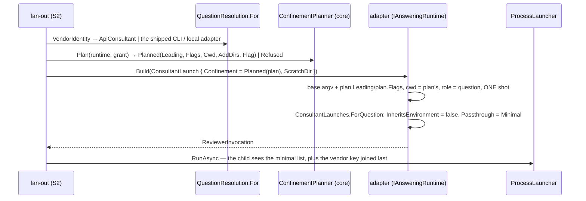
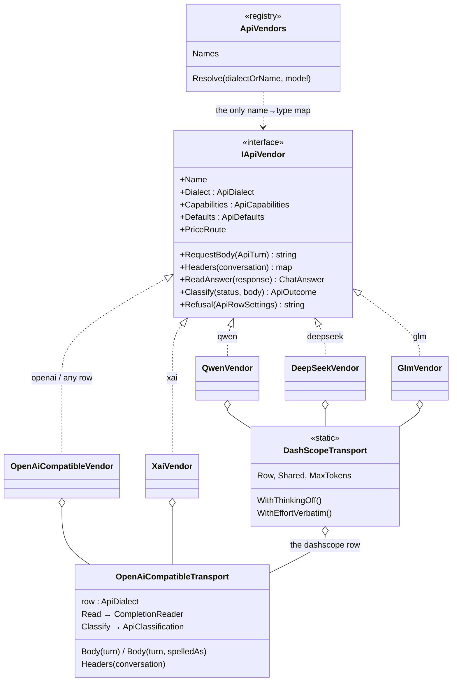
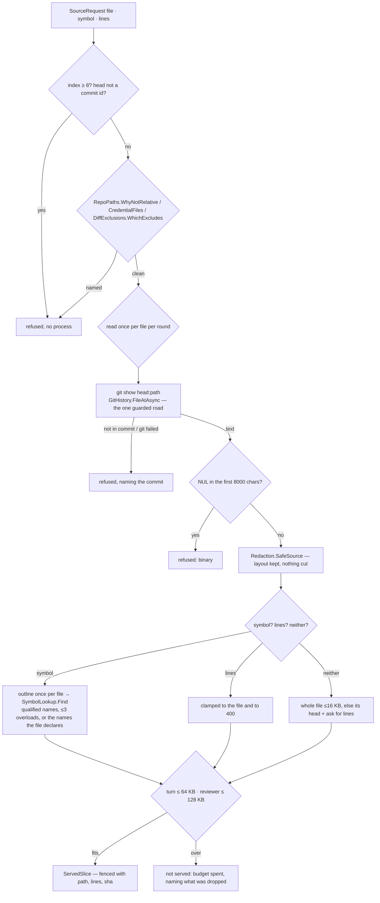

# module: runners — spawn, isolate, survive

> `src_mcp/runners/CoaiMcp.Runners` — the impure ring around [module_core.md](module_core.md):
> processes, worktrees, the scheduler. It carries data to and from the core and adds no rules.

## Purpose

Turn "run six reviewers" into something that survives a moving checkout, a killed session, a hung
CLI and a rate limit — with every failure mode named.

## Flow

```mermaid
sequenceDiagram
  participant S as server (epic 04)
  participant W as WorktreeManager
  participant C as ContextAssembler
  participant B as BoundedScheduler
  participant E as ReviewerExecutor
  participant V as vendor CLI
  S->>W: ResolveShaAsync(branch) → AddAsync(sha) [one lease per ROUND]
  S->>C: CollectAsync(base, sha)
  C->>C: merge-base(base, sha) → the COMMIT this round is a diff of
  alt no common ancestor found
    C->>C: is-shallow-repository? — a truncated clone, or genuinely unrelated
    C->>C: rev-parse the base to a commit — pinned, so three git calls read ONE snapshot
  end
  C-->>S: CollectedDiff(files, comparedAgainst, kind) — numstat, per-file diffs, exclusions
  S->>B: RunAllAsync(work[], executor)
  B->>E: per job, under global(3) + per-provider(2) semaphores
  E->>V: launch (read-only, ephemeral); timeout kills the TREE
  V-->>E: -o file (codex) / stdout envelope (gemini) / NDJSON result (antigravity)
  E-->>B: Ok | NonZeroExit | TimedOut | Unparseable | RateLimited
  B-->>S: outcomes → ReviewerSummaryFactory → "N of M answered"
  S->>W: lease.DisposeAsync() — the finally
```

## Core entities

| Type | File | Role |
|---|---|---|
| `IProcessLauncher` / `ProcessLauncher` | `Processes/ProcessLauncher.cs` | the ONE process seam; one deadline over the write, the read and the wait, and it kills the entire tree; `StdIn` carries every long or multi-line input, BOM-less UTF-8, and a child that exits before reading is not an exception; each stream is kept up to `MaxOutputChars` and says so when it is cut; a request with `InheritsEnvironment = false` starts the child from `ProcessEnvironment.Passthrough` instead of this process's whole environment, the request's own names on top either way |
| `ProcessEnvironment` | `Processes/ProcessEnvironment.cs` | the allowlist a confined launch starts from — an allowlist because what is being kept out is not a known name; compared the platform's way (`Path` is `PATH` on Windows and is not on Linux); `HOME` is on it for a measured reason, below |
| `ExecutableResolver` | `Processes/ExecutableResolver.cs` | npm Windows shims: the PATHEXT resolution `Process.Start` does not do |
| `WorktreeManager`, `WorktreeLease` | `Worktrees/WorktreeManager.cs` | one detached tree per round, `coai-wt-` prefix under OUR storage; prune-on-open; disposal = finally; never touches a human's worktree |
| `SubmodulePopulator` | `Worktrees/SubmodulePopulator.cs` | fills the round tree's submodules from the PARENT checkout, not the remote — git populates none in a linked worktree, and in this family the project's rules ARE one; offline, pinned, never fatal, and refused when the source is reached through a reparse point |
| `GitModules`, `SubmoduleMount` | `Git/GitModules.cs` | `.gitmodules` as (name, path); a file inside the repository under review, so absolute/traversing paths and names that could spell another config key drop the mount |
| `DiffExclusions`, `ContextAssembler`, `CollectedDiff`, `DiffBase` | `Context/ContextAssembler.cs` | numstat → per-file diffs with `:(exclude,glob)` pathspecs; binary sizes via `cat-file -s`; every one of the three taken against the MERGE BASE, which the result names. `DiffExclusions.Excludes(path)` / `WhichExcludes` answer the same glob table for ONE path — the source resolver's question, since it has no git call to hand the pathspecs to. Each glob's matcher carries a 1000 ms match ceiling (SonarCloud S6444), and a match that hits it FAILS CLOSED — the path counts as excluded and is never served, the refusal naming that glob (`WhenMatchTimesOut`, reached by a test through the `FirstExcluding` seam) |
| `SourceResolver` | `Feature/SourceResolver.cs` | source on demand for a feature reviewer (plan §4.9, S3.1): git objects at the round's pinned head and nothing else, one read per file per round, every name check before any process, every byte through `Redaction.SafeSource`, every cap from `SourceBudget` — the section below |
| `CommittedFile.ReadAtAsync` | `Collecting/CommittedFile.cs` | the read without the commit check, for a caller that pinned the commit itself; `ReadAsync` is this after checking |
| `IReviewerRuntime`: `CodexRuntime`, `DeepseekRuntime`, `GeminiRuntime`, `ClaudeRuntime`, `AntigravityRuntime`, `CustomCodexRuntime` | `Reviewers/ReviewerRuntime.cs`, `ClaudeRuntime.cs`, `CustomRuntime.cs` | THE vendor adapter: `Build` (argv, pure) + `ReadAnswer` + `ReadUsage`, the last two with working defaults. Flags verified against codex 0.147.0 / gemini 0.55.1 / claude 2.1.197 / agy 1.1.22; keys ride env, never argv; DeepSeek = Codex config-shifted. **An adapter records on the invocation what it LAUNCHED** — `Model:` always, `Effort:` where it actually passed a reasoning flag (only `LocalRuntime` does) — which four of six adapters silently did not until 2026-09-12, issue #129; `EveryAdapterRecordsWhatItLaunchedTests` drives every adapter's own `Build` rather than a hand-made invocation, because the test it replaces built the value it asserted. `ReviewerSettings.Confined` ("handed everything in its prompt, may reach nothing else") makes `ClaudeRuntime` extend `--disallowedTools` to every tool that reaches past the prompt — flag re-read on claude 2.1.258; codex and antigravity take no new flag, their sandboxes are already the strongest each offers |
| `ReviewerRuntimeSelector` | same | unknown provider refuses naming the catalog |
| `ReviewerOutcome` (closed), `ReviewerExecutor`, `RateLimit`, `ReviewerLaunch` | `Reviewers/ReviewerExecutor.cs` | one launch + one repair **inside ONE deadline** (2026-09-08: the repair used to carry a whole second budget, so a reviewer could take twice its setting — measured at 668.8 s against ten minutes, reporting `ok`); SIX named outcomes incl. NotStarted; `Ok` carries the run's `Usage`, both launches counted when repaired — and a repair whose OWN launch fails carries the malformed first attempt's usage on the failure's `EarlierLaunches` (2026-09-26, the section *A failed repair still counts the malformed attempt*); `LastTurnUsage` and `TotalUsage` on the BASE are the one answer to what a turn and a conversation cost, for the ledger and the round total alike. **`LaunchAsync` is the public half**: launch → classify → the vendor's RAW answer + usage, with the parse left to the caller |
| `Usage`, `UsageParser` | `core/Findings/UsageParser.cs` | schema-less scan over any vendor envelope; MAX per key name then sum per category, so a streamed cumulative total is never summed with itself; money only when the vendor priced the run |
| `BoundedScheduler`, `ReviewerWork`, `ReviewerSummaryFactory` | `Reviewers/BoundedScheduler.cs` | global + per-provider semaphores; a rate limit climbs the ladder below; a launch is the reviewer's whole CONVERSATION (`ReviewerWork.Continue`, S3.2 — the section at the end), one terminal outcome either way |
| `IReviewerContinuation`, `TurnDecision`, `ReviewerContinuation.None`, `TurnUsage` | `Reviewers/ReviewerContinuation.cs` | the seam a stage plugs a conversation into: after each answered turn, the next turn's whole work (launch AND repair) or a stop; `None` is every stage but one |
| `TurnLoop` | `Reviewers/TurnLoop.cs` | the loop inside the held slot: the ladder per turn, each turn under its own deadline and the whole under `timeout × (1 + follow-ups)` — or under `ReviewerWork.ConversationCap` when the stage set a shorter one (the feature stage's whole-review limit for an api reviewer, `COAI_FEATURE_API_REVIEW_MINUTES`, twenty minutes by default, 2026-09-27) — every answered turn's usage on the outcome's base |
| `SourceTurns`, `SourceConversation` | `Feature/SourceConversation.cs` | the feature stage's continuation: serves the requests through the round's one resolver, renders the tail, stops on no request, the cap or the spent budget; immutable across turns |
| `RepairInstruction` | `Reviewers/RepairInstruction.cs` | the repair launch's closing paragraph — one text, appended to whichever prompt the launch it repairs was given |
| `VendorIdentity`, `RuntimeResolution` | `Reviewers/RuntimeResolution.cs` | the ONE answer to "what is this vendor": which runtime it drives, the adapter for it, and how it authenticates — asked by both binaries, after two incidents where a second copy of it was the one that was wrong |
| `VendorHealth`, `VendorProbe` | `Reviewers/VendorProbe.cs` | the `--version` health probe behind `providers` and the Team server's catalog; a retired runtime is answered BEFORE the probe, a local engine instead of it, and a CLI that never answers says so rather than reporting the kill's exit code |
| `RemoteRuntime` | `Reviewers/RemoteRuntime.cs` | the adapter for a vendor whose reviews run on a **Team server**: builds `--ask-remote` against THIS binary (the `LocalRuntime` shim shape), carries no `SharedResource` because the server owns the queue, and holds the cancel-an-abandoned-job half (`Claim` / `ReadClaimAsync` / `CancelAbandonedAsync`) |
| `RemoteAsk`, `RemotePoll`, `RemoteState` | `Reviewers/RemoteAsk.cs` | the PURE half of the shim: the request body, the poll parse, every exit code and every sentence a person will see — so each failure path is tested without a server |
| `TeamServerAuth` | `Reviewers/TeamServerAuth.cs` | one canonical spelling of a server URL, the fingerprint that names its token file, and the owner-only read/write of that file. The same normalised value builds the request URLs, not just the hash |
| `RemoteProbe`, `RemoteCatalog` | `Reviewers/RemoteProbe.cs` | a remote vendor's health over `GET /api/catalog`: the server's own slot counts as the note, 401/403/426/outage told apart, a cache whose FAILURE wait is never shorter than its success wait, and a refusal that says WHICH of a row's two names was tried |
| `UsageLedger`, `UsageEntry`, `UsageKinds`, `LedgerJsonContext` | `Reviewers/UsageLedger.cs` | one JSON line per reviewer run, unindented because the reader is line-based; moved here so the server appends the same shape. Since 2026-09-09 a line also carries its **`kind`** — `review` or `chat` — because "what did the gate cost me" and "what did asking cost me" are two questions one total answers neither of. The field is trailing and defaulted, so every line already on disk stays valid and an absent kind is READ as a review, which is what all of them were. `UsageKinds` holds the two names here rather than only in the server's own `JobKind`, which this library cannot see: the dependency runs server → mcp and not back, and two vocabularies for one field is how a writer and a reader come to disagree. A test in `src_server` asserts the enum spells exactly these |
| `IAnsweringRuntime` | `Consultation/IAnsweringRuntime.cs` | the launch half of the consultant seam — `Vendor`, `Build`, `NeedsAnswerSchema`, `ReadAdvice` — extracted as the base of `IConsultantRuntime` for the question consultant (PLAN_question_consultant.md, S1); the conversation members stay on the derived interface and no shipped adapter changed shape |
| `LaunchConfinement`, `ConsultantLaunch.Confinement` / `.ScratchDir` | `Consultation/LaunchConfinement.cs`, `IConsultantRuntime.cs` | how a launch is confined: `AsShipped` (the default — today's argv byte for byte) or `Planned(Confinement.Planned)` — the planner's fragments, a scratch or root cwd, one shot, the minimal environment |
| `ApiConsultant`, `QuestionMaterial`, `AnsweringMemory`, `AnsweringTurn`, `IAnsweringFollowUps` | `Consultation/ApiConsultant.cs`, `AnsweringTurns.cs` | a hosted API answering a question row: composes `ApiRuntime` the way `LocalConsultant` composes `LocalRuntime`, `none` only, the key under the row's `VaultKeyName` read by the caller; its source turns serve `sourceRequests` from the pinned HEAD and hand back the same launch with a tail (A9) |
| `QuestionResolution` | `Consultation/QuestionResolution.cs` | which answering runtime a question row's vendor gets: `api` → `ApiConsultant`, the rest `ConsultantResolution.For` — `ConsultantResolution.Consulting` is NOT widened |
| `ProcessEnvironment.Minimal`, `ProcessRequest.Passthrough` | `Processes/ProcessEnvironment.cs`, `ProcessLauncher.cs` | the measured minimal list a question child starts from (S2c), chosen per request: the launcher's filter took its allowlist from the request rather than growing a second flag |
| `FeatureOutlineBuilder.BuildAtHeadAsync` | `Feature/FeatureOutlineBuilder.cs` | the outline of what EXISTS at a commit — against the repository's empty tree, no member hunks — what an api question row is shown of the code |
| `RetryLadder` | `Reviewers/RetryLadder.cs` | the waits and when to stop: four steps, jittered, bounded by the reviewer's own deadline; pure, so the jitter is a table rather than a stopwatch |

## The decisions a reader needs

- **Neutral shared instructions are part of the review sample.** `RuleFiles` includes
  `.agents/PROJECT.md`, nested `.agents/rules` and the common/C#/Rust/TypeScript directories
  of `.agents/conventions`. Mount research, tools and its own PROJECT/ENTRY are excluded.
  Project/local sources precede shared bodies under the existing whole-file budget and
  the mount order `Collect` is handed. A declared neutral mount without canonical rule bodies is
  reported in
  `MissingMounts`, even if a `.git` marker exists. Claude/Cursor legacy folders remain supported.
  The rule folders are enumerated once per collection; missing-mount detection reuses that
  list instead of scanning the same folders again. This collector samples review context;
  applicability belongs to the shared Node resolver.

- **The order the mount is read in is a PARAMETER, and its priority is a table rather than the
  alphabet.** `RuleOrder` (`Context/RuleOrder.cs`) is what `Collect` is given. **Nothing in it is left
  to chance any more**: `Random.Shared` left the selection path on 2026-09-15, and the code stage is
  given `ForBranch(branch)` — the tier FIXED, the rest of the mount ordered by a SHA-256 of *(branch,
  rule name)*. Two rounds of one fix therefore show identical rules, which is the defect the plan was
  opened for, while different branches order the rest of the corpus differently. **That second half
  currently reaches almost nothing in this repository** — the base and the tier spend **77 562** of
  the 80 000-byte budget, and the smallest rule outside the tier is 2 213, so the tail takes ONE rule
  and the rest are skipped as oversized.

  **That number is the same on every platform only since 2026-09-18.** Until then `RuleFiles.Read`
  handed the collector whatever the disk held, so a CRLF checkout measured **78 855** — one character
  per line, about a kilobyte across the tier — and nothing fitted in the 1 145 bytes left. A Windows
  machine’s reviewers therefore received SEVEN tier rules where a Linux machine’s received eight, for
  the same commit. The one check that can see it is `TheRotatedTail`, and every job in `ci.yml` runs
  on `ubuntu-latest`: the Windows legs live only in the release matrix, so it ran on a tag and nowhere
  else, and the release of `mcp-v0.29.0` is where it surfaced. `Read` normalises to `\n` now — for the
  measurement AND for what is sent, since the text goes into a prompt where a carriage return is noise
  somebody pays for. `ACrlfCheckout_ReachesTheSameRulesAsAnLfOne` is the guard, and it runs everywhere
  because it writes both corpora itself rather than depending on the checkout it finds.

  The rotation is correct and all but inert; rule
  modularization or the resolver is what would give it room, and
  `StageRulesTests.TheRotatedTail_CurrentlyFitsAtMostOneRule` fails the day that changes.
  `string.GetHashCode` is unusable here: .NET randomises it per process,
  so it would differ between two rounds on one machine. Measured basis:
  [RESULTS_rules_selection_budget.md](RESULTS_rules_selection_budget.md).
  **The tier is public, as a table and as a predicate**: `RuleOrder.TierRules` and
  `RuleOrder.IsTier(withinMount)`. Anything that must tell tier from tail asks the predicate rather
  than keeping its own list — a code round found the canary classifying against a tier assembled by
  hand from `StageRules.Plan`, which is a DIFFERENT stage's tier, so a reachable tail rule was read
  as tier and never counted. `Walk` is `ForBranch("")` — the language doctrines, then
  `security.md`, `testing.md`, `reuse-first.md`, `coding-style.md`, `knowledge-base.md`, then ordinal
  path. The corpus is larger than the budget and selection is whole-file, so whatever sorts first is
  what a reviewer is judged against: plain alphabetical order let `development-workflow.md` (14 KB)
  and `http-contracts.md` (11 KB) take a quarter of the budget and pushed `testing.md` out entirely,
  which is the starvation the draw was installed against. An unmatched name falls through to ordinal
  order rather than being dropped. The instruction files and the repository's own rules are outside the
  order — they lead and are never dropped, though they are NOT free: they are collected under the same
  budget, so a large one leaves less for the mount.
  Plan: [PLAN_the_rules_a_round_shows_are_drawn_at_random.md](PLAN_the_rules_a_round_shows_are_drawn_at_random.md).

- **A tier entry names ONE rule, by its mount-relative path.** `RuleCandidate` carries both the
  repository-relative path and the path within the mount, and the prefix is stripped in `RuleFiles`,
  where the mounts are known. Suffix matching was tried first and is wrong: a
  `.agents/conventions/common/legacy/common/security.md` also ends with `/common/security.md`, so one
  entry would pull in a file nobody meant and spend the budget of the rule it was impersonating —
  caught by a red test rather than in production.

- **Tier coverage counts what a reviewer was SHOWN, not what the tree contains.** Each `RuleFile`
  carries its mount-relative name (`common/security.md`), set where the mounts are known, and
  `RuleBundle.MatchedCount` / `TierCoverage` count and phrase the tier against `Files` — the rendered
  ones. A rule discovered and then dropped by the byte budget, or found and unreadable, is a rule
  nobody saw; counting it would let a prompt claim "all seven are below" over a section showing two,
  and a reviewer's silence about the other five would read as compliance. A code round caught exactly
  that, and `ATierRuleTheBudgetDropped_IsNotCountedAsShown` reproduces it — 7 reported against 2 shown.
  The wording lives beside `Render()` because both are prompt text.

- **The tiers a gate with NO diff is judged against, wired into both stages.**
  `StageRules.Plan` and `StageRules.Document` (`Context/StageRules.cs`) are ordered lists, and
  `RuleOrder.Staged(tier)` is the one order that FILTERS — a plan or document round has no change to
  select from, so the mount's other rules are not lower priority, they are not what the stage is judged
  against. The CODE stage is untouched: it still collects every rule in `RuleOrder`'s default order, and
  `Drawn()` remains that default until epic 3. When a tier matches nothing the mount contributes
  nothing, deliberately and without a fallback — falling back to `Walk` would hand a plan reviewer the
  code rules the tier exists to exclude — and the reviewer still sees this repository's own rules,
  which are outside every order. Every entry is checked against the corpus this repository PINS by
  `StageRulesTests.EveryTierEntry_ResolvesInThePinnedConventionsMount`, which reads the real mount:
  a fixture that writes every name it then asserts proves only that the fixture and the table agree.

- **One worktree per round, by SHA** — six read-only reviewers share one tree; six checkouts of a
  moving branch would be six different inputs to one comparison.
- **A worktree's submodules come from the parent checkout, never from their remote.** `git worktree
  add` populates none (and has no `--recurse-submodules` in git 2.55), so the project's rules were
  simply absent from every round in a repository that keeps them in one. The parent's object store
  already holds every commit the reviewed SHA pins, so cloning from it is offline and faster —
  measured 1.49 s against 2.45 s — and the source is refused unless it resolves inside the parent
  with no reparse point on the way, because `protocol.file.allow` is lifted for that call.
- **Populating is never fatal, and never silent.** A parent that never initialised the submodule
  leaves the mount empty and the round runs; `RuleBundle.MissingMounts` is what tells the reviewer,
  in the prompt, that rules it was not shown exist. Failing the round instead would turn an
  infrastructure hiccup into an outage — a code-round finding that was rejected on exactly that
  ground, with the visibility half accepted.
- **The launch and the parse are two things, and the seam between them is public.**
  `LaunchAsync` answers what the PROCESS said — the terminal outcome when there is one, otherwise the
  vendor's raw answer, its usage, and the transcript as evidence when the envelope came back empty.
  `RunOnceAsync` is that plus `ParseAnswer`, which is pure and takes exactly what it reads: the text
  and the provider that stamps each finding's origin. The seam exists because a second binary needs
  the first half without the second — the planned Team server runs the same CLIs through the same
  adapters and hands the raw answer back over HTTP, while parsing, the repair launch and
  de-duplication stay with the client that asked. A copy of this classification over there is how the
  vendor-set drift in this repository happened twice.
  **`Terminal == null` means the process ran and exited zero — never that there is an answer**: an
  adapter whose output file never appeared says so with a null answer, and what that means is the
  caller's judgement. An EMPTY answer takes the same path as a missing one, so an envelope that came
  back blank still leaves its transcript as evidence.
- **"What is this vendor" is answered once, in the library.** `RuntimeResolution.NameOf` / `.For` /
  `.AuthOf` take a `VendorIdentity` — three strings, because three is what the answers read — and
  every caller asks them rather than repeating the arms. The order inside is the load-bearing part:
  `local` before the base-URL arm (a local vendor IS a vendor with a base url), an explicit runtime
  before the id (`my-claude` is a claude, not a codex). Both of those orders are fixes for defects
  that shipped, and the reason this lives here rather than in one binary is the third: the question
  had two copies twice, and the copy that was missed was the one that was wrong — a local reviewer
  silently became a codex one, and then was dropped from every round while the panel showed it as
  configured.
- **Provider cap beside the global cap** — a rate limit is per vendor; a global cap alone puts all
  its slots on one provider.
- **A rate limit gets a LADDER, not one retry** — 5 s, 30 s, 60 s, 120 s (`COAI_RETRY_BACKOFF`),
  each spread by up to a fifth either way. One interval was the wrong single number for the two
  things it had to serve: a plain `429`/`503 high demand` clears in seconds, while a usage window
  does not clear inside a round at all. The jitter is not decoration — a code round launches nine
  reviewers at once, so nine meet the limit in the same instant and a fixed interval would send them
  all back into it in the same instant too.
  Three things end the climb: the ladder is spent, the limit is **hopeless** (a daily allowance —
  still not retried at all, ladder or no ladder), or the next wait would outrun the reviewer's own
  deadline. That last budget counts WALL CLOCK from the first launch, not the sum of the waits: the
  failed launches are most of the time spent, and 5 s + 30 s of waiting fits a 60-second deadline
  that the two attempts producing them have already blown.
  **`COAI_RATE_LIMIT_BACKOFF_SECONDS` still means what it meant** — set alone, it is a one-step
  ladder at that number. A deployment that deliberately chose 45 seconds must not silently become
  four retries, and nothing would have said so; an unreadable `COAI_RETRY_BACKOFF` falls back and is
  reported through `PanelSettings.Unrecognised` rather than half-applied.
  The round's summary carries the attempts it actually took (`RateLimited.Attempts`), because
  "after one retry" was a true sentence with one step and a confident wrong number with four.
  **A retry gets what is LEFT of the deadline**, never the whole of it again: a first launch that
  spends nine minutes of a ten-minute budget and comes back rate limited would otherwise be followed
  by a second carrying ten more, and a reviewer would run for nineteen minutes against a deadline of
  ten. And the wait is **said out loud** — the ladder can hold a reviewer for over three minutes,
  where "running" reads exactly like a model that is thinking, so each wait reports the attempt and
  how long it will be. Both found by codex reviewing this very change.
- **Antigravity (`agy`) is the closest fit to this product's contract**: `--json-schema` puts the
  finding schema straight into `result.response`, the same envelope carries `usage`, and the model
  ids carry their own reasoning effort. Its prompt rides `--input-format stream-json` on stdin as
  one NDJSON line (`{"event":"user","message":{"role":"user","content":"..."}}`) because `--print`
  takes its prompt as a flag VALUE and a review prompt is ~33 KB — past the Windows command line.
  It exists because Google retired Gemini Code Assist for individuals mid-2026-08-31: the Gemini
  CLI now fails in `_doSetupUser` with "migrate to the Antigravity suite", before any model is
  reached, which was mistaken in turn for a quota, a timeout and an untrusted folder.

- **Codex reads from `-o`, Gemini from stdout, Claude from its JSON envelope's `result`** — each
  through its OWN adapter, because where an answer lands is vendor knowledge; exit-0-with-no-output
  is `Unparseable`, never `Ok`.
- **Adding a vendor is one class, not an edit to the executor** — `IReviewerRuntime` carries launch,
  answer and usage; the executor asks the adapter and knows no vendor's name.
- **Tokens come from the vendor, money only when the vendor prices it** — claude reports
  `total_cost_usd`, codex, gemini and antigravity report tokens alone. A price table of our own would be wrong
  within a month, and a wrong number is worse than an absent one, so `costUsd` stays null and the
  UI says "no cost reported" rather than "$0.00".
- **Subset counts are never added** — codex's `cached_input_tokens` and `reasoning_output_tokens`
  are inside the totals beside them (measured: 14149 in / 9984 cached for one call), while claude's
  `cache_creation_input_tokens` and `cache_read_input_tokens` are additional and billed.
- **The fake CLI** (`src_mcp/tests_fakecli`) is the whole vendor surface in tests: emit / emit-to /
  stderr-exit / sleep / busy (start/end ticks for overlap measurement) / flip (first-launch
  failure), with launch counting. CI never touches a vendor.

## What a code round is a diff OF (2026-09-10)

The merge base of the branch and the base ref — not the tip of the base ref. `ContextAssembler`
resolves it once with `git merge-base` and uses it for all three git calls, and `CollectedDiff` carries
it out so the round can say which commit it compared against.

**Why, measured.** On 2026-09-08 a code round produced three Blocking findings from two different
vendors saying the branch had deleted `chatPrompt.ts`, `processLauncher.ts` and `sessionKey.ts` and
reverted the extension a version. None of it was true: the branch had been cut from `origin/main`, and
while the work was in progress another session merged its own pull request. `A..B` diffs two
ENDPOINTS, so the commits the base has and the branch does not arrive INVERTED — as deletions the
branch performed. On that branch at that moment, `origin/main..HEAD` was 17 files and 1616 deletions
where `origin/main...HEAD` was 9 files and 12. It happened three times before it was fixed, and it
gets likelier the busier the repository is: several agents work here at once, so a base that moves
during a review is the normal case rather than the exception. A reviewer cannot tell a phantom
deletion from a real one — the diff says the line was removed — and whether the change matches its
SCOPE is the one question this gate exists to ask.

**Why an explicit merge base rather than `A...B`.** The three-dot form is the same diff, but it leaves
the resolved commit inside git where nothing can name it, and there is no three-dot form of
`cat-file -s`, which is how a BINARY's old side is sized — that third call site would have gone on
reading a blob from somebody else's commit. One resolution answers all three and gives the round its
audit line.

**What happens when there is no merge base.** The two-dot form, as before, and a sentence saying so:
a review taken against the wrong base is worth more than no review, provided nobody has to guess which
one they are reading. Two cases, deliberately told apart — histories that genuinely share no ancestor,
and a checkout that is SHALLOW, where an ancestor exists but has not been fetched. The second is a
clone somebody can deepen; the first is a fact about the commits. `git merge-base` cannot distinguish
them, so `rev-parse --is-shallow-repository` is asked on the failing path only.

**The resolved commit is named to the reviewer too**, in the diff's own header. Two reviewers of the
plan asked for it independently and the reason is theirs: a reviewer that checks the branch against
the tip of `main` sees a diff that does not match, and that discrepancy is indistinguishable from the
phantom deletions this change exists to stop.

### And it is a diff of files git NAMED, not of a column that looks like a name (2026-09-10)

The same section, one layer down, and the same class of defect: a diff that reaches the reviewer
looking complete and is not. Found by the product audit of 2026-09-09 (finding 4).

`git diff --numstat`'s third column is not a path. Two shapes it takes are sentences ABOUT paths:

| the change | what the human-readable column says |
|---|---|
| `src/old.cs` renamed to `src/new.cs` | `src/{old.cs => new.cs}` |
| any name with a byte outside ASCII, a quote, a backslash, a tab or a newline | `"src/\321\204\320\260\320\271\320\273.cs"`, quotes included, under the default `core.quotePath` |

Handed back to git as a pathspec neither matches anything, so the per-file diff came back empty and
the file reached the reviewer **named, with nothing under it, and no error anywhere**. In Fast mode
there is nothing else to read: the reviewer then judged a change it could not see. Measured on a
fixture repository — three changed files, and the collected paths were `src/dead.cs`,
`src/{old.cs => new.cs}` and `"src/\321\204\320\260\320\271\320\273.cs"`.

A refactor renames files, so this is the ordinary case rather than the exotic one, and it is the same
failure as the merge-base bug above wearing different clothes: the reviewer's confidence is unchanged
and its input is wrong.

**`-z` fixes both at once rather than one at a time**, which is why there is no unescaper here — an
unescaper would be a second parser to get wrong. Fields are NUL-separated, paths are never quoted, and
a rename carries its two names as two further fields instead of being joined into a sentence:

```
2\t1\tsrc/file.cs\0                       an ordinary change
-\t-\tsrc/logo.png\0                      a binary one, counts absent
1\t0\t\0src/old.cs\0src/new.cs\0          a RENAME: the path column is EMPTY, two fields follow
```

`NumstatReader` is that parser, pure and separate from `ContextAssembler`, so every shape is tested
without a repository — including a path with a newline in it, which is legal on Linux and cannot be
created on Windows at all. Its fixtures are copied from real `git diff --numstat -z` output rather
than written from the manual.

**A renamed file is diffed with BOTH names** (`git diff base..sha -- old new`). One name alone makes
git print a whole-file add or a whole-file delete; the pair makes it print the similarity, the rename
header and the edit underneath, which is the only form in which a refactor's change is readable.

Two things the plan got wrong and the work corrected. `BlobSize` needed no separate fix — it already
tries the new side first, and `{sha}:{newPath}` resolves once the path is a real one. And `FileDiff`
gained no `RenamedFrom` field: nothing downstream needs it, because the diff text carries the rename
header itself, and a field on a core record used in a dozen places is not worth adding for nothing.

## Two delivery rules the first real run wrote

Both cost a whole run each; see [RESULTS_first_real_run.md](RESULTS_first_real_run.md).

- **No argument may ever contain a newline.** On Windows the vendor CLIs are npm `.cmd` shims, so
  cmd.exe parses our argv and truncates an argument at its first newline — silently, so the model
  answers as if it had been handed nothing. The prompt therefore travels on **stdin**: `codex … -`
  (its documented "instructions from stdin"), and a one-line `-p` pointer for gemini, which appends
  `-p` to stdin. A test asserts the rule for all three runtimes.
- **A bare command name is not startable.** `Process.Start` does not read `PATHEXT`, so it finds
  npm's extensionless shell script and fails. `ExecutableResolver` tries the executable extensions
  first and the bare name last, and never rewrites an explicit path.

## A consultation is a conversation, so it is a second adapter family (2026-09-12)

`IReviewerRuntime` describes ONE review: a findings schema, a role, an answer read once. A
consultation is a conversation with the same CLIs — different argv per TURN, a handle carried between
turns, prose instead of findings. `IConsultantRuntime` (`runners/Consultation/`) is that seam, the C#
twin of the extension's `ChatAdapter`.

**Composed from a reviewer adapter, not replacing it.** `CodexConsultant` holds a `CodexRuntime` and
hands it to the launch as `ReviewerInvocation.Adapter`, so the answer envelope and the token
arithmetic keep their single copy — `module_runners`' own rule about a second copy being a silent
factor of two. Only the argv is the consultant's own, and the launch then goes through
`ReviewerExecutor.LaunchAsync` **unchanged**: since roles became strings, `Role = "consult"` is legal,
`TrackAs` becomes `codex/consult`, and the outcome classification, the evidence and the usage reading
come for free.

**Deliberately NOT through `BoundedScheduler`.** Its caps bound a ROUND; queueing a consultation
behind nine reviewers would stall it at the one moment the agent is stuck. The cost, stated: a consult
during a round is one more process on the machine, bounded by the per-session call cap.

**Two flags differ from the review argv, both measured on 2026-09-12** (`research/PLAN_consultant.md`,
phase 0b):

| | review | consult | why |
|---|---|---|---|
| `--ephemeral` | yes | **no** | with it the thread cannot be resumed — `thread/resume failed: no rollout found`, in 0.7 s. The price is real and is said out loud: a consultation LEAVES a codex thread, holding this repository's uncommitted diff, in the person's own codex store. We cannot delete it. |
| `--output-schema` | yes | no | a consultant answers prose. All three CLIs do so with no schema flag at all. |

A RESUMED codex turn is a third shape again: `exec resume <id>` accepts neither `-s` nor `-C`, so the
sandbox rides `-c sandbox_mode="read-only"` and the process must run in the directory the thread was
started in — which is the repository, for every turn.

**`Build` is pure on three routes and not on the fourth, and that is worth saying plainly.** The three
CLI consultants take their prompt on stdin, so `Build` describes a process and touches no disk. The
LOCAL one's shim reads a prompt FILE — the way a prompt reaches a shim without crossing a Windows
argv — and `LocalRuntime.Build` has written that file since the review path shipped. The consultant
reuses that builder rather than forking it, so the write is inherited rather than introduced. Story
2's second code round caught the claim that every route was pure, and it was right: the test meant to
hold it had been watching a different directory. The trigger to move the write to the execution
boundary is the first caller that wants to BUILD a local launch without running it — a dry run, a
preview, a flag inspection — and there is none today.

**What the composition costs, and what would end it.** A consultant adapter returns a
`ReviewerInvocation`, so it must HOLD a reviewer adapter to delegate its answer and usage reading to.
Every vendor this product can consult has one — codex, claude, antigravity and the local engine are
reviewers first — so the constraint costs nothing today, and what it prevents is four copies of a
token arithmetic that is wrong by a factor of two the moment they drift. It becomes wrong the day a
CONSULT-ONLY vendor appears, with no findings schema and no reason to be a reviewer: that is the
trigger to split a `ConsultantInvocation` out of the seam, and it is a change to one interface rather
than to the adapters. Named by the gate's architecture reviewer on story 1 and deliberately not built
ahead of the vendor that needs it.

**`ReviewerLaunch` now carries its `ProcessResult`.** A reviewer's answer is the whole story; a
consultation's is not. The vendor's conversation id has to be read off the stream even when the launch
ended in a TIMEOUT or a kill, because the vendor may have accepted the turn before the kill and that
handle is what stops the caller paying for it twice. Trailing and defaulted, so no existing caller
changes.

## A question row is launched through a plan, one shot, from a directory of its own (2026-10-01, PLAN_question_consultant.md S1)

The question consultant (the plan's §4) launches the same adapters a consultation does, confined
differently: by a plan the core's `ConfinementPlanner` made for the row's runtime × grant
([module_core.md](module_core.md), *The question consultant's confinement*), never by the stuck
consultant's deny lists (F5: on this machine those are offered the user environment's whole tool set
and leaked the canary 6 of 6 through PowerShell). S1 is everything below the fan-out; the fan-out, the
record and the tool are S2.



| runtime | `none` | `disk` | `web` |
|---|---|---|---|
| claude | `-p --output-format json --permission-mode plan --tools "" --strict-mcp-config [--model]`, scratch cwd | `… --permission-mode plan --restricted --tools Read,Glob,Grep --add-dir <root>… --strict-mcp-config`, cwd = root 0 | `… --permission-mode plan --tools WebSearch,WebFetch --strict-mcp-config`, scratch cwd, no `--add-dir` |
| codex | `exec -s read-only --ephemeral --skip-git-repo-check --color never --json -o <answers/…-question-…> [-m] [-c mcp_servers.x.enabled=false] -`, scratch cwd — flagged unconfined | `exec -s read-only --ephemeral -C <root 0> …`, cwd = root 0 — flagged unconfined | `--search exec -s read-only --ephemeral …`, scratch cwd — flagged unconfined |
| agy | `--print= --input-format stream-json --output-format stream-json --mode plan [--model]`, scratch cwd — flagged default-deny | `… --mode plan --add-dir <root>…`, cwd = root 0 — flagged default-deny | refused by the matrix |
| local | the `--ask-local` shim from the scratch directory, bound to the schema file the launch names | refused | refused |
| api | the `--ask-api` shim from the scratch directory, bound to `question-answer-schema.json` | refused | refused (unmeasured) |

- **The default is byte for byte what shipped.** `ConsultantLaunch.Confinement` is
  `LaunchConfinement.AsShipped` unless set, and `ConfinementPlannerTests.TheShippedConsultants_StillBuildTodaysArgv_ByteForByte`
  pins the three CLI consultants' argv as whole lists, the checkout as their cwd and `consult` as their
  role. A closed union rather than the plan's "defaulted `CapabilityGrant`": a grant whose default meant
  "not a capability — the adapter's own argv" would have made `none` mean two things.
- **One shot, somewhere else.** A planned launch with a handle is a contract violation (`MustBeLaunchable`),
  and a plan standing in `Scratch` without a `ScratchDir` is one too — the fallback would have been the
  checkout, the very directory a none row must not see. Codex's `--ephemeral` is the plan's for the same
  reason the stuck consultant drops it: nothing ever resumes a question. Every planned launch is filed
  under the role `question` (`ConsultantRoles.Question`), so its ledger kind, its track label and its
  artefact name (`codex-question-<guid>.txt`, recognised by `ConsultantArtefacts.Ours`) say what it was.
- **The minimal environment is one road.** `ConsultantLaunches.ForQuestion` is the only place a question
  request is made non-inheriting, with `ProcessRequest.Passthrough = ProcessEnvironment.Minimal`; the
  launcher's filter now takes its allowlist from the request (widened, not copied — the Team server's
  launches keep `ProcessEnvironment.Passthrough` by default). The Windows list is the benchmark's S2c
  list verbatim (every CLI started and answered on it on 2026-10-01); the Unix list is NOT the benchmark's
  — it had no Linux subject — and is the launcher's own measured requirement (`HOME`, or every Node CLI
  fails in initialisation) plus the locale and temporary-directory names and `DOTNET_ROOT` (macOS CI: a
  framework-dependent child whose runtime is outside the default place cannot start without it; Windows
  finds the runtime through the registry). `ChildEnvironmentTests` observes
  it on a real child (`FakeCli env-names`): a `COAI_*` canary and a `*_SECRET_TOKEN_*` canary in the parent
  are absent, and nothing outside the list arrives; and asserts every planned adapter launch asks for it
  while every AsShipped one still inherits.
- **The api row answers from an outline and asks for source (A9).** `FeatureOutlineBuilder.BuildAtHeadAsync`
  outlines what EXISTS at a commit against the repository's own empty tree (`git hash-object -t tree`
  over no bytes, so SHA-256 repositories get theirs) — decomposed out of `BuildAsync` rather than copied,
  and WITHOUT the member hunks: the feature pack attaches an added file's whole members as hunks, and
  against the empty tree every file is added, so the pack's road would have handed a hosted model the
  bodies of everything under a heading that says "signatures, no bodies" (found by the first test of the
  row). `ApiConsultant.AfterAsync` then serves `sourceRequests` through the round's `SourceResolver` — the
  committed HEAD, redacted, capped, never the working tree (the stated limit: uncommitted work reaches an
  api row only through the context) — and hands back the same planned launch with the base prompt plus a
  `QuestionTail` (D25). The loop, the deadline and the record are the fan-out's (S2); the seam is
  `IAnsweringFollowUps`. It is not `SourceConversation`/`TurnLoop`, which are findings-shaped (the parser
  requires `findings`); what IS shared is the request validation and every rendering of a served slice.
- **Resolution does not widen the stuck consultant.** `QuestionResolution.Answering` is `Consulting` plus
  `api`; `ConsultantResolution.Consulting` is unchanged and still refuses an api row by name
  (`ApiConsultantTests`). The OpenRouter row (`x-ai/grok-4.7`, key name `openrouter`, A11) resolves to an
  `ApiConsultant` whose `VaultKeyName` is `openrouter` — the caller reads the vault; this library never does.

## The launcher's two ceilings, and why the write is a task (2026-09-10)

Found by the product audit of 2026-09-09 (finding 3), and both halves are the same mistake in two
places: a bound applied one step after the thing it was meant to bound.

**One deadline, over the whole operation.** `RunToCompletionAsync` used to write the prompt to the
child's stdin and only THEN create its timeout. A pipe holds about 4 KiB on Windows and 64 KiB on
Linux, and a shaped diff is up to 192 KiB, so every reviewer launch writes past the buffer and blocks
until the child reads. A child that never reads — a sign-in prompt, a TTY check, a CLI that died
before its first read — therefore held the launch for as long as it lived, with the clock not started
and the caller's token unconsulted. On the Team server that is an account's lock held past the job's
own budget by a review the sweep cannot end, because the runner is inside the launcher.

Measured, with a ten-second child, a 300 ms budget and a 1 MiB prompt: **10 s 070 ms, `TimedOut =
false`** — the write blocked until the child exited on its own, and by the time the clock existed
there was nothing left to time out. The same test returns in well under a second now.

The linked, timed token is created before a byte is written, and the three concurrent halves —
writing, reading, waiting — are all ended by it. The tree kill is what actually frees a blocked
write: it closes the child's end of the pipe, so a write that ignored its token (an anonymous pipe on
Windows does) fails at once with the `IOException` this launcher has always read as the child's
decision. `WriteStdInAsync` closes stdin in a `finally`, because a child waiting for EOF is waiting
for exactly that, and a deadline that skipped the close would hang the NEXT launch instead of this one.

**A ceiling on output, enforced while the stream is read.** `BeginOutputReadLine` delivers a LINE, so
a child writing two hundred megabytes without a newline had already been buffered by the framework
before any callback could count it — a ceiling checked per line fires after the allocation it exists
to prevent. The reader is a character drain into `BoundedText` now, capped by
`ProcessRequest.MaxOutputChars` (8 Mi characters — 16 MiB, since a .NET char is two bytes). Past the
cap the stream is still READ and no longer kept, so a runaway cannot block on a pipe nobody drains,
and the kept text ends with `[coai: output truncated after N characters]`: a silently cut answer is
one a parser fails on for a reason nobody can find.

Two things came free with the raw reader, and one of them is a defect nobody had reported. The line
reader `AppendLine`d every line, so **every vendor answer this product has ever read came back with a
line ending the vendor did not write** — invisible to JSON parsing, which is why it survived. And the
drain has a grace (`ProcessRequest.DrainGrace`, five seconds) after the child is gone: a pipe stays
open while any process holds its write end, a grandchild inherits both, and a handle that outlived the
tree kill would hang the launcher rather than the process it belongs to.

### What the code round added

Twelve reviewers of twelve answered; thirty-five findings, and these are the ones that changed the code.

- **The grace CANCELS the drain rather than walking away from it.** Abandoning a suspended read leaves
  a task that faults against the disposed process later, and one that can still be appending to text
  the caller is already reading. It is a token now, caught inside `DrainAsync`, and the stream says
  which of the two things cut it — the ceiling, or a handle nobody could close.
- **Our end of stdin is closed on the cancellation path, before the kill.** A write blocked on a full
  pipe does not honour its token on every platform, and a descendant that survives the tree kill still
  holding the read end would leave that write blocked for ever, with the launcher awaiting it. And the
  close has to be of the HANDLE: `StreamWriter.Close()` refuses outright while an async write is in
  flight (`InvalidOperationException: The stream is currently in use`), which is the only state it is
  ever called in — measured on the first run of the test that asked for it.
- **`ProcessResult` gained `Cancelled` and `Truncated`.** A budget that ran out and a caller that
  withdrew arrive as the same `OperationCanceledException` and mean opposite things: one is a vendor
  too slow for its budget and belongs in the retry ladder, the other is a job nobody is waiting for and
  must never be retried. The token's STATE decides, never the exception's type. `Truncated` lets a
  caller tell a cut answer from a bad one without parsing an English sentence.
- **The truncation sentence carries the count.** "Cut at 8 Mi characters" says nothing about whether
  one character was lost or two hundred megabytes; it is composed when the stream ends, which is the
  first moment that number exists.
- **A ceiling of zero is refused rather than obeyed.** `0` and `-1` are both ordinary spellings of
  "unlimited" elsewhere, and either would have made every launch answer with an empty stream — which
  reads exactly like a vendor that said nothing.

Three findings were rejected with reasons, and one is worth recording because it was confidently wrong
in a way a reader might repeat: a Blocking finding said the immutability rule forbids `BoundedText`
mutating its own builder. That rule governs data containers crossing layers; applied to a private
single-owner accumulator it would mean copying up to 16 MiB per 8 KiB chunk.

The whole `src_mcp` suite — 1148 tests — passed unedited across this change.

## The launcher's two environments, and why `HOME` is in the short one (2026-09-10)

Finding 1 of the product audit of 2026-09-09, and the half of it that costs nothing to close
([PLAN_a_reviewer_on_the_team_server_is_confined_to_its_prompt.md](PLAN_a_reviewer_on_the_team_server_is_confined_to_its_prompt.md)).
A job on the Team server is one authorised employee's arbitrary prompt, run through a third-party
agentic CLI on a box that holds every shared vendor account, as root. The job needs nothing but that
prompt — the diff was shaped on the client and is inside the prompt text, and the working directory
is an empty temporary one — yet the launch ADDED the request's variables to the server's own
inherited environment, so whatever `/etc/coai-server.env` held was in every reviewer's process, and
for claude the reviewer kept `Read`, `Glob`, `Grep` and `Bash`, which reach the other slots' sign-ins
on the same disk. The finding text goes back to the employee who wrote the prompt, verbatim.

**`ProcessRequest.InheritsEnvironment`, default `true`.** The launcher is the one process seam both
binaries share, and its default did not move: the local `coai-mcp` runs the developer's own CLIs in
the developer's own environment — sign-ins, proxies, PATH — and that is correct there. When a caller
sets it `false`, `ProcessLauncher` clears the environment .NET pre-filled from this process and copies
back only the names in `ProcessEnvironment.Passthrough`; the request's own `Environment` is applied on
top, last, exactly as before, so a caller that hands over `HOME` or a token on the request gets it in
the child whichever mode it chose. It is an allowlist rather than a list of names to strip because the
thing being kept out is not a known name — it is whatever the server's configuration file holds this
month.

The list, and why each name is on it: `PATH` (the CLI is found through it and starts its own children
through it); `LANG`, `LC_ALL`, `LC_CTYPE`, `TERM`, `TZ`, `NO_COLOR` (encoding and colour); `TMPDIR`,
`TMP`, `TEMP`; the six proxy spellings, `SSL_CERT_FILE`, `SSL_CERT_DIR`, `NODE_EXTRA_CA_CERTS` (a box
behind a corporate proxy reaches its vendor through them, and a reviewer that cannot reach its vendor
is a review that never happens); `XDG_RUNTIME_DIR`. On Windows also `SystemRoot`, `SystemDrive`,
`windir`, `ComSpec`, `PATHEXT` (every vendor CLI is an npm `.cmd` shim there), the profile and program
directories, `NUMBER_OF_PROCESSORS` and `PROCESSOR_ARCHITECTURE`. Names are compared the way the
platform compares them — case-insensitive on Windows, where `Path` and `PATH` are one variable, and
case-sensitive everywhere else, where a `path` must not pass for the one the CLI is found through.

**Why `HOME` is in it.** It was not, in the first draft: the list carried the Windows profile names
and none of the Unix ones, and the gate's plan round returned that as Blocking (gemini — the best
finding of the round). Every vendor CLI here is a Node program, and a Node runtime with no `HOME`
fails in initialisation, before it reads a prompt, so a confined launch on Linux would have started
every reviewer into an immediate failure. On the Team server it would have been masked, because
`SlotEnvironment.For` sets `HOME` per slot on the request and the request's variables are applied
last — which is exactly why it deserved to be caught in a plan rather than in a deployment: the
masking is a property of one caller, and the launcher's contract is for all of them. `HOME`, `USER`,
`LOGNAME` and `SHELL` are on the list for every non-Windows platform.

**`ReviewerSettings.Confined`, default `false`** — "this reviewer was handed everything in its prompt
and may reach nothing else". `ClaudeRuntime.Build` reads it and extends the `--disallowedTools` it
already sends (`Edit`, `Write`, `NotebookEdit`) with `Bash`, `Read`, `Glob`, `Grep`, `WebFetch`,
`WebSearch`, `Task` and `Agent`. The flag was read off the installed CLI's `--help` before the names
were written — `--disallowedTools, --disallowed-tools <tools...>`, on claude 2.1.34 when this story
was briefed and on 2.1.258 where it was implemented, the same line — and both sub-agent names are
listed because the tool has carried both, and an unknown name in that list is inert. This is what is
SENT: whether `claude -p --permission-mode plan` would execute `Bash` in a non-interactive run at all
was not measured, and the denial costs nothing either way. The box runs the CLI it has installed, not
this one, so whether that binary accepts this argv is observable only there; the plan's deviation
section hands that check to `POST_DEPLOY.md`. Codex and antigravity take no new flag: `-s read-only`
and `--mode plan` are already the strongest sandboxes those CLIs offer, and what they leave open —
reads — is the operating system's to bound (`PLAN_team_server_unprivileged.md`).

**What is observed, and by what.** `ProcessLauncherTests` launches the REAL `FakeCli` with its
`env-names` verb, which prints every variable name the child was actually started with — a dictionary
asserted in-process would have been a test of the dictionary. A canary set in the test process is
absent from a confined child while `PATH`, the handed-over variable and (off Windows) `HOME` are
present; the positive companion shows an unconfined child still inheriting the canary, because a
launcher that passed nothing at all would pass the negative test. `ClaudeRuntimeTests` asserts the
argv both ways — the confined list, and that an unconfined reviewer's list is still exactly the three
write tools, since the local code round reads its worktree. Watched fail first: the confined child
printed the canary, and the confined adapter sent only the three write names. The class joined the
`fakecli-env` collection in the same change: the fake reads its verb only while `FAKECLI_MODE` is
unset, and a test whose whole evidence is the child's output prints nothing when it loses that race.

**Who asks for it.** The Team server, for every job, since story 2.2 landed on 2026-09-11 — and it
asks through ONE value rather than by setting two fields: `CoaiServer.Confinement` has a single
`Confined` and two `Apply` views, one producing the settings the adapter reads and one the request
this launcher reads. The two flags live on types that never meet (the adapter composes argv before a
request exists; the launcher reads the request after), so nothing made them agree, and a server edit
that set one and missed the other would have produced an isolated environment with a shell, or the
reverse. Both look like a confined launch from every angle except the one that matters.

The LOCAL gate asks for neither, and that is not an omission: its reviewers are given a read-only
worktree pinned to a SHA and are expected to read it — `Read`, `Glob` and `Grep` are how a reviewer
checks a diff against the code around it. Confinement is correct only where the prompt already
carries everything, which is the Team server and nowhere else.

## External dependencies

`git` on PATH (worktrees, diffs); the vendor CLIs only at real runtime, never in tests.

## Token accounting is per vendor, because a shared rule is wrong for one of them

| Vendor | Cache tokens | Reads |
|---|---|---|
| codex | `cached_input_tokens` is a SUBSET of `input_tokens` — adding it double-bills | the generic scan over `--json` events |
| claude | `cache_creation_input_tokens` / `cache_read_input_tokens` sit BESIDE the input count and are both billed | `modelUsage`, not `usage` — see below |
| antigravity | `thinking_tokens` inside `output_tokens`, `cache_read_tokens` inside `input_tokens`; its own `total_tokens` = in + out proves it | `result.usage` on the stream's result event |

Claude reports the SAME run twice and the two disagree: measured on a real call, `usage` said 10
input / 44 output while `modelUsage` said 532 / 57. `usage` is the last message's usage;
`modelUsage` is the aggregate across every turn, which is what a multi-turn review actually
consumed. Five tests pin all of this to envelopes captured from real calls.

## Evidence is kept, never summarised away

Three failures cost hours because the reason was discarded at the last step:

- a non-zero exit reported as `exit 1` while the executor held the stderr → the reason travels with
  the code now, chosen by CONTENT (the first line that announces an error), because "the last line"
  picks node's version banner on exactly the vendor CLIs this product drives;
- a rate limit reported without saying WHICH limit → a daily quota and a per-minute throttle read
  identically and only one is worth retrying, so the vendor's words travel and a hopeless limit
  skips its retry;
- an unparseable answer whose text was thrown away → kept under `<dataDir>/unparseable/` now, with
  the outcome naming the file. The one replayed by hand afterwards succeeded, which is precisely
  the case where the raw text is the whole story.

### A reviewer that found NOTHING is evidence too (2026-09-08)

The fifth, and the one that hid behind a success. A review that parses to an empty findings array is
an `ok` outcome by every measure a round can take — its tokens counted, its seconds recorded — and
the raw text was dropped, because only a PARSE failure reached `unparseable/`.

**Measured, 16:12 UTC.** Eight remote reviewers answered `{"findings": []}` on a diff the local
reviewer found eleven things in:

| reviewer | input | output | seconds | findings |
|---|---|---|---|---|
| codex × 4 | 33.4k–33.6k | 44–94 | 4.5–24.8 | **0** |
| gemini × 4 | 34k–42k | 38–1033 | 8.7–10.5 | **0** |
| local × 4 | 21.6k | 600–911 | 21–45 | 3 / 2 / 3 / 3 |

Dateable and not the build: across every code round since 2026-09-01 codex had produced an empty
answer **once in ~400 runs**, four of them are in that one round, and seven minutes later the same
process gave it 62.5k input and 2289–2533 output over 51–66 seconds on another branch. Whether those
eight had SEEN the change could only be guessed at by subtracting a rules byte count from a token
total, and why they said nothing could not be asked at all.

So:

- **A zero-finding review keeps its answer**, under `<dataDir>/empty/` — its own directory, because
  "it said nothing" and "it said something I could not read" are different questions and a person
  chasing one must not wade through the other. A review WITH findings keeps nothing; a directory
  that also collected the healthy case would be a directory whose name lies.
- **The outcome carries the path** (`ReviewerOutcome.Ok.Evidence`) and the reviewer's own audit line
  names it. Not the round's reply: every clean round would carry that sentence, and a sentence on
  every clean round is one nobody reads on the round that matters.
- **The round says what it SENT**: `context for review: diff N bytes over M file(s), E elided; plan
  N bytes; rules N bytes` — every number already computed and previously thrown away. `elided`
  earns its place because a partial view is exactly the state in which a reviewer's silence means
  nothing.
- **And what each reviewer RECEIVED.** The opening line carries every reviewer's prompt size, because
  the context is assembled once and composed per reviewer: anything between the two leaves a round
  log confidently naming a diff nobody was sent.
- The file is written to a sibling and renamed. `File.WriteAllText` truncates first and writes
  second, so a killed process leaves a file that exists and holds nothing — which, in THIS
  directory, reads exactly like a vendor that answered with nothing.

Neither directory has a retention policy yet; `unparseable/` has not had one either. That is its own
change, and it should cover both with one rule.

### A progress note is never a reason (2026-09-07)

The fourth of those, and the one that shows the limit of "choose by content". The remote shim writes
its PROGRESS and its VERDICT to one stderr, so a failed Team-server reviewer was reported as

```
exit 70: [coai-mcp] claude: running on the Team server at https://coai.remsoft.dev
```

— described as RUNNING in the sentence announcing that it had stopped. The verdict was directly
underneath, discarded: it announced nothing the vocabulary knew, so the picker fell back to the first
line that was not scaffolding, and a progress note is the first line there is.

**The fix is not a bigger vocabulary.** Teaching it the word `failed` was tried and broken by three
reviewers on the same round: `0 failed, 3 passed` and `3 tests failed` are tallies that announce
nothing, while `Step 3 failed` and `Job 12 failed` are real verdicts with a digit in front — no rule
over that one word can have it both ways, and each variant traded one wrong answer for another.

So the question changed from "does this announce a failure" to "is this one of OUR progress notes".
There are exactly two, `RemoteAsk.IsProgress` owns both sentences beside the verdicts they compete
with (`AskRemote` used to build them inline, which is how the recognition would have drifted), and
`IsScaffolding` excludes them. The announcement vocabulary is untouched.

### The same thing, one shim over — and a reason is never half a line (2026-09-08)

The LOCAL shim had the identical defect, and nobody looked for it there because the sentence it
produced was worse rather than merely wrong:

```
local/Conventions FAILED after 290.0s: exit 69: l Qwen3.5-35B-A3B-Q5_vk128:latest, pid 52068)
```

It begins mid-word. Nothing crashed: the reviewer waited its whole five-minute deadline for the local
engine and never got the card — three sibling local reviewers in the same round answered in 1.9 min,
34 s and 35 s. Exit 69 is `EX_UNAVAILABLE`, which the shim writes for exactly that, and
`LocalAsk.QueuedOutMessage` says what to do about it: more time, fewer local roles per round, or a
second engine. The cure was written, printed, and lost to forty-five characters of an unrelated line.

**Three links, and the third is what made it a fragment.** The shim writes its waiting note to the
same stderr as its verdict; `ReviewerExecutor` kept the last 400 CHARACTERS, so the cut landed
wherever it landed; and `Because` takes the first line that is not scaffolding — which was now half
of a progress note, recognised as neither progress nor a runtime frame.

The local note is `LocalAsk.WaitingMessage` now, beside `LocalAsk.IsProgress`, exactly as the remote
pair are — `Program.cs` composed it inline, which is why there was nothing to name in the excluded
set. And the tail is built out of **whole lines**: `ReviewerExecutor.TailOf` keeps as many complete
trailing lines as the budget holds and never half of one.

**Whole lines by construction, not by a flag.** The plan proposed telling `Because` that the tail had
been truncated so it could drop the first line, and all three plan reviewers found the same two holes
in that from three directions: a 400-character cut can land exactly on a newline, and dropping the
first line then discards a complete diagnostic; and a stderr with no newline inside the budget has no
first line to drop, so dropping it reports a real failure as blank. Trimming where the whole stderr
is in hand costs the picker no new parameter and leaves it no case to get wrong. The one thing it
cannot do is fit a line longer than the entire budget — that line's OPENING is kept, which is the
half `Because` shows anyway. (Measured: `QueuedOutMessage` is 340–359 characters against the 400
budget, so it fits today and an endpoint longer than about 85 characters would not.)

One more fallback moved. `Because` ended at "the last line" when every line was scaffolding, and for
a reviewer killed while it was still queuing that is a progress note again — the same defect wearing
the other shoe. A tail carrying *any* progress note now says *it was still waiting for its engine
when it stopped*; a tail that is nothing but stack frames keeps the old behaviour, because its last
line is at least something a person can search for. (It was "every line is a progress note" first,
which sent a reviewer that waited and then crashed straight back to quoting a stack frame.)

**The tag is a fact about the stream, so it stopped being a private constant.** `ShimNotes` holds the
name this program calls itself, the `[coai-mcp] ` prefix `Note` puts in front of every line it
writes, and the two questions that prefix answers: *did we write this line*, and *what is the
sentence without the tag*. It was `private const string AppName` inside the shim's own `Program`,
which the code that READS the stream cannot reach — and both halves of the code round's real findings
needed it:

- **A progress recogniser must be ANCHORED, not searched.** `LocalAsk.IsProgress` matched the stem
  anywhere in the line, so a wrapper reporting `error: waiting for the local engine at …: connection
  refused` would have been classified as progress and hidden — the picker suppressing the only line
  that said anything. Three findings, two vendors. It is anchored to the tag now.
- **A reason is capped at 160 characters, and that cap is for a VENDOR's line.** Ours are written to
  be read and are already bounded by the 400-character tail. Cutting them cost the whole point of
  one: measured on the code round, a queued-out local reviewer reported
  `…so its question was never asked. One caller uses t.` — 160 characters of a 340-character verdict,
  ending mid-word, with every cure it names past the cut. The plan's own Definition of Done said
  *reports `QueuedOutMessage`, whole*, and until this it did not.

`StdErrTail` stays at 400. Measured, `QueuedOutMessage` is 340–359 characters, so it fits and an
endpoint longer than about 85 characters would not — a capacity question, recorded rather than
solved, because raising the budget puts more vendor noise into every other failure.

Design record:
[PLAN_a_progress_note_is_never_a_reason_the_local_half.md](PLAN_a_progress_note_is_never_a_reason_the_local_half.md).

### The Gemini retirement (2026-09-01)

Google closed Gemini Code Assist for individual accounts. The CLI now fails inside `_doSetupUser`,
BEFORE it reaches a model, so every symptom it produces belongs to something else — three
observers read the same failure as a daily quota, a timeout and an untrusted directory.

`AntigravityRuntime` shipped on 2026-08-31 and **nothing used it for a day**: no preset offered it,
every default still named `gemini`, and a reviewer list saved before the retirement went on naming
the closed door. Supporting a vendor and DEFAULTING to it are different changes, and only the first
had been made. What changed on 2026-09-01:

| Where | Was | Is |
|---|---|---|
| `PanelSettings.Providers` | codex, gemini, deepseek(off) | codex, **antigravity**, deepseek(off) |
| `COAI_PROVIDERS` fallback | `codex, gemini` | `codex, antigravity` |
| `PanelSettings.Translator` | `gemini` / `gemini-flash-latest` | `antigravity`, model unset |
| extension `DEFAULT_VENDORS` | codex, gemini | codex, **antigravity** (`gemini-3.7-flash-high`) |
| extension presets | no Antigravity entry at all | Antigravity first-class; Gemini kept, marked retired |
| a SAVED `runtime: "gemini"` | run as-is | migrated to `antigravity` (id kept — it names the row, the usage history and the vault key) |
| `providers` health | `--version` exits 0 ⇒ "own auth" | `VendorDiagnosis.ForRuntime` answers **before** the probe |

That last row is the one worth remembering: `gemini --version` exits 0 because it prints a version
without ever reaching Google, so a probe built on `--version` is *structurally* incapable of seeing
the retirement. Green health on a dead vendor is worse than no health at all — it is why a round
was still being spent on it a day later.

A vendor with its own `baseUrl` is never migrated: that is not Google's CLI at all.

### WSL, measured (2026-09-01)

Three separate blockers, each of which alone made a WSL round impossible, and none of which the
earlier "WSL works" reports had actually tested:

1. **A vendor's executable path could not be set.** `COAI_EXE_<VENDOR>` was read in ONE branch of the
   settings — the `COAI_PROVIDERS` fallback — and the panel always writes `COAI_VENDORS`. So the
   moment anybody opened the panel, the only way to say WHERE a CLI lives stopped working. In WSL
   that is fatal: `codex` and `gemini` resolve there to the **Windows npm shims** through the interop
   PATH, which run Linux node against a Windows install and die on a missing native dependency. The
   native Linux codex sits in `~/.npm-global/bin` and nothing could point at it. `VendorDto` carries
   `executablePath` now, the env variable answers when the list does not, and the panel shows the
   field for every vendor.
2. **`npm install -g` fails as the ordinary user.** `npm prefix -g` is `/usr`, owned by root. The fix
   is a user prefix (`npm config set prefix ~/.npm-global`), not sudo.
3. **An installed CLI is not a signed-in CLI.** A fresh codex answers a review with five reconnect
   attempts and two 401s, and nothing in that wall says to run its login. Three doors added to
   `VendorDiagnosis`: the missing bearer, the bare 401, and the untrusted-directory refusal — that
   last one matters because a review runs in a FRESH worktree every round, which is a directory
   nobody has ever accepted a dialog for.

**What works on Linux — and on WSL — today:** `claude` is native and answers (exit 0, measured).
`codex` installs from its official npm package and needs one `codex login`. That is two independent
reviewers, which is the minimum the product is built around.

**Antigravity DOES have a Linux CLI, published by Google — and this document said the opposite for
a day.** The claim was built from two true observations: `npm install -g antigravity` is a 404, and
`agy` ships as a Go binary with the Antigravity app. What was never checked is whether Google
publishes an installer of its own, and it does:

```
curl -fsSL https://antigravity.google/cli/install.sh | bash     # Linux and macOS
irm https://antigravity.google/cli/install.ps1 | iex            # Windows
```

Verified 2026-09-01: both URLs serve, `install.sh` branches on Darwin AND Linux, and the resulting
`~/.local/bin/agy` answered nine review rounds of the pre-delivery campaign in WSL. The third-party
`antigravity-cli` snap stays excluded — **official sources only**, an operator decision pinned by a
test over `OFFICIAL_SOURCES`, because a button that installs software gets pressed without reading.

**Two defects came out of believing it.** `VendorDiagnosis.ForRuntime` had a blanket Linux door for
this runtime, and a door there fires BEFORE the probe — so `providers` answered `cliFound: false`,
`auth: unavailable` for a machine whose `agy` was sitting at the path the vendor row named, an hour
after it had reviewed nine rounds. And a test pinned the sentence, which is why it survived: written
from the same wrong belief as the code, it could only ever confirm it. A test is evidence about
behaviour and never about the world.

`ForRuntime` now answers one question — is this runtime CLOSED whatever its binary says, which Gemini
is and Antigravity is not — and a CLI that is merely absent is reported by the probe, with
`VendorDiagnosis.InstallCure` naming the vendor's own install command.

**On WSL, two routes were measured. One works and one does not, and the one that does not is the
one I recommended first.**

*The Windows `agy.exe` as a reviewer's CLI path: NO — and unnecessary now that the Linux CLI installs
from Google's own script.* It launches — `--help` exits 0 through interop,
and a real plan round confirmed the launcher reaches it, which is the `executablePath` fix verified
in anger. Then it runs for 60 seconds and exits 1 with `Error: authentication timed out`. Its
sign-in lives in the Windows user profile and it cannot complete the flow started from a Linux
parent. Reading had predicted a different failure (every path the server hands a reviewer is a Linux
path, and `--json-schema /home/…` means nothing to a Windows process) — the real failure arrives
earlier, at authentication, which is why this was run rather than concluded.

*The Windows `coai-mcp.exe` as the MCP server for a WSL client: YES.* `initialize` and `providers`
both answered over stdio through interop. That makes the already-signed-in Windows CLIs available to
a WSL session with no Linux install at all. Its limit is paths: a Windows server needs Windows paths
for the repository, so the calling AI must pass `D:\rsd\...` rather than `/mnt/d/rsd/...`.

**One unexplained observation, recorded rather than concluded:** in that interop run, the vendor whose
runtime is `antigravity` reported `codex-cli` as its version, while `agy --version` on the same
machine returns 1.1.23 and the same probe on Windows had reported 1.1.23 for it. Either the probe
resolved the wrong executable or the reading was wrong; it has not been reproduced and is not yet a
bug report.

### Reviewers outlive their server unless something collects them (2026-09-02)

`ProcessLauncher` kills an overrunning reviewer with its whole tree — but the kill is performed by
the PARENT, so it cannot happen when the parent is what went away. An MCP client restarting is the
ordinary case, not the rare one, and every reviewer in flight is then orphaned with nothing left to
stop it. Reported from a macOS checkout: an Antigravity child started at 00:03 was still running at
10:00, hours after its round, its vendor removed from the configuration, its server long gone.

Worktrees already had this shape — written on the way in, swept on the next `open` — and processes
did not, although a leaked reviewer costs more than a leaked directory: it holds a vendor's rate
limit, a GPU, or a paid token budget. So `ProcessTracking` writes one small file per reviewer under
`<dataDir>/running/`, and `PanelService` sweeps at startup beside the existing orphaned-round sweep.

**The design is shaped entirely by what must NOT be killed.** The vendor CLIs are programs a person
also runs by hand, so "kill every codex" would be a product that terminates its user's terminal
session. `OrphanSweep` is pure and kills only when all three hold: this product recorded starting the
process, its recorded start time still matches (so the PID cannot have been reused by a stranger),
and the owning server is provably gone. A record whose child has exited is forgotten rather than
acted on; a child of a DIFFERENT live server is left alone, because two servers over one data
directory is ordinary; a child of the sweeping process itself is never touched, since the sweep runs
while rounds are in flight.

Both guards were checked by removing them: without the start-time comparison the sweep kills a
stranger holding a reused PID, and without the sweep the orphan survives — each named by the test
that fails.

### A local model is a direct call, not a CLI (2026-09-02)

`LocalRuntime` is the fifth vendor adapter and the only one whose "CLI" is this binary:
`coai-mcp --ask-local` reads a prompt file, POSTs one completion to an OpenAI-compatible endpoint
with the finding schema, and prints the answer where the executor already looks.

**Why not `CustomCodexRuntime`.** That adapter points the Codex CLI at any OpenAI-compatible base and
it does reach a local Ollama — verified, it answered `LOCAL_OK`. But codex's own system prompt is
**21k tokens** before any review content, so a model with an 8k window is refused outright and a
larger one pays for a prompt that has nothing to do with the review. A direct call pays none of it.

**Why a process at all.** `IReviewerRuntime.Build` returns a `ProcessRequest` and the executor runs
it; letting an adapter answer in-process would reach `BoundedScheduler`, the concurrency accounting,
the usage parser and the failure classification. The process boundary also buys a hard deadline —
and the shim is given one DERIVED from the reviewer timeout and deliberately shorter, so reaching it
produces a sentence rather than the silence of being killed.

**What killing it actually stops, measured.** A long generation was started, the shim killed with
force, and GPU compute was 0% six seconds later. The mechanism is the SOCKET closing on process
death, which Ollama reads as a client disconnect — not process-tree termination, which an earlier
version of this comment claimed and which would not have stopped a daemon outside the tree. Verified
for Ollama; unmeasured for vLLM, where a non-streaming handler may not notice (see
[PLAN_local_trust_and_vllm.md](../todo/PLAN_local_trust_and_vllm.md) §3).

**Routing.** `RuntimeFor` sends any vendor with a base URL to the Codex CLI, and a local vendor IS a
vendor with a base URL — so `runtime == "local"` is checked BEFORE that arm. `providers` answers for
it without a `--version` probe, there being no binary to version. `DefaultExecutable` resolves the
dotnet-host case: `Environment.ProcessPath` is the app in a Native AOT release and `dotnet.exe` when
the same code runs framework-dependent, so the invocation carries the dll ahead of its own flags.

### An unreachable local engine is told what to do about it (2026-09-03)

`VendorDiagnosis.For` now answers for this product's OWN failure sentence, not only for vendor CLIs.
The observation: one machine, coai 12.1 on both sides, settings byte-identical, and from WSL ten
consecutive local rounds of zero seconds —

```
exit 69: [coai-mcp] the local engine at http://127.0.0.1:11434/v1 could not be reached:
 Connection refused (127.0.0.1:11434)
```

— against a Windows Ollama holding fifteen models. Every word true, none of it actionable. The panel
had the cure since 2026-09-02; the ROUND, which is the surface somebody actually watches during a
review, had nothing.

- **The marker is our own sentence**, `the local engine at … could not be reached`, never the word
  "refused" — which appears in every vendor's stack traces. The endpoint is carried through into the
  cure, because `BoundedScheduler.Because` REPLACES the message with what comes back from here and
  the address was the useful half.
- **WSL, not Linux.** `NamesWsl` reads `/proc/version` once. A native Linux box told to edit
  `%USERPROFILE%\.wslconfig` and run `wsl --shutdown` has been handed instructions for a machine it
  is not — raised by Gemini 3.7 Flash on the plan, before the code existed.
- **A timeout is not a refusal.** The shim already distinguishes them, and one cure for both would
  send somebody to reconfigure a network because their model is slow. `UnreachableLocalEngineTests`
  holds all four cases; the two that matter were watched fail with *"Expected cure not to be null"*.

The cure names mirrored networking first (`[wsl2] networkingMode=mirrored`, then `wsl --shutdown`)
and `OLLAMA_HOST=0.0.0.0` second: the first needs no firewall rule and no address that WSL
re-allocates on the next boot. Verified end to end on 2026-09-03 — after mirrored,
`coai-mcp --ask-local` from Ubuntu against the Windows engine returned `exit 0`, 249/142 tokens and
a valid findings object in 31 s. Plan: [PLAN_wsl_local_engine.md](PLAN_wsl_local_engine.md).

### A setting value this build cannot read is said out loud (2026-09-02)

`PanelSettings.Unrecognised` carries a sentence per setting whose VALUE this build does not
understand, written to the log at startup and returned by `providers`.

It exists because of a bug report that was not one: *"I set this and it still keeps asking me —
settings are not applied without a restart again."* They were applied. The file said
`COAI_ON_EXHAUSTED: good_enough`, nothing in the environment overrode it, and the reload watcher
worked — the running server was a build from the day before `good_enough` existed, so it read the
value, did not recognise it, and fell through to `Human`. Three hypotheses and twenty minutes went
into the settings file, the env precedence and the watcher, and one line of output would have ended
it immediately.

The fallback stays, because refusing to start over a value from a future panel would be worse. What
changed is that it is audible, and that the message names the likely cure — the panel and the server
version separately, so "the panel is newer than this server" is the first thing to check.

### The local runtime declares the card it needs (2026-09-03)

`LocalRuntime.Build` sets `ReviewerInvocation.SharedResource` to `EngineKey(endpoint)`, and that is
the whole of this half: the runtime knows which engine it is about to call, and the scheduler knows
how many reviewers one engine may have. `EngineKey` lower-cases the scheme, host and port and trims
the path, so one card cannot end up with two keys through two spellings of its address.

Nothing here opens a socket to decide it. A key is an identity, not a health check — the same
distinction the WSL work drew when it refused to probe for an engine
([PLAN_wsl_local_engine.md](PLAN_wsl_local_engine.md)).

Why it is measured rather than argued: three reviewers on one Ollama, one answered in 30.6 s and two
were cancelled at 590 s. See *One local engine serves one reviewer* in
[module_server.md](module_server.md).

### A Team server is a vendor like any other (2026-09-06)

`remote` is the second runtime that is not a CLI, and it is deliberately built on the shape `local`
already proved: the adapter emits a command line that launches **this binary** in a shim mode
(`--ask-remote`), and the shim does the HTTP. Nothing above the adapter learns that a reviewer ran on
somebody else's machine — the round, the scheduler, the ledger and the panel all see an ordinary
vendor. `LocalRuntime.SelfInvocation` answers the dotnet-host case for both and is reused, not copied.

Four things about it are not obvious from the shape:

- **Two clocks, and they are not the same one.** `--timeout-seconds` is how long the shim waits before
  it cancels and reports; `--vendor-timeout-seconds` is how long the VENDOR may take, which is what the
  server is told. The shim's is deliberately the shorter, so reaching it produces a sentence instead of
  the executor killing the process. Sending the first as the second asked the server for an
  eight-second review and got a `400` naming its allowed range — found by running it against a real
  server, not by a test.
- **A killed shim can still cancel its job — and something actually does it.** The executor kills an
  abandoned child, and a killed process runs no cleanup, so the polite `DELETE` on the way out never
  happens and the review runs to completion on the team's subscription for an answer nobody will
  collect. The shim writes a claim to a job file the moment the server accepts, and the executor calls
  `IReviewerRuntime.AbandonAsync` on **both** kill paths — its own timeout, and cancellation — which
  is where `RemoteRuntime` reads that claim and sends the `DELETE`.

  The seam is on the interface with a `Task.CompletedTask` default, so no CLI adapter changed: a
  vendor process dies with its tree and has nothing to clean up. `ReviewerExecutor.LaunchAsync` is the
  one place every launch passes through, which is the only reason this could be wired once instead of
  in each adapter.

  Three details are load-bearing, and each is a mistake this made first:

  - **The claim is self-contained** — server, job id, and the path to the token that authenticates the
    cancellation. The parent resolves the adapter from a vendor row, which has no data directory in
    it, so a claim that could not authenticate itself would need something its only reader lacks.
  - **The claim is KEPT when the cancellation fails**, and forgotten only on success or a `404`. It
    was first deleted in a `finally`, so a laptop briefly offline at the wrong moment lost the job id
    for ever and the review ran to completion anyway — precisely the outcome the mechanism exists to
    prevent.
  - **A claim another process holds for an instant is still READ** (2026-09-24, issue #462).
    `ReadClaim` answered every `IOException` with `None`, so a scanner or indexer opening the claim just
    after it was renamed into place — the refusal `Replace` has always retried on the write side — made
    a claim that names its job read as one that names nothing, and `CancelAbandonedAsync` gave up. It is
    now `ReadClaimAsync(jobFile, ct)`: it retries that refusal (eight attempts, 10–30 ms × attempt,
    jittered — well under a second) with `Task.Delay` on the caller's token rather than blocking a pool
    thread, and still answers `None` at once for a missing file or one that is not a claim. "Missing" is
    the READ's `FileNotFoundException`, no longer `File.Exists`, which answers `false` for a file it was
    refused a look at — the very refusal being waited out. (The code round.)
  - **The cancellation carries `X-Coai-Contract`.** The server judges that header before it looks at
    the token and answers `426` without it, so the first version would have been refused by every
    server it was ever sent to: wired, and working on nothing.

- **The vendor budget is clamped to what the server accepts.** `POST /api/reviews` refuses anything
  outside 30..1800 seconds, so a person who set an eight-second reviewer timeout would have had every
  remote review answered `400` before it started — a configuration mistake rendered as a server error.
  Clamping beats refusing because the shim's own deadline still honours the shorter setting: the
  review is still abandoned when the person said, and only what the SERVER is told changes.
- **No `SharedResource`.** The server has its own queue and its own per-account exclusion, so a
  client-side semaphore would serialise reviews the server can run at once. The global and per-provider
  caps still apply, because those are about what this machine is willing to have in flight.
- **The long poll never asks for longer than what is left**, and every request is bounded by the
  review's own deadline rather than only by a fixed client timeout. Asking for the full 25 seconds
  with 6 to go meant a 6-second deadline took 26 seconds to notice; and a stalled server held each
  request for the client's 40 seconds, so a 10-second review could sit for 40 — long enough for the
  executor to kill it first, which is the case where the person sees nothing at all. The courtesy
  `DELETE` gets its own short budget for the same reason: it runs while somebody waits for the
  sentence after it.
- **A dropped poll is a blip; three in a row is an outage.** A long poll held open across a proxy or
  a laptop's wifi drops for reasons that have nothing to do with the review, and aborting on the first
  one abandoned reviews that were running perfectly.
- **A status this client cannot read stops the review instead of being waited out.** An unrecognised
  status used to fall through to "queued", so a terminal state from a newer server was read as "still
  waiting" and the shim polled a finished review until its own deadline, then reported it as too slow
  — a wrong sentence about the wrong thing.
- **Giving up has its own exit code.** It used to return the one for "unreachable" while printing
  "did not finish within 90s", so anybody reading the code rather than the text went to check their
  network for a problem whose cure is a longer timeout or more accounts.
- **The queue position is said while it still matters.** The shim used to say nothing at all until it
  finished or gave up, so the position was first mentioned in the sentence announcing the
  cancellation. It is now reported when it CHANGES — a line every second is the same silence with
  more scrolling.

### A failing server must not be polled harder than a healthy one (2026-09-06)

`RemoteProbe` caches a vendor's health for 60 s. The first draft cached a FAILURE for 15 s — which
inverts backoff: a server that is down gets asked four times as often as one that is up, and the
moment it comes under load is the moment every client starts polling it hardest. Raised twice on the
plan round, and the fix is that a failure now waits at least as long as a success and then doubles,
60 s → 10 min, cleared by one good answer.

Two details make the cache honest rather than merely cheap:

- **"Not signed in" is never cached.** It is a fact about a file on this machine, and it changes the
  instant somebody signs in. A cached one would leave the panel telling a person to sign in for a
  minute after they just did.
- **The token is part of the cache key**, as a hash. Otherwise the cure for a `401` appears not to
  work — a person signs in again and the panel keeps showing the rejection for up to ten minutes,
  so they sign in a third time.

The note a person reads comes from the server's own slot counts, which it had already computed for its
queue: *2 of 3 accounts ready* rather than "healthy", and — the distinction that decides who acts —
*all signed out* (the operator must do something) told apart from *all rate-limited* (they come back by
themselves). `401`, `403`, `426` and an outage are four different sentences for the same reason: one is
fixed by signing in again, one cannot be fixed by that person at all, one needs an update, and only the
last means the server is down.

### A token that could not be protected must not report success (2026-09-06)

`TeamServerAuth.WriteToken` sets the file owner-only and then **verifies** it, returning a sentence
when it is not. It first set the mode inside a swallowed `try`, so on a filesystem that ignores modes
— a CIFS mount, a container volume owned by another uid — sign-in reported success over a
world-readable bearer token, and anybody with an account on that machine could sign in as that person.
Three reviewers raised it, two of them as blocking.

Signing in still SUCCEEDS there, and that part is deliberate: refusing would strand anybody whose home
directory is on such a mount, over a machine they already share with the people who could read it.
What changed is that it can no longer happen silently. Windows reports owner-only — the Unix mode API
does not apply, the profile directory is already ACL-protected, and answering "no" would print a
warning on every Windows machine that nobody could act on.

A remote vendor never reaches the `--version` probe, and that arm is load-bearing rather than tidy: the
executable a remote vendor names is `coai-mcp` **itself**, so without it the probe would have run this
binary against itself and reported whatever it printed as a vendor's health.

### What counts as hopeless, and why it is only what was observed (2026-09-16, issue #165)

`Hopeless` was two words — *daily* and *exhausted* — taken from the one answer that had been measured
when it was written. On 2026-09-09 codex answered something else:

```
{"type":"error","message":"You’ve hit your usage limit. Upgrade to Pro … to purchase more."}
```

It contains neither word, so the scheduler waited it out. **Four reviewers of one code round failed
after 204.4, 212.6, 209.9 and 240.8 seconds — five attempts each, the whole ladder — and a plan round
spent 213 of its 213 seconds on a single reviewer.** The sentence was already known to `Phrases`,
whose own remark says codex *"says You’ve hit your usage limit — never rate limit, never 429"*: the
HIT list knew it and the HOPELESS list did not, which is the whole of the gap.

`Spent` is now `["daily", "exhausted", "hit your usage limit"]`, and **nothing goes in it that has not
been read off a real vendor answer.** The first draft also had *weekly limit*, *upgrade*, *purchase*,
*resets at* and *try again at*; the plan round removed all five and was right twice over. A bare
*upgrade* or *purchase* turns *"rate limit reached; upgrade to the paid plan for higher throughput"* —
a sales footer on a throttle that clears — into a reviewer nobody waits for; and *try again at 15:45*
is thirty seconds away at 15:44:30, inside the first rung. Both are guarded by negative tests.

**And the reason is now the terminal line rather than the first marked one.** A vendor that prints
`429 Too Many Requests` and then says the allowance is gone had the first line read as its reason, so
the scheduler was told a limit that cannot clear was worth waiting for. `Reason` makes two passes over
the marked lines, the hopeless one first. Only MARKED lines are considered, which a reviewer asked to
widen and which was declined: every phrase in `Spent` is itself matched by `Phrases`, so an unmarked
spent line cannot occur for anything observed, and scanning unmarked lines is exactly what would let
that sales footer reach the decision.

**What this deliberately does not do** is parse a stated wait and compare it against the deadline —
*retry after 20 seconds* against *retry after 3 hours*. That is the general form of the rule and it
would subsume the vocabulary; no sample of the string has been observed from a vendor this product
runs, and this file already records what writing a rule against an imagined string cost once.

## A reviewer whose command was auto-denied is asked again, in the same conversation (2026-09-24, issue #504)

`agy` in headless `--mode plan` cannot ask a person whether `run_command` may run, so a reviewer that
decides to run one (`git diff … --stat`, `python3 -c …`) has it auto-denied — the stream's
`denied_actions`, stderr's *"no output produced — a tool required the "command" permission …"* — and the CLI
ENDS the turn with `status: SUCCESS` and an empty response. Measured on agy 1.2.10: `--sandbox` changes
nothing; a `settings.json` with `permissions.allow` in the workspace (`.agents/`, `.gemini/`, `.antigravity/`,
`.agy/`, `.jetski/`) is ignored; only the person's GLOBAL settings could allow a command, which this product
will not write, and `--dangerously-skip-permissions` would let a reviewer run anything. The ordinary repair —
a fresh launch — met the same denial.

`IReviewerRuntime.FollowUp(first, transcript)` (default null) is a second launch that CONTINUES the first.
`AntigravityRuntime.FollowUp` answers it when `AntigravityStream.WasDenied` and the `init` event names a
`conversation_id`: the first launch's arguments unchanged (read-only mode, schema, model, workspace) plus
`--conversation <id>`, with one NDJSON message on stdin (`NoCommands`: commands are unavailable, do not call
`run_command`, answer now). `ReviewerExecutor.RunAsync` makes its ONE second launch
`first.Adapter?.FollowUp(first, transcript) ?? repair`, inside the same remaining deadline, billed like any
repair; its answer is parsed like any repair's. On the real CLI the continued conversation answered with the
schema's JSON in turn 2. A Team-server reviewer is not covered — its conversation lives on the server (#515).

## A failed repair still counts the malformed attempt (2026-09-26)

Found by the epic 3 risk consultation (159f0397) and verified against the code. `RunAsync` returned the
repair's terminal outcome — `TimedOut`, `NonZeroExit`, `RateLimited`, `NotStarted` — exactly as the launch
produced it, and the FIRST attempt's usage went nowhere: a process that ran to completion and reported what it
consumed, whose only fault was an answer that would not parse, was filed as free on the outcome, in the ledger
and in the round's total. A repaired reviewer had counted both launches since 2026-09-01 and a second
unparseable answer since the same day; the repair that failed on its own launch was the third ending and the
one nobody had billed. Every stage repairs the same way, and the turn loop repairs each turn the same way, so
a turn whose repair timed out lost that turn's first attempt too.

`ReviewerOutcome` carries **`EarlierLaunches`** on the base (`Usage`, `None` by default): what this turn's
earlier launches consumed before the ending the outcome describes. `RunAsync`'s tail is `AfterTheRepair`, and
its failure arm returns `failed with { EarlierLaunches = first.Usage.Add(second.Usage) }` — the first
attempt's, plus whatever the repair's own launch reported before it failed. **`LastTurnUsage`** on the base is
`EarlierLaunches + OwnUsage` (the latter a protected virtual: `Ok`'s and `Unparseable`'s `Usage`, nothing for a
run that never finished) and **`TotalUsage`** is `EarlierUsage + LastTurnUsage`; both moved off `Ok` and
replaced the two switches that used to answer the same question in `UsageLedger.Record` and
`LiveRound.Finish` — one member, so the next ending cannot be missed by one of them. The rate-limit ladder
carries it forward too: a step whose repair was rate limited is left behind with its malformed first launch
on `LastTurnUsage`, and the next step's outcome takes it onto its own `EarlierLaunches`, so a reviewer that
climbed three steps and was refused three times reports three attempts' worth. What is NOT covered: a
cancellation that lands during the repair — the launcher throws, there is no outcome to carry it on, and the
scheduler's abandoned `NotStarted` keeps only the earlier TURNS.

## The local reviewer stands down after a quiet cloud (2026-09-24, issue #485)

Behind `COAI_STOP_LOCAL_WHEN_QUIET` (off by default). `BoundedScheduler.RunAllAsync(..., StandDown? standDown)`:
`StandDown.For(work)` counts the round's cloud (non-engine) rows; each cloud lane's outcome is `Record`ed as it
finishes — inside its own progress callback (`Recording`), BEFORE the `done`/`failed` report goes out, so a
local row that report wakes never finds the count one short (a race the code round's own reviewer found); `Quiet` = at least one cloud row, every one finished, every one `Ok`, and their findings
— any severity, before de-duplication — sum to at most `StandDown.MostRemarks` (1). `EngineLaneAsync` asks
before it waits for the card and again once it holds it: a launch already on the card always finishes; a row
that would start afterwards returns `ReviewerOutcome.StoodDown(reason)` and reports progress status
`stood down` with the reason and NO outcome (nothing ran, so nothing reaches the spending ledger or the
notices page). `ReviewerSummaryFactory` counts a stood-down row as neither asked-and-failed nor answered: it
joins `NotAsked` as a `SkippedRole("provider/role", reason)`, rendered "… was not asked: …". Findings from
local rows that did run stay in the verdict. A stood-down row does not spend its plan/code lens: `PanelService.SpentPrompts` pairs
the work with its results and skips `StoodDown`, so a dealt lens it never used stays in the unspent pool. The outcome census (`TheReviewerFailuresAreWrittenDownTests`,
`shared/refusal-sites.json`) knows it as the third kind of ending: a decision, not a failure.

## A reviewer and a consultant start no MCP servers (2026-09-25, issue #514)

Each vendor CLI loads the person's own MCP servers unless told not to — for Claude that list held `coai`
itself, so every Claude reviewer started a serving coai-mcp of its own (and a `creds` server) and killed it
on the way out; for Codex it held `azure-devops`, an `npx` package started per reviewer. The user's decision:
reviewers and the consultant need NONE. `NoMcpServers` (runners/Reviewers) holds the one rule per vendor:

- **Claude** (`ClaudeRuntime`, `ClaudeConsultant`): `--strict-mcp-config` and no `--mcp-config` — servers only
  from a config it is never given.
- **Codex** (`CodexRuntime` and its `DeepseekRuntime`, `CodexConsultant` first turn and resume): one
  `-c mcp_servers.<key>.enabled=false` per server `$CODEX_HOME/config.toml` declares
  (`ReviewerSettings.McpServersToSwitchOff`, filled where settings are composed — `PanelService`,
  `ConsultationService`, the Team server's `ReviewLauncher` — so the runtimes stay pure). The key is bare,
  `'literal'`, or `"basic"` when the name holds a single quote; a name with a character cmd.exe reads as
  its own (`&`, `|`, `%`, `^`) is not passed. **A name it is not sure of is never reported**: measured on
  codex-cli 0.156.1, an override for a server config.toml does not declare stops codex from starting at all
  ("failed to load bootstrap configuration"), so `CodexServerNames` reads only `[mcp_servers.x]` tables (and
  their sub-tables), inline tables under `[mcp_servers]`, and dotted keys at the ROOT — and an array table
  `[[…]]` or an unreadable header ends what it knows until the next header. `CodexConfigured(env)` reads the
  config the LAUNCH will read: `CODEX_HOME`, else `HOME`/`USERPROFILE` + `.codex`, through the environment it
  is given — on the Team server that is the SLOT's (`ReviewLauncher`), not the server's. Not
  `--ignore-user-config`: that would also drop the model, service tier and the Windows sandbox mode.
- **agy / gemini**: no per-launch switch exists; a server named in `~/.gemini/config/mcp_config.json` or
  `~/.gemini/settings.json` is reported once per start as a log warning (`GeminiFamilyConfigured`).

## A hosted API is a direct call with a vault key — the `api` runtime (2026-09-25, PLAN_feature_review S1.2)

`ApiRuntime` (`runners/Reviewers/ApiRuntime.cs`) is the seventh adapter and the second whose "CLI" is this
binary: `coai-mcp --ask-api` (`src/Api/AskApiMode.cs`) POSTs one completion to a hosted OpenAI-compatible
endpoint — xAI, DashScope, any `/v1` — with `Authorization: Bearer <key>`, and writes the answer where the
executor looks. Not `CustomCodexRuntime`, for the reason the local runtime is not: codex's own system prompt
is 21k tokens before any review content, and it sends fields a hosted reasoning model refuses.

- **The key travels in the child's ENVIRONMENT and nowhere else.** `ApiRuntime.Build` puts
  `ReviewerSettings.ApiKey` (composed by `RosterBuilder` from the vault under the row's KEY NAME —
  `ProviderSettings.KeyName`, its id unless the row names another, S3.6) into
  `ProcessRequest.Environment["COAI_API_KEY"]`; argv carries the vendor, the endpoint (`OpenAiBaseOf`),
  the model, the dialect, the prompt/schema/answer files, the derived deadline (`ShimDeadlineSeconds`),
  the token ceiling and the effort — never the key. `ApiRuntimeTests` asserts no argv element carries it;
  `ApiShimScenarioTests` launches the REAL binary with the adapter's argv and environment against a real
  `HttpListener` and asserts the bearer the child sent is the key the adapter placed, and that it is on
  neither stream. Teeth: with the key moved to argv the environment test went red
  (`Expected … Environment {empty} to contain key "COAI_API_KEY"`).
- **No shared resource.** `SharedResource` is empty, so an api reviewer takes the machine lane and its
  per-provider cap, never `EngineLease`, never the GPU stand-down: a vendor's fleet is bounded by its rate
  limit, not by a card on this machine.
- **Dialects are data.** `shared/api-dialects.json` is embedded in `CoaiMcp.Core`
  (`core/Api/ApiDialects.cs`, `ApiDialect.cs`) and `ChatRequest.Body(dialect, …)` (`core/Api/ChatRequest.cs`)
  spells the request from a row: which of `temperature` / `seed` / `frequency_penalty` travel, the name of
  the token ceiling, `json_schema` vs `json_object`, `strict`, whether the finding schema's free text is
  bounded (`maxLength` — local engines honour it through grammar-constrained decoding; OpenAI's strict mode
  refuses it with a 400), where the effort travels and how it is translated. `LocalAsk.RequestBody` now
  delegates to `ChatRequest.Body(ApiDialects.Local, …)` and is **pinned byte for byte** by
  `LocalRequestBodyIsPinnedTests` — the golden was captured from the pre-refactor writer and the pin was
  green before a line moved. Rows ship only from measurement (§6 S0.5 of the plan; the reviewer-models
  measurement of 2026-09-26, [RESULTS_feature_reviewer_models.md](RESULTS_feature_reviewer_models.md)),
  never from documentation: `local` (the measured Ollama body), `openai` (generic: no sampling fields,
  `max_completion_tokens`, unbounded strict schema, `none` → no effort field), `xai` (the probe answered
  400 to `frequency_penalty` and 200 to strict `json_schema`, `seed`, `temperature` and every
  `reasoning_effort`; `cacheKeyHeader: x-grok-conv-id`), and `dashscope` — named for the ENDPOINT family,
  the Alibaba Model Studio compatible-mode host the Token Plan key answers on (the probe accepted every
  field, but the raw answers showed the schema is not enforced there in thinking mode — a GLM-5.3 answer
  without the required `fix` — so the row asks for `json_object` and the parser and the repair hold the
  shape; `max_tokens` floored at 65,536 because on that route it bounds reasoning PLUS the answer; no
  thinking switch, each model at its vendor's default depth; no cache header, the implicit cache is
  content-addressed from a 1,024-token common prefix). Three fields came with that measurement, each
  data on the row: **`cacheKeyHeader`** — the request header that routes a conversation to the server
  holding its prompt cache (xAI stores cache entries per server; three turns of a byte-identical 64 KB
  prefix cached 1,152 tokens each without it, 34,944 of 41,803 with it); **`extraBody`** — vendor fields
  sent verbatim at the top level (the OpenAI SDK's `extra_body`: the Alibaba route's `enable_thinking` /
  `thinking_budget`, which no standard field spells); **`maxTokensFloor`** — the least ceiling the family is
  ever sent (`ApiDialect.CeilingFor` raises a configured ceiling below it: every api row inherits the LOCAL
  engine's `COAI_LOCAL_MAX_TOKENS` of 8,192, and on the Alibaba route the ceiling bounds reasoning plus the
  answer). The conversation key itself is `ConversationKey.Of(provider, role, base prompt)` — SHA-256, 32
  hex — set by `RosterBuilder` on `ReviewerSettings.Conversation` once per reviewer, so every launch of one
  conversation (its turns and their repairs) carries the same `--conversation` and the shim puts it in the
  header the dialect names. `ApiDialectsTests` pins each row value by value.
- **Resolution.** `RuntimeResolution.NameOf` answers `api` BEFORE the base-URL arm — an api row has a base
  URL by definition, and the arm means "ride the Codex CLI". `AuthOf` → `ApiAuthOf`: no key → `unavailable`
  naming the vault entry; no URL → `unavailable`; both → `vault key`. `VendorProbe`'s `api` arm contacts
  nothing: key present, URL well-formed, model named, note "endpoint not contacted (`coai-mcp --probe-api
  --vendor <id>` asks it)". `ConsultantResolution.Consulting` is unchanged, so an api consultant is refused
  by its own name. `ReviewerRuntimeSelector.MachineOnlyRuntimes = {local, api}`, and the Team server derives
  `VendorConfig.KnownRuntimes = RuntimeNames − MachineOnlyRuntimes` (it used to subtract the literal
  `"local"`).
- **The shim's exit codes are the contract.** 0 answered; 65 refused before sending (missing arguments,
  no `COAI_API_KEY`, an unknown dialect, an unreadable schema — never 64, the mode is known); 69 unreachable
  or out of time; 70 not a review — an empty content (a reasoning-only completion, named with its
  reasoning tokens), or one the vendor CUT at the ceiling: `finish_reason: "length"` is read
  (`LocalAsk.ReadAnswer`, 2026-09-26) and the fragment is NOT written, whatever it holds — `{"findings":[]}`
  cut before its findings is a clean review nobody gave — the sentence being "cut at the token limit
  (max_completion_tokens N): T tokens generated (R reasoning tokens), C characters of content arrived";
  75 on 429/503 with `HTTP 429 Too Many Requests from <endpoint> — try
  again in Ns: …`, the shape `RateLimit.Hit` reads off the TEXT with a non-zero exit (teeth: reworded to
  "answered 429" the matcher went `False`); 77 on 401/403 — "the API refused the key for vendor '<id>'",
  and the body is NOT quoted. Every other vendor text on stderr passes `Redaction.SafeText` and a
  300-character cap first. **The usage line goes to stdout BEFORE the content is judged**, so a 200 the
  shim then refuses is still a billed call the parent can price: `ReviewerExecutor.LaunchAsync` reads
  usage through the adapter before it looks at the exit code, `NonZeroExit` carries it, and the ledger and
  `LiveRound` count it (2026-09-26; a reasoning-only answer of 53,092 prompt tokens used to be recorded
  as free, on turn 1 and on turn 2 alike).
- **`--probe-api`** (`src/Api/ProbeApiMode.cs`) is the S0.5 instrument: it reads the vault exactly as
  `KeyVault.ReadAsync` does (`creds config`, the only child it starts), runs `GET /models` and then the
  matrix — `json_schema`, `json_object`, `temperature`, `seed`, `frequency_penalty`,
  `reasoning_effort=low|medium|high`, a second turn with the same prefix (cached tokens), a wrong key on
  purpose (the 401 shape) — each call under its own `CancellationTokenSource`, and prints an ALLOWLIST:
  status codes, model ids, the request field a refusal names (`KnownFields`), token and cached-token
  counts, `cost: null`; vendor text only redacted and capped. Exit 0 ran, 65 bad arguments, 78 no vault
  or no key under the vendor. Teeth: with the redaction removed the stub's echoed `Authorization` reached
  stdout and two tests went red. Run against both real endpoints on 2026-09-26 (the vault reached through
  the CredsForDevs extension's CLI, §9.10): the xAI and Alibaba rows of §6 S0.5 and the `xai` dialect are
  written from what it answered.

## An api turn is priced in the parent, from the row's rates (2026-09-26, PLAN_feature_review S3.7; epic 3's code round #23, #5)

An OpenAI-compatible response reports tokens and no money, and an `api` row is billed per token by its
key's vendor — so its cost is worked out here, from the rates the row carried.

- **The price rides with the row, then with the invocation — never with the command line.**
  `ProviderSettings.Price` (a `TokenPrice`, core `core/Findings/TokenPrice.cs`: in / cached / out per
  million, plus an optional long-context tier) reaches `ReviewerSettings.Price` in `RosterBuilder`, and
  `ApiRuntime.Build` puts it on `ReviewerInvocation.Price`. It first shipped as `--price-*` flags the shim
  read back and priced in the CHILD; epic 3's code round (#23) moved the arithmetic to the parent, so one
  place prices an answered launch and a failed one alike and no rate travels on argv.
- **The shim reports raw tokens.** `AskApiMode.UsageLine` prints `tokensIn`, `tokensOut` (everything
  generated — reasoning included, wherever the vendor filed it: xAI reports it OUTSIDE `completion_tokens`
  and bills it as output, so `LocalAsk.ReadUsage` takes `total_tokens − prompt_tokens` when that exceeds
  the completion; the Alibaba route counts it inside), `tokensCached` and `tokensReasoning` (the reasoning
  share, for the record — `Usage.TokensReasoning`, and a `tokensReasoning` column on the ledger line).
  Measured 2026-09-26: grok-4.7's `completion 1,557 · reasoning 27,728` priced by the old rule at $0.047
  against the vendor's own $0.213; with the rule the ledger's $0.6577 for a three-turn review equalled xAI's
  `cost_in_usd_ticks` to the sixth decimal.
- **Per turn, in `ApiRuntime.ReadUsage`.** `TokenPrice.CostOf(usage)` — `fresh·pIn + cached·pCached +
  out·pOut`, at the tier's rates once THAT request's prompt reaches the threshold (xAI doubles every rate
  from 200K); `cached` is clamped to the prompt and `fresh = max(0, in − cached)`, so a vendor reporting
  more cached tokens than prompt tokens prices every prompt token at the cached rate and refunds nothing
  (#5). A feature reviewer's conversation is priced turn by turn and never on its sum. A row with no cached
  rate prices cached tokens at the input rate — the list did not say, and zero would under-report.
- **No price is "no price set", never $0.** `ReadUsage` marks `Usage.NoPriceSet` when the invocation's price
  is `None` (a metered run whose money is unknown; false for every CLI, which was never going to report
  money). `UsageLedger` writes `costNote: "no price set"` beside `costUsd: null`; `RoundAudit` writes it
  through `CostText.Of`; `LiveRound` puts it on `RoundRecord.CostNote`, which `status` returns
  ([module_server.md](module_server.md#configuration-and-keys)).
- **A call that ended before its vendor reported usage is "usage not captured", never 0 tokens or $0**
  (2026-09-27, the plan round's accepted finding on the calibration branch). `Usage.NotCaptured` — the flag
  beside `NoPriceSet`, OR-ed by `Usage.Add`, so a total that folds one in is a FLOOR and says so;
  `Usage.Unknown` is the value. Two sources set it: `ReviewerOutcome.TimedOut` (a launch killed on its
  deadline, or by a cancellation the launcher reports the same way) now carries `Usage = Usage.Unknown` —
  `Usage.None` only for the turn `TurnLoop` never launched because the conversation's cap was spent — and
  `ApiRuntime.ReadUsage` answers `Usage.Unknown` for an exit `ApiRuntime.EndedBeforeAnAnswerExit` (69 — a
  dropped connection, an unreachable endpoint or the shim's own deadline; `AskApiMode.Unavailable` is that
  constant) with no usage line. Every other lineless exit (65 never sent, 70/75/77 a refusal the vendor
  answered with) stays zero. `UsageLedger` writes `usageNote: "usage not captured"` (`CostText.UsageNotCaptured`)
  beside `costUsd: null` and whatever tokens were counted before the kill (a repair's malformed first
  attempt); `LiveRound` puts it on `RoundRecord.UsageNote`, which `status` returns; `RoundAudit` appends
  `; usage not captured` to the failed reviewer's line and `; usage not captured for a reviewer, so the total is
  a floor` to the round's (`CostText.Uncaptured`). A connection refused before anything was sent also exits
  69 and reads as unknown — the parent cannot tell it from a dropped one, and unknown is never false where
  zero could be. Tests: `AUsageTheVendorNeverReportedIsUnknownTests` (the ledger line, a killed repair's
  floor, exit 69 against 65 and 0, the REAL shim past a one-second deadline, `Usage.Add`, the round record,
  `status`'s JSON, both audit lines).
  *And a 200 that carries no `usage` object* (the code round's own review): `CompletionReader` reads it as
  `Usage.Unknown` (so does `ChatAnswer.Nothing`), the shim's usage line then carries `"notCaptured":true`, and
  `ReadUsage` records it unknown and never prices it — a gateway that drops `usage` is not a $0 call.
- **A malformed completion never throws out of the reader** (the calibration branch's code round, codex).
  `CompletionReader` reads a choice only when it is an object, a message only when it is an object, and a count
  only when it is a number — `TryGetProperty` / `TryGetInt64` on anything else throw `InvalidOperationException`,
  which the `JsonException` catch did not see, and the shim died before printing the usage of a billed call.
  `AMalformedCompletionStillReportsItsUsageTests` (`choices: [null]`, a scalar choice, a string message, a string
  count, and the REAL shim answering 70 with its usage line).
- **Tests.** `AnApiReviewerIsPricedAndKeyedTests` — the arithmetic (cached rate, the tier on both sides of
  200K, no cached rate, no price, the clamp), the price on the invocation and off argv, a failed call's raw
  line priced like an answered one's, and two turns through the REAL `coai-mcp --ask-api` binary with the
  adapter's argv and environment: a priced row writes `costUsd` 0.17 to the ledger for 100 000 in / 60 000
  cached / 10 000 out at xAI's 2.00 / 0.50 / 6.00, with no `costUsd` on the shim's stdout; an unpriced row
  writes `costUsd: null` and `costNote: "no price set"`. `ApiRuntimeTests.UsageIsPricedInTheParent_FromTheInvocationsPrice`
  and `AskApiModeTests.ReasoningTokensReportedOutsideTheCompletion_AreBilledAsOutput` pin the two halves.

## A 400 that says the key is wrong is a key refusal (2026-09-26, PLAN_feature_review §9.11)

xAI answers a wrong key with **400**, not 401 — `{"code":"Client specified an invalid argument","error":
"Incorrect API key provided: …"}`, observed by the S0.5 probe's `wrong_key` case — so `AskApiMode` reported
a revoked Grok key as a malformed request (exit 70, the body quoted). `AskApiMode.SaysTheKeyIsWrong` now
sends a 400 down the 401/403 arm — exit **77**, "the API refused the key for vendor '<id>'", the body NOT
quoted — when the body's own ERROR field (`error` as a string, or `error.message` / `error.code`) says
*incorrect api key*, *invalid api key* or `invalid_api_key`. General rather than xAI-only because the test is
narrow enough to be safe for every dialect: the phrase is never searched in the whole body, so a 400 that
echoes the request back — and a review of this very file carries the phrase — stays a failed request
(`A400_about_anything_else_stays_a_failed_request_even_when_it_quotes_the_phrase_elsewhere`). RED first:
`Expected code to be 77 … but found 70`, stderr `answered HTTP 400: {… "Incorrect API key provided: Bearer
[redacted] …}`.

## Each API vendor is a module behind one interface (2026-09-27, the operator's architecture rule)

The shim used to switch on a dialect row; now it asks a MODULE. `IApiVendor` (`core/Api/IApiVendor.cs`) owns
everything that differs per vendor — the request it spells, the headers it needs, how its answer is read, what
its refusals mean, what it can be told (its **capabilities**) and what calibration settled (its **defaults**) —
and there is one class per vendor: `OpenAiCompatibleVendor` (generic, over any measured row),
`XaiVendor`, `QwenVendor`, `DeepSeekVendor`, `GlmVendor`. **No branch on a vendor name lives anywhere
else**: `ApiVendors.Resolve(dialectOrName, model)` is the ONE place a name becomes a type, and it accepts
both a module name and the dialect row a settings file was written with before the modules existed —
`dashscope` resolves to the module measured on that EXACT model (`qwen3.8-max`, `deepseek-v4-pro`, `glm-5.3`),
so every calibrated row runs exactly as it did, and `dashscope` with any other model — a sibling included —
runs generically on the same row with nothing declared. Exact and never a family prefix, the GLM
consultation's catch: the vendor documents `glm-5.2` with a thinking switch and a `medium` level that
`glm-5.3` has not, so a prefix match would have refused settings the sibling accepts. The same through the
other entrance (the consultation's second turn): a row that NAMES a module with a model it was not measured
on (`dialect: glm`, `model: glm-5.2`; `dialect: xai`, `model: grok-4.6`) is **set aside** to the generic module
over the module's own row — the measured transport kept (xAI's routing header stays), nothing declared about
the model — and `ApiVendors.SetAside` gives `providers` the sentence (`ApiRowReport.Note`), so the downgrade is
never silent. Each module names its `MeasuredModel`; the generic module names none and speaks for any. A row that
names a module and NO model is set aside the same way (the consultation's third turn): the endpoint then picks a
model this build cannot name, and a module's declarations would be claims about a model nobody measured.



- **The rows stay data.** A module's `Dialect` is still a row of `shared/api-dialects.json` — what a vendor
  ANSWERED to the probe, copied into a file the extension mirrors by name and a test on each side is held to.
  The module owns what a JSON file cannot: the spelling of a thinking switch (`QwenVendor` sends the vendor's
  `none` level verbatim, which the row's map would omit; `DeepSeekVendor` sends `enable_thinking: false` as a
  top-level field; `GlmVendor` and `XaiVendor` have no switch and say so), its capabilities and its defaults.
  The three Alibaba families compose ONE `DashScopeTransport` (the `dashscope` row through the one
  `OpenAiCompatibleTransport`) — shared by composition, never by a branch.
- **The reader and the classification are one each.** `CompletionReader` (moved from `LocalAsk.ReadAnswer`,
  behaviour intact: reasoning outside `completion_tokens` on xAI is `total − prompt`; the cached subset; the
  finish reason) and `ApiClassification` (401/403 and xAI's 400-with-*incorrect api key* → `KeyRefused`;
  429/503 → `RateLimited`; 2xx → `Answered`; else `Failed`) are composed into every module; `AskApiMode`
  switches on the OUTCOME the module returns, never on a vendor.
- **Capabilities are data the panel renders** (`ApiCapabilities`): whether thinking has a switch, the effort
  levels in the vendor's own names (xai `low medium high xhigh`; qwen `low medium xhigh` with `none` as the
  off switch; deepseek `low medium high`; glm `low high max`; generic: nothing declared, everything sent
  verbatim), and whether effort and a thinking budget exclude each other. **Defaults are what calibration
  settled** (`ApiDefaults`: effort, thinking on, ceiling, follow-ups, the twenty-minute review) — qwen
  `medium`, deepseek `high`, glm `high`, at the row's 65,536 floor; xai at the vendor's default until the
  twenty-minute level is measured. Every value is cited on the module to the reference or the run.
- **A row's own settings override the defaults, and the module validates them** (`ApiRowSettings`:
  `effort`, `thinking`, `reviewMinutes` on the vendor row; `ApiEffective.Of(module, row, overrides)` = the
  row over the environment (`ApiOverrides`: `COAI_LOCAL_REASONING_EFFORT`, `COAI_LOCAL_MAX_TOKENS`,
  `COAI_FEATURE_API_REVIEW_MINUTES`, which every calibration run set explicitly and which keep meaning what
  they meant when SET) over the module's default). `RosterBuilder` asks `ApiRowView.Of(row, overrides)`
  before a launch: a refused row — an effort the vendor does not take, a thinking switch it does not have — is
  EXCLUDED with the module's sentence (`qwen does not take reasoning effort 'ultra' — it accepts low, medium,
  xhigh (and 'none' switches thinking off)`), never launched to be answered 400 after a round trip; an
  accepted row's effective effort, ceiling and switch ride on `ReviewerSettings`, and `ApiRuntime` spells the
  switch as `--thinking off` only when it is off. The whole-review cap is the effective `reviewMinutes`.
  *The environment's effort keeps its old meaning* (the calibration branch's code round, 2026-09-28): a word the
  row's dialect makes nothing of (`none` on every dialect row, `engine`) sends NO effort — the vendor's own
  depth, thinking on — rather than becoming qwen's thinking-off switch (the calibration harness ran qwen with
  `COAI_LOCAL_REASONING_EFFORT=none`); any other word is sent as every calibration run sent it, and when it is
  not one of the module's declared levels `ApiEffective.Unlisted` puts a sentence on the report's `note`.
  `effective.thinkingOn` says what the wire does: a row's own `none` on qwen reports thinking off.
- **`providers` reports the module's view per api row** (`ProviderStatus.Api` → `ApiRowReport`: module,
  price route, capabilities, defaults, effective settings, refusal) — names and values only, never a key;
  absent for every CLI row, whose JSON reads exactly as it did.
- **Nothing measured changed.** `ApiVendorGoldensTests` pinned, BEFORE the modules, the exact request body
  and headers of a sample turn per measured row (recorded goldens in `tests/fixtures/api-goldens`), the usage
  line and exit code a recorded xAI / Alibaba answer is read into, and the classification of every refusal —
  and passed unchanged after. The grok-4.7 and qwen3.8-max measurements of 2026-09-26/27 therefore stand.
  `ApiVendorModulesTests` covers the registry, the capabilities, the refusals, the effective settings and
  the two switch spellings; `AnApiRowIsSettableTests` the row's settings through the roster, the adapter, the
  shim and `providers` (RED first: nine of eleven red before the wiring — no effort applied, no exclusion,
  no `api` in `providers`).

## A vendor's transient 500 is retried like a 429 (2026-09-27, PLAN_feature_review §9.29)

Measured in phase 2 of the reviewer-models measurement: xAI answered 8 of 20 grok-4.7 reviews' calls with HTTP 500
`{"code":"internal","error":"Auth context expired."}` — on first calls and later ones, 74–262 s into the generation,
with the same conversation key, request body and concurrency as the calls that succeeded before and after it (the
recorder's tap: the same key served three turns half an hour before a first-call failure on it; a key's first use
failed once; the Alibaba models were 24 of 24 valid in the same window). A vendor-side transient with an `internal`
code, and the product lost the review: `AskApiMode` reported every 500 as a failed request (exit 70, the body quoted)
and `BoundedScheduler`'s ladder retries only what `RateLimit.Hit` recognises — 429/503 by status, or an OBSERVED phrase.

- **The classification is the module's** (`ApiClassification.Of`): 429 and 503 always; any other 5xx only when its own
  error field (`error` as a string, or `error.message` / `error.code` — the same narrow read as the wrong-key rule) carries
  an observed transient phrase (`TransientPhrases`, today `auth context expired`) → `ApiOutcome.RateLimited` → the shim
  exits **75** with `HTTP 500 Internal Server Error from <endpoint>: <body, redacted and capped>`. A 500 with any other
  body stays a failed request (70), as before — nothing is retried on a guess.
- **The ladder reads it** because `RateLimit.Phrases` gained the observed phrase: the retry is the existing one — 5 s,
  30 s, 60 s, 120 s, jittered, within what is left of the launch's deadline — and it wraps EACH TURN's launch
  (`TurnLoop` calls `RunWithLadderAsync` per turn), and `TurnLoop` trims every turn to what is left of the twenty-minute
  conversation cap, so a retried later turn is bounded by the cap too.
- RED first (`ApiVendorGoldensTests.A_transient_500_whose_body_says_the_auth_context_expired_is_retryable_and_any_other_500_is_not`
  and three rows of `ARefusal_IsClassifiedTheSameWay_OnEveryRow`): `Expected transient to be 75 … but found 70` on every
  row; green after; the plain-500 row still 70 and not `Hit`.

## The feature outline is built from git objects, bounded before a byte is read (2026-09-26, PLAN_feature_review S2.2a)

`FeatureOutlineBuilder` (`runners/Feature/FeatureOutlineBuilder.cs`) turns `base..head` into the
`FeatureOutline` the feature reviewer is sent; what it shows and how it is cut is pure and lives in the
core ([module_core.md](module_core.md), *The feature pack*). Nothing calls it yet — the tool, the session
and the round are S2.2b.

```mermaid
sequenceDiagram
  participant S as caller (S2.2b's stage)
  participant F as FeatureOutlineBuilder
  participant C as ContextAssembler
  participant G as git (ProcessLauncher, 60 s, tree kill)
  participant O as ISourceOutliner (in-process)
  S->>F: BuildAsync(repo, baseRef, headSha, limits?)
  F->>C: ComparisonBase(base, head) — the one merge-base road
  F->>G: diff --numstat -z -M against..head (DiffExclusions)
  F->>G: cat-file --batch-check — head:path AND base:path per file
  Note over F: ReadPlan: deleted, binary, unsupported, over 1 MiB,<br/>past the file cap or the read ceiling → NAMED with size, never read;<br/>a submodule → NAMED with its commit id (no size known here), never read
  F->>G: ONE cat-file --batch — the chosen blob ids only
  F->>O: Outline(language, text) per blob
  F->>G: diff -U0 -M (the * marks), diff -U3 -M (the member hunks)
  F->>F: OutlineComposer.Compose(outlined, OutlineBytes)
  F-->>S: FeatureOutline(base, head, files, section, omissions)
```

| Type | File | Role |
|---|---|---|
| `FeatureOutlineBuilder`, `FeatureOutlineLimits` | `Feature/FeatureOutlineBuilder.cs` | the git half; `Shipped` limits by default, smaller ones in a test |
| `ReadPlan` | `Feature/ReadPlan.cs` | pure: which files are read, decided from their sizes; every other file's reason |
| `CatFile`, `GitObject`, `BlobText` | `Feature/CatFile.cs` | pure parses of `--batch-check` and `--batch` output; a found object is three fields, a SUBMODULE git's two (`<oid> submodule`) — a `commit` of unknown size |
| `NumstatReader.ReadCounted`, `CountedChange` | `Context/NumstatReader.cs` | the same parser, projected WITH the line counts; `Read` is now the projection without them, so existing readers compare changes as before |
| `ContextAssembler.ComparisonBase` | `Context/ContextAssembler.cs` | now public: the builder compares against the commit a code round would — under the builder's own deadline (an optional `timeout`; every other caller keeps the launcher's default) |

- **Sizes first, content second.** One `cat-file --batch-check` asks two names per file — `head:path` and
  `base:path` (the old name for a rename) — so the builder learns every size, whether a path is a blob or a
  submodule, and A/D without a second diff: absent at head is a deletion, absent at the base an addition.
  `ReadPlan` then names, in change-size order and without reading: a deletion; a path with a line break
  (cat-file's input is one name per line); a submodule (named *a submodule at commit `<oid>`; not read*) or
  other non-blob; a binary (numstat's dash); an
  unsupported language; a file over `OutlineLimits.MaxInputBytes`; anything past `MaxOutlinedFiles` or
  past `ReadCeilingBytes` (16 MiB — 2.5× the widest measured range's source, and about five outline
  budgets of it). A file past the cap or ceiling is skipped, not a stop: a smaller file behind it may fit.
- **A submodule is a submodule at a commit, never a deletion** (§9.31 of the feature-review plan, found by
  the D26 live run). `--batch-check` answers a gitlink with TWO fields, `<oid> submodule` — the commit lives
  in another repository, so git prints no type or size — and `CatFile` used to take only three, so every
  submodule read as missing at head and `Changed` classified it `Deleted`: the live pack told its reviewers
  coai had deleted `.agents/conventions`, and `ReadPlan`'s submodule reason was unreachable. The two-field
  shape (and only it: a hex id and exactly the word `submodule`) is a `commit` of size -1, so a moved pin is
  `M`, an added submodule `A`, a removed one still `D`, and the first two are named *a submodule at commit
  `<oid>`; not read* — like a binary or an oversized file, what it is, where it stands, that it was not read.
  Its commit never reaches `cat-file --batch` (`ASubmoduleInTheRangeIsNamedNotDeletedTests`, three real
  submodules on a real repository: RED `Expected outline.Files to be equal to M … but found D`).
- **One batch, parsed by the header it asked for.** The launcher returns stdout as UTF-8 text and git
  declares sizes in BYTES; a valid UTF-8 blob re-encodes to exactly its size and ends where git's newline
  is. A blob that is not UTF-8 no longer measures true, so `CatFile.ParseBatch` resyncs on the NEXT
  expected `"<oid> blob <size>"` header and reports that blob not aligned — named "not valid UTF-8 text",
  never mis-slicing the blobs after it. The batch's stdout ceiling is set from the chosen sizes, so it
  cannot be cut short.
- **Head, never the tree.** Every read is a git object at `headSha`; an uncommitted edit on top of head is
  invisible (`TheOutlineIsOfTheHeadCommit_NotOfTheDirtyWorkingTree`, whose teeth were a mutation reading
  the working tree: the dirty signature appeared).
- **Every git process** runs through `ProcessLauncher` with `GitDeadline` (60 s; the whole batch read
  measured 58–95 ms in S0.2), whose timeout kills the tree — the merge-base and the shallow-history
  fallback of `ComparisonBase` included: until the code review of 2026-09-26 those two ran under the
  launcher's ten-minute default, and the test that promised "every git process" filtered for `diff` and
  `cat-file` and could not see them. A failed or timed-out git throws `ContextException` naming the
  command; a diff cut at its 16 Mi-character ceiling drops the piece the cut landed in and says, in
  `FeatureOmissions.Notes`, what that costs. **The cut piece is found by where the launcher's sentence
  stands** — the LAST line of a cut stream, so only the last piece, and only when the launcher says the
  stream was cut — never by the sentence appearing inside a piece: a changed line that quotes
  `[coai: output truncated` (this builder's own source, the launcher's, a test of either) used to lose its
  file's `*` marks and hunks silently, with nothing named as cut (the same code review). No diff line
  begins with `[`, which is what makes the last-line reading exact. The diffs pass `--no-color
  --no-ext-diff --no-textconv --src-prefix=a/ --dst-prefix=b/`, so a user's diff configuration cannot
  change what `DiffSplitter` reads.
- **Tests** (`FeatureOutlineBuilderTests`) run on a REAL temporary repository with the real
  `TreeSitterOutliner` and a watching launcher (`WatchedLauncher`, shared with the end-to-end scenario):
  A/M/D/R letters, the binary and the unsupported file named with their size at head, a 1 MiB+ file named
  with its size and its blob id absent from the batch's stdin (the positive: an ordinary file's id
  present), `*` on the changed method and not its sibling, the hunk under the method and not the class, a
  changed line quoting the launcher's cut sentence keeping its marks and its hunk, the file cap, the
  deadline on EVERY recorded git process (the fallback road too, on an orphan base), the same bytes twice,
  and the budget property across six budgets (0 to 168 KB): never exceeded, every file outlined or named,
  every cut hunk named by its file AND its outline span, omissions inside the reserve.

## Source on demand — git objects at head, nothing else, never a credential (2026-09-26, PLAN_feature_review S3.1)

`SourceResolver` (`runners/Feature/SourceResolver.cs`) is what a feature reviewer's `sourceRequests`
(plan D4) are answered by. It is a **security boundary**: what it serves goes to another vendor's model,
so every decision below is a refusal first and a service second. Built per round for the round's pinned
`headSha`, shared by every reviewer of that round; the turn loop (S3.2) calls
`ServeAsync(requests, spent)` once per turn and carries the returned `Spent` to the next.



**What is decided before git is asked anything.** The ninth request of a turn, a head that is not a
forty-hex commit id, a path that is not repository-relative (`RepoPaths` — the parser already refused
these, and the resolver refuses them again on its own road), a credential-looking NAME
(`CredentialFiles`, the fixed shapes only) and a lock file or build output (`DiffExclusions` — the same
table the diff is taken with, answered for one path by a glob matcher over `/`-separated paths; a
matcher that reaches its match ceiling withholds the path rather than serving it). A
recording launcher in `ASourceRequestIsServedOrRefusedTests` asserts that none of these starts a
process; `GitHistory.FileAtAsync` guards the path a second time, so the resolver's own check is what
supplies the SENTENCE, not the only thing keeping the read inside the object database.

**Never the working tree.** The read is `CommittedFile.ReadAtAsync` — `git show head:path` through the
one launcher — so an edit not yet committed is not served, and a path through a committed symlink is
a path git answers nothing for (measured: a `120000` tree entry written through the index, a directory
of the same name created on disk beside it, and the file on disk never reached the reviewer). A
non-zero `show` is told apart by `cat-file -e`: *not in the repository at `<sha>`* against *git could
not read it just now; ask again next turn* — and only the second is forgotten by the cache, so a
timeout does not become the round's answer for that file.

**One read per file per round.** A `ConcurrentDictionary<path, Lazy<Task<CachedFile>>>`: two symbols
of one file in one turn, and the whole file in the next, cost one `git show` (asserted by counting the
launcher's `show` requests across two turns). The outline is computed lazily, once, over the REDACTED
text — line counts are unchanged by redaction, and it means no unredacted copy is held for the round.

**What the redaction costs.** File content goes through `Redaction.SafeSource` at the one place text
enters the cache, so no slice can skip it: a vendor-key shape inside a served file arrives as
`sk-[redacted]`, and a value assigned to an identifier the credential words recognise arrives as
`[redacted]` — including when that value is code (`const credentials = load()` → `const credentials =
[redacted]`). That is the operator's decision of 2026-09-26 (content through the existing pass, names
only through the fixed shapes) and it is recorded here rather than softened.

**The caps, and the sentence.** Every number is `SourceBudget`'s, and the trial changed one of them: 48
KB a turn refused more requests than anything else, so a turn is **64 KB**; a reviewer's total stays
128 KB, eight requests a turn, 400 lines a slice, 16 KB for a whole file. A slice that does not fit is
refused whole rather than trimmed — *budget spent: a turn carries at most 64 KB and a reviewer 128 KB
in all; dropped lines 1-400 of src/B.cs (36 KB)* — so the reviewer knows which of its requests it was
about, which the trial's reviewers did not.

**Teeth, watched on 2026-09-26** (twelve plants, two builds): the credential arm removed → git was
asked for `.env` (*Expected launcher.Launched to be empty … found at least one item*); the cache
bypassed → *Expected watching.Reads to be 1 … found 6*; `SafeSource` skipped → the key served whole;
the request cap doubled → *contain 8 item(s), but found 9*; the byte caps quadrupled → the second 36 KB
slice served; the line clamp removed → `(1, 500)` against `(1, 400)`; `**/` untranslated → every
derived glob example red; the suffix match made case-sensitive → `CERTS/SERVER.PEM` served; layout
dropped from `SafeSource` → the tab and newline gone; the qualified match reduced to bare names → every
`Cart.Add` spelling empty; the file-scoped namespace not carried → `App\Billing\…` empty; the outermost
fold removed → class `Cart` served twice; the git read replaced by a working-tree read → the
uncommitted edit and the on-disk file behind the symlink served.

## The pack withholds credential files and redacts content (2026-09-26, PLAN_feature_review S2.2b)

The outline builder is the one place a file's text enters the feature pack, so the source resolver's
two protections (S3.1) are applied there as well — the pack goes to the same third-party models.

- **A credential-shaped name is withheld before it is read.** `ReadPlan`'s first reason is
  `CredentialFiles.WhichPattern` (the fixed D15 shapes, never the credential words): the file is named
  under "Files not outlined" with its size and `withheld — looks like a credential file (<shape>); never
  read`, its blob id never reaches `cat-file --batch`, and so neither its outline nor its hunks exist.
  Before this, `.env.production.ts` was outlined like any TypeScript file and a default argument
  carrying a secret reached the reviewer (`ThePackWithholdsCredentialsTests`, red with the secret in the
  pack).
- **Content passes `Redaction.SafeSource`.** A blob's text is redacted BEFORE it is outlined, so a
  secret in a default argument or an initialiser never reaches a signature; the placed hunk lines are
  redacted after their markers, so the `+`/`-`/` ` and the head line number are kept. The redaction keeps
  every line break, so the outline's spans and the hunks' `@@ +N @@` are still the file's. A file whose
  redaction gave up (it fails closed with `[redacted]` for the whole text) is named as withheld rather
  than outlined as the placeholder.
  **The hunk lines go through it TOGETHER, and then against the file's own redaction**
  (`FeatureOutlineBuilder.SafeHunks`, 2026-09-27, epic 3's code round): a private-key block spans lines
  and its body lines carry no header of their own, so redacted one line at a time a hunk showing a whole
  block lost only the header's first word — and a three-line hunk in the MIDDLE of a nine-line body shows
  no marker at all, nothing a pass over the hunk can see. The file's redaction knows where the block is: a
  hunk line standing at a head line the file's redaction withheld whole is withheld here too, in the file's
  own placeholder (a deleted line sits at the head line that follows it and takes that line's fate). No
  pass crosses a line break, so the count comes back as it went; a redaction that could not finish
  withholds every hunk line rather than serving any.
  (`APrivateKeyBlockIsNeverServedTests.AHunkInsideAKeyBody_WithNoMarkerInView_IsWithheldFromThePack`.)
- **`StageRules.Feature`** (`runners/Context/StageRules.cs`) — the feature stage's rules tier, collected
  at the full `RuleFiles.DefaultBudgetBytes` (D18): the code review's order (the language doctrines,
  security, testing, reuse, style, the knowledge base) and then the rules a feature breaks ACROSS
  epics — reliability, scenario tests, planning docs, HTTP contracts, platform limits.
  `StageRulesTests.EveryTierEntry_ResolvesInThePinnedConventionsMount` covers the new tier.
- **The composer's hunk reserve** (`FeatureBudget.HunkReserveBytes`, the core's half — see
  [module_core.md](module_core.md)) changes what the builder's section holds on a wide range: the
  consultant 41 → 278 hunks, the S8 notices 0 → 302, every section still under 168 KB.

## One reviewer, one conversation, one terminal outcome — the turn loop (2026-09-26, PLAN_feature_review S3.2)

A feature reviewer that asks for source is served it and asked again, inside the slot it already holds.
The scheduler owns the LOOP and knows nothing about source or prompts; the stage owns what a turn IS.

```mermaid
sequenceDiagram
  participant B as BoundedScheduler (slot held)
  participant L as TurnLoop
  participant E as ReviewerExecutor (ladder per turn)
  participant C as IReviewerContinuation
  participant R as SourceResolver (one per round)
  B->>L: RunAsync(work) — cap = timeout × (1 + FollowUps)
  loop turn k
    L->>E: RunWithLadderAsync(work bounded by min(own timeout, cap left))
    E-->>L: Ok | TimedOut | NonZeroExit | …
    alt not Ok
      L-->>B: outcome with EarlierTurns — one terminal failure
    else Ok
      L->>L: EarlierTurns += (k, usage, elapsed) — before anything else can fail
      L->>C: AfterAsync(k, ok)
      C->>R: ServeAsync(requests, spent)
      R-->>C: ServedTurn (served, refused, spent)
      C-->>L: Next(work: base + tail, its repair, a new continuation) | Stop(why)
      alt Stop
        L-->>B: Ok with Turns, Served, EarlierTurns (the last turn taken back off)
      else Next
        L->>B: progress "running" — "turn k answered; asking turn k+1 — served …"
      end
    end
  end
```

- **`IReviewerContinuation`** (`Reviewers/ReviewerContinuation.cs`) is the seam: `FollowUps`, and
  `AfterAsync(turn, ok, ct)` → `TurnDecision.Next(work, note)` or `Stop(why)`. `ReviewerWork.Continue`
  defaults to `ReviewerContinuation.None` (a single turn — every stage but the feature review, and the
  feature review under `COAI_FEATURE_SOURCE_FOLLOWUPS=0`). It answers a whole `ReviewerWork` — launch AND
  repair — because the repair of turn N must be composed from turn N's own prompt. Nothing about it needs
  the scheduler: a caller holding no slot could ask the same question after each launch, which is the
  shape the plan-round consultation asked about, and the reason the loop is its own class.
- **`TurnLoop`** (`Reviewers/TurnLoop.cs`) runs inside `LaunchAsync`, so the slot is held for every
  turn, the rate-limit ladder runs per turn (a 429 on turn 2 retries turn 2), the per-provider peak never
  rises for a second turn, and the stand-down count — which reads the ONE `Outcome`-carrying progress
  report — moves once. Each turn runs under its own deadline (the invocation's, set by the roster to the
  reviewer timeout) and the conversation under `timeout × (1 + FollowUps)`; a turn that times out or a
  cap that is reached is one terminal `TimedOut`: every turn's usage on it, the earlier turns' findings
  discarded (a failed later turn is a failed reviewer — standing on findings made while waiting for
  source could give a false proceed), the slot released by the scheduler's `finally`. No new outcome
  subtype: `ReviewerNotices.ByType` and its census are untouched.
- **Usage survives a failed later turn.** `ReviewerOutcome.EarlierTurns` (`IReadOnlyList<TurnUsage>`,
  on the BASE) carries every answered turn out on whatever ends the reviewer — a timeout, an exit, an
  unparseable answer, the round's cancellation (the scheduler's catch reads `loop.Earlier`). An answered
  turn is added BEFORE the continuation serves anything, so a cancellation while serving keeps it —
  and what is added is the turn's `LastTurnUsage`, every launch of it, not `Usage` (the answering
  launch's alone): a turn whose first launch answered junk and whose repair was rate limited carries
  that billed first launch forward on the ladder's retry as `EarlierLaunches`, and recording `Usage`
  dropped it from the turn's ledger line and the round total whenever the turn CONTINUED (found by
  epic 3's code round, 2026-09-27; `AContinuingTurnsEarlierLaunches_AreOnItsLedgerLine_AndInTheRoundTotal_Once`,
  red with `1000L` where 1700 was owed). `Ok`
  gained `Turns`, `Served` (one line per follow-up: `turn 2: served src/Shop.cs Sell (17-21 of 22); not
  served …`); its `Usage` stays the LAST turn's. `TotalUsage` lives on the BASE since 2026-09-26, beside
  `LastTurnUsage` and `EarlierLaunches` (a failed repair's malformed first attempt — *A failed repair still
  counts the malformed attempt* above). `UsageLedger.Record` writes one line per turn from these — the
  terminal line with the last turn's own seconds and `LastTurnUsage` — and `LiveRound.Finish` adds each
  reviewer's `TotalUsage` into the round's total. The reviewer's note on the round record reads `N turns; source: …` when
  there was more than one turn, and is what it always was otherwise.
- **`SourceConversation`** (`Feature/SourceConversation.cs`) is the feature stage's continuation:
  immutable across turns (each `Next` carries a NEW instance with the spend, every slice served so far,
  and whether the tail said FINAL — two reviewers of one round share the resolver and never a spend).
  It stops on no request (valid or refused), after a FINAL turn (the cap: `turn ≥ 1 + FollowUps`), and
  marks the next turn FINAL when `ServedTurn.Exhausted` — the budget. The tail is `TurnTail.Render`
  ([module_core.md](module_core.md)); `buildTurn(tail)` is the roster's composer, `base + tail` for the
  launch and `repairBase + tail + RepairInstruction.Text` for the repair, so the base is byte-identical
  across turns (D25) and the repair is that turn's. `SourceTurns` (`Off` | `On(resolver, followUps)`) is
  how the stage hands it in. **`RepairInstruction.Text`** moved out of the roster for this: one text,
  used by both composers.
- **A resolver failure is a refusal, never an exception out of the turn.** `SourceResolver` reads each
  file under its own `ReadDeadline` (30 s; a constructor argument for tests): a read the deadline ends is
  `not served: path — timed out: git did not answer within 30 s; ask again next turn`, a launcher that
  throws is `git could not read it just now; ask again next turn`, and both are transient — not kept in
  the round's cache, so the next turn asks git again. The round's own cancellation still propagates. A
  slice refused for the REVIEWER's cap carries `OverReviewerCap`, which is what makes the budget a stop.
- **Cached tokens per turn.** `ApiRuntime.ReadUsage` reads `tokensCached` off the shim's line,
  `LocalAsk.ReadResponse` reads `prompt_tokens_details.cached_tokens` for it, `ClaudeRuntime` names
  `cacheReadInputTokens` as the cached subset beside counting it as billed input, `UsageParser` reads
  codex's `cached_input_tokens`; `RoundAudit`'s answered line says `over N turns`, `(N cached)` and
  `source: …`. That number, per turn, is what decides whether C3 gets its own plan (D25).

## A codex row on an endpoint with no model is refused (2026-10-03, PLAN_refuse_an_endpoint_row_without_a_model)

`RuntimeResolution.ReadinessOf(vendor, hasVaultKey, hasServerToken, model)` refuses a `codex` row that has a base URL, a key,
and an empty (or whitespace) model. It answers `unavailable` with a note that names the row and the endpoint, and says
to pick a model that endpoint lists (≡ on its card). With no `-m` (`ReviewerRuntime.ModelArgs`), the Codex CLI sends
its own default model id to that endpoint, which does not serve it, so every review on the row failed there. The
failure read as the endpoint's, not as the empty choice it was.

- **It is the one predicate, read from both directions.** The round's roster (`PanelService.CanRun` → `AuthFor` →
  `PanelService.AuthOf` → `ReadinessOf`, with `ProviderSettings.Model`) drops the row before launch, and `providers`
  (`VendorProbe`'s CLI path, which now takes the model as its api path already did) reports the same note. The
  extension's existing card badge then reads "openrouter cannot review: …", with no extension change.
- **`AuthOf` is unchanged and answers credentials only.** `ReadinessOf` is the separate question: auth first (a row
  with neither a key nor a model is told about the key), then the model. The first version put a nullable `model`
  parameter on `AuthOf`. The code round rejected that: doctrine §4 allows no such nullable, and `ExclusionReason` had
  to reach around it.
- **Null is no model.** An omitted settings field can arrive null under the source generator (doctrine §4a).
  `ParseVendors` already coalesces `Model` and `BaseUrl` to empty (`PanelSettings.cs:1182-1183`), and the rule treats
  null, empty and whitespace alike anyway. The plan round's first answer claimed the model was never null, and that is
  corrected here.
- **The model stays out of `VendorIdentity`**, by that type's own rule: a model belongs to a launch. It travels as a
  parameter, as `hasServerToken` does.
- **The round's model-facing sentence** (the `ExclusionReason` overload that takes the model) is "no model is chosen for its endpoint", written by this
  side, never the row's text.
- **Unchanged:** a plain codex row (no base URL) still runs on the CLI's default. `api`, `local` and `remote` rows
  have their own checks.

Tests: `RuntimeResolutionTests` (+7), `LocalReviewerRunsTests` (+1, the round's predicate), `VendorProbeTests` (+1,
`providers`). All were RED first. Teeth on the source, rebuilt each time:
- the round not passing the model → 1 red;
- the probe not passing it → 1 red;
- the rule removed → 5 red.
