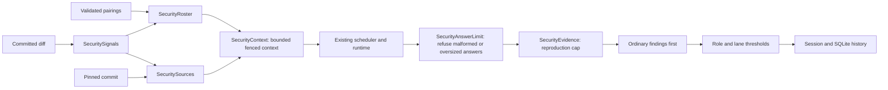
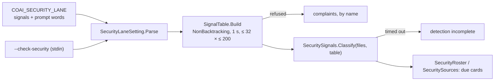

# module_security_lane — extra security reviewers inside code and feature rounds

The lane is off by default. `COAI_SECURITY_LANE` pairs existing reviewer rows with independently
named `redteam-*` prompts. An ordinary gate must still be configured. A successful lane answer
cannot compensate for ordinary reviewers that failed to answer.

`shared/security-lane.json` owns signal names and seed prompt metadata. The C# core embeds it;
the extension generates `securityLane.generated.ts` during build preparation. A trigger selects
a run; focus ranks its source. Detectors are bounded lexical heuristics, including removed lines;
a match is not proof of vulnerability. A non-matching preset becomes an incomplete/excluded pairing when any
diff exceeds the character cap or files exceed the count cap. Fully inspected non-matches are
ordinary skips. Positive matches still run with partial context; oversized diff bodies stay withheld.
SQL routing uses database API names and bounded query/statement shapes. Generic `database` and
`migration` prose alone does not select SQL; `DbConnection`, `DbCommand`, `DbContext`, Dapper and
`MigrationBuilder` still do. This remains lexical routing, not parsing or proof of a data flow.
Unknown triggers refuse their prompt; unknown focus is ignored with
a complaint. Invalid root configuration leaves the lane off. Unknown settings fields survive
extension edits so an older server can refuse them.

`SecuritySources` reuses the feature `SourceResolver`: at most 16 files and four changed regions
per file, with a 30-second collection deadline, all read from the pinned commit. `SecurityContext`
accounts for instructions, schema, framing and output reserve using a UTF-8/4 estimate. It records
omissions, applies the existing credential-file guards and redaction, and fences material with a
fresh nonce. Coverage remains partial; local input coverage remains unverified even when reported
token usage looks plausible. Neither the server nor the extension executes reproduction text.
For slices, production/config paths rank ahead of known documentation and test paths, then focus
signals rank within each tier. Both the sixteen-file reader and the context composer call the one
`SecuritySignals.Rank`. The reader collects source only for the pairings `SecurityRoster.Due` says
this round will ask — within the lane's round budget, free of configuration refusals, and on a
reviewer row that can run — so a spent budget or a broken pairing reads nothing. A slice whose
source window does not fit keeps its patch, listed as `(source omitted for budget; patch only)`.
Supporting material is retained when it fits and labelled in the payload/omissions;
the path hint never proves a file safe. The default local slice budget is 24000 tokens, independent
of the model's configured context window. Explicit source start/end labels surround the nonce fence;
all auditor instructions and the JSON schema stay above them.

Each provider/prompt pair has its own invocation, output files, repair and history identity.
Existing concurrency limits still apply. Security work is exempt from ordinary local stand-down;
it neither triggers that stand-down nor consumes its cloud-completion count. The outer deadline
includes configured lane work and engine queues, unless the operator supplied an explicit limit.

`SecurityEvidence` caps a major/blocking security finding at minor unless its reproduction contains
preconditions, steps, expected and actual results, within 8000 characters. This precedes merging.
`SecurityAnswerLimit` refuses answers exceeding 100 findings or 131072 evidence characters in aggregate.
The security schema requires `status: SECURE` with no findings, or `FINDINGS` with findings. Every
finding carries nonempty `trigger`, `mechanism` and `consequence` (8000 characters total; the
schema allows each field a third of that, because a schema cannot express a sum and must never
admit an answer the validator refuses), preserved
in history and per-pair sightings. Missing or inconsistent status/evidence refuses the answer.
The security schema does not offer prose `notes`; the operator's source-only and JSON-hygiene
block is embedded in every redteam prompt and precedes its output instructions.
The operator's evidence threshold and no-hedging block also precedes the output instructions.
Security severity uses `blocking` = CRITICAL, `major` = HIGH, and `minor` = MEDIUM;
the security schema and response validator exclude `nit` (Low/Info). Ordinary schemas keep it.
The local runtime already sends temperature zero and a seed derived from the complete prompt.
These settings do not prove
semantic correctness: a schema-valid finding still needs its claimed execution path checked.
Ordinary ownership wins a duplicate; stronger severity survives, with per-pair sightings retained.
Schema step 18 stores this evidence in `findings.security_evidence` (step 17 is the question
consultant's; the preview build that numbered the evidence 17 is reconciled on open by
`SecurityPreviewFork`). Finding queries use literal
SQL and read columns by name; a missing optional evidence column in an older database yields no
security projection. A damaged stored projection does not prevent reading the round and does not
pass for "no evidence" either: it reads as `SecurityFindingDetails.Unreadable` with the reason,
which the rounds log shows where the evidence would have been. Ordinary findings with no security evidence keep an empty
column and no evidence disclosure in the extension.
Persisted findings written before the lane have neither `alsoSeenBy` nor `capReason`.
Their owning properties normalize the source generator's missing-field defaults to an empty
array/string, so resuming and saving old pending findings or rejections cannot crash the round.
Existing nonempty sightings and cap reasons survive the same serialization path.
Context composition separates instructions, bounded file selection and fencing; a typed budget
carries input/output limits and the excluded-file count. These refactors retain the existing
caps, ordering, omissions and evidence protocol. Schema keys and calibration serializer options
are shared constants. Generated extension catalog data is excluded only from Sonar's duplication
metric; its complete runtime value remains checked against the shared JSON by `securityLane.test.ts`.

The lane has its own round budget and threshold, read under `lane:security`, and it never
extends the ordinary roles' budget: `PanelConfig.For(Stage)` is the ordinary roles alone. A code
round past every ordinary role's budget runs only for the lane. A feature second round uses the
lane's budget only when every blocking finding is the lane's and no ordinary reviewer failed; an
ordinary reviewer's failure or blocking finding is judged on the ordinary budget, so a feature
stage whose roles have one round answers `call_human` rather than buying a round only the lane
could answer. A round only the lane's budget admitted — past every ordinary budget and still within
the lane's own; a round past both was admitted by nobody and keeps the ordinary refusal — whose lane
then has no work (its trigger is
gone, it was switched off, composition refused), is not refused on every call: it runs empty and
completes as a round nobody answered, recorded with `lane:security was not asked: …`, for a
person to decide. In a round with lane work the ordinary decision summary keeps who could not run
(`Excluded`, `NotAsked`) and whether the deadline ended it. A pairing whose own configuration is
broken is `Excluded` with its reason — "configured pairings could not run" — never a skip that
reads as "no pairing was due". Missing, failed and unverified local answers
are named in the reply and persisted round summary; failed/unverified or excluded work also
raises the existing durable notice. This optional lane does not make a clean ordinary round fail
just because the lane did not answer. A clean response is never described as security coverage
when no complete lane answer exists.

## Prompts and settings

The twelve operator-authored presets are Git files under `src_mcp/src/prompts/`, listed with their
conditions in [security_prompt_catalog.md](security_prompt_catalog.md). Authorization, SQL, concurrency,
auth tokens, SSRF, webhooks, files, commands, deserialization, secrets, prompt injection and XSS each have a checkbox per
reviewer and require a matching trigger. Empty preset triggers refuse execution.

**`redteam-general` is a shipped "always" prompt, first in the catalogue** (since 2026-10-04,
[PLAN_the_security_tab_reads_at_a_glance.md](PLAN_the_security_tab_reads_at_a_glance.md); until then it
was a custom prompt outside the twelve).
- **What "always" means:** it is only on or off. Paired with a reviewer, it is due on every change that has
  readable code: a path that is not prose (`.md`/`.markdown`/`.rst`) with a diff that is not withheld (binary,
  credential file), wherever it lives (test, docs and research folders included). A docs-only change is a plain
  skip for it, never "incomplete coverage", unless files lay beyond the detector cap.
- **No conditions:** the extension refuses trigger and focus writes on it.
- **Where the flag lives:** `always` is a catalogue fact (`SecurityCatalog.IsAlways`, the `always` member of
  `shared/security-lane.json`) and never a settings member. A 0.41/0.42 server refuses a prompt entry with any
  member besides `id`, `triggers` and `focus`, so the extension projects the seed to those three. An old server
  reads general as a custom prompt with empty triggers, which it already runs every time. This was checked by
  running `npm run test:seam` by hand against servers built from the `mcp-v0.41.0` and `mcp-v0.42.0` tags
  (`COAI_MCP_DLL`, and `COAI_SEAM_OLDER_SERVER=1` so the prompt-text leg those servers predate is skipped). CI runs
  the seam only against the binary it just built.
- **A general registered by hand earlier:** stored triggers on it are ignored with one complaint (*"runs on every
  change; the conditions stored for it are ignored"*) and never refuse it. A stored focus is replaced silently.
  General's card says so while stored triggers remain, because an older server still runs it only when they
  match, and its **Clear stored conditions** button (command `clearSecurityConditions`, a queued lane write of
  `prompt:redteam-general:restore`) clears them.
- **Add pair never pairs it,** because it costs a reviewer on every round.

Custom prompts may still use empty triggers to request an unconditional pass. Prompts are embedded by the server build. Edit those files and
commit the changes to change shipped defaults. An optional `<dataDir>/prompts/<id>.md` overrides
the corresponding default; the Settings button explicitly edits this local override. Custom
prompt metadata is registered in the lane's prompt library. An empty or blank override is no
override — a shipped preset keeps its shipped text, as every ordinary role does — while a custom
prompt with no text of its own, or any oversized text, refuses the run.

**What an override's text counts as is one shared rule** (since 2026-10-04).
- **The rule on text.** `shared/security-prompt-text-vectors.json` declares the 64 KiB limit and eighteen vectors
  (text → `none`, `blank`, `placeholder`, `oversized` or `written`), including .NET's whitespace set: U+0085 is
  whitespace, U+FEFF is not; JavaScript's `trim` gets both wrong, so the extension uses neither. The server's
  `SecurityPromptText.Classify` (used by `SecurityRoster.ReadPrompt`) and the extension's `securityPromptFiles.ts`
  both answer them, in `SecurityPromptTextVectorsTests` and `securityPromptFiles.test.ts`.
- **The reading of files, checked live.** The extension decodes a file as `File.ReadAllText` does: its byte-order
  mark picks UTF-8, UTF-16 or UTF-32, exactly one mark is dropped, and a file it cannot read is `unreadable`. The
  server prints its own reading through `--security-prompt-text --ids …` (read only), and the seam's ninth leg
  (`scripts/seam-security-text.mjs`) compares twenty-two prompt ids — twenty-one real files and one absent — and fails on any
  the two read differently. It found
  one on its first run: a file of two byte-order marks. Against a binary named by `COAI_MCP_DLL` AND declared older by
  `COAI_SEAM_OLDER_SERVER=1` (before MCP 0.43.0) the leg is skipped, saying so, and the legs after it still run; without
  that declaration the same refusal fails, from this repository's own build or from a named binary that lost the mode
  (`textLegVerdict`, tested in `seamLegs.test.mjs`). UTF-32 a decoder cannot read cleanly — a value beyond U+10FFFF, a
  surrogate, a trailing sequence under four bytes — is U+FFFD to .NET, so text, and the extension reads it the same way.
- **When it is read.** The extension reads each lane prompt's file at render (`PanelState.securityPromptText`), only
  while the Settings page exists, through a cache that re-reads a file only when its size or modification time changed.
  It reads in the data directory that "Edit local prompt override" uses. A watcher on `prompts/redteam-*.md` under
  that directory repaints the Settings page when one changes (`watchGlob`, extracted from the consultant health panel).
- **The lane's caps.** 32 prompts (the 13 shipped included) and 16 pairs are declared once, under `limits` in
  `shared/security-lane.json`. The extension derives them from it; the server's constants are tested against it.

**The stored setting holds only what the person changed.** `securityLaneSave` compacts every save:
- A shipped prompt whose triggers and focus equal the shipped ones as sets, and that has no unknown member, is
  left out. For general, it is left out when it has no stored triggers.
- `securityLaneFrom` merges it back, so the lane the server receives and the tab draws is unchanged.
- Before this, every save froze a snapshot of every preset into settings.json, so a catalogue change would never
  have reached a preset nobody touched.
- `securityLaneState.ts` holds the card model the tab is drawn from: `promptState`, `promptsInOrder`,
  `conditionsSummary`, `newPromptProblem`, and `securityCommandWrite` (the one mapping from a button to its write).

**The Security lane tab** (Settings → Security lane, since 2026-10-04; `securityLaneView.ts`, `securityPromptCard.ts`,
`securityLaneStyle.ts`, `securityLaneScript.ts`, `securityFlows.ts`, `securityCommands.ts`):
- **Legend and cards.** The tag legend is a two-column list. Each prompt is a card: its name large, its state in words
  and in colour — green `default`, purple `custom`, orange `edited` (text or conditions changed) — general first, then
  the shipped presets, then the person's own. A card says when the server will not send its text, and names the file
  to write in.
- **Conditions** fold into a closed `
` with a one-line summary; inside, two columns ("Run when code matches",
  "Prioritize source"). A missing-trigger warning stays outside the fold.
- **Buttons.** + Add reviewer / prompt pair, Remove pair (by `[index, vendor, prompt]` identity), Restore default,
  Remove custom prompt, Clear stored conditions, and + New custom prompt — also offered as the last option of each
  pair's Prompt select. Caps show as text (`Pairs: N of 16`, `Prompts: N of 32 (13 shipped)`).
- **Flows** (`securityFlows.ts`, every effect handed in and faked in `securityFlows.test.ts`; `securityCommands.ts` binds
  them to VS Code): a question to the person is asked outside the provider's write queue, and the write
  is queued and re-decided there. Restore asks whenever the file holds anything (an unusable override offers Restore
  too), refuses over unsaved edits, re-checks both inside the queue, writes
  the conditions first and then deletes the file; it is idempotent, so pressing again retries a failed delete. Remove
  custom prompt leaves the file on disk. A new prompt is opened in the editor only once the re-read setting holds it,
  and a pair that moved while the person typed is not re-pointed — the person is told. Every message goes through the
  `notify()` funnel.
- **Page-local state** (`setState`, as `selectSearch.ts` does): an opened fold stays open across the repaint a write
  causes, and focus returns to the control just used, or to the button that replaces one that removed itself.

At the operator's request, all thirteen prompts were shortened to approximately half their word
count on 2026-10-01. The source/evidence and output sections remain, with the declared schema owning
the exact required keys. Qwen did not pass the three-consecutive-answer quality preflight. Gemma
passed the empty-answer feature-slice preflight, but positive-finding fidelity remains open; see
[the consolidated measurement record](RESULTS_security_lane_local_llm_windows.md).

The extension's Security lane section controls pairings, triggers, focus, source mode, token budget,
stages, threshold and rounds. A reviewer can be enabled for security alone. Every known member,
including each pair's `context` (slice|diff), `contextTokens` (1024..200000) and `stages`
(code/feature), is validated where the setting is read; a malformed value turns the lane off and
the tab names the malformed part of `coai.securityLane` in settings JSON. The panel never saves
over a malformed setting. The extension still sends it switched off, with the stored value under
`invalidConfiguration`, so the server reports the refusal — naming the setting as malformed, not
asking for a newer server.
Missing/disabled reviewers, missing prompt ids and presets without triggers carry visible repair
instructions. Source collection only uses the focus tags of selected, triggered slice pairings;
unchecked modules cannot consume their sixteen-file source budget.
Servers older than 0.41.0 display an update warning and cannot activate the lane in the panel. Team runtimes are refused for this lane because
their current catalog does not advertise its dedicated schema.

The settings boundary was measured on Windows against released MCP 0.40.3 (2026-10-01): the key is
held back, an explicitly supplied future key is inert, and the current Release binary accepts it.
Repeat with `npm run test:security-compat` and `COAI_OLD_SERVER` naming that released executable.
This read-only check starts no reviewer and makes no claim about local model quality.

## Bounds and validation

There are at most 32 prompt definitions and 16 pairs, with at most ten rounds. The default is two
rounds and threshold zero; these remain conservative settings, not a claim of calibrated quality.
Scratch cleanup reuses the existing round cleanup. History is retained indefinitely in the operator's
data directory without automatic pruning or a disk quota; its owner handles backups and removal.
Aggregate reproduction caps limit each round's additional payload. See the growth table in
[the design plan](PLAN_a_security_lane_runs_beside_the_gate.md) for the computed worst case.

Every method in the lane's own files is held at cyclomatic complexity 4 or less by CA1502 as a build
error scoped to those files alone: the threshold is `src_mcp/CodeMetricsConfig.txt` (`CA1502: 4`, an
`AdditionalFiles` item of the Core, Runners and server projects) and the scope is the `.editorconfig`
path sections for `core/Security/*.cs`, `src/Server/Security*.cs`, `SecurityAnswerLimit.cs`,
`InputCoverage.cs`, `SecurityFindingStore.cs` and `SecurityPreviewFork.cs`.

`SecurityLaneRoundTests` drives the real engine, Git and SQLite with paid reviewers doubled.
`SecurityEvidenceTests`, `SecurityLaneSettingsTests` and `SecurityCoverageTests` cover caps, routing,
validation, deadline and ordinary-failure independence. `securityLane.test.ts` and
`securityLaneMalformed.test.ts` run the page; the eighth leg of `npm run test:seam`
(`scripts/seam-security.mjs`) sends the extension-serialized lane to the built server (positive
control, unknown trigger refused, malformed lane refused). `securityEvidenceLog.test.ts` covers
evidence parsing and its escaped disclosure in the rounds log.
`SecurityEvidenceOnAnOlderDatabaseTests` reads a history without the evidence column, and a damaged
projection, through the read-only queries. `SecurityLaneBudgetTests` pins that the lane's budget
never widens the ordinary roles' (feature budget of one → `call_human`), and `SecurityLaneBoundaryTests`
with `SecurityLaneRoundTests` drive the real engine, roster, Git and SQLite through the empty
lane-only round, blank overrides, broken pairings, patch-only slices and the schema's field limit. The explicit local calibration test
is described in [module_tests.md](module_tests.md); it measures model behavior separately from
these deterministic guarantees.
`SecuritySessionCompatibilityTests` loads pre-lane finding shapes through the real `SessionStore`
and generated JSON context, saves and reloads them, and checks the empty evidence projection.
Its positive control preserves nonempty lane evidence through the same store.

## Editable words, a card's own words, and `--check-security` (2026-10-05, PLAN_one_model_catalog.md E2.4)

- **`SignalTable`** (core): every signal with what it matches — words (a case-insensitive substring each) and compiled
  patterns. `Shipped` is today's detector exactly; `Build(words, own)` puts a person's words for a signal in place of its
  shipped words (the SQL statement shapes stay on `sql`) and makes each card's own words a signal of its own,
  `own:<prompt id>`. `SecuritySignals.Classify(files, table)`; the old overload is the shipped table.
- **Patterns** — an entry written `/…/` — compile once with `NonBacktracking`, `IgnoreCase` and a 1 s match timeout:
  a catastrophic pattern over a megabyte is linear, never a hung round. Lookaround and backreferences are refused BY
  NAME (`PatternRefusal`), as is a pattern past 200 characters or past 32 across the lane; the rest of the list still
  works. A pattern that times out on a file leaves that file's detection INCOMPLETE — the lane's existing state.
- **A card with words** (`SecurityPrompt.Words`) is due when its own signal or one of its triggers matches — never on
  every change. An "always" card ignores words: it already runs on every change.
- **The setting.** `COAI_SECURITY_LANE` reads a root `signals` (signal → words) and a prompt's `words`; an unknown signal,
  a value that is not a list, and every refused pattern are COMPLAINTS (on `providers`), never a refused lane.
  `SecurityLaneSetting.Table` is built when the setting is read; the roster and the source reader classify with it.
- **`--check-security [--validate]`** reads `{"text": …, "lane": …}` on stdin (never argv: a sample can hold a token,
  and argv is in process listings and capped at 32 K on Windows) and answers `signals`, the `cards` that would be due,
  `refused` patterns and `complaints`; `--validate` checks the patterns alone. A request it cannot read is 65, never 64.
- **The extension** sends `signals` and a prompt's `words` only to a binary that lists `securityWords`: an older one
  refuses an unknown root member — the whole lane off — and an unknown prompt member refuses that prompt.
  `--features` lists `securityWords` and `checkSecurity`.

