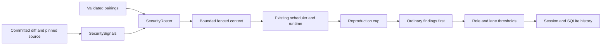

# module_security_lane — extra security reviewers inside code and feature rounds

The lane is off by default. `COAI_SECURITY_LANE` pairs existing reviewer rows with independently
named `redteam-*` prompts. An ordinary gate must still be configured. A successful lane answer
cannot compensate for ordinary reviewers that failed to answer.

`shared/security-lane.json` owns signal names and seed prompt metadata. The C# core embeds it;
the extension generates `securityLane.generated.ts` during build preparation. A trigger selects
a run; focus ranks its source. Detectors are bounded lexical heuristics, including removed lines;
a match is not proof of vulnerability. A non-matching preset becomes an incomplete/excluded pairing when any
diff exceeds the character cap or files exceed the count cap. Fully inspected non-matches are
ordinary skips. Positive matches still run with partial context; oversized diff bodies stay withheld.
SQL routing uses database API names and bounded query/statement shapes. Generic `database` and
`migration` prose alone does not select SQL; `DbConnection`, `DbCommand`, `DbContext`, Dapper and
`MigrationBuilder` still do. This remains lexical routing, not parsing or proof of a data flow.
Unknown triggers refuse their prompt; unknown focus is ignored with
a complaint. Invalid root configuration leaves the lane off. Unknown settings fields survive
extension edits so an older server can refuse them.

`SecuritySources` reuses the feature `SourceResolver`: at most 16 files and four changed regions
per file, with a 30-second collection deadline, all read from the pinned commit. `SecurityContext`
accounts for instructions, schema, framing and output reserve using a UTF-8/4 estimate. It records
omissions, applies the existing credential-file guards and redaction, and fences material with a
fresh nonce. Coverage remains partial; local input coverage remains unverified even when reported
token usage looks plausible. Neither the server nor the extension executes reproduction text.
For slices, production/config paths rank ahead of known documentation and test paths, then focus
signals rank within each tier. Both the sixteen-file reader and the context composer use this
same hint. Supporting material is retained when it fits and labelled in the payload/omissions;
the path hint never proves a file safe. The default local slice budget is 24000 tokens, independent
of the model's configured context window. Explicit source start/end labels surround the nonce fence;
all auditor instructions and the JSON schema stay above them.

Each provider/prompt pair has its own invocation, output files, repair and history identity.
Existing concurrency limits still apply. Security work is exempt from ordinary local stand-down;
it neither triggers that stand-down nor consumes its cloud-completion count. The outer deadline
includes configured lane work and engine queues, unless the operator supplied an explicit limit.

`SecurityEvidence` caps a major/blocking security finding at minor unless its reproduction contains
preconditions, steps, expected and actual results, within 8000 characters. This precedes merging.
`SecurityAnswerLimit` refuses answers exceeding 100 findings or 131072 evidence characters in aggregate.
The security schema requires `status: SECURE` with no findings, or `FINDINGS` with findings. Every
finding carries nonempty `trigger`, `mechanism` and `consequence` (8000 characters total), preserved
in history and per-pair sightings. Missing or inconsistent status/evidence refuses the answer.
The security schema does not offer prose `notes`; the operator's source-only and JSON-hygiene
block is embedded in every redteam prompt and precedes its output instructions.
The operator's evidence threshold and no-hedging block also precedes the output instructions.
Security severity uses `blocking` = CRITICAL, `major` = HIGH, and `minor` = MEDIUM;
the security schema and response validator exclude `nit` (Low/Info). Ordinary schemas keep it.
The local runtime already sends temperature zero and a seed derived from the complete prompt.
These settings do not prove
semantic correctness: a schema-valid finding still needs its claimed execution path checked.
Ordinary ownership wins a duplicate; stronger severity survives, with per-pair sightings retained.
Schema step 17 stores this evidence in `findings.security_evidence`; old database readers remain
supported by the column-presence ladder. Ordinary findings with no security evidence keep an empty
column and no evidence disclosure in the extension.

The lane has its own round budget and threshold. Missing, failed and unverified local answers
are named in the reply and persisted round summary; failed/unverified or excluded work also
raises the existing durable notice. This optional lane does not make a clean ordinary round fail
just because the lane did not answer. A clean response is never described as security coverage
when no complete lane answer exists.

## Prompts and settings

The twelve operator-authored presets are Git files under `src_mcp/src/prompts/`, listed with their
conditions in [security_prompt_catalog.md](security_prompt_catalog.md). Authorization, SQL, concurrency,
auth tokens, SSRF, webhooks, files, commands, deserialization, secrets, prompt injection and XSS each have a checkbox per
reviewer and require a matching trigger. Empty preset triggers refuse execution. The additional
`redteam-general.md` remains available as a custom prompt outside the twelve; custom prompts may use
empty triggers to request an unconditional pass. Prompts are embedded by the server build. Edit those files and
commit the changes to change shipped defaults. An optional `<dataDir>/prompts/<id>.md` overrides
the corresponding default; the Settings button explicitly edits this local override. Custom
prompt metadata is registered in the lane's prompt library. Empty or oversized text refuses the run.

At the operator's request, all thirteen prompts were shortened to approximately half their word
count on 2026-10-01. The source/evidence and output sections remain, with the declared schema owning
the exact required keys. Qwen did not pass the three-consecutive-answer quality preflight. Gemma
passed the empty-answer feature-slice preflight, but positive-finding fidelity remains open; see
[the consolidated measurement record](RESULTS_security_lane_local_llm_windows.md).

The extension's Security lane section controls pairings, triggers, focus, source mode, token budget,
stages, threshold and rounds. A reviewer can be enabled for security alone. A malformed imported
setting is preserved under `invalidConfiguration`, displayed as an error and kept disabled;
correct that preserved object in settings JSON and replace `coai.securityLane` with it.
Missing/disabled reviewers, missing prompt ids and presets without triggers carry visible repair
instructions. Source collection only uses the focus tags of selected, triggered slice pairings;
unchecked modules cannot consume their sixteen-file source budget.
Servers older than 0.41.0 display an update warning and cannot activate the lane in the panel. Team runtimes are refused for this lane because
their current catalog does not advertise its dedicated schema.

The settings boundary was measured on Windows against released MCP 0.40.3 (2026-10-01): the key is
held back, an explicitly supplied future key is inert, and the current Release binary accepts it.
Repeat with `npm run test:security-compat` and `COAI_OLD_SERVER` naming that released executable.
This read-only check starts no reviewer and makes no claim about local model quality.

## Bounds and validation

There are at most 32 prompt definitions and 16 pairs, with at most ten rounds. The default is two
rounds and threshold zero; these remain conservative settings, not a claim of calibrated quality.
Scratch cleanup reuses the existing round cleanup. History is retained indefinitely in the operator's
data directory without automatic pruning or a disk quota; its owner handles backups and removal.
Aggregate reproduction caps limit each round's additional payload. See the design's growth
table for the computed worst case.

`SecurityLaneRoundTests` drives the real engine, Git and SQLite with paid reviewers doubled.
`SecurityEvidenceTests`, `SecurityLaneSettingsTests` and `SecurityCoverageTests` cover caps, routing,
validation, deadline and ordinary-failure independence. `securityLane.test.ts` executes the real
page and sends its serialized settings to the built server. The explicit local calibration test
is described in [module_tests.md](module_tests.md); it measures model behavior separately from
these deterministic guarantees.
