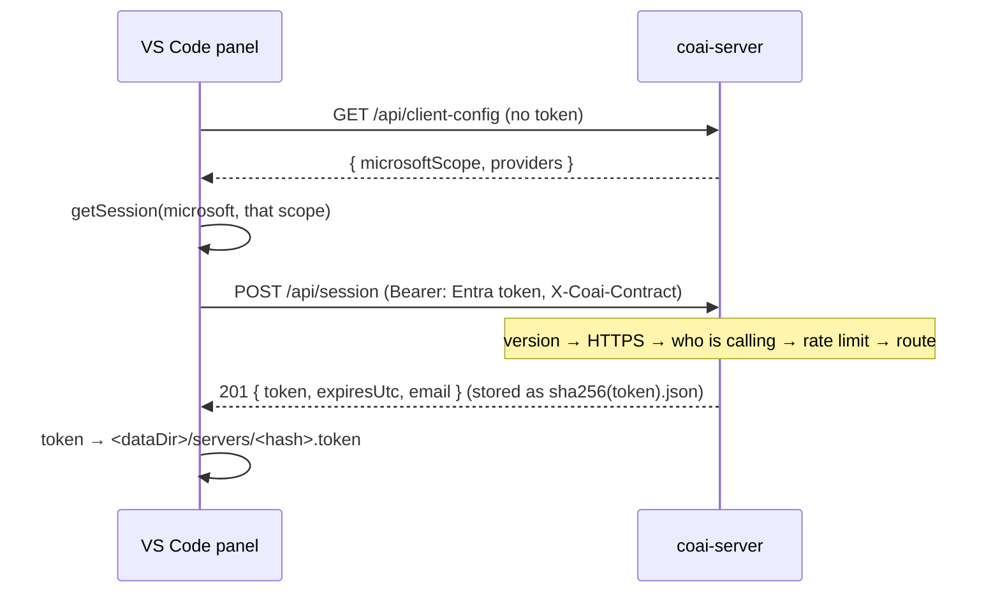

# module: team server — one subscription per vendor, shared behind company sign-in

> `src_server/` — `coai-server`, a .NET 10 minimal API on the CredsForDevs VM. A company buys one
> Codex, one Antigravity and one Claude subscription, signs each CLI in once on that machine, and
> everybody's `coai-mcp` sends its review prompts there instead of running a CLI locally.
>
> Plan: [../todo/PLAN_team_server.md](../todo/PLAN_team_server.md). **Story 2.1 is what exists
> today**: the host, its authentication and its sessions. No vendors, no catalog, no jobs — those
> are 2.2 to 2.4, and everything else 404s.

## Purpose

Answer three questions for a person who has signed in with the company's Microsoft account: who
they are, what their client needs to sign in with, and a token their `coai-mcp` can carry — since
that process is started by an MCP client and has no Microsoft session of its own.

## The pipeline, in the order it runs

**The order is the design**, and each step is a defect somebody already paid for:

| Step | Why it is there, and why it is HERE |
|---|---|
| `X-Coai-Contract` judged first | an old client is told to update (426) rather than handed a 401 about a token that was never the problem. The mechanism has to exist BEFORE the first breaking change or it never usefully exists: the day a shape moves, the old clients are already in the field with no way to say what they speak |
| forwarded-HTTPS check | a request without `X-Forwarded-Proto` did not come through the proxy, so a MISSING header is treated exactly like a plaintext one. The vault shipped the other way round once and omitting the header was a one-line bypass. `/api/health` is the one exemption — the container's own probe has no proxy in front of it |
| the caller resolved | nothing else populates `ctx.User`: every endpoint authorises by hand and there is no default scheme |
| the rate limiter | …which is why it can partition on the EMAIL. Behind a reverse proxy the remote address is the proxy's for everyone alive, and the vault was found live in exactly that state — one busy client throttling the entire company |
| the routes | anything that is not `/api/…` does not exist here |

## Core entities

| Type | File | Role |
|---|---|---|
| `Auth` | `src/Auth.cs` | the three JwtBearer schemes (Microsoft by tenant OIDC, Google, Local HMAC) and `AuthenticateAnyAsync`, which tries the SESSION first — a hash lookup before three signature validations — then each configured scheme. `RequireCaller` is the single gate: 401 without an identity, 403 outside the company |
| `TokenIdentity` | `src/TokenIdentity.cs` | mirrored verbatim from the vault: the email comes from a verified token and never from a request; `email_verified:false` is refused; the domain allow-list decides |
| `SessionStore`, `SessionRecord` | `src/Sessions.cs` | server tokens, stored under `sha256(token).json` so the raw token is never written; every write atomic (temp + rename); expiry ABSOLUTE from issue |
| `SessionEndpoints` | `src/SessionEndpoints.cs` | mint, revoke, `whoami` |
| `Startup` | `src/Startup.cs` | the states this server refuses to start in |
| `ContractVersion` | `src/ContractVersion.cs` | mirrored; `X-Coai-Contract`, this product's own version line |
| `ServerJsonContext` | `src/ServerJsonContext.cs` | every serialised shape, source-generated — reflection is off |

## The decisions a reader needs

- **A session is minted from an identity provider's token and never from another session.** A token
  that could mint its own successor would never expire, which is the one property a deadline exists
  to give it.
- **The deadline is absolute, not sliding.** A session that renewed itself on use would let a stolen
  token live for as long as the thief kept using it. The panel re-mints silently before it passes,
  so nobody is logged out by it. `LastUsedUtc` is informational and written back at most hourly —
  the alternative is a disk write per request for a field that decides nothing, and a long poll asks
  every twenty-five seconds.
- **The domain is re-checked on every request, not only at sign-in.** The session's principal
  carries the email as an ordinary claim, so `RequireCaller` applies the allow-list to a session
  exactly as to a token. Without this, somebody whose domain is removed keeps a week of access to
  the company's paid subscriptions.
- **A Microsoft tenant with no audience refuses to START** — stricter than the vault, which only
  warns. That server predates its own app registration and had deployments without one; this server
  mints sessions, so an unchecked audience means any token issued to anyone in the tenant for any
  other application buys a seven-day pass. The registration exists from day one, so there is nothing
  to be lenient about.
- **`DELETE /api/session` refuses an identity provider's token** rather than answering 204. A
  stateless token is not this server's to withdraw, and saying 204 would tell a person a credential
  was revoked when nothing was.
- **The raw token is never stored.** The file is named by its SHA-256, so a stolen data directory
  reveals which emails have sessions and nothing anyone could authenticate with.

## Configuration

`Coai:AllowedDomains` (required unless `Coai:AllowAnyDomain`), `Coai:Admins`, `Coai:DataDir`,
`Coai:SessionTtlDays` (7), `Coai:MinimumClientContract`, `Coai:RequireForwardedHttps`,
`Coai:RateLimit:PermitLimit|WindowSeconds`; `Auth:Microsoft:Tenant|Audiences|ClientScope`,
`Auth:Google:Enabled|Audiences`, `Auth:Local:SigningKey`. Environment form uses `__`.

**Startup refuses** when no scheme is configured, when a Microsoft tenant has no audiences, when the
domain list is empty without the explicit override, when a Local signing key is under 32 bytes, when
`SessionTtlDays` is not positive, or when `DataDir` cannot be written — each with the sentence that
names the cure. A misconfiguration that starts is a server that answers 401 or 403 to everything with
nothing in the log connecting the two.

## Verification that matters

Tests drive the real app in-process (`WebApplicationFactory`), configured through **environment
variables** rather than `WithWebHostBuilder`: `Program.cs` reads its configuration before `Build()`,
so anything a factory adds later lands too late to be seen. That is the vault's own finding and its
harness came with it — which is also why every test class joins one non-parallel collection.

The suite covers what must never be accepted (no token, a foreign domain, `alg=none`, another key,
no email, expired, `email_verified:false`), the session's whole life (mint → use → revoke → refused;
a session cannot mint another; an expired one is refused and swept on sight; a removed domain stops
a live session), the startup refusals, and the one property the pipeline order exists for: two
callers behind one address do not spend each other's quota.

**Native AOT is analysed here and LINKED elsewhere.** `PublishAot` in the csproj makes the trim and
AOT analyzers run on every ordinary build, and they are clean — which is the check that matters
day to day, and the same one the vault server relies on. The native link is not run on a
developer's Windows box: cross-OS AOT is refused by the toolchain outright, and a local `win-x64`
publish needs a C++ linker that is not on this PATH. The real `linux-x64` publish belongs to the
image build (story 4.1) and to CI, and it is proved there rather than claimed here.

## Where it runs

Behind the **host** nginx on the CredsForDevs VM — not the vault's container, which binds loopback
and terminates no TLS. `coai.remsoft.dev` has its own site file and its own certificate; the app
binds `127.0.0.1:8090` and nothing else can reach it. See the plan's *Deployment* section for the
topology and for why the box's 3.8 GB of RAM is a design input rather than a footnote.
