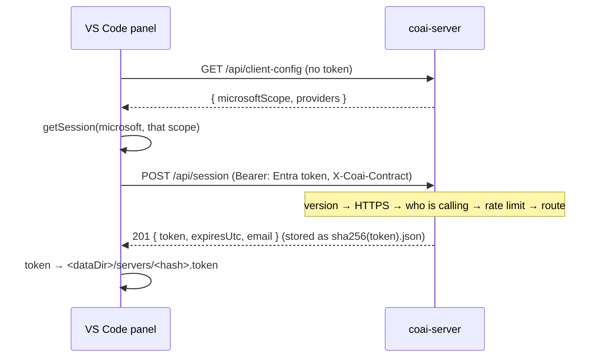

# module: team server — one subscription per vendor, shared behind company sign-in

> `src_server/` — `coai-server`, a .NET 10 minimal API on the CredsForDevs VM. A company buys one
> Codex, one Antigravity and one Claude subscription, signs each CLI in once on that machine, and
> everybody's `coai-mcp` sends its review prompts there instead of running a CLI locally.
>
> Plan: [../todo/PLAN_team_server.md](../todo/PLAN_team_server.md). **Stories 2.1 and 2.2 are what
> exists today**: the host, its authentication and its sessions (2.1); the vendor catalog, the
> account slots and `login` (2.2). No jobs and no reviews — that is 2.3, and `POST /api/reviews`
> still 404s.

## Purpose

Answer three questions for a person who has signed in with the company's Microsoft account: who
they are, what their client needs to sign in with, and a token their `coai-mcp` can carry — since
that process is started by an MCP client and has no Microsoft session of its own.

## The pipeline, in the order it runs



**The order is the design**, and each step is a defect somebody already paid for:

| Step | Why it is there, and why it is HERE |
|---|---|
| `X-Coai-Contract` judged first | an old client is told to update (426) rather than handed a 401 about a token that was never the problem. The mechanism has to exist BEFORE the first breaking change or it never usefully exists: the day a shape moves, the old clients are already in the field with no way to say what they speak |
| forwarded-HTTPS check | a request without `X-Forwarded-Proto` did not come through the proxy, so a MISSING header is treated exactly like a plaintext one. The vault shipped the other way round once and omitting the header was a one-line bypass. `/api/health` is the one exemption — the container's own probe has no proxy in front of it |
| the caller resolved | nothing else populates `ctx.User`: there is no default scheme and no `UseAuthentication`. This step AUTHENTICATES; `CallerFilter` then authorises per route |
| the rate limiter | …which is why it can partition on the EMAIL. Behind a reverse proxy the remote address is the proxy's for everyone alive, and the vault was found live in exactly that state — one busy client throttling the entire company |
| the routes, behind `CallerFilter` | one gate for every authorised route. A handler receives a `Caller`, which it can only get if its route was registered with `RequireCaller` — so the check cannot be forgotten into a route that answers 200 to anybody |
| the fallback | anything that is not `/api/…` does not exist here |

### The routes that exist today

| Route | Auth | Answers |
|---|---|---|
| `GET /api/health` | none | `{ok, version}` — the container's own probe, which has no proxy in front of it |
| `GET /api/client-config` | none | `{microsoftScope, providers}` — the caller has no token yet, and a client id is public by construction |
| `POST /api/session` | IdP token only | `201 {token, expiresUtc, email}`; a session may not mint another |
| `DELETE /api/session` | any | `204`; `400` for an IdP token, `500` when the file would not go |
| `GET /api/whoami` | any | `{email, name, isAdmin}` |
| `GET /api/catalog` | any | the allowlist, each CLI's presence, and the account counts |
| `POST /api/reviews` … | — | **404 until story 2.3** |

## Core entities

| Type | File | Role |
|---|---|---|
| `Auth` | `src/Auth.cs` | the three JwtBearer schemes (Microsoft by tenant OIDC, Google, Local HMAC) and `AuthenticateAnyAsync`, which tries the SESSION first — a hash lookup before three signature validations — then each configured scheme. `RequireCaller` is the single gate: 401 without an identity, 403 outside the company |
| `TokenIdentity` | `src/TokenIdentity.cs` | mirrored verbatim from the vault: the email comes from a verified token and never from a request; `email_verified:false` is refused; the domain allow-list decides |
| `SessionStore`, `SessionRecord` | `src/Sessions.cs` | server tokens, stored under `sha256(token).json` so the raw token is never written; every write atomic (temp + rename); expiry ABSOLUTE from issue |
| `SessionEndpoints` | `src/SessionEndpoints.cs` | mint, revoke, `whoami` |
| `Startup` | `src/Startup.cs` | the states this server refuses to start in |
| `ContractVersion` | `src/ContractVersion.cs` | mirrored; `X-Coai-Contract`, this product's own version line |
| `ServerJsonContext` | `src/ServerJsonContext.cs` | every serialised shape, source-generated — reflection is off |
| `JsonFileStore` | `src/JsonFileStore.cs` | one atomic read/write/delete for every small JSON file here — the session store's own write path, extracted when the slot state needed exactly it |
| `CallerFilter`, `Caller` | `src/CallerFilter.cs` | the single authorisation gate; a handler can only ask who is calling if its route was registered with `RequireCaller` |
| `VendorConfig`, `VendorCatalog`, `VendorCatalogHost` | `src/Vendors/` | `vendors.json`: the model allowlist, its validation, and its content-hash reload |
| `AccountSlot`, `SlotSelector` | `src/Slots/AccountSlot.cs` | one account's state, and which account the next job goes to |
| `SlotEnvironment` | `src/Slots/SlotEnvironment.cs` | the variables that make one launch use one account and see no other |
| `CooldownParser` | `src/Slots/CooldownParser.cs` | the vendor's own rate-limit sentence → an instant |
| `SlotRegistry`, `SlotLease` | `src/Slots/SlotRegistry.cs` | the cross-process lock and the persisted per-account state |
| `VendorLogin` | `src/Slots/VendorLogin.cs` | `coai-server login <vendor> <slot>` — the only interactive path |
| `CatalogEndpoints`, `VendorHealthCache` | `src/Vendors/CatalogEndpoints.cs` | `GET /api/catalog`, and the 60 s cache that stops a poll launching a CLI per request |

## The decisions a reader needs

### Story 2.1 — identity and sessions

- **A session is minted from an identity provider's token and never from another session.** A token
  that could mint its own successor would never expire, which is the one property a deadline exists
  to give it.
- **The deadline is absolute, not sliding.** A session that renewed itself on use would let a stolen
  token live for as long as the thief kept using it. The panel re-mints silently before it passes,
  so nobody is logged out by it. `LastUsedUtc` is informational and written back at most hourly —
  the alternative is a disk write per request for a field that decides nothing, and a long poll asks
  every twenty-five seconds.
- **The domain is re-checked on every request, not only at sign-in.** The session's principal
  carries the email as an ordinary claim, so `RequireCaller` applies the allow-list to a session
  exactly as to a token. Without this, somebody whose domain is removed keeps a week of access to
  the company's paid subscriptions.
- **A Microsoft tenant with no audience refuses to START** — stricter than the vault, which only
  warns. That server predates its own app registration and had deployments without one; this server
  mints sessions, so an unchecked audience means any token issued to anyone in the tenant for any
  other application buys a seven-day pass. The registration exists from day one, so there is nothing
  to be lenient about.
- **`DELETE /api/session` refuses an identity provider's token** rather than answering 204. A
  stateless token is not this server's to withdraw, and saying 204 would tell a person a credential
  was revoked when nothing was.
- **`DELETE` answers 500 when the file would not go.** A revoke that reports 204 over a failed
  delete tells a person their credential was withdrawn while a stolen bearer goes on working until
  it expires — the one lie a revoke endpoint must not tell. `SessionStore.Revoke` returns whether it
  happened, and "already gone" counts as gone.
- **`X-Forwarded-*` is trusted from loopback and the private ranges only.** An earlier draft cleared
  the list, which trusts those headers from anybody who can reach the socket: a direct caller could
  send `X-Forwarded-Proto: https` and walk past the HTTPS check, or forge `X-Forwarded-For` and move
  into another person's rate-limit partition. `Coai:TrustedProxies` overrides it, all or nothing —
  a half-read list is a trust boundary nobody wrote, and it would fail open.
- **A swallowed filesystem failure is still reported.** An unreadable session and an unknown one are
  the same 401 to a caller and completely different things to an operator; the store takes a
  callback and the host logs it.
- **The raw token is never stored.** The file is named by its SHA-256, so a stolen data directory
  reveals which emails have sessions and nothing anyone could authenticate with.

### Story 2.2 — the vendors and the accounts

- **Concurrency on an account is an INVARIANT, not a setting.** The draft had `slotConcurrency` in
  `vendors.json`, defaulting to 1. It is gone: every one of these CLIs rewrites its own OAuth token
  on rotation, so two processes on one account race and the loser gets `invalid_grant` — the account
  is signed out until a human returns to the VM. An option whose only safe value is its default is a
  loaded gun with a note on it.
- **The lock is a file handle, because the other holder is another process.** A review runs inside
  the server; `login` arrives as `docker compose exec`. `FileShare.None` is kernel-enforced across
  processes and released when the handle closes — including on a kill — which is the same exclusion
  `EngineLease` already uses for the GPU. A leftover `.lock` FILE blocks nothing; only the handle
  carries the lock. An age threshold was proposed on the plan round and declined: it would break a
  lock whose holder is alive and working, which is precisely the race this prevents. The bounded
  wait (`Coai:LoginWaitSeconds`, default 2 min) is what makes a genuinely hung review visible.
- **Health is about the BINARY; usability is about the ACCOUNTS.** `VendorProbe` runs the CLI with
  the server's environment, not any slot's `HOME`, so it can only answer "is it installed". If it
  were allowed to imply authentication, a vendor whose every account was signed out would show
  healthy while every job failed. The two never mix, and the test asserts the separation rather than
  a value — so it does not depend on whether the developer happens to have codex installed.
- **`needs sign-in` is not a cooldown.** A cooldown clears itself by the passage of time; being
  signed out never does. They are separate fields with separate cures, and the catalog's counts and
  `SlotSelector.Explain` say which applies — "try again in an hour" and "nobody will ever try
  again" must not look the same.
- **A bad `vendors.json` keeps the previous allowlist AND says so on the catalog.** Emptying the
  allowlist on a typo refuses every review, which looks like an outage with no error. But keeping the
  old one means disk and behaviour disagree, so the reason travels in `CatalogDto.Error` — visible on
  the screen the operator is already looking at, not only in a log on a box they must SSH into.
- **The reload token is a content hash.** A same-size replacement inside the filesystem's timestamp
  resolution leaves a metadata stamp unchanged, and the operator would conclude hot reload is broken.
  The file is read ONCE and hashed from those same bytes, so the host can never remember a token for
  content it did not parse. A UTF-8 BOM is skipped — several editors write one, and the reward for
  using Notepad was `'0xEF' is an invalid start of a value`.
- **Isolation is more than `HOME`.** `XDG_CONFIG_HOME`, `XDG_DATA_HOME`, `XDG_CACHE_HOME` and
  `XDG_STATE_HOME` are redirected into the slot as well. Tools that store state under those read them
  from the ambient environment when unset, so two slots would share one config directory and the
  second sign-in would overwrite the first. For `antigravity`, which has no directory variable of its
  own, these ARE the whole isolation.
- **The cooldown guess errs LONG.** Waiting too long costs one queued review some latency; retrying
  too early spends quota against a live limit, which on some plans extends it. So an unzoned time is
  never allowed to resolve to less than the 30-minute fallback, repeats double to a 5 h ceiling, and
  every pattern in the parser matches a line somebody actually captured from the VM.
- **A handler needs a second parameter.** A lambda whose only parameter is `HttpContext` is treated
  as a `RequestDelegate`, whose return value is discarded — the catalog answered 200 with an empty
  body until it took a `CancellationToken` too. Found by its own tests.

## Configuration

`Coai:AllowedDomains` (required unless `Coai:AllowAnyDomain`), `Coai:Admins`, `Coai:DataDir`,
`Coai:SessionTtlDays` (7), `Coai:MinimumClientContract`, `Coai:RequireForwardedHttps`,
`Coai:RateLimit:PermitLimit|WindowSeconds`, `Coai:TrustedProxies`, `Coai:LoginWaitSeconds`;
`Auth:Microsoft:Tenant|Audiences|ClientScope`,
`Auth:Google:Enabled|Audiences`, `Auth:Local:SigningKey`. Environment form uses `__`.

**Startup refuses** when no scheme is configured, when a Microsoft tenant has no audiences, when the
domain list is empty without the explicit override, when a Local signing key is under 32 bytes, when
`SessionTtlDays` is not positive, or when `DataDir` cannot be written — each with the sentence that
names the cure. A misconfiguration that starts is a server that answers 401 or 403 to everything with
nothing in the log connecting the two.

## What is on disk

```
<DataDir>/
  vendors.json                     the operator's allowlist, edited by hand, hot-reloaded
  sessions/<sha256(token)>.json    one per server token; the raw token is never stored
  accounts/<vendor>/<slot>/        used as HOME for a launch on that account
      .lock                        held with FileShare.None for the life of a job
      state.json                   cooldown, needs-sign-in, last used, consecutive cooldowns
      claude.token                 optional: a `claude setup-token` value instead of a sign-in
      .config/ .local/ .cache/     the XDG redirects, so nothing leaks between accounts
```

The account directories are `chmod 700` on creation, because they accumulate OAuth credentials and
default permissions make those readable by every other user on a shared host. A bind-mounted volume
owned by another uid cannot be chmod'ed by the server; that is the deployment check's job, and
failing to start over it would be worse than the exposure.

## Verification that matters

Tests drive the real app in-process (`WebApplicationFactory`), configured through **environment
variables** rather than `WithWebHostBuilder`: `Program.cs` reads its configuration before `Build()`,
so anything a factory adds later lands too late to be seen. That is the vault's own finding and its
harness came with it — which is also why every test class joins one non-parallel collection.

**The lock is proved by a second PROCESS, not a second call.** `SlotRegistryTests` holds an account
and then runs the real `coai-server login` binary, asserting it refuses with its own busy exit code.
An in-process test of this lock would prove the wrong thing entirely — the holder it must exclude
arrives via `docker compose exec`. Both lock tests were confirmed to have teeth by weakening
`FileShare.None` to `FileShare.ReadWrite`: the in-process one then reported the second acquire
succeeding, and the cross-process one reported `login` walking past the lock.

**The endpoint filter changed no behaviour, and story 2.1's tests prove it** — all 37 of them pass
UNEDITED against the refactor, as do they against `SessionStore` moving onto the shared
`JsonFileStore`. That is what makes those two refactors checkable rather than asserted.

The suite covers what must never be accepted (no token, a foreign domain, `alg=none`, another key,
no email, expired, `email_verified:false`), the session's whole life (mint → use → revoke → refused;
a session cannot mint another; an expired one is refused and swept on sight; a removed domain stops
a live session), the startup refusals, and the one property the pipeline order exists for: two
callers behind one address do not spend each other's quota.

**Native AOT is analysed here and LINKED elsewhere.** `PublishAot` in the csproj makes the trim and
AOT analyzers run on every ordinary build, and they are clean — which is the check that matters
day to day, and the same one the vault server relies on. The native link is not run on a
developer's Windows box: cross-OS AOT is refused by the toolchain outright, and a local `win-x64`
publish needs a C++ linker that is not on this PATH. The real `linux-x64` publish belongs to the
image build (story 4.1) and to CI, and it is proved there rather than claimed here.

## Where it runs

Behind the **host** nginx on the CredsForDevs VM — not the vault's container, which binds loopback
and terminates no TLS. `coai.remsoft.dev` has its own site file and its own certificate; the app
binds `127.0.0.1:8090` and nothing else can reach it. See the plan's *Deployment* section for the
topology and for why the box's 3.8 GB of RAM is a design input rather than a footnote.
