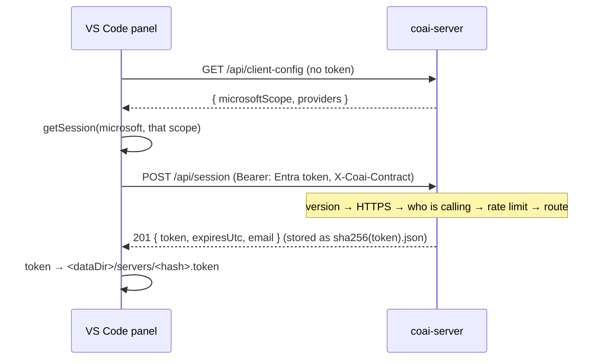

# module: team server — one subscription per vendor, shared behind company sign-in

> `src_server/` — `coai-server`, a .NET 10 minimal API on the CredsForDevs VM. A company buys one
> Codex, one Antigravity and one Claude subscription, signs each CLI in once on that machine, and
> everybody's `coai-mcp` sends its review prompts there instead of running a CLI locally.
>
> Plan: [../todo/PLAN_team_server.md](../todo/PLAN_team_server.md). **Stories 2.1 and 2.2 are what
> exists today**: the host, its authentication and its sessions (2.1); the vendor catalog, the
> account slots and `login` (2.2); the job queue, the runner and the review endpoints (2.3); and what
> the team is spending, with the admin view (2.4). **Epic 2 is complete.** The panel that drives it
> is epic 3; the container and the release are epic 4.

## Purpose

Answer three questions for a person who has signed in with the company's Microsoft account: who
they are, what their client needs to sign in with, and a token their `coai-mcp` can carry — since
that process is started by an MCP client and has no Microsoft session of its own.

## The pipeline, in the order it runs



**The order is the design**, and each step is a defect somebody already paid for:

| Step | Why it is there, and why it is HERE |
|---|---|
| `X-Coai-Contract` judged first | an old client is told to update (426) rather than handed a 401 about a token that was never the problem. The mechanism has to exist BEFORE the first breaking change or it never usefully exists: the day a shape moves, the old clients are already in the field with no way to say what they speak |
| forwarded-HTTPS check | a request without `X-Forwarded-Proto` did not come through the proxy, so a MISSING header is treated exactly like a plaintext one. The vault shipped the other way round once and omitting the header was a one-line bypass. `/api/health` is the one exemption — the container's own probe has no proxy in front of it |
| the caller resolved | nothing else populates `ctx.User`: there is no default scheme and no `UseAuthentication`. This step AUTHENTICATES; `CallerFilter` then authorises per route |
| the rate limiter | …which is why it can partition on the EMAIL. Behind a reverse proxy the remote address is the proxy's for everyone alive, and the vault was found live in exactly that state — one busy client throttling the entire company |
| the routes, behind `CallerFilter` | one gate for every authorised route. A handler receives a `Caller`, which it can only get if its route was registered with `RequireCaller` — so the check cannot be forgotten into a route that answers 200 to anybody |
| the fallback | anything that is not `/api/…` does not exist here |

### The routes that exist today

| Route | Auth | Answers |
|---|---|---|
| `GET /api/health` | none | `{ok, version}` — the container's own probe, which has no proxy in front of it |
| `GET /api/client-config` | none | `{microsoftScope, providers}` — the caller has no token yet, and a client id is public by construction |
| `POST /api/session` | IdP token only | `201 {token, expiresUtc, email}`; a session may not mint another |
| `DELETE /api/session` | any | `204`; `400` for an IdP token, `500` when the file would not go |
| `GET /api/whoami` | any | `{email, name, isAdmin}` |
| `GET /api/catalog` | any | the allowlist, each CLI's presence, and the account counts |
| `POST /api/reviews` | any | `202 {id, position}` · `400` naming the allowed vendors/models · `429 + Retry-After` over the queued cap |
| `GET /api/reviews/{id}?wait=<=25` | owner | the status, and the vendor's RAW answer · `403` somebody else's · `404` unknown or lost |
| `DELETE /api/reviews/{id}` | owner | `204` |
| `GET /api/usage?window=&scope=` | any / **admins for `company`** | per-vendor totals for the caller, or for everyone plus per person · `400` unknown window · `403` company as a non-admin |

## Core entities

| Type | File | Role |
|---|---|---|
| `Auth` | `src/Auth.cs` | the three JwtBearer schemes (Microsoft by tenant OIDC, Google, Local HMAC) and `AuthenticateAnyAsync`, which tries the SESSION first — a hash lookup before three signature validations — then each configured scheme. `RequireCaller` is the single gate: 401 without an identity, 403 outside the company |
| `TokenIdentity` | `src/TokenIdentity.cs` | mirrored verbatim from the vault: the email comes from a verified token and never from a request; `email_verified:false` is refused; the domain allow-list decides |
| `SessionStore`, `SessionRecord` | `src/Sessions.cs` | server tokens, stored under `sha256(token).json` so the raw token is never written; every write atomic (temp + rename); expiry ABSOLUTE from issue |
| `SessionEndpoints` | `src/SessionEndpoints.cs` | mint, revoke, `whoami` |
| `Startup` | `src/Startup.cs` | the states this server refuses to start in |
| `ContractVersion` | `src/ContractVersion.cs` | mirrored; `X-Coai-Contract`, this product's own version line |
| `ServerJsonContext` | `src/ServerJsonContext.cs` | every serialised shape, source-generated — reflection is off |
| `JsonFileStore` | `src/JsonFileStore.cs` | one atomic read/write/delete for every small JSON file here — the session store's own write path, extracted when the slot state needed exactly it |
| `CallerFilter`, `Caller` | `src/CallerFilter.cs` | the single authorisation gate; a handler can only ask who is calling if its route was registered with `RequireCaller` |
| `VendorConfig`, `VendorCatalog`, `VendorCatalogHost` | `src/Vendors/` | `vendors.json`: the model allowlist, its validation, and its content-hash reload |
| `AccountSlot`, `SlotSelector` | `src/Slots/AccountSlot.cs` | one account's state, and which account the next job goes to |
| `SlotEnvironment` | `src/Slots/SlotEnvironment.cs` | the variables that make one launch use one account and see no other |
| `CooldownParser` | `src/Slots/CooldownParser.cs` | the vendor's own rate-limit sentence → an instant |
| `SlotRegistry`, `SlotLease` | `src/Slots/SlotRegistry.cs` | the cross-process lock and the persisted per-account state |
| `VendorLogin` | `src/Slots/VendorLogin.cs` | `coai-server login <vendor> <slot>` — the only interactive path |
| `CatalogEndpoints`, `VendorHealthCache` | `src/Vendors/CatalogEndpoints.cs` | `GET /api/catalog`, and the 60 s cache that stops a poll launching a CLI per request |

## The decisions a reader needs

### Story 2.1 — identity and sessions

- **A session is minted from an identity provider's token and never from another session.** A token
  that could mint its own successor would never expire, which is the one property a deadline exists
  to give it.
- **The deadline is absolute, not sliding.** A session that renewed itself on use would let a stolen
  token live for as long as the thief kept using it. The panel re-mints silently before it passes,
  so nobody is logged out by it. `LastUsedUtc` is informational and written back at most hourly —
  the alternative is a disk write per request for a field that decides nothing, and a long poll asks
  every twenty-five seconds.
- **The domain is re-checked on every request, not only at sign-in.** The session's principal
  carries the email as an ordinary claim, so `RequireCaller` applies the allow-list to a session
  exactly as to a token. Without this, somebody whose domain is removed keeps a week of access to
  the company's paid subscriptions.
- **A Microsoft tenant with no audience refuses to START** — stricter than the vault, which only
  warns. That server predates its own app registration and had deployments without one; this server
  mints sessions, so an unchecked audience means any token issued to anyone in the tenant for any
  other application buys a seven-day pass. The registration exists from day one, so there is nothing
  to be lenient about.
- **`DELETE /api/session` refuses an identity provider's token** rather than answering 204. A
  stateless token is not this server's to withdraw, and saying 204 would tell a person a credential
  was revoked when nothing was.
- **`DELETE` answers 500 when the file would not go.** A revoke that reports 204 over a failed
  delete tells a person their credential was withdrawn while a stolen bearer goes on working until
  it expires — the one lie a revoke endpoint must not tell. `SessionStore.Revoke` returns whether it
  happened, and "already gone" counts as gone.
- **`X-Forwarded-*` is trusted from loopback and the private ranges only.** An earlier draft cleared
  the list, which trusts those headers from anybody who can reach the socket: a direct caller could
  send `X-Forwarded-Proto: https` and walk past the HTTPS check, or forge `X-Forwarded-For` and move
  into another person's rate-limit partition. `Coai:TrustedProxies` overrides it, all or nothing —
  a half-read list is a trust boundary nobody wrote, and it would fail open.
- **A swallowed filesystem failure is still reported.** An unreadable session and an unknown one are
  the same 401 to a caller and completely different things to an operator; the store takes a
  callback and the host logs it.
- **The raw token is never stored.** The file is named by its SHA-256, so a stolen data directory
  reveals which emails have sessions and nothing anyone could authenticate with.

### Story 2.2 — the vendors and the accounts

- **Concurrency on an account is an INVARIANT, not a setting.** The draft had `slotConcurrency` in
  `vendors.json`, defaulting to 1. It is gone: every one of these CLIs rewrites its own OAuth token
  on rotation, so two processes on one account race and the loser gets `invalid_grant` — the account
  is signed out until a human returns to the VM. An option whose only safe value is its default is a
  loaded gun with a note on it.
- **The lock is a file handle, because the other holder is another process.** A review runs inside
  the server; `login` arrives as `docker compose exec`. `FileShare.None` is kernel-enforced across
  processes and released when the handle closes — including on a kill — which is the same exclusion
  `EngineLease` already uses for the GPU. A leftover `.lock` FILE blocks nothing; only the handle
  carries the lock. An age threshold was proposed on the plan round and declined: it would break a
  lock whose holder is alive and working, which is precisely the race this prevents. The bounded
  wait (`Coai:LoginWaitSeconds`, default 2 min) is what makes a genuinely hung review visible.
- **Health is about the BINARY; usability is about the ACCOUNTS.** `VendorProbe` runs the CLI with
  the server's environment, not any slot's `HOME`, so it can only answer "is it installed". If it
  were allowed to imply authentication, a vendor whose every account was signed out would show
  healthy while every job failed. The two never mix, and the test asserts the separation rather than
  a value — so it does not depend on whether the developer happens to have codex installed.
- **`needs sign-in` is not a cooldown.** A cooldown clears itself by the passage of time; being
  signed out never does. They are separate fields with separate cures, and the catalog's counts and
  `SlotSelector.Explain` say which applies — "try again in an hour" and "nobody will ever try
  again" must not look the same.
- **A bad `vendors.json` keeps the previous allowlist AND says so on the catalog.** Emptying the
  allowlist on a typo refuses every review, which looks like an outage with no error. But keeping the
  old one means disk and behaviour disagree, so the reason travels in `CatalogDto.Error` — visible on
  the screen the operator is already looking at, not only in a log on a box they must SSH into.
- **The reload token is a content hash.** A same-size replacement inside the filesystem's timestamp
  resolution leaves a metadata stamp unchanged, and the operator would conclude hot reload is broken.
  The file is read ONCE and hashed from those same bytes, so the host can never remember a token for
  content it did not parse. A UTF-8 BOM is skipped — several editors write one, and the reward for
  using Notepad was `'0xEF' is an invalid start of a value`.
- **Isolation is more than `HOME`.** `XDG_CONFIG_HOME`, `XDG_DATA_HOME`, `XDG_CACHE_HOME` and
  `XDG_STATE_HOME` are redirected into the slot as well. Tools that store state under those read them
  from the ambient environment when unset, so two slots would share one config directory and the
  second sign-in would overwrite the first. For `antigravity`, which has no directory variable of its
  own, these ARE the whole isolation.
- **The cooldown guess errs LONG.** Waiting too long costs one queued review some latency; retrying
  too early spends quota against a live limit, which on some plans extends it. So an unzoned time is
  never allowed to resolve to less than the 30-minute fallback, repeats double to a 5 h ceiling, and
  every pattern in the parser matches a line somebody actually captured from the VM.
- **`login` is attached to the terminal, and is the ONE thing here that does not use
  `ProcessLauncher`.** That launcher redirects stdout, stderr and stdin, which is right for
  everything that wants output as a string — and fatal for a sign-in, which prints a URL and a code
  and then waits for a person. Captured, the operator saw nothing and the CLI read EOF from a closed
  stdin: the one interactive command in the product was the one command that could not be used.
  `InteractiveProcess` starts the child with every redirection off. Widening `ProcessLauncher` with a
  "do not redirect" flag was the alternative and is worse — its whole return type is
  `StdOut`/`StdErr`, and a mode where both are empty by construction is a shape that lies.
- **The lease writes state BEFORE it releases the lock.** The other order leaves a window in which
  another process takes the account, reads the state and writes it back while this lease is still
  about to write its own — and the later write silently overwrites whatever the other just recorded,
  which could be a fresh cooldown or a needs-sign-in. The account would then look ready and be picked
  again immediately: the exact outcome the lock exists to prevent. The release is in a `finally`, and
  the state write cannot throw out of a `Dispose`.
- **The vendor `id` is validated as a path segment, exactly as a slot name is.** It becomes a
  directory under `accounts/`, so `"id": "../shared"` would have created directories and written
  OAuth credentials outside the data root. The slot names were checked from the first draft and the
  id simply was not.
- **Every swallowed filesystem failure is reported.** A chmod that could not be applied still leaves
  credentials readable by other users on the host; a token file that exists but cannot be read is
  indistinguishable from an absent one unless somebody says so — and `login` would start an
  interactive sign-in for an account that already had a perfectly good token. Both now name the path
  in the log. Refusing to SERVE over a failed chmod was proposed and declined: this process may not
  own the mode of a bind-mounted volume, and a server that will not start is worse than a loud one.
- **Probes are cached per RUNTIME and run in parallel.** One global semaphore made every catalog
  request wait behind whichever probe was running — including requests for other vendors and ones
  whose answer was already cached — and the vendors were probed one after another, so ten vendors
  meant ten sequential process launches before the endpoint answered.

- **A handler needs a second parameter.** A lambda whose only parameter is `HttpContext` is treated
  as a `RequestDelegate`, whose return value is discarded — the catalog answered 200 with an empty
  body until it took a `CancellationToken` too. Found by its own tests.

### Story 2.3 — the jobs

- **Queueing and running are different clocks, and conflating them was a real bug.** The draft
  stamped one deadline at submit. With a global concurrency of one, the second job of a pair then
  arrived at its account with almost no time left — or expired having never run at all. So a queued
  job is judged on how long it has WAITED (`Coai:QueueWaitMinutes`, 10 by default) and a running one
  on how long it has RUN, from the moment it started.
- **The server owns both deadlines, not the client.** A client that is killed, sleeps or loses its
  network stops costing anything: its queued job is discarded BEFORE it is ever handed an account.
  Without that, an abandoned review wins a slot ten minutes later and spends the team's subscription
  on an answer nobody collects. `DELETE` is the polite path; the deadline is the one that holds when
  the client is gone.
- **Cancelling is atomic with dispatch.** `Cancel` and `TryClaim` take the same lock, so a `204` can
  never be followed by a launch. Telling somebody their review was cancelled and then paying for it
  is the one outcome a cancel must not produce.
- **The id carries the server run**, so a poll after a restart says `lost` rather than `unknown` —
  opposite instructions for a client. An epoch that does not parse, or is not strictly earlier than
  this run's, is `unknown`: `lost` is what makes automated clients start recovery, so a typo or a
  skewed clock must not produce it.
- **Somebody else's review answers 403, not 404.** Hiding existence was the first draft and two
  reviewers argued the same thing against it: every caller is an authenticated member of one company
  and an id is an unguessable `<epoch>-<guid>`, so confirming existence leaks nothing worth having,
  while hiding it left a person chasing a missing review unable to tell a mistyped id from a dropped
  job.
- **Two caps, counting different things.** `Coai:PerCallerQueued` (20) is how many of your reviews
  may WAIT — the next is refused with `429` and a `Retry-After`, because a queue nobody drains just
  holds other people's turn. `Coai:PerCallerRunning` (3) is how many may be on a vendor at once —
  exceeding it refuses nothing, it leaves the job queued.
- **A poll of a FINISHED review returns at once**, whatever `wait` says. Waiting for a change that
  already happened is how a client reconnecting after a blip stares at an answer the server already
  has for twenty-five seconds.
- **Every path ends in a terminal state.** The six vendor outcomes describe what the VENDOR does; a
  broad catch covers what the machinery does, because a job stuck `Running` is a caller polling for
  ever and an account nobody releases.
- **The sweep is on a timer, not an event.** An event-driven deadline is only checked when something
  happens, so a running job whose deadline passes on an idle server would keep going and keep
  spending.
- **The server returns the vendor's RAW answer.** Parsing, repair and de-duplication stay in the
  client, so the same parser does not exist twice and drift.
- **A cancel STOPS the vendor, it does not merely relabel the record.** Each running job registers a
  cancellation source in the store, and the same call that ends the record fires it. Without that the
  API reported `cancelled` while the CLI went on running, went on spending against the account, and
  held the slot the whole time.
- **A rate-limited account is parked and the review moves to the NEXT one.** Failing outright told a
  caller "rate limited" while a second signed-in account sat idle, which defeats the point of
  configuring more than one. Only when no account can take it does the review fail, carrying the
  vendor's own sentence.
- **Waiters are per job.** One shared list is woken by every submit and finish anywhere on the
  server, so a client polling its own queued review returned in milliseconds because a stranger's job
  moved — a long poll that had quietly become a busy poll, and a busy poll runs into the rate limiter.
- **An out-of-range `timeoutSeconds` and an unknown role are REFUSED naming the legal values**, not
  clamped or silently substituted. Somebody who asked for five seconds and got thirty draws the wrong
  conclusion from the result; a review that ran under a role nobody asked for looks like a normal one.
- **`lost` requires the whole id shape**, epoch and GUID. `123-typo` has an old-looking prefix, and
  `lost` is the answer that tells an automated client to resubmit — reporting it for an id nobody
  ever issued is how a typo turns into duplicate vendor spend.
- **The pump drains rather than ticking.** Starting one review per vendor per second left nine of ten
  free accounts idle while a queue backed up; it now keeps starting while the vendor keeps saying yes,
  and the slot lock is what stops it.
- **A job's cancellation source is fired on cancel and disposed on FINISH, never both at once.**
  Cancelling and disposing in one breath meant the runner was awaiting on a token whose source had
  gone, so an ordinary cancellation surfaced as an `ObjectDisposedException` and was reported as
  "the server could not run this review".
- **Rotation is bounded by the accounts that have already refused**, not by the queue clock alone. A
  job whose vendor is saturated would otherwise cycle its accounts for the whole ten-minute window,
  re-asking ones it already knew were exhausted — failing either way, the only difference being how
  long the caller waited to be told.
- **The drain is bounded by the account count.** One tick starts at most as many reviews as the
  vendor has accounts, because that is the most that can run at once. A bare `while` was correct in
  principle and is the kind of correct that stops being true after somebody edits the claim path, in
  a loop that runs once a second for ever.
- **One ledger, not two.** `UsageLedger` gained an email column and a `RecordJob` overload rather
  than `src_server` growing its own JSONL writer — a second writer is how two spending records come
  to disagree.

### Story 2.4 — the money, and the contract suite

- **The ledger IS the source.** `usage.jsonl` already exists, is append-only, and a scan of a year is
  milliseconds at this deployment's ceiling. A table would mean a schema, a migration and two places
  that disagree about what a review cost. Aggregation is pure functions over parsed lines.
- **An unknown price is never zero.** Most lines have no price at all — these are subscription CLIs,
  not metered APIs — so summing null as zero would render "we do not know" as "this was free", the
  most expensive possible lie for a page about money. A mixed group reports `costIsFloor` AND
  `unpricedRuns`, because a bare flag cannot tell "one of forty is missing" from "thirty-nine are".
- **Failed runs are counted, never filtered.** A review that burned ninety seconds and answered
  nothing spent the same as one that answered.
- **Windows are half-open, `[from, to)`.** With both ends inclusive a run on the boundary belongs to
  two adjacent windows; with both exclusive it belongs to neither. The upper bound sits a second past
  now so a review that finished during the request is in `today`.
- **`week` is the last seven days, not the ISO week** — a calendar week shows a near-empty box every
  Monday morning, which reads as "we spent almost nothing" exactly when somebody looks. The cost is
  that the name is approximate, so the answer always carries the range it used.
- **Emails match case-insensitively.** An identity provider may return `Alice@Example.com` where the
  ledger holds `alice@example.com`; matching exactly shows that person an empty page and splits them
  into two rows in the company view.
- **`unreadableLines` is reported to an ADMIN only.** One torn line from months ago would otherwise
  sit on every person's own page for ever, telling them their record is damaged about something they
  cannot see, fix, or have caused.
- **The reader shares the file with the writer.** A read's default share mode forbids writers, so a
  review finishing while somebody looked at the usage page would fail to append its line and the
  spending record would silently lose a row.

### The `http/` suite — and the bug only it could find

`http/` covers all ten routes; `node http/run-contracts.mjs` builds the server, starts it on a free
port with a throwaway data directory, mints three personas through the `Local` scheme, runs httpyac
and tears everything down. The verdict is the exit code.

**It found a defect on its first cold start that 160 in-process tests could not see.** Request BODY
binding goes through the app's default `JsonSerializerOptions`, and with
`JsonSerializerIsReflectionEnabledByDefault=false` those have no resolver — so building the router
threw and the RELEASED binary answered 500 to everything, `/api/health` included. The tests never saw
it because the test host does not set that MSBuild property, so reflection is on there and binding
quietly works. `ConfigureHttpJsonOptions` now puts `ServerJsonContext` in the resolver chain.

That is the whole argument for this tier, and it arrived on the day it was written.

**The suite exercises the review flow for real** — 202, 200, 204 and the 403 for somebody else's —
because the stack has a vendor in the allowlist and no account signed in for it. The allowlist
accepts, the job queues, and the runner refuses to start it because there is nobody to run it as.
Without that fixture every submission was a 400 and those statuses were never exercised at all, so a
regression in queue acceptance or cancellation could ship with the suite green.

**The runner's own failures are classified as carefully as the API's.** Exit **1** is a contract
regression and nothing else; **3** is the machine (the build failed, the server never answered, the
harness was killed); **4** is a misconfigured suite. Reporting a missing httpyac as exit 1 would tell
whoever reads it that the API is broken when the harness is. A server that comes up and answers 500
to `/api/health` is reported as a CONTRACT failure at once, rather than being polled for forty
seconds and called an environment problem — which is what happened the first time, for the very
defect above.

**Three things about the runner cost an afternoon and are written down where they happened.** The
server writes to a FILE, never to a pipe: `spawnSync` blocks Node's event loop, so nothing drains a
piped stdout — the server fills it, blocks writing, stops answering, and the run wedges with every
assertion already passed. httpyac is a pinned local devDependency spawned as plain Node, because npx
on Windows puts a `cmd.exe` in between that does not exit. And the stack runs with a PATH holding no
vendor CLIs, so the catalog probe cannot start a `codex` that waits — the suite asserts `cliFound` is
a BOOLEAN, not that it is true, which is the same test on every machine. The whole run takes about
six seconds.

**An unknown `scope` is refused, not defaulted.** `?scope=compnay` used to answer 200 with the
caller's OWN total, and an admin reading that as the company's would decide from one person's
numbers. An empty `?window=` still means today: that is a client saying nothing, not naming something
wrong.

**No review ever reaches a vendor.** The suite's data directory is fresh, so no account is signed in,
the runner refuses to start a review on one, and every job stays queued — the submit/poll/cancel
contract is exercised at zero subscription cost. What that cannot reach is declared with
`# @uncovered` rather than faked: a review that actually ran, the queue-cap `429`, a failed session
delete, and the `426` — which is unreachable while `ContractVersion.Current` and the minimum are both
1, and gets its request the day the minimum is raised.

## Configuration

`Coai:AllowedDomains` (required unless `Coai:AllowAnyDomain`), `Coai:Admins`, `Coai:DataDir`,
`Coai:SessionTtlDays` (7), `Coai:MinimumClientContract`, `Coai:RequireForwardedHttps`,
`Coai:RateLimit:PermitLimit|WindowSeconds`, `Coai:TrustedProxies`, `Coai:LoginWaitSeconds`,
`Coai:LoginTimeoutSeconds`, `Coai:PerCallerQueued` (20), `Coai:PerCallerRunning` (3),
`Coai:MinimumClientContract` (1), `Coai:QueueWaitMinutes` (10 — how long a review waits for a free account, NOT how long the
vendor may take, which is the caller's own `timeoutSeconds`);
`Auth:Microsoft:Tenant|Audiences|ClientScope`,
`Auth:Google:Enabled|Audiences`, `Auth:Local:SigningKey`. Environment form uses `__`.

**Startup refuses** when no scheme is configured, when a Microsoft tenant has no audiences, when the
domain list is empty without the explicit override, when a Local signing key is under 32 bytes, when
`SessionTtlDays` is not positive, or when `DataDir` cannot be written — each with the sentence that
names the cure. A misconfiguration that starts is a server that answers 401 or 403 to everything with
nothing in the log connecting the two.

## What is on disk

```
<DataDir>/
  vendors.json                     the operator's allowlist, edited by hand, hot-reloaded
  sessions/<sha256(token)>.json    one per server token; the raw token is never stored
  accounts/<vendor>/<slot>/        used as HOME for a launch on that account
      .lock                        held with FileShare.None for the life of a job
      state.json                   cooldown, needs-sign-in, last used, consecutive cooldowns
      claude.token                 optional: a `claude setup-token` value instead of a sign-in
      .config/ .local/ .cache/     the XDG redirects, so nothing leaks between accounts
```

The account directories are `chmod 700` on creation, because they accumulate OAuth credentials and
default permissions make those readable by every other user on a shared host. A bind-mounted volume
owned by another uid cannot be chmod'ed by the server; that is the deployment check's job, and
failing to start over it would be worse than the exposure.

## Verification that matters

Tests drive the real app in-process (`WebApplicationFactory`), configured through **environment
variables** rather than `WithWebHostBuilder`: `Program.cs` reads its configuration before `Build()`,
so anything a factory adds later lands too late to be seen. That is the vault's own finding and its
harness came with it — which is also why every test class joins one non-parallel collection.

**The lock is proved by a second PROCESS, not a second call.** `SlotRegistryTests` holds an account
and then runs the real `coai-server login` binary, asserting it refuses with its own busy exit code.
An in-process test of this lock would prove the wrong thing entirely — the holder it must exclude
arrives via `docker compose exec`. Both lock tests were confirmed to have teeth by weakening
`FileShare.None` to `FileShare.ReadWrite`: the in-process one then reported the second acquire
succeeding, and the cross-process one reported `login` walking past the lock.

**The endpoint filter changed no behaviour, and story 2.1's tests prove it** — all 37 of them pass
UNEDITED against the refactor, as do they against `SessionStore` moving onto the shared
`JsonFileStore`. That is what makes those two refactors checkable rather than asserted.

The suite covers what must never be accepted (no token, a foreign domain, `alg=none`, another key,
no email, expired, `email_verified:false`), the session's whole life (mint → use → revoke → refused;
a session cannot mint another; an expired one is refused and swept on sight; a removed domain stops
a live session), the startup refusals, and the one property the pipeline order exists for: two
callers behind one address do not spend each other's quota.

**Native AOT is analysed here and LINKED elsewhere.** `PublishAot` in the csproj makes the trim and
AOT analyzers run on every ordinary build, and they are clean — which is the check that matters
day to day, and the same one the vault server relies on. The native link is not run on a
developer's Windows box: cross-OS AOT is refused by the toolchain outright, and a local `win-x64`
publish needs a C++ linker that is not on this PATH. The real `linux-x64` publish belongs to the
image build (story 4.1) and to CI, and it is proved there rather than claimed here.

## Where it runs

Behind the **host** nginx on the CredsForDevs VM — not the vault's container, which binds loopback
and terminates no TLS. `coai.remsoft.dev` has its own site file and its own certificate; the app
binds `127.0.0.1:8090` and nothing else can reach it. See the plan's *Deployment* section for the
topology and for why the box's 3.8 GB of RAM is a design input rather than a footnote.
