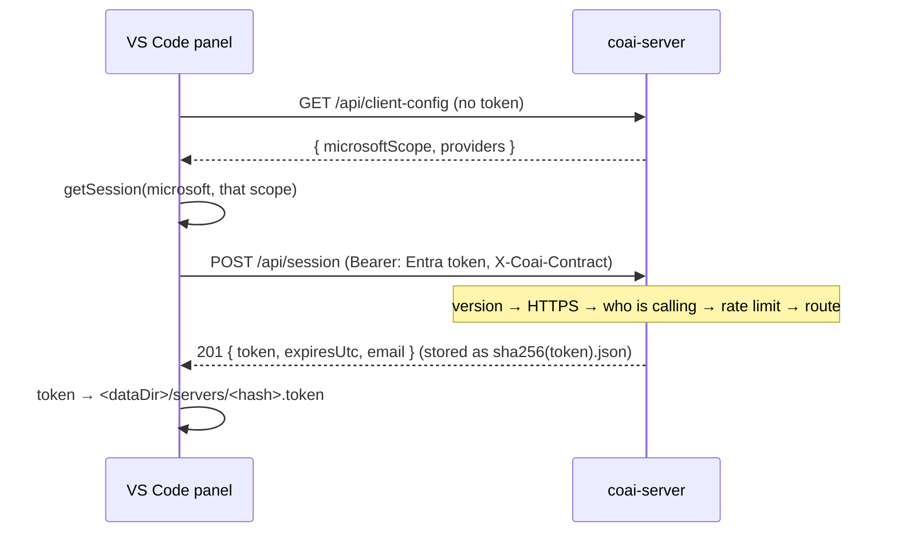
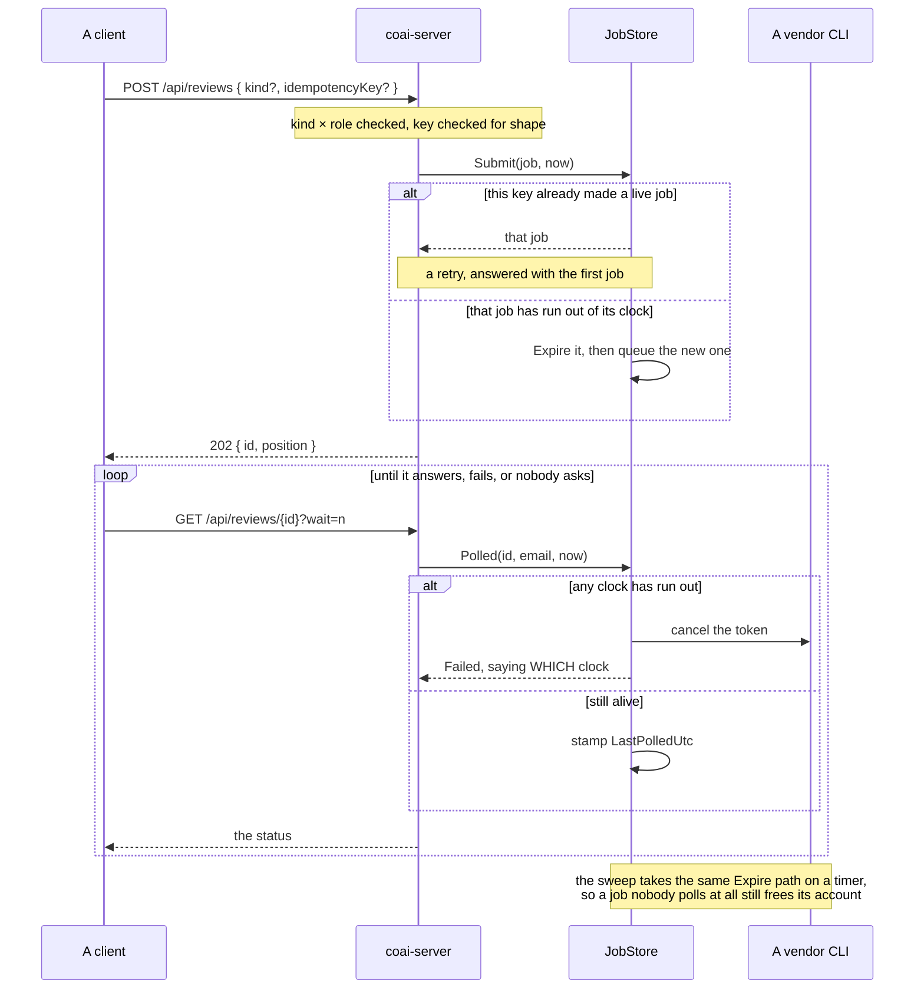

# module: team server — one subscription per vendor, shared behind company sign-in

> `src_server/` — `coai-server`, a .NET 10 minimal API on the CredsForDevs VM. A company buys one
> Codex, one Antigravity and one Claude subscription, signs each CLI in once on that machine, and
> everybody's `coai-mcp` sends its review prompts there instead of running a CLI locally.
>
> Plan: [PLAN_team_server.md](PLAN_team_server.md). **Stories 2.1 and 2.2 are what
> exists today**: the host, its authentication and its sessions (2.1); the vendor catalog, the
> account slots and `login` (2.2); the job queue, the runner and the review endpoints (2.3); and what
> the team is spending, with the admin view (2.4). **Epic 2 is complete.** The panel that drives it
> is epic 3; the container and the release are epic 4.

## Purpose

Answer three questions for a person who has signed in with the company's Microsoft account: who
they are, what their client needs to sign in with, and a token their `coai-mcp` can carry — since
that process is started by an MCP client and has no Microsoft session of its own.

## The pipeline, in the order it runs



And one job, from the submit to whichever way it ends — the two paths added on 2026-09-09 marked:



**The order is the design**, and each step is a defect somebody already paid for:

| Step | Why it is there, and why it is HERE |
|---|---|
| `X-Coai-Contract` judged first | an old client is told to update (426) rather than handed a 401 about a token that was never the problem. The mechanism has to exist BEFORE the first breaking change or it never usefully exists: the day a shape moves, the old clients are already in the field with no way to say what they speak |
| forwarded-HTTPS check | a request without `X-Forwarded-Proto` did not come through the proxy, so a MISSING header is treated exactly like a plaintext one. The vault shipped the other way round once and omitting the header was a one-line bypass. `/api/health` is the one exemption — the container's own probe has no proxy in front of it |
| the caller resolved | nothing else populates `ctx.User`: there is no default scheme and no `UseAuthentication`. This step AUTHENTICATES; `CallerFilter` then authorises per route |
| the rate limiter | …which is why it can partition on the EMAIL. Behind a reverse proxy the remote address is the proxy's for everyone alive, and the vault was found live in exactly that state — one busy client throttling the entire company |
| the routes, behind `CallerFilter` | one gate for every authorised route. A handler receives a `Caller`, which it can only get if its route was registered with `RequireCaller` — so the check cannot be forgotten into a route that answers 200 to anybody |
| the fallback | anything that is not `/api/…` does not exist here |

### The routes that exist today

| Route | Auth | Answers |
|---|---|---|
| `GET /api/health` | none | `{ok, version}` — the container's own probe, which has no proxy in front of it |
| `GET /api/client-config` | none | `{microsoftScope, providers}` — the caller has no token yet, and a client id is public by construction |
| `POST /api/session` | IdP token only | `201 {token, expiresUtc, email}`; a session may not mint another |
| `DELETE /api/session` | any | `204`; `400` for an IdP token, `500` when the file would not go |
| `GET /api/whoami` | any | `{email, name, isAdmin}` |
| `GET /api/catalog` | any | the allowlist, each CLI's presence, and the account counts |
| `POST /api/reviews` | any | `202 {id, position}` · `400` naming the allowed vendors/models/**kinds** · `409` an idempotency key reused for a different request · `429 + Retry-After` over the queued cap |
| `GET /api/reviews/{id}?wait=<=25` | owner | the status, and the vendor's RAW answer · `403` somebody else's · `404` unknown or lost. **A read that writes**: the poll is the only evidence anybody is still listening, so it stamps `LastPolledUtc` |
| `DELETE /api/reviews/{id}` | owner | `204` |
| `GET /api/usage?window=&scope=` | any / **admins for `company`** | per-vendor totals for the caller, or for everyone plus per person, **and per kind** · `400` unknown window · `403` company as a non-admin |

**Every route that has a caller reads its credential from `Authorization: Bearer …` and from
nowhere else** — `Auth.Bearer` looks at that header, and no handler here reads a token out of a
request body. The two anonymous routes above (`/api/health`, `/api/client-config`) have no
credential to read at all, deliberately: a client that has not signed in yet must be able to ask
this server what it wants.
`POST /api/session` is the one people expect to be different, because it is where a session begins;
it is not.

> **How that was learned, 2026-09-07.** Extension 0.31.1 posted the Microsoft token as
> `{ token }` in the body of `POST /api/session`. `RequireCaller` then found no identity and
> answered **401 — before any JWT scheme ran**, which makes this failure hard to read from either
> end: the panel can only say *the server answered 401*, because the challenge carries no body, and
> the journal shows `401 0 null 0.68ms` with **no `JwtBearerHandler` line at all**. The absence of
> that line is the diagnostic: a token that is examined and rejected always logs `IDX…`, and takes
> milliseconds rather than fractions of one. Both halves of the contract had passing tests — the
> server's posting a header and a null body, the extension's asserting the token was in the body —
> and nothing crossed between them.

**An admin is shown the release line, and cannot act on it from here.** The *Team servers* row
carries one more sentence for a caller the catalog marks `isAdmin`: what the newest published
`server-v*` release is, with a `⬆` when it is newer than the version this server reports. Read-only
on purpose — a Team server is DEPLOYED rather than downloaded, so an Update button would mean this
panel touching somebody else's machine, and the request was to show it.

Silent in three states, each of which would otherwise be a sentence teaching nothing: the caller is
not an admin, the server has not said its version yet, or no `server-v*` release exists — which is
the ordinary state today, since the deployment was made by hand and the release line has never been
cut. `latestTeamServerVersion` and the coai-mcp lookup share one tag list, one half-hour clock and
one comparator; the tag PREFIX is the only difference, and it is a parameter rather than a second
copy of the filter.

**The `Local` scheme and a real provider cannot both be configured.** `Startup.Guard` refuses to
start when `Auth:Local:SigningKey` is set alongside a Microsoft tenant or Google: that scheme signs
identities with a shared secret, so beside a real provider it is an identity bypass — anyone with
the key is anyone in an allowed domain. It exists for the tests and for an air-gapped deployment,
and now the server enforces the boundary instead of a comment describing it.

**Something crosses between them now.** `npm run test:contract` in `src_vs_code` drives the
extension's own `createSession` and `ask` against a real instance of this server and asserts the
whole handshake: `201` for a session, the issued token accepted on a later call, and `403` — not
`401` — for an account outside the allowed domain. It needs no Microsoft: this server's symmetric
`Local` scheme (`Auth:Local:SigningKey`, issuer `coai-local`) exists for exactly this, and the
test mints a token for it in fifteen lines of `node:crypto`.

`scripts/run-contract.mjs` starts the built server on a loopback port with a throwaway
`Coai__DataDir` — or steps aside when `COAI_CONTRACT_URL` points at one you are already running,
which is how the `deploy/docker-compose.yml` stack serves the same suite locally. CI runs it in
`build · test · family checks`, the job that has already compiled this server. See
[PLAN_contract_across_the_seam.md](PLAN_contract_across_the_seam.md) for why the container was the
wrong choice *for CI* and the right one everywhere else.

## Core entities

| Type | File | Role |
|---|---|---|
| `Auth` | `src/Auth.cs` | the three JwtBearer schemes (Microsoft by tenant OIDC, Google, Local HMAC) and `AuthenticateAnyAsync`, which tries the SESSION first — a hash lookup before three signature validations — then each configured scheme. `RequireCaller` is the single gate: 401 without an identity, 403 outside the company |
| `TokenIdentity` | `src/TokenIdentity.cs` | mirrored verbatim from the vault: the email comes from a verified token and never from a request; `email_verified:false` is refused; the domain allow-list decides |
| `SessionStore`, `SessionRecord` | `src/Sessions.cs` | server tokens, stored under `sha256(token).json` so the raw token is never written; every write atomic (temp + rename); expiry ABSOLUTE from issue |
| `SessionEndpoints` | `src/SessionEndpoints.cs` | mint, revoke, `whoami` |
| `Startup` | `src/Startup.cs` | the states this server refuses to start in |
| `ContractVersion` | `src/ContractVersion.cs` | mirrored; `X-Coai-Contract`, this product's own version line |
| `ServerJsonContext` | `src/ServerJsonContext.cs` | every serialised shape, source-generated — reflection is off |
| `JsonFileStore` | `src/JsonFileStore.cs` | one atomic read/write/delete for every small JSON file here — the session store's own write path, extracted when the slot state needed exactly it |
| `CallerFilter`, `Caller` | `src/CallerFilter.cs` | the single authorisation gate; a handler can only ask who is calling if its route was registered with `RequireCaller` |
| `VendorConfig`, `VendorCatalog`, `VendorCatalogHost` | `src/Vendors/` | `vendors.json`: the model allowlist, its validation, and its content-hash reload |
| `AccountSlot`, `SlotSelector` | `src/Slots/AccountSlot.cs` | one account's state, and which account the next job goes to |
| `SlotEnvironment` | `src/Slots/SlotEnvironment.cs` | the variables that make one launch use one account and see no other |
| `CooldownParser` | `src/Slots/CooldownParser.cs` | the vendor's own rate-limit sentence → an instant |
| `SlotRegistry`, `SlotLease` | `src/Slots/SlotRegistry.cs` | the cross-process lock and the persisted per-account state |
| `VendorLogin` | `src/Slots/VendorLogin.cs` | `coai-server login <vendor> <slot>` — the only interactive path |
| `CatalogEndpoints`, `VendorHealthCache` | `src/Vendors/CatalogEndpoints.cs` | `GET /api/catalog`, and the 60 s cache that stops a poll launching a CLI per request |
| `ReviewAttempt`, `ReviewLauncher` | `src/Jobs/ReviewLauncher.cs` | what one launch came back with, and the seam that produces it. `ReviewAttempt` is a **closed two-shape union** — `Answered(Raw, TokensIn, TokensOut)` or `Failed(Outcome)` — see *A review that succeeds* below for why the shape is the whole point |
| `JobRunner` | `src/Jobs/JobRunner.cs` | claims a slot, runs the launcher, maps the attempt to a terminal `JobRecord` and writes the usage line |

## The decisions a reader needs

### A review that succeeds — three defects, each hidden by the one in front of it (2026-09-07)

Until this date the Team server had **never completed a single review**. `data/usage.jsonl` held two
lines, weeks apart, both `outcome: NotStarted`, while the vendor's own CLI transcript beside each one
showed a complete valid answer. `systemctl is-active` and `/api/health` were green throughout.

Nobody had noticed because nothing ever reached the server: the extension never wrote `remoteVendor`
into its settings file, so every Team-server reviewer was excluded from every round before a request
was made ([PLAN_team_server_reviewer_never_called.md](PLAN_team_server_reviewer_never_called.md)).
Fixing that exposed the next defect, and fixing that one exposed the third.

**1. Success was not representable.** `ReviewerExecutor.LaunchAsync` reports a good run by returning
*no* terminal outcome — `ReviewerLaunch.Terminal` is null exactly when the process ran and exited
zero, and its docstring says so. `ReviewLauncher` read that null as an absence of information and
substituted `NotStarted("the executor returned no verdict")`, so `JobRunner.Record`'s success arm — a
`_` fallthrough — was **unreachable for the life of the server**.

It survived 171 green tests because the only thing that ever produced the success shape was the
suite's own fake launcher, handing the runner a `ReviewerOutcome.Ok(null!, …)` the real launcher
cannot construct: it holds the vendor's raw text, never a parsed review. Each side was green against
itself — the failure class `.claude/rules/shared/common/testing.md` names.

The fix is the TYPE. `ReviewAttempt` became `Answered | Failed`, so an `Answered` cannot be built
without an answer and the compiler names every site that must choose. A clean exit with no answer is
`Unparseable`, not `NotStarted`: the CLI *did* start, and saying otherwise sends a reader to look at
accounts and sign-ins. "Empty" means whitespace on the raw ANSWER text — the vendor's own adapter has
already lifted it out of its envelope, so this server still has no parser, and `{"findings":[]}` is a
real answer that travels as one.

**2. The schema file was named but never written.** `ReviewLauncher` handed `runtime.Build` a schema
PATH and never created the file. Claude's adapter needs none — it puts the shape in the prompt — so
claude alone appeared to work while codex and antigravity failed the instant their CLI opened the
path: `Failed to read output schema file /tmp/coai-server-job-*/schema.json`. The writer already
existed as `SchemaFile.Ensure` in the MCP binary, which this server cannot reference, so it **moved
to `CoaiMcp.Core.Findings`** rather than being written a second time. One writer, one file name, both
binaries.

**3. The reason never reached the person** — a client-side defect, but it is what made the first two
so hard to see. See `ReviewerSummaryFactory` and `RemoteAsk.IsProgress` in the runners module.

**What this leaves behind for anyone deploying:** a release is proved by a real review, never by
`is-active`. [`deploy/systemd-release.sh`](../deploy/systemd-release.sh) submits one per vendor in
`vendors.json` and rolls itself back if any of them does not reach `done` with a non-empty answer —
and it asks about *every* vendor precisely because a canary that asked only about claude would still
have missed defect 2.

**The contract is read in both directions now (2026-09-09).** `ContractVersion` puts
`X-Coai-Contract` on every response for a stated reason — "a newer client knows what it is doing
better than an older server does, and its own check against the response header is the right place
to decide" — and until this landed the panel sent its own number and threw the answer away. The one
direction that worked was the server refusing a client as too old (426); a panel talking to a server
too old for IT had no idea.

`ask()` now records it on BOTH arms of `ServerResult`, which matters most on the failure arm: a 426
is precisely the moment a caller wants to know what the other side speaks. Three states, and the last
two are not the same thing — a number is what it answered with, `0` is a server that ANSWERED and
named nothing, and `undefined` is not knowing: no response arrived, or what arrived was not a number.
`panelProvider` keeps the last known value through an `undefined`, so a dropped connection cannot
report a healthy server as ancient.

`SERVER_CONTRACT_REQUIRED` in `teamServerApi.ts` is the mirror of the server's
`Coai:MinimumClientContract` and carries the same rule: raise it only when an older server would be
MISREAD, never because a newer one exists. `contractNote` says so in the row when it is true and
stays silent otherwise — and it REPORTS rather than refuses, because a panel that stopped talking to
a server it merely suspects would turn a warning into an outage, which is the failure the server's
own comment refuses for the mirror case.

**And who is allowed to run it (2026-09-09).** CI reaches this host through a key carrying a
**forced command** — `restrict,command="/opt/coai/src/deploy/coai-deploy-cmd.sh"` — so the key can
start nothing else: no shell, no pty, no forwarding, no `scp`. The wrapper honours exactly
`deploy <version>`, `deploy --rollback` and `health`, validates the version on the server side
before it reaches any command line, and refuses everything else with exit 90. The model is the one
`dew_flow_creds_for_devs` has used on this same box since it shipped; ConnectOtherAIs deployed over
an unrestricted root key until this landed, and never needed to.

Two consequences worth naming, because both were defects before they were design:

- **The wrapper pulls before it runs**, so the release script on the host can never be older than
  the workflow calling it. The first real CI deploy died on `unknown option '--from'` for exactly
  that reason — the checkout was three commits behind. Tracked local modifications are discarded on
  the way, because the only ones this host ever collected were a hand `chmod +x` working around a
  file committed non-executable, and a pull that aborts on them breaks every future deploy.
- **The forced command names the file in the checkout**, not a copy under `/root`. A copy would have
  been a second thing to keep in step — the same shape of defect, one level up.


### Story 1.3 — the client half, and the two failures only a real server showed

The client is `coai-mcp` speaking to the server as an ordinary vendor. `RemoteRuntime` builds a command
line, `--ask-remote` does the HTTP, and everything above the adapter — the round, the scheduler, the
ledger, the panel — sees a reviewer like any other. The shape is `LocalRuntime`'s, reused rather than
invented; the decisions specific to it live in [module_runners.md](module_runners.md).

What this story changed about the SERVER's contract: nothing. What it proved about it: two things, and
neither was visible from either side alone.

- **The two clocks are a contract, not an implementation detail.** `POST /api/reviews` clamps
  `timeoutSeconds` to 30–1800 — the VENDOR's budget, per story 2.3's split of the queue clock from the
  run clock. The shim's own deadline is a different, shorter number, and sending it as the vendor's
  budget asked the server for an eight-second review and earned a `400` naming the range. The two are
  now separate flags on the shim's command line.
- **A client that is killed must still be able to cancel.** `DELETE /api/reviews/{id}` was built in 2.3
  for a client that changes its mind; the case that actually matters is a client that never gets the
  chance. The executor kills an abandoned reviewer, a killed process runs no cleanup, and the review
  then runs to completion on the company's subscription for an answer nobody will collect. The shim
  writes its job id to a file the moment the server accepts, and the parent cancels from that file
  afterwards. **Two things about that `DELETE` are contract facts, not client details:** it must carry
  `X-Coai-Contract`, which the server judges before the token and without which it answers `426`; and
  a client that cannot reach the server must KEEP its claim, because the server's queue deadline is
  slow and the claim is the only thing that can stop the job sooner.
- **`timeoutSeconds` is clamped by the client to the server's own 30..1800.** The range is the
  server's, and a person setting an eight-second reviewer timeout is not asking for a broken review —
  they are asking to wait less. So the client sends a budget the server will accept and enforces the
  shorter wait itself.

`GET /api/catalog` turns out to answer a second question for free. It was specified as the allowlist
feed for *Add a reviewer*; it is also the only honest health probe a remote vendor has, because the
server already counts its slots for its own queue. So a Team-server vendor's row in `providers` reads
*2 of 3 accounts ready on the Team server at …* — and, when nothing is ready, says whether the accounts
are **signed out** (the operator must act) or **rate-limited** (they return by themselves). A client
cannot compute either, and both were already on the wire.

**Deferred deliberately:** the extension's declaration points (`models.ts` RUNTIMES, `vendors.ts`, the
`package.json` enum) are story 3.1's. Shipping them now would put a `remote` option in the panel that
nobody can configure — no server URL field, no sign-in, no token — so every reviewer it created would
exit `77 not signed in`. An accepted finding from the code round said so.

### Epic 3 — the panel, and the three things it had to be told

The extension's half: a **Team servers** section, adding a reviewer from a server's catalog, and
what each server says was spent on it. `teamServers.ts` is pure, `teamServerApi.ts` is the wire,
`teamServerAuth.ts` is the half that touches `vscode` and the disk, `teamServerView.ts` is the
markup. Everything except the last is testable in plain Node, which is why the security decisions
below are assertions rather than comments.

**One URL, one token file — asserted from both languages.** The extension WRITES the token and the
MCP shim READS it, each deriving the path independently: TypeScript's `URL` here, .NET's `Uri`
there. Isolated tests on each side cannot see a divergence, because each side is self-consistent;
the failure appears only as somebody signing in successfully and being told they are not signed in
one second later. So the vectors live in `shared/team-server-url-vectors.json` and BOTH suites
assert them — 38 C# assertions and their TypeScript twins. Two reviewers raised it independently on
the plan round, and the two languages turned out to already agree on every vector.

**A row's id and the server's name for a vendor are two different things.** Rows are
`<serverId>-<vendor>` so two Team servers each offering `codex` do not collide, and the id names the
row, its spending history and its vault key. The server knows only `codex`. `remoteVendor` carries
that, all the way to `--vendor`. Without it every Team-server review would have been refused on
arrival and reported as a vendor the server "does not offer" — which reads exactly like a typo.

**And for its first two releases it did not carry it.** `VendorDto.RemoteVendor` and
`VendorIdentity.VendorOnServer` shipped with epic 3 and nothing filled them: `vendorsEnv` in
`src_vs_code/src/vendors.ts` wrote `id`, `runtime`, `model`, `baseUrl` and the two stage flags, and
the field the whole seam exists for was never in the JSON. Both halves' tests passed, because each
half was self-consistent — the C# side parsed a field the TypeScript side never sent, and no test
anywhere asserted the crossing. `PLAN_team_server.md:401` had named `vendorsEnv` as a site to change
and `:712` had asked for the `settingsReach` test; neither was done, and nothing failed to say so.
Fixed 2026-09-07 with the assertion on both sides — `settingsReach.test.ts` for what is written,
`VendorRuntimeSurvivesParsingTests.ATeamServerRowReachesTheAdapterUnderTheServersOwnNameForIt` for
what is read. `teamServerId` deliberately does not cross: the server has no field for it and no
question it answers.

**And a row that still has no name for its server says so, instead of reading as a typo.** When the
catalog does not list what was asked for, `RemoteProbe.NotOffered` now adds — only when the row
recorded no `remoteVendor` — that its own id was used as the name and that a row from a Team server
should be removed and added again. It does NOT claim the id was never typed: `VendorIdentity`
falls back to the id, which is right for a hand-written row somebody called `codex`, and nothing at
the probe can tell that apart from a generated `remsoftdev-claude`. The first draft of the sentence
did claim it, and the repository's own test for the plain message was the fixture that refuted it.

**A sign-in belongs to a SIDE of the machine, not to the machine.** The token file is per side
already — `coaiDataDir()` is a path on whichever extension host is running — so the record that
describes it is too, and the panel renders THAT rather than the shared intention. With settings
shared, a WSL window opened after a Windows sign-in mints its own token from the shared record
without asking anybody, and no token crosses between the two filesystems; with the sides separated,
each can hold a different account. A sign-out stamps the moment, and every other side under the same
record signs itself out on its next refresh — otherwise signing out on Windows left a usable token
inside the distro and a live session on the server. The whole rule is one pure function,
`sessionAction`; see [module_extension.md](module_extension.md).

**The server id is generated once and never rewritten.** Not the display name, which is editable, and
not the URL, which can be corrected after a typo: either would orphan every reviewer row the first
time somebody changed it.

**An advertised scope is a trust boundary, not a shape.** A person adds a server by typing a URL, so
a hostile one could otherwise advertise any scope and have the extension mint a Microsoft token for
it and post it straight back. Two things are pinned: the resource must be `api://<guid>` — never a
Graph scope — and the permission must be exactly `coai.access`. The application id is still the
server's to choose, so the first sign-in to a given server asks the person to confirm it, once.
Entra's own consent screen is the second backstop, not a substitute.

**Silent renewal is silent.** `clearSessionPreference` forces an account prompt and `createIfNone:
false` forbids showing one, so the pair the plan originally specified could only ever return
nothing — and the extension would have read that as an expired identity session and signed people
out. Weekly. Which is the exact thing silent renewal exists to prevent.

**A sign-in that half worked is undone.** If the session is created but the token cannot be written,
the session is DELETED again: otherwise a live session exists on the server that this machine can
neither use nor revoke. Signing out is best effort against the SERVER — one that is down must not
keep somebody signed in locally — and NOT best effort against the disk, where a surviving token is a
usable credential and its path is named.

**Removing a server deals with what pointed at it**: it signs out first, then names the reviewer rows
that cannot work without it and lets the person choose, because those rows carry spending history.

**Nothing renders from the network.** The panel draws from what was last learned and a fetch
repaints when it lands; every request carries an `AbortController` deadline, and a refusal, a
timeout and a dropped connection are all answers rather than exceptions thrown into a render. A
catalog that could not be re-fetched is shown as STALE rather than as absent.

### Story 2.1 — identity and sessions

- **A session is minted from an identity provider's token and never from another session.** A token
  that could mint its own successor would never expire, which is the one property a deadline exists
  to give it.
- **The deadline is absolute, not sliding.** A session that renewed itself on use would let a stolen
  token live for as long as the thief kept using it. The panel re-mints silently before it passes,
  so nobody is logged out by it. `LastUsedUtc` is informational and written back at most hourly —
  the alternative is a disk write per request for a field that decides nothing, and a long poll asks
  every twenty-five seconds.
- **The domain is re-checked on every request, not only at sign-in.** The session's principal
  carries the email as an ordinary claim, so `RequireCaller` applies the allow-list to a session
  exactly as to a token. Without this, somebody whose domain is removed keeps a week of access to
  the company's paid subscriptions.
- **A Microsoft tenant with no audience refuses to START** — stricter than the vault, which only
  warns. That server predates its own app registration and had deployments without one; this server
  mints sessions, so an unchecked audience means any token issued to anyone in the tenant for any
  other application buys a seven-day pass. The registration exists from day one, so there is nothing
  to be lenient about.
- **`DELETE /api/session` refuses an identity provider's token** rather than answering 204. A
  stateless token is not this server's to withdraw, and saying 204 would tell a person a credential
  was revoked when nothing was.
- **`DELETE` answers 500 when the file would not go.** A revoke that reports 204 over a failed
  delete tells a person their credential was withdrawn while a stolen bearer goes on working until
  it expires — the one lie a revoke endpoint must not tell. `SessionStore.Revoke` returns whether it
  happened, and "already gone" counts as gone.
- **`X-Forwarded-*` is trusted from loopback and the private ranges only.** An earlier draft cleared
  the list, which trusts those headers from anybody who can reach the socket: a direct caller could
  send `X-Forwarded-Proto: https` and walk past the HTTPS check, or forge `X-Forwarded-For` and move
  into another person's rate-limit partition. `Coai:TrustedProxies` overrides it, all or nothing —
  a half-read list is a trust boundary nobody wrote, and it would fail open.
- **A swallowed filesystem failure is still reported.** An unreadable session and an unknown one are
  the same 401 to a caller and completely different things to an operator; the store takes a
  callback and the host logs it.
- **The raw token is never stored.** The file is named by its SHA-256, so a stolen data directory
  reveals which emails have sessions and nothing anyone could authenticate with.

### Story 2.2 — the vendors and the accounts

- **Concurrency on an account is an INVARIANT, not a setting.** The draft had `slotConcurrency` in
  `vendors.json`, defaulting to 1. It is gone: every one of these CLIs rewrites its own OAuth token
  on rotation, so two processes on one account race and the loser gets `invalid_grant` — the account
  is signed out until a human returns to the VM. An option whose only safe value is its default is a
  loaded gun with a note on it.
- **The lock is a file handle, because the other holder is another process.** A review runs inside
  the server; `login` arrives as `docker compose exec`. `FileShare.None` is kernel-enforced across
  processes and released when the handle closes — including on a kill — which is the same exclusion
  `EngineLease` already uses for the GPU. A leftover `.lock` FILE blocks nothing; only the handle
  carries the lock. An age threshold was proposed on the plan round and declined: it would break a
  lock whose holder is alive and working, which is precisely the race this prevents. The bounded
  wait (`Coai:LoginWaitSeconds`, default 2 min) is what makes a genuinely hung review visible.
- **Health is about the BINARY; usability is about the ACCOUNTS.** `VendorProbe` runs the CLI with
  the server's environment, not any slot's `HOME`, so it can only answer "is it installed". If it
  were allowed to imply authentication, a vendor whose every account was signed out would show
  healthy while every job failed. The two never mix, and the test asserts the separation rather than
  a value — so it does not depend on whether the developer happens to have codex installed.
- **`needs sign-in` is not a cooldown.** A cooldown clears itself by the passage of time; being
  signed out never does. They are separate fields with separate cures, and the catalog's counts and
  `SlotSelector.Explain` say which applies — "try again in an hour" and "nobody will ever try
  again" must not look the same.
- **A bad `vendors.json` keeps the previous allowlist AND says so on the catalog.** Emptying the
  allowlist on a typo refuses every review, which looks like an outage with no error. But keeping the
  old one means disk and behaviour disagree, so the reason travels in `CatalogDto.Error` — visible on
  the screen the operator is already looking at, not only in a log on a box they must SSH into.
- **The reload token is a content hash.** A same-size replacement inside the filesystem's timestamp
  resolution leaves a metadata stamp unchanged, and the operator would conclude hot reload is broken.
  The file is read ONCE and hashed from those same bytes, so the host can never remember a token for
  content it did not parse. A UTF-8 BOM is skipped — several editors write one, and the reward for
  using Notepad was `'0xEF' is an invalid start of a value`.
- **Isolation is more than `HOME`.** `XDG_CONFIG_HOME`, `XDG_DATA_HOME`, `XDG_CACHE_HOME` and
  `XDG_STATE_HOME` are redirected into the slot as well. Tools that store state under those read them
  from the ambient environment when unset, so two slots would share one config directory and the
  second sign-in would overwrite the first. For `antigravity`, which has no directory variable of its
  own, these ARE the whole isolation.
- **What a job can reach: its prompt, its account, its own directory — and nothing else** (story 2.2
  of [PLAN_a_reviewer_on_the_team_server_is_confined_to_its_prompt.md](PLAN_a_reviewer_on_the_team_server_is_confined_to_its_prompt.md),
  2026-09-11). A job is one authorised employee's arbitrary prompt run through an agentic CLI on the
  box that holds every shared account, as root, and the finding text goes back to that employee
  verbatim. So `ReviewLauncher` launches every reviewer confined, and it does so through ONE step
  (`Confined`) reading ONE value (`Confinement.OfEveryJob`), from which both halves are derived: the
  adapter's — `ReviewerSettings.Confined`, so claude's `--disallowedTools` names `Bash`, `Read`,
  `Glob`, `Grep`, `WebFetch`, `WebSearch`, `Task` and `Agent` beside the write tools — and the
  launcher's — `ProcessRequest.InheritsEnvironment = false`, so the child starts from
  `ProcessEnvironment.Passthrough` rather than from the server's process, where `/etc/coai-server.env`
  lives. Two flags on two types that never meet was epic 1's accepted Major (codex): set one and miss
  the other and you have an isolated environment with a shell, or the reverse, and both look
  confined. The slot's own variables are applied last and still arrive, so confinement takes nothing
  from the account isolation above; and `TMPDIR`, `TMP` and `TEMP` are set to the job's own
  `coai-server-job-…` directory (gemini, Major) — the allowlist passes them through, and on a shared
  box as root that is one `/tmp` for every job and the host's sockets. The directory is deleted in
  the same `finally`, so nothing a reviewer writes there outlives the job. The retry the finding
  assumed does not exist in this binary: the launcher makes ONE launch (`LaunchAsync`, no repair),
  and the server's own retry is the runner requeueing onto another account, which re-enters the same
  step. What the suite asserts is what is SENT — `ReviewLauncherTests` reads both halves off the
  launched request, `ConfinementTests` holds the derivation — and whether the installed CLI accepts
  that argv is observable only on the box, which is `POST_DEPLOY.md` item 12. Codex and antigravity
  take no new flag; what their sandboxes leave open, reads, is
  [PLAN_team_server_unprivileged.md](../todo/PLAN_team_server_unprivileged.md)'s to close.
- **The cooldown guess errs LONG.** Waiting too long costs one queued review some latency; retrying
  too early spends quota against a live limit, which on some plans extends it. So an unzoned time is
  never allowed to resolve to less than the 30-minute fallback, repeats double to a 5 h ceiling, and
  every pattern in the parser matches a line somebody actually captured from the VM.
- **`login` is attached to the terminal, and is the ONE thing here that does not use
  `ProcessLauncher`.** That launcher redirects stdout, stderr and stdin, which is right for
  everything that wants output as a string — and fatal for a sign-in, which prints a URL and a code
  and then waits for a person. Captured, the operator saw nothing and the CLI read EOF from a closed
  stdin: the one interactive command in the product was the one command that could not be used.
  `InteractiveProcess` starts the child with every redirection off. Widening `ProcessLauncher` with a
  "do not redirect" flag was the alternative and is worse — its whole return type is
  `StdOut`/`StdErr`, and a mode where both are empty by construction is a shape that lies.
- **The lease writes state BEFORE it releases the lock.** The other order leaves a window in which
  another process takes the account, reads the state and writes it back while this lease is still
  about to write its own — and the later write silently overwrites whatever the other just recorded,
  which could be a fresh cooldown or a needs-sign-in. The account would then look ready and be picked
  again immediately: the exact outcome the lock exists to prevent. The release is in a `finally`, and
  the state write cannot throw out of a `Dispose`.
- **The vendor `id` is validated as a path segment, exactly as a slot name is.** It becomes a
  directory under `accounts/`, so `"id": "../shared"` would have created directories and written
  OAuth credentials outside the data root. The slot names were checked from the first draft and the
  id simply was not.
- **Every swallowed filesystem failure is reported.** A chmod that could not be applied still leaves
  credentials readable by other users on the host; a token file that exists but cannot be read is
  indistinguishable from an absent one unless somebody says so — and `login` would start an
  interactive sign-in for an account that already had a perfectly good token. Both now name the path
  in the log. Refusing to SERVE over a failed chmod was proposed and declined: this process may not
  own the mode of a bind-mounted volume, and a server that will not start is worse than a loud one.
- **Probes are cached per RUNTIME and run in parallel.** One global semaphore made every catalog
  request wait behind whichever probe was running — including requests for other vendors and ones
  whose answer was already cached — and the vendors were probed one after another, so ten vendors
  meant ten sequential process launches before the endpoint answered.

- **A handler needs a second parameter.** A lambda whose only parameter is `HttpContext` is treated
  as a `RequestDelegate`, whose return value is discarded — the catalog answered 200 with an empty
  body until it took a `CancellationToken` too. Found by its own tests.

### Story 2.3 — the jobs

- **Queueing and running are different clocks, and conflating them was a real bug.** The draft
  stamped one deadline at submit. With a global concurrency of one, the second job of a pair then
  arrived at its account with almost no time left — or expired having never run at all. So a queued
  job is judged on how long it has WAITED (`Coai:QueueWaitMinutes`, 10 by default) and a running one
  on how long it has RUN, from the moment it started.
- **The server owns both deadlines, not the client.** A client that is killed, sleeps or loses its
  network stops costing anything: its queued job is discarded BEFORE it is ever handed an account.
  Without that, an abandoned review wins a slot ten minutes later and spends the team's subscription
  on an answer nobody collects. `DELETE` is the polite path; the deadline is the one that holds when
  the client is gone.
- **Cancelling is atomic with dispatch.** `Cancel` and `TryClaim` take the same lock, so a `204` can
  never be followed by a launch. Telling somebody their review was cancelled and then paying for it
  is the one outcome a cancel must not produce.
- **The id carries the server run**, so a poll after a restart says `lost` rather than `unknown` —
  opposite instructions for a client. An epoch that does not parse, or is not strictly earlier than
  this run's, is `unknown`: `lost` is what makes automated clients start recovery, so a typo or a
  skewed clock must not produce it.
- **Somebody else's review answers 403, not 404.** Hiding existence was the first draft and two
  reviewers argued the same thing against it: every caller is an authenticated member of one company
  and an id is an unguessable `<epoch>-<guid>`, so confirming existence leaks nothing worth having,
  while hiding it left a person chasing a missing review unable to tell a mistyped id from a dropped
  job.
- **Two caps, counting different things.** `Coai:PerCallerQueued` (20) is how many of your reviews
  may WAIT — the next is refused with `429` and a `Retry-After`, because a queue nobody drains just
  holds other people's turn. `Coai:PerCallerRunning` (3) is how many may be on a vendor at once —
  exceeding it refuses nothing, it leaves the job queued.
- **A poll of a FINISHED review returns at once**, whatever `wait` says. Waiting for a change that
  already happened is how a client reconnecting after a blip stares at an answer the server already
  has for twenty-five seconds.
- **Every path ends in a terminal state.** The six vendor outcomes describe what the VENDOR does; a
  broad catch covers what the machinery does, because a job stuck `Running` is a caller polling for
  ever and an account nobody releases.
- **The sweep is on a timer, not an event.** An event-driven deadline is only checked when something
  happens, so a running job whose deadline passes on an idle server would keep going and keep
  spending.
- **The server returns the vendor's RAW answer.** Parsing, repair and de-duplication stay in the
  client, so the same parser does not exist twice and drift.
- **A cancel STOPS the vendor, it does not merely relabel the record.** Each running job registers a
  cancellation source in the store, and the same call that ends the record fires it. Without that the
  API reported `cancelled` while the CLI went on running, went on spending against the account, and
  held the slot the whole time.
- **A rate-limited account is parked and the review moves to the NEXT one.** Failing outright told a
  caller "rate limited" while a second signed-in account sat idle, which defeats the point of
  configuring more than one. Only when no account can take it does the review fail, carrying the
  vendor's own sentence.
- **Waiters are per job.** One shared list is woken by every submit and finish anywhere on the
  server, so a client polling its own queued review returned in milliseconds because a stranger's job
  moved — a long poll that had quietly become a busy poll, and a busy poll runs into the rate limiter.
- **An out-of-range `timeoutSeconds` and an unknown role are REFUSED naming the legal values**, not
  clamped or silently substituted. Somebody who asked for five seconds and got thirty draws the wrong
  conclusion from the result; a review that ran under a role nobody asked for looks like a normal one.
- **`lost` requires the whole id shape**, epoch and GUID. `123-typo` has an old-looking prefix, and
  `lost` is the answer that tells an automated client to resubmit — reporting it for an id nobody
  ever issued is how a typo turns into duplicate vendor spend.
- **The pump drains rather than ticking.** Starting one review per vendor per second left nine of ten
  free accounts idle while a queue backed up; it keeps starting while the vendor keeps saying yes, and
  the slot lock is what stops it. **What it does NOT yet do is use a second account** — measured
  2026-09-09: the drain ends at the first refused acquire, and `SlotSelector.Pick` returns the one
  least-recently-used ready account, whose `LastUsedUtc` is only written when its lease is RELEASED.
  So a busy account stays first in the ranking and is offered again, and a vendor runs one review at a
  time however many accounts it has. Nil effect on this deployment, which has one slot per vendor, and
  total on the day a second is signed in. Deliberately not fixed (the operator, 2026-09-11):
  [../todo/PLAN_the_second_account_actually_runs.md](../todo/PLAN_the_second_account_actually_runs.md).
- **A job's cancellation source is fired on cancel and disposed on FINISH, never both at once.**
  Cancelling and disposing in one breath meant the runner was awaiting on a token whose source had
  gone, so an ordinary cancellation surfaced as an `ObjectDisposedException` and was reported as
  "the server could not run this review".
- **Rotation is bounded by the accounts that have already refused**, not by the queue clock alone. A
  job whose vendor is saturated would otherwise cycle its accounts for the whole ten-minute window,
  re-asking ones it already knew were exhausted — failing either way, the only difference being how
  long the caller waited to be told.
- **The drain is bounded by the account count.** One tick starts at most as many reviews as the
  vendor has accounts, because that is the most that can run at once. A bare `while` was correct in
  principle and is the kind of correct that stops being true after somebody edits the claim path, in
  a loop that runs once a second for ever.
- **One ledger, not two.** `UsageLedger` gained an email column and a `RecordJob` overload rather
  than `src_server` growing its own JSONL writer — a second writer is how two spending records come
  to disagree.

### Story 2.4 — the money, and the contract suite

- **The ledger IS the source.** `usage.jsonl` already exists, is append-only, and a scan of a year is
  milliseconds at this deployment's ceiling. A table would mean a schema, a migration and two places
  that disagree about what a review cost. Aggregation is pure functions over parsed lines.
- **An unknown price is never zero.** Most lines have no price at all — these are subscription CLIs,
  not metered APIs — so summing null as zero would render "we do not know" as "this was free", the
  most expensive possible lie for a page about money. A mixed group reports `costIsFloor` AND
  `unpricedRuns`, because a bare flag cannot tell "one of forty is missing" from "thirty-nine are".
- **Failed runs are counted, never filtered.** A review that burned ninety seconds and answered
  nothing spent the same as one that answered.
- **Windows are half-open, `[from, to)`.** With both ends inclusive a run on the boundary belongs to
  two adjacent windows; with both exclusive it belongs to neither. The upper bound sits a second past
  now so a review that finished during the request is in `today`.
- **`week` is the last seven days, not the ISO week** — a calendar week shows a near-empty box every
  Monday morning, which reads as "we spent almost nothing" exactly when somebody looks. The cost is
  that the name is approximate, so the answer always carries the range it used.
- **Emails match case-insensitively.** An identity provider may return `Alice@Example.com` where the
  ledger holds `alice@example.com`; matching exactly shows that person an empty page and splits them
  into two rows in the company view.
- **`unreadableLines` is reported to an ADMIN only.** One torn line from months ago would otherwise
  sit on every person's own page for ever, telling them their record is damaged about something they
  cannot see, fix, or have caused.
- **The reader shares the file with the writer.** A read's default share mode forbids writers, so a
  review finishing while somebody looked at the usage page would fail to append its line and the
  spending record would silently lose a row.

### The `http/` suite — and the bug only it could find

`http/` covers all ten routes; `node http/run-contracts.mjs` builds the server, starts it on a free
port with a throwaway data directory, mints three personas through the `Local` scheme, runs httpyac
and tears everything down. The verdict is the exit code.

**It found a defect on its first cold start that 160 in-process tests could not see.** Request BODY
binding goes through the app's default `JsonSerializerOptions`, and with
`JsonSerializerIsReflectionEnabledByDefault=false` those have no resolver — so building the router
threw and the RELEASED binary answered 500 to everything, `/api/health` included. The tests never saw
it because the test host does not set that MSBuild property, so reflection is on there and binding
quietly works. `ConfigureHttpJsonOptions` now puts `ServerJsonContext` in the resolver chain.

That is the whole argument for this tier, and it arrived on the day it was written.

**The suite exercises the review flow for real** — 202, 200, 204 and the 403 for somebody else's —
because the stack has a vendor in the allowlist and no account signed in for it. The allowlist
accepts, the job queues, and the runner refuses to start it because there is nobody to run it as.
Without that fixture every submission was a 400 and those statuses were never exercised at all, so a
regression in queue acceptance or cancellation could ship with the suite green.

**The runner's own failures are classified as carefully as the API's.** Exit **1** is a contract
regression and nothing else; **3** is the machine (the build failed, the server never answered, the
harness was killed); **4** is a misconfigured suite. Reporting a missing httpyac as exit 1 would tell
whoever reads it that the API is broken when the harness is. A server that comes up and answers 500
to `/api/health` is reported as a CONTRACT failure at once, rather than being polled for forty
seconds and called an environment problem — which is what happened the first time, for the very
defect above.

**Three things about the runner cost an afternoon and are written down where they happened.** The
server writes to a FILE, never to a pipe: `spawnSync` blocks Node's event loop, so nothing drains a
piped stdout — the server fills it, blocks writing, stops answering, and the run wedges with every
assertion already passed. httpyac is a pinned local devDependency spawned as plain Node, because npx
on Windows puts a `cmd.exe` in between that does not exit. And the stack runs with a PATH holding no
vendor CLIs, so the catalog probe cannot start a `codex` that waits — the suite asserts `cliFound` is
a BOOLEAN, not that it is true, which is the same test on every machine. The whole run takes about
six seconds.

**An unknown `scope` is refused, not defaulted.** `?scope=compnay` used to answer 200 with the
caller's OWN total, and an admin reading that as the company's would decide from one person's
numbers. An empty `?window=` still means today: that is a client saying nothing, not naming something
wrong.

**No review ever reaches a vendor.** The suite's data directory is fresh, so no account is signed in,
the runner refuses to start a review on one, and every job stays queued — the submit/poll/cancel
contract is exercised at zero subscription cost. What that cannot reach is declared with
`# @uncovered` rather than faked: a review that actually ran, the queue-cap `429`, a failed session
delete, and the `426` — which is unreachable while `ContractVersion.Current` and the minimum are both
1, and gets its request the day the minimum is raised.

## Configuration

`Coai:AllowedDomains` (required unless `Coai:AllowAnyDomain`), `Coai:Admins`, `Coai:DataDir`,
`Coai:SessionTtlDays` (7), `Coai:MinimumClientContract`, `Coai:RequireForwardedHttps`,
`Coai:RateLimit:PermitLimit|WindowSeconds`, `Coai:TrustedProxies`, `Coai:LoginWaitSeconds`,
`Coai:LoginTimeoutSeconds`, `Coai:PerCallerQueued` (20), `Coai:PerCallerRunning` (3),
`Coai:MinimumClientContract` (1), `Coai:QueueWaitMinutes` (10 — how long a review waits for a free account, NOT how long the
vendor may take, which is the caller's own `timeoutSeconds`);
`Auth:Microsoft:Tenant|Audiences|ClientScope`,
`Auth:Google:Enabled|Audiences`, `Auth:Local:SigningKey`. Environment form uses `__`.

**Startup refuses** when no scheme is configured, when a Microsoft tenant has no audiences, **when
Google is enabled with no audiences**, when the domain list is empty without the explicit override,
when a Local signing key is under 32 bytes, when `SessionTtlDays` is not positive, or when `DataDir`
cannot be written — each with the sentence that names the cure. A misconfiguration that starts is a
server that answers 401 or 403 to everything with nothing in the log connecting the two.

**The Google refusal was added on 2026-09-11 and is the same defect as the Microsoft one, one provider
over** (product audit of 2026-09-09, finding 9). The paragraph justifying the Microsoft guard had been
written, agreed and never carried across, so `Auth.cs` read `ValidateAudience = googleAudiences.Count > 0`
— a configuration mistake turning the check OFF instead of stopping the server. A Google ID token is
handed to every application a person signs into with Google, so without an audience check any
third-party app a colleague ever used could present that colleague here; issuer, signature, lifetime,
the allowed domain and `email_verified` stay checked, which is why it is a privilege path rather than
anonymous access and why it read as safe. `ValidateAudience` is unconditional now, because the guard
means there is no longer a state in which it could be false.

`coai.remsoft.dev` has Google disabled and Microsoft only, so this closed a door for the next
deployment rather than an open one here. What is NOT covered: no test presents a Google token with the
wrong `aud` and observes the 401 — the guard is tested, the enforcement is a request. The trigger is
written into the plan: that test is owed before Google is enabled anywhere.

## What is on disk

```
<DataDir>/
  vendors.json                     the operator's allowlist, edited by hand, hot-reloaded
  sessions/<sha256(token)>.json    one per server token; the raw token is never stored
  accounts/<vendor>/<slot>/        used as HOME for a launch on that account
      .lock                        held with FileShare.None for the life of a job
      state.json                   cooldown, needs-sign-in, last used, consecutive cooldowns
      claude.token                 optional: a `claude setup-token` value instead of a sign-in
      .config/ .local/ .cache/     the XDG redirects, so nothing leaks between accounts
```

The account directories are `chmod 700` on creation, because they accumulate OAuth credentials and
default permissions make those readable by every other user on a shared host. A bind-mounted volume
owned by another uid cannot be chmod'ed by the server; that is the deployment check's job, and
failing to start over it would be worse than the exposure.

A running job has one directory outside `<DataDir>`: `coai-server-job-…` under the system temp, which
is its working directory and, since 2026-09-11, its `TMPDIR`/`TMP`/`TEMP` as well. It is created before
the launch and deleted in the launcher's `finally`, so a job's temporary files are gone with the job
rather than left in the one `/tmp` every other job on the box can read.

## Verification that matters

Tests drive the real app in-process (`WebApplicationFactory`), configured through **environment
variables** rather than `WithWebHostBuilder`: `Program.cs` reads its configuration before `Build()`,
so anything a factory adds later lands too late to be seen. That is the vault's own finding and its
harness came with it — which is also why every test class joins one non-parallel collection.

**The lock is proved by a second PROCESS, not a second call.** `SlotRegistryTests` holds an account
and then runs the real `coai-server login` binary, asserting it refuses with its own busy exit code.
An in-process test of this lock would prove the wrong thing entirely — the holder it must exclude
arrives via `docker compose exec`. Both lock tests were confirmed to have teeth by weakening
`FileShare.None` to `FileShare.ReadWrite`: the in-process one then reported the second acquire
succeeding, and the cross-process one reported `login` walking past the lock.

**The endpoint filter changed no behaviour, and story 2.1's tests prove it** — all 37 of them pass
UNEDITED against the refactor, as do they against `SessionStore` moving onto the shared
`JsonFileStore`. That is what makes those two refactors checkable rather than asserted.

The suite covers what must never be accepted (no token, a foreign domain, `alg=none`, another key,
no email, expired, `email_verified:false`), the session's whole life (mint → use → revoke → refused;
a session cannot mint another; an expired one is refused and swept on sight; a removed domain stops
a live session), the startup refusals, and the one property the pipeline order exists for: two
callers behind one address do not spend each other's quota.

**Native AOT is analysed here and LINKED elsewhere.** `PublishAot` in the csproj makes the trim and
AOT analyzers run on every ordinary build, and they are clean — which is the check that matters
day to day, and the same one the vault server relies on. The native link is not run on a
developer's Windows box: cross-OS AOT is refused by the toolchain outright, and a local `win-x64`
publish needs a C++ linker that is not on this PATH. The real `linux-x64` publish belongs to the
image build (story 4.1) and to CI, and it is proved there rather than claimed here.

## Where it runs

Behind the **host** nginx on the CredsForDevs VM — not the vault's container, which binds loopback
and terminates no TLS. `coai.remsoft.dev` has its own site file and its own certificate; the app
binds `127.0.0.1:8090` and nothing else can reach it. See the plan's *Deployment* section for the
topology and for why the box's 3.8 GB of RAM is a design input rather than a footnote.

### The server knows a chat from a review, and outlives the client that asked (2026-09-09)

Three fields and one expiry rule. No new endpoint and no second queue: a chat turn is a job, and
everything about how it is claimed, run, priced and recorded is unchanged.

**`kind` — and the nullable is the design, not an oversight.** The extension's chat shipped in
0.31.15 riding a validation GAP: `Refusal` skips the role enum check when the role is blank, so a
job with no role was accepted, and an ABSENCE was being read as a statement. The day somebody
tightened that check, every conversation on every machine would have stopped with a message about
roles. `JobKinds` is now that statement as a table:

| `kind` | role | verdict |
|---|---|---|
| absent | anything | a review — an OLD client, judged exactly as it was before the field existed |
| `review` | present | accepted |
| `review` | absent | refused, naming the roles: a client that made a claim is held to it |
| `chat` | absent | accepted |
| `chat` | present | refused — dropping a role silently is how a field comes to mean something else |
| anything else | — | refused, naming both kinds |

The first row is why the field is `string?` rather than defaulted to `review`. A default collapses
*said nothing* into *said review* and refuses every installed copy of `coai-mcp --ask-remote` and of
the extension. The client half went first for exactly this reason — `CHAT_KIND` has shipped since
0.31.15, measured against the live server before the server knew the word: a body carrying `kind`
was accepted in 56 ms, exactly as one without.

The kind travels to `UsageEntry` (trailing and defaulted, so every line already on disk stays valid)
and comes back as `UsageDto.kinds` — one `KindTotal` per kind, folded through the SAME arithmetic
the vendor rows use, so an unknown price is never zero here either. That is the owner's *"счиатть,
отделять"*: "what did the gate cost me" and "what did asking cost me" are two questions, and one
total answers neither. **A line with no kind folds as a review**, because everything written before
the field existed was one — and a kind from a server NEWER than this one is also counted as a
review rather than dropped, since that line already happened and already cost money.

**Abandonment, on two clocks rather than one.** A client can die without saying so, and no promise
survives that — the extension's cancel-on-close is best-effort by construction. So a job nobody has
polled is dropped, and `LastPolledUtc` (defaulting to the submit) is the only evidence there is.

The two states are NOT the same question, which was the plan round's blocking finding. A queued job
has cost nothing, so three minutes is free — seven missed polls for the chattiest client. A running
one has ALREADY been billed for whatever it has done, so killing it for a network blip destroys work
somebody paid for and saves only the remainder: ten minutes, still far under the thirty a review may
ask for. `Expire` is one path from "expired" to "stopped", used by both the sweep and a poll, because
marking the record is not the half that matters — the vendor CLI goes on spending until its token is
fired.

**A poll that arrives too late does not revive the job.** `Polled` judges before it stamps. Stamping
first would let a client that vanished for five minutes resurrect a job the server was entitled to
drop, and whether it survived would depend on when the sweep timer last happened to fire.

**`idempotencyKey`.** A POST that reaches the server and whose response is lost leaves the client
believing there is no job; pressing send again makes a second one, on an account where a slot is the
scarcest thing there is. The lookup and the insert are inside `Submit`'s existing lock — two
simultaneous retries would otherwise both find nothing and both create a job, which is precisely the
duplicate the key exists to prevent. It is scoped to the CALLER, and it carries a **fingerprint** of
the request: a key repeated with a different question is a client bug, refused with 409, because
returning the first job for it would answer something nobody asked while looking exactly like
success. The mapping lives on the job RECORD rather than in an index beside it, so there is no
second lifetime to keep in step — the sweep forgets a finished job and the key goes with it.

## How it is released, and how it is deployed (2026-09-08)

A `server-v*` tag publishes **two shapes, because two deployments consume different things**:

| Artefact | Who it is for |
|---|---|
| `ghcr.io/<owner>/coai-server:<version>` + `:latest`, multi-arch | a container host — `deploy/update.sh` |
| six Native AOT archives, on a **GitHub Release** | this host, and anyone reading `…/releases` |

The binaries were missing until 2026-09-08, and the gap was not academic: the host runs the AOT
binary under systemd, so the one artefact the real deployment consumes was the only thing the tag
did not produce. **0.5.5 reached the internet built by hand on the box**, from a commit no tag
names, into a directory called `0.5.5-STAMP` — the version placeholder unsubstituted, which is how
far a number can drift from anything checkable.

The **Release** matters separately from the tag: the panel's update check reads
`api.github.com/repos/…/releases` and filters by prefix (`src_vs_code/src/installer.ts`), so a bare
`server-v*` tag is invisible to it and *latest published server* could never fire.

**The smoke is not the mcp job's.** `coai-mcp` answers `--version` and exits; this server has no
argument surface — the only way to ask a binary what it is, is to run it and read `/api/health`. So
the smoke starts the published binary on `127.0.0.1:5099` with `Auth:Local` and one allowed domain
(exactly what `Startup.Guard` demands), polls to a 60-second deadline, prints the captured output
on failure, and kills the process in a step that runs whatever happened. Every failure mode of a
server is a WAIT, and a matrix job that hangs fails eventually with no reason anywhere.

**Deploying** is [deploy-server.yml](../.github/workflows/deploy-server.yml), dispatched by hand,
gated on the `production` environment. It validates the version against a strict pattern *before*
anything reaches a root shell, refuses a release with no `linux-x64` archive before an approval is
spent, downloads the archive and checks its `.sha256`, and then **runs `deploy/systemd-release.sh
--from`** — it does not restart the unit, swap a symlink or judge health itself. Afterwards it
asserts that the public URL reports the deployed version, and rolls back through the same script
when it does not: the window between the script's canary and a person noticing used to be a live
server on an unproven release with only a red job to say so.
