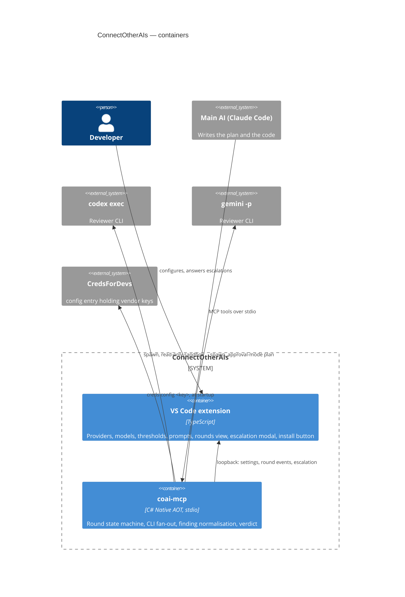
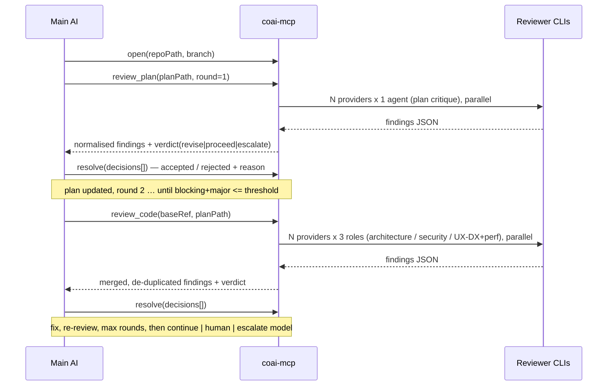

# PLAN — ConnectOtherAIs: a multi-model gate on the plan and on the code

> Status: **plan only, nothing implemented yet.** Scope: this repository — a VS Code extension
> (settings UI + install button), a Native-AOT MCP server, and the round protocol between them.
>
> Sibling references (relative to `D:\rsd\`, sibling checkouts of this one):
> `dew_flow_creds_for_devs/src_mcp`, `dew_flow_creds_for_devs/src_vs_code`,
> `dew_flow_rag_qln/src/Rag.Application/Agents/AgentRuntimes.cs`,
> `dew_flow_conventions/ROLLOUT.md`.

## The goal

One model writes the plan and the code. Several *other* models — different vendors, different
training, different blind spots — read it and say what is wrong, twice: once while the plan is still
a document, and once when the branch is written. The main model arbitrates, fixes, and the round
repeats until the disagreement is small enough to stop, or a human is called.

The value is not "more review". It is **review by a model that cannot see the author's reasoning**,
which is the only kind that catches the author's assumptions.

## Names

Three names for one program, and they are not interchangeable — the mistake this table exists to
prevent is giving the config key the long name and then prefixing the tools as well.

| Thing | Name | Who sees it |
|---|---|---|
| Product / VS Code extension | **ConnectOtherAIs** | a person: the marketplace, the README, the settings title |
| The binary on disk | `coai-mcp` | the `command` field, pointing into the extension's storage |
| The id in a client's `mcpServers` block | `coai` | `claude mcp list`, **and the client prefixes every tool with it** |
| Tool names | *no prefix of their own* | `mcp__coai__review_plan`, `mcp__coai__review_code`, … |

CredsForDevs makes the same split — file `creds-mcp.exe`, config key `creds`
(`src_vs_code/src/mcpClientConfig.ts:41-46`), server identity `creds-for-devs`
(`src_mcp/src/Program.cs:29`) — but keeps a `creds_` prefix on its tools, which is what produces
`mcp__creds__creds_list`. We do not repeat that: the namespace is already the server id.

## The four decisions already taken (and what each costs)

| # | Decision | Consequence this plan must carry |
|---|---|---|
| 1 | **MCP server + instructions only** — no plugin command, no hooks | Invocation is advisory. The server must therefore be *stateful* and refuse out-of-order calls, so a skipped stage is visible rather than silent. A `Stop` / `PostToolUse` hook with `asyncRewake` (the shape `security-guidance` ships) stays available as a later, purely additive change — nothing in this plan depends on it, and nothing would need rewriting to add it. |
| 2 | **Secondary models through their CLIs** (`codex exec`, `gemini -p`) | The reviewers get the real repository, not a pasted diff. DeepSeek has no CLI → it rides Codex's custom-provider config. Two output shapes to normalise (Codex JSON-schema, Gemini JSON-in-prompt). |
| 3 | **Keys stored in CredsForDevs, as a `config` entry** | A `credential` entry cannot serve this: nothing in the broker's read routes returns a secret, and MCP answers only `hasPassword: true`. The one door that returns a secret entire is the config route, it authenticates with its own minted key, and it is read by an **application** rather than an agent. So: one `config` entry, `creds config <key>` at startup — see *Keys* below. Codex and Gemini need no key at all on this machine (already authenticated); this path exists for DeepSeek and any vendor added later. |
| 4 | **This repository, `dew_flow_connect_other_ais`** | Joins the family per `dew_flow_conventions/ROLLOUT.md`: submodule at `.claude/rules/shared`, `settings/settings.json` copied byte-identical, CI runs `plan-lifecycle.mjs` + `pin-check.mjs`. |

## What was verified on this machine, 2026-08-31 (not guessed)

Measured by running the tools, because the whole orchestration hangs on these flags existing.

| Fact | Evidence |
|---|---|
| `codex-cli 0.147.0`, `gemini 0.55.1` installed | `codex --version`, `gemini --version` |
| Codex can be given a **JSON Schema for its final answer** | `codex exec --output-schema <FILE>` |
| Codex can write only the final message to a file | `codex exec -o/--output-last-message <FILE>` |
| Codex has a **built-in review mode against a base branch** | `codex exec review --base <BRANCH>` / `--uncommitted` / `--commit <SHA>` |
| Codex can be made read-only and stateless | `-s read-only`, `--ephemeral`, `-C <DIR>` |
| Codex supports alternative vendors | `model_providers` present in the shipped binary; overridable per call with `-c model_providers.<id>.base_url=…` |
| Gemini is headless with machine-readable output | `gemini -p "…" -o json` |
| Gemini has a read-only mode and its own worktree switch | `--approval-mode plan`, `-w/--worktree`, `--include-directories` |
| Both CLIs are already authenticated without an API key | `~/.codex/auth.json`, `~/.gemini/google_accounts.json` exist |
| `creds run` / `creds script` execute **only what the human saved**, ignoring agent text | `dew_flow_creds_for_devs/src_vs_code/src/helpContent.ts:308` |
| `creds` verbs are `ssh, terminal, run, script, db, env, config, vpn-up, vpn-down, ls` | `dew_flow_creds_for_devs/src_cli/src/CommandLine.cs:51-63` |
| A `config` entry is the app-reads-its-own-secrets path | `creds config <key>` — `dew_flow_creds_for_devs/src_cli/src/CommandLine.cs:151` |
| No broker read route returns a secret — the word `password` does not occur in the file at all | `dew_flow_creds_for_devs/src_vs_code/src/brokerReadRoutes.ts`, grepped |
| The config route is the single deliberate exception, separated into its own file so that claim stays true: "it checks a key, it reaches into SecretStorage, and what comes back is a config file entire" | `dew_flow_creds_for_devs/src_vs_code/src/brokerConfigRoute.ts:5-11` |
| A wrong key and a revoked key are indistinguishable from outside (both 401, same sentence) — so the route is no oracle for which keys are real | `dew_flow_creds_for_devs/src_vs_code/src/brokerConfigRoute.ts:44-51` |
| Install pattern: release asset → extension storage, never onto `PATH` | `dew_flow_creds_for_devs/src_vs_code/src/credsInstall.ts:1-58` |
| The MCP config block is **offered on the clipboard**, never written into the client's file | `dew_flow_creds_for_devs/src_vs_code/src/mcpClientConfig.ts:24-49` |
| An AOT MCP server must build its own server: the SDK's hosted default logs to stdout and corrupts JSON-RPC | `dew_flow_creds_for_devs/src_mcp/src/Program.cs:19-25` |
| Provider adapters as a seam, refusal instead of a default credential | `dew_flow_rag_qln/src/Rag.Application/Agents/AgentRuntimes.cs:21-60` |

## Architecture



Two processes, exactly as in CredsForDevs and for the same reason: an MCP client owns its server's
process lifetime, and the extension lives inside VS Code with zero runtime dependencies.

### The round protocol



### The MCP surface

| Tool | Purpose |
|---|---|
| `providers` | What is configured, which CLI was found, whether it authenticates. A health probe run before anything is promised. |
| `open` | Opens a session for `repoPath` + `branch`; returns a `sessionId`. Everything else refuses without it. |
| `review_plan` | Sends the plan to every enabled provider; returns normalised findings + verdict. |
| `review_code` | Per provider, three parallel reviewers over the branch diff; returns merged findings + verdict. |
| `resolve` | The main AI records accept/reject **with a reason** per finding. This is what advances the round. |
| `status` | The session's rounds, counts, verdicts — so a resumed conversation can re-orient. |
| `ask_human` | Escalation. Raises the modal in VS Code and blocks; falls back to a refusal the main AI must surface when no window is listening. |

**Ordering is enforced by the server, not by good behaviour.** `review_code` refuses when the session
has no plan round that reached `proceed`. That is the honest limit of a no-hook design: it cannot
make the model call the tool, but it can make a skipped stage impossible to fake.

### Isolation of reviewers — one worktree per ROUND, pinned to a SHA

Reviewers read a **detached `git worktree`**, never the live checkout: the main AI keeps editing while
a review runs, and a reviewer reading a half-saved file produces findings about a state that never
existed. Plus `-s read-only` (Codex) / `--approval-mode plan` (Gemini) and `--ephemeral` where
available, so a reviewer cannot write anywhere at all.

**One worktree per round, shared by every reviewer in it, created from a resolved commit SHA — not
per reviewer, and not from a branch name.** Six reviewers each getting their own checkout of a moving
branch is six different inputs to what is meant to be one comparison; findings could then disagree
because the trees disagreed. Read-only reviewers share a tree safely, so the round costs one `git
worktree add --detach <path> <sha>` instead of six.

The worktree lives **outside the repository**, under the extension's storage, so a crash never leaves
an untracked directory inside someone's project.

**Lifecycle, because an orphan worktree blocks the next run:**

| When | What |
|---|---|
| `open` | `git worktree prune` first — clears whatever a killed session left behind before anything new is added. |
| per round | `try` / `finally` around the whole fan-out; the `finally` runs `git worktree remove --force`. |
| server shutdown | the same removal on SIGTERM / stdin close, best-effort. |
| after a SIGKILL or a closed VS Code | nothing runs — which is exactly why the next `open` prunes rather than trusting cleanup. |

Worktree paths carry the session id, so a prune can tell ours from a human's own worktrees and never
removes one it did not create.

### Concurrency, rate limits, and the four ways a reviewer fails

Two providers × three roles is six CLI processes wanting to start at the same instant. Unbounded,
that is where local process limits, a CLI's own lock files, and the vendor's `429` all arrive at once
— and each of them looks like a timeout unless it is handled by name.

- **A global `SemaphoreSlim`** caps concurrent reviewer processes (default **3**, configurable). The
  fan-out stays logically parallel; the queue is what keeps it survivable.
- **A per-provider cap** on top of it (default **2**), because a rate limit is per vendor. A global
  cap alone would happily put all three of its slots on one provider.
- **`429` / quota exit is retried once** with backoff, and only then reported. It is a distinct
  outcome from a timeout in both the log and the round result.
- **Four failure modes, each named, never a silent zero**: non-zero exit, timeout, unparseable output
  after one repair attempt, rate-limited after one retry. A round that ran with four of six reviewers
  says so in its verdict, and the counting rule sees the reviewers that answered.

### Keys — one `config` entry, read by the server, never by an agent

A vendor key is needed only where the CLI has no authentication of its own. On this machine that is
**nobody today**: Codex and Gemini are already signed in. So this path is built for DeepSeek and for
whatever is added next, and the product works with it entirely absent.

One entry of kind `config` in the vault, named e.g. `connect-other-ais.json`:

```json
{ "deepseek": "sk-…", "openrouter": "…" }
```

Code access is enabled on it, which mints a key. That key travels in the `env` of the `mcpServers`
block — the same block the extension already puts on the clipboard — and at startup `coai-mcp` runs
`creds config <key>` and gets the JSON. From there it lands in the reviewer child's environment
exactly as `AgentRuntimes.Apply(credential, environment)` does it: never on a command line, never in
a log.

**The trade-off, stated rather than discovered later.** The config key itself sits in the MCP
client's config file as plain text. It reaches exactly one entry, it is revoked with one click, and
it answers nothing while the VS Code window is closed — but it is a pass to the vault, not a secret
inside it. That is the same bargain CredsForDevs already makes for every application that reads its
own config, and it is why the entry should hold *only* review-panel keys.

**Consequences to honour in the code:**

- A missing or revoked key is a **named startup condition**, not a crash and not a silent fallback to
  an unauthenticated CLI — `providers` reports that vendor as unavailable with the reason.
- The server reads the config **once at startup**. A key rotated underneath it takes effect when the
  MCP client restarts the server; `providers` says when the read happened.
- If `creds` is absent entirely, the vendors that need no key still work. The plan does **not** add a
  second key store to paper over this; a per-vendor environment variable is the documented escape
  hatch for someone without the vault.

## The finding contract

One schema, fed to Codex as `--output-schema` and pasted into Gemini's prompt:

```json
{
  "findings": [{
    "severity": "blocking | major | minor | nit",
    "category": "architecture | security | reliability | performance | ux | convention",
    "file": "src/Foo.cs", "line": 42,
    "title": "one sentence, the defect itself",
    "why": "what breaks, concretely — inputs/state -> wrong outcome",
    "fix": "the smallest change that removes it"
  }]
}
```

A reviewer that returns unparseable text gets **one** repair attempt ("return only the JSON for the
schema above"); a second failure marks that reviewer `failed` for the round rather than silently
contributing nothing.

### Parsing, which is not symmetric between the two vendors

Codex is told the schema (`--output-schema`) and writes its final message to a file (`-o`), so its
side is a plain deserialize. **Gemini has no schema flag**, and two layers have to come off before
the payload appears:

1. **Its own envelope.** `-o json` returns Gemini's object (response plus stats), not the model's
   answer — the answer is a field inside it.
2. **The model's own wrapping.** Asked for JSON in a prompt, it habitually returns a fenced
   ```` ```json ```` block, sometimes with a sentence of introduction.

So the Gemini path gets a **sanitizer**: strip fences, then take the outermost balanced `{ … }` by
scanning from the first `{` and counting braces — *not* first-`{`-to-last-`}`, which swallows trailing
prose that happens to contain one and produces a parse error that reads like a model failure. Every
one of these shapes — clean, fenced, fenced with a preamble, doubled braces in trailing text, empty —
is a unit test with a literal fixture, because this is the layer that will actually break.

### What the reviewers are shown, and what is kept out

The diff is the reviewers' entire world at the code stage, so its shape decides the quality of the
review — and a context window spent on a lock file is a finding not made.

- **Excluded by pathspec** (`:(exclude)…`): lock files (`package-lock.json`, `yarn.lock`, `Cargo.lock`,
  `*.lockb`), `bin/` `obj/` `dist/` `out/` `node_modules/`, minified and map files, and anything the
  repository's own `.gitignore` already excludes. The list is configurable, with these as defaults.
- **Binary files are named, never inlined** — path and size only.
- **A size cap** with an honest tail: past it the diff says which files were elided and how large they
  were, so a reviewer knows its view was partial instead of assuming it was whole.
- The plan, the branch and the base ref travel with it, because a reviewer that cannot see the intent
  reviews the code against its own guess at the intent.

## The counting rule (this is what makes "fewer than 2" mean something)

Without a rule, three reviewers producing five nits each guarantee escalation forever.

1. **Only `blocking` and `major` count.** `minor`/`nit` are reported to the main AI and never gate.
2. **De-duplicate before counting.** Same file, lines within ±5, same category, similar title → one
   finding listing the providers that raised it. Two vendors agreeing is stronger evidence, not twice
   the work.
3. **A finding the main AI rejected with a reason, which no reviewer raises again with a new
   argument, does not count in later rounds** — otherwise one disputed opinion blocks forever.
4. The gate is `countAfterDedup <= threshold` (default **2**, configurable).

## Configuration (all of it in the extension's UI)

| Setting | Default | Note |
|---|---|---|
| Providers enabled | codex, gemini | deepseek off until a key exists |
| Model per provider | the CLI's default | free text, passed as `-m` |
| Key per provider | *(from the creds `config` entry)* | absent = the CLI's own authentication; the UI shows which of the two a provider is using |
| Reviewers on the plan stage | 1 per provider | confirmed; three roles on a document with no code is spend without return |
| Reviewers on the code stage | 3 per provider | architecture / security+reliability / **UX-DX & code performance** |
| Max rounds | 3 | per stage |
| Gate threshold | 2 | blocking+major after dedup |
| On exhausted | `human` | `continue` \| `human` \| `escalate` |
| Escalation ladder | reviewer effort ↑ → reviewer model ↑ → main-AI arbiter model ↑ (Opus → Fable) | ordered, one step per exhausted round |
| Max concurrent reviewer processes | 3 | global semaphore |
| Max concurrent per provider | 2 | a rate limit is per vendor |
| Diff exclusions | lock files, build output, minified, maps | added to whatever `.gitignore` already excludes |
| Diff size cap | on | elided files are named, with their sizes |
| Per-reviewer timeout | 10 min | per spawned process |
| Budget | off | optional cap on reviewer invocations per session |
| Role prompts | shipped defaults | editable and restorable — file default, then override |

## Security and privacy

- The reviewer sees the repository because it *is* a local CLI — but the vendor behind that CLI sees
  whatever it sends. This is stated in the UI at the moment a provider is enabled, once, with the
  repository path named. No silent first send.
- Reviewers run read-only, in a worktree, with no write path back into the checkout.
- Keys never appear on a command line: the `config` entry is read once at startup and applied to the
  child's environment, exactly as `AgentRuntimes.Apply(credential, environment)` does.
- The config key that unlocks that entry lives in the client's config file as plain text — a pass to
  one entry, revocable, useless with the window closed. Stated in the install message, not buried.
- `logs/` is git-ignored; a reviewer's prompt is logged, its provider key never is — and a test
  asserts that a log line carrying a key value fails the build.

## Build order

The phases below are broken into six epics, each a plan of its own with user stories and per-story
test cases — build them strictly in this order, each depends only on its predecessors:

| Epic | Covers | Phases |
|---|---|---|
| [PLAN_epic_01_foundation.md](../research/PLAN_epic_01_foundation.md) — **shipped 2026-08-31** | conventions mount, solution + logging skeleton, CI | 0 |
| [PLAN_epic_02_core.md](../research/PLAN_epic_02_core.md) — **shipped 2026-08-31** | finding contract, sanitizer, dedup + counting, round state machine | 1 |
| [PLAN_epic_03_runners.md](PLAN_epic_03_runners.md) | worktree manager, context assembly, vendor runtimes, bounded scheduler | 2 |
| [PLAN_epic_04_server.md](PLAN_epic_04_server.md) | the stdio server, review tools, creds keys, release + contract tests | 3 |
| [PLAN_epic_05_extension.md](PLAN_epic_05_extension.md) | settings UI, install button, rounds view + escalation, CLAUDE.md snippet | 4–5 |
| [PLAN_epic_06_proof.md](PLAN_epic_06_proof.md) | scripted end-to-end in CI, one recorded real run | 6 |

**Phase 0 — the repository.** Already initialised: `.git`, `.gitignore` and `LICENSE` are in place as
of 2026-08-31. What remains: the `dew_flow_conventions` submodule at `.claude/rules/shared`,
`settings/settings.json` copied byte-identical from the reference, `CLAUDE.md`, `todo/README.md`,
CI running `plan-lifecycle.mjs` + `pin-check.mjs`, and `logs/` added to `.gitignore` if it is absent.
`research/` must exist from the start with `architecture.md`: run against this repository today the
checker answers *"has no todo/ + research/ pair — nothing to check"*, and a check that silently
passes because half its input is missing is worse than no check.
The consumers table in `dew_flow_conventions/README.md` gains a row for this repository in the same
task — a new consumer that nobody listed is drift on day one.

**Phase 1 — the contract, pure and tested.** Finding schema, normalisation, **the Gemini sanitizer**,
de-duplication, the counting rule, the round state machine, diff shaping (exclusions, binaries, the
cap). No process, no network — all of it unit tests.

**Phase 2 — the reviewer runners.** One `IReviewerRuntime` per vendor (`codex`, `gemini`,
`codex + custom provider` for DeepSeek), each turning a role + context into an argv and a parsed
result. Modelled on `AgentRuntimes.cs`: an unknown provider is a refusal, never a default. With them,
the two pieces that keep a fan-out alive: the **worktree manager** (prune, add by SHA, `finally`
remove) and the **bounded scheduler** (global + per-provider semaphores, one retry on a rate limit).

**Phase 3 — the MCP server.** Native AOT, stdio, console logging to **stderr** (stdout carries the
protocol), Serilog per the shared logging rule, one file per run under `logs/{yyyy-MM-dd}/`.

**Phase 4 — the extension.** Settings webview, rounds view, escalation modal, loopback broker,
"Install the MCP server…" button (release asset → extension storage), config block to clipboard.

**Phase 5 — the CLAUDE.md snippet.** The text a user pastes into a target repository telling the main
AI when to call the tools. Offered by a command, never written into someone's file.

**Phase 6 — one real run** of the whole loop on a throwaway feature, both stages, starting from a
deliberately flawed plan, with the round log kept as the record.

## Test plan

- **Pure** (the majority): normalisation of both vendors' shapes, dedup across providers, the counting
  rule including rule 3, the state machine's refusals, escalation-ladder ordering, argv construction
  per vendor, RID and asset naming for the installer.
- **Parsing**: literal fixtures for every shape Gemini actually returns — clean JSON, fenced, fenced
  with a preamble, trailing prose containing a brace, an empty answer — plus its `-o json` envelope.
  This is the layer most likely to break, so it is the one with the most fixtures.
- **Process-level**: a fake "CLI" executable that emits fixed JSON, a malformed one, a timeout, a
  non-zero exit, and a `429` — five failure modes, each asserted as its own named outcome.
- **Concurrency**: the global semaphore never exceeds its cap, the per-provider cap holds under a
  fan-out that would otherwise put every slot on one vendor, and a rate-limited reviewer is retried
  exactly once.
- **Worktree lifecycle**: `finally` removes the worktree after a thrown fan-out; `open` prunes an
  orphan left by a killed session; a worktree not created by this server is never removed; the live
  checkout is byte-identical before and after a round.
- **Diff shaping**: lock files and build output are excluded, a binary is named rather than inlined,
  and an over-cap diff names what it elided.
- **Keys**: the config JSON parsed and applied to a child environment; a missing key, a revoked key
  (401) and a malformed body each produce a *named* unavailable provider rather than an exception or a
  silent unauthenticated run; no key value ever reaches a log line.
- **Contract**: `initialize` / `tools/list` against the published binary, as CredsForDevs' MCP tests do.
- **Extension**: `node:test` for the pure halves (settings shape, snippet text, install decisions).
- **Never** `dotnet test` — MTP executables only.

## Settled — the six defaults, confirmed 2026-08-31

Nothing here is open any more. Recorded as decisions with their reasons, because a reason is what
lets a later reader tell a choice from an accident.

1. **Plan stage: one reviewer per provider.** Three roles over a document that has no code yet is
   spend without return.
2. **The third code reviewer is `UX-DX & code performance`, strictly code-only** — no browser, no
   screenshots. It reads component structure, layout shifts visible in the code, redundant re-renders
   and re-queries, blocking async, memory hot spots, and the ergonomics of the API surface. The role
   was renamed for that reason: called "UI", a model tries to picture the page it cannot see.
3. **Round artifacts live in the extension's storage** (`globalStorageUri`, logs under
   `logStorageUri`), never in the repository. Export to `docs/reviews/` is an explicit command.
4. **Human escalation is a VS Code modal over the loopback**; with no window listening, the tool
   returns a plain refusal naming what needs a human, and the main AI surfaces it.
5. **Escalation ladder: reviewer effort ↑ → reviewer model ↑ → arbiter model ↑.** The arbiter moves
   last because changing the author of the plan is the most expensive step available.
6. **No login: no accounts, no sign-in, no cloud service of the extension's own.** Everything is local
   between VS Code, `coai-mcp` and the installed CLIs. Logging follows the shared Serilog rule; that
   is not the same subject.

## Definition of Done

- [ ] The repository joined the family: submodule mounted, settings copied, both CI checks green.
- [ ] Every counting and ordering rule is a unit test, and each was seen red before it went green.
- [ ] `review_code` provably refuses without a passed plan stage, and the tools carry no `coai_`
      prefix of their own — the client's `mcp__coai__` namespace is the only one.
- [ ] A vendor key arrives only from the `config` entry; with `creds` absent, the already-authenticated
      CLIs still work and the keyed vendor is reported unavailable by name.
- [ ] Reviewers run read-only in **one worktree per round, pinned to a SHA**; a test asserts the live
      checkout is untouched, and that a killed session's orphan is pruned by the next `open`.
- [ ] Concurrency is bounded globally and per provider; a `429` is a named outcome with one retry,
      never a timeout in disguise.
- [ ] The Gemini path survives every wrapping shape in the fixture set, envelope included.
- [ ] Lock files and build output never reach a reviewer's context, and an elided diff says so.
- [ ] Both vendors' outputs normalise into one finding shape; a malformed reply is one repair attempt
      then a named failure, never a silent zero.
- [ ] The install button installs the published binary and puts the config block on the clipboard.
- [ ] One end-to-end run is recorded, with its round log.
- [ ] This plan is promoted to `research/` with `IMPLEMENTED <date>` and its deviations.
