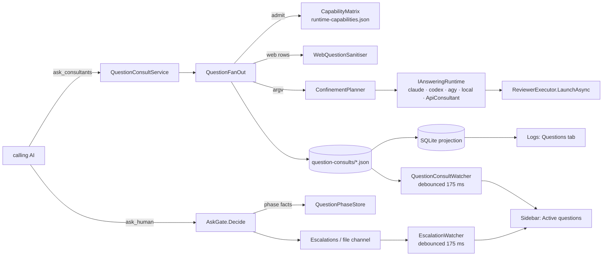

# PLAN — the question consultant: other models answer an AI's question before the person is asked

> Status: **in progress — S1 (confinement) and S2 (the fan-out, `ask_consultants`, the proved move of `ask_human`) built 2026-10-01, S3 (the door to the person: the gate, the wait, the retention, the order) built 2026-10-02, S4 (the person sees it: the Settings tab, Active questions, the Questions tab) built 2026-10-02, S4b (the code review's fifteen fixes) built 2026-10-02, S5 open.** The capability facts it rests on were measured in
> `dew_flow_benchmark · todo/PLAN_question_consultant_probes.md` (full run `01a0f8c7`, 105 cells, 2026-10-01) and are
> written up in [RESULTS_question_consultant_capabilities.md](../research/RESULTS_question_consultant_capabilities.md). Scope:
> `src_mcp` (a new tool `ask_consultants`, the phase-aware `ask_human` gate, a confinement layer, escalation
> retention), `src_vs_code` (a Question consultant settings tab, the sidebar's Active questions, a Logs tab),
> `shared/commands/` (the autonomy order), the shared consultant rule.

## 0. The operator's requirements, verbatim in substance (2026-10-01) — every one is a DoD item

**The feature.**
1. A **Question consultant** tab in the settings.
2. The *Work autonomously* order is amended: before asking the person a question, the AI asks the question
   consultant — unless the question is critical and could bring production down.
3. The tab works like the other consultant/reviewer settings: several models, and a set of **base prompts**
   (examples: "study the code of other projects on this disk for something similar", "search the internet for the
   best solution", "you are the best developer in the world — your opinion"). Each added model is given exactly one
   of the prompts.
4. **Every active model + prompt row runs, always**, in parallel (example: Sonnet → projects on disk, Astra →
   internet, Grok → opinion).
5. Its own logs, on the Logs page, in a separate tab.
6. The left sidebar shows the active questions in real time.

**Defaults the operator accepted (2026-10-01, "defaults" to the 17 questions):** a separate tool the AI calls before
`ask_human`; enforcement `off | remind | require`, default `require`, with `critical: true` + a reason as the bypass —
the consultants still run and their answers are attached to the person's card; its own on/off switch, plus the
sentence in the autonomy order and in the `ask_human` description; one row = model + one prompt + on/off, the same
prompt allowed on several rows, at most 6 active; base prompts are an editable file-backed list with three shipped
defaults and restore-default; `disk` reads a list of root folders set in the tab, read-only, CLI models only;
one-shot answers, no follow-up turns; input = the question + a required context field (what was tried, the options),
read-only repo access for CLI rows, no diff; every answer returned separately, fenced advisory-only, no summarising
model; limits 5 min per row and 10 questions per session, past which the question goes straight to the person; one
sidebar section "Active questions" with two stages (consulting, per model, live → waiting for you, with the answers
folded under the card); the Logs tab one row per question, expandable per model, with cost, time and what happened
next; Team server out of scope; the shared consultant rule updated in `dew_flow_conventions` and the private
`ai_conventions` mirror at the end, with the pin cascade; capabilities measured before building, a failed one marks that
row unavailable.

**Mandatory amendments (the operator, 2026-10-01).**
- A1. **Graceful degradation**: when one model times out, the others' answers are returned as a partial result.
- A2. **Web-search safety**: a web row is given strictly the question text — no code fragments, no local paths, no
  configs.
- A3. **Capabilities** `disk | web | none` on every prompt; an incompatible model + prompt pair is BLOCKED in the UI.
- A4. **`escalations/*.json` lifecycle** is in scope: a sweep and a retention, TTL 7 days.
- A5. **Sidebar** reacts to file changes with a 150–200 ms debounce; it does not rely on the 5 s poll.

**The autonomy order also gains (the operator, 2026-10-01, later the same day).**
- A6. On a **stage environment** the AI itself: creates the pull request, watches CodeRabbit's comments, fixes what
  they name, merges, deploys, and then verifies **on the server** that everything works — no degradation, and the new
  behaviour works as expected.

**When the consultant is mandatory — the phase rule (the operator, 2026-10-01, later again).**
- A7. Questions asked **while the plan is being formed**, and the **first two batches** of questions after
  implementation of the plan has started, ALWAYS go to the person directly. **Every question after that, up to the
  release to the stage environment**, goes through the question consultant first — except a critical one (A2 of the
  defaults: `critical: true` + a reason). The `require` enforcement is therefore phase-aware, not a flat switch: the
  server has to know (a) whether the plan stage has reached `proceed`, (b) how many question batches the person has
  already been asked since, and (c) when the stage release happened. (a) the session already records; (b) is a new
  counter keyed like the cadence state (repo + plan); (c) **is inferred by the server, never declared by the AI**
  (the operator, 2026-10-01: a declared flag is a bypass the AI grants itself — the reason `humanDecision` is
  gated) — see §3 D7. **After the stage release, questions go to the person directly again** (the operator,
  2026-10-01). The autonomy order's text (A6) and this rule are written together, so the order says the same thing
  the server enforces.

**Decisions of 2026-10-01, evening (the operator's answers to the open questions).**
- A8. The bypass is spelled `productionRisk` + `riskReason`, never "critical" — two guard tests forbid that word in
  tool descriptions and the consultant rule, because "critical" is the canonical invented severity.
- A9. Rows whose capability is `none` on a hosted `api` runtime ("your opinion") receive the CONTEXT, passed through
  a secret check (not the code ban), **plus the outline (AST) of what already exists**, through the feature gate's
  source mechanism, so the model can ask for files and symbols.
- A10. Waiting for the person is **at most 15 minutes**; then `ask_human` answers `no_answer_yet` and the card
  becomes `expired` (out of the active list, kept in the log). The 7-day TTL of A4 is the FILE retention, not a wait.
- A11. Grok is measured and used through **OpenRouter** (`x-ai/grok-4.7`, vault key `openrouter`); the xAI account
  is out of credits.
- A12. **Build the question consultant completely and cut a release the operator can test.** Everything else goes
  into a tails plan — including moving the EXISTING stuck consultant and confined reviewer off their deny lists (§2,
  F5); the question consultant itself launches only through the new confinement layer.
- A13. Architecture: the hybrid (§4) — the capability model as data and one pure confinement planner, with a simple
  sibling record store.

**How the measurements are run (the operator, 2026-10-01).** Every capability test is built in
`D:\rsd\dew_flow_benchmark` as a new module with its own console tab; results persist after every atomic iteration,
a run resumes from any point after a limit, and a single cell is re-run on its own. Every result is written up in
detail as markdown in THIS repository's `research/`.

## 1. Boundary with the benchmark plan

| Item | Built by | The other plan's part |
|---|---|---|
| Capability probes, their store, verbs and console tab | `dew_flow_benchmark · todo/PLAN_question_consultant_probes.md` | none |
| `research/RESULTS_question_consultant_capabilities.md` | the benchmark plan (its S5) | this plan cites it for every capability row |
| Everything in §0 | **this plan** | the benchmark supplies the facts only |

Order: the benchmark plan first.

## 2. The goal, and what was measured before any design

**Symptom.** An AI working autonomously stops the person for questions another model could have answered: the
blocking `ask_human` is the only door (`src_mcp/src/Tools.cs:369`), the *Work autonomously* order tells it to ask "at
once" (`shared/commands/command-autonomy.md`), and the existing `consult` is a single-vendor, multi-turn, repo-locked
tool for being STUCK (`research/PLAN_consultant.md`), not a panel to put a question to. **Goal:** before the person is
asked, every active row — one model paired with one base prompt, each prompt declaring the capability it needs —
answers in parallel; the person is asked only when the answers do not settle it, when the work is in a phase where the
person must decide (A7), or when the question could bring production down.

**Measured facts the design rests on** (all from the benchmark's probe runs; run ids, cells, CLI builds and artefact
paths in [RESULTS_question_consultant_capabilities.md](../research/RESULTS_question_consultant_capabilities.md)):

| # | Fact | Consequence here |
|---|---|---|
| F1 | codex-cli 0.156.1: `codex --search exec --json -s read-only …` searches the web non-interactively (real `web_search` items); `codex exec --search` is a usage error (exit 2); its `--json` web items carry DUPLICATE `id` keys | codex can serve `web`; `--search` is a TOP-LEVEL flag before `exec`; every reader of codex JSON tolerates duplicate keys |
| F2 | codex `-s read-only` on Windows reads ANYWHERE: read-outside-bare 3 of 3 for both models through `pwsh Get-Content` (exit 0, token in the command output); in the web row Astra read the canary the same way 3 of 3 and also its own `~/.codex/skills` | codex is **unconfined** for every capability: `disk` and `web` rows are offered only FLAGGED ("can read this machine"), never as confined; `--add-dir` adds nothing for reads |
| F3 | claude 2.1.258 `-p`: `--tools <list>` offers exactly the named tools (`""` = none); `--restricted` removes Bash/PowerShell/REPL/WebFetch and confines file tools to the working directories; `--tools default X` does not compose | claude rows launch ONLY through `--tools` (+ `--restricted` for `disk`); never through `--disallowedTools` |
| F4 | claude WITHOUT `--restricted` reads a file outside its cwd with no `--add-dir` (allow-list and deny-list alike); `--restricted` refuses it (`permission_denied`) | a claude `disk` row needs `--restricted` + `--add-dir <roots>`; `--tools` alone is no path boundary |
| F5 | claude under coai's SHIPPED deny lists (`ClaudeConsultant.Denied`, `ClaudeRuntime.ReachTools`) is offered the user environment's whole tool set — PowerShell, Artifact, RemoteTrigger, SendMessage, CronCreate, Workflow, Skill, … — and read the canary through PowerShell in **6 of 6** cells of the full run (read-denied + web-confined × 3) | the existing stuck consultant and confined reviewer are not confined on Windows — a tails-plan item (A12); nothing new may reuse a deny list |
| F6 | claude WebFetch refuses `file://` ("Invalid URL"); WebSearch/WebFetch are client tool calls (server counters stay 0) | a claude `web` row may hold `WebSearch,WebFetch` |
| F7 | agy 1.2.14: `--print <value>` swallows the next flag; the measured launch is `--print= --input-format stream-json --output-format stream-json`; `search_web` works, `read_url_content` is auto-denied headless; its headless permission default also auto-denies `read_file` outside the workspace (hand-checked 3 of 3; the stream names no path, so the reader says not captured); `--add-dir` reads 3 of 3; NO tool deny-list; 2 of 21 cells failed "stream interrupted" | agy: `none` yes; `disk` via `--add-dir`, confined only by a DEFAULT nobody configured (flagged `default-deny`); `web` BLOCKED (it cannot fetch a page headless) |
| F8 | Grok through the product's api path: xAI direct answered 403 (credits spent); OpenRouter `x-ai/grok-4.7` answered every probe case (json_schema, reasoning_effort, second turn) | the `api` runtime can serve `none` through an `ApiConsultant`; no file or web access, so `disk`/`web` blocked |
| F9 | The live product-path check (S5, 2026-10-03, [RESULTS §7](../research/RESULTS_question_consultant_capabilities.md#7-the-live-product-path-check-s5-2026-10-03)): Sonnet `disk`, Claude `web` and Grok-via-OpenRouter `none` all answered one real question in 3 min 41 s ($0.41 + $0.70 + unreported). The disk row stayed in its roots. The `consultId` opened `ask_human` and was spent. The card expired after the operator's 10 minutes. | the shipped path works end to end on this machine; the api row's missing cost is tails item 7 |

## 3. Decisions

| # | Decision | Why |
|---|---|---|
| D1 | A separate tool **`ask_consultants`**, called before `ask_human`; `ask_human` stays the only door to the person | changing the blocking tool's semantics breaks every caller; a second tool keeps "ask models" and "ask the person" separately visible in the log |
| D2 | One-shot answers, no follow-up turns, no summarising model; each answer fenced `advisory_only` and returned separately | the defaults the operator accepted; a summariser is a seventh model nobody chose |
| D3 | **Capabilities are data**: `shared/runtime-capabilities.json` — per runtime × capability `confined` / `unconfined` / `unsupported` / `unmeasured`, each with `measuredWith {cli, version, date, resultRef}` pointing into the RESULTS record; C# embeds it, TS is generated with `--check`; one set of `shared/capability-matrix-vectors.json` asserted on both sides | A3's "blocked in the UI AND refused by the server" is then one rule, not two copies — the precedent is `shared/builtin-roles.json` |
| D4 | **One pure `ConfinementPlanner`** (core) turns runtime × capability-grant into argv fragments, cwd kind (scratch / root / repo), add-dirs; adapters only compose it; golden argv tests pin it | F3–F7 are facts about flags; one place decides them, and a test fails when an adapter drifts |
| D5 | Its own record store `question-consults/<id>.json` (file = truth, SQLite = projection), NOT a new `ConsultationRecord` kind | `ConsultationRecord` is turn/handle/cadence-shaped and read by the cadence gate and the consultations tab; a new kind would leak into all of them |
| D6 | Rows run in parallel, each under its own deadline; **no `BoundedScheduler` global cap, no `RepositoryLock`** for the fan-out; an `api` row that uses source follow-ups gets a per-row scheduler of one | a cap of 3 would turn 6 rows into two waves and break the 5-minute promise; the stuck consult already launches outside the `BoundedScheduler` — `executor.LaunchAsync` (`ConsultationService.cs:634`) under the `RepositoryLock` alone (`:183`) |
| D7 | **Phase rule, inferred by the server**: plan stage (no plan `proceed` yet) → person; after `proceed`, the first two question batches → person; then `ask_consultants` is required until the stage release; after it → person. Stage release = every epic of the plan closed in the cadence state, or — without epics — the session reached `Done` after its code round. Unknown = not released | A7 + the operator's choice; erring toward the consultant is the safe direction for an AI that would otherwise interrupt |
| D8 | Enforcement `off \| remind \| require`, default `require`; `productionRisk: true` + `riskReason` writes the person's card AT ONCE and runs the consultants in the background, their answers folded under the card | A8; the person is never delayed by the consultants on a production risk |
| D9 | A consultant that cannot be had (none enabled, all blocked, quota spent) never deadlocks: `ask_human` allows, with a note | the cadence's stand-down precedent (`research/PLAN_consult_on_a_cadence.md`, decision 12) |
| D10 | Web rows get ONLY the sanitised question (`WebQuestionSanitiser`, refuse-never-redact); `none` rows on hosted runtimes get the context through a SECRET check (not the code ban) plus the AST outline; `disk` rows get context + read-only roots | A2 + A9 |
| D11 | Waiting for the person: 15 minutes default (was 30), then `no_answer_yet` and the card `expired`; escalation files deleted after 7 days | A10 + A4 |
| D12 | `PanelService.cs` (1884 lines) and `PanelSettings.cs` (1510) grow by zero net lines: the `ask_human` block is first MOVED out as a proved move (`todo/PLAN_round_engine_and_panel_service_under_800_lines.md` §2's method), new settings live in their own record | the 800-line ceiling; both files already have plans to shrink |
| D13 | **Two different refusals, kept apart.** A pair whose runtime CANNOT do the capability (agy `web`, api `disk`/`web`, local `disk`/`web`) is **blocked** (A3). A pair whose runtime CAN do it but cannot be CONFINED (codex for every capability, F2; agy `disk`, confined only by its headless default, F7) is **allowed but flagged** — "can read this machine" — and the flag is shown on the row, in the sidebar and in the log beside every answer it produced. **Confirmed and revised by the operator on 2026-10-03:** the flag is enough. There is no acknowledgement to tick: the row shows a tick that is ON and cannot be taken off, with the reason (Codex has no setting that limits what it reads). Codex stays allowed for `web`. A2 is still met in full, because what a web row is GIVEN (the sanitised question, a scratch cwd, no context) is ours to control. The operator's own example puts Astra (codex) on the internet row | blocking codex would block the operator's example; calling it confined would be false (6 of 6 / 3 of 3 measured reads) |
| D14 | **Gate round 1 (2026-10-01, gemini; codex rate-limited until 2026-10-08), four findings accepted.** (a) A `consultId` passed to `ask_human` is VERIFIED, never trusted: it must exist in `QuestionConsultStore`, belong to the same caller session and repository, be terminal (not `consulting`), be younger than 30 minutes and not already used by another `ask_human` call (single use) — otherwise `require` refuses as if none were given. (b) The phase store's key is repo common-dir + plan key when a plan is known, else the caller SESSION; with no plan the release is never inferred (not released), and a plan key reused after its release starts a fresh count. (c) Disk roots are validated on both sides and refused when they are a drive root, the user profile directory itself, a system directory (Windows, Program Files, ProgramData) or inside the data directory. (d) A `consulting` record carries a heartbeat (rewritten every 30 s by the fan-out); the sweep acts only when the heartbeat is older than two minutes AND the pid is dead, so a recycled Windows pid cannot end a live consultation | the reviewer's scenarios are concrete: a fabricated id bypasses `require`; unplanned work has no plan key; a drive root is the whole disk; pids are reused |
| D15 | **The AI's own questions leave VS Code (the operator, 2026-10-03; built by [PLAN_ask_human_is_for_the_gate.md](../research/PLAN_ask_human_is_for_the_gate.md)).** `ask_human` cards only the GATE's question — a held gate, or a feature review's second-round request window; every other question is answered `ask_in_conversation` and the AI asks in its own chat. The boundary: the gate in front of `ask_human` (D7, D9, D14) is this plan's and unchanged — it now guards two doors; D8 is kept on a held gate's card, and outside it a production risk asks the consultants FIRST and returns their answers (G3 there); the sidebar's "waiting for you" stage (S4) shows only gate cards; the card's `kind` and `status`'s `humanDecision` are that plan's alone. Order: it landed before this plan's S5 release. A held gate's question is no longer subject to D7 (its G7) | the operator: *"Claude's own questions that are not about the gates must be asked in Claude's interface, not in coai"*; a card's gate buttons on an A-or-B question answered nothing |

## 4. Architecture

**Core (pure, `src_mcp/core/QuestionConsult/`)** — `Capability` (`None | Disk | Web`) and `CapabilityGrant`
(capability + roots); `RuntimeCapabilities` (reads the embedded JSON); `CapabilityMatrix.Admit(runtime, capability)`;
`QuestionRow`/`QuestionRows` (parser of `COAI_QCONSULT_ROWS`, ≤ 6 active); `QuestionPromptCatalog`
(`shared/question-prompts.json` for the three shipped prompts, `COAI_QCONSULT_PROMPTS` for custom ones);
`WebQuestionSanitiser` (code fences, ≥ 2 inline code spans, path shapes incl. drive/UNC/`~`/`./`/file extensions,
the repo path/name and every configured root, `key=value`/`key: value` lines, stack-trace lines, secret shapes via
`Redaction.SafeText`, internal hosts/IPs, > 600 chars — each refusal names the cure); `SecretCheck` (the secret half
alone, for `none` rows); `ConfinementPlanner`; `QuestionPrompt.Compose`; `AskGate.Decide` (D7–D9) with `FreeBatches
= 2`; `RowOutcome` (`answered | timed_out | failed | refused | blocked | disabled`).

**Runners (`src_mcp/runners/Consultation/`)** — `IAnsweringRuntime` extracted as the base of `IConsultantRuntime`
(`IConsultantRuntime.cs:91`; `Vendor`, `Build`, `NeedsAnswerSchema` (`:111`), `ReadAdvice` — the conversation
members `Memory`, `ReadHandle`, `DroppedTheConversation`, `UsageIsCumulative` stay on the derived interface, so no
existing adapter changes shape); `ConsultantLaunch` (`IConsultantRuntime.cs:30`) gains a defaulted
`CapabilityGrant`, the default reproducing today's argv byte for byte (the existing argv tests become the regression
guard); `ApiConsultant` composes `ApiRuntime` the way `LocalConsultant` composes `LocalRuntime`
(`LocalConsultant.cs:31-70`), one-shot, `none` only, the vault key injected from the row's vendor id; for A9 it is
given a `SourceTurns.On` (`runners/Feature/SourceConversation.cs:23`) built from a `SourceResolver` at the
checkout's `HEAD` plus the `FeatureOutlineBuilder` outline (`runners/Feature/FeatureOutlineBuilder.cs:46`), so the
model can request symbols and files as the feature gate's reviewers do — **limit, stated:** the resolver reads
COMMITTED code; uncommitted work reaches an api row only through `context`. `QuestionResolution.For(identity)` maps
a row to an `IAnsweringRuntime`; the stuck consult's allowlist (`ConsultantResolution.cs:17`) is NOT widened.

Per-runtime launch (golden-tested, from F1–F8):

| runtime | `none` | `disk` | `web` |
|---|---|---|---|
| claude | `--tools ""`, scratch cwd | `--restricted --tools Read,Glob,Grep --add-dir <root>…`, cwd = root 0 | `--tools WebSearch,WebFetch`, scratch cwd, no `--add-dir` |
| codex | `exec -s read-only --ephemeral`, scratch cwd — **flagged unconfined** | `exec -s read-only --ephemeral -C <root 0>` — **flagged unconfined** (reads anywhere, F2) | `--search exec -s read-only --ephemeral --json`, scratch cwd, only the sanitised question — **flagged unconfined** |
| agy | `--mode plan`, scratch cwd | `--add-dir <root>…` — flagged `default-deny` (F7) | blocked |
| local | yes (`LocalConsultant`) | blocked | blocked |
| api | `ApiConsultant` + outline/source turns | blocked | blocked (unmeasured) |

Every launch also keeps `NoMcpServers` (`ClaudeConsultant.cs:61`, `ConsultationService.cs:808`) and, for every
child, the minimal environment the benchmark measured (S2c: PATH, PATHEXT, SystemRoot, windir, ComSpec, USERPROFILE,
HOMEDRIVE, HOMEPATH, APPDATA, LOCALAPPDATA, TEMP, TMP, USERNAME, ProgramData, ProgramFiles*, PROCESSOR_*, OS,
NUMBER_OF_PROCESSORS — no `COAI_*`, no secret-named variable), with the vendor key for api rows joined last.

**Server (`src_mcp/src/Server/QuestionConsult/`)** — `QuestionConsultRecord` (id, caller, kind, session, repo,
branch, plan key, question, context (capped), productionRisk + reason, status `consulting → answered | partial |
failed | interrupted`, outcome `answered_by_consultants | person_asked | production_risk | quota_spent |
none_available`, escalation id, runner pid, rows[] each with vendor, model, runtime, prompt, capability, status,
reason, seconds, tokens, cost, advice; every accessor null-normalised as `ConsultationRecord.cs:73-96` does);
`QuestionConsultStore` (`AtomicJson.Write`, `Escalations.cs:280`; projection hook as `ConsultationStore`;
sweep: dead pid → `interrupted`, terminal older than 7 days deleted, a 500-file cap); `QuestionFanOut` (admission →
launch every admitted row under its own deadline → each row persisted as it settles, so the sidebar sees per-model
progress → reply; A1: a timed-out row is a `RowOutcome`, the rest still return, status `partial`); a
`FilesystemInvariant` snapshot pair (`ConsultationService.cs:601,635`) around the whole fan-out when any `disk` row
was admitted, a breach withholding the disk rows' advice; `QuestionConsultService` (switch, preflight, argument
checks, per-session quota through `ConsultCallCounter` keyed `q:` + caller, fenced reply through
`ConsultationFence`, ledger through `UsageLedger.RecordJob`); `QuestionPhaseStore` (batches that reached the person,
keyed repo common-dir + plan key like `CadenceStore.cs:39`, storing escalation ids so it is idempotent, unreadable →
allow); `AskHumanService` (the moved `ask_human` block + the `AskGate` call + the 15-minute wait + `expired`);
`EscalationRetention` (pairs and orphans older than 7 days deleted under `SessionTurn.Take`, a question a live
session still holds is kept); the `ask_human` block to move is `PanelService.cs:1630-1840`; all sweeps run at startup beside `PanelService.cs:135` and on the existing one-minute
beat (`ConsultationSweeper`, `Program.cs:1902`).

**Tool contract.** `ask_consultants(repoPath, question, context, document = "", feature = "")` — `context` is
required (refused by name when empty); question ≤ 4 KB, context ≤ 8 KB; annotations as `consult`
(`Tools.cs:489-492`). Reply: `{consultId, status: complete | partial | none_available | quota_spent | off,
answers: [{rowId, vendor, model, promptTitle, capability, status, seconds, costUsd, reason, advice}], questionsLeft,
next}`. `ask_human` gains `consultId`, `productionRisk`, `riskReason`; its reply gains a `note` (remind mode, stand-down).
Both descriptions carry the phase rule in one shared sentence and never the word "critical"
(`TheGateSaysWhenToConsultTests.cs:164-197` keeps guarding it). The order text and the gate read ONE constant,
`QuestionPolicy.FreeBatches`.

**Autonomy order.** `shared/commands/command-autonomy.md` orders (4) and (5) become one stage sequence (A6): create the pull
request, wait about five minutes, read CodeRabbit's comments and fix what they name, merge, let the deploy run, then
verify on the server — no degradation, the new behaviour works as expected, its logs read. A new shipped text
`command-question-consult` (A7 + D7–D8, `{freeBatches}` filled from settings) is appended by `GateCommands.AutonomyCommand`
(`GateCommands.cs:282-292`) when the question mode is not `off`; `CommandTexts.ShippedIds`, the embedded resource,
`commands.ts` and the generated TS move together. The marker `Work AUTONOMOUSLY.` stays in code (`GateCommands.cs:238`).

**Settings** (own record `QuestionConsultSettings` + reader, one property on `PanelSettings`; TS `qconsultSettings.ts`
in the `cadenceSettings.ts` shape; written only when different from the default; `QCONSULT_SINCE` holds the keys out of
the file for an older installed server, with a banner — the `API_RUNTIME_SINCE` precedent, `apiRuntime.ts:34`):
`COAI_QCONSULT_ENABLED` (on), `COAI_QCONSULT_MODE` (`require`), `COAI_QCONSULT_ROWS` (`[]`), `COAI_QCONSULT_PROMPTS`
(`[]`), `COAI_QCONSULT_ROOTS` (`[]`, absolute existing directories, not inside the data dir),
`COAI_QCONSULT_ROW_MINUTES` (5), `COAI_QCONSULT_QUESTIONS_PER_SESSION` (10), `COAI_QCONSULT_FREE_BATCHES` (2);
`COAI_ESCALATION_MINUTES` default 30 → 15 (`PanelSettings.cs:860`).

**Extension.** A settings section `questionconsultant` after `consultant` (`panelView.ts:409`): rows (model through the
consultant row's picker — `consultantRowView`, `consultantView.ts:212`; exactly one prompt, on/off, ≤ 6 active), the prompt list with capability,
edit and restore-default (file-backed through `RolePrompts`, `RolePrompts.cs:58,131`), the roots, mode and limits; an
incompatible pair is DISABLED with its reason by `capabilityAdmission.ts` over the shared vectors. The sidebar section
**Active questions** (live region `qconsults` in `panelSurface.ts:20,25`, `liveRegions` `panelView.ts:2657`): stage 1
*consulting* (one line per model, status chip, elapsed), stage 2 *waiting for you* (the escalation card with every
answer folded under it, Answer button, free text first); it subsumes today's "A review is waiting on you" so a card is
drawn once. Watchers: a pure `debounced(refresh, 175)` with an injectable timer on every `onDidCreate/Change/Delete`
of `consultationWatcher.ts:46-48`, `escalationWatcher.ts:117-119` and the new `questionConsultWatcher.ts`; the 5 s poll
stays only as the fallback for `\\wsl.localhost` and network paths, where events are not delivered (A5). The Logs page
gains a **Questions** tab (`roundsLog.ts:1523,1553`, body in its own `qconsultLog.ts`): one row per question,
expandable per model, cost, time, outcome. Help in five languages (`helpContent.ts`, `helpRu/Uk/De/Es.ts`).

**Reference check (2026-10-01).** Every `file:line` in §2–§7 was opened. Corrected: D12's sizes — `PanelService.cs`
is 1884 lines and `PanelSettings.cs` 1510 (the plan said 1760 / 1330); D6's anchor — `ConsultationService.cs:327-331`
is the preflight (`Preflight`/`VendorRefusal`) and the file records no scheduler note at all, what it shows is the
stuck consult launching through `executor.LaunchAsync` (`:634`) under the `RepositoryLock` alone (`:183`), which is the
fact D6 rests on; `IAnsweringRuntime`'s member list lacked `NeedsAnswerSchema` (`IConsultantRuntime.cs:111`), a
launch fact rather than a conversation one, so the local and api routes need it on the base; the autonomy order's
deploy verification is already order (5), so A6 rewrites (4) and (5), not (4) alone; `consultantView.ts:320` is
`offeredOptions`, the picker's option mapper — the row the new section reuses is `consultantRowView` (`:212`);
`API_RUNTIME_SINCE` is extension-side (`apiRuntime.ts:34`). Anchored for S2: the `ask_human` block is
`PanelService.cs:1630-1840` (its section marker to the `plumbing` one). `research/RESULTS_question_consultant_capabilities.md` was written the same evening from the full run, and §2's F2,
F5 and F7 were corrected against it (codex reads anywhere; the deny-list leak is 6 of 6; agy's headless default). Everything else holds:
`Tools.cs:369` and `:489-492`, `IConsultantRuntime.cs:30,91`, `LocalConsultant.cs:31-70`, `SourceConversation.cs:23`,
`FeatureOutlineBuilder.cs:46`, `ConsultantResolution.cs:17`, `ClaudeConsultant.cs:61`,
`ConsultationService.cs:601,635,808`, `ConsultationRecord.cs:73-96`, `Escalations.cs:280`, `CadenceStore.cs:39`,
`PanelService.cs:135`, `Program.cs:1902`, `TheGateSaysWhenToConsultTests.cs:164-197`, `GateCommands.cs:238,282-292`,
`PanelSettings.cs:860`, `RolePrompts.cs:58,131`, `Schema.cs:31-37`, `panelView.ts:409,2657`, `panelSurface.ts:20,25`,
`consultationWatcher.ts:46-48`, `escalationWatcher.ts:117-119`, `roundsLog.ts:1523,1553`, `claudeSnippet.ts:67,157`.

## 5. Growth and interruption

- `question-consults/`: ≤ 6 rows × advice ≤ 32 KB + question/context ≤ 12 KB ⇒ ≤ ~200 KB a record, typically 10–30 KB;
  ≤ 10 per session; deleted 7 days after it ends, capped at 500 files ⇒ ≤ ~100 MB worst case, ~5 MB typical.
- SQLite `question_consults` + `question_consult_rows` (one appended schema step after `WhyARoundDidNotRun`,
  `Schema.cs:31-37`): advice truncated to 16 KB per row ⇒ ≤ ~100 KB a question, kept forever like `consultations`;
  at 30 questions a day ≈ 1 GB a year worst case, ≈ 100 MB typical — stated, not pruned in this plan (tails plan).
- `escalations/`: now bounded at 7 days (A4). `qphase/` and `qcallers/` counters: one small file per plan / caller,
  deleted after 30 days / 24 h.
- In-flight state: a record is written `consulting` with the runner pid BEFORE any launch; a dead pid or a record past
  twice its deadline is swept to `interrupted`; a card waiting past 15 minutes is `expired`. Nothing stays "consulting".

## 6. Test plan

Each behaviour RED first. C#: `CapabilityMatrixTests` + the TS twin over the shared vectors; `ConfinementPlannerTests`
— golden argv per runtime × capability (a claude `disk` launch has `--restricted` and no shell tool; a `web` launch
has no `--add-dir` and a scratch cwd; codex `--search` precedes `exec`); `WebQuestionSanitiserTests` and
`SecretCheckTests` (each refusal class, a clean text passes); `QuestionFanOutTests` (one row times out, the rest return
`partial`; a blocked row is never launched; the invariant is taken once; a disk breach withholds only disk advice);
`ApiConsultantTests` (source turns served, the vault key reaches the child environment only, scrubbed from every text);
`AskGateTests` — the full table phase × mode × productionRisk × quota × availability × release; `QuestionPhaseStoreTests`
(idempotent ids, two branches of one plan, unreadable allows); `EscalationRetentionTests` (7-day boundary, orphans, a
held question kept); the moved `ask_human` block proven byte-identical; the order-text/policy agreement test; the MCP
contract and scenario coverage tests for the new tool. TS: settings mirrors and agreement tests, admission mirror,
page-running tests for the settings section, the sidebar section and the Questions tab (`bundledPage.test.ts` — no new
source-text assertions, `.agents/PROJECT.md`), the debounce with an injected clock, the help coverage test. A live
product-path check under `require` before the release: the operator's own three rows (Sonnet → projects on disk, Astra
→ internet, Grok via OpenRouter → opinion) on one real question.

## 7. Release

`mcp-v*` (the server) and `extension-v*` (the extension, published to the Marketplace), each tag pushed alone and its
run verified (`common.task-lifecycle` §3). Publishing is outward-facing: the release notes and versions are shown to
the operator before the tags are pushed. The shared consultant rule (`dew_flow_conventions · common/coai-consultant.md`
v3 → v4, and the private `ai_conventions` mirror) and the snippet (`CONSULTANT_VERSION` 3 → 4, `ARTEFACT_VERSION` 14 → 15,
`claudeSnippet.ts:67,157`) follow after the release, with the pin cascade.

## 8. Stories

Five stories, no epics (the gate operator's order), in dependency order; each is one code round of its own and
is complete on its own: it builds, leaves all three suites green (`CoaiMcp.Tests.exe`, `npm test`,
`npm run test:contract`) and a coherent tree — nothing half-wired, no key the server reads that has no stated default.
Every story updates its `research/module_*.md`; `PanelService.cs` and `PanelSettings.cs` are measured at the end of
every story (D12). Model: **Fable** where being wrong is expensive and silent, **Opus** where every piece has a shipped
twin to follow. The boundaries follow the data: S1 decides what a row may touch, S2 launches rows, S3 decides when the
person is asked, S4 shows it, S5 ships it.

### S1 — Confinement: capabilities as data, one planner, the sanitisers — **Fable** (the confinement layer: a wrong flag is a model reading past its roots, with nothing in the output to say so)

**Goal.** Everything BELOW the service that decides what a row may touch, pinned by golden tests, with no shipped
behaviour changed. Every capability row cites its cell in the RESULTS record (§1).

**Contents.** `shared/runtime-capabilities.json` (every runtime × capability row with its `measuredWith` cell;
`unmeasured` where none) and `shared/capability-matrix-vectors.json`; the generator with `--check` on the
`builtin-roles` precedent, the generated TS and the pure `capabilityAdmission.ts` over it. Core
`src_mcp/core/QuestionConsult/`: `Capability`, `CapabilityGrant`, `RuntimeCapabilities`, `CapabilityMatrix.Admit`,
`ConfinementPlanner`, `WebQuestionSanitiser`, `SecretCheck`, `RowOutcome`. Runners: `IAnsweringRuntime` extracted under
`IConsultantRuntime`; `ConsultantLaunch.CapabilityGrant` defaulted; `ApiConsultant` (one-shot, `none` only, the vault
key from the row's vendor id, `SourceTurns.On` from a `HEAD` `SourceResolver` plus the `FeatureOutlineBuilder`
outline); `QuestionResolution.For`; the minimal child environment and `NoMcpServers` on every launch.

**Acceptance.**
1. RED→GREEN `CapabilityMatrixTests` and its TS twin, both over the shared vectors: every F1–F8 pair admits or refuses
   as measured; an `unmeasured` pair is refused; the generator's `--check` fails on a hand edit of the generated TS.
2. RED→GREEN `ConfinementPlannerTests` — golden argv per runtime × capability: claude `disk` carries
   `--restricted --tools Read,Glob,Grep --add-dir <root>…` and no shell tool; claude `web` carries no `--add-dir` and a
   scratch cwd; codex `--search` precedes `exec`; every codex pair is flagged `unconfined` and agy `disk` `default-deny` (D13, F2, F7); `--disallowedTools` appears in no
   plan (F3, F5). An adapter that composes a flag of its own fails the test — the planner is the one place.
3. RED→GREEN `WebQuestionSanitiserTests` — one test per refusal class of §4, each naming its cure; a clean question
   passes unchanged; nothing is ever redacted. `SecretCheckTests`: the secret half alone — a path or a code fence passes.
4. RED→GREEN `ApiConsultantTests`: given a context, the prompt carries it after `SecretCheck` plus the outline, and a
   symbol request is served from `HEAD` (A9); the vault key reaches the child environment only and is scrubbed from
   every text; `disk`/`web` refused by name; the OpenRouter row (`x-ai/grok-4.7`, key `openrouter`) resolves to it (A11).
5. The existing consultant argv tests pass byte for byte with the defaulted grant (the regression guard);
   `ConsultantResolution.Consulting` is unchanged.
6. Every launch's environment is the S2c list and nothing else — asserted; no `COAI_*`, no secret-named variable.

**Not in it.** No tool, no record, no setting, nothing the person sees; no change to the existing stuck consultant
or confined reviewer (§9, A12).

**Deviations (S1, 2026-10-01).** Built as the acceptance states, with these differences from the wording above:
1. `ConsultantLaunch` gained `Confinement` — a closed union `LaunchConfinement` (`AsShipped`, the default, or
   `Planned(Confinement.Planned)`) — and `ScratchDir`, not a defaulted `CapabilityGrant`: a grant whose default meant
   "not a capability, the adapter's own argv" would have made `none` mean two things. The default still reproduces
   today's argv byte for byte (`ConfinementPlannerTests.TheShippedConsultants_StillBuildTodaysArgv_ByteForByte`).
2. `CwdKind` has two values, `Scratch` and `Root`; §4's `repo` is the AsShipped launch's cwd, decided by the adapter —
   no question row stands in the checkout. Claude's `--permission-mode plan` is the PLANNER's flag (the measured launch
   carried it), beside `--tools`/`--restricted`/`--add-dir`; codex's `--json` and the output file stay the adapter's,
   they are output shape, not sandbox.
3. Every planned launch is filed under a new role `question` (`ConsultantRoles.Question`), not `consult`, so the ledger
   kind, the track label and the artefact name say what it was; `ConsultantArtefacts.Ours` recognises both markers.
4. The minimal child environment: the Windows list is S2c verbatim; the bench had no Linux subject, so the Unix list is
   the launcher's own measured requirement (`HOME`, `USER`, `LOGNAME`, `SHELL`, `PATH`, the locale and temp names) —
   stated as unmeasured in `ProcessEnvironment`. Applied through the launcher's existing filter, which now takes its
   allowlist from `ProcessRequest.Passthrough` (widened, not a second flag).
5. The outline of what exists: `FeatureOutlineBuilder.BuildAtHeadAsync`, against the repository's empty tree, WITHOUT
   member hunks — the feature pack attaches an added file's whole members as hunks, and against the empty tree every
   file is added, so the pack's own road would have sent a hosted model every body up to the hunk reserve (found by
   the first test of the api row). A `-U3` diff against the empty tree is also a print of the whole repository.
6. The api row's source turns ride `IAnsweringFollowUps.AfterAsync` (the fan-out drives the loop in S2), not
   `SourceConversation`/`TurnLoop`, which are findings-shaped — `ReviewParser.Parse` requires `findings`. Shared:
   `ReviewParser.ReadRequests` (made internal) validates the requests, `ServedTurn.Render` renders the slices, and
   `QuestionAnswer.Parse` is the ONE answer reader — the local consultant's `ConsultantAnswer.TextOf` delegates to it.
7. `SecretCheck` REFUSES (it never redacts), for the reason D10 gives the web sanitiser; the plan named the check
   without saying which. Recognition is `Redaction.FirstSecretClass` — the notice redaction's own passes, classifying.
8. The sanitiser asks `repository` and `root` BEFORE the generic `path` shapes (the more specific cure wins); a
   `key: value` line refuses only a config-shaped key (ALL_CAPS, or carrying `.`/`_`/`-`), so `Question: …` is prose;
   and `max_tokens=…` is a SECRET by the credential words, refused as one before the config class — the order.
9. `ApiConsultant` composes an `IReviewerRuntime` (the `LocalConsultant` shape) and carries `VaultKeyName` for S2 to
   read the vault with; S1 reads no vault. `ConsultSchemaFile.Ensure` gained a `(directory, name, json)` overload for
   `question-answer-schema.json`, so the local consultant's file is never overwritten.
10. Acceptance 1's "the generator's `--check` fails on a hand edit" is `generatedFilesAreCurrent.test.ts`, which now
    lists `generate-runtime-capabilities.mjs`; the TS twin is `capabilityAdmission.test.ts`, and the pure admission is
    `capabilityAdmission.ts` over `runtimeCapabilities.generated.ts` (its row types declared in the generated file, so
    no import cycle).

### S2 — The fan-out: `ask_consultants`, its record store, and the proved move of `ask_human` — **Fable** (the seam where S1's confinement and sanitiser are actually applied — a row launched past them leaks)

**Goal.** The tool exists and answers; `ask_human` behaves exactly as before, from a file of its own.

**Contents.** First commit, before anything else: `AskHumanService` = the `ask_human` block moved out of
`PanelService.cs` (`:1630-1840`) with `prove-move.mjs`, no behaviour change — D12's precondition for S3. Then:
`QuestionRow`/`QuestionRows` (≤ 6 active, the same prompt on several rows), `QuestionPromptCatalog` +
`shared/question-prompts.json`, `QuestionPrompt.Compose`; `QuestionConsultSettings` record + reader (one property on
`PanelSettings`, the `COAI_QCONSULT_*` keys of §4); `QuestionConsultRecord`; `QuestionConsultStore` (AtomicJson,
projection hook, sweep: dead pid → `interrupted`, 7-day deletion, 500-file cap); the schema step `question_consults` +
`question_consult_rows` after `WhyARoundDidNotRun`; `QuestionFanOut` (admission → sanitiser or secret check by
capability → `ConfinementPlanner` → parallel launches each under `COAI_QCONSULT_ROW_MINUTES`, every row persisted as it
settles; the `FilesystemInvariant` pair around any `disk` row); `QuestionConsultService` (switch, preflight, argument
checks, quota `q:` + caller, `ConsultationFence`, `UsageLedger.RecordJob`); the `ask_consultants` tool with §4's
contract and `consult`'s annotations; both sweeps at startup and on the one-minute beat.

**Acceptance.**
1. RED→GREEN the moved block proven byte-identical (`prove-move.mjs`, every unmatched line justified in the PR), the
   existing `ask_human` tests untouched and green.
2. RED→GREEN `QuestionFanOutTests`: one row past its deadline → the others' answers return, status `partial`, the row
   `timed_out` (A1); a blocked row is never launched; a `web` row receives ONLY the sanitised question and a refused
   question names its cure; a `none` api row receives context + outline, a `disk` row context + read-only roots (D10);
   the invariant is taken once per fan-out and a breach withholds only the disk rows' advice; six rows start within
   one tick — no scheduler wave, no repository lock (D6); every answer fenced `advisory_only`, returned separately, no
   summariser (D2).
3. RED→GREEN `QuestionConsultStoreTests`: `consulting` written with the pid before any launch; dead pid →
   `interrupted`; a terminal record older than 7 days deleted; the 500-file cap; a record written without a field
   reads back null-normalised.
4. RED→GREEN the schema test: a database at the last step gains the two tables; the startup reprojection rebuilds
   them from the files.
5. RED→GREEN the service: empty `context` refused by name; question > 4 KB or context > 8 KB refused; the eleventh
   question of a session answers `quota_spent`; no enabled row → `none_available`; switch off → `off`; the MCP contract
   test and the scenario-coverage test list the tool.
6. `ask_human`'s description and behaviour unchanged; `PanelService.cs` shorter by the moved block; `PanelSettings.cs`
   not longer than before (the one property is paid for inside the file).

**Not in it.** No gate, no phase, no new `ask_human` argument, no order text; no UI (rows are configured by file until
S4); no retention of `escalations/`.

**Deviations (S2, 2026-10-01).** Built as the acceptance states — commit `2d6dea41` the move alone, then the fan-out —
with these differences from the wording above:
1. `QuestionPromptCatalog` is `QuestionPromptSet`: the retired-name guard (`NothingReadsAnotherProgramsSourceTests`)
   forbids the substring `PromptCatalog` in source, rightly, and the type is a set of definitions.
2. The reply's `status` has a sixth word beside §4's five — `failed`: every admitted row was launched and none
   answered. That is a different fact from `none_available` (nobody to launch) and the sidebar will want to tell them apart.
3. `SecretCheck` guards the `disk` rows' context as well as the `none` and `api` rows': a disk row's child can read a
   disk, and the context travels to it. The `web` row gets no context at all, by the type: `QuestionPrompt.Compose`
   throws for a web input carrying a context, an outline or a root (A2 as a contract, not a convention).
4. The quota is spent once per QUESTION, after the argument checks and the "no row on" check and before any launch,
   so a refused argument and an empty roster cost nothing. `quota_spent` and `none_available` write a terminal record
   with the outcome named (the sidebar can show "asked, nobody there"); `off` and an argument fault write none.
5. The invariant snapshots the DISK rows' roots — one pair per fan-out over the distinct roots that are git checkouts
   — not the repository the question is about, because the roots are what a disk row reads. A root that is not a
   checkout is logged as unwatched and its row still runs; a breach withholds the disk rows' advice alone.
6. The sweep is D14 (d) exactly, not S2's shorter "dead pid → interrupted": `interrupted` needs a heartbeat older than
   two minutes AND a dead pid; the fan-out rewrites the heartbeat every thirty seconds while a row runs. A terminal
   record goes after seven days; the 500 cap deletes the oldest TERMINAL records and never a consulting one.
7. The answer files a CLI row writes live under `question-consults/answers/` and are swept on the record's clock by
   `ConsultantArtefactSweep` — extracted from `ConsultationStore.SweepAnswers` (which now calls it) rather than copied;
   `ConsultationSweeper` drives both stores on its one beat. The scratch cwd of a `Scratch` launch is
   `coai-question-*`, removed by the launch itself in `finally` and listed in `shared/temp-sweep.json` as never swept.
8. `UsageKinds.Question` is a fourth kind, local-only like `consult`; `Known = wire ∪ LocalOnly`, so the Team server's
   vocabulary test still holds without a wire change. Every row launch is one ledger line (role `question`, stage `Question`).
9. The fake CLI reads its steering from `<temp>/fakecli-minimal.json` when `FAKECLI_MODE` is unset and the argv is a
   vendor's shape: a PLANNED launch runs on the minimal environment (S1 acceptance 6), so the env-steered stand-in saw
   nothing and fell through to its verb mode (`exit 64: fake-cli: unknown verb [exec …]`) on the scenario's first run.
10. `SessionAddress` left `PanelService` for a file of its own: `AskHumanService` needed the record, and the refusal
    census guard refuses a production file that imports a helper under an alias — correctly.
11. Acceptance 6 by the numbers: `PanelService.cs` 1884 → 1736 after the move (−148, the block) → 1781 after the
    fan-out's wiring (the field, the tool entry with the `Both` check, the session-id lookup, two sweep forwarders,
    +45): shorter by 103 net, not by the whole block. `PanelSettings.cs` 1510 → 1497 with the property added — two
    orphaned duplicate doc blocks removed, a third moved onto the member it describes.
12. D13's `acknowledged` is parsed, carried on the row and on the record, and the `flag` is beside every answer, but
    nothing REFUSES an unacknowledged flagged row: the plan files D13 under S4 (the UI that asks). Whether the server
    should refuse rather than merely show is an open question for S3/S4.
13. The outline a `none` row is given — built ONCE per question — costs **6.2 s** on this checkout (1,997 files
    against the empty tree, 78 outlined under `FeatureOutlineLimits`' cap, 170 KB of section; `QuestionOutlineTimingTests`,
    bound 60 s). A row's five minutes start after it.
14. Nothing of the extension beyond `dataDir.ts` (the `question-consults/` directory joins the data-dir move, as the
    inventory test demands): the help text still says "Eleven tools" and the Logs tab does not read step 17's two
    tables — both S4's.
15. Two existing tests (`ASkippedRoundIsWrittenDownTests`) pinned the note column as the LAST schema step and a
    migrated database's `user_version` as 16; appending step 17 turned both red in the full run (`Expected
    Schema.Steps.Length to be 16 … but found 17`). They now pin the note column by POSITION (`Steps[15]`) and the
    migration to `Steps.Length` — the guarantee they meant; `QuestionConsultProjectionTests` pins step 17 as the last.

### S3 — The door to the person: the phase-aware gate, the 15-minute wait, escalation retention, the autonomy order — **Fable** (the gate policy: a wrong branch either interrupts the person on every question or hands the AI its own bypass)

**Goal.** `ask_human` consults first when the phase says so, never deadlocks, never waits past 15 minutes, and the
order text says exactly what the server enforces.

**Contents.** Core `AskGate.Decide` (D7–D9) and `QuestionPolicy.FreeBatches = 2`; `QuestionPhaseStore` (batches that
reached the person, keyed common-dir + plan key, escalation ids for idempotence, unreadable → allow); the stage-release
inference from `CadenceStore` or the session's `Done`; `AskHumanService` gains the gate call, `consultId`,
`productionRisk` + `riskReason` (the card at once, the consultants in the background, their answers folded under it),
the `note`, the 15-minute wait → `no_answer_yet` and the card `expired`; `COAI_ESCALATION_MINUTES` 30 → 15
(`PanelSettings.cs:860`); `EscalationRetention` on both sweeps; the shipped text `command-question-consult`
(`{freeBatches}`) appended by `GateCommands.For` after the autonomy order when the mode is not `off`;
`command-autonomy.md` orders (4)–(5) rewritten as the stage sequence (A6); `CommandTexts.ShippedIds`, the resource and
`commands.ts` regenerated together; the shared phase-rule sentence in both tool descriptions.

**Acceptance.**
1. RED→GREEN `AskGateTests` — the full table phase × mode × productionRisk × quota × availability × release: plan
   stage → person; batches 1–2 after `proceed` → person; batch 3 under `require` → refused naming `ask_consultants`;
   after the stage release → person; unknown release → not released; `remind` → allowed with the note; `off` → silent;
   `productionRisk` without `riskReason` refused; quota spent or none available → allowed with the stand-down note (D9).
2. RED→GREEN `QuestionPhaseStoreTests`: one escalation id counted once; two branches of one plan share the count; an
   unreadable store allows.
3. RED→GREEN `AskHumanServiceTests`: a `productionRisk` question writes the card before any launch and the answers
   arrive under it (D8); at 15 minutes `no_answer_yet`, the file reads `expired`, out of the active list, in the log (A10).
4. RED→GREEN `EscalationRetentionTests`: the 7-day boundary, orphans, a question a live session holds is kept (A4).
5. RED→GREEN the order-text/policy agreement test: the order's number IS `QuestionPolicy.FreeBatches`;
   `command-autonomy.md` names pull request → CodeRabbit → merge → deploy → verify on the server (A6); the two guard
   tests extended to the new text, and no description or order says "critical" (A8); `GateCommandsTests`: the new order
   appears only when the mode is not `off`, after the autonomy order, and no existing order moves.
6. The MCP contract test carries `ask_human`'s three new arguments; the scenario *require → refused → `ask_consultants`
   → `ask_human` allowed* runs against a real server build.

**Not in it.** No UI; no release; no conventions text (the rule follows the release, S5).

**Deviations (S3, 2026-10-02).** Built as the acceptance states — the gate, the phase store, the release inference, the
verified `consultId`, the production risk beside, the fifteen-minute wait and the expiry, the retention, the order and
the descriptions — with these differences from the wording above:
1. **D13 is enforced on the server too** (the coordinator's decision over S2's deviation 12): `QuestionAdmission` refuses
   a flagged pair (`unconfined`, `default-deny`) whose row does not carry `acknowledged: true`, as the `blocked`
   RowOutcome naming the tick and the section — RED first (`Admitted` where `Refused` was expected).
2. The question-consult order is given only WITH the autonomy order (`Autonomous && mode != off`): §0 item 2 says the
   autonomy order is amended, and §4 named `GateCommands.AutonomyCommand`; S3's contents said "appended by
   `GateCommands.For` after the autonomy order", which reads both ways. Without the autonomy switch the rule still
   reaches a caller through both tool descriptions and the gate's refusal. `COAI_QCONSULT_ENABLED=false` is `Off` for
   the ORDER (a reply never orders a tool that would answer `off`) and a stand-down for the GATE (a consultant that
   cannot be had, D9).
3. `QuestionMode` is an enum in the core (`QuestionModes.Of` maps the settings' word; unknown → `require`, the reader's
   own rule); `QuestionConsultSettings.Mode` keeps S2's string so nothing of S2 moved.
4. Batches are counted for EVERY question that reaches the person in the building phase — free, proven, reminded, stood
   down, risk — because "how many batches the person has been asked" is the fact A7 rests on; the plan's "the first
   two batches" is the free number, not a count of only the free ones.
5. The release inference reads the plan's first epic as the lowest number the cadence record holds (the first epic is
   stored nowhere; reading the plan text needs git at the sha, which this inference deliberately asks for nothing): a
   plan whose first epic was never closed while every later one was reads as released. Stated in the code, the module
   doc and `module_tests.md`'s "what it does not prove". A document or feature session never proceeds a plan, so it
   never leaves the plan stage. A session that declares a plan but carries no `CadenceRepoId` (the desk always sets
   both) counts under the caller key.
6. `productionRisk` without a `riskReason` is refused in every mode, `off` included — argument validation precedes the
   gate; a bypass is a claim, and a claim with no reason is a fault, not a phase. The consultants run beside a risk
   only in the building phase (where the gate is in play) and in the free batches too (the AI asked for them); the
   context they are given is the declared risk ("The caller declared a production risk: …"), the record ends
   `production_risk` unless nobody could be asked, and the quota is spent like any question's.
7. `Escalations.AskAsync` became `Post` + `WaitAsync` (widened, not duplicated): D8's "the card at once" is then a
   call, not an async method's synchronous prefix. `Read`, `Expire` and `Attach` were added; a rewrite is serialised
   in-process by a gate because `SessionTurn` is not re-entrant, and the turn still guards the file against other
   processes. The expiry and an attach can land in the same second and each replaces the file whole.
8. `EscalationRetention` keeps a HELD question whatever its age or status (the plan said "a live session still holds");
   the clock of an answered pair is the ANSWER's stamp, of an expired question its expiry, of an open one its asking;
   torn files, orphan answers and `.tmp` files go by write time; the sweep counts files, not questions. It runs on the
   startup sweep and the one-minute beat as the plan says, through `PanelService.SweepEscalations`, which also sweeps
   the phase records (§5's 30 days) — `qphase/` joined both halves' data inventories (the inventory test fired first).
9. `HumanAnswer.Note` is an init property, so every positional construction of the record compiles unchanged; both
   replies carry it. The `no_answer_yet` instruction keeps "ask the person directly" (the contract test's phrase) and
   says the card is expired and kept for the log.
10. `COAI_ESCALATION_MINUTES` 30 → 15 through one constant (`PanelSettings.DefaultEscalationMinutes`); the seconds
    knob's own default (30 s) is untouched — it is the test budget, not the person's.
11. The byte-identical orders fixture was re-recorded through a recording escape added to its test
    (`COAI_RECORD_GATE_COMMANDS=1`, the refusal census's shape — it rewrites and then FAILS), and the diff of the
    re-recording touched the two autonomy texts and nothing else. The autonomy order has five numbered orders now
    (A6 folded (4) and (5) into the stage sequence; (6) became (5)).
12. `ScenarioCoverageTests`: `ask_human` moved to `Covered` (the scenario the acceptance names runs against the real
    binary), which emptied `NotCovered`; its "every gap carries a reason" assertion was rewritten as "no gap with a
    short reason" because `OnlyContain` refuses an empty list. `StdioServer` was extracted from `McpContractTests`
    for that scenario rather than copied.
13. The MCP instructions name the twelfth tool ("`ask_consultants` asks the consultant models first, then `ask_human`
    escalates to the person") in 1992 of the 2000-character budget; the help in five languages says twelve tools with
    one sentence on the consultant.
14. D12 by the numbers: `PanelService.cs` 1781 → 1759 (`ProcessIsAlive` moved to `ProcessLiveness`; the gate's wiring,
    the retention and the two forwarders paid for inside the file); `PanelSettings.cs` 1497 → 1497.
15. Found while building, by the after-the-release test: `QuestionPhaseStore.Observe` stamped the release into a
    directory that did not exist yet (`DirectoryNotFoundException`); `Write` creates it.
16. The heartbeat's writing is proved through a seam on `QuestionFanOut` (`heartbeatEvery`, the store's thirty seconds
    by default) — 200 ms in the test, three distinct beats seen while a scripted row waits 1.5 s — as the coordinator
    asked, rather than a thirty-second sleep.
17. Three existing tests (`ThePersonsCommandsReachTheCallerTests`) expected the autonomy switch to give exactly one
    order through a real `review_plan`; under the shipped `require` it gives two now, so their expected context is
    derived from the settings the service is handed (`FactsOf`, the engine's own mapping) rather than built bare.
    The full suite's first run showed exactly those three red (`contains 1 item(s) too many`); nothing else moved.
18. The second full run turned two TIMING assertions red and nothing else: my `AProductionRisk_…` asserted "the
    consultants ran" the instant `ask_human` returned (a two-second budget), while the beside run is detached and
    does git and the outline before its first launch — the assertion now follows the wait for the answers, which is
    the guarantee; and S2's `SixRowsStartWithinOneTick…` missed its 1.8 s bound by 138 ms under load (green in the
    first run and alone) — a pre-existing bound, named in the report and not re-tuned here.

**Open for S4.** The sidebar must (a) not draw an expired card — the watcher already filters, the section is S4's —
and (b) fold `consultantAnswers` under a card, say `productionRisk`/`riskReason` on it, and show the `consultId` it
followed; the Questions log tab reads `question_consults` (the phase records are file-only, deliberately); the row
acknowledgement UI must WRITE `acknowledged: true` — the server now refuses a flagged row without it, so a codex row
typed by hand is `blocked` until the tick exists; the `note` on `ask_human`'s reply is for the AI and nothing in the
extension reads it; and whether an expired card a person answers LATER should count (the server's `AnsweredFor` still
reads it, which releases a hold bound to that id) is a decision S4 should take with the operator.

### S4 — The person sees it: settings, Active questions, the Questions tab — **Opus** (ordinary extension work with a shipped twin for every piece — the consultant section, the cadence block, the three watchers, the log's tabs)

**Goal.** The tab, the sidebar and the log of §0 items 1, 3, 5 and 6; an incompatible pair cannot be saved.

**Contents.** `qconsultSettings.ts` (the `cadenceSettings.ts` shape, written only when different from the default;
`QCONSULT_SINCE` keeps the keys out of the file for an older server, with the banner); the `questionconsultant`
section after `consultant` (`panelView.ts:409`): rows through `consultantRowView`, exactly one prompt each, on/off,
≤ 6 active; the prompt list with its capability, edit and restore-default through `RolePrompts`; the roots; mode and
limits; `capabilityAdmission.ts` disables an incompatible pair with its reason (A3). The sidebar section **Active
questions** (`qconsults` in `LIVE_REGION_IDS`/`BLANK_REGIONS` and `liveRegions`): stage 1 one line per model with a
status chip and elapsed, stage 2 the escalation card with every answer folded under it, Answer, free text first; it
replaces today's "waiting on you" card so a question is drawn once. `debounced(refresh, 175)` with an injectable timer
on the three watchers' `onDidCreate/Change/Delete`; the 5 s poll kept only for `\\wsl.localhost` and network paths
(A5); `questionConsultWatcher.ts`. The **Questions** tab (`roundsLog.ts:1523,1553`, body in `qconsultLog.ts`): one row
per question, expandable per model, cost, time, outcome. Help in five languages.

**Acceptance.**
1. RED→GREEN the settings mirror and the TS ↔ C# defaults-agreement test for every `COAI_QCONSULT_*` key;
   `settingsReach`/`settingsAreDeclared` cover them; `package.json` declares them.
2. RED→GREEN page-running tests (`bundledPage.test.ts`, no new source-text assertion): a seventh active row is
   refused; a row without a prompt cannot be saved; agy + `web` and api + `disk` are disabled with the vectors' reason
   (A3); a codex row cannot be enabled until its "can read this machine" acknowledgement is ticked, and the flag is shown on its answers (D13); restore-default puts the shipped text back; the banner shows for a server older than `QCONSULT_SINCE`.
3. RED→GREEN the sidebar: a `consulting` record draws one line per row that advances as rows settle; the escalation
   card carries the folded answers; an `expired` card leaves the section; one card per question, never two.
4. RED→GREEN the debounce with an injected clock: five events in 100 ms → one refresh at 175 ms; the poll fires only
   for a UNC or `\\wsl.localhost` data dir.
5. RED→GREEN the Questions tab from a `parseLog` fixture: one row per question, per-model rows on expand, cost and
   time, the outcome column; the help coverage test finds the section in all five languages.
6. The real-editor check (`npm run test:host`) opens the section and the tab.

**Not in it.** No server change; no release; no conventions text.

**Deviations (S4, 2026-10-02).** Built as the acceptance states — the settings mirror and its agreement test, the
`questionconsultant` tab, Active questions, the debounce, the Questions tab, the help in five languages, the
real-editor check — with these differences from the wording above:
1. **Not "no server change": four, each its own commit, assigned to S4 by the coordinator.** (a)
   `SixRowsStartWithinOneTick…` asserts a start barrier instead of a wall clock (RED with the fan-out made
   sequential: `found 1`); (b) the `dotnet format` WHITESPACE finding in `QuestionConsultProjectionTests.cs`;
   (c) a production-risk question past 4 KB made `BesideAsync` answer null so no consultant ran — it now runs with
   the question cut to 4 KB ending `[…truncated]`, the record's new `truncated` field saying so (file only, not
   projected), `FeatureContext.Within` widened with a marker rather than copied; and (d) **`--log` carries
   `questionConsults`** — the plan said the tab "reads question_consults" and nothing emitted them; bounded to 100
   questions and 4 000 characters of advice a row, empty on a database before step 17.
2. **Active questions is not a disclosure section.** It REPLACED the top `questions` live region (now
   `qconsults`) and stands where that stood — first, never collapsible — because `panelView.test.ts` already pins
   that a waiting question stands before every collapsible section. Its heading is *Active questions*, its stages
   *Consulting* and *A question is waiting on you*.
3. **Answer… offers the free-text box FIRST on a card with no findings gating** (`answerChoices`) — and that
   fixed a defect beneath it: the card offered only the three review decisions, so an ask_human QUESTION could
   not be answered in words at all. A gate verdict with findings keeps exactly its three.
4. **Restore default shows the shipped words.** The panel generates them from `shared/question-prompts.json`
   (`scripts/generate-question-prompts.mjs`, `--check` in `generatedFilesAreCurrent`), so the box shows the
   effective text; an emptied box, or one holding exactly the shipped words, removes the override file. The file
   is written through `ConsultPromptFile`, widened with a path and a label.
5. **A row's vendor picker is the stuck consultant's catalogue under the question runtimes** —
   `consultableVendors` widened with a runtimes list, the api presets included (A11) — **without the custom
   endpoint door**: that flow writes `consultants`, and a question row of one's own endpoint is a tail.
6. **The row's controls ride the existing CALLER slot** (the row id; a prompt box the prompt id), handed to
   `qconsultHost.ts` before the provider's `caller` case — no new routing field, so `FOCUS_ID` is unchanged.
   The buttons are `QCONSULT_COMMANDS`, spread into `PANEL_COMMANDS`.
7. **The debounce fires 175 ms after the FIRST event of a burst**, coalescing the rest, rather than after the
   last — a burst then never delays a change past 175 ms (acceptance 4's "five events in 100 ms → one refresh at
   175 ms" is that). **"Network path" is a UNC path** (`\\wsl.localhost`, `\\wsl$`, `\\server`,
   `//server`); a mapped drive letter cannot be told from a local disk without an OS call and is watched by events.
8. **The Questions tab shows the cost the server recorded** and prices nothing itself (the Consultations tab
   prices from the ledger); it has no period buttons. `roundsDb.ts` was at the lint's 800 lines, so
   `RoundOrders`/`parseOrders` moved unchanged to `roundOrders.ts` (re-exported, `prove-move.mjs` clean).
9. **The question-consult watcher keeps a finished record 45 minutes**, so a card that follows it (a
   `consultId` is accepted for thirty, the card waits fifteen) can fold its answers.
10. **The teeth were checked by compiled mutations**, and one was not at first: the section's "no cap" mutation
    (`return false` in a string function) did not compile and reused the previous output; re-run as a compiling
    mutation it turns both cap tests red (recorded in 9c14d866's message).
11. **The real-editor check runs here**: `npm run test:host` 13 of 16 — the new scenario ok; the three clipboard
    scenarios fail on this machine (another writer on the clipboard) as they did before.
12. D12 by the numbers: `PanelService.cs` and `PanelSettings.cs` untouched in S4 (1759 and 1497).

**Open for S5.** `QCONSULT_SINCE = 0.41.0` assumes the next mcp release is the one S5 cuts — move it if another
lands first. The live check should include the Grok-through-OpenRouter row exactly as the tab writes it (vendor
`api`, base URL `https://openrouter.ai/api/v1`, key name `openrouter`, model `x-ai/grok-4.7`) — the panel stores
it, the server's resolution of an `api` vendor with a key name was tested in S1, not with this row on a real
endpoint. S3's question stays the operator's: whether an expired card a person answers later should still count
(the server's `AnsweredFor` reads it). The extension's version and CHANGELOG are S5's.

**Deviations (S4b — review fixes, 2026-10-02).** The code review of the branch accepted fifteen findings; each landed
with a test watched RED against the code without its fix (where a previous, interrupted session had already written
the fix, its teeth were proved by reverting the production file to the branch's head or compiling a mutation, and
restoring it). Commits `d951aa39` (security, 1–5), `a9c51a82` (format and complexity of that commit), `f459bf91`
(correctness 6–10, with the extractions 12 and 14 they stand on), `3826a3af` (two suite guards over them), `9b37f69d`
(Sonar's coverage exclusion for the new watcher), `5d9fd1fc` (performance and reuse, 11, 13, 15). Item → test:

| # | Finding | Test that proves it |
|---|---|---|
| 1 | the question secret-checked on every non-web row, the beside run included | `QuestionFanOutTests.AQuestionCarryingASecret_IsRefusedOnEveryRow…`, `AskHumanServiceTests.AProductionRiskQuestionCarryingASecret…` |
| 2 | roots: ancestors of the profile/data/system dirs, credential dirs, links resolved | `QuestionConsultSettingsTests` (four new), `qconsultWrite.test.ts` (three new + the list read out of the C#) |
| 3 | advice and reason redacted before the record | `QuestionFanOutTests.ARowsAdviceAndReason_AreRedacted_BeforeTheRecord` |
| 4 | only http/https/ftp set aside, other schemes refused; Cf removed, NFKC-to-ASCII folded, in the sanitiser and SecretCheck | `WebQuestionSanitiserTests` (five new), `SecretCheckTests`, `TextAsReadTests` |
| 5 | a non-git disk root said on the row, the reply, the card, the log | `QuestionFanOutTests.ADiskRootThatIsNoGitCheckout…`, `QuestionConsultServiceTests.ADiskRowOverARoot…`, `AskHumanServiceTests.ARiskCardsDiskAnswer…`, `activeQuestions.test.ts`, `bundledPage.test.ts` |
| 6 | the panel's wait default 15, as the server's | `settingsShape.test.ts` (reads `PanelSettings.DefaultEscalationMinutes`) |
| 7 | a held id's answered pair / orphan answer / torn question kept | `EscalationRetentionTests.AHeldQuestion_IsKept_WhateverItsStatusOrAge…` |
| 8 | `consultId` spent atomically before the post, given back on a failed post | `AskHumanServiceTests.TwoAskHumanCallsInFlight…`, `…WhoseCardCouldNotBePosted_IsGivenBack…` |
| 9 | a stale heartbeat shown `interrupted`; the sweep ends a record past twice its deadline | `activeQuestions.test.ts` (heartbeat), `QuestionConsultStoreTests.AConsultingRecordPastTwiceItsDeadline…` |
| 10 | the generation guard | `jsonDirectory.test.ts` (a first read resolving after the second) |
| 11 | the outline only for an api none row, not delaying the others, cached per repo + HEAD (last 4) | `QuestionFanOutTests` (three new), `QuestionOutlineCacheTests` |
| 12 | one JSON-directory watcher for the three | `jsonDirectory.test.ts`; the watchers' existing suites |
| 13 | one record-directory helper for the four stores | `RecordFilesTests`; the four stores' existing suites |
| 14 | `AtomicJson.Write` / `WriteUnderTurn` | used under the turn by `QuestionPhaseStore` and the spend (item 8's tests) |
| 15 | `RoleComposition.IsPromptId`, used by `QuestionPromptSet` | `QuestionPromptSetTests` (`con`, `nul`) |

Differences from the findings' wording, each a decision:
1. **Item 4's "NFKC-normalise" is a managed fold, not `string.Normalize`.** Measured: under `InvariantGlobalization`
   (every binary here) `Normalize(FormKC)` returns full-width letters, a no-break space, a ligature and an ellipsis
   unchanged. `TextAsRead` carries the NFKC mappings that reach ASCII (full-width block, space separators, small
   forms, mathematical letters and digits, super/subscript digits, ligatures, dot leaders); a test pins the
   measurement. The text that travels is never rewritten: a web question with a format character is REFUSED
   (`invisible`), and `SecretCheck` reads both the raw and the folded text (folding can also join what the raw text
   kept apart).
2. **Item 11 takes the outline away from the CLI `none` rows.** A9 names only the api rows; the CLI rows had been
   given it too, which is what made every question pay ~6 s before any launch. An api `none` row now waits for its
   own outline (`RowInput.AfterOutline`), its budget starting at its launch as before; an outline that fails, or
   whose shared build another caller cancelled, leaves the row without one (logged) and never fails it.
3. **Item 12 keeps the escalation watcher's own rule** through a shape option, `unreadable: 'none'`: an unreachable
   named directory shows no cards (the other two watchers keep their last good snapshot). The one behaviour that
   moved: an escalation file that cannot be read this pass drops only that card, where the old loop dropped every
   card after it in the same directory. The watchers' `onChanged` now fires only when what a person sees changed.
4. **Item 9's server half reads the deadline from the settings** (`Sweep(isAlive, now, RowBudget)` — rows run in
   parallel, so a row's budget is the question's); the swept rows name "past twice its deadline", not a death.
5. **Item 8 refuses rather than spends without the turn**: a record whose turn cannot be had answers "busy — call
   ask_human again". An in-process gate sits beside the turn, which is a `FileShare.None` lock file and not
   re-entrant.
6. **Item 15's twin in the extension**: **Add a prompt…** refuses a title whose id is a Windows device name, as the
   server now does — the same decision at its second site.
7. **Found by the full run, fixed in `3826a3af`:** the refusal census counted AskHumanService's new refusal (3 → 4,
   re-recorded), and the two TS tests that read the C# carry the `reads-another-program:` marker (positive
   assertions, the exemption the guard documents). The full `npm test` then found `jsonDirectoryWatcher.ts` missing
   from Sonar's coverage exclusions (it imports `vscode`), fixed in `9b37f69d` beside the three watchers listed there.
8. **Fixed in `a9c51a82`:** `dotnet format` laid `TextAsRead`'s table one entry per line, and `rootAdded` was split
   under eslint's complexity 4.
9. **Item 6's help texts** never quoted 30 (checked: `help.ts`, `helpContent.ts`, the four translations); the
   `escalationMinutes` tooltip still says a question "stays open in the sidebar either way", which has not been true
   since S3's expiry — left for S5's help pass, not part of the finding (done in S5: the card leaves Active
   questions and is kept on the Logs page as expired).
10. **Found by the PR's CI on the other platforms, each RED first:** (a) the retention sweep counted an answered
    pair THREE on Linux — the directory listing there is unordered, and with the question listed first the pair went
    at once and the answer, still in the listing, was judged again as an orphan whose missing file reads as 1601
    (Windows lists the answer first, so it never showed here). A file gone since the listing is now skipped; the
    order is pinned through an internal `Sweep(paths, now)` seam
    (`EscalationRetentionTests.AnAnsweredPair_CountsTwo_WhicheverFileTheDirectoryListsFirst`). (b) macOS: a
    framework-dependent child on the minimal Unix list could not find its runtime (the runner installs .NET under its
    home) — `DOTNET_ROOT` joined the Unix list
    (`ChildEnvironmentTests.TheUnixList_CarriesDotnetRoot…`); Windows finds the runtime through the registry.

11. **D13 revised by the operator, 2026-10-03, before the release** (fix/qconsult-codex-no-ack): the acknowledgement
    tick is gone. A flagged pair (codex on every capability, agy on disk) is ADMITTED by `QuestionAdmission` and
    switches on in the panel like any other row; the row shows "Can read this machine" and a tick drawn ON and
    disabled, with the reason, that is not a setting. `QuestionRow.Acknowledged` / `acknowledged` was removed rather
    than kept: it had never been released; an old row carrying it is read past. RED first: 4 of 6
    `QuestionAdmissionTests` refused, `codex × question-web refused to switch on`, `the row shows no tick for what it
    can read`.

### S5 — Release, the live check, the rule, the tails — **Opus** (procedural: every outward step is shown to the operator before it happens and the cascade follows a written recipe)

**Goal.** A release the operator can test (A12), proven on the product path first.

**Contents.** The live product-path check under `require` with the operator's three rows (Sonnet → disk, Astra →
web, Grok via OpenRouter → opinion) on one real question, its row recorded in §2; release notes and versions shown to
the operator; `mcp-v*` then `extension-v*`, each tag pushed alone and its run verified (`common.task-lifecycle` §3);
after the release: `common/coai-consultant.md` v3 → v4 in `dew_flow_conventions` and the private `ai_conventions` mirror,
`CONSULTANT_VERSION` 3 → 4, `ARTEFACT_VERSION` 14 → 15 (`claudeSnippet.ts:67,157`), the pin cascade;
`research/architecture.md`; this plan promoted with its deviations; the tails plan of §9 written; `todo/README.md`.

**Acceptance.**
1. The live check: three answers (or a named `RowOutcome` per row), the card with them folded, the person's answer
   recorded — one row added to §2's table.
2. Both release runs green; the Marketplace shows the extension version; a fresh install's `--version` matches.
3. `snippetVersion.test.ts` asserts the v4 rule; every consumer pinned to the conventions `release` ref; the
   deploy-on-push consumers' PRs opened and merged only on the operator's word, stated which.
4. §10 ticked line by line; the tails plan lists every §9 item (A12).

**Not in it.** No feature code — a defect the live check finds is fixed in the story that owns the code, red first,
and the check re-run.

### Where every requirement lands

| Item | Story | Proved by |
|---|---|---|
| A1 partial result on a timeout | S2 | acceptance 2 |
| A2 web rows get the question text only | S2 | acceptance 2 (the classes: S1-3) |
| A3 capabilities on every prompt, an incompatible pair blocked | S4 | acceptance 2 (the matrix: S1-1) |
| A4 `escalations/*.json` sweep, 7-day retention | S3 | acceptance 4 |
| A5 sidebar debounce 150–200 ms, not the poll | S4 | acceptance 4 |
| A6 the stage sequence in the autonomy order | S3 | acceptance 5 |
| A7 the phase rule | S3 | acceptance 1 |
| A8 `productionRisk` + `riskReason`, never "critical" | S3 | acceptance 1, 5 |
| A9 `none` api rows: context through the secret check + the outline | S1 | acceptance 4 |
| A10 15-minute wait, then `expired` | S3 | acceptance 3 |
| A11 Grok through OpenRouter | S1 | acceptance 4 (used live: S5-1) |
| A12 complete build, a release the operator can test, the tails plan | S5 | acceptance 2, 4 |
| A13 the hybrid: data + one pure planner + a sibling store | S1 | acceptance 1, 2 (the store: S2-3) |
| D1 a separate tool, `ask_human` the only door | S2 | acceptance 5, 6 |
| D2 one-shot, fenced, separate, no summariser | S2 | acceptance 2 |
| D3 capabilities are data, one set of vectors | S1 | acceptance 1 |
| D4 one pure `ConfinementPlanner`, golden argv | S1 | acceptance 2 |
| D5 own record store, not a `ConsultationRecord` kind | S2 | acceptance 3 |
| D6 parallel rows, no scheduler cap, no repository lock | S2 | acceptance 2 |
| D7 the phase inferred by the server | S3 | acceptance 1 |
| D8 enforcement modes, `productionRisk` runs in the background | S3 | acceptance 1, 3 |
| D9 an unavailable consultant never deadlocks | S3 | acceptance 1 |
| D10 what each capability receives | S2 | acceptance 2 |
| D11 15 minutes, 7 days | S3 | acceptance 3, 4 |
| D12 zero net growth, the proved move first | S2 | acceptance 1, 6 |
| D13 blocked vs flagged-unconfined (revised 2026-10-03: the flag alone, no acknowledgement) | S4, revised before the release | acceptance 2 (the flags in the data: S1-1, S1-2) |
| D14 (a) consultId verified · (b) phase key without a plan · (c) roots validated · (d) heartbeat sweep | (a)(b) S3, (c)(d) S2 | (a)(b) S3-1/2 · (c) S2-5 · (d) S2-3 |
| §0 feature 1 the settings tab | S4 | acceptance 2 |
| §0 feature 2 the autonomy order asks the consultant first | S3 | acceptance 5 |
| §0 feature 3 models × base prompts, one prompt per row | S4 | acceptance 2 (the catalog: S2-5) |
| §0 feature 4 every active row runs, always, in parallel | S2 | acceptance 2 |
| §0 feature 5 the Logs tab | S4 | acceptance 5 |
| §0 feature 6 the sidebar's active questions | S4 | acceptance 3 |

## 9. Tails — a separate plan, written when this one is promoted

Written 2026-10-02: [PLAN_question_consultant_tails.md](PLAN_question_consultant_tails.md), which adds the flaky
round-deadline test found while building S4.

- Move the EXISTING stuck consultant (`ClaudeConsultant.Denied`) and confined reviewer (`ClaudeRuntime.ReachTools`)
  onto the `ConfinementPlanner` (F5) — a security release of its own.
- agy `web` (needs a way to allow `read_url` headless without `--dangerously-skip-permissions`, then a measurement).
- Web search for `api` rows (vendor-specific, unmeasured).
- Uncommitted work for api rows' source turns (the resolver reads `HEAD`).
- SQLite pruning for `question_consults`.

## 10. Definition of Done

- [ ] Every §0 item A1–A13 is met and named in the PR description with the test that proves it.
- [ ] Every capability row in `shared/runtime-capabilities.json` cites its RESULTS cell; an unmeasured one is blocked.
- [ ] `PanelService.cs` and `PanelSettings.cs` did not grow; every new file ≤ 800 lines.
- [ ] All three test suites green (`CoaiMcp.Tests.exe`, `npm test`, `npm run test:contract`) and the real-editor check.
- [ ] The gate's plan round reached `proceed`; the code round resolved; CodeRabbit's comments answered; merged.
- [ ] Released (mcp + extension) after the operator saw the notes; the live product-path check passed under `require`.
- [ ] `research/module_server.md`, `module_extension.md`, `module_runners.md`, `module_core.md`, `architecture.md`
      updated; this plan promoted with its deviations; the tails plan written; `todo/README.md` current.
