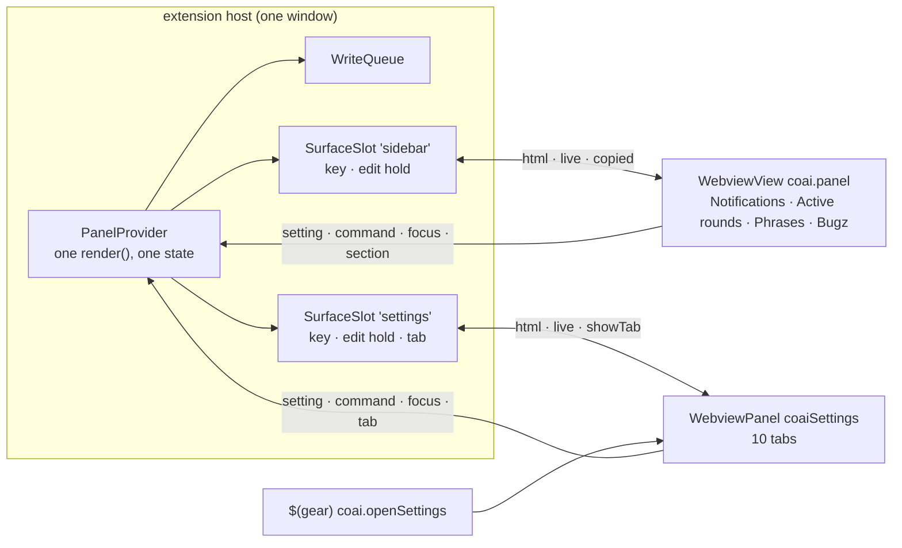

# PLAN — the sidebar keeps what is happening now; everything you configure opens in a Settings tab

> Status: **in progress, 2026-09-28 — S1, S2 and S3 built on `feat/settings-page-e1`; S4 (sentences, the help audit) and S5 (the measurement) under way; nothing merged.** Scope: `src_vs_code` (the sidebar
> `coai.panel`, a new `Settings` editor tab, `package.json`, the help in five languages, the READMEs),
> the user-facing strings in `src_mcp` and `src_server` that send a person to a sidebar section, and
> `research/module_extension.md` / `research/architecture.md`.
>
> Related docs: [module_extension.md](../research/module_extension.md),
> [module_tests.md](../research/module_tests.md), [architecture.md](../research/architecture.md).
> Boundaries with four open plans are in § *Boundaries*, and written into each of them too.

## The goal, as the operator asked it (2026-09-28)

The ConnectOtherAIs sidebar is fourteen collapsible sections in one narrow column: Reviewers, Chat
other AIs, Phrases, Consultant, Bugz, Prompts per round, The gate, Limits, Vendor keys, Team servers,
This side, MCP server, Active rounds, Notifications. Most of them are configured once and then only
scrolled past on the way to the three or four that a person actually visits.

The operator's instruction, verbatim in intent:

1. The sidebar keeps **only** Notifications, Active rounds, Phrases and Bugz.
2. The view's title bar — where the yellow **?** help button already sits — gains a **gear** button.
3. Pressing it opens a **tab in the editor** (a webview), with **one tab per section that moved**.
4. Everything a moved section showed when it was expanded moves **as it is** into its tab.
5. Review the design, raise questions, say what can be improved or fixed.

## What must be true when this is done

1. The sidebar shows the open-questions block (unchanged, always first, never collapsible), then
   exactly four sections: **Notifications, Active rounds, Phrases, Bugz** — in that order.
2. `coai.openSettings` exists, is in the command palette as *ConnectOtherAIs: Settings*, and is a
   `$(gear)` icon in the `coai.panel` title bar immediately after the help button.
3. It opens ONE editor tab per window, titled *ConnectOtherAIs — Settings*; pressing the gear again
   reveals that tab rather than opening a second. It accepts an optional tab id and opens on it.
4. The tab holds ten tabs in today's sidebar order: **Reviewers, Chat other AIs, Consultant, Prompts
   per round, The gate, Limits, Vendor keys, Team servers, This side, MCP server**. Each tab's body is
   the section body that the sidebar drew, from the SAME builder, with the SAME controls, the SAME
   `data-setting` / `data-command` protocol and the SAME write path — an edit made in the tab stores
   exactly what the same edit stored in the sidebar.
5. The tab strip is a real WAI-ARIA tablist: `role`/`aria-selected`/`aria-controls`, a `tabpanel` per
   tab, Left/Right/Home/End, roving `tabindex`.
6. Switching tabs never repaints the page; which tab is open survives every repaint and a
   close-and-reopen in the same window.
7. Running-consultation cards stay in the SIDEBAR (see decision D2), inside Active rounds.
8. No sentence anywhere — sidebar, Settings, other pages, help in five languages, READMEs, manifest
   descriptions, coai-mcp and coai-server messages — sends a person to a section where it no longer is.
9. The sidebar no longer misses a probe that lands after its first paint (§ *Found on the way*, F1).

## Constraints

- **No behaviour change beyond the above.** A setting keeps its key, its layer (per-side overlay
  included), its validation and its refusal path. The server contract does not change.
- **One implementation of every section.** The Settings page does not get copies of the section
  builders, the page script, the write queue or the probes (`.agents/conventions/common/reuse-first.md`).
- **A webview page is tested by RUNNING it** (`.agents/PROJECT.md`); no new behavioural assertion over
  page source text.
- **The sidebar is present tense** — the 2026-09-05 ruling (`research/module_extension.md`, *The
  sidebar shows what is running, and nothing else*): nothing expandable is added to a patched region.
- **800 lines per file, 400 for new modules.** `panelProvider.ts` (4 015) and `panelView.ts` (3 196) are
  already over and each has its own split plan; this work must make both SMALLER, never larger.
- Every `createWebviewPanel` passes a top-level `enableFindWidget: true`
  (`test/panelsAreSearchable.test.ts`) and its owner subscribes to `onDidDispose`
  (`test/theLogRefusesToOpen.test.ts`).

## How the sidebar works today (verified 2026-09-28 on `origin/main` 3f351c05)

- **One page.** `panelHtml` (`src_vs_code/src/panelView.ts:372`) builds `#live-questions` and all
  fourteen `
` from `section()` (`:859`), one
  inline `<script nonce>` (`:449-695`) and one CSS block.
- **One provider, one state.** `PanelProvider` (`panelProvider.ts`) holds one view (`held`), one
  `paintedKey` (`:256`), one `openSections` (`:261`) and one edit hold (`editingSince/Id/Caret`).
  `resolveWebviewView` is at `:384`.
- **Two update paths.** `render()` builds a whole `PanelState`, then either assigns `webview.html`
  (when `staticKey(state)` changed and no edit hold applies) or posts `{type:'live'}` with four regions:
  `live-questions`, `live-rounds`, `live-consultations`, `live-notifications` (`panelView.ts:2620`).
- **Five messages** from the page: `section`, `prompt`, `setting`, `focus`, `command` — one `if` chain at
  `panelProvider.ts:396-413`. Commands are the closed list `PANEL_COMMANDS` (`panelView.ts:3036`) with a
  compile-time exhaustiveness check; eight are delegated to registered VS Code commands through
  `VSCODE_COMMAND_FOR` (`:3121`).
- **Renders are frequent.** The escalation watcher calls `onChanged` every 5 000 ms, plus config events,
  every panel command, and every probe that lands. Every render recomputes the whole state — CLI
  `--version` probes, GitHub, price tables, model lists, local-engine probes, a `readBugs` spawn — in
  every window whose sidebar is resolved.

## Decisions (the operator may overrule any of them; each is cheap to change before S3's move)

| # | Decision | Why |
|---|---|---|
| D1 | Sidebar order **Notifications, Active rounds, Phrases, Bugz** — the order the operator named them in. | What is happening NOW first; the two tools under it. Today's relative order was Phrases, Bugz, Rounds, Notifications. |
| D2 | **Running consultations stay in the sidebar**, as the second region of *Active rounds*; the Consultant's SETTINGS move. This is the one deviation from "as it is". | The Consultant section carries the live `#live-consultations` cards. The recorded rulings say a running consultation "is in the sidebar… the sidebar is present tense" (`module_extension.md`, 2026-09-05 and the consultation-cards section). Moving the section whole would take a present-tense region off the sidebar and put it in a tab that is usually closed. |
| D3 | **One provider, several surfaces** — the sidebar view and the Settings panel are two webviews painted from ONE `PanelState`, ONE page script, ONE dispatcher, ONE write queue. | The alternative, a second provider, is a second copy of every probe and every write path — the defect `reuse-first.md` exists for. |
| D4 | The paint key becomes **the static markup itself** (live regions blanked, script and focus excluded), per surface. | Fixes F1 by construction: a hand-kept field list cannot miss a field that is not a list. Per-surface keys also mean an edit in Settings no longer reloads the sidebar (closing its dropdowns) unless the sidebar's own markup changed. |
| D5 | The Settings tab strip is the product's neutral strip (`tabStrip.ts`), **without** the section heading colours. | `rolesPage.ts:586-588`: two pages with tabs that look different would be two products. The sidebar keeps its `.sec-*` tones. |
| D6 | The active tab is held by the HOST (a module variable, as `rolesPanel.ts:33-46`), switched instantly by the page, and kept OUT of the markup: panes are drawn tab-neutral and the held tab reaches the page as a script literal beside the caret's (`focusLiteral`), so a tab press can never move the markup key (own review M1 — a pane drawn selected would have made every press a full reload on the next tick). The host posts `showTab` after every html write, unconditionally, rather than trying to detect a race it cannot see. | A repaint replaces the document; a page-only tab would be lost on every structural edit. A stored setting is not worth a key. |
| D7 | **No `WebviewPanelSerializer`**: after a window reload the Settings tab does not come back by itself. | Every non-chat page here behaves this way; the one serializer (`extension.ts:651`) is guarded by `theTabWearsAnIcon.test.ts` to go through the chat builder. A restorable Settings tab is a separate, small follow-up if wanted. |
| D8 | The gear is `navigation@1`, the rounds list moves to `navigation@2`. | VS Code orders by the number and then by TITLE, so the three entries sharing `@0` come out *Answer the open question…* then *Help*; `@1` puts the gear straight after help and `@2` keeps the rounds list after it. A manifest test pins the order, since nothing did. |
| D9 | coai-mcp and coai-server messages are rewritten **version-neutrally** ("the Team servers settings of the ConnectOtherAIs extension"), not "the Settings tab". | The server ships on its own clock; a new server paired with an old extension must still send the person somewhere that exists. |

## Found on the way — to fix inside this plan

| # | Defect | Evidence | Where it is fixed |
|---|---|---|---|
| F1 | **A probe that lands after the first paint never reaches the screen.** `staticKey` (`panelView.ts:3136-3196`) omits `providers`, `cliStatus`, `claudeProbe`/`askingClaude`, `agyModels`, `modelPrices`, `snippetStatus`, `enginesByEndpoint`, `latestTeamServerVersion`, `perSide`. `refreshProviders` calls `render()` when the verdict changes (`panelProvider.ts:886`), the key is unchanged, only live regions are posted — the *cannot review* badge waits until something unrelated repaints. | **RED, observed 2026-09-28**: `src/test/aProbeThatLandsRepaints.test.ts` — the fixture's html differs, `staticKey` does not (*"the verdict landed in the state and the key did not move"*). | S1 |
| F2 | **A re-resolved sidebar can be blank.** `resolveWebviewView` never resets `paintedKey`; if the new view resolves with an unchanged state, `render()` skips the html write and posts live regions into an empty document. | Read, not yet observed — `viewHandle.ts:8-13` says VS Code re-creates a hidden view. S2 writes the RED test first; if it cannot be made red, this row records that and the slot design keeps the reset anyway. | S2 |
| F3 | **A late disposal of an old view clears the LIVE view's edit hold** (`panelProvider.ts:391-394` calls `forgetEditing()` unconditionally; only the handle release is ownership-checked). | Read. RED test first in S2. | S2 |
| F4 | `render()` reads the whole `usage.jsonl` (`readUsage`) on every render and the sidebar draws none of it; `usageWindow`/`usageScope` are in `staticKey` and drawn nowhere in the panel. | Read. | S1 (the key), S5 (the read) |
| F5 | Already-stale text: help says "the **Server** section" (`helpContent.ts:98`, `:100`) and "**Language**" (`:431`); `ContractVersion.cs:91`, `RemoteAsk.cs:160`, `:200`, `PanelSettings.cs:1068` say "Server section" — it has been *MCP server* since 2026-09-07. `research/architecture.md:275` describes a Server-section block removed the same day. | Read. | S4 |
| F6 | The status line of `PLAN_the_panel_provider_is_too_big.md` says *nothing implemented yet* while clusters 1, 10 and 11 shipped (#400, #403, #404). | `git log` | corrected in this plan's own commit, with the boundary row |
| F7 | **A guard that guards nothing.** `test/theLogRefusesToOpen.test.ts:201` slices from `indexOf('const live = this.view;')`, a line that no longer exists (it is `const live = this.held.view;`, `panelProvider.ts:1002`): `indexOf` is −1, the slice is the file's last character, and both assertions pass whatever `render()` does. | Read 2026-09-28. | S2 — replaced by a run test of the surface's paint, which is where that rule now lives |
| F8 | **The Claude probe cancels itself when the SIDEBAR is closed** — `claudeProbeCache.ts:181`, `:189` ask `this.held.view === undefined` of the sidebar's handle. With a second surface, a person on the Settings tab's Consultant or Reviewers dropdowns would never get an answer while the sidebar is hidden. | Read. | S2 — the cache is given "is ANY surface held" |
| F9 | **A refused API setting freezes every later write in the panel.** `writeApiSetting` (`panelProvider.ts:1846-1847`) runs INSIDE the write queue and does `await this.snapBack()` directly; `snapBack` renders, `render()` awaits `writes.settled()` (`:906`), and `WriteQueue.settled` (`writeQueue.ts:22-29`) awaits the chain that holds this very write — the PR #561 freeze, fixed everywhere else by `afterTheWrite` and missed at this one site. Swept by shape over every method reachable from `write()` and `choosePrompt()`: the only unwrapped site. | Found by the cadence consultation (480323ac, codex), confirmed by reading 2026-09-28. | S2 |
| F10 | **Opening a section reloads the whole sidebar a few seconds later.** `openSections` was in `staticKey`, so a toggle the PAGE had already drawn changed the key and the next tick reassigned `webview.html` — the same page, with the scroll position and any open dropdown gone. | **RED, observed 2026-09-28** in the S1 table (*"the person opens a section: that would reload the whole webview on the next tick"*). | S1 |

Not fixed here, named for the operator: `notificationsRows.ts` still has its own tab strip and the
rounds log's strip lacks ARIA (both owned by `PLAN_the_tabs_announce_themselves.md`); dead segmented
`.tabs` CSS in `panelView.ts` (deleted in S3 because it would break the new strip).

## The design

- **Section registry** (`PANEL_SECTIONS`, in `panelView.ts` because the body builders are private there
  and a separate module would need a `panelView`↔registry import cycle): `{ id, title, surface, live,
  body }` per section. `surface` is `'sidebar' | 'settings'`. Ids stay `[a-z]+` except the existing
  `teamServers` (the `data-section="([a-z]+)" open` scan only ever looks at sidebar sections, where no
  camel-case id remains).
- **Layouts** (`panelSurface.ts`, pure): `sidebarPainted` — the questions head plus `
` per
  section; `settingsPainted` — `tabStrip(…)` plus one `<section class="pane sec-{id}" role="tabpanel"
  data-section="{id}">` per tab. It keeps `data-section` so every existing test that slices the page by
  section keeps working, and deliberately lacks the `section` class and the `open` attribute, so the
  accordion's toggle binding (`.section`) and the open-sections scan (`data-section="…" open`) never see
  a pane. Each returns `{ body, key }`: the key is the body with every live region blank.
- **Focus is per surface.** `render()` stops writing `PanelState.focus`; each surface overlays its own
  caret when it paints, so a caret recorded on one page is never restored into the other.
- **One page script** (`panelScript.ts`, a verbatim move of `panelView.ts:450-694`) plus `paneScript()`
  (tab clicks, `showTab`) and `tabKeysScript()` (`tabKeys.ts`). Both are inert on a page with no
  `[data-tab]`.
- **Surfaces** (`panelSurfaces.ts` + `editHold.ts`, no `vscode` import, like `viewHandle.ts`):
  `SurfaceSlot` attaches a webview (resetting its key and hold — F2), detaches only the webview it holds
  (F3), paints with the disposal guard and records the key only after a successful write, posts
  disposal-filtered. `paintSurfaces` awaits the write queue, builds the state once, re-reads which
  slots are held after the awaits, paints-or-patches each, and posts `live` to every held slot.
- **Messages** (`panelMessages.ts`, pure): `panelMessageFrom(raw)` → a discriminated union including
  `tab`. The surface id is bound when the listener is attached, never sent by the page, so it cannot be
  forged. `copied` and snap-back go to the originating surface; `live` goes to all.
- **Settings host** (`settingsPanel.ts`, thin `vscode` shell): `openSettings(host, tab?)` — create or
  reveal; `createWebviewPanel('coaiSettings', 'ConnectOtherAIs — Settings', ViewColumn.Active,
  { enableScripts: true, retainContextWhenHidden: true, localResourceRoots: [], enableFindWidget: true })`;
  zoom and text tone pushed as on the roles page; `onDidDispose` releases the slot.

### What each surface costs (S5, measured before anything is gated)

Today every render pays for everything, and after S3 it still will — the split alone neither adds nor
removes a probe. S5 measures per-probe cost with the sidebar alone; any gating it calls for (a follow-up plan) is on the union
of what the HELD surfaces draw plus two consumers that are not sections: the chat command's discovery
snapshot (`rememberDiscovery`, `panelProvider.ts:1575`, reads codex/agy/Claude models and the Team
catalogs) and the side effects that ride on the render today (the Team-server token reconcile in
`refreshTeamServers`, the server's *did not understand a setting* notice in `refreshProviders`). Those
side effects move to an activation-owned timer BEFORE their probe is gated, or closing the Settings tab
would silently stop them.

## Build order — five stories, one branch, one gate

**Re-cut by the gate's own orders on 2026-09-28.** The plan round (verdict `good_enough`, 3 of 3
reviewers) came back with operator commands: split into 3–5 STORIES rather than epics, build them on
this one branch, and run `review_code` ONCE over the whole committed diff. The earlier four-epic cut,
each with its own gate session, is superseded. The command also asked for the split itself — and the
architecture story — to be done on Fable; Fable was unavailable (the account's Fable limit, HTTP 429,
2026-09-28), so both were done on Opus, and that is recorded here rather than hidden.

Each story is its own commit with a green suite, in this order:

### S1 — The key is what is drawn (F1, F4's key half) · Opus

- RED first: `aProbeThatLandsRepaints.test.ts` becomes a table — for every field in F1, assert the
  fixture changes the html, then that the key changes. Negative half: questions, sessions,
  consultations, notifications, cadence, two different clocks, the focus literal, and an identical
  answer rebuilt with a different property insertion order must NOT move it (the consultant's point:
  a key that is markup inherits any volatility of the markup, so stability is proved, not assumed).
- The section registry (`PANEL_SECTIONS`, every entry `surface: 'sidebar'`) and the parts model:
  `panelSurface.ts` builds `{ body, key }`, the key being the body with every live region blank.
  Markup byte-identical to today's.
- The page-wide invariant tests iterate every surface through one helper NOW, before any surface has a
  second page (`settingsAreDeclared.test.ts:63`, `liveRepaint.test.ts:93-104`, the CSS/escape
  invariants in `panelView.test.ts`) — otherwise they go vacuous rather than red when sections move.
- `liveRepaint.test.ts`'s `usageWindow` case is retired with its reason (its section left the panel).

### S2 — One provider, several surfaces (F2, F3, F7, F8, F9) · Opus (the command asked Fable; unavailable)

- `editHold.ts`, `panelSurfaces.ts`, `panelMessages.ts`; the provider loses `held`/`paintedKey`/
  `editing*` and gains `surfaces`. Still only the sidebar is attached, so nothing is visible.
- RED first for each defect: a slot attached after a paint writes html (F2); a late detach of a
  replaced view keeps the live view's hold (F3); F7's dead guard is replaced by a run test of the
  slot's paint; the Claude probe runs when ONLY a non-sidebar surface is held (F8); a refused API
  setting does not freeze the write queue (F9).
- **F9's fix and its guard.** `writeApiSetting` goes through `afterTheWrite` like every other refusal.
  The guard is structural and follows CALL CHAINS, not one method: from every method the dispatcher
  enqueues (`write`, `choosePrompt`), it walks the provider's own methods those call and fails, naming
  file and line, on any `await this.snapBack()` / `await this.render()` reached — a scan of `write()`
  alone would have missed this very defect (consultation 480323ac, turn 2).
- The origin is threaded as a parameter, never read from the page: `write(message, from)`,
  `choosePrompt(from, …)`, `snapBack(from)`, `run(command, id, from)`, `copyPhrase(id, from)`.
  `copied` and snap-back go to `from`; `live` goes to every held surface.
- The source-text pins in `thePromptBoxRemembers.test.ts:409-413` become run tests of `paintSurfaces`
  with fakes (settled before build; a held edit patches; `copied` reaches only its own slot; a
  `setting` from a second surface goes through the SAME dispatcher and queue as the sidebar's).

### S3 — The Settings tab (D1–D8) · Opus

- The page script leaves `panelView.ts` into `panelScript.ts` as its own commit, a pure move proved by
  `scripts/prove-move.mjs`.
- `tabKeys.ts` (step 1 of `PLAN_the_tabs_announce_themselves.md` §B) and the opt-in `roving` flag on
  `tabStrip` (absent = every existing page byte-identical).
- `settingsPainted`, `paneScript`, the Settings CSS (a wrapping strip, a readable `max-width`, the dead
  segmented `.tabs` rules deleted), `settingsPanel.ts`, `coai.openSettings` in `extension.ts` and
  `package.json` (D8), the Sonar exclusion for the new `vscode` module.
- The move: ten registry entries flip to `'settings'`; `live-consultations` joins Active rounds (D2);
  the sidebar order becomes D1.
- Tests: the Settings page RUN — a tab press un-hides exactly its pane, the other nine stay hidden with
  `aria-selected="false"`, posts `{type:'tab'}`, never repaints; `showTab` selects without posting;
  `role="tablist"`/`role="tab"`, every `aria-controls` target exists and every panel's
  `aria-labelledby` points back; an edit in a pane posts the same `setting` shape; the caret is
  restored inside the active pane; `bundledPage.test.ts` runs the MINIFIED page. The sidebar renders
  exactly the four sections in D1's order; the moved sections' existing tests pass against the
  Settings surface.
- A real-editor scenario: `coai.openSettings` called twice back-to-back (the second not awaited after
  the first) leaves exactly one Settings tab; opened with a tab id, that tab is selected; closed and
  reopened, it opens again; and, where the harness reaches the provider, a per-side moved setting
  written from the Settings surface reads back from the same layer.

### S4 — Every sentence points at the new place (F5, D9) · Opus

- The extension's own strings: the skew notes that say "the MCP server section below"
  (`apiRuntime.ts:83`, `apiSettingsView.ts:57`, `apiKeyVendors.ts:88`, `commandModels.ts:203`,
  `featureGate.ts:68`, `gateScope.ts:34`, `:50`, `consultSettings.ts:478`, `panelView.ts:1933`, `:1954`,
  `:1975`) become "the MCP server tab"; `rolesPage.ts:393`, `roundsLog.ts:1071`, `models.ts:257`,
  `teamServerAuth.ts:381`, `chatModels.ts:364`, `:371`, `panelProvider.ts:685`, `:1610`.
- The help — every article that places a moved section "in the panel", in **all five languages** in
  the same commit — and an article for the gear, with a distinctive `helpCoverage` ALIAS (a command
  titled "Settings" would pass that test vacuously). `package.json` descriptions (`:635`, `:881`),
  `src_vs_code/README.md` *The panel*, the root README captions.
- The servers, version-neutrally (D9): `src_mcp/runners/Reviewers/RemoteAsk.cs:145`, `:149`,
  `:160-161`, `:200`, `RemoteProbe.cs:115`, `runners/Consultation/ConsultantResolution.cs:52`,
  `src/Server/Consultation/ConsultantResolver.cs:73`, `ConsultationService.cs:280-289`,
  `src/Server/PanelSettings.cs:1068-1070`, `src_server/src/ContractVersion.cs:91`, and the C# tests that
  pin those words (`RemotePollDecisionTests.cs:129`, `RemoteReviewerTests.cs:200`, `:499`,
  `RemoteProbeTests.cs:70`, `RemoteShimScenarioTests.cs:259`, `ConsultantsTests.cs:370`,
  `ConsultantPromptTests.cs:347`, `:522`, `ConsultantArgvTests.cs:224`, `ConsultScenarioTests.cs:515`,
  `:583`, `CadenceGateTests.cs:283`). Every line is re-read at the time; these numbers move.
- **The sweep, by method.** Case-insensitive, over `src_vs_code/src` (help ×5 included),
  `src_vs_code/package.json`, `src_vs_code/README.md`, `README.md`, `ARCHITECTURE.md`, `src_mcp`,
  `src_server`: every moved section's name (`Reviewers`, `Chat other AIs`, `Consultant`, `Prompts per
  round`, `The gate`, `Limits`, `Vendor keys`, `Team servers`, `This side`, `MCP server`, and the stale
  `Server section`/`Language`) within a sentence that also says `section`, `panel` or `sidebar`, plus the
  phrases `section below`, `section of the panel`, `in the panel`, `in the sidebar`. Every hit is fixed
  or recorded in the PR as still true; the command and its hit count are in the PR body.
- `research/module_extension.md`, `research/module_tests.md`, `research/architecture.md` describe the
  two surfaces; the Mermaid renders.

### S5 — What the sidebar pays for (measure, then decide) · Opus

- Per-probe time and spawn/network counts over an idle hour, sidebar only and with Settings open,
  written to `research/` — the measurement IS the deliverable.
- **If the probes only the Settings tab draws are material**, the gating is extracted into a follow-up
  `todo/` plan rather than built here: it needs the render's side effects (the Team-server token
  reconcile, the providers notice) moved to an owned timer first, it gates per held SURFACE and never
  per visible TAB (every tab of an open Settings page has its probes run, so switching tabs never shows
  stale data), and it waits on step 2 of `PLAN_panel_probing_state.md`. If they are not material, the
  measurement says so and nothing further is owed.
- `readUsage` (F4's other half) leaves `render()` here: the sidebar draws none of it and nothing else
  reads the value the render produces.

## Test plan

| Story | Test | What it would see if the behaviour were deleted |
|---|---|---|
| S1 | `aProbeThatLandsRepaints.test.ts` (table, positive + negative incl. property order and two clocks); registry: ids unique, every surface non-empty, each live region exactly once; invariants iterate surfaces | the key equal for two states the page draws differently; a setting or command on a surface nobody scans |
| S2 | slot attach-after-paint writes html (F2); late detach keeps the live hold (F3); the Claude probe runs with only a non-sidebar surface held (F8); a refused API setting does not freeze the queue, and the call-chain guard (F9); `paintSurfaces` with fakes; `panelMessageFrom` table; a second surface's `setting` uses the same queue | a blank sidebar; a lost caret; a frozen panel; `copied` on the wrong page |
| S3 | `prove-move.mjs` for the script; `tabKeysScript` run in the DOM shim; the Settings page run (panes, ARIA relationships, `showTab`, same `setting` shape, caret); the minified bundle; the four sidebar sections in D1's order; moved sections' tests against the Settings surface; the real-editor scenario | a tab that shows two panes; a tab press that reloads the page; two Settings tabs; a section on both pages or on neither |
| S4 | `helpCoverage.test.ts` with the gear ALIAS; every language carries the changed articles; the C# tests reworded; the sweep's hit list | a help page or a server message that still says "in the panel" |
| S5 | the measurement, recorded | — |

Before the code round, and before any release: `npm run typecheck`, `npm test`, `npm run lint`, `npm run test:host`, the whole C# suite (S4 touches it), and
the family checks (`plan-lifecycle.mjs`, `pin-check.mjs`). A clean `tsc` is read before any suite number
is reported.

## Progress and deviations (recorded as it happens)

| Story | State | What shipped differently |
|---|---|---|
| S1 | built, `a9944d55` | as planned; F10 (open sections in the key) found by its own RED table |
| S2 | built, `18337949` | the slot module is `surfaceSlot.ts` (the plan said `panelSurfaces.ts` + `editHold.ts`: one module was enough); the message parser stayed a typed interface in the provider rather than `panelMessages.ts`, because every field is still checked where it is read. F9's guard follows awaited and returned calls, and found only the one site |
| S3 | built, `1649a9bf` | **the page script did not move** to `panelScript.ts`: a shared `pageDocument(body, nonce, focus, extra)` gives the Settings tab the same script without a 245-line move, which stays with `PLAN_two_files_outgrew_the_rule.md`. The extension's own sentences (S4's first half) landed with it, because they sit in the files the move touched. The test-conversion proof ran as a mutation: the same 195 tests fail with the moved bodies blanked, before and after |
| S4 | under way | the servers' wording is **ConnectOtherAIs > Team servers** (> Consultant, > MCP server), true of either extension — ASCII, because `RemoteShimScenarioTests` watched a real child's stderr deliver `→` as nothing |
| S5 | **extracted** to [PLAN_the_sidebar_pays_only_for_what_it_shows.md](PLAN_the_sidebar_pays_only_for_what_it_shows.md) | its deliverable is a MEASUREMENT — an idle hour per arm, counted — and a cost model computed from the cache windows is not one; the follow-up carries that model, labelled as computed, as its starting point |

The gate's commands asked for the split and the architecture story on Fable; Fable was unavailable (account limit, 2026-09-28), so both ran on Opus.

## What my own review added (Opus, run beside the plan round, 2026-09-28)

Folded into the stories above; recorded here so the round's findings and these are not confused.

| # | Finding | Where it lands |
|---|---|---|
| M1 | The held tab drawn into the panes would move the markup key on every press. | D6, S3 |
| M2 | Two CI ratchets bind the shape: the lint-suppression ratchet (`.github/scripts/suppressions-only-shrink.mjs`: a NEW file × rule pair is refused, so a moved 245-line script inside a function is refused) and the import-cycle ratchet (`importCycles.test.mjs`). So the script moves as a MODULE-LEVEL constant with `SAVE_AFTER_MS`, `COPIED_FOR_MS`, `CUSTOM_ENDPOINT` and `focusLiteral` moving with it, the caret and the tab emitted as separate literals; imports run `panelView → panelSurface` and never back; `panelMessageFrom` is table-driven. | S2, S3 |
| M3 | 29 test files make ~177 direct `panelHtml(` calls and 14 of them slice sections; a slice from `indexOf(...) = -1` is an empty string every negative assertion passes against. `sectionHtml(state, id)` (`test/panelPages.ts`) throws for a section no page draws; every section-slicing test moves to it BEFORE the flip, and the flip is followed by a break-it run (blank a moved body, watch its tests go red). | S1 (the helper), S3 (the conversion) |
| M4 | More sentences point where things will not be: "the ⋯ menu" in the MCP server section (`panelView.ts` — the ⋯ menu is the SIDEBAR's title menu) and `package.json` descriptions that say only "the panel" (the ones at `:372`, `:423`, `:491`, `:772`, `:833` on 2026-09-28). The sweep adds `panel` and `⋯` to its patterns. | S4 |
| minor | Test the Settings layout against a FIXTURE section list, so it is testable before the flip; the host scenario asserts the host-held tab id and one tab with the label, not DOM selection it cannot see; panes carry `id`, `aria-labelledby`, `tabindex="0"` and `[hidden]{display:none!important}`; zoom and text tone are NOT added (not "as is"); the render guard becomes "any surface held", with discovery, notifications and Team-server refresh once per render; the Settings tab gets placeholder html at creation so a cold window does not show blank; coai-server's one sentence waits for the next server release (recorded, not a release of its own); no new `notify()` site; `openedFrom` validates the tab argument. | S2, S3, S4 |

## Questions for the operator (the plan proceeds on the answer in brackets)

1. Sidebar order — the order you named (Notifications, Active rounds, Phrases, Bugz), or today's
   relative order (Phrases, Bugz, Active rounds, Notifications)? **[the order you named — D1]**
2. Running consultations: keep their cards in the sidebar under Active rounds, or move them into the
   Settings tab's Consultant tab with the rest? **[sidebar — D2, the present-tense ruling]**
3. VS Code shows a view's title-bar icons only while the view is hovered or focused
   (`workbench.view.alwaysShowHeaderActions` is off by default), so the gear is invisible at a glance.
   Add a one-line *Settings…* button at the bottom of the sidebar as a second door? It costs one entry in
   `VSCODE_COMMAND_FOR`, which a test already holds against the manifest. **[no — not asked for; say so
   in the PR and let the operator add it]**
4. Should the Settings tab come back by itself after a window reload (a serializer)? **[no — D7, as
   every other page here]**

## Growth surfaces

None that grows. One module variable (the open tab) and one `WebviewPanel` per window, disposed on close.
No file, table, cache or process is added; S5 can only remove work.

## Boundaries

| Plan | This plan owns | That plan keeps | Order |
|---|---|---|---|
| [PLAN_the_panel_provider_is_too_big.md](PLAN_the_panel_provider_is_too_big.md) | the view lifecycle it leaves in `PanelProvider` — `render`, `resolveWebviewView`, the dispatcher, the `write`/`run` signatures, the edit hold, `snapBack`. Not a move, so not proved by `prove-move.mjs`. | every one of its eleven clusters | independent; whichever lands second rebases and re-proves |
| [PLAN_two_files_outgrew_the_rule.md](PLAN_two_files_outgrew_the_rule.md) | `panelScript.ts`, the section registry, the Settings page, and replacing `staticKey` (its planned `panelRepaint.ts` shrinks) | the file sizes, the CSS, the help constant, the command symbols, the region builders | this first — it moves code that one would otherwise have to move twice |
| [PLAN_the_tabs_announce_themselves.md](PLAN_the_tabs_announce_themselves.md) | its step 1: `tabKeys.ts`, and the `roving` option on `tabStrip` | converting the roles page, the rounds log and the window filter | this first; that plan then consumes `tabKeys.ts` |
| [PLAN_panel_probing_state.md](PLAN_panel_probing_state.md) | the definition of the paint key | *render never awaits a probe*; its spinner tests need live slots | any gating S5 calls for waits for its step 2 |

## Definition of Done

- [ ] The sidebar is the questions block plus Notifications, Active rounds, Phrases, Bugz — nothing else.
- [ ] The gear opens one Settings tab per window, with the ten tabs, reachable from the palette and by tab id.
- [ ] Every moved control stores exactly what it stored before, on the same layer — the moved sections'
      existing tests pass against the Settings surface unchanged in what they assert.
- [ ] The tab strip passes the keyboard tests; a tab press never repaints.
- [ ] Running consultations are still in the sidebar.
- [ ] F1, F2, F3, F8, F9 and F10 each have a test that was observed RED before its fix and GREEN after (or, for F2, the record of why it could not be made red).
- [ ] No sentence in any surface, language, README, manifest or server message names a section where it
      no longer is (swept by searching for every moved section's name, method stated in the PR).
- [ ] `panelProvider.ts` and `panelView.ts` are both smaller than on 2026-09-28; every new module < 400 lines.
- [ ] `research/module_extension.md`, `research/module_tests.md` and `research/architecture.md` describe
      the two surfaces; the Mermaid renders.
- [ ] The boundary rows exist in all four sibling plans.
- [ ] One `review_code` round over the whole committed diff; its verdict and reviewer count are in the PR.
- [ ] Extension and coai-mcp released after the merge (S4 changes both) — each with the
      operator's go-ahead, since both publish.
