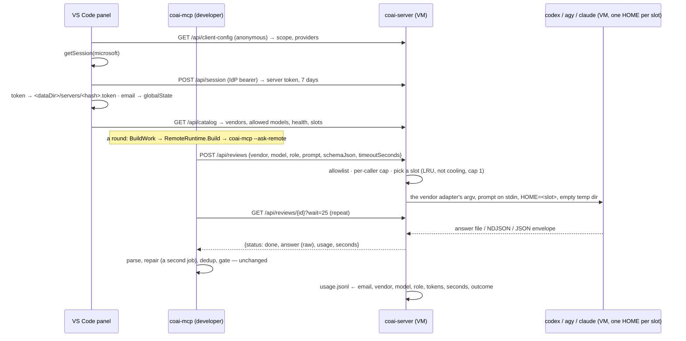

# PLAN — a Team server: one subscription per vendor, shared by everyone who signs in

> Status: **plan only, nothing implemented yet, 2026-09-04.** Scope: a new `src_server/` (the
> `coai-server` host + tests + `http/` suite + `deploy/`), `src_mcp/runners` (a `remote` runtime, the
> `--ask-remote` shim, three extractions), `src_vs_code/` (a *Team servers* section, sign-in identical
> to CredsForDevs, the reviewer picker, the usage section), and two host-level steps on the VM — a site
> file beside the vault's and a certificate of its own. **No change to `dew_flow_creds_for_devs`**: the
> machine's edge turned out to be a host nginx rather than the vault's container (see *Deployment*).
>
> Related docs: [architecture.md](../research/architecture.md),
> [module_runners.md](../research/module_runners.md), [module_server.md](../research/module_server.md),
> [module_extension.md](../research/module_extension.md), and the local-model record this design is
> modelled on, [PLAN_local_models.md](../research/PLAN_local_models.md).
>
> Every `file:line` below was verified against **`main` at `6551979`** (2026-09-05). The first draft was
> written against a feature branch 77 commits behind it, and nine of the cited files had moved — which
> is why the references carry a commit rather than a date, and why re-verifying them is the first step
> of any story that quotes one.

## The goal

A company has many developers and does not want each of them to buy a Codex, an Antigravity and a
Claude subscription. It buys **one of each**, installs the three CLIs on **one Linux VM** (the same VM
that already runs the CredsForDevs vault), signs each CLI in once, and runs `coai-server` there. A
developer opens the ConnectOtherAIs panel, adds the Team server by URL, signs in with the company
**Microsoft** account, and from then on *＋ Add a reviewer* offers "Team server ‹name›" → the
vendors the server allows → the models the server allows. Their local `coai-mcp` composes the review
prompt exactly as it does today and sends it to the server instead of to a CLI on their machine; the
server runs the CLI on the VM and hands back the answer and the tokens. Nobody outside the company
domain can sign in. Every run is accounted to the person who asked for it, and an admin can see who
spent what.

**No paid vendor APIs.** This is the operator's decision, recorded with its cost: one subscription is
one pool of rate limits for the whole team (Codex and Claude meter a 5-hour rolling window plus a weekly
cap; Antigravity a per-plan baseline quota — see *Slots*), and a shared consumer account is
account-sharing under the vendors' consumer terms. Both are accepted knowingly; the slot mechanism below
is how the first is made bearable, and the second is out of this product's hands.

## What exists, and what this reuses

This is **not** a new review engine. `coai-mcp` already runs a vendor CLI with a composed prompt on stdin
in an empty directory ("Fast", the measured default — `research/RESULTS_findings_that_are_worth_something.md`),
classifies six outcomes, kills a runaway process tree, caps concurrency per vendor, parses each vendor's
usage, and records every run. All of that is a library (`CoaiMcp.Runners`, which references only
`CoaiMcp.Core` and nothing MCP-shaped — `src_mcp/runners/CoaiMcp.Runners.csproj`), and the server is that
library behind HTTP:

| Already here | Where | Used by the server as |
|---|---|---|
| The vendor adapters — argv, where the answer lands, how usage is read | `src_mcp/runners/Reviewers/ReviewerRuntime.cs:85-118` (`IReviewerRuntime`), `:159-210` (Codex), `ClaudeRuntime.cs`, `AntigravityRuntime.cs` | the launch, unchanged |
| The launch + classification (Ok / NonZeroExit / TimedOut / Unparseable / RateLimited / NotStarted) | `src_mcp/runners/Reviewers/ReviewerExecutor.cs:10-52`, `:254` (`RunOnceAsync`) | extracted as a public `LaunchAsync` (below) |
| Rate-limit recognition, "hopeless" daily quota | `ReviewerExecutor.cs:58-133` (`RateLimit`) | as is, plus the cooldown parser |
| Concurrency caps that outlive a round | `src_mcp/runners/Reviewers/BoundedScheduler.cs` | one scheduler per server process |
| Process tree kill on timeout / cancellation, UTF-8 stdin | `src_mcp/runners/Processes/ProcessLauncher.cs` | as is |
| Retired / not-signed-in / untrusted-directory diagnoses | `src_mcp/runners/Reviewers/VendorDiagnosis.cs:59`, `:150`, `:174` | catalog health + the *needs sign-in* slot state |
| The "not a CLI" reviewer shape: a shim process, prompt as a file, `{"tokensIn","tokensOut"}` on stdout | `src_mcp/runners/Reviewers/LocalRuntime.cs:110`, `src_mcp/src/Program.cs:115` (`AskLocalAsync`) | the model for `RemoteRuntime` + `--ask-remote` |
| Settings re-read by file stamp on every call | `src_mcp/src/Server/PanelServiceHost.cs:53-71` (`Current`), `:87` (`Stamp`) | the pattern for `vendors.json` hot reload |
| The fake vendor CLI | `src_mcp/tests_fakecli/Program.cs:21-72` | the server's vendor in every test |

And from CredsForDevs, the half that already solved "a company server behind Microsoft sign-in":

| Already there | Where (in `d:\rsd\dew_flow_creds_for_devs`) | Copied as |
|---|---|---|
| Three JwtBearer schemes (Microsoft by tenant OIDC, Google, Local HMAC for tests), `AuthenticateAny`, `RequireCaller` (401 no email / 403 domain), fail-fast startup guards, caller-keyed rate limiting | `src_minimalapi_server/src/Program.cs:207-278`, `:322-349`, `:424-459`, `:1336-1367` | `src_server/src/Auth.cs`, `SessionAuth.cs` |
| Email from the token, never from the request; `email_verified:false` refused | `src_minimalapi_server/src/TokenIdentity.cs` | verbatim |
| The contract-version header and the 426 that precedes authentication | `src_minimalapi_server/src/ContractVersion.cs:30`, `:58`, `:77` | `X-Coai-Contract` |
| Anonymous `/api/client-config` advertising the scope, and the guard against a server naming a Graph scope | `Program.cs:545`; `src_vs_code/src/clientConfig.ts` (`isSafeAdvertisedScope`) | plus a `providers` list |
| The sign-in UX: `$(person-add)` Add Account → `$(azure) Microsoft` / `$(globe) Google` quick-pick → `vscode.authentication.getSession`; the email row with `media/account-green.svg` / `account-grey.svg` (an SVG file on purpose — a ThemeIcon is repainted in the selection colour); `$(sign-out)` Sign Out; the 401 "sign in again" and 403 "outside the allowed domain" sentences | `src_vs_code/src/commands/accountCommands.ts:109-147`, `accountItem.ts:24-47`, `authManager.ts:29-46`, `msScopes.ts`, `transportFactory.ts:204-228`, `serverTransport.ts:52`, `:181-190` | the *Team servers* section |
| The self-registered Google provider (PKCE + loopback listener) | `src_vs_code/src/googleAuthProvider.ts:74`, `googleOauth.ts` | **v2, not copied now** — and when it is, registered as `coai-google`, because VS Code refuses a second registration of the id `google` that CredsForDevs already owns |
| The in-process test harness on the Local scheme | `src_minimalapi_server/tests/VaultServer.cs`, `Tokens.cs` | `src_server/tests/CoaiServerHarness.cs`, `Tokens.cs` |
| The compose stack, the Native AOT Dockerfile, the release job that builds a multi-arch image on `server-v*` | `deploy/docker-compose.yml`, `src_minimalapi_server/Dockerfile`, `.github/workflows/release.yml:34`, `:86` | `deploy/`, `src_server/Dockerfile`, a `server-image` job here |

Every copied file carries a first-line header `// mirrored from dew_flow_creds_for_devs <path> @ 2026-09-04`.
Extracting the auth into a shared package is deliberately **v2** (below): there is no third consumer
yet, and a package for two copies is a package nobody maintains.

## The shape



Three decisions fix the shape, and each has a reason a reviewer should be able to argue with:

1. **The server returns the raw answer, not parsed findings.** `answer` is what the vendor adapter's
   `ReadAnswer` extracted (codex's `-o` file, agy's `result`, claude's `result`), and the client parses,
   repairs and deduplicates exactly as for a local reviewer — a repair is simply a second job. The server
   therefore knows nothing about the finding schema, the client's parse path is untouched, and the
   *Unparseable* evidence is kept where it always was (`<dataDir>/unparseable/` on the client). For this
   the launch-and-classify half of `ReviewerExecutor.RunOnceAsync` (`:254`) becomes a public
   `LaunchAsync(invocation, ct) → (ReviewerOutcome? terminal, string? answer, Usage usage, string evidence)`
   that both binaries call.
2. **The client side is a process, like `local`.** `RemoteRuntime.Build` launches this same binary in
   `--ask-remote` mode, for the reasons `LocalRuntime.cs:17-33` records: the process boundary is what
   gives the scheduler, the deadline, the kill and the usage accounting for free.
3. **Fast only.** The VM has no checkout, so a remote reviewer always runs in an empty directory — the
   measured default anyway. `COAI_CODE_WORKSPACE=worktree` does not apply to a `remote` row, and the row
   says so. A checkout on the server is v2.

## The server — `src_server/`

Layout mirrors `src_minimalapi_server/{src,tests}`: .NET 10 minimal API, `PublishAot`, xUnit v3 on the
Microsoft Testing Platform (the tests are an executable; `dotnet test` aborts here by design), Serilog per
`.claude/rules/shared/common/logging-serilog.md`. `Program.cs` is top-level statements and endpoint-group
calls only — creds' 1381-line `Program.cs` is the one thing here **not** to copy.

### Endpoints (the wire contract)

Every request carries `Authorization: Bearer <IdP token or server token>` and `X-Coai-Contract: 1`. A
client below the minimum gets **426** with a sentence before any token is looked at. Refusals are plain
text; unhandled errors are `500 {"error":"internal error"}` with the detail in the log — creds' shape.

| Route | Auth | Answers |
|---|---|---|
| `GET /api/health` | none | `{ok, version}`; the container's healthcheck (`--healthcheck` exec) |
| `GET /api/client-config` | none | `{microsoftScope, providers:[…]}` — the schemes actually enabled, which in v1 is `["microsoft"]` |
| `POST /api/session` | **IdP token only** | `201 {token, expiresUtc, email}` — a session token may not mint another |
| `DELETE /api/session` | any | `204`; revokes the token that authenticated this call |
| `GET /api/whoami` | any | `{email, name, isAdmin}` |
| `GET /api/catalog` | any | `{serverVersion, isAdmin, vendors:[{id, runtime, models[], health:{cliFound, version, note}, slots:{total, signedIn, coolingDown, needsSignIn}}]}` |
| `POST /api/reviews` | any | `202 {id, position}` · `400` vendor or model not allowed · `429 + Retry-After` over the caller's cap |
| `GET /api/reviews/{id}?wait=≤25` | owner | `{status: queued\|running\|done\|failed, position, answer, usage:{tokensIn,tokensOut,costUsd?}, seconds, failure:{kind, reason}}` · `404` not yours, unknown, or lost to a restart (with a sentence saying which) |
| `DELETE /api/reviews/{id}` | owner | `204`; kills the process tree |
| `GET /api/usage?window=today\|week\|month\|year&scope=me\|company` | any / **admins for `company`** | `me: {window, vendors:[{vendor, tokensIn, tokensOut, runs, failed, seconds, costUsd?}]}` · `company: {…, people:[{email, name?, vendors:[…]}]}` · `403` for `company` outside `Coai:Admins` |

`failure.kind` ∈ `non_zero_exit | timed_out | unparseable_by_vendor | rate_limited | not_started | cancelled | lost`
— a pure map off `ReviewerOutcome`; `reason` is the vendor's own line, chosen by content as
`ReviewerSummaryFactory.Because` already does.

### Files

| File | Lines | Holds |
|---|---|---|
| `Program.cs` | ~150 | `--healthcheck`, `login <vendor> <slot>`, builder + logging + guards, `Map*Endpoints()`, `try/finally Log.CloseAndFlush()` |
| `Auth.cs`, `TokenIdentity.cs`, `ContractVersion.cs` | ~120, 65, 90 | mirrored from creds |
| `SessionAuth.cs`, `SessionStore.cs`, `SessionEndpoints.cs` | ~90, 150, 90 | the 4th scheme as a middleware branch (opaque tokens are not JWTs); one JSON file per token under `<data>/sessions/<sha256(token)>.json` — the raw token is never stored, the filename is its hash |
| `VendorConfig.cs`, `VendorCatalogHost.cs`, `CatalogEndpoints.cs` | ~60, 90, 90 | `vendors.json` schema and its stamp-reload; the catalog answer |
| `Slots/AccountSlot.cs`, `SlotSelector.cs`, `SlotEnvironment.cs`, `CooldownParser.cs` | pure, ~40–80 each | below |
| `Slots/SlotRegistry.cs` | ~160 | acquire/release, cooldown and needs-sign-in persisted per slot |
| `Jobs/JobRecord.cs`, `JobStore.cs`, `JobRunner.cs`, `ReviewEndpoints.cs` | ~50, 150, 220, 130 | below |
| `RetryLadder.cs` | ~60 | **in `CoaiMcp.Runners`**, not here — both binaries use it |
| `UsageAggregation.cs`, `UsageEndpoints.cs` | ~120, 70 | pure aggregation over `usage.jsonl` lines |
| `VendorLogin.cs` | ~110 | the interactive `login` subcommand |
| `ServerJsonContext.cs`, `appsettings.json`, `HealthProbe.cs` | | one source-generated context; reflection off |

### Sessions

`POST /api/session` validates the IdP token through the mirrored schemes, then issues 32 random bytes,
stores `{email, name, createdUtc, expiresUtc, lastUsedUtc}` under the token's SHA-256, and returns the
raw token once. TTL **7 days** (`Coai:SessionTtlDays`). Every later request tries the session branch first
(a hash lookup) and the JWT schemes second. `DELETE` revokes. Expired files are swept at startup and
daily. A stolen data directory reveals which emails have sessions and nothing a bearer could be built from.

### The catalog and the allowlist

`/data/vendors.json`, edited by the operator, re-read by file stamp exactly as `PanelServiceHost.cs:53-71`
re-reads the panel's file:

```json
[
  { "id": "codex",       "runtime": "codex",       "models": ["gpt-5.6-luna", "gpt-5.6-sol"], "slots": ["a", "b"], "slotConcurrency": 1 },
  { "id": "antigravity", "runtime": "antigravity", "models": ["gemini-3.7-flash-high", "gemini-3.1-pro-high"], "slots": ["a"] },
  { "id": "claude",      "runtime": "claude",      "models": ["sonnet", "opus"], "slots": ["a"] }
]
```

`POST /api/reviews` refuses a vendor or model not on this list (`400`, naming the list). The catalog answer
carries each vendor's health from the same probe `providers` uses (`--version` after
`VendorDiagnosis.ForRuntime`, `PanelService.cs:134` — extracted to Runners, below) and the slot summary.

### Slots — one account is a directory

A vendor may have several signed-in accounts. A slot is `/data/accounts/<vendor>/<slot>/`, used as `HOME`
for that launch, plus the CLI's own variable where it has one:

| CLI | Isolation | Sign-in on a headless VM |
|---|---|---|
| codex | `CODEX_HOME=<slot>/.codex` (config, `auth.json`, caches) | `codex login --device-auth` — URL + one-time code |
| claude | `CLAUDE_CONFIG_DIR=<slot>/.claude`; **or** a `<slot>/claude.token` file (from `claude setup-token`, an `sk-ant-oat01-…` valid 12 months) handed over as `CLAUDE_CODE_OAUTH_TOKEN` | `claude` sign-in prints a URL; or paste the token file |
| agy | `HOME` only — it reads `~/.gemini/antigravity-cli/` and has no directory variable (Google's issue #632 is open) | under SSH it prints a URL + code; non-interactive without a cache exits `authentication required` |

`SlotEnvironment.For(runtime, slotDir)` is pure and produces exactly those variables; they go into
`ProcessRequest.Environment`, never argv, never a log line — the rule every runtime already keeps for API
keys. **The CLIs refresh their own tokens** (codex rewrites `auth.json` on rotation; claude and agy
likewise), which is why the server implements no OAuth refresh of its own — and why two things are
non-negotiable: the slot directory is a **persistent, writable volume** (a token refreshed inside a
throwaway layer is a token the next start has lost, i.e. `invalid_grant`), and **one process per slot at a
time** (`slotConcurrency` default 1 — two codex processes rotating one refresh token race, and the loser
burns the slot).

`SlotSelector.Pick(slots, nowUtc)` is pure: the least-recently-used slot that is not cooling down, not
marked *needs sign-in*, and under its cap. `SlotRegistry` is the impure shell: acquire/release, and the two
persisted states below.

**A slot is held by an OS lock, not by an in-memory flag.** `SlotRegistry` holds `<slot>/.lock` with
`FileShare.None` for as long as a job runs on the slot — the same kernel-released exclusion `EngineLease`
already uses for a GPU (`src_mcp/runners/Reviewers/EngineLease.cs`). It matters because the `login`
subcommand is a **separate process** (`docker compose exec`), and an operator signing slot `a` in while a
review is running on slot `a` would have two processes rotating one `auth.json` — the `invalid_grant`
that marks the slot *needs sign-in*. `login` takes the same lock first, and says *slot a is busy with a
review — waiting* until it is free. No IPC, no internal endpoint: one lock file, two holders.

- **cooling down** — set from a `RateLimited` outcome. `CooldownParser.Until(reason, nowUtc)` reads the
  vendor's own sentence: `resets 3:45pm`, `resets Mon 12:00am`, `try again at …` (codex/claude, the VM's
  clock — UTC — and a parsed time already past is tomorrow), `will refresh on July 15, 2026` (antigravity).
  No parseable time → 30 min, doubling on a repeat inside the same window, ceiling 5 h (the rolling window
  itself); the word *weekly* without a date → 24 h. Written to `<slot>/cooldown.json` so `update.sh`
  does not immediately hit the same exhausted account. The real sentences are captured from the VM at
  first deploy and pinned in `CooldownParserTests` — observed phrases, never imagined ones, the discipline
  `RateLimit.Phrases` already follows.
- **needs sign-in** — set when the CLI's failure matches the not-signed-in doors `VendorDiagnosis.For`
  already knows (missing bearer, bare 401, `authentication required`, `invalid_grant`). Not a cooldown: it
  never clears by itself. The catalog names the slot and the cure (`coai-server login codex b`), and the
  panel shows it on the row.

A slot unused for more than 30 days is reported in the catalog ("not used for 41 days") — Google expires
an idle refresh token after six months, OpenAI's lifetime is undocumented, and a spare account that has
quietly died is worse than one that says it is stale.

### Jobs

```
Queued ──(slot free, under caps)──► Running ──► Done | Failed
   │                                   │
   └── DELETE / deadline ─────────────►└── Failed(cancelled)
```

`JobRecord` is immutable; `JobTransitions` are pure. A job is `Queued` until a slot is free **and** the
caller is under their in-flight cap (`Coai:PerCallerInFlight`, default 3 — one code round); a caller with
more than `Coai:PerCallerQueue` (default 20) jobs waiting gets `429 Retry-After` on submit, so one heavy
user cannot fill every slot's queue.

**Every job carries a server-owned deadline.** `expiresUtc = submittedUtc + timeoutSeconds + 30 s` is
stamped on submit and enforced by the server, not by the client: a `Queued` job past it is discarded
**before** it is ever handed a slot (`Failed(cancelled, "expired in the queue")`), and a `Running` job
is killed at it whatever the client does. The shim's `DELETE` is the polite path; the deadline is the one
that holds when the client was killed, lost its network, or went to sleep mid-round — without it an
abandoned job would sit in the queue, win a slot ten minutes later, and spend the team's subscription on
an answer nobody collects (raised by both codex and gemini on this plan). The job id is
`<serverEpoch>-<guid>`, where the epoch is the server's start time: a poll for an id from an earlier
epoch answers `404 lost — the server restarted while this review ran`, an unknown id from this epoch
answers `404 unknown`, and nothing needs persisting to tell the two apart.

`JobRunner`:

1. validate against the catalog → temp dir (`coai-server-job-*`), write `schema.json`;
2. `SlotRegistry.TryAcquire(vendor)` — none free → stay queued, woken on the next release; expired
   while waiting → discarded, never started;
3. `runtime.Build(role, prompt, tempDir, schemaPath, tempDir, settings)` with the slot's environment;
4. `ReviewerExecutor.LaunchAsync` under the one process-wide `BoundedScheduler` (global cap =
   `Coai:MaxConcurrency`, per-vendor cap = the sum of that vendor's slot caps, per-resource cap = the slot);
5. `RateLimited`, not hopeless → cooldown that slot, **try the next slot immediately**; no other slot →
   the retry ladder (below); exhausted → `Failed(rate_limited)` with the vendor's words, slot in cooldown
   5 min (a circuit breaker, so the next job does not land on it);
6. terminal → `UsageLedger.Record` with the caller's email, delete the temp dir, wake the pollers.

Finished jobs are kept **one hour** then dropped; an in-flight job dies with the container (the PID
namespace takes the CLI with it — no orphan sweep, deliberately unlike `coai-mcp`'s `ProcessTracking.cs:43`
/ `OrphanSweep.cs:42`, which exist because a developer's CLIs outlive a killed MCP client), and a poll
for it answers `404 lost — the server restarted while this review ran`, which the shim reports verbatim.

### The 429 ladder — three different 429s

| What answered | Reaction |
|---|---|
| The vendor, with a reset time (`session limit · resets 3:45pm`, `refresh on …`) | not a throttle: park the slot until then, job to the next slot at once; none free → it waits in the queue inside the client's deadline |
| The vendor, transient (`429 Too Many Requests`, `503 high demand`, no time) | next slot without waiting; none free → **5 s → 30 s → 60 s → 120 s**, jitter ±20 % (nine reviewers start together and would otherwise retry together), `Retry-After` overrides a step upward, all inside the reviewer's deadline (3 m 35 s of 10 min); then `RateLimited` + 5 min cooldown |
| This server (per-caller cap or the rate limiter) | the client shim honours `Retry-After` and re-submits; polling never reaches the limiter (≤ 1 request per 25 s per reviewer) |

The steps are configuration, `COAI_RETRY_BACKOFF=5,30,60,120`, read into `RetryLadder` in Runners —
**already shipped** ahead of this plan, so what the server adds is the slot rotation around it, not the
waiting itself.

### Usage and admins

One JSON line per job in `/data/usage.jsonl` — the `UsageLedger` shape (`src_mcp/src/Server/UsageLedger.cs:40`)
plus `email`. `GET /api/usage` aggregates it as pure functions over the window: `scope=me` for anyone,
`scope=company` for emails in `Coai:Admins` (CSV; the `RequireOfficer` shape from creds) — per-vendor totals
across everyone **and** per-person rows. Failed runs are recorded too; a run that burned ninety seconds and
answered nothing is exactly what a spending record must not hide.

### Configuration (`Coai:*` / `Auth:*`, `__` in the environment)

`Coai:AllowedDomains` (required unless `Coai:AllowAnyDomain=true`), `Coai:Admins`, `Coai:DataDir`,
`Coai:SessionTtlDays=7`, `Coai:VendorsFile=/data/vendors.json`, `Coai:MaxConcurrency=4` (**1 on the
VM this ships to — see *The machine is small***),
`Coai:PerCallerInFlight=3`, `Coai:PerCallerQueue=20`, `Coai:RetryBackoffSeconds=5,30,60,120`,
`Coai:JobRetentionMinutes=60`, `Coai:RateLimit:PermitLimit=120`, `Coai:RateLimit:WindowSeconds=10`,
`Coai:RequireForwardedHttps=true`, `Auth:Microsoft:Tenant|Audiences|ClientScope`,
`Auth:Google:Enabled|Audiences`, `Auth:Local:SigningKey` (tests and air-gapped only),
`Logging:Directory`, `Logging:RetentionDays=14`. Startup refuses — with the sentence naming the cure —
when no scheme is configured, when the domain list is empty without the explicit override, when a Local key
is under 32 bytes, when `DataDir` is not writable, and when `vendors.json` names a runtime this build does
not have.

## The client — `coai-mcp`

### The runtime and the shim

`src_mcp/runners/Reviewers/RemoteRuntime.cs` (new, modelled on `LocalRuntime.cs:110`): `Build` writes the
prompt to a file and launches this binary — `LocalRuntime.SelfInvocation()` (`:60-73`) answers the
dotnet-host case — as

```
coai-mcp --ask-remote --server <url> --vendor <id> --model <m> --role <role>
         --prompt-file <f> --schema-file <schema.json> --out <answer.json>
         --token-file <dataDir>/servers/<hash>.token --timeout-seconds <ShimDeadlineSeconds>
         [--reasoning-effort <e>]
```

No `SharedResource` — the server queues; the global and per-provider semaphores still apply. `ReadUsage`
reads the shim's `{"tokensIn","tokensOut","costUsd"}` line as `LocalRuntime.ReadUsage` does.
`src_mcp/runners/Reviewers/RemoteAsk.cs` (new, the pure twin of `LocalAsk.cs:148`, `:284`) shapes the
request, reads the 202 and the poll answers into a closed `PollOutcome`, and owns every sentence.
`Program.cs` gains `Startup.AskRemote` beside `AskLocal` (`:62`, `Classify` `:66`) and `AskRemoteAsync`
beside `AskLocalAsync` (`:115`): read the token file, `POST`, long-poll until `done`/`failed` or the shim's
own deadline, `DELETE` on abandonment, write the answer, print the usage line.

| Exit | When | Sentence |
|---|---|---|
| 0 | done | usage on stdout, answer in `--out` |
| 64 / 65 | missing flags / missing schema | as `--ask-local` |
| 77 | no token file, or 401, or 403 | *not signed in to the Team server at ‹url› — sign in from the panel's Team servers section* / *rejected this token — sign in again* / *refused this account — outside the allowed company domain* |
| 76 | 426 | *coai-mcp is older than the Team server at ‹url› requires — update it (Server → Update). Server said: …* |
| 69 | unreachable; or the deadline passed while queued/running (DELETE sent first) | *could not be reached: …* / *did not finish within ‹n›s (position ‹p› in its queue) — raise COAI_REVIEWER_TIMEOUT_MINUTES or ask the operator for capacity* |
| 70 | `failed` | *the Team server's ‹vendor› reviewer failed: ‹reason›* |

A cancellation before the deadline is "the round ended, or the client went away", never "the server was
slow" — the split `AskLocalAsync` already makes.

### The token file

`<dataDir>/servers/<sha256(normalised url)[..16]>.token`, written by the extension after a successful
`POST /api/session`, read by the shim per launch. The URL is **normalised before hashing** — scheme and
host lower-cased, a default port dropped, trailing slashes removed — on both sides, because the panel
saves `https://coai.example.com/` and the row's `baseUrl` may be written without the slash, and two hashes
of one server would read as *not signed in* a second after a successful sign-in (gemini, on this plan).
The shared test vector covers both spellings. Never in `settings.json`, never in argv, never logged.
`0600` on POSIX (node `fs` with `mode`, not `vscode.workspace.fs`, which has no mode), `icacls
/inheritance:r /grant:r <user>:F` on Windows (the `fileAcl.ts` recipe from creds, mirrored). The precedent
is every vendor CLI's own credentials file in the same profile. `TeamServerAuth.TokenFilePath` in C# and
`tokenFileHash` in TypeScript must agree byte for byte; a fixed test vector is asserted in **both**
suites, the same guard `LocalRuntime.OpenAiBaseOf` / `openAiBaseOf` live under.

### The registry — every place that must learn `remote`, because two hand-written copies of this set have already drifted twice

| Point | File:line | Change |
|---|---|---|
| runtime names | `src_mcp/runners/Reviewers/ReviewerRuntime.cs:293` | `"remote"` |
| runtime by name | `ReviewerRuntime.cs:308` (`Named`) | `"remote" => new RemoteRuntime(vendorId, …)` |
| reviewer settings | `ReviewerRuntime.cs:18-49` | `DataDir` (for the token path) |
| vendor DTO | `src_mcp/src/Server/SettingsJsonContext.cs:17` | `RemoteVendor` |
| provider record + parsing | `src_mcp/src/Server/PanelSettings.cs:8-21`, `:358` | `RemoteVendor`; `RuntimeOf` (`:396`) is membership-based and needs no edit once the set has the name |
| what a vendor drives | `src_mcp/src/Server/PanelService.cs:245` (`RuntimeNameOf`), `:253` (`RuntimeFor`) | `remote` checked **before** the base-URL arm, exactly where `local` is — a remote row IS a row with a base URL (`baseUrl` is reused as the server URL) |
| auth decision | `PanelService.cs:231` (`AuthOf`) | `hasServerToken` → *server token* / *not signed in* |
| health | `PanelService.cs:134` (`ProbeAsync`) | a `remote` arm before the `--version` probe, answered from a cached `GET /api/catalog` (60 s fresh, 15 s after a failure; never a network call that can fail `providers`) |
| the launch | `PanelService.cs:865` | `DataDir = _settings.DataDir` |
| the shim | `src_mcp/src/Program.cs:62`, `:66`, `:115` | `AskRemote` |
| extension runtime set | `src_vs_code/src/models.ts:30` | `'remote'` — the one declaration; `vendorsFrom` (`vendors.ts:175`) derives from it |
| vendor shape | `vendors.ts:12-40`, `:248` (`vendorsEnv`) | `remoteVendor`, carried into `COAI_VENDORS` |
| manifest | `src_vs_code/package.json` `coai.vendors.items.properties.runtime.enum` | widen to the full `RUNTIMES` list — it lists two of five today |

### Extractions into `CoaiMcp.Runners` (the first commit, before any server code)

| What | From | Why both need it |
|---|---|---|
| ~~`ReviewerExecutor.LaunchAsync`~~ | **done** — public on `ReviewerExecutor`, returning `ReviewerLaunch(Terminal, Answer, Usage, Evidence)`; `ParseAnswer(raw, provider)` is pure beside it | the server launches and classifies; the client parses |
| ~~`VendorHealth.ProbeAsync`~~ | **done** — `VendorProbe.RunAsync`, with the probe timeout an explicit parameter and a hung CLI reported as silent rather than as the kill's exit code | the catalog's health column |
| ~~`RuntimeResolution`~~ | **done** — `NameOf`/`For`/`AuthOf` over a three-string `VendorIdentity` | the "third copy of one decision" that already shipped a defect must not get a fourth |
| ~~`UsageLedger`~~ | **done** — `runners/Reviewers/`, beside the outcomes it records. Not its own namespace: `Runners.Usage` shadowed the `Usage` TYPE library-wide, and `Runners.Accounting` would have forced a `using` into a test this move had to leave untouched | it references nothing MCP-shaped today |
| ~~`RetryLadder`~~ | **done** — shipped separately, `Reviewers/RetryLadder.cs`; `BoundedScheduler` climbs it and `COAI_RATE_LIMIT_BACKOFF_SECONDS` still means one step | the same ladder on both machines |

`PanelService.cs` shrinks to one-line delegations. `CoaiMcp.Tests` must pass **unchanged** after the move —
that is the proof it was a move.

## The extension

### Team servers — a new section, and the existing *Server* section keeps its meaning

`panelView.ts:121` renders *Server* for the local `coai-mcp` binary; the new section is **Team servers**,
inserted after *Vendor keys* (`:120`) and rendered by a new `teamServerView.ts` (pure). Per server: name,
URL, the email row with the green/grey account glyph inlined as SVG (`panelView` builds one HTML string
and has no `asWebviewUri` plumbing; the glyph is the same 16×16 path as `media/account-green.svg`), the
server version and health from the cached catalog, the slots line ("codex: 2 accounts, 1 cooling down;
claude: needs sign-in"), and the disclosure line `remoteWarning` already writes for a non-loopback engine
(`localEngines.ts:191-204`): *your plan, your diffs and the file contents around them are sent to ‹host›*.
Buttons: **Sign in**, **Sign out**, **Remove**; **＋ Add a Team server** asks for a name and a URL.

Settings: `coai.teamServers: [{name, url}]` (Global). It never reaches the MCP server — the server sees only
the resolved `remote` rows in `COAI_VENDORS`, as with `coai.vendors` today. Commands (`package.json` +
`extension.ts:89-98`): `coai.addTeamServer`, `coai.signInTeamServer` (`$(person-add)`),
`coai.signOutTeamServer` (`$(sign-out)`), `coai.removeTeamServer`; `PANEL_COMMANDS` (`panelView.ts:1060`)
gains the four, `run()` (`panelProvider.ts:690`) the four cases the compiler then insists on;
`staticKey` (`panelView.ts:1097`) gains the team-server rows and the usage scope — the documented
"control that can never change" trap.

**Everything here repaints; nothing is patched.** `liveRegions` (`panelView.ts:772`) returns exactly
two regions — `questions` and `rounds` — since the rounds-log page landed, and the spending block is a
plain `usageRegion` (`:664`) rendered by the repaint whose key already carries `usageWindow` (`:1110`).
So the Team-server rows, the slot-health line and the usage scope all reach the screen by being IN
`staticKey`, and the earlier draft of this plan — written against a branch where `liveRegions` still had
a `usage` member — would have patched a region that no longer exists. If the slot line later needs to
move without a person touching anything, it becomes a THIRD live region, deliberately, with its own id.

### Sign-in, identical to CredsForDevs

**Microsoft only in v1** — the operator's decision, 2026-09-05. Google costs the whole self-registered
provider (PKCE, a loopback listener, a client id and a secret every developer pastes once, ~430 lines
mirrored from creds) to serve nobody: the company is on Entra, and the domain allow-list is the point of
the product. The server keeps its Google scheme wired but **off** (`GOOGLE_ENABLED=false`, as creds
defaults), because a scheme that is configured-and-disabled is a `.env` line away and a scheme that was
never written is a release; the client advertises and offers exactly what the server says is enabled, so
turning it on later needs no new wire contract. `coai-google`, `googleOauth.ts` and the loopback listener
are v2.

`teamServerAuth.ts` (the `vscode`-facing half) and `teamServers.ts` (pure, `fetch`-only):

1. `GET /api/client-config` — cached per URL, https or loopback-http only, and the advertised scope must
   match `api://…/<name>` (`clientConfig.ts`'s `isSafeAdvertisedScope`, mirrored) — never a Graph scope a
   server could name to make the extension mint a token for it.
2. **No quick-pick while one provider is advertised** — a menu with one item is a click that teaches
   nothing. The pick from `accountCommands.ts:110-116` (`$(azure) Microsoft` / `$(globe) Google`) appears
   only when `providers` names more than one, which is what makes v2 a server setting rather than a
   client release.
3. `vscode.authentication.getSession('microsoft', [advertisedScope], {createIfNone: true,
   clearSessionPreference: true})`.
4. `POST /api/session` with the access token → token file + `globalState` (`email`, `expiresUtc`).
5. **Silent renewal**: when fewer than 2 days remain, the extension re-runs steps 3–4 with
   `createIfNone: false`; nobody clicks weekly. If the IdP session itself is gone the row goes grey with
   *sign in again*, the sentence `serverTransport.ts:181-190` uses for 401.

Sign out: `DELETE /api/session` (best effort — a server that is down must not keep a person signed in
locally), delete the file, clear `globalState`. As in creds, the Microsoft session itself belongs to VS
Code's Accounts menu.

### Adding a reviewer

`addVendor()` (`panelProvider.ts:918`) lists, after the static `VENDOR_PRESETS` (`vendors.ts:86`), one
entry per **signed-in** Team server — *Team server ‹name›* — and, when picked, a second quick-pick over the
catalog's vendors annotated with health. The row it creates is
`{id: '<server>-<vendor>', runtime: 'remote', baseUrl: <server url>, remoteVendor, model: first allowed}`.
`modelsFor` (`models.ts:79`) gains a `remote` branch fed from the cached catalog — an allowlist is as
authoritative as an installed-model list, so the dropdown is discovered, never curated, and a saved model
the server no longer allows is kept and marked, as `local` does. `KNOWS_ITS_OWN_ENDPOINT`
(`panelView.ts:273`) hides the endpoint, executable and price fields for a `remote` row; the row shows the
server's health note instead.

### Usage — the chart moves for each person

*What each AI has used* (`usageRegion`, `panelView.ts:664`; `usage.ts:22`, `:112`) gains, per signed-in Team
server, a sub-block under the server's name that renders the server's `GET /api/usage?window=…&scope=me`
through the existing `totalsByVendor` and bar markup — no new arithmetic — and shares the
Today/Week/Month/Year tabs. When the catalog says `isAdmin`, a **Company** checkbox switches the scope; the
block then shows the company totals per vendor, a **search box** over the per-person list (email or
name, filtered on the client — the server returns everyone; a company is tens to hundreds of rows), and the
selected person's bars and runs. Fetches are cached 60 s per (server, window, scope) and never block a
repaint. The local ledger keeps recording remote runs too (the shim returns the tokens), so *my* spend is
visible offline; the server's numbers are the truth because a person may have two machines.

### Help, in five languages

`helpCoverage.test.ts` (`:49`, `:58`, `:62`) fails the build for a command or setting no article names: a new
article *Team servers* (`helpContent.ts` + `helpDe/Es/Ru/Uk.ts`, real translations — the test rejects
pasted English), `SETTING_ALIAS` for `coai.teamServers`, `ALIAS` for the four
commands, `HelpKey` tooltips in `help.ts:12` for the section's controls. The article's *what can go wrong*
names what leaves the machine.

## Deployment — the same VM as CredsForDevs, whose edge is not what this plan assumed

**Read on the machine, 2026-09-05, before any of it was built.** The first draft of this section
described the CredsForDevs compose stack as the edge and proposed two generic knobs in its `deploy/`
to share it. That is not how this VM is put together, and the difference removes the whole
sub-project rather than complicating it:

| What the draft assumed | What `82.165.44.219` actually runs |
|---|---|
| the creds compose nginx binds 80/443 | it binds **`127.0.0.1:8081` and `127.0.0.1:8443`** and runs with `TLS_MODE=none` |
| that nginx is the public edge | the edge is a **host nginx** under systemd, with one site file per service in `/etc/nginx/sites-enabled/` (`credsfordevs`, `rsd`, `apiwebscraper`) |
| certbot inside the stack, one certificate expanded with `--expand` | **host certbot** (`/usr/bin/certbot`, `certbot.timer`) with `authenticator = nginx`, ECDSA, and **one certificate per name** — `credsfordevs.remsoft.dev` and `webscrapper.cryptoscout.ai` are separate |
| the app joins the `cred-vault_edge` docker network | nothing needs a shared network: every service is reached on **loopback**, proxied by the host |

So **`dew_flow_creds_for_devs` is not touched at all** — no `EXTRA_NGINX_DIR`, no `EXTRA_DOMAINS`, no
pebble run, and nothing of the vault's is edited to make room for a neighbour. Story 4.2 shrinks to two
host-level steps that cannot affect the vault's own site file:

1. **A site of our own**: `/etc/nginx/sites-available/coai` → `sites-enabled`, modelled line for line on
   `credsfordevs` (which already carries what the container template would have: its own
   `limit_req_zone`/`limit_conn_zone`, HSTS, `nosniff`, `DENY`, `no-referrer`, `server_tokens off`,
   `X-Forwarded-*` **set** rather than appended so a caller cannot forge the identity the rate limiter
   partitions on). Ours differs in exactly three values: `client_max_body_size 4m` for a code-round
   prompt, `proxy_read_timeout 60s` because a poll waits at most 25 s, and `proxy_pass
   http://127.0.0.1:8090`. No `resolver` trick is needed — a literal loopback address is not a name
   nginx has to resolve at config load, so a stopped coai container answers 502 on its own name and the
   vault is untouched. **8090 was checked free**; taken on this box today are 5000, 5001, 5432 (postgres),
   1431 (mssql), 8081 and 8443 (creds).
2. **A certificate of our own**: `certbot --nginx -d coai.remsoft.dev`, which joins the existing
   renewal timer. One name, one certificate, like every other site here — the vault's certificate is
   never touched, so a mistake in ours cannot take it with it.

**The name is `coai.remsoft.dev`** (A → 82.165.44.219, TTL 600).

### The machine is small, and that is a design input rather than a footnote

Also read on 2026-09-05: **3.8 GB of RAM, 2 vCPU, no swap**, with ~1.9 GB available while
SQL Server alone holds 866 MB resident and a `dotnet` service 276 MB — beside postgres, the Azure
agent, four containers and this vault. 116 GB of disk, 101 GB free, so disk is not the constraint.

What this plan proposes to add to that box is a .NET host **plus up to three agentic Node CLIs
running at once**, each of which is a full Node process; the local measurements in this repository
have seen a single reviewer's prompt reach 200 000 input tokens, and the CLIs are not small
processes. So:

- `Coai:MaxConcurrency` **starts at 1** on this machine, not the 4 the configuration table defaults
  to, and is raised only against a measurement. One reviewer at a time is also what the slot caps
  want (`slotConcurrency: 1` per account, for the token-rotation race), so this costs less than it
  sounds: the parallelism a round wants is across VENDORS, and this box has one subscription of each.
- **Swap, or more memory, before the first real round.** With no swap, the first Node CLI that
  overshoots is not a slow round — it is the OOM killer choosing among SQL Server, postgres and the
  vault. A 4 GB swapfile is the cheap half of the answer and reversible; resizing the VM is the other.
  This is an operator decision and is recorded here rather than taken silently.
- The container therefore carries `mem_limit` (say 1.5 GB) so that the thing which dies when this is
  wrong is **ours**, and the vault beside it keeps serving.

This repo's `deploy/`: `docker-compose.yml` (the app on **loopback only** — `ports: 127.0.0.1:8090:8080`,
never `0.0.0.0`, since the host nginx is the only thing that may reach it — `/data` bind mount for
accounts + `vendors.json` + sessions + usage, `tmpfs /tmp`, non-root uid `10001`, `cap_drop: ALL`,
`no-new-privileges`, **not** `read_only` because the CLIs write caches under `HOME`), the one-shot
**`init` service from creds** (`docker-compose.yml`'s `init`: `mkdir -p` + `chown 10001:10001` over the
bind mounts, `network_mode: none`, `service_completed_successfully` before the app) — on a fresh Linux host
a bind-mounted `./data` is root-owned and the writability guard would refuse to start, which is exactly the
first-boot failure creds recorded — `.env.example` (`ALLOWED_DOMAINS`, `ADMINS`, `MS_TENANT`,
`MS_AUDIENCES`, `MS_CLIENT_SCOPE`, `GOOGLE_ENABLED`, `GOOGLE_AUDIENCES`, `LOCAL_SIGNING_KEY`, `DATA_DIR`,
`MEM_LIMIT`,
`LOG_DIR`, `COAI_IMAGE`, the limits), `update.sh` and `backup.sh` copied from creds with the image name
parameterised.

`src_server/Dockerfile`: the same two-stage Native AOT build, with a runtime stage of
`runtime-deps:10.0-noble` (not chiseled — it needs a shell and `curl`) and **no Node at all**, then the
three CLIs through their vendors' own installers, each followed by `<cli> --version` **during the build**
so an image cannot be published with a CLI that does not start:

```
curl -fsSL https://chatgpt.com/codex/install.sh      | sh
curl -fsSL https://claude.ai/install.sh              | bash
curl -fsSL https://antigravity.google/cli/install.sh | bash
```

**Native installers, not npm — and that removes a whole layer.** An earlier draft of this section put
Node 22 in the image because it assumed `npm i -g @openai/codex @anthropic-ai/claude-code`. The vendors'
own installers deliver standalone binaries: verified on the VM in a plain `debian:bookworm-slim` with
**no node on PATH at all**, all three installed and answered `--version`. The runtime image keeps the
shell and `curl` it already needed and gains nothing else.

**Latest, not pinned — the operator's decision of 2026-09-05, recorded with its cost.** The adapters'
flags are verified against particular CLI versions (`ReviewerRuntime.cs` names codex 0.147.0, gemini
0.55.1, claude 2.1.197, agy 1.1.22), and a vendor that changes a flag, an envelope or its rate-limit
wording between two rebuilds passes every fake-CLI test in CI and fails every real review. The mitigation
that costs nothing: **the server reports the versions it actually has** — read from the binaries at
startup, carried in `/api/catalog`, shown on the panel's row — so "what is running there" is a question
with an answer rather than an assumption, and a round that starts failing has somewhere to look first.

**Verified on the VM, 2026-09-05**: `codex-cli 0.153.4`, `2.1.261 (Claude Code)` and `agy 1.1.27` all
install and answer `--version`. None of the three installers takes a version argument — each fetches
whatever is current, which is what the operator asked for. Antigravity's does publish a pinnable path if
one is ever wanted: `…/manifests/linux_amd64.json` names a tarball URL **and its sha512**, so a pin there
would be a checksummed artefact rather than a flag that does not exist.

### The binaries live under a HOME, and the slots depend on that not mattering

The one thing that had to be tested rather than assumed, because the whole slot mechanism rests on it.
The installers put all three in `$HOME/.local/bin`, but only `agy` is a real file there (210 MB); `claude`
and `codex` are **symlinks into the installing user's home** — `/root/.local/share/claude/versions/…` and
`/root/.codex/packages/standalone/current/bin/codex`. A design that hands each launch a different `HOME`
had every reason to break on that.

Measured, in one container: with `HOME=/slot/a`, `CODEX_HOME=/slot/a/.codex` and
`CLAUDE_CONFIG_DIR=/slot/a/.claude`, **all three still answer `--version`**. The symlink targets are
absolute, so the programs resolve wherever `HOME` points, and what the slot variables move is the
credentials — which is exactly the split the slots need.

Two consequences for the image and the server:

- **Install once, as root, and put the binaries on `PATH` for everyone** (`/root/.local/bin`, or copied
  to `/usr/local/bin` dereferenced). A per-slot install would be three copies of a 210 MB binary and an
  update that reaches one slot and not the others.
- **Create the slot's directories before the first launch.** `codex` warns *"CODEX_HOME points to
  '/slot/a/.codex', but that path does not exist"* and proceeds — a warning today, and the kind of thing
  that becomes a failure in a future version. `SlotRegistry` creates `<slot>/.codex` and `<slot>/.claude`
  when it provisions a slot, so the warning never appears.

A CLI is updated by rebuilding the image, which is what makes an update a deliberate act even without a
pin; `POST_DEPLOY.md` reads the versions back afterwards, so a rebuild that moved a vendor says so on the
day it happened rather than during the first failing round.

Sign-in on the VM: `docker compose exec -it coai coai-server login <vendor> <slot>` takes the slot's lock,
sets the slot's `HOME` and variables, and runs the CLI's own flow with the terminal inherited:

| vendor | what `login` runs | what the operator sees |
|---|---|---|
| codex | `codex login --device-auth` | a URL and a one-time code |
| claude | `claude` (its sign-in prints a URL; the code is pasted back) — or `login claude a --token-file` to install a `claude setup-token` result as `<slot>/claude.token` | a URL, or nothing |
| antigravity | `agy` interactively under a TTY — over SSH it detects the remote session and prints an authorization URL plus a one-time code (its documented headless path; `--print` mode without a cache exits `authentication required` and is not the sign-in) | a URL and a code |

The `agy` row is the one verified on the VM before the tag is cut, against the pinned version, and the
verification is a `POST_DEPLOY.md` item rather than a sentence here: `login antigravity a` completes, and
`/api/catalog` reports the slot signed in.

### Entra — one-time, admin

1. portal.azure.com → **Microsoft Entra ID → App registrations → New registration**: name
   *ConnectOtherAIs Team Server*, **single tenant**, no redirect URI.
2. **Expose an API → Set** the Application ID URI (`api://<client-id>`).
3. **Add a scope** `coai.access`, *Admins and users*.
4. **Add a client application** `aebc6443-996d-45c2-90f0-388ff96faa56` (Visual Studio Code), authorised for
   that scope.
5. `.env`: `MS_TENANT=<tenant id>`, `MS_AUDIENCES=<client-id>,api://<client-id>`,
   `MS_CLIENT_SCOPE=api://<client-id>/coai.access`, `ALLOWED_DOMAINS=<company domain>`.
   `GOOGLE_ENABLED` stays `false` in v1 and there is nothing else to set.

### Release, contract suite, post-deploy

- `.github/workflows/release.yml` gains `server-image` + `server-manifest` on `server-v*` (creds'
  `release.yml:34`, `:86`), multi-arch, pushing `ghcr.io/…/coai-server:<version>`; `ci.yml` builds and runs
  `src_server/tests` and the `http/` suite against a stack started for the purpose.
- `http/` per `.claude/rules/shared/common/http-contracts.md`: `platform/` (health, client-config, whoami,
  the 426), `session/`, `catalog/`, `reviews/` (against the fake CLI: 202 → done, 400 model not allowed,
  404 not yours, 429 over the cap, DELETE), `usage/` (me, company for an admin, 403 for anyone else). Only
  `GET /api/health` and `/api/client-config` are `@prod`.
- `POST_DEPLOY.md` gains the server: the image tag actually running, `/api/health` and `/api/client-config`
  over the public name, `providers` in a panel showing the Team server as *server token · signed in*, and
  one real plan round through it.

## What grows, who retires it

| Surface | Projected size | Retired by | If interrupted |
|---|---|---|---|
| `/data/sessions/*.json` | ≤ 1 file per person per device, ~300 B | expiry (7 days) swept at startup and daily | a torn file reads as no session |
| `/data/usage.jsonl` | ~250 B × runs; 50 people × 30 runs/day ≈ 11 MB/month | kept forever, projected < 150 MB/year on the `/data` volume `backup.sh` already carries; the aggregation reads by window and never loads more than a year | a torn last line is skipped, as the client's ledger already does |
| finished jobs (in memory) and their answers | ≤ 1 hour × throughput; an answer is ≤ 50 KB | the 1-hour sweep (`PeriodicTimer`) | lost with the process; the poller is told `lost` |
| `coai-server-job-*` temp dirs | one per running job, prompt + schema + answer ≤ 5 MB | deleted in `finally`; a startup sweep removes leftovers older than a day | ditto |
| `/data/accounts/<vendor>/<slot>/` | the CLIs' own caches; codex keeps session transcripts (~1–5 MB each) | the operator, and a `coai-server prune` that deletes CLI transcripts older than 30 days; reported in the catalog as "slot a: 412 MB" | — |
| `<slot>/cooldown.json`, `needs-sign-in.json`, `.lock` | 1 file each | cleared on expiry / on the next successful login; the lock is released by the kernel | — |
| `logs/{day}/` | one file per run | `Logging:RetentionDays` (14) at startup | — |
| client `<dataDir>/servers/*.token` | one per Team server | sign-out; **removing a server also deletes its token** | — |

Every non-terminal state has a timeout the **server** enforces: a `Queued` and a `Running` job by the
`expiresUtc` stamped on submit (the shim's `DELETE` only makes it sooner), a slot's *cooling down* by its
parsed time or the ceiling, a slot's lock by the life of the process holding it.

## Build order

0. **Extractions** (`CoaiMcp.Runners`): `LaunchAsync`, `VendorHealth`, `RuntimeResolution`, `UsageLedger`,
   `RetryLadder`. `CoaiMcp.Tests` green without edits. One commit.
1. **Server skeleton** — `src_server/src` in the solution, `--healthcheck`, logging, the guards.
2. **Auth** — RED: `AuthenticationTests` (no token 401, foreign domain 403, `alg:none`, wrong key, no email,
   expired, contract 426) → `Auth.cs`, `TokenIdentity.cs`, `ContractVersion.cs` → green.
3. **Sessions** — RED: issue → use → revoke → 401; a session token cannot mint; TTL → green.
4. **Catalog** — RED: allowlist, health via the fake CLI, hot reload by stamp, slot summary → green.
5. **Slots** — pure first (`SlotSelector`, `SlotEnvironment`, `CooldownParser` tables), then `SlotRegistry`
   (cooldown and needs-sign-in survive a new instance).
6. **Jobs** — RED: queued → running → done; cancel kills (fake `sleep` + DELETE); timeout; owner-only 404;
   per-caller cap 429; rate-limited → next slot → cooldown; ladder inside the deadline → green.
7. **Usage** — pure aggregation over hand-written lines; `me` / `company` / 403.
8. **`login` subcommand** — verified by hand against the three installed CLIs on the VM; documented.
9. **Client**: `RemoteAsk` (pure), `TeamServerAuth` (the shared hash vector), `RemoteRuntime.Build`
   (argv has no newline, no `SharedResource`), the registry points (each `VendorKeepsItsOwnName` /
   `VendorRuntimeSurvivesParsing` case for `remote` watched failing first), `AskRemoteAsync`'s exit table
   against an in-process fake server, `ProbeAsync`'s `remote` arm.
10. **Extension**: `teamServers.ts` pure tests (config parse, hash vector, 401/403/426 sentences, catalog →
    models, usage DTO → entries, row id), `teamServerAuth` state machine with `vscode.authentication` and
    `fetch` stubbed, `runtimeSurvives` for `remote`, `settingsReach` for `remoteVendor`, the help suite.
11. **Deploy**: `Dockerfile`, compose, `.env.example`, `http/` suite, the creds `EXTRA_*` commit, the
    release job, `POST_DEPLOY.md`.
12. **Docs**: `research/module_team_server.md` (new), `architecture.md` (a third container),
    `module_runners.md` (the extractions), `module_extension.md` (the section); then this plan is promoted.

## Where this meets the plans already open

Four of them touch this, and each is a decision rather than a note:

| Open plan | The overlap | The decision |
|---|---|---|
| **the local database** under the rounds log (`coai.db`: sessions, rounds, reviewers, findings, usage, FTS — the writing half shipped 2026-09-05, [research/PLAN_local_db.md](../research/PLAN_local_db.md); the reader is [PLAN_local_db_reader.md](PLAN_local_db_reader.md)) | it projects the LOCAL `usage.jsonl`; this plan adds spending that lives on a server | **A Team server's usage is fetched live and is never written into `coai.db`.** The server is the source of truth precisely because a person has two machines, and a copy in a local projection would disagree with it the moment they use the other one. The rounds log stays a local view; the Team-server block stays a remote one, under its own subheading. If the two are ever wanted in one table, that is a `remote_usage` table the server's numbers are refreshed into, and a plan of its own. |
| **family CI hardening** (`main` PR-only everywhere, required checks with `strict`, semantic titles) | this plan adds a project, a test executable, an `http/` suite and a `server-v*` release | The new CI job runs on **every** PR — never a path filter — because a required check that does not run blocks every merge for ever; its name is added to the required set in the same change that adds the job. This plan ships as PRs into `main` like everything else. |
| **provider liveness** (three states instead of `--version` exit 0) | the catalog's health column repeats the same question, one hop further away | The catalog answers what it can prove: the CLI is present at a version, the slot has credentials on disk, the last real run's outcome. A slot that has never run is *unknown*, not *healthy* — the same distinction that plan draws, applied per slot rather than per vendor. |
| **multi-repo / uncommitted** (one round over several repositories, a working tree snapshotted into a commit) | it changes what the CLIENT assembles into the prompt | Nothing here has to change: the server receives an assembled prompt and a schema and never learns which repositories it came from. Recorded because it is the natural next question. |

Two things on `main` also moved under the first draft: `rounds.md` and its five-second rewrite are
**gone** — *Show review rounds* is a page now — so nothing in this plan writes or reads that file; and
the spending block is rendered by a repaint rather than patched (above).

## Epics and stories

The gate's plan round returned the operator's *split* command (583 lines, 13 build steps, 119 files, 8
areas — well past its own thresholds), so the build order above is delivered as four epics of stories,
each story reviewed (`review_code`), resolved, documented, tested and committed before the next begins.
The split was made on Fable; stories marked **F** run on Fable because being wrong there is expensive
(authentication, the shared edge, slot exclusion); the rest run on Opus.

| Epic | Story | Delivers | Model |
|---|---|---|---|
| **1 · One library for two binaries** | ~~1.1~~ **done** | `ReviewerExecutor.LaunchAsync` out of `RunOnceAsync`, with `ParseAnswer` pure beside it; every existing test passed UNEDITED — which is what "unchanged" meant here, never "no new tests": new behaviour ships with its own, as the testing rule requires. (`RetryLadder` shipped ahead of the epic, on its own — it fixes the local `coai-mcp` today, where a transient 429 got one retry at fifteen seconds and then failed the round.) | Opus |
| | ~~1.2~~ **done** | `RuntimeResolution` + `VendorProbe` out of `PanelService`, `UsageLedger` into `CoaiMcp.Runners.Accounting`; `PanelService` keeps one-line delegations and every existing test passed unedited | Opus |
| | 1.3 | `RemoteRuntime`, `RemoteAsk`, `TeamServerAuth` (with URL normalisation and the shared vector), `--ask-remote`, every registry point, `ProbeAsync`'s remote arm | Opus |
| **2 · `coai-server`** | 2.1 | skeleton, logging, guards, the mirrored auth, sessions, `X-Coai-Contract`, the harness | **F** |
| | 2.2 | `vendors.json` + catalog, slots (selector, environment, cooldown parser, registry with the OS lock), `login` | **F** |
| | 2.3 | jobs — store, runner, `expiresUtc`, the epoch id, the ladder, cancel — and the reviews endpoints | Opus |
| | 2.4 | usage + admins + the `http/` suite | Opus |
| **3 · The panel** | 3.1 | *Team servers* section, sign-in (Microsoft), the token file, silent renewal, sign-out | **F** |
| | 3.2 | *Add a reviewer* from a Team server, the `remote` row, the catalog-fed model dropdown, help in five languages | Opus |
| | 3.3 | usage per server, *Company*, the person search | Opus |
| **4 · Ship it** | 4.1 | `Dockerfile` (Node, pinned CLIs, build-time `--version`), compose with `init`, `.env.example`, `update.sh`/`backup.sh` | Opus |
| | 4.2 | the host edge: a `coai` site file beside `credsfordevs`, and `certbot --nginx -d coai.remsoft.dev`. **Nothing in `dew_flow_creds_for_devs` is touched** — the machine's edge is a host nginx, not the vault's container (see *Deployment*) | **F** |
| | 4.3 | `release.yml` `server-v*`, `POST_DEPLOY.md`, `research/module_team_server.md` + the three module docs, this plan promoted | Opus |

## Test plan

RED first for every item above; each failure watched for the real symptom, not a setup error. In-process
server tests via `WebApplicationFactory` on the Local scheme in one non-parallel collection (the fake CLI is
steered by process-global environment, as creds' harness records). The vendor CLIs are never touched in
CI. The one manual verification is step 8, and the record says so.

## Definition of Done

- [ ] A developer with a Team server row runs a plan round and a code round through it, and the round
      card shows `team-codex/Architecture — done` with tokens.
- [ ] A Microsoft account outside `ALLOWED_DOMAINS` is refused with the 403 sentence; a session token
      cannot mint another.
- [ ] Two codex slots signed in: a rate-limited slot parks until the vendor's own reset time and the next
      job lands on the other slot; a slot whose refresh failed shows *needs sign-in* with the cure.
- [ ] Killing the client mid-review sends `DELETE` and the CLI on the VM is gone within seconds; killing
      it with `-9` (no `DELETE`) leaves a queued job that is **discarded at its `expiresUtc`, never run**.
- [ ] `update.sh` mid-review: the poller reads `lost`, the round reports it as such, nothing is `running`
      forever.
- [ ] The creds stack starts and reloads with the coai include present and the coai container stopped;
      the vault answers, `coai.<domain>` answers 502.
- [ ] `login codex a` while a review runs on slot `a` waits for the slot instead of rewriting its
      `auth.json`.
- [ ] A fresh Linux host: `docker compose up -d` succeeds on first boot (the `init` chown ran).
- [ ] The image's three `--version` checks ran during the build; the catalog reports the pinned versions.
- [ ] The usage section shows my spend per server; an admin sees *Company*, searches a person, sees their
      bars.
- [ ] `providers` reports a Team server vendor without a network call when the catalog is fresh, and
      *not signed in* with the cure when the token file is missing.
- [ ] `http/` passes with exit 0 against a started stack; `POST_DEPLOY.md` run against the VM.
- [ ] `CoaiMcp.Tests`, `CoaiServer.Tests`, `npm test` green; `plan-lifecycle.mjs` green; help coverage green
      in five languages.
- [ ] `https://coai.remsoft.dev/api/health` answers over TLS, and `https://credsfordevs.remsoft.dev/api/health` still answers — checked with the coai container STOPPED as well as running, since a neighbour that can break the vault is the one thing this arrangement must not allow.
- [ ] Every mirrored file names its source and date.

## v2 — recorded here so it is not re-derived

- **Quotas per person** (`Coai:Quota:RunsPerDay`, `TokensPerDay`, overridable per email) — the ledger
  already carries everything a quota needs; the refusal is a `429` on submit with the reset time.
- **Full mode on the server** — a read-only clone per repository under `/data/repos`, refreshed by
  `git fetch` per job, a worktree pinned to the client's SHA; the client sends `repoUrl` + `sha`. Needs a
  deploy key per repository and a growth budget of its own.
- **Google sign-in** — the server scheme is already there and off; what v2 adds is the client half:
  `coai-google` (VS Code refuses a second `google`), `googleOauth.ts`, the loopback listener, a
  `coai.googleClientId` setting and the secret each developer pastes once — plus `GOOGLE_ENABLED=true`
  and a Desktop OAuth client id in `GOOGLE_AUDIENCES`. The quick-pick appears on its own the moment
  `/api/client-config` names two providers, so no wire change is owed.
- **The auth code as a shared package** (`DewFlow.ServerAuth`: the schemes, `TokenIdentity`,
  `ContractVersion`, the guards; and a TS twin for `clientConfig`/`msScopes`/`googleOauth`) — once a third
  consumer exists.
- **Server-side token refresh** — only if the first deploy shows a CLI that does not refresh headless
  (measure: a slot idle > 1 h and > 24 h, then a round). The recipe, recorded by the operator: OpenAI
  `POST https://auth.openai.com/oauth/token {client_id, grant_type: refresh_token, refresh_token}` with
  **rotation** (both tokens rewritten every time, or the next call is `invalid_grant`); Google
  `POST https://oauth2.googleapis.com/token` form-encoded, access token valid 3600 s, refresh token stable.
- **Liveness** — [PLAN_provider_liveness.md](PLAN_provider_liveness.md)'s three states apply to the
  catalog's health column as they do to `providers`.
- **Per-person search server-side** (`?person=`) if a company outgrows the client-side filter.
